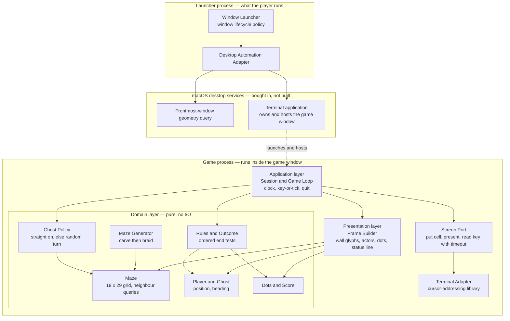
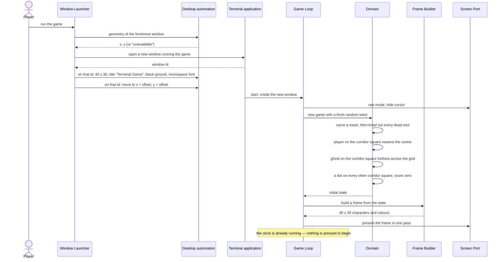
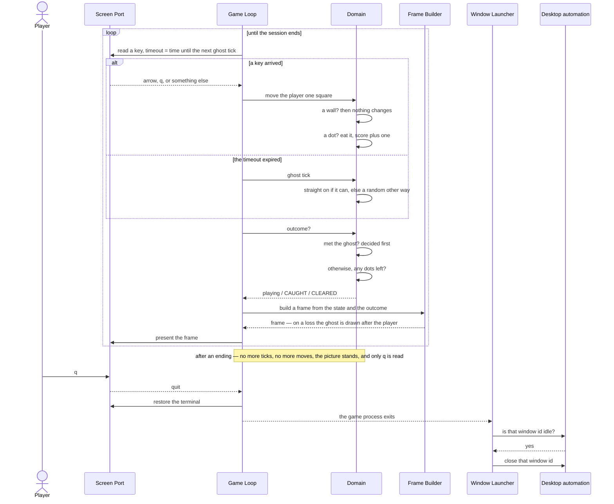
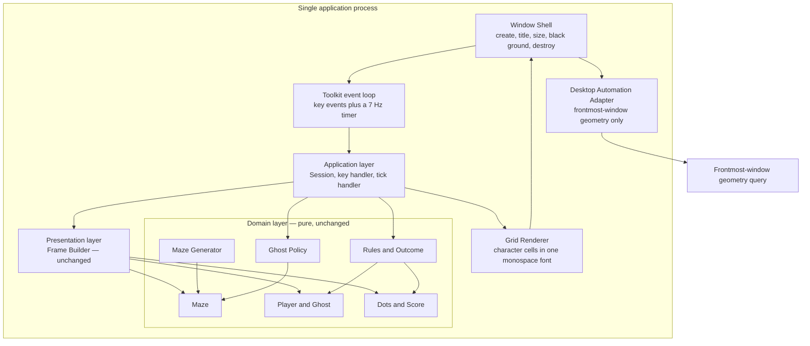
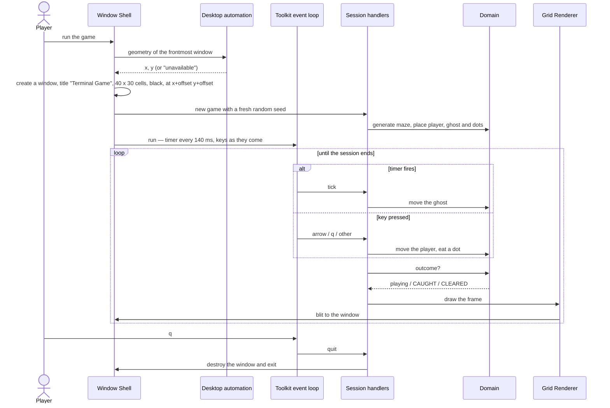

# Terminal Game — Architecture

**Input:** `docs/FUNCTIONAL_REQUIREMENTS.md` (49 requirement codes across ten sections).
**Audience:** the Technical Lead, who will turn one of these candidates into an implementation plan.
**Scope:** layers, components and their responsibilities. No file names, no package layout, no library brands.

---

## 1. What the requirements actually force

Most of the 49 requirements are detail that any sane structure accommodates. Five groups are
load-bearing, and the architecture exists mainly to hold them:

| Driver | Requirements | Why it is architectural |
| --- | --- | --- |
| The app owns a desktop window | WIN-1 … WIN-5 | The app must **create, size, title, position and destroy a window** — and position it relative to a window belonging to *another application*. That is desktop automation, and it lives outside the boundary of a process that is only drawing characters. It forces a component, and probably a process, that is not the game. |
| Two independent event sources | GHOST-1, CTRL-1, CTRL-2 | The ghost moves on a clock at about 7 Hz; the player moves on key presses. Neither waits for the other. The control structure must serve both without the player's idleness stopping the ghost, or the ghost's clock swallowing key presses. |
| A generated maze with global properties | MAZE-4, MAZE-5, MAZE-6 | "No dead ends" and "everywhere reachable" are properties of the whole grid, not of a square. They need a generator that can be run and checked headlessly, thousands of times, with no window and no terminal in the way. That pushes the maze into a pure layer. |
| Glyphs chosen from context | SCRN-3 | A wall's appearance depends on its four neighbours. So there is a real mapping step from *model* to *picture* — the model does not know what it looks like — which is exactly what earns a presentation layer its keep. |
| Ordered end conditions | END-1, END-2, END-3 | The order in which two tests run is itself a requirement. It has to live in one named place, not emerge from where the checks happen to sit in a loop. |

Everything else — scoring, the status line, the controls, the endings — follows once those five are placed.

Two candidates are offered. **They share an identical game core**; they differ only in how the app
comes to own a window and how characters reach the glass. That is deliberate: the shell is the risky
part, and making it the only difference keeps the choice reversible and cheap.

---

## 2. Candidate 1 (favoured) — Launched Terminal Session with a Layered Game Core

### Synopsis

Two processes.

A small **Launcher** is what the player runs. Its only job is the window: it asks the desktop for the
geometry of the window the player was last looking at, creates a new terminal window running the game,
captures that window's identity at the moment of creation, sets its size, title, colours and font,
moves it down-and-right of the remembered geometry, and — when the game process has finished and the
window is idle — closes that window by the identity it captured. It knows nothing about mazes.

The **Game** runs inside that window and is a conventional layered application driven by a game loop:

- a **Domain layer** that is pure — maze, actors, dots, score, rules — with no I/O and no idea that a
  screen exists;
- a **Presentation layer** that turns a domain state into a 40 x 30 grid of characters and colours,
  including the neighbour-sensitive wall glyphs and the status line;
- a **Screen port** with a thin terminal adapter behind it, implemented over a bought-in
  cursor-addressing library (the curses family) — buffered whole-frame output, hidden cursor, raw
  non-echoing keys, a key read with a timeout;
- an **Application layer** — the game loop and the session — which owns the clock, decides whether
  this pass is a key or a tick, drives the domain, and asks the presentation layer for a frame.

Dependencies point inward only: Application → Presentation → Domain, and Application → Screen port.
The Domain depends on nothing.

The two event sources are reconciled without concurrency: **the loop reads a key with a timeout equal
to the time remaining until the next ghost tick.** A key that arrives early is handled at once and the
tick still lands on schedule; no key, and the read times out exactly when the tick is due. One thread,
no locks, and GHOST-1 is satisfied by arithmetic rather than by threads.

### Structure

### Use case 1 — opening the window and starting a game

Covers WIN-1 … WIN-4, MAZE-4, START-1 … START-5, SCRN-7.

### Use case 2 — a pass of the loop, an ending, and the window closing

Covers GHOST-1 … GHOST-4, CTRL-1 … CTRL-5, SCORE-1 … SCORE-5, END-1 … END-6, WIN-5.

### Pros

- Only one component anywhere touches the desktop, and only one touches the terminal. Both risky
  surfaces are isolated behind a single seam each.
- The domain layer is pure, so the hardest requirements (MAZE-5, MAZE-6, GHOST-2/3, END-3) can be
  tested by the thousand with no window, no terminal and no timing.
- Nothing is concurrent. There is no shared mutable state and no lock anywhere in the design.
- It is the idiomatic shape for a terminal game: a game loop over a model, with the terminal reached
  through a cursor-addressing library. A new developer needs no briefing to recognise it.
- The 40 x 30 text grid, box-drawing glyphs and colours are exactly what a terminal is for; nothing
  has to be invented to draw the picture in the specification.

### Cons

- Desktop automation is permission-gated, version-sensitive and the least testable part of the system.
  It is also the part with the most requirements attached to it.
- Two processes means the launcher cannot simply wait on a child: the game is a grandchild of the
  terminal application, so "has it finished?" must be answered by asking the window, not the process
  table.
- The terminal application's own preferences (font, colour scheme, window restore) can fight the
  per-window settings the launcher applies.
- Closing the window is a hazardous operation — see the cautions.

---

## 3. Candidate 2 — Self-Windowing Character-Grid Application

### Synopsis

One process. The application opens its **own** window through a GUI toolkit and paints a 40 x 30 grid
of monospaced glyphs into it. The same Domain layer and the same Frame Builder as Candidate 1 sit
behind it; what changes is the shell:

- a **Window Shell** that creates the window, sets its title and size from the grid metrics, paints a
  black ground, and destroys the window when the session ends — all as direct calls on a window the
  app owns, with nothing to negotiate with another application;
- a **Grid Renderer** that draws a frame of characters and colours into that window using one
  fixed-width font, double-buffered;
- the toolkit's own **event loop**, which delivers key events and a repeating ~7 Hz timer; the
  Application layer becomes a pair of handlers over that loop rather than a loop of its own;
- a **Desktop Automation Adapter** that survives, reduced to a single read-only call: the geometry of
  the frontmost window, needed for WIN-4 and for nothing else.

### Structure

### Use case — opening, playing and closing, in one process

### Pros

- WIN-1, WIN-2, WIN-3 and WIN-5 stop being automation and become ordinary API calls on an object the
  app owns. They become deterministic and testable, and no permission is needed for them.
- No modal-sheet hazard, no risk of acting on the wrong window, no dependence on a terminal
  application's saved preferences.
- One process, one lifecycle. "Has the game finished?" is not a question anyone has to ask.
- The timer and key events arrive on one event loop, so GHOST-1 is still met without threads.

### Cons

- It still needs the automation permission for WIN-4, so the single worst dependency is not actually
  removed — only four of the five window requirements escape it.
- A GUI toolkit, font selection and glyph metrics are a substantial dependency and a substantial body
  of fiddly work, bought to draw 1 200 characters. That is a lot of machinery for the problem.
- The box-drawing and block glyphs in the specification's picture must render correctly and on a
  uniform advance width in whatever font is chosen; terminals solve this already, a fresh window does
  not.
- It is not what "terminal game" means to anyone, including the next developer who opens the repo.
- Everything the terminal gives free — raw non-echoing keys, colour, a text grid, a cursor to hide —
  has to be reimplemented, in small part, by hand.

---

## 4. Alternatives considered and rejected

| Rejected | Why |
| --- | --- |
| **No launcher: the player sizes their own terminal and runs the game.** | WIN-1 … WIN-5 make the window the application's responsibility, not the player's. It also cannot satisfy WIN-4 at all. |
| **Threads: an input thread, a ghost-timer thread and a renderer thread over shared state.** | GHOST-1 needs two sources of *events*, not two threads. A timed read gives exactly that. Threads would add locks, non-determinism and a class of bug this game has no reason to own. |
| **A component/entity framework, a plugin system, or a rules engine.** | One player, one ghost, one maze, one outcome. There is nothing to generalise over. |
| **Splitting the game into a server holding state and a client drawing it.** | Nothing is remote, nothing is shared and nothing is persisted. The process boundary Candidate 1 does have exists because the window genuinely lives outside the game — not for its own sake. |
| **Persisting scores, settings or the maze seed.** | GAME-3 is explicit: one maze, one ghost, one outcome. Nothing in the specification asks for state that outlives the process. |

---

## 5. Recommendation

**Candidate 1.** It is the smaller of the two and the one whose risk is concentrated rather than
spread. Both candidates need the same desktop-automation permission for WIN-4, so Candidate 2's main
advantage is narrower than it first looks — and in exchange for it, Candidate 2 buys a GUI toolkit and
reimplements by hand a text grid, a colour model and raw key handling that a terminal already provides
correctly. Candidate 1 is also the shape a reader expects from the name of the application.

Candidate 2 is a genuine fallback rather than a straw man: if driving the terminal application turns
out to be blocked, unreliable across macOS versions, or unable to produce a 40 x 30 window with a
black ground without changing the player's saved preferences, then Candidate 2 becomes the right
answer — and because the Domain and Presentation layers are identical in both, the switch costs the
shell only.

---

## 6. Coverage — Candidate 1

One row per requirement code in `docs/FUNCTIONAL_REQUIREMENTS.md`. The specification contains
**49 codes**, and all 49 appear below.

| Req | Accommodated by | Note |
| --- | --- | --- |
| GAME-1 | Domain layer: Maze, Player, Ghost, Dots | The whole model in one pure layer; nothing else holds game state. |
| GAME-2 | Domain: Rules and Outcome | CLEARED when no dots remain, CAUGHT on co-location. |
| GAME-3 | Session scope | One game per process. No lives, level, timer, power-up, pause or restart component exists — the absence is the design. |
| WIN-1 | Launcher: window creation | The game process never creates a window. |
| WIN-2 | Launcher: window setup, applied to the captured window id | 40 columns x 30 rows, fixed-width font at a legible size, black background. See Assumption A3 and A7. |
| WIN-3 | Launcher: window setup | Title set to *Terminal Game* on that window id only. |
| WIN-4 | Launcher: frontmost-window query **before** creation, then move by a fixed offset | The query must precede creation, or the launcher's own new window becomes "the window the player was last looking at". Falls back to a default position if refused — Assumption A2. |
| WIN-5 | Launcher: close the captured window id once the game process has exited and the window is idle | **Caveat.** Depends on Assumption A1 — see END-5/END-6 below. As written, WIN-5 and END-5 disagree about the moment of an ending. |
| SCRN-1 | Presentation: Frame Builder | Rows 0–28 from the maze, row 29 from the status line. |
| SCRN-2 | Screen Port | A character-cell interface only; no image capability exists anywhere in the design. |
| SCRN-3 | Presentation: wall-glyph selection, over a four-neighbour query on the Maze | Domain answers "which neighbours are wall"; Presentation owns the glyph table, including the lone-block case. |
| SCRN-4 | Presentation: glyph and colour table | Dim gold, one per corridor square. |
| SCRN-5 | Presentation: glyph and colour table | Distinct glyph *and* distinct colour for player and ghost. |
| SCRN-6 | Presentation: status-line style | Cyan. |
| SCRN-7 | Terminal Adapter | Whole frame composed off-screen and presented in one pass; cursor hidden for the session. See Caution C9. |
| MAZE-1 | Domain: Maze fixed at 19 x 29; Presentation maps each square to two screen columns | 19 x 2 = 38 of 40 columns; the remainder is the blank right margin. Verified against the specification's picture: 29 rows of 37 columns. |
| MAZE-2 | Domain: Maze Generator carves on the odd-coordinate lattice only | Guarantees one-square corridors running only north–south and east–west. Verified: no 2 x 2 open block in 300 generated mazes. |
| MAZE-3 | Domain: Maze Generator never carves the border ring | Solid wall all round, no tunnels. Verified over 300 mazes. |
| MAZE-4 | Domain: Maze Generator seeded afresh per Session | A new layout every game. |
| MAZE-5 | Domain: Maze Generator's braiding pass | Every dead end is opened out. Verified: 0 dead ends across 300 seeds. |
| MAZE-6 | Domain: spanning-tree carve, preserved by braiding | Carving gives connectivity; braiding only ever opens walls, so it cannot break it. Verified: fully connected across 300 seeds. |
| START-1 | Domain: Session setup | Corridor square nearest the grid centre. |
| START-2 | Domain: Session setup | Corridor square at greatest straight-line grid distance from the player — Assumption A6. |
| START-3 | Domain: Session setup | A dot on every corridor square bar the player's. 268 dots in a typical maze. |
| START-4 | Domain: Score initialised to zero | |
| START-5 | Application: the Game Loop ticks from its first pass | There is no title screen and no ready state to leave. |
| CTRL-1 | Application: Game Loop maps the four arrow keys to a move command | |
| CTRL-2 | Application and Domain | One key, one square. No held-direction or auto-repeat state exists anywhere, so drifting is not possible. |
| CTRL-3 | Domain: a move into a wall leaves the state unchanged | Not even the score or the frame changes. |
| CTRL-4 | Application: Game Loop tests for q or Q on every pass | In play and after an ending alike. |
| CTRL-5 | Application discards unmapped keys; Terminal Adapter sets raw, non-echoing mode | Nothing typed can reach the maze. |
| GHOST-1 | Application: the clock, and the key read's timeout set to the time until the next tick | ~140 ms. The tick lands whether or not a key comes, and a key does not postpone it. See Caution C7. |
| GHOST-2 | Domain: Ghost Policy | Continues in its current heading while that way is open. |
| GHOST-3 | Domain: Ghost Policy | Random among the other open ways; reversal only when it is the only one left. MAZE-5 makes that rare by construction. |
| GHOST-4 | Domain: Ghost Policy is given the maze and its own heading only | The player's position is not a parameter, so it cannot hunt. |
| SCORE-1 | Domain: Rules clear the dot on entry | Gone for the rest of the game. |
| SCORE-2 | Domain: Rules add one to the Score | |
| SCORE-3 | Domain: Rules — no dot, no change | |
| SCORE-4 | Domain: the ghost's move touches neither Dots nor Score; Presentation draws the ghost over an intact dot | |
| SCORE-5 | Presentation reads the Score for the status line; only Rules ever changes it, and only upward | |
| END-1 | Domain: Rules test co-location after **every** move | Applied after the player's move and after the ghost's alike, so it does not matter who walked into whom. |
| END-2 | Domain: Rules test for zero dots remaining | |
| END-3 | Domain: Rules evaluate collision before the cleared test, inside one ordered function | The order is stated in one place rather than emerging from the loop. See Caution C6. |
| END-4 | Presentation: fixed draw order, ghost after player | |
| END-5 | Application: once the Outcome is not "playing", the loop issues no more ticks and no more moves; the frame is not rebuilt | **Caveat.** Consistent with WIN-5 only under Assumption A1. |
| END-6 | Application: q remains the only key acted on after an ending | |
| STAT-1 | Presentation: Status Line builder | Nothing else writes to row 29. |
| STAT-2 | Presentation: in-play status text with the live score | `score 0    arrows, q quits` |
| STAT-3 | Presentation: status text selected by Outcome | `CAUGHT  score 37   q quits` / `CLEARED  score 274  q quits` |

**Gaps:** none outright. Two rows carry a caveat — WIN-5 and END-5 — and both trace to the same
unresolved conflict in the specification, recorded as Assumption A1 and Open Question Q1.

---

## 7. Coverage — Candidate 2

The Domain and Presentation layers are identical to Candidate 1, so those rows name the same
components. Rows that differ are marked **[differs]**.

| Req | Accommodated by | Note |
| --- | --- | --- |
| GAME-1 | Domain layer: Maze, Player, Ghost, Dots | Unchanged. |
| GAME-2 | Domain: Rules and Outcome | Unchanged. |
| GAME-3 | Session scope | Unchanged. |
| WIN-1 | **[differs]** Window Shell creates the app's own window | No automation, no terminal application. |
| WIN-2 | **[differs]** Window Shell sizes the window from the grid metrics of the chosen font; paints a black ground | Font choice is the app's, not the player's. |
| WIN-3 | **[differs]** Window Shell sets the window title | A direct API call. |
| WIN-4 | Desktop Automation Adapter: frontmost-window query, then position the new window | Unchanged in substance — the one automation call that survives. |
| WIN-5 | **[differs]** Window Shell destroys the window when the session ends | Same caveat as Candidate 1: depends on Assumption A1. |
| SCRN-1 | Presentation: Frame Builder | Unchanged. |
| SCRN-2 | **[differs]** Grid Renderer draws glyphs from one fixed-width font | No image path exists. |
| SCRN-3 | Presentation: wall-glyph selection | Unchanged. See Caution C13 on glyph coverage in the chosen font. |
| SCRN-4 | Presentation: glyph and colour table | Unchanged. |
| SCRN-5 | Presentation: glyph and colour table | Unchanged. |
| SCRN-6 | Presentation: status-line style | Unchanged. |
| SCRN-7 | **[differs]** Grid Renderer double-buffers and blits a whole frame; there is no text cursor to hide | |
| MAZE-1 | Domain: Maze at 19 x 29; Presentation maps each square to two cells | Unchanged. |
| MAZE-2 | Domain: Maze Generator | Unchanged. |
| MAZE-3 | Domain: Maze Generator | Unchanged. |
| MAZE-4 | Domain: Maze Generator | Unchanged. |
| MAZE-5 | Domain: braiding pass | Unchanged. |
| MAZE-6 | Domain: spanning-tree carve | Unchanged. |
| START-1 | Domain: Session setup | Unchanged. |
| START-2 | Domain: Session setup | Unchanged. |
| START-3 | Domain: Session setup | Unchanged. |
| START-4 | Domain: Score at zero | Unchanged. |
| START-5 | **[differs]** the toolkit timer is started with the window; no input is awaited | |
| CTRL-1 | **[differs]** Application: key handler on the toolkit event loop | |
| CTRL-2 | Application and Domain | Unchanged — but see Caution C14 on toolkit key auto-repeat. |
| CTRL-3 | Domain: a move into a wall changes nothing | Unchanged. |
| CTRL-4 | **[differs]** Application: key handler tests for q or Q | |
| CTRL-5 | **[differs]** unmapped keys are discarded; there is no echo path into the window at all | Structurally simpler than the terminal case. |
| GHOST-1 | **[differs]** toolkit repeating timer at ~140 ms, on the same event loop as keys | |
| GHOST-2 | Domain: Ghost Policy | Unchanged. |
| GHOST-3 | Domain: Ghost Policy | Unchanged. |
| GHOST-4 | Domain: Ghost Policy | Unchanged. |
| SCORE-1 | Domain: Rules | Unchanged. |
| SCORE-2 | Domain: Rules | Unchanged. |
| SCORE-3 | Domain: Rules | Unchanged. |
| SCORE-4 | Domain and Presentation | Unchanged. |
| SCORE-5 | Domain and Presentation | Unchanged. |
| END-1 | Domain: Rules | Unchanged. |
| END-2 | Domain: Rules | Unchanged. |
| END-3 | Domain: Rules, one ordered function | Unchanged. |
| END-4 | Presentation: fixed draw order | Unchanged. |
| END-5 | **[differs]** the tick handler returns immediately and the key handler accepts only q once the Outcome is not "playing" | Same caveat as Candidate 1. |
| END-6 | **[differs]** key handler | |
| STAT-1 | Presentation: Status Line builder | Unchanged. |
| STAT-2 | Presentation | Unchanged. |
| STAT-3 | Presentation | Unchanged. |

**Gaps:** none outright; the same two caveated rows, WIN-5 and END-5.

---

## 8. Assumptions

- **A1 — "the game ends" in WIN-5 means the session exits, not the moment of a win or a loss.**
  WIN-5 says the window closes as soon as the game ends; END-5 says the last picture stays on screen
  and END-6 says `q` is the only way to leave a finished game. Those cannot all hold at the instant of
  a win or loss. I have read them as: the ending freezes the picture, and the window closes by itself
  — without the player having to close it — when the player quits. *What depends on it:* the WIN-5 and
  END-5 coverage rows and the tail of the second sequence diagram. Cheap to flip: it moves one signal
  earlier inside one component.
- **A2 — the one-off macOS Automation / Accessibility permission may be relied on**, and the player
  will be asked for it once. A refusal degrades to a sensible default window position rather than
  aborting the game.
- **A3 — the system-supplied terminal application may be driven, per window**, without altering the
  player's saved preferences or installing a profile.
- **A4 — "a little below and to the right" is a small fixed offset** chosen by the implementer, with
  the result clamped to the visible screen so the window always lands somewhere visible, as WIN-4
  requires.
- **A5 — each maze square occupies two screen columns and each screen row is one maze row.** Taken
  from the specification's own picture, which I measured: 29 rows of 37 columns, 19 squares across,
  with the last square contributing one column and three columns of right margin left over. The player
  and ghost glyphs are three columns wide, drawn centred over their square and bleeding one column into
  the square to the west.
- **A6 — START-2's "measured across the grid rather than along the corridors" means straight-line
  grid distance**, not corridor distance. The implementer should pick one metric, state it, and keep
  it in the domain layer.
- **A7 — the chosen font and terminal render the box-drawing and block glyphs of the specification's
  picture at a uniform advance width**, and colour is available for blue, gold, yellow, pink and cyan.
- **A8 — no persistence, no configuration file and no command-line options** beyond whatever the
  launcher must pass the game. Nothing in the specification asks for state outliving the process.
- **A9 — "about seven times a second" is a target, not a real-time guarantee.** A late tick is
  absorbed; missed ticks are not queued up and replayed.
- **A10 — one player at the machine, one game at a time.** Two copies running at once is not a case
  the specification contemplates and the design does not defend against it.

## 9. Cautions for the implementers

- **C1 — never act on "the front window".** Capture the window's identity at the moment of creation
  and act only on that identity, for every subsequent operation. The player's own shells — and the
  session running this project — are windows in the very same application.
- **C2 — never close a busy window.** Confirm the game process has exited and the window is idle
  first. Closing a window with a live process raises a modal sheet that only a human can dismiss, and
  it will block every automation call that follows.
- **C3 — clean up on the failure path too.** If setup fails after the window exists, close it by its
  captured identity rather than leaving an orphan on the player's desktop.
- **C4 — never launch anything from the launcher that can block forever.** Every automation call and
  every wait needs a bound and a way out.
- **C5 — keep the domain free of screen geometry.** Two-columns-per-square, three-column actor glyphs
  and the 40 x 30 frame belong to the Presentation layer. If that geometry leaks into the Maze, the
  maze tests stop being about mazes and MAZE-5 and MAZE-6 become much harder to check.
- **C6 — END-3 is one ordered function in Rules.** Do not spread the collision test and the
  last-dot test across the loop, or the order becomes an accident of control flow that a later change
  can silently reverse. It deserves its own test.
- **C7 — recompute the key-read timeout every pass** from the clock, as the time remaining until the
  next tick. A fixed sleep, or a fixed timeout, makes every key press postpone the ghost and quietly
  breaks GHOST-1.
- **C8 — restrict braiding to the same odd-coordinate lattice the carve used.** Opening an arbitrary
  wall can create a 2 x 2 open block and break MAZE-2. With the restriction I measured 0 such blocks,
  0 dead ends and full connectivity across 300 generated mazes; without it, no such guarantee.
- **C9 — redraw the whole frame each pass, not dirty cells.** The actor glyphs are three columns wide
  and overwrite a column of the neighbouring square; a dirty-cell optimisation would leave debris.
  1 200 cells at 7 Hz does not need optimising.
- **C10 — restore the terminal on every exit path**, including an unhandled error, or the player is
  left with a broken shell — possibly in a window that is then closed out from under them.
- **C11 — only the launcher touches the desktop.** If the game process also starts moving or titling
  windows, two components own the same state and the failure modes multiply.
- **C12 — the specification contains 49 requirement codes, not 58.** If a downstream document reports
  58, something is being double-counted; the breakdown is GAME 3, WIN 5, SCRN 7, MAZE 6, START 5,
  CTRL 5, GHOST 4, SCORE 5, END 6, STAT 3.
- **C13 — (Candidate 2 only) check glyph coverage before committing to a font.** A GUI window will
  cheerfully render a missing box-drawing character as a blank or a substitute box, and at a different
  advance width, which destroys the grid.
- **C14 — (Candidate 2 only) disable key auto-repeat** or CTRL-2 is broken: a held arrow key will
  drift the player, which the requirement forbids.

## 10. Open questions for a human

These were written as `ASK` lines in `docs/progress/architect.md` as they arose, each with the
assumption I proceeded on. None of them blocked the work; all are cheap to settle.

- **Q1 — At the moment of a win or a loss, does the window close (WIN-5) or does the final picture
  stay until `q` (END-5, END-6)?** Proceeding on Assumption A1: the picture stays, the window closes
  on quit.
- **Q2 — May the game rely on the one-off macOS Automation / Accessibility permission** needed to
  read the frontmost window's position and to drive the window? Proceeding on Assumption A2: yes, with
  a documented fallback position.
- **Q3 — Which terminal application may be automated, and may anything about it be changed?**
  Proceeding on Assumption A3: the system-supplied terminal, driven per window, saved preferences left
  alone.
