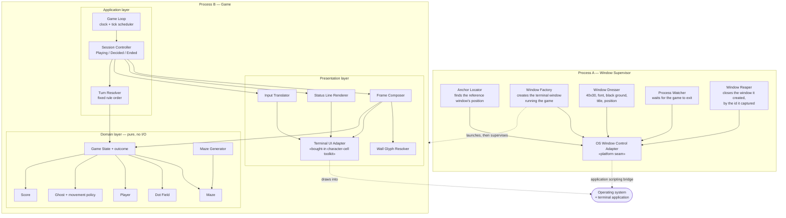
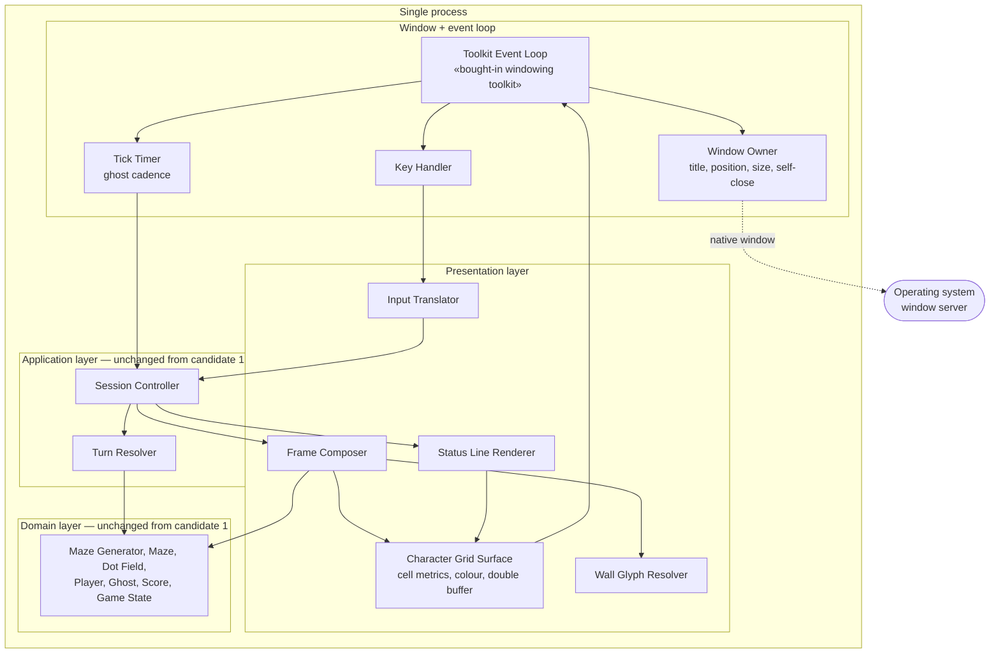
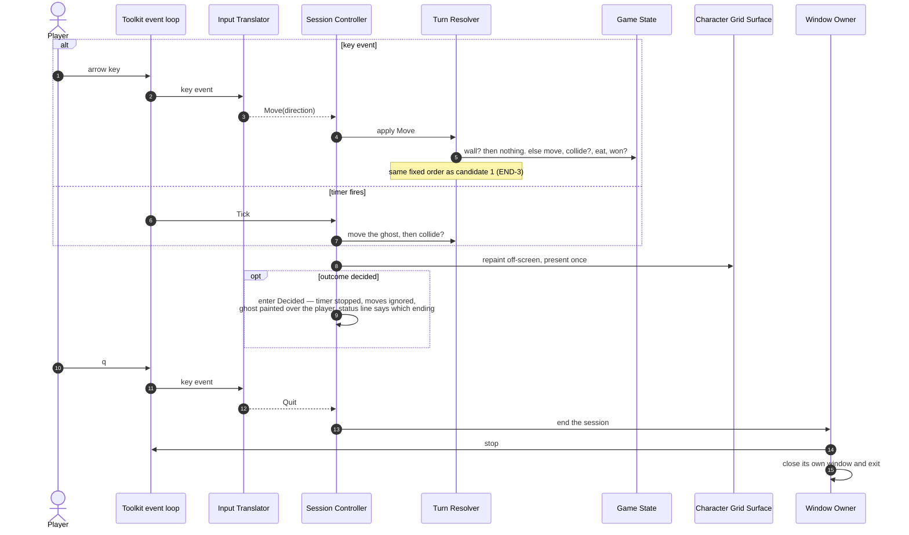

# Terminal Game — Architecture

**For:** the Technical Lead
**From:** the Architect
**Input:** `docs/FUNCTIONAL_REQUIREMENTS.md` (49 requirement codes, verified count, no duplicates)

Two candidate architectures are described below, in order of favourability.
**Candidate 1 is the recommendation.** Candidate 2 is a genuine alternative,
described honestly, so that the reasons for the ordering are visible and can be
re-examined if one of the assumptions in section 4 turns out to be wrong.

---

## 1. The forces that decide the architecture

Most of the 49 requirements are ordinary game logic and do not push the
architecture in any particular direction. Four groups do:

**F1 — The window is not the game's own (WIN-1, WIN-2, WIN-4, WIN-5).** The
application must appear in a window of its own, exactly 40 columns by 30 rows,
placed relative to another window, and disappear when it is finished. A
character-mode program cannot create, size, place or close the window it is
running inside; it can only draw in whatever it has been given. So *something
outside the game* must own the window's life. This is the single largest force
in the specification and it is what makes the shape of the two candidates
differ.

**F2 — Real-time and interactive at once (GHOST-1, CTRL-1, CTRL-2, SCRN-7).**
The ghost moves about seven times a second regardless of the player, while key
presses must be acted on as they arrive and the picture must not flicker. That
calls for the **Game Loop** pattern with a scheduled tick — not a
read-a-key-then-redraw command loop.

**F3 — Ordering is a requirement, not an implementation detail (END-1, END-2,
END-3).** "Eating the last dot on the ghost's square is a loss, not a win"
means the rules must be applied in a *fixed, named order*. An architecture that
scatters rule evaluation across the movement code will get this wrong and will
keep getting it wrong. The order belongs in one place.

**F4 — The maze must satisfy three structural invariants (MAZE-4, MAZE-5,
MAZE-6).** Random, no dead ends, fully connected. This is a self-contained
algorithmic problem with no I/O, and it is the part of the system most likely to
be got subtly wrong. It must sit where it can be tested exhaustively without a
terminal, a window or a clock.

A fifth, non-functional force follows from the way this project is being built
(work reviewed through real pull requests, on a machine somebody is watching):
**the game must be exercisable in tests without opening a window on anybody's
desktop.** Both candidates therefore keep the platform at arm's length behind a
single named seam, and keep the clock and the input stream injectable.

---

## 2. Candidate 1 — Supervisor plus layered game loop *(recommended)*

### Synopsis

Two processes. A short-lived **Window Supervisor** owns the operating system
window: it finds the anchor window, creates a terminal window running the game,
dresses it (size, font, colours, title, position), waits for the game to exit,
and then closes the window it created. It talks to the platform through one
**OS Window Control Adapter** and knows nothing about mazes or ghosts.

The **Game** process is a conventional three-layer application — Presentation,
Application, Domain — driven by a single-threaded game loop. The Domain layer is
pure: no clock, no terminal, no randomness it was not handed. The Presentation
layer reaches the terminal only through a bought-in character-cell UI toolkit
(the curses family), which supplies colour, non-blocking timed input, cursor
suppression and flicker-free double-buffered repaint as off-the-shelf
capability rather than as code to be written.

The architecture is deliberately small. There is no message bus, no entity
system, no plug-in points and no second thread. Every one of those was
considered and rejected in section 5.

### Structure



Dependency rule, enforced by review: **Presentation → Application → Domain.**
The Domain layer names nothing above it, imports no terminal, reads no clock and
creates no randomness — it is handed a random source and a maze and asked
questions. That is what makes F4 testable.

### Use case 1 — launching a game

```mermaid
sequenceDiagram
  autonumber
  actor Player
  participant Sup as Window Supervisor
  participant OS as OS window control adapter
  participant Loop as Game Loop
  participant Sess as Session Controller
  participant Gen as Maze Generator
  participant State as Game State
  participant Rend as Frame Composer
  participant Term as Terminal UI adapter

  Player->>Sup: start the game
  Sup->>OS: position of the anchor window
  OS-->>Sup: anchor position
  Sup->>OS: create window running the game
  OS-->>Sup: window id + tab handle
  Sup->>OS: 40 columns, 30 rows, font, black ground, title
  Sup->>OS: place at anchor + offset
  Note over Sup,OS: the id is captured at creation and never re-looked-up

  Sup-->>Loop: (the game is already running in that window)
  Loop->>Term: hide cursor, no echo, colour pairs, input timeout
  Loop->>Gen: lay out a maze (random source)
  Gen-->>Loop: maze satisfying no-dead-ends and fully-connected
  Loop->>State: place player at centre, ghost at furthest square,<br/>dot on every other corridor square, score 0
  Loop->>Sess: enter Playing
  Sess->>Rend: compose frame
  Rend->>Term: write the whole frame off-screen, flush once
  Note over Term: first picture is on screen before any key is pressed
  Loop->>Loop: begin ticking at the ghost cadence
```

### Use case 2 — one tick, and the end of the session

```mermaid
sequenceDiagram
  autonumber
  actor Player
  participant Term as Terminal UI adapter
  participant In as Input Translator
  participant Loop as Game Loop
  participant Sess as Session Controller
  participant Turn as Turn Resolver
  participant State as Game State
  participant Ghost as Ghost policy
  participant Rend as Frame Composer
  participant Sup as Window Supervisor

  Loop->>Term: wait for a key, timeout = time left in this tick
  alt a key arrives first
    Player->>Term: arrow key
    Term-->>In: raw key
    In-->>Sess: Move(direction)
    Sess->>Turn: apply Move
    Turn->>State: is the target square a wall?
    alt wall
      Note over Turn: nothing happens at all (CTRL-3)
    else corridor
      Turn->>State: move the player one square
      Turn->>State: same square as the ghost? -> LOST
      Turn->>State: dot here? eat it, score + 1
      Turn->>State: dots all gone? -> WON
      Note over Turn: collision is always tested before the win (END-3)
    end
  else the tick budget expires first
    Loop->>Sess: Tick
    Sess->>Ghost: next square (maze + own state only,<br/>the player is not an argument)
    Ghost-->>Turn: straight on, else a random non-reverse exit
    Turn->>State: move the ghost
    Turn->>State: same square as the player? -> LOST
  end
  Sess->>Rend: compose frame
  Rend->>Term: flush once — no flicker, cursor hidden

  opt outcome decided
    Sess->>Sess: enter Decided
    Note over Sess: ghost no longer ticked, arrows ignored,<br/>last picture stays, ghost drawn over the player
    Sess->>Rend: status line reads CAUGHT / CLEARED + final score
  end

  Player->>Term: q
  Term-->>In: raw key
  In-->>Sess: Quit
  Sess->>Loop: enter Ended
  Loop->>Term: restore the terminal, exit the process
  Sup->>Sup: notice the game process has exited
  Sup->>Sup: close the captured window id
```

### Pros

- **Six of the seven `SCRN-*` requirements are bought, not built.** Colour
  attributes, a hidden cursor, an off-screen buffer flushed in one write, and a
  timed non-blocking key read all come with the character-cell toolkit. Nothing
  here is written from scratch.
- **The platform-specific part is small, isolated and measured.** It is one
  adapter with five callers, and its whole surface is: read a window position,
  create a window running a command, set six properties, test whether a tab is
  busy, close a window. I exercised that sequence live on this machine (see
  section 6) and it worked.
- **The Domain layer is testable with no terminal and no window.** MAZE-4/5/6,
  START-1/2/3, GHOST-2/3/4 and every `SCORE-*` and `END-*` rule can be driven
  from a plain test with a seeded random source and a fake clock. Given how this
  project is reviewed, that matters.
- **F3 is satisfied by structure.** END-3 is not a line of code somebody must
  remember; it is the order of steps inside one named Turn Resolver.
- **It is the smallest thing that works.** One loop, one thread, one process for
  the game and one small supervisor. A new developer can hold all of it in mind.

### Cons

- **Two processes instead of one**, and a start-up race between them: the game
  begins drawing into an 80x24 window a fraction of a second before the
  supervisor resizes it to 40x30. The game must therefore react to a resize and
  re-lay out. This is a real obligation on the implementation — see caution C1.
- **WIN-3 is not fully proven.** With every scriptable title component switched
  off and a custom title set, the terminal still reported a composed name. See
  assumption A1 and caution C2; this is the weakest coverage row in the table.
- **The supervisor is platform-specific.** It will not run anywhere but macOS
  without being rewritten. Given the requirements, that cost is accepted rather
  than designed around; nothing in the specification asks for portability, and
  "if in doubt, leave it out".
- **Automation consent.** Driving the terminal application from a script needs
  the user's permission unless the launcher is itself started from that same
  application. Verified free in the normal case, but see caution C3.

### Coverage — all 49 requirements

| Req | Where it is accommodated | |
|---|---|---|
| GAME-1 | Domain layer: Maze, Dot Field, Player, Ghost — one of each, in one grid | ✅ |
| GAME-2 | Turn Resolver sets the outcome on Game State; Session Controller acts on it | ✅ |
| GAME-3 | By omission, deliberately: the Session Controller has exactly three states and no restart edge; there is no lives counter, level loader, timer or pause anywhere in the structure | ✅ |
| WIN-1 | Window Factory (Supervisor) creates a new terminal window | ✅ |
| WIN-2 | Window Dresser sets 40 columns × 30 rows, font size and black background as per-window properties. Size and background measured working. Font size is a constant chosen by eye — assumption A4 | ⚠️ |
| WIN-3 | Window Dresser sets the custom title and switches off every scriptable title component. **Measured shortfall:** the terminal still composed extra title parts. Assumption A1, caution C2 | ⚠️ |
| WIN-4 | Anchor Locator reads the reference window's position; Window Dresser places the new window at an offset from it. **Caveat:** the anchor is the terminal application's own frontmost window, not any application's — assumption A2 | ⚠️ |
| WIN-5 | Process Watcher waits for the game process to exit, then Window Reaper closes the captured window id. **Caveat:** "as soon as the game ends" read as "when the session ends" — assumption A3 | ⚠️ |
| SCRN-1 | Frame Composer owns rows 0–28 (maze); Status Line Renderer owns row 29, exclusively | ✅ |
| SCRN-2 | Terminal UI Adapter: the medium is character cells, so no image can be drawn even by accident | ✅ |
| SCRN-3 | Wall Glyph Resolver — a pure function from a wall square's four neighbours to one of the line glyphs, and to the lone-block glyph when it has none | ✅ |
| SCRN-4 | Frame Composer reads the Dot Field and draws the dim gold glyph, one per corridor square | ✅ |
| SCRN-5 | Frame Composer draws each actor with its own glyph *and* its own colour pair, so the two differ in both | ✅ |
| SCRN-6 | Status Line Renderer uses the cyan colour pair | ✅ |
| SCRN-7 | Terminal UI Adapter: whole frame composed off-screen and flushed once per redraw; cursor suppressed at start-up. Both capabilities verified present | ✅ |
| MAZE-1 | Maze is a fixed 19 × 29 grid; Frame Composer owns the mapping of one grid square to two terminal columns (19 × 2 = 38) leaving a 2-column right-hand margin. Arithmetic verified against the specimen picture | ✅ |
| MAZE-2 | Maze Generator carves only single-width, axis-aligned corridors; Maze stores each square as wall or corridor and nothing else | ✅ |
| MAZE-3 | Maze Generator never carves the border ring; there is no wrap-around anywhere in the movement code | ✅ |
| MAZE-4 | Maze Generator takes a random source, freshly seeded each run | ✅ |
| MAZE-5 | Maze Generator: a no-dead-ends invariant enforced during or immediately after carving — no corridor square may have fewer than two corridor neighbours. The riskiest single algorithm in the system; see caution C4 | ✅ |
| MAZE-6 | Maze Generator: a connectivity check over the carved grid before the maze is handed out | ✅ |
| START-1 | Game State setup: the corridor square nearest the grid centre | ✅ |
| START-2 | Game State setup: the corridor square at the greatest straight-line grid distance from the player, explicitly **not** corridor distance | ✅ |
| START-3 | Dot Field seeded from every corridor square except the player's start square | ✅ |
| START-4 | Score initialised to zero | ✅ |
| START-5 | Game Loop begins ticking as soon as the first frame is composed; the Session Controller has no "ready" or "press to start" state to pass through | ✅ |
| CTRL-1 | Input Translator maps the four arrow keys to Move intents; Turn Resolver applies one square | ✅ |
| CTRL-2 | Turn Resolver applies exactly one square per intent. There is no held-key state, no auto-repeat and no player velocity anywhere in the Domain layer — the player cannot drift because nothing can move them but an intent | ✅ |
| CTRL-3 | Turn Resolver consults the Maze first and discards a blocked move: no tick consumed, no state change, no redraw | ✅ |
| CTRL-4 | Input Translator maps `q` and `Q` to a Quit intent; the Session Controller honours Quit in every state | ✅ |
| CTRL-5 | Input Translator discards every unmapped key; the Terminal UI Adapter is configured with echo off | ✅ |
| GHOST-1 | Game Loop ticks at the ghost cadence (~7/s, ~143 ms) from a monotonic clock, independent of whether any key arrived | ✅ |
| GHOST-2 | Ghost movement policy: continue in the current direction while the corridor allows it | ✅ |
| GHOST-3 | Ghost movement policy: at a junction choose uniformly at random among the exits other than the one it came from; reverse only when that set is empty | ✅ |
| GHOST-4 | Ghost movement policy is given the maze and its own state and *nothing else* — the player is not a parameter, so it cannot hunt even by mistake | ✅ |
| SCORE-1 | Turn Resolver asks the Dot Field to take the dot; the Dot Field removes it permanently | ✅ |
| SCORE-2 | Turn Resolver increments Score when, and only when, a dot was actually taken | ✅ |
| SCORE-3 | Dot Field reports "no dot" for an already-eaten square, so no increment happens | ✅ |
| SCORE-4 | The Ghost policy has no reference to the Dot Field; the Frame Composer draws the ghost over the dot without disturbing it | ✅ |
| SCORE-5 | Status Line Renderer reads Score; Score exposes increment only, so it cannot fall | ✅ |
| END-1 | Turn Resolver tests player/ghost co-location after the player's move *and* after the ghost's move — both arms of the sequence diagram | ✅ |
| END-2 | Turn Resolver tests for an empty Dot Field after eating | ✅ |
| END-3 | Turn Resolver's fixed step order: move → collision → eat → win. Guaranteed by structure, not by discipline | ✅ |
| END-4 | Frame Composer's draw order: player first, ghost second, so the ghost covers the player in the final picture | ✅ |
| END-5 | Session Controller's Decided state: the Game Loop stops ticking the ghost, the Turn Resolver is not offered Move intents, and the last frame is left standing | ✅ |
| END-6 | Session Controller's Decided state accepts the Quit intent and no other | ✅ |
| STAT-1 | Status Line Renderer owns the whole of row 29 and writes nothing else there; no other component may write to it | ✅ |
| STAT-2 | Status Line Renderer's Playing format, reading the live Score | ✅ |
| STAT-3 | Status Line Renderer's Decided format, selected by the outcome held on Game State | ✅ |

**Not accommodated: none.** Four rows carry caveats (WIN-2, WIN-3, WIN-4,
WIN-5), all four of them in the Window Supervisor and all four traceable to an
assumption in section 4. WIN-3 is the one to watch: it is the only row where I
measured a result that falls short of a literal reading of the requirement.

---

## 3. Candidate 2 — Single-process windowed character grid

### Synopsis

One process. The application creates and owns its own native window: it sets
the title, the position and the size, and it closes the window itself when it
is finished. Inside that window it paints a 40 × 30 grid of characters in a
fixed-width typeface on a black ground — the same picture as candidate 1, but
drawn onto a graphical surface rather than emitted as terminal control codes.

The Application and Domain layers are **identical to candidate 1** — the same
Session Controller, Game Loop, Turn Resolver, Maze Generator, Ghost policy and
Game State, with the same dependency rule. What changes is everything from the
Presentation layer down, and the disappearance of the second process.

Control is inverted. Candidate 1 owns its loop and asks the terminal for a key
with a timeout; here the windowing toolkit owns the loop and calls the
application back — once per key press, and once per expiry of a repeating timer
set to the ghost's cadence.

### Structure



### Use case 1 — launching a game

```mermaid
sequenceDiagram
  autonumber
  actor Player
  participant Own as Window Owner
  participant OS as Window server
  participant Grid as Character Grid Surface
  participant Sess as Session Controller
  participant Gen as Maze Generator
  participant Ev as Toolkit event loop

  Player->>Own: start the game
  Own->>Grid: cell size for the chosen font
  Grid-->>Own: 40 cells wide, 30 rows deep = this many pixels
  Own->>OS: query the anchor window's position
  OS-->>Own: anchor position
  Own->>OS: create a window, that size, titled "Terminal Game",<br/>black ground, at anchor + offset
  Note over Own,OS: title, size and placement are exact —<br/>nothing else composes the title
  Own->>Gen: lay out a maze
  Gen-->>Sess: maze satisfying no-dead-ends and fully-connected
  Sess->>Sess: place player, ghost, dots; score 0; enter Playing
  Sess->>Grid: compose and paint the first frame
  Own->>Ev: start the timer at the ghost cadence and hand over control
```

### Use case 2 — one tick, and the end of the session



### Pros

- **The window requirements become exact and certain.** The title is whatever
  the application says it is, with nothing composed around it; the position is
  set directly; the window closes because the process that owns it closes it.
  WIN-3, in particular, stops being a caveat and becomes a fact.
- **One process, no supervisor, no start-up race.** The window is the right
  size before the first frame is painted, so caution C1 disappears.
- **No application-scripting bridge and no automation consent.** A process
  creating its own window needs no permission from anybody.
- **The Domain and Application layers are unchanged**, so the algorithmic heart
  of the system is exactly as testable as in candidate 1.

### Cons

- **You rebuild the whole presentation medium.** Character cells, cell metrics,
  colour attributes, a double-buffered repaint and glyph alignment for the
  double-line box-drawing characters all become code to write and get right —
  all of which candidate 1 receives, working, from the character-cell toolkit.
  This is the decisive objection: it is a large amount of built capability
  replacing a small amount of bought capability, which is the opposite of what
  the brief asks for.
- **"40 characters wide and 30 rows deep" becomes derived rather than native.**
  The window is a pixel rectangle computed from font metrics. It will be right,
  but it is right by calculation, and a font substitution silently changes it.
  In candidate 1, 40 × 30 is a property you set and read back.
- **It does not escape the WIN-4 anchor question.** Finding the window the
  player was last looking at still needs the same privileged query of another
  application's windows. Assumption A2 applies unchanged.
- **"There are no images" (SCRN-2) becomes a convention.** On a graphical
  surface nothing prevents a later developer drawing one. In candidate 1 the
  medium enforces it.
- **A heavier dependency, and a less direct path to running the game.** A
  developer wanting to see the effect of a change must open a window; the
  terminal program can also be driven headlessly.
- **It is not a terminal program.** That is not a functional objection, but the
  specification's whole idiom — character cells, a status line, `q` quits, a
  40 × 30 window — is the idiom of one, and departing from it will surprise
  every reader of the code.

### Coverage — all 49 requirements

| Req | Where it is accommodated | |
|---|---|---|
| GAME-1 | Domain layer, unchanged from candidate 1 | ✅ |
| GAME-2 | Turn Resolver + Game State outcome | ✅ |
| GAME-3 | By omission: three session states, no restart edge | ✅ |
| WIN-1 | Window Owner creates the application's own native window | ✅ |
| WIN-2 | Window Owner sizes the window to 40 × 30 cells derived from the font's cell metrics; black ground and font size set directly. Font size still a by-eye constant (A4) | ⚠️ |
| WIN-3 | Window Owner sets the window title directly — exact, no composition | ✅ |
| WIN-4 | Window Owner queries the anchor window, then places itself at an offset. Same caveat as candidate 1 (A2) | ⚠️ |
| WIN-5 | Window Owner closes its own window on leaving the session. Timing reading A3 still applies | ⚠️ |
| SCRN-1 | Frame Composer rows 0–28; Status Line Renderer row 29 | ✅ |
| SCRN-2 | Honoured by convention only — the surface could draw images. Caution C5 | ⚠️ |
| SCRN-3 | Wall Glyph Resolver, unchanged from candidate 1 | ✅ |
| SCRN-4 | Frame Composer + Dot Field | ✅ |
| SCRN-5 | Frame Composer: distinct glyph and colour per actor | ✅ |
| SCRN-6 | Status Line Renderer, cyan | ✅ |
| SCRN-7 | Character Grid Surface must implement its own double buffer and never show a caret. Built, not bought | ✅ |
| MAZE-1 | Maze 19 × 29; Character Grid Surface owns the two-columns-per-square mapping and the right margin | ✅ |
| MAZE-2 | Maze Generator, unchanged | ✅ |
| MAZE-3 | Maze Generator, unchanged | ✅ |
| MAZE-4 | Maze Generator + seeded random source | ✅ |
| MAZE-5 | Maze Generator no-dead-ends invariant. Caution C4 applies equally | ✅ |
| MAZE-6 | Maze Generator connectivity check | ✅ |
| START-1 | Game State setup, nearest corridor square to the centre | ✅ |
| START-2 | Game State setup, greatest straight-line grid distance | ✅ |
| START-3 | Dot Field minus the player's start square | ✅ |
| START-4 | Score initialised to zero | ✅ |
| START-5 | Timer started and first frame painted before control is handed to the event loop | ✅ |
| CTRL-1 | Key Handler → Input Translator → Move intent | ✅ |
| CTRL-2 | One intent, one square; no velocity state | ✅ |
| CTRL-3 | Turn Resolver discards a blocked move | ✅ |
| CTRL-4 | Input Translator maps `q`/`Q` to Quit, honoured in every state | ✅ |
| CTRL-5 | Input Translator discards unmapped keys; a graphical surface echoes nothing by nature | ✅ |
| GHOST-1 | Repeating toolkit timer at the ghost cadence | ✅ |
| GHOST-2 | Ghost movement policy, unchanged | ✅ |
| GHOST-3 | Ghost movement policy, unchanged | ✅ |
| GHOST-4 | Ghost movement policy takes no player argument | ✅ |
| SCORE-1 | Turn Resolver + Dot Field | ✅ |
| SCORE-2 | Turn Resolver increments Score | ✅ |
| SCORE-3 | Dot Field reports no dot | ✅ |
| SCORE-4 | Ghost policy never touches the Dot Field | ✅ |
| SCORE-5 | Score exposes increment only | ✅ |
| END-1 | Collision tested after both moves | ✅ |
| END-2 | Empty Dot Field tested after eating | ✅ |
| END-3 | Turn Resolver's fixed step order | ✅ |
| END-4 | Frame Composer paints the player, then the ghost | ✅ |
| END-5 | Decided state: timer stopped, moves ignored, last frame left standing | ✅ |
| END-6 | Decided state accepts Quit only | ✅ |
| STAT-1 | Status Line Renderer owns row 29 exclusively | ✅ |
| STAT-2 | Playing format | ✅ |
| STAT-3 | Decided format selected by the outcome | ✅ |

**Not accommodated: none.** Candidate 2 closes candidate 1's WIN-3 caveat and
opens a new one at SCRN-2. Its objection is cost, not coverage — which is
precisely why it is second and not first.

---

## 4. Assumptions

Each of these was recorded as an `ASK` in the progress log at the moment it
arose, with the assumption written immediately after it. None of them has been
answered. The blast radius is given so that an answer arriving later has a known
set of places to change.

- **A1 — The window title will read "Terminal Game" with the per-window custom
  title set and every scriptable title component switched off.** I could not
  confirm this: with all four settable components off and the custom title set,
  the terminal still reported its window name as `rodneybailey — Terminal Game —
  sleep 2`. I could not see the actual titlebar, and reading it requires a
  privilege only the user can grant. *Rests on it:* the Window Dresser's
  titling step and the WIN-3 coverage row. *If wrong:* the Window Supervisor
  must own a dedicated terminal profile instead — which collides with A5.
- **A2 — "Whatever window the player was last looking at" means the frontmost
  window of the terminal application.** Reading the frontmost window of *any*
  application needs Accessibility permission, which a script cannot grant
  itself. In practice the game is started from a terminal window, so that
  window is the one the player was last looking at. *Rests on it:* the Anchor
  Locator and the WIN-4 coverage row, in both candidates. *If wrong:* the
  Anchor Locator gains a permission prompt at first run.
- **A3 — WIN-5's "as soon as the game ends" means when the session ends, not
  when the outcome is decided.** WIN-5 as written contradicts END-5 ("the last
  picture stays on screen") and END-6 ("`q` is the only way to leave a finished
  game"). The only reading that satisfies all three is: outcome decided → final
  picture shown → player presses `q` → process exits → the window closes itself
  without the player having to close it. *Rests on it:* the Session
  Controller's terminal state and the WIN-5, END-5 and END-6 rows. **This is
  the assumption I would most like answered**, because it is the only one where
  the requirements are in genuine conflict rather than merely under-specified.
- **A4 — "Large enough to read comfortably" is a fixed point size chosen by
  eye.** No objective test exists. *Rests on it:* one constant in the Window
  Dresser and the WIN-2 row.
- **A5 — The game may not create or modify a terminal profile in the user's
  preferences.** A profile persists after the game exits and is visible to the
  user, so I have assumed it is off limits and used per-window properties only.
  *Rests on it:* the WIN-2 and WIN-3 rows. *If the user permits a profile,* A1
  becomes cheap to satisfy.
- **A6 — The specimen picture in the requirements is normative for the
  grid-to-screen mapping.** One maze square is drawn as two terminal columns by
  one row; 19 × 2 = 38 columns, leaving a 2-column right-hand margin in a
  40-column window. This is measured from the picture, not stated in prose, but
  it is the only mapping under which MAZE-1 and WIN-2 are both true. *Rests on
  it:* the Frame Composer and the MAZE-1 row.

---

## 5. Options considered and rejected

Named so that nobody has to re-derive why they are absent.

- **A threaded producer/consumer event queue** (an input thread and a timer
  thread posting onto a queue consumed by a reducer). It decouples input
  latency from tick rate — but a blocking read with a timeout equal to the
  remaining tick budget achieves the same thing in one thread, and at 7 ticks
  per second there is nothing to decouple. Concurrency for no benefit, and a
  much harder thing to test.
- **Dirty-region rendering.** A 40 × 30 frame is 1,200 cells. Composing all of
  it every tick and letting the toolkit's double buffer emit only what changed
  is both simpler and already flicker-free. Tracking dirty rectangles would be
  optimising a cost nobody is paying.

  **Reversed during implementation, and recorded here because it was not.**
  `CharacterGridSurface.paint` compares each cell against the frame it last
  painted and touches only the ones that differ
  (`terminal_game/shell/grid_surface.py`). Three tests pin that behaviour,
  including one that asserts a player move costs five cell updates rather
  than twelve hundred. Nothing in the implementation plan rules on the
  departure; it was found afterwards by an automated review of the pull
  requests, which is late.

  It is kept rather than reverted. The reasoning above still holds — the cost
  was not being paid, so this optimises nothing anybody needed — but the code
  exists, is measured and is guarded by tests, and deleting working tested
  code to satisfy a pre-implementation preference is the worse trade. What
  makes it safe is narrower than it looks and is worth writing down: the
  cached frame cannot go stale because `grid_surface` is the only writer to
  the canvas, `clear()` resets the cache, and nothing binds `<Configure>` or
  resizes the surface after construction. **If any of those three stops being
  true, this optimisation becomes a defect** — a cell the cache believes is
  already correct will not be repainted.
- **An entity/component system for the player and the ghost.** There are two
  actors and there will never be more — GAME-3 says so in as many words.
- **A publish/subscribe or observer link between the model and the view.** With
  one view redrawn wholesale once per tick, an observer adds indirection and
  removes nothing.
- **A client/server or headless-core-plus-front-end split.** Nothing in the
  specification asks for a second front end, a replay, or a network. If in
  doubt, leave it out.
- **Abstracting the platform behind a portable window interface.** There is one
  platform. The OS Window Control Adapter exists because it is the test seam,
  not because a second implementation is anticipated.

---

## 6. What I actually measured

Everything in this section was run on this machine while writing the document,
not reasoned about. Numbers are as observed.

| # | What I ran | Result |
|---|---|---|
| V1 | Opened a character-cell UI session on a pseudo-terminal and drew the specimen glyphs | 256 colours, 32,767 colour pairs available; wide-character input present; cursor suppression available; the double-line box glyphs and the block glyphs were emitted intact |
| V2 | Read the terminal application's scripting dictionary | Columns, rows, font name, font size, background colour, custom title, the title-component flags and the window position are all settable **per window**. There is **no** scriptable "close the window when the shell exits" setting |
| V3 | Created a real terminal window, set it to 40 × 30, dressed it, placed it at the anchor window's position + (40, 40), waited for its child process to exit, then closed it by the id captured at creation | Worked. Columns read back 40, rows read back 30. The window was reaped; the user's desktop was confirmed clean afterwards |
| V4 | Read the window's name with every settable title component switched off and the custom title set | `rodneybailey — Terminal Game — sleep 2` during the run, `rodneybailey — Terminal Game` after it exited. **This is the evidence behind assumption A1** |
| V5 | Re-enumerated the terminal's windows after closing one | A closed window **remains in the scripting collection** with no tabs and not visible. This is the source of caution C1b |
| V6 | Checked whether controlling the terminal application from a script prompts for consent here | It does not, because the launcher is itself started from that application. See caution C3 for when that stops being true |
| V7 | Counted the requirement codes in the specification | 49, no duplicates: GAME 3, WIN 5, SCRN 7, MAZE 6, START 5, CTRL 5, GHOST 4, SCORE 5, END 6, STAT 3 |
| V8 | Measured the specimen picture | 30 rows; the maze rows are 37 columns wide, consistent with 19 squares × 2 columns less the final connector column, inside a 40-column window. This is the evidence behind assumption A6 |

V3, V4 and V5 each involved briefly opening a window on the user's desktop.
Each window was created with a command that exits on its own, was identified by
the id captured at the moment of creation, was closed only after its child
process was confirmed gone, and was reaped on the failure path as well as the
success path. No window was left open.

---

## 7. Cautions for whoever implements this

- **C1 — The start-up race is real, and it is the first thing that will go
  wrong.** The game process begins drawing the moment the window is created,
  and the supervisor resizes that window to 40 × 30 a fraction of a second
  later. The game will therefore see a size change under its feet. Make the
  Presentation layer re-lay-out on a size change from the start rather than
  bolting it on when the first frame comes out wrong; and have the game draw
  nothing until it has a 40 × 30 area, so the player never sees a half-formed
  picture at 80 × 24.
- **C1b — Do not test "did my window close?" by looking for its id.** A closed
  window stays in the terminal's window collection. Test that it is no longer
  visible, or that it has no tabs. Measured: V5.
- **C2 — WIN-3 needs to be looked at by a human before it is called done.** The
  scripting interface reports a composed name; whether the titlebar itself
  shows extra components is not something I could establish. Put it in front of
  the user early, because if the answer is bad the fix (owning a terminal
  profile) touches the user's preferences and needs their permission first.
- **C3 — Automation consent is free only while the launcher is started from the
  terminal application.** Started from an editor, a file manager or a launcher
  app, the first run will raise a consent dialog the user must dismiss. That is
  acceptable behaviour for a game, but it must not be a surprise, and it must
  not happen inside an automated test.
- **C4 — MAZE-5 and MAZE-6 will fight each other; budget for that.** "No dead
  ends" and "fully connected" and "random" are three constraints on the same
  grid, and the obvious generators (recursive backtracking, Prim) produce dead
  ends in quantity. Expect the generator to be carve-then-repair: generate,
  then eliminate dead ends by opening a further wall at each one, then verify
  connectivity, and only then hand the maze out. Verify all three properties in
  tests over many seeds, not one. This is the single algorithm most likely to
  ship subtly wrong, and it is also the one that is easiest to test, because the
  Domain layer needs neither a clock nor a terminal.
- **C5 — In candidate 2 only, SCRN-2 is a rule, not a fact.** If candidate 2 is
  ever adopted, write the "characters only" constraint down where a developer
  will meet it, because the medium no longer enforces it.
- **C6 — Keep the Turn Resolver's step order in one readable place.** END-3
  turns on it. If the collision test ever migrates into the movement code, the
  requirement will break silently and no obvious test will catch it — the losing
  case and the winning case both "end the game".
- **C7 — Anything that opens a window must reap it on the failure path too.**
  This applies to the supervisor in production and to any test or prototype. A
  window left holding a live process raises a modal dialog that only a person
  can dismiss, and on this machine that blocks everything else that talks to
  the terminal application.

---

## 8. What needs a human

Three things cannot be settled by the implementation and should be put to the
user rather than guessed at again:

1. **Look at the titlebar of a running game window and say whether it reads
   "Terminal Game".** (Assumption A1, caution C2.)
2. **Rule on WIN-5 versus END-5 and END-6** — does the window close the instant
   the outcome is decided, or when the player presses `q` after seeing it?
   (Assumption A3. This is a contradiction in the requirements, not an
   ambiguity, and it is the one worth resolving before the Session Controller
   is written.)
3. **Say whether the game may create a terminal profile**, and confirm the font
   size is comfortable once it can be seen. (Assumptions A5 and A4.)
