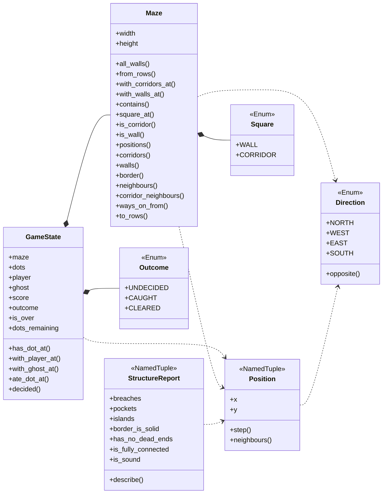
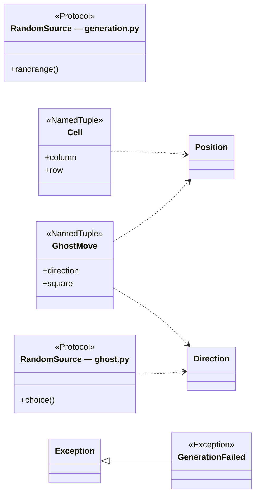
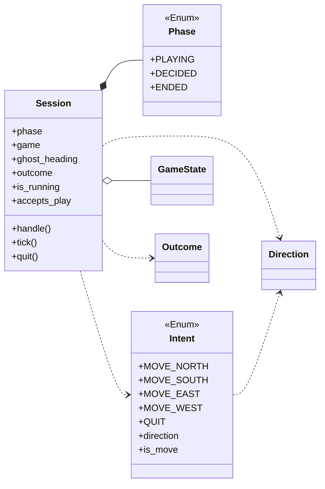
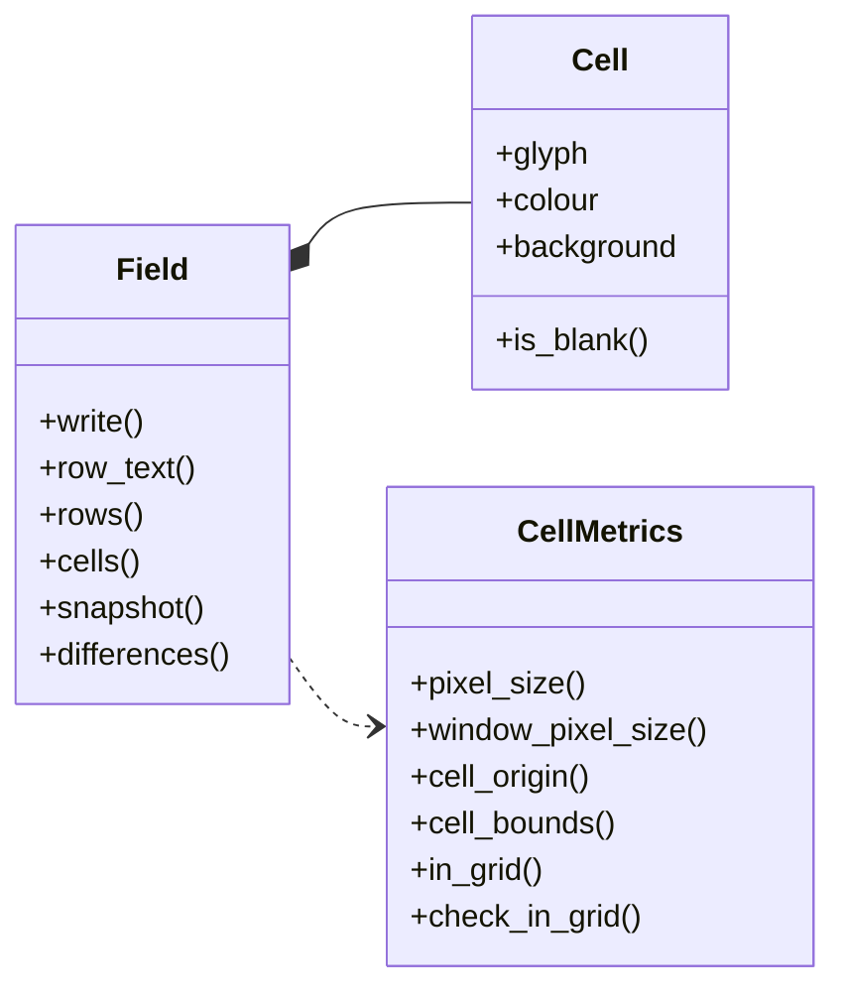
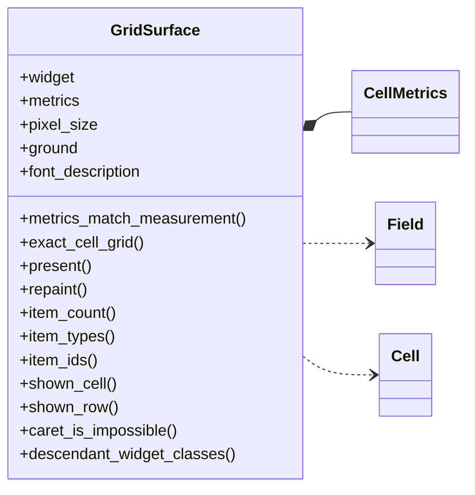
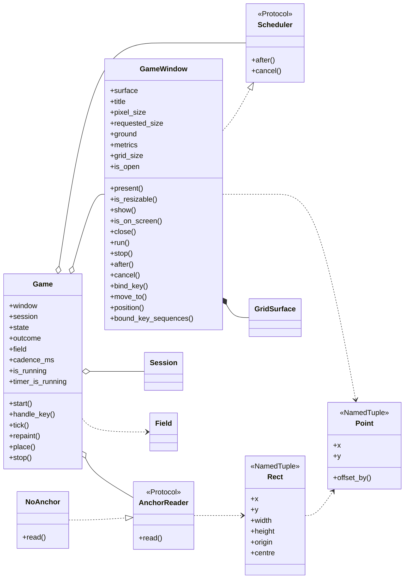
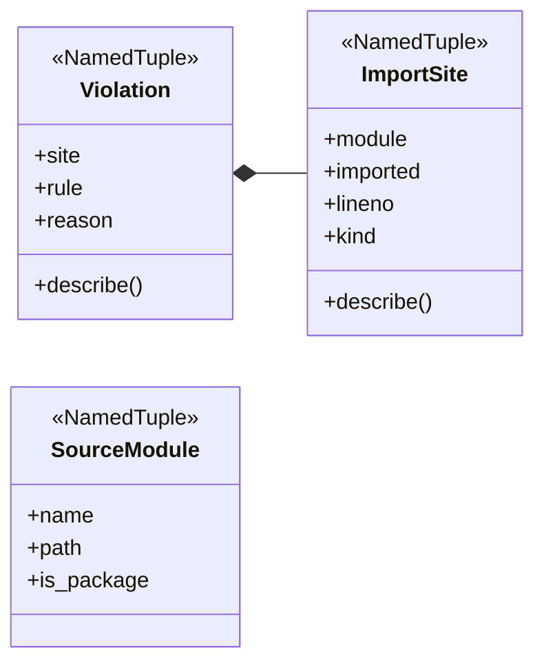

# Class overview

Every class in the running program: what it offers, and the one or two ideas
worth carrying away about it. The page is organised around seven diagrams, and
each class is described beneath the one it appears in. A final section covers
the twelve modules that have no classes in them at all, because in this program those
hold a great deal of the reasoning — five of the twelve are where a whole
requirement lives.

**Derived from the source, with the synopses written by hand.** The diagrams,
the headings and the public surface of every class were read out of the code
with `ast`, so they describe what is actually there rather than what somebody
remembered. The synopsis under each heading is written by hand, because what a
class is *for* is a judgement about the design and not a fact recoverable from
it.

**The list of scenarios under each class is read from those documents' own cast
tables**, in [`docs/scenarios/`](scenarios/SCENARIO_INDEX.md), not from a search
for the name — a scenario that merely mentions a class in passing does not claim
it. **A class that no scenario has reached yet says so**, because a gap in the
coverage is worth seeing rather than hiding.

**Each class heading links to the file the class is written in.** The file
rather than the line: a class is what its file is for, so a line number would
add nothing and would go stale on every edit above it.

**A box carries a class's whole public surface** — its fields, its properties
and its methods — so the diagram is where to look for what a class offers, and
the paragraph beneath it is prose rather than a second copy of the same list.

Three kinds of arrow, told apart by their shaft and their head:

| Arrow | Means |
|---|---|
| Solid shaft, hollow triangle | **Inheritance.** The triangle points at the base class |
| Solid shaft, filled diamond | **Composition.** The class builds the part itself and holds it |
| Solid shaft, hollow diamond | **Aggregation.** The class holds a part it did not build, which could outlive it |
| Dotted shaft, open arrowhead | **Dependency.** The class mentions another without keeping it — raising it, returning it, or being handed it for one call |
| Dotted shaft, hollow triangle | **Satisfies.** The class has the shape a `Protocol` asks for, without inheriting from it |

The hollow diamonds were drawn by hand rather than parsed. This program hands
almost every collaborator in as a constructor argument, so a parser would see
no relationship at all where the most important ones are.

**One process, four layers, and the dependencies run one way.**
`Shell → Presentation → Application → Domain`. A layer may name the ones below
it and never one above, and that is guarded rather than asserted:
[`tools/layer_rule.py`](../tools/layer_rule.py) reads every module with `ast`
and reports each import the rule forbids. On top of the ordering, the Domain
may name nothing impure at all — no toolkit, no clock, no filesystem, no
environment, no process, and **no module-level random source**; Application may
name no toolkit and no clock, because a tick arrives as a call; and Presentation
may name the toolkit from **exactly one** module, the one that actually paints.
That last exception is pinned at one by the suite, so it cannot be widened
quietly.

**Twenty-nine classes, and rather more of the program than that lives in plain
functions.** Where a thing is a rule rather than a thing — what a key means,
which glyph a wall is drawn as, what row 29 says — it is written as a function
over values, and section 7 is where those are described.

## The maze, and the game being played on it

The Domain, first half. No toolkit, no clock, no randomness of its own — it is
*handed* a random source and asked questions. Everything here can be exercised
thousands of times with no window anywhere near the test, which is why the rules
are the best-covered part of the program.

Two ideas run through all of it. **Immutability**: a maze and a game state are
values, every change returns a new one, and several requirements hold because of
that rather than because anything checks them. And **making the illegal
unrepresentable**: a maze of some other size, a third kind of square, a fourth
outcome and a negative score are not bugs waiting to be found downstream — there
is nowhere for any of them to live.

### The classes in this diagram

#### [`Maze`](../terminal_game/domain/maze.py)

*maze.py* — The maze as data: a fixed 19 x 29 grid of squares, and how to walk it.

A finished maze, unchangeable for the whole of a game. It answers questions and
never changes: is this square corridor, which of the four sides can I go on to
from here, what is at this coordinate.

**No other shape is representable.** MAZE-1's 19 x 29 lives in two module
constants rather than in constructor arguments, and every route in —
`all_walls`, `from_rows`, `with_corridors_at` — goes through a bounds check. A
19 x 30 maze is not a bug waiting to be found downstream; it cannot be built.
Internally a maze is *the set of its corridor squares and nothing else*, so
MAZE-2's "corridor or wall" is structural rather than remembered: every square
not in that set is wall, and there is nowhere for a third kind to be stored.

**There is no screen geometry in it anywhere.** A square is a square, and that
two columns of the picture are spent drawing one of them is Presentation's
business. Keeping that out is what lets "no dead ends" and "everything
reachable" be checked by walking the grid rather than by reading a picture.

Two methods differ in a way worth knowing. `square_at` **raises** for a position
off the grid rather than returning `WALL`, because returning wall for somewhere
that does not exist would make an out-of-bounds bug look like an ordinary dead
end. `neighbours` filters those out instead, and `corridor_neighbours` narrows
again to the squares an actor could step onto — MAZE-5 is a statement about the
size of that tuple. `ways_on_from` is the same information with the direction
kept, which is what a ghost needs in order to know which way it came.

`corridors()` returns its squares **sorted into reading order** rather than as a
set, and that is load-bearing rather than tidy: START-1 and START-2 break ties in
reading order, and a tie-break is only reproducible if the list underneath it
comes back the same way twice.

**Cast in these scenarios:**

- [A game state is composed into a 40 × 30 field, three cells to an actor](scenarios/a-game-state-is-composed-into-a-40-by-30-field-three-cells-to-an-actor.md)
- [A maze is carved on a lattice of odd cells, then braided until no dead ends remain](scenarios/a-maze-is-carved-on-a-lattice-of-odd-cells-then-braided-until-no-dead-ends-remain.md)
- [A new game puts the player in the middle, the ghost far away, and a dot on every other square](scenarios/a-new-game-puts-the-player-in-the-middle-the-ghost-far-away-and-a-dot-on-every-other-square.md)
- [A tick moves the ghost, which is never told where the player is](scenarios/a-tick-moves-the-ghost-which-is-never-told-where-the-player-is.md)
- [A wall square chooses its double-line glyph from its four neighbours](scenarios/a-wall-square-chooses-its-double-line-glyph-from-its-four-neighbours.md)
- [An arrow key moves the player one square and eats the dot it lands on](scenarios/an-arrow-key-moves-the-player-one-square-and-eats-the-dot-it-lands-on.md)

#### [`Position`](../terminal_game/domain/maze.py)

*maze.py* — The maze as data: a fixed 19 x 29 grid of squares, and how to walk it.

A coordinate, and the only way a place is named anywhere in the Domain. It is a
`NamedTuple`, so it compares and hashes by value, which is what lets the dot
field be a frozen set of them and a test write `Position(9, 14)` and mean it.

`y` increases **downwards**, matching the order rows are drawn in and the order
the specimen picture reads in, which is worth more than matching school graph
paper. North is therefore `y - 1`.

`step` is its one piece of real behaviour: the position one square away in a
given direction, with bounds deliberately ignored — whether that square exists
is the maze's business, not a coordinate's. Everything that moves, including the
carve, moves by asking a position for its neighbour rather than by doing
arithmetic on two integers.

**Cast in these scenarios:**

- [A new game puts the player in the middle, the ghost far away, and a dot on every other square](scenarios/a-new-game-puts-the-player-in-the-middle-the-ghost-far-away-and-a-dot-on-every-other-square.md)

#### [`Direction`](../terminal_game/domain/maze.py)

*maze.py* — The maze as data: a fixed 19 x 29 grid of squares, and how to walk it.

One of four, and the whole of the maze's geometry. MAZE-2 says corridors run
only north–south and east–west, so four is all there is and there are never
eight neighbours.

Each member *is* its `(dx, dy)` step, so a direction needs no lookup table to be
applied. They are declared in the reading order of the square they reach —
north, west, east, south — and **that order is part of the contract**: the
ghost's choice at a junction is made from a list built by iterating `Direction`,
and a random choice is only reproducible if the list comes back the same way
every time. Replaying a puzzling game from its seed depends on it.

`opposite` exists for exactly one requirement: GHOST-3's "turns back the way it
came only when there is no other choice".

**Cast in these scenarios:**

- [A tick moves the ghost, which is never told where the player is](scenarios/a-tick-moves-the-ghost-which-is-never-told-where-the-player-is.md)

#### [`Square`](../terminal_game/domain/maze.py)

*maze.py* — The maze as data: a fixed 19 x 29 grid of squares, and how to walk it.

Corridor or wall, and nothing else. A two-member enum rather than a boolean,
which costs nothing and means a grid cannot be half-built out of `True` and
`None`. MAZE-2 allows exactly these two, and having them be an enum is what
makes "exactly these two" a fact about the program rather than a comment.

**No scenario has reached this class yet.**

#### [`GameState`](../terminal_game/domain/state.py)

*state.py* — Where a game starts, and what a game in progress consists of.

Everything a game in progress consists of: the maze, the dots still uneaten, the
two actors, the score and the outcome. Immutable, with read-only properties and
four transitions that each return a new state.

**Two requirements hold because of that shape rather than because anything
enforces them.** SCORE-5, "the score never goes down", is true because exactly
one of the four transitions touches the score and it adds one — there is no
setter to misuse and no subtraction in the module. And the resolver can work out
what a turn *would* do before committing to it, which is what let END-3 become a
single expression instead of an ordering of two statements.

`ate_dot_at` is the only operation that scores, and a square whose dot has
already gone returns the state unchanged — that is SCORE-3, and it means the
resolver may call it on every move without first having to ask. `with_ghost_at`
deliberately touches no dot: SCORE-4 says a dot under the ghost is still there to
be taken, so the ghost passing over one neither eats it nor hides it.

The `outcome` field is *stamped* by the resolver rather than derived here, and
one consumer pointedly does not trust it — see [`Session`](#session).

**Cast in these scenarios:**

- [A new game puts the player in the middle, the ghost far away, and a dot on every other square](scenarios/a-new-game-puts-the-player-in-the-middle-the-ghost-far-away-and-a-dot-on-every-other-square.md)
- [An arrow key moves the player one square and eats the dot it lands on](scenarios/an-arrow-key-moves-the-player-one-square-and-eats-the-dot-it-lands-on.md)
- [Eating the last dot on the ghost's square is a loss and not a win](scenarios/eating-the-last-dot-on-the-ghosts-square-is-a-loss-and-not-a-win.md)

#### [`Outcome`](../terminal_game/domain/state.py)

*state.py* — Where a game starts, and what a game in progress consists of.

Undecided, caught, cleared. The whole vocabulary for how a game stands, and only
these three.

**Which one applies is not decided here.** This module owns the words and the
field they are kept in; END-1, END-2 and END-3 are the turn resolver's, and
END-3 turns entirely on the order two of these are tested in. Keeping the
vocabulary and the ruling in different places is what let the resolver make that
order structural.

**Cast in these scenarios:**

- [A new game puts the player in the middle, the ghost far away, and a dot on every other square](scenarios/a-new-game-puts-the-player-in-the-middle-the-ghost-far-away-and-a-dot-on-every-other-square.md)
- [An arrow key moves the player one square and eats the dot it lands on](scenarios/an-arrow-key-moves-the-player-one-square-and-eats-the-dot-it-lands-on.md)
- [Eating the last dot on the ghost's square is a loss and not a win](scenarios/eating-the-last-dot-on-the-ghosts-square-is-a-loss-and-not-a-win.md)
- [The status row shows the score and the keys that still work](scenarios/the-status-row-shows-the-score-and-the-keys-that-still-work.md)

#### [`StructureReport`](../terminal_game/domain/structure.py)

*structure.py* — Three questions about the shape of a maze, answered independently.

What is wrong with a maze's shape, one field per question: `breaches` for
MAZE-3's border, `pockets` for MAZE-5's dead ends, `islands` for MAZE-6's
connectivity. All three empty is a sound maze.

**Each field lists the squares that fail, not whether any do**, and that is the
whole reason this type exists rather than a boolean. A carve-then-repair
generator opens a wall to remove a dead end and thereby changes connectivity; a
generator that only ever heard "sound" or "not sound" would have no way to tell
whether its last repair helped. The three answers are also computed
independently of one another, so no question borrows another's conclusion.

`describe` is the one method, and it is for a human: a generator that gives up,
or a test rejecting a hand-built maze, both end with somebody reading a string
and needing to know which of the three went wrong.

The checker is **deliberately ignorant of how a maze was made**. It reads a maze
and says what is true of it, which is why the same oracle can be trusted about a
maze the generator produced and about one a test drew by hand — the generator
cannot be sound by its own definition and broken by everyone else's.

## Making a maze, and moving the ghost

The Domain, second half: the two places randomness enters the rules, and the
one shape each of them needs from it.

**Randomness arrives as an argument, never as an import.** Neither module names
`random`, and the layer rule would stop them if they tried. Each declares a
`Protocol` saying exactly what it needs — one method — and `random.Random`
happens to satisfy both as it stands, so the Shell hands one in with no adapter
and a test hands in something that chooses predictably. That two different
protocols share the name `RandomSource` is not an oversight: they are different
requirements on a caller, one method each, and neither module should have to
import the other to say what it wants.

### The classes in this diagram

**Cast in these scenarios:**

- [A maze is carved on a lattice of odd cells, then braided until no dead ends remain](scenarios/a-maze-is-carved-on-a-lattice-of-odd-cells-then-braided-until-no-dead-ends-remain.md)

#### [`RandomSource`](../terminal_game/domain/generation.py) — the carver's

*generation.py* — A fresh maze every game, from a random source that is handed in.

The whole of what the maze generator needs from a source of randomness: one
method, `randrange`. Structural, so nothing has to inherit from it.

**The generator shuffles from `randrange` rather than asking the source to
shuffle**, and that is a deliberate narrowing. A maze then depends only on the
sequence of integers it was given, and not on the shuffling algorithm of
whatever library supplied them — so the same seed gives the same maze across
Python versions, which is the entire value of being able to replay one.

**Cast in these scenarios:**

- [A maze is carved on a lattice of odd cells, then braided until no dead ends remain](scenarios/a-maze-is-carved-on-a-lattice-of-odd-cells-then-braided-until-no-dead-ends-remain.md)

#### [`Cell`](../terminal_game/domain/generation.py)

*generation.py* — A fresh maze every game, from a random source that is handed in.

A place on the **carving lattice**, which is not a square on the grid. Cell
`(i, j)` is the square `Position(2i + 1, 2j + 1)`, so there are 9 cells across
and 14 deep inside the 19 x 29 grid, and two adjacent cells are joined by
opening the single square between them.

**It is kept as its own type precisely so the two coordinate systems cannot be
confused**, which is the one mistake this whole module is arranged to make
impossible to write by accident.

That lattice is where two of the four maze requirements go away rather than
being repaired. Cells sit at odd-odd coordinates and connectors have exactly one
even coordinate, so a square with **both** coordinates even is never carved —
and a corridor two squares wide is not merely unlikely, it cannot be
represented, which is MAZE-2. Cells also lie at columns 1–17 and rows 1–27, so
nothing the generator carves can reach column 0 or 18 or row 0 or 28, which is
MAZE-3's solid border.

And that the original maze was built this way is **measured, not guessed**:
decoding all 29 rows of the specimen picture in the requirements gives zero
corridor squares with both coordinates even.

**Cast in these scenarios:**

- [A maze is carved on a lattice of odd cells, then braided until no dead ends remain](scenarios/a-maze-is-carved-on-a-lattice-of-odd-cells-then-braided-until-no-dead-ends-remain.md)

#### [`GenerationFailed`](../terminal_game/domain/generation.py)

*generation.py* — A fresh maze every game, from a random source that is handed in.

Raised when a carved maze does not satisfy MAZE-3, MAZE-5 and MAZE-6.

**Raised rather than returned, and that is the point of it.** A maze that fails
its own structural check must never reach a player: an unreachable dot makes the
game unwinnable and a pocket traps them. The gate asks the same oracle the tests
use, so there is no route by which a maze can be handed out unchecked — the
failure is loud and early rather than a puzzling game half an hour later.

In practice it does not fire. The repair pass converges in a single pass because
adding an edge can only *raise* two degrees, so it never creates the fault it is
removing and never disconnects anything. The architect's caution C4 expected a
repair loop that might not settle; on this lattice there is nothing for it to
fight with. The exception stays because "it cannot happen" and "nothing checks"
are different claims.

**Cast in these scenarios:**

- [A maze is carved on a lattice of odd cells, then braided until no dead ends remain](scenarios/a-maze-is-carved-on-a-lattice-of-odd-cells-then-braided-until-no-dead-ends-remain.md)

#### [`RandomSource`](../terminal_game/domain/ghost.py) — the ghost's

*ghost.py* — GHOST-2, GHOST-3 and GHOST-4 — how the ghost decides where to go.

One method, `choice`: given the ways on the ghost may take, pick one. Consulted
**only** when the ghost cannot carry straight on and has more than one way to
turn, which makes a seeded run's consumption of randomness predictable as well
as its outcome.

**Cast in these scenarios:**

- [A tick moves the ghost, which is never told where the player is](scenarios/a-tick-moves-the-ghost-which-is-never-told-where-the-player-is.md)

#### [`GhostMove`](../terminal_game/domain/ghost.py)

*ghost.py* — GHOST-2, GHOST-3 and GHOST-4 — how the ghost decides where to go.

Where the ghost goes, and which way it will then be heading.

Both, deliberately. The square is what the turn resolver needs; the heading is
what the *next* call to the policy needs. Returning only the square would make
the caller re-derive the heading by subtracting two positions, which is the sort
of arithmetic that goes wrong once and then keeps working for a while.

The policy that produces one of these is a pure function whose parameters are
the maze, the square, the heading and the random source. **The player is not
among them**, and that is how GHOST-4 — "the ghost does not hunt the player" —
is met: the policy could not hunt if it wanted to, and no test has to prove a
negative about code that cannot express it.

## One turn, and the three states a session can be in

The Application layer: what a key press means once it has been understood, and
what a game does about it. Three classes, and between them they hold every
requirement about how a game ends.

**A tick arrives as a call.** Nothing here names a clock or a timer, so the
whole layer can be driven at whatever speed a test likes, with no real time
passing. How often a beat happens is the Shell's business.

**The two halves lean on each other, and it is worth knowing which way.** The
resolver makes the outcome one total function of the state, which removes the
END-3 hazard. But a derived outcome is only as stable as the state is — so the
session's *Decided* phase, which stops the ticking and ignores moves, is what
keeps the resolver's answer from being re-derived into a different one. Each is
load-bearing for the other, and both say so in their own docstrings.

### The classes in this diagram

**Cast in these scenarios:**

- [A tick moves the ghost, which is never told where the player is](scenarios/a-tick-moves-the-ghost-which-is-never-told-where-the-player-is.md)

#### [`Session`](../terminal_game/application/session.py)

*session.py* — The session — three states, and the only thing that decides when a game is over.

One game being played, and the state it is in. It takes an opening position, a
random source for the ghost, a starting heading and an `on_end` callback, and
offers three verbs: `handle` an intent, `tick` a beat, `quit`.

**Quit is honoured in every state** (CTRL-4, END-6) and is idempotent — the
Shell may well hear about a quit twice, from a key and from a closing window,
and neither should have to know whether the other got there first. A move is
honoured only while playing; in Decided it changes nothing *at all*, which the
tests assert as "unchanged" rather than "ignored", because those are different
claims and only one of them holds END-3 up.

**Ending the process is not Application's to do.** Reaching Ended calls
`on_end` and makes `is_running` false, and the Shell is what acts on that. It is
how WIN-5 reaches the window without this layer naming a toolkit.

Two subtleties that reward reading the code. `outcome` is *asked of the
resolver* rather than kept as an opinion, so the two can never disagree. And the
private settle step deliberately asks that same total function rather than
reading `GameState.outcome` — a board built by hand can carry `UNDECIDED` while
the two actors stand on the same square, and trusting the stored field would
make such a board *playable*. Since Decided is what holds END-3 up, that is
precisely the crack to keep shut.

`__repr__` asks the same question, and there is a story in that: it used to read
the stored field, and so could print `Session(decided, undecided, …)` for a
hand-built board — phase right, outcome wrong. `repr` is what pytest prints in a
traceback, so a misleading one costs whoever is debugging a failed journey an
hour chasing the wrong thing. It was found by a developer reading ahead, and it
is the one-source-of-truth rule reaching somewhere nobody thought to look: a
`repr` does not look like a component that asks whether the game is over.

**Cast in these scenarios:**

- [A key press becomes an intent, and an unknown key becomes nothing](scenarios/a-key-press-becomes-an-intent-and-an-unknown-key-becomes-nothing.md)
- [A session goes Playing → Decided → Ended, and only `q` leaves it](scenarios/a-session-goes-playing-to-decided-to-ended-and-only-q-leaves-it.md)
- [A tick moves the ghost, which is never told where the player is](scenarios/a-tick-moves-the-ghost-which-is-never-told-where-the-player-is.md)
- [Eating the last dot on the ghost's square is a loss and not a win](scenarios/eating-the-last-dot-on-the-ghosts-square-is-a-loss-and-not-a-win.md)
- [The tick timer keeps the ghost's beat, and stops when the game is decided](scenarios/the-tick-timer-keeps-the-ghosts-beat-and-stops-when-the-game-is-decided.md)
- [The window closes itself when the session ends, and the process runs out of work](scenarios/the-window-closes-itself-when-the-session-ends-and-the-process-runs-out-of-work.md)

#### [`Phase`](../terminal_game/application/session.py)

*session.py* — The session — three states, and the only thing that decides when a game is over.

Playing → Decided → Ended, and no others.

**GAME-3 is met by their absence.** The requirement — "there are no lives,
levels, time limits, power-ups, pause or restart: one maze, one ghost, one
outcome" — is satisfied because there is no ready state and no restart edge. A
transition that cannot be spelled cannot be taken, so the test for GAME-3 is
largely a test that this enumeration has three members and that nothing ever
re-enters `PLAYING`.

A session begins in Playing with nothing to pass through first, which is
START-5's "the game is under way the moment the window opens". Decided stops the
tick and leaves the last picture standing (END-5). **Decided is the
load-bearing one** — not for what it shows, but for what it prevents: it is what
keeps the state still, and therefore what keeps the derived outcome honest. If
anything ever makes the game mutable after a decision, END-3 breaks again in a
new way, and it will break here rather than in the resolver.

It is called *phase* rather than *state* only because `GameState` is already the
board.

**Cast in these scenarios:**

- [A session goes Playing → Decided → Ended, and only `q` leaves it](scenarios/a-session-goes-playing-to-decided-to-ended-and-only-q-leaves-it.md)
- [The window closes itself when the session ends, and the process runs out of work](scenarios/the-window-closes-itself-when-the-session-ends-and-the-process-runs-out-of-work.md)

#### [`Intent`](../terminal_game/application/turn.py)

*turn.py* — The turn resolver — the one place a game in progress changes.

What the player has asked for: four moves and a quit. CTRL-1 gives the four
arrows and CTRL-4 gives `q`, and those are the five things a key press can
mean.

**A key that means none of them means nothing at all** (CTRL-5), which the
translator expresses by producing no intent rather than by an intent for doing
nothing. That is a real distinction: an intent for doing nothing would have to
be handled everywhere, and would eventually be handled wrongly somewhere.

It lives here, in the layer below the translator, so that the input side and the
session cannot each invent a different alphabet for the same five ideas.

## From a game state to a field of characters

The Presentation layer, first half — everything the player sees, expressed as
data. Nothing in this half names the toolkit, reads a pixel or paints anything.

The seam is a **field**: a 40 x 30 grid of glyph-and-colour. One module composes
rows 0–28 from the maze, the dots and the actors; another supplies row 29; and
one module downstream paints the result. That the seam is a typed grid rather
than, say, a tuple of tuples is what makes SCRN-2 — "everything is drawn from
characters; there are no images" — a fact about the data rather than a rule
somebody has to remember.

### The classes in this diagram

**Cast in these scenarios:**

- [A key press becomes an intent, and an unknown key becomes nothing](scenarios/a-key-press-becomes-an-intent-and-an-unknown-key-becomes-nothing.md)
- [A session goes Playing → Decided → Ended, and only `q` leaves it](scenarios/a-session-goes-playing-to-decided-to-ended-and-only-q-leaves-it.md)
- [An arrow key moves the player one square and eats the dot it lands on](scenarios/an-arrow-key-moves-the-player-one-square-and-eats-the-dot-it-lands-on.md)

#### [`Cell`](../terminal_game/presentation/field.py)

*field.py* — The 40 x 30 field of glyph-and-colour — everything the player sees, as data.

One character cell: a single glyph, its colour, and the colour behind it.

**This is where SCRN-2 is enforced rather than observed.** A cell is one
character and two colours, so there is no shape an image, a line, an arc or a
polygon could travel in. Under the previous architecture the medium enforced
that by being a terminal; under this one it does not, so making the *data*
incapable of carrying anything else is how the rule became a fact again.

The glyph must be **exactly one character**: not two, because two characters in
one cell would overflow into the next, and not zero, because a cell with nothing
in it is a space — which is a character — and saying so keeps every cell the
same kind of thing.

Cells compare by value, which is what lets a painter ask "did this cell change?"
and get an answer about the picture rather than about object identity.

**Cast in these scenarios:**

- [A field is painted onto the canvas, touching only the cells that changed](scenarios/a-field-is-painted-onto-the-canvas-touching-only-the-cells-that-changed.md)
- [A game state is composed into a 40 × 30 field, three cells to an actor](scenarios/a-game-state-is-composed-into-a-40-by-30-field-three-cells-to-an-actor.md)
- [The status row shows the score and the keys that still work](scenarios/the-status-row-shows-the-score-and-the-keys-that-still-work.md)

#### [`Field`](../terminal_game/presentation/field.py)

*field.py* — The 40 x 30 field of glyph-and-colour — everything the player sees, as data.

A 40 x 30 grid of cells, and nothing else. Built empty and filled in.

**No other shape is representable**: there is no width or height parameter,
because WIN-2 fixes the grid and a field of some other size could only arrive
here by mistake. Indexing is `field[column, row]` throughout the project —
column first, the way a screen coordinate reads — and an off-grid index raises
rather than wrapping.

`differences` is the method the painter is built around: given the previous
field, which cells actually changed. `row_text` and `rows` give the picture back
as strings, which is what lets a test assert the whole screen as a picture
rather than cell by cell — and it is how the composer's output is held against
the specimen in the requirements.

**Cast in these scenarios:**

- [A field is painted onto the canvas, touching only the cells that changed](scenarios/a-field-is-painted-onto-the-canvas-touching-only-the-cells-that-changed.md)
- [A game state is composed into a 40 × 30 field, three cells to an actor](scenarios/a-game-state-is-composed-into-a-40-by-30-field-three-cells-to-an-actor.md)

#### [`CellMetrics`](../terminal_game/presentation/metrics.py)

*metrics.py* — WIN-2 as arithmetic — how a grid of character cells becomes a pixel rectangle.

The pixel size of one character cell, and everything that follows from it: the
window's rectangle, a cell's origin, a cell's bounds.

**Under this architecture WIN-2's size is derived, not native.** There is no
terminal to be told "40 columns"; there is a pixel rectangle computed from the
font's advance and linespace, and a font substitution silently changes it. This
class is that calculation, deliberately with no toolkit in it — so the
arithmetic can be checked exhaustively in a suite that never opens a window, and
only the two numbers it starts from have to come from a real font. Menlo at 16
measures 10 and 19, which makes the window 400 x 570.

Both numbers must be positive, and the check is not pedantry: a zero or negative
cell would give every cell in a row the same origin, and the picture would be one
column of overprinted characters rather than a grid.

The module around it records a second measurement that explains a choice nobody
would otherwise be able to check. At size 16 and below, a 40-character row drawn
as one string lands on the same pixels as 40 characters placed one at a time;
above 16 it drifts by up to 18 px across the row. That is why the font size is
16 rather than "whatever looks big enough", and why raising it would cost the
painter its freedom to place per row.

## Cells into pixels

The Presentation layer's other half, and the whole of it is one class.

**This is the only module in the layer allowed to name the windowing toolkit.**
The layer rule holds a single named exception for it, and the suite pins that
the exception stays exactly one module, so the toolkit cannot spread through
Presentation quietly. Everything upstream of here is data; everything from here
on is pixels.

### The class in this diagram

**Cast in these scenarios:**

- [A field is painted onto the canvas, touching only the cells that changed](scenarios/a-field-is-painted-onto-the-canvas-touching-only-the-cells-that-changed.md)
- [The font is measured at start-up, and the window's size is derived from what was found](scenarios/the-font-is-measured-at-start-up-and-the-windows-size-is-derived-from-what-was-found.md)

#### [`GridSurface`](../terminal_game/presentation/surface.py)

*surface.py* — The character grid surface — the one place that turns cells into pixels.

A 40 x 30 grid of character cells painted onto a canvas. It is handed a widget
to build inside — in production the game's window, in a test a withdrawn root —
and it neither creates a toplevel nor shows one. Putting the canvas on the
screen belongs to the window; placing that window belongs to placement.

**It measures the real font at construction and derives the window's size from
what it finds**, rather than trusting the recorded constant. A font
substitution therefore changes the window instead of being papered over, and
`metrics_match_measurement` is how a caller finds out that it happened.

**SCRN-7's "without flicker" is a consequence of never clearing.** Flicker is
what you get when a surface is cleared and then redrawn: for one frame the
player sees the clearing. At construction this surface creates one background
rectangle and one text item per cell — 2,400 items — and thereafter a repaint
only *reconfigures* them. The item identifiers never change for the surface's
life, so there is no moment at which the picture is incomplete. `present` does
the whole frame's worth of reconfiguration before asking the toolkit to draw
anything, and asks exactly once.

Only the cells that differ from the last frame are touched, and the reason is
not speed. Reconfiguring all 1,200 cells costs 7.3 ms against a tick budget of
143 ms, and the dozen cells an actor move really touches cost 0.092 ms. The
diffing is there because it keeps the item set fixed, and because the
architect's caution C5 warned against dirty-*region* rendering — which this
deliberately is not. **Every item permanently owns exactly one cell and is
always set to that cell's current content, so there is no region that can be
missed.**

**SCRN-7's other half, "the text cursor is never visible", is met by making a
caret impossible rather than by hiding one.** A canvas has no insertion caret
unless a text item on it holds the keyboard focus; this surface gives nothing
focus, creates no entry or text widget anywhere, and sets `takefocus=0` so the
canvas is skipped by tab traversal altogether. `caret_is_impossible` reports
that, so it is checked rather than assumed.

**SCRN-2 is likewise checked rather than claimed.** There is no method here
that draws anything: the only way to change the picture is `present`, which
takes a field, and a field can hold nothing but one-character cells. So the
canvas only ever contains `text` and `rectangle` items — never `image`,
`bitmap`, `line`, `arc`, `oval`, `polygon` or `window` — and `item_types`
reports what is actually on it.

The half-dozen `shown_*`, `item_*` and `descendant_*` methods exist for that
reason too: they let a test ask the canvas what it is really displaying, rather
than asking this class what it believes it drew.

One hard-won detail lives in here. `root.update()` **blocks forever** on
Tcl/Tk 8.5 under macOS 26 once the window is mapped — measured and bisected
with `faulthandler`, pinned at `tkinter/__init__.py` line 1314, while
`withdraw`, `geometry`, `deiconify` and `update_idletasks` all return. This
surface therefore calls `update_idletasks` and never `update`. That turns out
to be the right call regardless: it flushes the pending redraw without
reprocessing the event queue, so a repaint cannot re-enter the game through a
key event that arrives mid-frame.

## The window, the timer, and where the window lands

The Shell, which may name anything. It owns the window, the event loop, the
tick timer and the entry point — and it decides nothing about the game.

### The classes in this diagram

**Cast in these scenarios:**

- [A field is painted onto the canvas, touching only the cells that changed](scenarios/a-field-is-painted-onto-the-canvas-touching-only-the-cells-that-changed.md)
- [The font is measured at start-up, and the window's size is derived from what was found](scenarios/the-font-is-measured-at-start-up-and-the-windows-size-is-derived-from-what-was-found.md)
- [The window is opened withdrawn, dressed, placed, and only then shown](scenarios/the-window-is-opened-withdrawn-dressed-placed-and-only-then-shown.md)

#### [`Game`](../terminal_game/shell/game.py)

*game.py* — WI-14 — the live game: everything joined up.

The assembled game: a window, a session, a timer and the wiring between. A real
generated maze at start-up, a repeating timer at the ghost's cadence, key
events routed through translation into the session, a repaint after each turn,
and the process ending when the session does.

**This class decides nothing**, and that is the claim its tests are built to
check. Every rule it applies belongs to something else — the generator makes
the maze, the opening position is the Domain's, what a key means is the
translator's, what the session does about it is the session's, the turn
resolver resolves, the ghost policy moves the ghost, the composer composes and
the surface paints. What is here is the joins, and the tests assert the joins
rather than re-proving any of that.

**Nothing is on the screen and no timer is running until `start` is called**,
which is what lets the whole assembly be built in a test and then driven by
hand.

**The clock is injectable, so the game can be driven with no real time passing
and nothing on the screen.** `tick` is one beat and can be called directly; the
scheduler only exists to call it repeatedly. That was measured rather than
hoped for: `mainloop` runs on a withdrawn root with `after` callbacks firing
inside it, so even the timer can be exercised without a window reaching the
glass.

The cadence is a named constant — 143 ms, giving 6.99 moves a second for
GHOST-1's "about seven times a second" — rather than a number in a call,
because "about" is a judgement somebody made once and should be able to find
again.

**Cast in these scenarios:**

- [A key press becomes an intent, and an unknown key becomes nothing](scenarios/a-key-press-becomes-an-intent-and-an-unknown-key-becomes-nothing.md)
- [A session goes Playing → Decided → Ended, and only `q` leaves it](scenarios/a-session-goes-playing-to-decided-to-ended-and-only-q-leaves-it.md)
- [The tick timer keeps the ghost's beat, and stops when the game is decided](scenarios/the-tick-timer-keeps-the-ghosts-beat-and-stops-when-the-game-is-decided.md)
- [The window closes itself when the session ends, and the process runs out of work](scenarios/the-window-closes-itself-when-the-session-ends-and-the-process-runs-out-of-work.md)
- [The window is opened withdrawn, dressed, placed, and only then shown](scenarios/the-window-is-opened-withdrawn-dressed-placed-and-only-then-shown.md)

#### [`Scheduler`](../terminal_game/shell/game.py)

*game.py* — WI-14 — the live game: everything joined up.

What the game needs from a clock: schedule one call, and cancel it. Two
methods.

A `GameWindow` satisfies it already, so production passes nothing and the
window's own `after` is used. A test passes its own and the game runs with no
real time passing at all — which is the whole of what "the clock and the timer
are injectable" buys.

It is worth noticing what is *not* in this protocol: no notion of now, no
repeating timer, no cancellation of everything. One call scheduled, one call
cancelled. A narrow seam is a seam a test double cannot get subtly wrong.

**Cast in these scenarios:**

- [The tick timer keeps the ghost's beat, and stops when the game is decided](scenarios/the-tick-timer-keeps-the-ghosts-beat-and-stops-when-the-game-is-decided.md)

#### [`GameWindow`](../terminal_game/shell/window.py)

*window.py* — The application's own native window — WIN-1, WIN-2, WIN-3 and WIN-5.

The one window this game has. It owns the window and nothing else: what goes
*in* it is the surface's, and *where it goes* is placement's — deliberately
absent from this class.

**Built withdrawn**, so it is never on the screen half-formed: the title, the
size, the ground and the first frame can all be set before anybody sees it.
`show` is what puts it there, and placement happens immediately before.

**It does not exit the process, and that is deliberate.** `close` destroys the
toplevel; destroying the toplevel is what makes `run` — that is, `mainloop` —
return; and when the entry point's call to `run` returns there is nothing left
to do and the process ends on its own. Calling `sys.exit` in here would end the
process in the middle of a test as readily as in the middle of a game, and
would make WIN-5 impossible to check without a subprocess. **Ending by running
out of work is both the honest mechanism and the testable one.**

`on_close` is called once whether the window closed because the game ended,
because `close` was called, or because the player used the window manager's
close button. That last route is wired in the constructor, which means **a
window can never be left with no way out even if its owner binds nothing at
all** — a guarantee the walking skeleton leans on explicitly.

Three of WIN-1 to WIN-5 stopped being caveats under this architecture: the
title is whatever this process says it is with nothing composing around it, the
size is a pixel rectangle this process asks for, and the window closes because
the process that owns it closes it.

**Cast in these scenarios:**

- [A field is painted onto the canvas, touching only the cells that changed](scenarios/a-field-is-painted-onto-the-canvas-touching-only-the-cells-that-changed.md)
- [The font is measured at start-up, and the window's size is derived from what was found](scenarios/the-font-is-measured-at-start-up-and-the-windows-size-is-derived-from-what-was-found.md)
- [The tick timer keeps the ghost's beat, and stops when the game is decided](scenarios/the-tick-timer-keeps-the-ghosts-beat-and-stops-when-the-game-is-decided.md)
- [The window closes itself when the session ends, and the process runs out of work](scenarios/the-window-closes-itself-when-the-session-ends-and-the-process-runs-out-of-work.md)
- [The window is opened withdrawn, dressed, placed, and only then shown](scenarios/the-window-is-opened-withdrawn-dressed-placed-and-only-then-shown.md)

#### [`Rect`](../terminal_game/shell/placement.py)

*placement.py* — Where the game window lands — WIN-4, and what to do when it cannot be known.

A rectangle in the global display space, top-left origin.

**`x` and `y` may be negative, and that is not an error case.** The displays on
the machine this was measured on sit at `(-3509, -1440)` and `(-949, -1440)`,
with the main one at the origin. Arithmetic that assumes a screen starts at
zero is simply wrong there.

Worse, **a clamp to "the screen" would be actively harmful**: Tk's
`winfo_screenwidth` and `winfo_screenheight` report the *main display only*, so
clamping would push a perfectly good anchor on a second display back onto the
first. Nothing in the module clamps, and that is a decision rather than an
omission.

**Cast in these scenarios:**

- [The window is opened withdrawn, dressed, placed, and only then shown](scenarios/the-window-is-opened-withdrawn-dressed-placed-and-only-then-shown.md)

#### [`Point`](../terminal_game/shell/placement.py)

*placement.py* — Where the game window lands — WIN-4, and what to do when it cannot be known.

A position in the global display space. Negative values are legal, for the same
reason.

The module around it encodes a measurement that is easy to get wrong and
invisible when you do. Tk's geometry string does not spell a negative origin
the obvious way: `"+{}+{}".format(-877, -1348)` gives `+-877+-1348`, which
means x = −877 and y = −1348 — while the tidier-looking
`"{:+d}{:+d}".format(...)` gives `-877-1348`, which Tk reads as 877 from the
**right** edge and 1348 from the **bottom**. A different place entirely, on a
different display, with no error anywhere.

**Cast in these scenarios:**

- [The window is opened withdrawn, dressed, placed, and only then shown](scenarios/the-window-is-opened-withdrawn-dressed-placed-and-only-then-shown.md)

#### [`AnchorReader`](../terminal_game/shell/placement.py)

*placement.py* — Where the game window lands — WIN-4, and what to do when it cannot be known.

The seam: something that can say where the player was last looking. One method,
`read`, returning a rectangle or `None`.

**This is a seam because the question behind it is not settled.** WIN-4 asks
for the window to appear a little below and to the right of whatever window the
player was last looking at. Given an anchor, where the window goes is entirely
decided here and tested against supplied numbers. *How the anchor is read* is
not: three routes were measured and the choice between them is a question
outstanding with the user. Making it a seam means whichever route is chosen
becomes a small, tested substitution rather than a rewrite.

Two rules on it are worth stating. **It must not prompt for anything** — a
reader that raises a permission dialog turns starting a game into an
interaction. And if it fails it may raise, because the module turns a raising
reader into `None` rather than letting a placement problem stop a game from
starting.

**Cast in these scenarios:**

- [The window is opened withdrawn, dressed, placed, and only then shown](scenarios/the-window-is-opened-withdrawn-dressed-placed-and-only-then-shown.md)

#### [`NoAnchor`](../terminal_game/shell/placement.py)

*placement.py* — Where the game window lands — WIN-4, and what to do when it cannot be known.

The reader that reads nothing, and therefore cannot prompt or crash. It is what
ships today.

**With it, WIN-4 is not met**: the window is centred on the main display
instead of following the player's last window. The class exists so that the
program's behaviour is *honest* rather than a guess at the right one — a
default that is plainly a default, named as such, with the requirement recorded
as unmet rather than quietly approximated.

## The rule that guards the layers

Not part of the game, and deliberately outside the tree it scans. Nothing
under `terminal_game` may import anything from `tools`; this package exists for
the test suite and for audits.

The plan states the layer rule in prose and then says why it is a test and not
a sentence: *"a sentence remembers what was true once and nothing re-runs it."*
This is the part that re-runs it. It reads the source of every module with
`ast`, works out what each one imports, and reports every import the rule
forbids.

**It reads rather than imports**, which is the whole reason it can judge a
module that would open a window if it were imported.

### The classes in this diagram

**Cast in these scenarios:**

- [The window is opened withdrawn, dressed, placed, and only then shown](scenarios/the-window-is-opened-withdrawn-dressed-placed-and-only-then-shown.md)

#### [`ImportSite`](../tools/layer_rule.py)

*layer_rule.py* — The dependency rule between layers, as something that runs.

One name imported by one module, and where it was written: the importing
module, the name imported, the line number, and what kind of import statement
it was.

The line number is the reason this is a type rather than a pair of strings. A
layering violation is fixed by editing one line, and a report that names the
module without naming the line makes the reader search for it.

**Cast in these scenarios:**

- [Every import in the tree is checked against the layer rule](scenarios/every-import-in-the-tree-is-checked-against-the-layer-rule.md)

#### [`Violation`](../tools/layer_rule.py)

*layer_rule.py* — The dependency rule between layers, as something that runs.

One import the rule forbids, and why: the site, which rule it broke, and a
reason in words.

**Both halves matter.** The rule's name makes violations countable and lets a
test assert that a specific rule is what caught something. The reason is what
the person who broke it reads, and it is written for them — the difference
between "layer violation" and "Application may name no clock; a tick arrives
as a call" is the difference between a puzzle and an instruction.

**Cast in these scenarios:**

- [Every import in the tree is checked against the layer rule](scenarios/every-import-in-the-tree-is-checked-against-the-layer-rule.md)

#### [`SourceModule`](../tools/layer_rule.py)

*layer_rule.py* — The dependency rule between layers, as something that runs.

A `.py` file found under the scanned package: its dotted name, its path, and
whether it is a package.

The `is_package` flag is not bookkeeping. A relative import means something
different depending on whether it was written in `foo/__init__.py` or in
`foo/bar.py`, and resolving `from . import x` to the wrong absolute name would
either invent a violation or miss one.

## The modules with no classes in them

Twelve modules hold no class at all, and between them they hold a great deal of
the program's reasoning. Where a thing is a rule rather than a thing — what a
key means, which glyph a wall is drawn as, what row 29 says — it is written as
a function over values, and that is what makes it checkable without a window.

### The five that are whole requirements

**Cast in these scenarios:**

- [Every import in the tree is checked against the layer rule](scenarios/every-import-in-the-tree-is-checked-against-the-layer-rule.md)

#### [`presentation/frame.py`](../terminal_game/presentation/frame.py)

*What the picture is, for rows 0 to 28 — the maze, the dots and the actors.*

Takes a maze, a dot field and two actor positions, and fills in a field. It
never paints, never names a toolkit and never reads a pixel.

**The grid mapping is measured rather than assumed.** Maze square *x* is drawn
at screen column *2x*, so a maze row occupies 37 of the 40 columns and the last
three are a blank right margin. The odd columns between squares are
*connectors*, and a connector carries the horizontal double line only when the
squares on **both** sides of it are walls. Every one of those facts was read off
the specimen picture in the requirements, and the tests re-derive the whole
picture from this module on every run.

**Three cells to an actor**, and it is safe for a reason rather than by luck.
The player and the ghost each occupy their square's column plus the connector
either side — the specimen draws the player at columns 19, 20, 21. A connector
beside a corridor square is always blank, because a horizontal wall join needs
walls on *both* sides and an actor stands on corridor. So a three-cell actor
can never overwrite a wall glyph, and the tests check it by standing the player
on all 264 corridor squares of the specimen rather than trusting the argument.

Row 29 is **supplied from outside** and copied in unexamined apart from its
width, because its content belongs to `status.py`.

**Cast in these scenarios:**

- [A game state is composed into a 40 × 30 field, three cells to an actor](scenarios/a-game-state-is-composed-into-a-40-by-30-field-three-cells-to-an-actor.md)
- [A wall square chooses its double-line glyph from its four neighbours](scenarios/a-wall-square-chooses-its-double-line-glyph-from-its-four-neighbours.md)
- [The status row shows the score and the keys that still work](scenarios/the-status-row-shows-the-score-and-the-keys-that-still-work.md)

#### [`presentation/status.py`](../terminal_game/presentation/status.py)

*Row 29 — STAT-1, STAT-2, STAT-3 and SCRN-6.*

The content of the status line is decided here and nowhere else. The composer
writes the row and decides nothing about it — a status line composed partly in
one place and partly in another is a status line nobody owns.

Two things were recovered by measurement rather than by reading the prose. The
specimen's bottom row carries a **leading space** that STAT-2's wording does
not, and the specimen is normative. And although the ruling on it said the
three literals "pad differently … so there is no column discipline to infer",
**there is one**: the score sits left-aligned in a field of five characters,
and width 5 is the only width that reproduces all three of the specification's
own examples verbatim. Width 4 and width 6 each break at least one.

**Cast in these scenarios:**

- [The status row shows the score and the keys that still work](scenarios/the-status-row-shows-the-score-and-the-keys-that-still-work.md)

#### [`presentation/wall_glyphs.py`](../terminal_game/presentation/wall_glyphs.py)

*SCRN-3 — which character a wall square is drawn as.*

Four booleans in, one character out. A wall square's appearance depends on
nothing but whether each of its four orthogonal neighbours is also a wall,
which is why this could be written before the maze existed.

**Fifteen of the sixteen entries were measured, not recalled.** The specimen
picture was parsed square by square, each wall square classified by its four
neighbours, and the glyph read off; every one of the fifteen occurs with
exactly one glyph across all 19 x 29 squares, so the mapping really is a
function of the four booleans. The suite re-runs that comparison against the
specimen on every run, so the table cannot drift away from the picture it came
from.

Two findings in that measurement are easy to guess wrong. **A single wall
neighbour gets the full line, not a stub** — north-only and south-only are both
`║`, never `╨` or `╥`, across 37 such squares in the specimen. And **outside
the grid is not a wall**: the top-left square has no northern and no western
neighbour and is drawn `╔`, the glyph for *south and east only*; had "outside"
counted as wall it would have had to be `╬`.

The sixteenth — all four neighbours walls — does not occur in the specimen and
could not be measured. It is `╬`, taken from the same double-line family, and
it is **marked as derived** everywhere it appears so nobody later mistakes it
for something that was observed.

**Cast in these scenarios:**

- [A game state is composed into a 40 × 30 field, three cells to an actor](scenarios/a-game-state-is-composed-into-a-40-by-30-field-three-cells-to-an-actor.md)
- [A wall square chooses its double-line glyph from its four neighbours](scenarios/a-wall-square-chooses-its-double-line-glyph-from-its-four-neighbours.md)

#### [`presentation/keys.py`](../terminal_game/presentation/keys.py)

*Key presses in, intents out — CTRL-1, CTRL-4, CTRL-5.*

One lookup, and that is the point. Deciding what a key *means* is a rule;
delivering the key press is the toolkit's job and acting on the meaning is the
session's. Keeping the rule on its own makes it testable without a window,
without a clock and without a game.

**What arrives is a keysym** — the name Tk puts in `event.keysym` — and it is
read strictly. `"<Key-Up>"` is a binding name rather than a keysym and means
nothing here; neither does `"up"`. Being lenient about either would turn a
wiring mistake into a silent one, and the wiring mistake worth worrying about
is precisely the one where the arrows quietly stop working.

`q` and `Q` are two separate keysyms rather than one case-folded comparison,
because Tk reports the shifted and unshifted keys under different names and
folding would also swallow anything else that happened to fold onto them.

**Nothing here names the toolkit.** So the module knows Tk's vocabulary without
depending on Tk — and the suite checks that vocabulary against a real Tk rather
than trusting it.

**Cast in these scenarios:**

- [A key press becomes an intent, and an unknown key becomes nothing](scenarios/a-key-press-becomes-an-intent-and-an-unknown-key-becomes-nothing.md)

#### [`presentation/palette.py`](../terminal_game/presentation/palette.py)

*The colours the specification names, as pixels.*

Six requirements name a colour in words, and somebody has to turn each word
into a number. This is the one place that happens.

**These were chosen by eye, and that is stated rather than hidden.** Three are
not really choices — black, bright yellow and cyan each have one obvious
answer. The other three are a reading of an adjective, and each is justified so
a reader can check the reasoning rather than take it on trust: *blue* is the
arcade maze blue the specimen is drawn in the style of rather than a pure
`#0000ff` that glares; *dim gold* is CSS `darkgoldenrod`, gold with the
brightness taken out, which is exactly what the adjective asks for; *pink* is
CSS `hotpink`, which reads as pink beside bright yellow rather than as a pale
wash on black.

**Every colour is written as `#rrggbb` and never as a toolkit colour name.** A
name like `"pink"` is resolved by the toolkit, which would make the pixel a
player sees depend on the toolkit's table rather than on this file — and a test
could only assert the name back at itself.

### The one that is a visible milestone

**Cast in these scenarios:**

- [A game state is composed into a 40 × 30 field, three cells to an actor](scenarios/a-game-state-is-composed-into-a-40-by-30-field-three-cells-to-an-actor.md)
- [A wall square chooses its double-line glyph from its four neighbours](scenarios/a-wall-square-chooses-its-double-line-glyph-from-its-four-neighbours.md)

#### [`shell/skeleton.py`](../terminal_game/shell/skeleton.py)

*WI-7 — the walking skeleton: one window, one frame, and `q`.*

The first thing this project did that a person could see. It opens the
application's window, paints **exactly one** frame composed from a fixture
maze with fixture actor positions and a fixture status row, and closes on `q`.

No generator, no timer, no rules — the live game brings all of those and
supersedes every fixture in here. The whole purpose is to prove the vertical
slice: that what the composer produces is what reaches the glass, unaltered,
through a real native window.

**The fixture is the specification's own picture**, which costs nothing over an
invented maze and buys two things: what appears on screen can be held against
the specification side by side, and it is dense with long wall runs, which is
what a human reviewer needs to look at.

It is also where the exit-path guarantee is written down: the window wires its
own close button in its constructor, so **a window can never be left with no
way out even if this module binds nothing at all**. What is here is the
*policy* — that `q` is the key — plus one belt-and-braces watchdog.

### The six that declare a layer

These carry no code at all. Each states what its layer may name, which is the
prose half of the rule that `tools/layer_rule.py` enforces — and the plan's
reason for having both is that the sentence tells a reader what is intended
while the test is what re-runs it.

**No scenario has reached this module yet.**

#### [`terminal_game/__init__.py`](../terminal_game/__init__.py)

The four layers, and the arrow that reads "may import". It is also **the only
place GAME-1 is written down** — *the player guides a single character around a
walled maze, eating the dots laid along its corridors while one ghost roams the
same maze*. The coverage audit found that requirement claimed by no test, no
source and no docstring: realised by everything and owned by nothing. A summary
requirement still needs somewhere to be stated, or it is an assumption rather
than a claim.

It also fixes a structural rule: nothing may live directly under
`terminal_game` except this file, because **a module with no layer is a module
the rule cannot judge**.

**No scenario has reached this module yet.**

#### [`domain/__init__.py`](../terminal_game/domain/__init__.py)

The rules of the game, and nothing else. Imports nothing from the layers above
and nothing impure — no toolkit, no clock, no filesystem, no environment, no
process, and no module-level random source. Randomness arrives as an argument,
which is what makes every maze and ending rule testable with no window.

**No scenario has reached this module yet.**

#### [`application/__init__.py`](../terminal_game/application/__init__.py)

The session controller and the turn resolver. May import Domain and itself. No
toolkit, and no clock: a tick *arrives as a call*.

**No scenario has reached this module yet.**

#### [`presentation/__init__.py`](../terminal_game/presentation/__init__.py)

Everything the player sees, expressed as data. Everything it produces is data
except the single module that actually paints, which is the only part permitted
to name the toolkit — and that exception is named once, in one constant, so
renaming it is a one-line change and widening it is not.

**No scenario has reached this module yet.**

#### [`shell/__init__.py`](../terminal_game/shell/__init__.py)

The window, the event loop, the tick timer and the entry point. May import
anything. **It is the only layer with no restriction, which is exactly why it
should stay thin**: whatever can be moved down out of here becomes testable
without a window.

**No scenario has reached this module yet.**

#### [`tools/__init__.py`](../tools/__init__.py)

Developer tooling that is not part of the game, deliberately outside the tree
that the layer rule scans, and importable by nothing inside it.

**No scenario has reached this module yet.**

