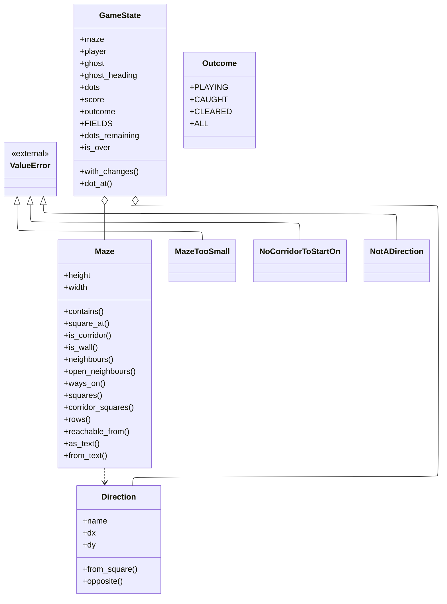
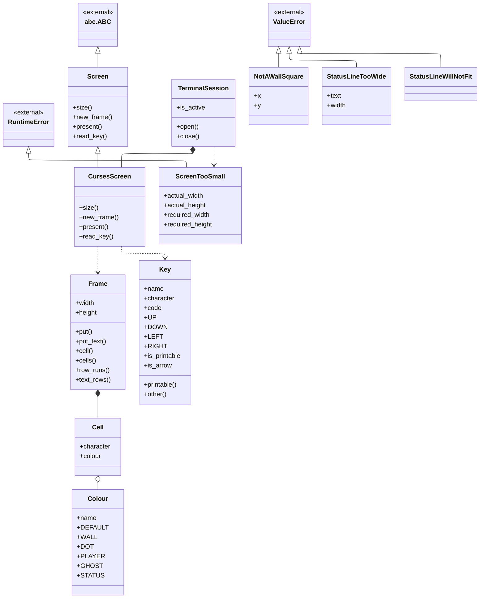
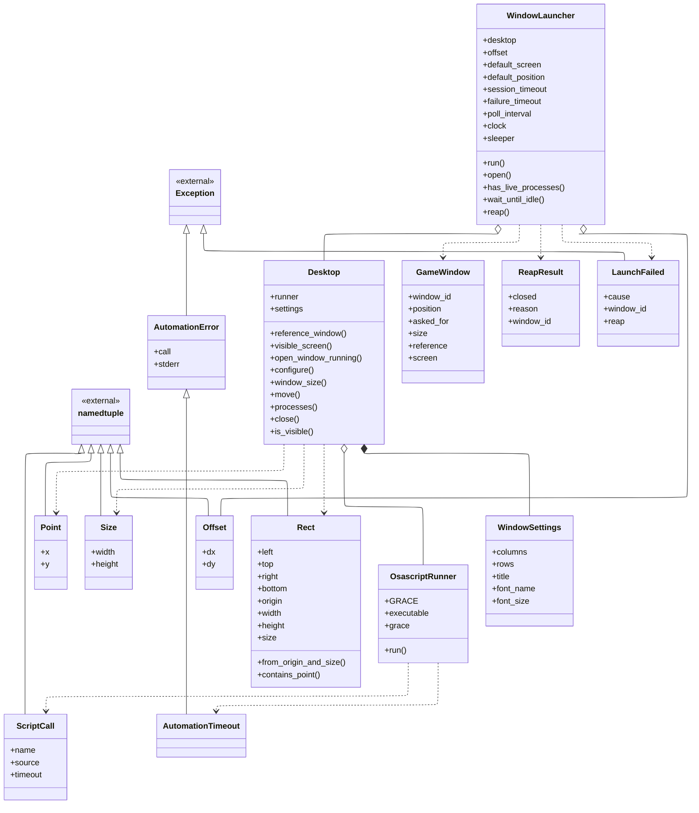

# Class overview

Every class in the running program: what it offers, and the one or two ideas
worth carrying away about it. The page is organised around three diagrams, and
each class is described beneath the one it appears in. A fourth section covers
the modules that have no classes in them at all, because in this program those
hold a great deal of the reasoning.

**Derived from the source, with the synopses written by hand.** The diagrams,
the headings and the public surface of every class were read out of the code,
so they describe what is actually there rather than what somebody remembered.
The synopsis under each heading is written by hand, because what a class is
*for* is a judgement about the design and not a fact recoverable from it. The
list of scenarios under each class is read from those documents' own cast
tables, not from a search for the name — a scenario that merely mentions a class
in passing does not claim it.

**Each class heading links to the file the class is written in.** The file
rather than the line: a class is what its file is for, so a line number would
add nothing and would go stale on every edit above it.
[The scenarios](scenarios/SCENARIO_INDEX.md) do link to lines, because there the
line is most of what is being pointed at.

**A class that no scenario has reached yet says so**, because a gap in the
coverage is worth seeing rather than hiding.

A synopsis is deliberately not an inventory of the members listed above it. It
is meant to be small enough to hold in mind while reading a scenario or
[the architecture](ARCHITECTURE.md).

**A box carries a class's whole public surface** — its fields, its properties
and its methods — so the diagram is where to look for what a class offers, and
the paragraph beneath it is prose rather than a second copy of the same list.

Three kinds of arrow, told apart by their shaft and their head:

| Arrow | Means |
|---|---|
| Solid shaft, hollow triangle | **Inheritance.** The triangle points at the base class, which is drawn above its subclasses. |
| Solid shaft, filled diamond | **Composition.** The class builds the part itself and holds it, so the part cannot outlive the whole. The diamond sits at the owner. |
| Solid shaft, hollow diamond | **Aggregation.** The class holds a part it did not build, which could outlive it. |
| Dotted shaft, open arrowhead | **Dependency.** The class mentions another without keeping it — raising it, returning it, or taking it as an argument and handing it straight on. |

`TerminalSession` shows the contrast worth having. It **builds and owns** the
`CursesScreen` it hands out, so that is a filled diamond; it merely **raises**
`ScreenTooSmall`, so that one is dotted.

Unlike the equivalent page in some other projects, the hollow diamonds here were
drawn by hand rather than parsed. This program hands almost every collaborator
in as a constructor argument and never writes down the type of what it is given
— `WindowLauncher` is handed a desktop and never says what kind — so a parser
would see no relationship at all. Those edges are real, they are the most
important ones in the launcher, and leaving them off would have made the
diagrams misleading in exactly the place it matters.

**Two processes, and they share no code.** Figures 1 and 2 are the game. Figure
3 is the launcher, which is a separate program. Nothing in the game imports
anything in the launcher and nothing in the launcher imports the game: the
launcher names the game as a piece of text and starts it as a separate process.
That separation is the single most important fact on this page, and it is
architecture caution C11.

## The game's own facts

The Domain: the game as a set of facts, with nothing impure in it. Nothing in
this diagram imports `curses`, `os`, `time` or `sys`, and nothing in it knows
that a screen exists. That purity is what lets the two hardest requirements —
a maze with no dead ends, and every corridor square reachable from every other —
be checked by walking the grid thousands of times with no window in the way.

The three errors are drawn here because refusing an impossible request is part
of what this layer is for. Each one names the requirement it cannot satisfy.

**Fig 1: The game's own facts**

### The classes in this diagram

#### [`Direction`](../terminalgame/domain/maze.py)

*maze.py* — The maze: a grid of squares, each one corridor or wall.

One of the four sides of a square, and the whole of the maze's geometry. There
are exactly four of them and they are held in a fixed order — north, south,
east, west — which is not decoration: a random choice made from a list is only
reproducible if the list comes back in the same order every time, and
reproducing a whole game from one seed is how a puzzling run gets looked at
again. `dx` and `dy` are counted in squares, never in terminal columns.

**Cast in these scenarios:**

- [A maze is carved into a spanning tree and then braided until no dead ends remain](scenarios/a-maze-is-carved-into-a-spanning-tree-and-then-braided-until-no-dead-ends-remain.md)

#### [`Maze`](../terminalgame/domain/maze.py)

*maze.py* — The maze: a grid of squares, each one corridor or wall.

A finished maze, and unchangeable for the whole of a game. It answers questions
and never changes: is this square corridor, which of the four sides can I go on
to from here, which squares can be reached from this one. There is no screen
geometry in it anywhere — a square is a square, and that two terminal columns
are spent drawing one is Presentation's business. Keeping that out is what lets
"no dead ends" and "everything reachable" be checked by walking the grid rather
than by reading a picture.

Its file also holds one loose function, `solid`, which returns a grid of nothing
but wall. That is where the generator starts, and it is the reason the solid
border needs no code of its own: the border is simply the squares the carving
never reaches.

**Cast in these scenarios:**

- [A clock tick moves the ghost, which is never told where the player is](scenarios/a-clock-tick-moves-the-ghost-which-is-never-told-where-the-player-is.md)
- [A maze is carved into a spanning tree and then braided until no dead ends remain](scenarios/a-maze-is-carved-into-a-spanning-tree-and-then-braided-until-no-dead-ends-remain.md)
- [A new game puts the player in the middle, the ghost far away, and a dot on every other square](scenarios/a-new-game-puts-the-player-in-the-middle-the-ghost-far-away-and-a-dot-on-every-other-square.md)
- [A wall square chooses its double-line glyph from its four neighbours](scenarios/a-wall-square-chooses-its-double-line-glyph-from-its-four-neighbours.md)
- [An arrow key moves the player one square and eats the dot it lands on](scenarios/an-arrow-key-moves-the-player-one-square-and-eats-the-dot-it-lands-on.md)

#### [`GameState`](../terminalgame/domain/game_state.py)

*game_state.py* — The game as a set of facts: what is where, what has been eaten, how it ends.

Everything true of a game at one moment, and the vocabulary the rest of the
program speaks. It is unchangeable: every field is fixed when it is made, and
wanting something different means asking for a new one. That is not ceremony.
It makes "a press towards a wall changes **nothing at all**" checkable by asking
whether the very same object came back, rather than by listing everything that
did not change and hoping the list is complete. The shortness of its field list
is itself a requirement — there is no lives count, no level, no timer, no pause
and no restart, and not because they are set to zero but because there is
nowhere to put them.

**Cast in these scenarios:**

- [A clock tick moves the ghost, which is never told where the player is](scenarios/a-clock-tick-moves-the-ghost-which-is-never-told-where-the-player-is.md)
- [A game state is composed into a 40 by 30 frame with the ghost drawn last](scenarios/a-game-state-is-composed-into-a-40-by-30-frame-with-the-ghost-drawn-last.md)
- [A new game puts the player in the middle, the ghost far away, and a dot on every other square](scenarios/a-new-game-puts-the-player-in-the-middle-the-ghost-far-away-and-a-dot-on-every-other-square.md)
- [An arrow key moves the player one square and eats the dot it lands on](scenarios/an-arrow-key-moves-the-player-one-square-and-eats-the-dot-it-lands-on.md)
- [Eating the last dot on the ghost's square is a loss and not a win](scenarios/eating-the-last-dot-on-the-ghosts-square-is-a-loss-and-not-a-win.md)
- [The key read's timeout is recomputed every pass so the ghost keeps its beat](scenarios/the-key-reads-timeout-is-recomputed-every-pass-so-the-ghost-keeps-its-beat.md)
- [The status row shows the score and the keys that still work](scenarios/the-status-row-shows-the-score-and-the-keys-that-still-work.md)

#### [`Outcome`](../terminalgame/domain/game_state.py)

*game_state.py* — The game as a set of facts: what is where, what has been eaten, how it ends.

How a game stands, in three settings and no fourth. *Playing* is a positive
statement that the game is under way rather than a way of saying nothing has
been decided yet, which matters from the first instant because the game is
already running before anything has been pressed. Once it is not *playing* it
never changes again: a game keeps the ending it got.

**Cast in these scenarios:**

- [A new game puts the player in the middle, the ghost far away, and a dot on every other square](scenarios/a-new-game-puts-the-player-in-the-middle-the-ghost-far-away-and-a-dot-on-every-other-square.md)
- [Eating the last dot on the ghost's square is a loss and not a win](scenarios/eating-the-last-dot-on-the-ghosts-square-is-a-loss-and-not-a-win.md)
- [The status row shows the score and the keys that still work](scenarios/the-status-row-shows-the-score-and-the-keys-that-still-work.md)

#### [`MazeTooSmall`](../terminalgame/domain/maze_generator.py) — `ValueError`

*maze_generator.py* — Laying out a maze: a carve on the odd lattice, then a braid on the same one.

A grid that cannot hold a maze with no dead ends — an even side, or fewer than
two cells in a direction. Refused at the start rather than producing a maze that
quietly breaks a requirement. It is also raised, defensively, from a place in
the braiding pass that should be unreachable, which turns what would otherwise
be a silent endless loop into a sentence somebody can read.

**Cast in these scenarios:**

- [A maze is carved into a spanning tree and then braided until no dead ends remain](scenarios/a-maze-is-carved-into-a-spanning-tree-and-then-braided-until-no-dead-ends-remain.md)

#### [`NoCorridorToStartOn`](../terminalgame/domain/game_state.py) — `ValueError`

*game_state.py* — The game as a set of facts: what is where, what has been eaten, how it ends.

A maze that cannot open a game: none at all and there is nowhere to put the
player, exactly one and there is nowhere to put the ghost that is not the
player's own square. Unreachable through the generator and quite reachable by a
test handing in a maze it wrote by hand. The message names the requirement that
cannot be met, rather than failing further downstream with a complaint about an
empty list.

**Cast in these scenarios:**

- [A new game puts the player in the middle, the ghost far away, and a dot on every other square](scenarios/a-new-game-puts-the-player-in-the-middle-the-ghost-far-away-and-a-dot-on-every-other-square.md)

#### [`NotADirection`](../terminalgame/domain/player.py) — `ValueError`

*player.py* — The player's move: one square, one direction, and what it costs the maze.

Something that is not one of the four was offered as a move. Refused loudly
rather than quietly treated as "no move" — which would be indistinguishable
from a press towards a wall, and would therefore hide a wiring mistake in the
one place the program is supposed to do nothing at all.

**Cast in no scenario yet.**

## From a game state to the glass

Everything one drawn picture passes through, from a game state to characters on
the glass. `Frame` is the hinge: everything above it builds one, and everything
below it copies one to a terminal.

The line worth seeing here is `Screen`. It names three operations and a size,
and it mentions no terminal at all. Presentation, the game loop and the Domain
are all written against it, and exactly one class on the far side of it —
`CursesScreen` — knows that `curses` exists. That is what lets a whole game be
played in a test with no terminal anywhere near it.

**Fig 2: From a game state to the glass**

### The classes in this diagram

#### [`Colour`](../terminalgame/screen/port.py)

*port.py* — The screen port: a character-cell surface, a whole frame, and a key.

A colour named rather than numbered. Presentation asks for the wall colour, and
only the terminal adapter knows that the wall colour means blue. Keeping the
numbers out of here is the whole reason `curses` does not leak above the port.
There are six, and five of them come straight from sentences in the
specification.

**Cast in these scenarios:**

- [A game state is composed into a 40 by 30 frame with the ghost drawn last](scenarios/a-game-state-is-composed-into-a-40-by-30-frame-with-the-ghost-drawn-last.md)
- [A whole frame is written to the terminal and made visible in one pass](scenarios/a-whole-frame-is-written-to-the-terminal-and-made-visible-in-one-pass.md)

#### [`Cell`](../terminalgame/screen/port.py)

*port.py* — The screen port: a character-cell surface, a whole frame, and a key.

One character cell: what is there, and what colour it is. It has no behaviour,
and that is deliberate — it makes two frames comparable by their contents, which
is how a test can say what a picture looks like without going near a terminal.

**Cast in no scenario yet.**

#### [`Frame`](../terminalgame/screen/port.py)

*port.py* — The screen port: a character-cell surface, a whole frame, and a key.

A whole picture, built away from the screen and handed over as one thing.
Nothing ever shows a half-built frame and nothing ever shows a single cell, and
that is the whole of how the game avoids flicker. `row_runs` is the only clever
part of it: one row split into the longest stretches that share a colour, so the
adapter writes a stretch at a time instead of forty cells. It groups cells and
never skips them — the whole row is always covered.

**Cast in these scenarios:**

- [A game state is composed into a 40 by 30 frame with the ghost drawn last](scenarios/a-game-state-is-composed-into-a-40-by-30-frame-with-the-ghost-drawn-last.md)
- [A whole frame is written to the terminal and made visible in one pass](scenarios/a-whole-frame-is-written-to-the-terminal-and-made-visible-in-one-pass.md)

#### [`Key`](../terminalgame/screen/port.py)

*port.py* — The screen port: a character-cell surface, a whole frame, and a key.

A key the player pressed, named rather than numbered. An arrow key does not
arrive from a terminal as one thing: it arrives as a short burst of characters
beginning with an escape. Exactly one module knows that, and by the time a key
reaches the game loop it is one named thing. Anything unrecognised arrives as
"other" and is discarded, which is a requirement in its own right.

**Cast in no scenario yet.**

#### [`Screen`](../terminalgame/screen/port.py) — `abc.ABC`

*port.py* — The screen port: a character-cell surface, a whole frame, and a key.

The port: three operations and a size, and no mention of a terminal anywhere in
it. Everything above this line — the loop, the pictures, the rules — depends on
this and never on a terminal. The timeout on reading a key is an argument rather
than a constant, because the loop works it out afresh on every pass as the time
remaining until the ghost is next due, and that single decision is what lets one
thread serve both a keyboard and a clock.

**Cast in these scenarios:**

- [A terminal too small to hold the picture is refused before a game starts](scenarios/a-terminal-too-small-to-hold-the-picture-is-refused-before-a-game-starts.md)
- [The key read's timeout is recomputed every pass so the ghost keeps its beat](scenarios/the-key-reads-timeout-is-recomputed-every-pass-so-the-ghost-keeps-its-beat.md)
- [The terminal is put into raw mode and given back on every way out](scenarios/the-terminal-is-put-into-raw-mode-and-given-back-on-every-way-out.md)

#### [`CursesScreen`](../terminalgame/screen/curses_adapter.py) — `Screen`

*curses_adapter.py* — The one module in the system that knows `curses` exists.

The one object in the program that can actually put something on a terminal or
read a key from one. It writes every cell of every frame every time — there is
no path that redraws only what moved, and there must not be one, because the
player's and the ghost's shapes are three columns wide and overwrite a column of
the square next door. It also owns the one piece of knowledge nobody expects:
writing into the bottom-right cell of a terminal moves the cursor off the end of
the screen and is reported as an error even though the character lands, so that
one cell is inserted rather than written.

**Cast in these scenarios:**

- [A whole frame is written to the terminal and made visible in one pass](scenarios/a-whole-frame-is-written-to-the-terminal-and-made-visible-in-one-pass.md)
- [The terminal is put into raw mode and given back on every way out](scenarios/the-terminal-is-put-into-raw-mode-and-given-back-on-every-way-out.md)

#### [`TerminalSession`](../terminalgame/screen/curses_adapter.py)

*curses_adapter.py* — The one module in the system that knows `curses` exists.

Raw mode for exactly as long as the game runs, and not one moment longer. The
borrowing and the returning are written as one thing rather than two, so the
terminal is given back however the game ends — by finishing, by an error nobody
predicted, or by the player interrupting. It also asks to be told about the two
instructions that would otherwise kill the program without running any ending at
all. The terminal does not belong to the game; a game that forgets to give it
back leaves the player with a shell that echoes nothing and shows no cursor.

**Cast in these scenarios:**

- [A terminal too small to hold the picture is refused before a game starts](scenarios/a-terminal-too-small-to-hold-the-picture-is-refused-before-a-game-starts.md)
- [A whole frame is written to the terminal and made visible in one pass](scenarios/a-whole-frame-is-written-to-the-terminal-and-made-visible-in-one-pass.md)
- [The game waits for its window to reach 40 by 30 before it starts drawing](scenarios/the-game-waits-for-its-window-to-reach-40-by-30-before-it-starts-drawing.md)
- [The terminal is put into raw mode and given back on every way out](scenarios/the-terminal-is-put-into-raw-mode-and-given-back-on-every-way-out.md)

#### [`ScreenTooSmall`](../terminalgame/screen/port.py) — `RuntimeError`

*port.py* — The screen port: a character-cell surface, a whole frame, and a key.

The terminal is smaller than the picture the game must draw, and there is no
margin anywhere in that picture to give up. Raised loudly rather than drawing a
maze with the bottom missing, which would look like a fault somewhere much
deeper. The terminal is always given back **before** this is allowed to travel
any further, so the message arrives at an ordinary prompt in a working terminal
rather than scrawled across a screen the game is halfway through borrowing.

**Cast in these scenarios:**

- [A terminal too small to hold the picture is refused before a game starts](scenarios/a-terminal-too-small-to-hold-the-picture-is-refused-before-a-game-starts.md)

#### [`NotAWallSquare`](../terminalgame/presentation/wall_glyphs.py) — `ValueError`

*wall_glyphs.py* — Which blue double-line glyph a wall square is drawn as (SCRN-3).

A wall character was asked for a square that is not wall. The question has no
answer, and something plausible-looking would put a wall character in the middle
of a corridor where nothing would notice.

**Cast in these scenarios:**

- [A wall square chooses its double-line glyph from its four neighbours](scenarios/a-wall-square-chooses-its-double-line-glyph-from-its-four-neighbours.md)

#### [`StatusLineTooWide`](../terminalgame/presentation/frame_builder.py) — `ValueError`

*frame_builder.py* — A whole picture from a game state — SCRN-1, SCRN-2, SCRN-4, SCRN-5, END-4.

A status line wider than the window. Refused rather than trimmed: the end of
that line is the part that says which keys work, and a bottom row that has
quietly lost `q quits` is worse than a loud failure, because `q` is the only way
out of a finished game.

**Cast in no scenario yet.**

#### [`StatusLineWillNotFit`](../terminalgame/presentation/status_line.py) — `ValueError`

*status_line.py* — The bottom row of the window: the score, and the keys that can be used.

The same refusal made one layer earlier, where the text is built rather than
placed. Two classes for what sounds like one problem, because they are raised by
two different modules with two different jobs — one owns the wording and one
owns the picture — and neither should have to import the other to complain.

**Cast in no scenario yet.**

## The window

The launcher: a separate program, and the only part of the system that touches
the desktop. It knows nothing about mazes.

The five files divide the risk so that almost all of it can be checked with no
desktop attached. `Point`, `Size`, `Offset` and `Rect` are arithmetic.
`ScriptCall` is text. `OsascriptRunner` is the one place in the whole system
where another program is started. `Desktop` turns a wanted thing into a call and
an answer back into a value, and `WindowLauncher` decides the order it all
happens in. Only the runner needs a real machine.

`GameWindow`, `ReapResult` and `LaunchFailed` are the three things the launcher
hands back. All three name the window by the number captured when it was
created, which is architecture caution C1 — never act on "the front window",
because the player's own shells are windows of the very same application.

**Fig 3: The window**

### The classes in this diagram

#### [`Point`](../launcher/geometry.py) — `namedtuple`

*geometry.py* — Pure geometry for the window launcher.

A position on the desktop, in the coordinates the terminal application reports.
The origin is the top-left of the main display and y grows **downwards**, which
is the opposite of what most people expect. A display placed to the left of the
main one has negative x, measured on the development machine as a terminal
window sitting at x = -879 — so any arithmetic that assumed positions start at
zero would throw the game window onto a different screen.

**Cast in no scenario yet.**

#### [`Size`](../launcher/geometry.py) — `namedtuple`

*geometry.py* — Pure geometry for the window launcher.

A width and a height in points rather than in characters. The launcher measures
the window it made rather than calculating how big 40 characters of Menlo ought
to be, because that depends on the font, the display and the terminal's own
spacing, and none of those are things to guess at.

**Cast in no scenario yet.**

#### [`Offset`](../launcher/geometry.py) — `namedtuple`

*geometry.py* — Pure geometry for the window launcher.

How far down and to the right of the reference window to sit. The specification
asks for "a little below and to the right" and leaves the number to the
implementer; this is where that number lives. Thirty-two points is a little over
one title-bar height, so the window behind stays readable and the new one is
unmistakably offset from it.

**Cast in no scenario yet.**

#### [`Rect`](../launcher/geometry.py) — `namedtuple`

*geometry.py* — Pure geometry for the window launcher.

A rectangle given by its edges. Two of them matter and they do different jobs.
The screen's rectangle only stops a window being put somewhere absurd — on a
machine with two displays it is the union of both, much of which is over no
display at all. The **reference window's** rectangle is the one that carries a
guarantee: the player was just looking at that window, so every point inside it
is over a real display, and keeping the new window's corner inside it is what
makes the window land somewhere reachable.

**Cast in no scenario yet.**

#### [`ScriptCall`](../launcher/script.py) — `namedtuple`

*script.py* — The AppleScript the launcher would run, as text.

One bounded piece of instruction text, ready to run. The point of it being a
value is that the dangerous fact about desktop automation is not whether some
method was called — it is **which window the instruction names**, and when the
text is a return value a test can read it and say so. The timeout is part of the
value and is never optional.

**Cast in no scenario yet.**

#### [`AutomationError`](../launcher/runner.py) — `Exception`

*runner.py* — The seam: the one place in the system where a subprocess is started.

The desktop refused, failed, or answered something unusable. Worth knowing that
this is not always a failure: the launcher's first question needs a permission
the player grants once, and a refusal there is turned into a documented default
position rather than an abort. It carries the call that failed, so a report can
say which one.

**Cast in no scenario yet.**

#### [`AutomationTimeout`](../launcher/runner.py) — `AutomationError`

*runner.py* — The seam: the one place in the system where a subprocess is started.

The call did not come back inside its bound and was killed. It is separate from
its parent because it means something different: not "the desktop said no" but
"the desktop said nothing", which on a machine showing a message only a person
can dismiss is the symptom worth recognising.

**Cast in no scenario yet.**

#### [`OsascriptRunner`](../launcher/runner.py)

*runner.py* — The seam: the one place in the system where a subprocess is started.

The seam: the one place in the whole system where another program is started.
Standing something else in this one place is what lets the launcher's ordering,
its placement arithmetic and its failure handling all be tested with no desktop
anywhere near them. It puts a second time limit around the process on top of the
one the instruction already carries, because an instruction that never returns
would leave the launcher stuck with a window already open on somebody's desktop.

**Cast in these scenarios:**

- [The launcher asks where the player was looking, and then opens the game's window](scenarios/the-launcher-asks-where-the-player-was-looking-and-then-opens-the-games-window.md)

#### [`Desktop`](../launcher/desktop.py)

*desktop.py* — The desktop automation adapter: script text in, typed values out.

The adapter: it turns each thing the launcher wants into a piece of instruction
text, hands it over to be run, and turns the answer back into a number, a
rectangle or a yes-or-no. **It holds no memory of which window is the game's.**
Every method takes the window it is to act on, so there is no "current window"
anywhere for anything to drift onto — which is what makes the rule about never
acting on the front window checkable rather than merely promised. It is also the
only class on this page with no docstring of its own.

**Cast in these scenarios:**

- [The launcher asks where the player was looking, and then opens the game's window](scenarios/the-launcher-asks-where-the-player-was-looking-and-then-opens-the-games-window.md)
- [The launcher closes the window it created, once nothing is running in it](scenarios/the-launcher-closes-the-window-it-created-once-nothing-is-running-in-it.md)

#### [`WindowSettings`](../launcher/desktop.py)

*desktop.py* — The desktop automation adapter: script text in, typed values out.

What the window is supposed to look like: 40 columns, 30 rows, titled *Terminal
Game*, in Menlo at 14 point. Menlo because it comes with the system, so nothing
has to be installed, and because it carries the double-line and block characters
the picture needs. Every one of these is applied to the window's own tab rather
than to one of the player's saved profiles, because a profile would outlive the
game.

**Cast in no scenario yet.**

#### [`GameWindow`](../launcher/lifecycle.py)

*lifecycle.py* — The window lifecycle policy — the order things must happen in.

A window this launcher created, and what it knows about it. It records both
where the window was **asked** to go and where it actually **went**, and keeping
the two apart is the interesting part: the desktop keeps a window on the display
it is on, measured doing exactly that here when a window asked for y = -1353
arrived at y = 30 instead. Recording the arithmetic instead of the outcome would
leave the launcher believing something about the player's desktop that is not
true.

**Cast in no scenario yet.**

#### [`ReapResult`](../launcher/lifecycle.py)

*lifecycle.py* — The window lifecycle policy — the order things must happen in.

What happened when the launcher tried to get rid of its own window. It carries
whether the window went and a sentence saying why not when it did not, including
the window's number so that a person can finish the job the launcher refused to
do. It is a returned value rather than a printed line, so the program that
started everything can decide what to do about it.

**Cast in these scenarios:**

- [The launcher closes the window it created, once nothing is running in it](scenarios/the-launcher-closes-the-window-it-created-once-nothing-is-running-in-it.md)

#### [`LaunchFailed`](../launcher/lifecycle.py) — `Exception`

*lifecycle.py* — The window lifecycle policy — the order things must happen in.

Setting up failed after the window already existed. It carries what went wrong
**and** what became of the window, because those are two different facts and the
second is the one the player cares about: if the launcher could not take the
window back there is one sitting on their desktop, and this names it so they
can. Dealing with the window before dealing with the error is architecture
caution C3.

**Cast in no scenario yet.**

#### [`WindowLauncher`](../launcher/lifecycle.py)

*lifecycle.py* — The window lifecycle policy — the order things must happen in.

Creates, owns and destroys exactly one terminal window, and the order it does
things in *is* the design. Ask the desktop where the player was looking
**before** creating anything, because the moment the game's window exists it is
the frontmost one and the launcher would otherwise be measuring itself. Capture
the new window's number as it is created and name that number in every call
afterwards. Never close a window with something still running in it. Its waiting
method is the only answer in the system to "is anything still running in there",
and it has exactly one answer on purpose — while there were two, the wrong one
was the default, and the launcher closed the window with the game still in it
and reported success.

**Cast in these scenarios:**

- [The game waits for its window to reach 40 by 30 before it starts drawing](scenarios/the-game-waits-for-its-window-to-reach-40-by-30-before-it-starts-drawing.md)
- [The launcher asks where the player was looking, and then opens the game's window](scenarios/the-launcher-asks-where-the-player-was-looking-and-then-opens-the-games-window.md)
- [The launcher closes the window it created, once nothing is running in it](scenarios/the-launcher-closes-the-window-it-created-once-nothing-is-running-in-it.md)

## The modules with no classes in them

A class overview that stopped at classes would miss most of this program.
Fifteen of its files offer functions at module level, and six have no class in
them at all — and several of those six are the most important files in the
system: the ordered function that decides how a game ends, the policy that
cannot see the player, the loop that keeps the ghost's beat.

That is a deliberate shape rather than an accident. A function that takes a state
and returns a new one has nowhere to hide anything between calls, which is what
makes the whole Domain reproducible from a seed. Where there was no state to
keep, no class was written to keep it.

Each module below is listed with the public functions it offers and what it is
for. The three modules with a class *and* substantial functions —
`maze_generator`, `game_state` and `player` — appear in both places: their
classes are in the diagrams above, and their functions are here.

### The modules

#### [`maze_generator.py`](../terminalgame/domain/maze_generator.py)

*terminalgame/domain/maze_generator.py* — Laying out a maze: a carve on the odd lattice, then a braid on the same one.

Lays out a maze in two passes, and each pass exists to fix what the other cannot
do alone. The carve wanders the grid opening squares and never opens its way
back into somewhere it has been, which produces a spanning tree: everything
joined, exactly one route between any two points, and therefore ends. The braid
then finds every dead end and opens one more wall beside it. Both passes stay on
the same lattice of odd-numbered squares, and that single restraint is what
delivers one-square corridors and a solid border by construction rather than by
testing.

**What it offers:** `generate_maze`, `generate_maze_with`

**Cast in these scenarios:**

- [A maze is carved into a spanning tree and then braided until no dead ends remain](scenarios/a-maze-is-carved-into-a-spanning-tree-and-then-braided-until-no-dead-ends-remain.md)

#### [`game_state.py`](../terminalgame/domain/game_state.py)

*terminalgame/domain/game_state.py* — The game as a set of facts: what is where, what has been eaten, how it ends.

The functions that open a game on a maze nobody has seen before. Neither
character can be given a fixed starting square once the maze is random, so both
places are described as questions about whatever maze turned up: the corridor
square nearest the middle, and the corridor square furthest from that. Distances
are compared squared and never square-rooted, which keeps the whole sum in exact
whole numbers so that two squares that really are equally far away tie exactly
rather than tying or not according to a rounding error.

**What it offers:** `squared_distance`, `nearest_to_centre`, `furthest_from`, `new_game`, `new_game_with`, `open_game_on`, `opening_heading`

**Cast in no scenario yet.**

#### [`player.py`](../terminalgame/domain/player.py)

*terminalgame/domain/player.py* — The player's move: one square, one direction, and what it costs the maze.

One function and one error, and six separate requirements all satisfied by the
same step: the four directions, one square per press, a press towards a wall
doing nothing at all, the dot, the point, and an already-eaten square scoring
nothing. The order inside is worth reading once — the wall is checked before
anything else, so a blocked move cannot eat a dot, cannot score, and cannot
half-happen. What it deliberately does **not** do is decide whether the game is
over.

**What it offers:** `move_player`

**Cast in these scenarios:**

- [An arrow key moves the player one square and eats the dot it lands on](scenarios/an-arrow-key-moves-the-player-one-square-and-eats-the-dot-it-lands-on.md)
- [Eating the last dot on the ghost's square is a loss and not a win](scenarios/eating-the-last-dot-on-the-ghosts-square-is-a-loss-and-not-a-win.md)

#### [`rules.py`](../terminalgame/domain/rules.py)

*terminalgame/domain/rules.py* — How a game ends: one ordered function, and the steps that call it.

How a game ends, in one ordered function. Two questions: are the two characters
on the same square, and then are there no dots left. **The order is not an
implementation detail, it is the requirement.** Swap those two lines and every
end-of-game check still passes except one — the player eating the last dot on
the square the ghost is standing on, which is a loss and would become a win.
That single state is the whole difference between a correct program and a wrong
one, which is why it lives in one named function rather than emerging from
wherever the checks happen to sit in the loop.

**What it offers:** `outcome_of`, `settle`, `advance_player`, `advance_ghost`

**Cast in these scenarios:**

- [A clock tick moves the ghost, which is never told where the player is](scenarios/a-clock-tick-moves-the-ghost-which-is-never-told-where-the-player-is.md)
- [An arrow key moves the player one square and eats the dot it lands on](scenarios/an-arrow-key-moves-the-player-one-square-and-eats-the-dot-it-lands-on.md)
- [Eating the last dot on the ghost's square is a loss and not a win](scenarios/eating-the-last-dot-on-the-ghosts-square-is-a-loss-and-not-a-win.md)
- [The key read's timeout is recomputed every pass so the ghost keeps its beat](scenarios/the-key-reads-timeout-is-recomputed-every-pass-so-the-ghost-keeps-its-beat.md)

#### [`ghost_policy.py`](../terminalgame/domain/ghost_policy.py)

*terminalgame/domain/ghost_policy.py* — Where the ghost goes next — GHOST-2, GHOST-3 and GHOST-4.

Where the ghost goes next: straight on while the corridor allows, otherwise a
random choice among the other ways on, and back the way it came only when there
is nothing else. The important thing about this module is what its functions
**do not take** — the player's position is not a parameter. Not taken and
ignored; not taken. A function that cannot see something cannot take notice of
it, which turns "the ghost does not hunt the player" from a promise about good
behaviour into a property of the code a reader can confirm in one line.

**What it offers:** `ways_on`, `choose_heading`, `ghost_move`, `move_ghost`

**Cast in these scenarios:**

- [A clock tick moves the ghost, which is never told where the player is](scenarios/a-clock-tick-moves-the-ghost-which-is-never-told-where-the-player-is.md)
- [The key read's timeout is recomputed every pass so the ghost keeps its beat](scenarios/the-key-reads-timeout-is-recomputed-every-pass-so-the-ghost-keeps-its-beat.md)

#### [`wall_glyphs.py`](../terminalgame/presentation/wall_glyphs.py)

*terminalgame/presentation/wall_glyphs.py* — Which blue double-line glyph a wall square is drawn as (SCRN-3).

Which of twelve double-line characters a wall square is drawn as, looked up from
its four neighbours in a table of sixteen. The table was measured from the
picture in the specification rather than chosen. The subtle part is a question
that has two different right answers spelled with the same words: "is that
square a wall?" is **yes** beyond the edge of the grid when an actor is walking,
because nothing leaves the maze, and **no** when a character is being chosen,
because there is no wall out there to join up with. Both are right, which is why
the second has its own name and a comment saying not to make them agree.

**What it offers:** `glyph_for_neighbours`, `joins_up_with`, `wall_neighbours`, `wall_glyph`, `wall_glyphs`

**Cast in these scenarios:**

- [A game state is composed into a 40 by 30 frame with the ghost drawn last](scenarios/a-game-state-is-composed-into-a-40-by-30-frame-with-the-ghost-drawn-last.md)
- [A wall square chooses its double-line glyph from its four neighbours](scenarios/a-wall-square-chooses-its-double-line-glyph-from-its-four-neighbours.md)

#### [`frame_builder.py`](../terminalgame/presentation/frame_builder.py)

*terminalgame/presentation/frame_builder.py* — A whole picture from a game state — SCRN-1, SCRN-2, SCRN-4, SCRN-5, END-4.

A whole picture from a game state: 40 columns by 30 rows, every cell filled,
built new every single time. A maze square is two terminal columns wide and
neighbouring squares share the column between them, so 19 squares occupy 37
columns and the three left over are the blank margin the specification asks for.
The draw order ends with the ghost, and that is a requirement rather than a
convenience: when the two characters are on the same square the picture shows
the ghost, which is what a loss looks like.

**What it offers:** `column_of`, `joiner_column`, `compose`, `draw_maze`, `draw_dots`, `draw_player`, `draw_ghost`, `draw_status_line`, `picture_rows`

**Cast in these scenarios:**

- [A game state is composed into a 40 by 30 frame with the ghost drawn last](scenarios/a-game-state-is-composed-into-a-40-by-30-frame-with-the-ghost-drawn-last.md)
- [A wall square chooses its double-line glyph from its four neighbours](scenarios/a-wall-square-chooses-its-double-line-glyph-from-its-four-neighbours.md)
- [The status row shows the score and the keys that still work](scenarios/the-status-row-shows-the-score-and-the-keys-that-still-work.md)

#### [`status_line.py`](../terminalgame/presentation/status_line.py)

*terminalgame/presentation/status_line.py* — The bottom row of the window: the score, and the keys that can be used.

The bottom row: the score, and the keys that still work. The specification gives
three example lines and never states a rule; one sentence reproduces all three
character for character, which is the reason to believe it is the rule they were
written from. It also carries an honest admission about a leading space that the
specification shows in one place and omits in another, recorded as an assumption
with the single constant that would change it.

**What it offers:** `score_field`, `status_text`, `status_row`

**Cast in these scenarios:**

- [The status row shows the score and the keys that still work](scenarios/the-status-row-shows-the-score-and-the-keys-that-still-work.md)

#### [`loop.py`](../terminalgame/application/loop.py)

*terminalgame/application/loop.py* — The game loop: one thread, no locks, and a clock that does not drift.

The game loop, and the only part of the program that knows what a clock is. One
thread, no locks, and the two things that happen at once — a player pressing
keys and a ghost moving on a beat — reconciled by arithmetic instead of by
threads: the loop waits for a key for exactly as long as remains until the ghost
is next due. It holds no rules at all. Whether a move is legal, where the ghost
goes and whether the game has ended are asked of the Domain rather than decided
here. What this module owns is *when*.

**What it offers:** `quits`, `direction_of`, `next_deadline`, `play`

**Cast in these scenarios:**

- [A clock tick moves the ghost, which is never told where the player is](scenarios/a-clock-tick-moves-the-ghost-which-is-never-told-where-the-player-is.md)
- [An arrow key moves the player one square and eats the dot it lands on](scenarios/an-arrow-key-moves-the-player-one-square-and-eats-the-dot-it-lands-on.md)
- [The key read's timeout is recomputed every pass so the ghost keeps its beat](scenarios/the-key-reads-timeout-is-recomputed-every-pass-so-the-ghost-keeps-its-beat.md)

#### [`game_main.py`](../terminalgame/game_main.py)

*terminalgame/game_main.py* — The game process: a whole game, in the window the launcher opened.

The game process, and almost nothing but an assembly point. Every part it puts
together was built and tested somewhere else. Two things in it are worth
knowing. One random source is handed to both the game's opening and the loop, so
a single seed reproduces a whole game rather than only the maze it was played
on. And the line that joins the picture to its bottom row is a named function
with a test of its own, because a picture with a blank bottom row is a perfectly
well-formed picture that would quietly fail a requirement while looking correct
to everything automatic.

**What it offers:** `build_frame`, `play_a_game`, `main`

**Cast in these scenarios:**

- [A terminal too small to hold the picture is refused before a game starts](scenarios/a-terminal-too-small-to-hold-the-picture-is-refused-before-a-game-starts.md)
- [The status row shows the score and the keys that still work](scenarios/the-status-row-shows-the-score-and-the-keys-that-still-work.md)
- [The terminal is put into raw mode and given back on every way out](scenarios/the-terminal-is-put-into-raw-mode-and-given-back-on-every-way-out.md)

#### [`geometry.py`](../launcher/geometry.py)

*launcher/geometry.py* — Pure geometry for the window launcher.

Pure arithmetic for placing the window, with no input or output of any kind in
it, which is why the whole of the placement requirement can be checked without a
desktop. Three rules in order, each of which can only move the window and never
resize it: start below and to the right, stay inside the reference window's own
frame, then pull the whole thing back onto the screen. Only the middle one is a
guarantee rather than a best effort, and it is the one the requirement's "so it
always lands somewhere visible" actually rests on.

**What it offers:** `target_position`

**Cast in these scenarios:**

- [The launcher asks where the player was looking, and then opens the game's window](scenarios/the-launcher-asks-where-the-player-was-looking-and-then-opens-the-games-window.md)

#### [`script.py`](../launcher/script.py)

*launcher/script.py* — The AppleScript the launcher would run, as text.

The instructions the launcher would send to the desktop, as text — it builds
source and executes none. Two rules are enforced by structure rather than by
discipline. Exactly one function here looks at anything positional, and it runs
before any window exists; every other one takes a window number, and there is no
function that can name a window by its position or its title because none was
written. And every instruction carries its own time limit, so nothing can sit
waiting for ever.

**What it offers:** `applescript_string`, `window_ref`, `reference_window_geometry`, `visible_screen_bounds`, `open_window_running`, `configure_window`, `window_size`, `set_window_position`, `window_processes`, `close_window`, `window_is_visible`

**Cast in these scenarios:**

- [The game waits for its window to reach 40 by 30 before it starts drawing](scenarios/the-game-waits-for-its-window-to-reach-40-by-30-before-it-starts-drawing.md)
- [The launcher asks where the player was looking, and then opens the game's window](scenarios/the-launcher-asks-where-the-player-was-looking-and-then-opens-the-games-window.md)
- [The launcher closes the window it created, once nothing is running in it](scenarios/the-launcher-closes-the-window-it-created-once-nothing-is-running-in-it.md)

#### [`game.py`](../launcher/game.py)

*launcher/game.py* — The end-to-end join: what the launcher actually runs in the window it owns.

The seam between the two programs: the shell command that starts the real game,
as text. **This module must not import the game**, and there is a test that says
so — the game is named as a string and started as a separate process, never
called. Most of the module is about three things that are easy to get wrong: the
window is not yet the right size when the game starts looking at it, the game is
not on the module path in a fresh login shell, and the handover has to replace
the shell at every step so that nothing is left alive behind the game.

**What it offers:** `size_gate`, `game_command`, `play`, `main`

**Cast in these scenarios:**

- [The game waits for its window to reach 40 by 30 before it starts drawing](scenarios/the-game-waits-for-its-window-to-reach-40-by-30-before-it-starts-drawing.md)

---

32 classes and 13 modules of functions.

The counts are worth a closing thought. **Twenty of the thirty-two classes have
no methods at all.** They are values — a point, a size, a cell, a colour, a
window the launcher made — or they are refusals, which exist to say clearly that
something cannot be done and to name the requirement it would have broken. Only
twelve classes on this page carry any behaviour, and six of those offer two
methods or fewer.

The ones that genuinely do something are easy to list: `Maze` answers questions
about a grid, `Frame` holds a picture, `Screen` and `CursesScreen` are a
terminal seen from either side of a boundary, `TerminalSession` borrows a
terminal and gives it back, and `Desktop`, `OsascriptRunner` and
`WindowLauncher` own a window between them.

Everything else in the program is a function that takes a value and returns a
new one. That is why the Domain can be run thousands of times in a test with no
window, no terminal and no clock, and it is why a seed reproduces a whole game
rather than only the maze it was played on.
