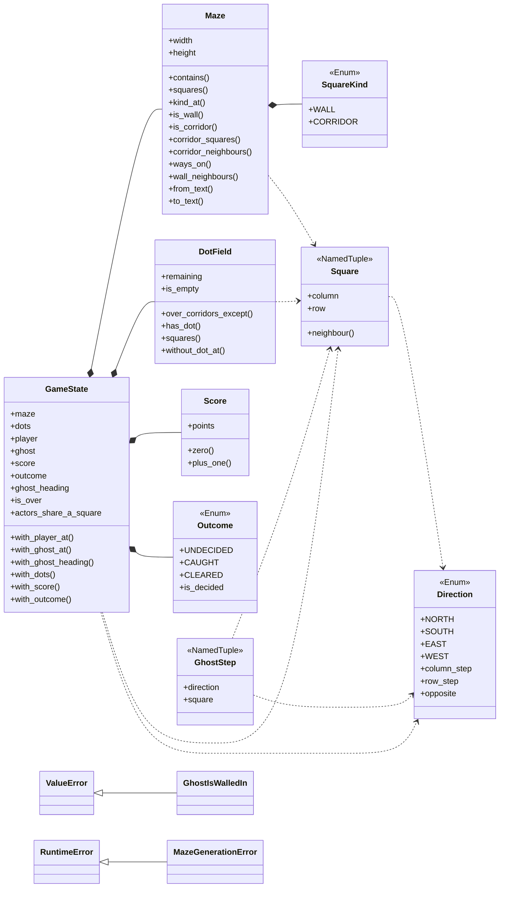
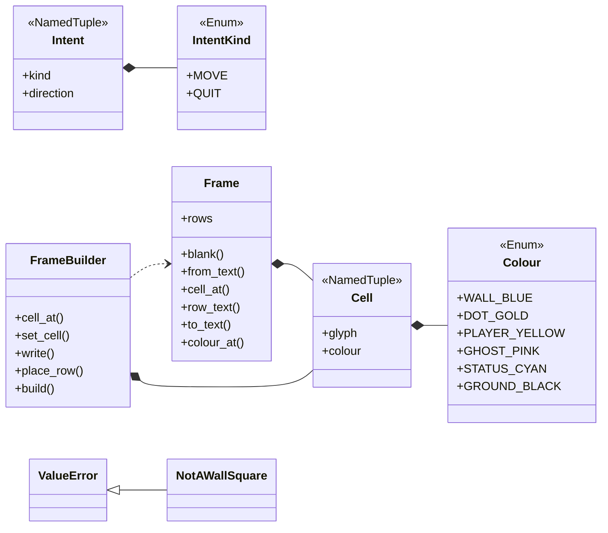
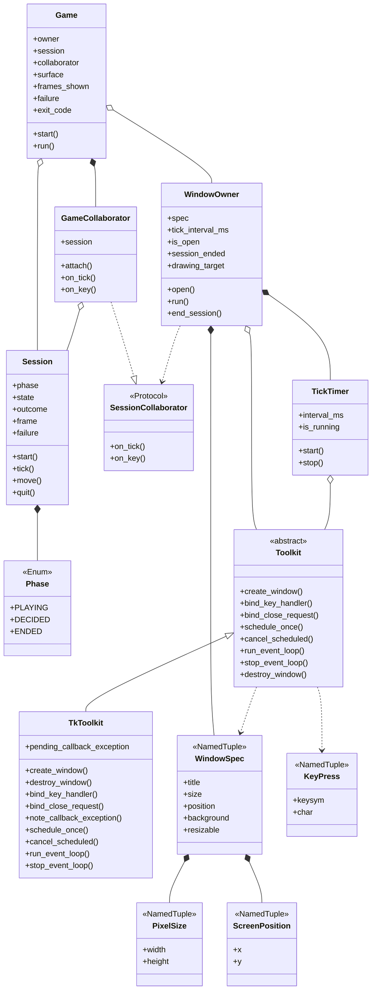
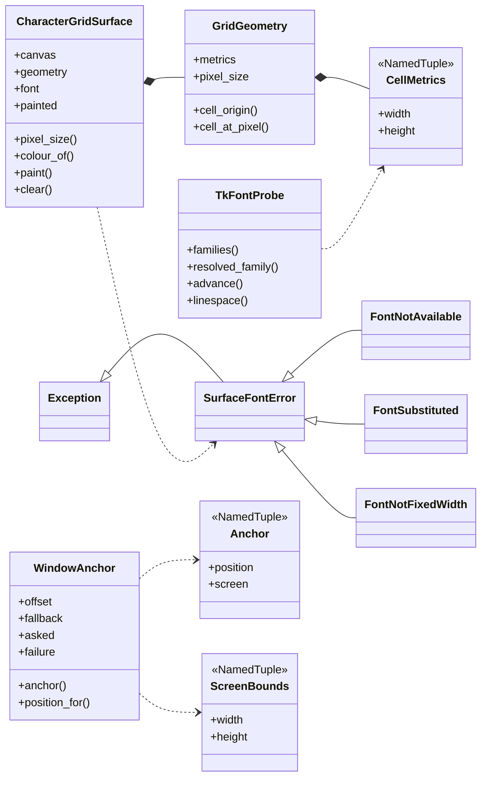

# Class overview

Every class in the running program: what it offers, and the one or two ideas
worth carrying away about it. The page is organised around four diagrams, and
each class is described beneath the one it appears in. A fifth section covers
the modules that have no classes in them at all, because in this program those
hold a great deal of the reasoning.

**Derived from the source, with the synopses written by hand.** The diagrams,
the headings and the public surface of every class were read out of the code,
so they describe what is actually there rather than what somebody remembered.
The synopsis under each heading is written by hand, because what a class is
*for* is a judgement about the design and not a fact recoverable from it. The
list of scenarios under each class is read from those documents' own cast
tables, not from a search for the name — a scenario that merely mentions a class
in passing does not claim it.

**Each class heading links to the file the class is written in.** The file
rather than the line: a class is what its file is for, so a line number would
add nothing and would go stale on every edit above it.
[The scenarios](scenarios/SCENARIO_INDEX.md) do link to lines, because there the
line is most of what is being pointed at.

**A class that no scenario has reached yet says so**, because a gap in the
coverage is worth seeing rather than hiding.

**A box carries a class's whole public surface** — its fields, its properties
and its methods — so the diagram is where to look for what a class offers, and
the paragraph beneath it is prose rather than a second copy of the same list.

Three kinds of arrow, told apart by their shaft and their head:

| Arrow | Means |
|---|---|
| Solid shaft, hollow triangle | **Inheritance.** The triangle points at the base class |
| Solid shaft, filled diamond | **Composition.** The class builds the part itself and holds it |
| Solid shaft, hollow diamond | **Aggregation.** The class holds a part it did not build, which could outlive it |
| Dotted shaft, open arrowhead | **Dependency.** The class mentions another without keeping it — raising it, returning it, or being handed it for one call |

The hollow diamonds were drawn by hand rather than parsed. This program hands
almost every collaborator in as a constructor argument, so a parser would see
no relationship at all where the most important ones are.

**One process, four layers, and the dependencies run one way.**
`Shell → Presentation → Application → Domain`. A layer may name the ones below
it and never one above, and that is guarded rather than asserted: rule 6 in
[`tests/house_rules.py`](../tests/house_rules.py) checks every layer, and the
Domain additionally imports no toolkit, reads no clock and never reaches for a
global random generator.

This is the largest difference from the program's previous shape. There is no
launcher and no second process: the application owns the window it draws in.

## The game's own facts

The Domain. No toolkit, no clock, no randomness of its own — it is *handed* a
random source and asked questions. Everything here can be exercised thousands
of times with no window anywhere near the test, which is why the rules are the
best-covered part of the program.

### The classes in this diagram

#### [`Maze`](../terminal_game/domain/maze.py)

*maze.py* — The maze as a value, and the queries the rest of the system may ask of it.

A finished maze, unchangeable for the whole of a game. It answers questions and
never changes: is this square corridor, which of the four sides can I go on to
from here, what is at this coordinate.

**There is no screen geometry in it anywhere.** A square is a square, and that
two columns of the picture are spent drawing one of them is Presentation's
business. Keeping that out is what lets "no dead ends" and "everything
reachable" be checked by walking the grid rather than by reading a picture.

One method is worth knowing about because it has a near-twin that means
something else: `wall_neighbours` reports a neighbour **off the grid as not a
wall**, which is what draws the border ring as a rectangle rather than a mesh
of crossings. That is the drawing question. The walking question — may an actor
go there — has the opposite right answer, and is asked with `contains` and
`is_corridor` instead.

**Cast in these scenarios:**

- [A maze is carved into a spanning tree, and then braided until no dead ends remain](scenarios/a-maze-is-carved-into-a-spanning-tree-and-then-braided-until-no-dead-ends-remain.md)
- [A new game puts the player in the middle, the ghost far away, and a dot on every other square](scenarios/a-new-game-puts-the-player-in-the-middle-the-ghost-far-away-and-a-dot-on-every-other-square.md)
- [A wall square chooses its double-line glyph from its four neighbours](scenarios/a-wall-square-chooses-its-double-line-glyph-from-its-four-neighbours.md)
- [An arrow key moves the player one square and eats the dot it lands on](scenarios/an-arrow-key-moves-the-player-one-square-and-eats-the-dot-it-lands-on.md)

#### [`Square`](../terminal_game/domain/maze.py)

*maze.py* — The maze as a value, and the queries the rest of the system may ask of it.

A coordinate, and the only way a position is named anywhere in the program. It
is a `NamedTuple`, so it compares and hashes by value, which is what lets a dot
field be a set of them and a test write `Square(9, 14)` and mean it.

`neighbour` is its one piece of behaviour: the square one step in a given
direction. Everything that moves — the player, the ghost, the maze carve — moves
by asking a square for its neighbour rather than by doing arithmetic on
coordinates.

**No scenario has reached this class yet.**

#### [`Direction`](../terminal_game/domain/maze.py)

*maze.py* — The maze as a value, and the queries the rest of the system may ask of it.

One of four, and the whole of the maze's geometry. Corridors run only
north–south and east–west, so four is all there is.

They are held in a fixed order, and that is not decoration: a random choice made
from a list is only reproducible if the list comes back the same way every time,
and reproducing a whole game from one seed is how a puzzling run gets looked at
again. `column_step` and `row_step` are counted in **squares**, never in columns
of the picture.

**Cast in these scenarios:**

- [A key press becomes an intent, and an unknown key becomes nothing](scenarios/a-key-press-becomes-an-intent-and-an-unknown-key-becomes-nothing.md)

#### [`SquareKind`](../terminal_game/domain/maze.py)

*maze.py* — The maze as a value, and the queries the rest of the system may ask of it.

Corridor or wall, and nothing else. A two-member enum rather than a boolean,
which costs nothing and means a grid cannot be half-built out of `True` and
`None`.

**No scenario has reached this class yet.**

#### [`GameState`](../terminal_game/domain/game_state.py)

*game_state.py* — WI-6 — the vocabulary a game is carried in.

Everything true of a game at one moment: the maze, both actors, the ghost's
heading, the dots, the score and the outcome. Every rule in the program is a
function from one of these to another.

**It is immutable, and the `with_` methods return new states.** That is what
makes "a press towards a wall changes nothing at all" checkable as the resolver
handing back the state it was given, rather than as the absence of a mutation
nobody can see.

**GAME-3 is enforced by what is not on it.** There is no lives count, no level,
no timer and no pause flag — not set to zero, absent, with nowhere to put them.

**Cast in these scenarios:**

- [A game state is composed into a 40 × 30 frame, with the ghost drawn last](scenarios/a-game-state-is-composed-into-a-40-by-30-frame-with-the-ghost-drawn-last.md)
- [A new game puts the player in the middle, the ghost far away, and a dot on every other square](scenarios/a-new-game-puts-the-player-in-the-middle-the-ghost-far-away-and-a-dot-on-every-other-square.md)
- [An arrow key moves the player one square and eats the dot it lands on](scenarios/an-arrow-key-moves-the-player-one-square-and-eats-the-dot-it-lands-on.md)

#### [`Score`](../terminal_game/domain/game_state.py)

*game_state.py* — WI-6 — the vocabulary a game is carried in.

A number of points that offers `zero` and `plus_one` and nothing else.

SCORE-5 says the score never goes down, and this is that requirement made
structural rather than asserted: there is no subtraction, no setter and no
reset, so no operation on a `Score` can derive a smaller one. A test pins the
shape of the class for exactly that reason — it is what notices if somebody
later adds one.

**Cast in these scenarios:**

- [A new game puts the player in the middle, the ghost far away, and a dot on every other square](scenarios/a-new-game-puts-the-player-in-the-middle-the-ghost-far-away-and-a-dot-on-every-other-square.md)
- [An arrow key moves the player one square and eats the dot it lands on](scenarios/an-arrow-key-moves-the-player-one-square-and-eats-the-dot-it-lands-on.md)

#### [`Outcome`](../terminal_game/domain/game_state.py)

*game_state.py* — WI-6 — the vocabulary a game is carried in.

Undecided, caught or cleared. `is_decided` is the question the rest of the
program actually asks.

Three cases and no fourth. "Undecided" is a positive statement that the game is
under way rather than a null — which is what START-5 asks for from the first
instant.

**Cast in these scenarios:**

- [Eating the last dot on the ghost's square is a loss and not a win](scenarios/eating-the-last-dot-on-the-ghosts-square-is-a-loss-and-not-a-win.md)
- [The status row shows the score and the keys that still work](scenarios/the-status-row-shows-the-score-and-the-keys-that-still-work.md)

#### [`DotField`](../terminal_game/domain/dot_field.py)

*dot_field.py* — WI-6 — the dots laid along the corridors, and what happens when one is taken.

The dots still on the board, as a set of squares.

Its whole value is that an eaten dot is **absent** rather than flagged. SCORE-3
— a square whose dot has already gone scores nothing — needs no branch anywhere
in the program, because there is nothing to find and nothing to remove.

`over_corridors_except` is where START-3 lives, and it takes one square: the
player's. The ghost's is deliberately not excepted, which is the only reason
the last dot can be under the ghost and therefore the only reason END-3 is
reachable at all.

**Cast in these scenarios:**

- [A new game puts the player in the middle, the ghost far away, and a dot on every other square](scenarios/a-new-game-puts-the-player-in-the-middle-the-ghost-far-away-and-a-dot-on-every-other-square.md)
- [An arrow key moves the player one square and eats the dot it lands on](scenarios/an-arrow-key-moves-the-player-one-square-and-eats-the-dot-it-lands-on.md)
- [Eating the last dot on the ghost's square is a loss and not a win](scenarios/eating-the-last-dot-on-the-ghosts-square-is-a-loss-and-not-a-win.md)

#### [`GhostStep`](../terminal_game/domain/ghost.py)

*ghost.py* — WI-7 — the ghost's movement policy.

Where the ghost goes next and which way it is then facing. Two fields, returned
together because the next tick needs both — a ghost that moved but forgot its
heading would have to guess which way it came from, and GHOST-3 turns on that
being known.

**Cast in these scenarios:**

- [A clock tick moves the ghost, which is never told where the player is](scenarios/a-clock-tick-moves-the-ghost-which-is-never-told-where-the-player-is.md)

#### [`GhostIsWalledIn`](../terminal_game/domain/ghost.py)

*ghost.py* — WI-7 — the ghost's movement policy.

A ghost with nowhere at all to go. Unreachable in a maze the generator
produced, because MAZE-5 gives every corridor square at least two ways on; a
hand-built maze in a test can produce it, and then this is raised rather than
the ghost silently standing still.

**Cast in these scenarios:**

- [A clock tick moves the ghost, which is never told where the player is](scenarios/a-clock-tick-moves-the-ghost-which-is-never-told-where-the-player-is.md)

#### [`MazeGenerationError`](../terminal_game/domain/maze_generator.py)

*maze_generator.py* — Laying out a maze at random: carve, then repair, then verify.

A maze that broke its own requirements. The generator checks every maze it
builds against MAZE-2, MAZE-3, MAZE-5 and MAZE-6 and raises this rather than
handing on a faulty one.

The argument that the algorithm is correct is a good one, and this exists
because arguments about code are only as good as the code matching them.

**Cast in these scenarios:**

- [A maze is carved into a spanning tree, and then braided until no dead ends remain](scenarios/a-maze-is-carved-into-a-spanning-tree-and-then-braided-until-no-dead-ends-remain.md)

## From a game state to the glass

Presentation. It may name the Application and Domain layers and **may not
import the windowing toolkit** — that is the Shell's alone. Everything here is
a value or a pure function over values, which is why the whole appearance of
the game can be asserted character by character with no window open.

### The classes in this diagram

#### [`Frame`](../terminal_game/presentation/frame.py)

*frame.py* — WI-1 — the picture as a value.

The finished picture: 30 rows of 40 cells, immutable.

Being immutable is load-bearing twice over. It is what lets the surface keep
the frame it painted last and compare against it — a mutable frame would make
that cache a liability rather than an optimisation. And it means nothing
downstream of the composer can alter a picture that has been handed on.

`from_text` and `to_text` exist for tests and for the specimen picture, so that
an expected frame can be written out as something a person can read rather than
as a list of cells.

**Cast in these scenarios:**

- [A frame is painted onto the grid, touching only the cells that changed](scenarios/a-frame-is-painted-onto-the-grid-touching-only-the-cells-that-changed.md)
- [A game state is composed into a 40 × 30 frame, with the ghost drawn last](scenarios/a-game-state-is-composed-into-a-40-by-30-frame-with-the-ghost-drawn-last.md)

#### [`FrameBuilder`](../terminal_game/presentation/frame.py)

*frame.py* — WI-1 — the picture as a value.

A frame under construction, and the only mutable thing in Presentation.

The split between this and `Frame` is the point: cells are set into a builder in
layers — walls, then dots, then the player, then the ghost — and `build` seals
it once. Composition is naturally a sequence of overwrites, and the result is
naturally something nobody should overwrite, so the two are different types.

**Cast in these scenarios:**

- [A game state is composed into a 40 × 30 frame, with the ghost drawn last](scenarios/a-game-state-is-composed-into-a-40-by-30-frame-with-the-ghost-drawn-last.md)

#### [`Cell`](../terminal_game/presentation/frame.py)

*frame.py* — WI-1 — the picture as a value.

One character and one colour. A `NamedTuple`, so two cells are equal when they
look the same.

That equality is what the surface's cell-by-cell comparison rests on: the whole
of "touch only what changed" is `previous_cell == new_cell`, and it would be
quietly wrong if `Cell` compared by identity.

**Cast in these scenarios:**

- [A frame is painted onto the grid, touching only the cells that changed](scenarios/a-frame-is-painted-onto-the-grid-touching-only-the-cells-that-changed.md)
- [A wall square chooses its double-line glyph from its four neighbours](scenarios/a-wall-square-chooses-its-double-line-glyph-from-its-four-neighbours.md)
- [The status row shows the score and the keys that still work](scenarios/the-status-row-shows-the-score-and-the-keys-that-still-work.md)

#### [`Colour`](../terminal_game/presentation/frame.py)

*frame.py* — WI-1 — the picture as a value.

The six colours the specification names, as names rather than as numbers.

Presentation asks for `WALL_BLUE`; only the Shell knows what that is in a
toolkit. Keeping the numbers out is what stops the toolkit leaking above the
Shell boundary — and it is checkable, because a colour name is not an import.

**No scenario has reached this class yet.**

#### [`Intent`](../terminal_game/presentation/input_translator.py)

*input_translator.py* — WI-9 — the input translator: raw key events become intents.

What the player meant: a kind, and a direction when there is one.

It is the value that crosses the seam into the Application layer. Small on
purpose — small enough that the session can consume it while knowing nothing
about keyboards, keysyms or toolkits.

**Cast in these scenarios:**

- [A key press becomes an intent, and an unknown key becomes nothing](scenarios/a-key-press-becomes-an-intent-and-an-unknown-key-becomes-nothing.md)

#### [`IntentKind`](../terminal_game/presentation/input_translator.py)

*input_translator.py* — WI-9 — the input translator: raw key events become intents.

Move or quit. Two members, and CTRL-5's "no other key does anything" is the
absence of a third: an unrecognised key does not become an intent of some
neutral kind, it becomes `None`.

**Cast in these scenarios:**

- [A key press becomes an intent, and an unknown key becomes nothing](scenarios/a-key-press-becomes-an-intent-and-an-unknown-key-becomes-nothing.md)

#### [`NotAWallSquare`](../terminal_game/presentation/wall_glyphs.py)

*wall_glyphs.py* — WI-8 — the wall glyphs, and the rule for the connector column (SCRN-3).

A wall glyph was asked for a square that is not wall.

The question genuinely has no answer, and anything plausible — a blank, a lone
block — would put a wall character on a corridor square where nothing would
notice. Refusing is the only option that fails where the mistake was made.

**Cast in these scenarios:**

- [A wall square chooses its double-line glyph from its four neighbours](scenarios/a-wall-square-chooses-its-double-line-glyph-from-its-four-neighbours.md)

## The session, and the window it runs in

The Application layer is two classes and the Shell is everything that knows a
toolkit exists. They are drawn together because the interesting thing about
them is the seam between them, and the seam is one-directional: the Shell
delivers ticks and keys to the session, and **the session cannot see a window**
— the layer rule forbids it from naming anything here.

### The classes in this diagram

#### [`Session`](../terminal_game/application/session.py)

*session.py* — WI-15 — the session controller: three states, and no fourth.

The game as a state machine, and the only authority on whether a game is still
being played.

It is handed a maze and a random source and nothing else. It cannot see a
window, cannot close one, and does not know there is one — which is what makes
the whole of the game's behaviour testable by calling `tick`, `move` and `quit`
in sequence and reading `phase`.

**Everything but `start` is guarded**, and not for tidiness: the toolkit
swallows an exception raised inside a scheduled callback, so a session that
raised would leave a broken game on an unquittable screen. A failure instead
takes exactly the path `q` takes, and is kept on `failure` for the caller to
report. `start` is deliberately unguarded, because it runs outside the event
loop where an exception propagates properly.

**Cast in these scenarios:**

- [A key press becomes an intent, and an unknown key becomes nothing](scenarios/a-key-press-becomes-an-intent-and-an-unknown-key-becomes-nothing.md)
- [A session goes Playing → Decided → Ended, and only `q` leaves it](scenarios/a-session-goes-playing-to-decided-to-ended-and-only-q-leaves-it.md)
- [The tick timer keeps the ghost's beat, and stops cleanly when a tick ends the game](scenarios/the-tick-timer-keeps-the-ghosts-beat-and-stops-cleanly-when-a-tick-ends-the-game.md)
- [The window closes itself when the session ends, and the session learns that it did](scenarios/the-window-closes-itself-when-the-session-ends-and-the-session-learns-that-it-did.md)

#### [`Phase`](../terminal_game/application/session.py)

*session.py* — WI-15 — the session controller: three states, and no fourth.

Playing, decided, ended.

`DECIDED` is the one that earns its place: it is the interval END-5 describes,
where the outcome is settled and the final picture stands but the window is
still open and the player has not left. Without it the program would have to
choose between ending the instant the outcome was decided and pretending a
finished game was still playable.

There is no `PAUSED`, no `RESTARTING` and no `STARTING`, and a member added
here would have to be given a transition before it could ever be reached.

**Cast in these scenarios:**

- [A session goes Playing → Decided → Ended, and only `q` leaves it](scenarios/a-session-goes-playing-to-decided-to-ended-and-only-q-leaves-it.md)

#### [`Game`](../terminal_game/shell/game.py)

*game.py* — WI-18 — the wiring: the game, assembled, from a single command.

The composition root: it holds the session, the window owner and the surface,
and joins them.

`run` returns when the session has ended by whatever route, and **it does not
raise on a failed session** — it cannot, because the session does not either.
Read `failure` and `exit_code` afterwards, which is what `main` does. The
`finally` around `end_session` is what makes the window's removal unconditional
rather than merely usual.

**Cast in these scenarios:**

- [The window closes itself when the session ends, and the session learns that it did](scenarios/the-window-closes-itself-when-the-session-ends-and-the-session-learns-that-it-did.md)

#### [`GameCollaborator`](../terminal_game/shell/game.py)

*game.py* — WI-18 — the wiring: the game, assembled, from a single command.

What the window owner actually delivers ticks and keys to. It forwards them to
the session and paints what comes back.

It exists because the session must not be reachable from the Shell by
inheritance — the layer rule forbids the Application layer from naming anything
here — so something on this side has to satisfy the protocol on the session's
behalf.

**No scenario has reached this class yet.**

#### [`WindowOwner`](../terminal_game/shell/window_owner.py)

*window_owner.py* — The process's own native window, and the event loop that drives it.

Creates the game's window, drives it, and closes it exactly once.

Nothing in it draws and nothing in it knows what a maze is. It creates a window
of the size it was given, delivers ticks and keys to the collaborator it was
given, and takes the window away again.

Closing exactly once is a single flag and an early return in `end_session`,
which is what lets the close be attempted from the ordinary path, the failure
path and the `finally` without three shutdowns.

**Cast in these scenarios:**

- [A window is opened, dressed, and placed where the player was looking](scenarios/a-window-is-opened-dressed-and-placed-where-the-player-was-looking.md)
- [The window closes itself when the session ends, and the session learns that it did](scenarios/the-window-closes-itself-when-the-session-ends-and-the-session-learns-that-it-did.md)

#### [`SessionCollaborator`](../terminal_game/shell/window_owner.py)

*window_owner.py* — The process's own native window, and the event loop that drives it.

A description of the shape the owner delivers to: `on_tick` and `on_key`.

**Structural rather than inherited, on purpose.** The session lives in the
Application layer, which may not name the Shell, so it cannot be asked to
inherit from anything declared here. Writing the shape down anyway is what lets
the two halves be built and tested apart.

**Cast in these scenarios:**

- [The window closes itself when the session ends, and the session learns that it did](scenarios/the-window-closes-itself-when-the-session-ends-and-the-session-learns-that-it-did.md)

#### [`TickTimer`](../terminal_game/shell/tick_timer.py)

*tick_timer.py* — The repeating tick at the ghost's cadence (GHOST-1).

A one-shot timer, re-armed after each delivery, which is the program's only
clock.

The order inside is the whole of its correctness: the tick is delivered first,
and the next is armed **only if the timer is still running afterwards**. So a
tick that ends the game schedules nothing, and a tick whose recipient raises
leaves nothing pointing at a half-dead session while the window is being taken
away. Not arming is the default; continuing is what requires permission.

**Cast in these scenarios:**

- [The tick timer keeps the ghost's beat, and stops cleanly when a tick ends the game](scenarios/the-tick-timer-keeps-the-ghosts-beat-and-stops-cleanly-when-a-tick-ends-the-game.md)

#### [`Toolkit`](../terminal_game/shell/toolkit.py)

*toolkit.py* — The seam between the application and the windowing toolkit.

The port: create a window, bind a key handler, schedule a callback, run and stop
an event loop.

Everything above this line — the owner, the timer, the session — depends on
this and never on Tk. It is why the whole of the window's life can be exercised
with a fake that never opens anything and never sleeps.

**Cast in these scenarios:**

- [A window is opened, dressed, and placed where the player was looking](scenarios/a-window-is-opened-dressed-and-placed-where-the-player-was-looking.md)
- [The tick timer keeps the ghost's beat, and stops cleanly when a tick ends the game](scenarios/the-tick-timer-keeps-the-ghosts-beat-and-stops-cleanly-when-a-tick-ends-the-game.md)

#### [`TkToolkit`](../terminal_game/shell/tk_toolkit.py)

*tk_toolkit.py* — The one module in the application that names the windowing toolkit.

The one implementation, and one of only two modules in the program that name
the toolkit at all.

It also owns the close button. `WM_DELETE_WINDOW` is bound at construction, so
a player closing the window goes through here rather than killing the process —
which is the route that most easily ends a game without the session being told.

`pending_callback_exception` and `note_callback_exception` exist because Tk
swallows exceptions raised inside scheduled callbacks; this is where one is
caught and kept so it can be reported rather than lost.

**Cast in these scenarios:**

- [The window closes itself when the session ends, and the session learns that it did](scenarios/the-window-closes-itself-when-the-session-ends-and-the-session-learns-that-it-did.md)

#### [`WindowSpec`](../terminal_game/shell/toolkit.py)

*toolkit.py* — The seam between the application and the windowing toolkit.

What to ask for: pixel size, title, ground colour, position. A value rather
than four arguments, so that what was asked for can be compared with what
arrived.

**No scenario has reached this class yet.**

#### [`KeyPress`](../terminal_game/shell/toolkit.py)

*toolkit.py* — The seam between the application and the windowing toolkit.

A keysym and a character, as they crossed the seam and not interpreted.

Two fields rather than one because `q` is required to match on both — a keysym
of `q` arriving with some other character is not a player pressing `q`, and the
only way out of a finished game is not a thing to guess at.

**No scenario has reached this class yet.**

#### [`ScreenPosition`](../terminal_game/shell/toolkit.py)

*toolkit.py* — The seam between the application and the windowing toolkit.

Where on the desktop, in pixels. Also the type of
`DEFAULT_WINDOW_POSITION` — the `(120, 120)` the window actually opens at
whenever the anchor cannot be trusted, which in practice is usually.

**No scenario has reached this class yet.**

#### [`PixelSize`](../terminal_game/shell/toolkit.py)

*toolkit.py* — The seam between the application and the windowing toolkit.

How big, in pixels. Computed from the cell metrics rather than chosen, so that
40 × 30 cells is the input and a pixel size is the consequence.

**No scenario has reached this class yet.**

## Drawing on the glass, and deciding where the glass goes

The rest of the Shell: the surface that turns cells into marks, the font check
that lets it assume a cell is a cell, and the anchor that decides where the
window opens.

### The classes in this diagram

#### [`CharacterGridSurface`](../terminal_game/shell/grid_surface.py)

*grid_surface.py* — WI-2 — the character grid surface.

The only class in the program that turns cells into marks, and the last step
before light reaches the player.

It keeps the frame it painted last and touches only the cells that differ — a
player move costs five cell updates rather than twelve hundred. The
architecture had rejected that optimisation, the code was written anyway, and
the architecture now records the reversal.

**What makes the cache safe is narrower than it looks**, and worth knowing
before changing anything here: this class is the only writer to the canvas,
`clear` resets the cache, and nothing binds a resize. If any of those three
stops being true, a cell the cache believes is correct will not be repainted.

One asymmetry: a cell whose glyph is a space **deletes** its canvas item rather
than drawing a space, so a full maze holds roughly 696 items rather than
1,200.

**Cast in these scenarios:**

- [A frame is painted onto the grid, touching only the cells that changed](scenarios/a-frame-is-painted-onto-the-grid-touching-only-the-cells-that-changed.md)

#### [`GridGeometry`](../terminal_game/shell/grid_surface.py)

*grid_surface.py* — WI-2 — the character grid surface.

Row and column to a pixel origin, and back again.

It is pure arithmetic — multiplication and nothing else — and it can be,
because the font check has already established that every glyph is the same
width. Its simplicity is the return on that check.

**Cast in these scenarios:**

- [A font that is missing, substituted or not fixed-width is refused before a window opens](scenarios/a-font-that-is-missing-substituted-or-not-fixed-width-is-refused-before-a-window-opens.md)
- [A frame is painted onto the grid, touching only the cells that changed](scenarios/a-frame-is-painted-onto-the-grid-touching-only-the-cells-that-changed.md)

#### [`CellMetrics`](../terminal_game/shell/grid_surface.py)

*grid_surface.py* — WI-2 — the character grid surface.

One cell's width and height in pixels. The product of measuring the font, and
the thing everything downstream is allowed to multiply by without asking
again.

**Cast in these scenarios:**

- [A font that is missing, substituted or not fixed-width is refused before a window opens](scenarios/a-font-that-is-missing-substituted-or-not-fixed-width-is-refused-before-a-window-opens.md)

#### [`SurfaceFontError`](../terminal_game/shell/grid_surface.py)

*grid_surface.py* — WI-2 — the character grid surface.

The base of the three font refusals, so a caller that only wants to know *a
font problem happened* can catch one thing while a caller that wants to help
the user can tell which of the three it was.

**Cast in these scenarios:**

- [A font that is missing, substituted or not fixed-width is refused before a window opens](scenarios/a-font-that-is-missing-substituted-or-not-fixed-width-is-refused-before-a-window-opens.md)

#### [`FontNotAvailable`](../terminal_game/shell/grid_surface.py)

*grid_surface.py* — WI-2 — the character grid surface.

The named family is not installed. The simplest of the three, and the only one
the user can fix by installing something.

**No scenario has reached this class yet.**

#### [`FontSubstituted`](../terminal_game/shell/grid_surface.py)

*grid_surface.py* — WI-2 — the character grid surface.

The toolkit quietly gave a different family than the one asked for.

The most valuable of the three. A toolkit asked for a font it does not have
will usually not say so — it resolves the request to something else and carries
on. Asking what you *got* rather than trusting what you *asked for* is the
whole of this check, and it is a class of bug that only appears on somebody
else's machine.

**No scenario has reached this class yet.**

#### [`FontNotFixedWidth`](../terminal_game/shell/grid_surface.py)

*grid_surface.py* — WI-2 — the character grid surface.

The family does not give every glyph the same advance — or gives a degenerate
one.

Every character the picture can contain is measured, not a sample: printable
ASCII for the status line, plus the box-drawing, dot and actor glyphs. Those
last are exactly the ones a font is likeliest to render at a different width,
and a font half a pixel wider on `╬` would shear the maze consistently enough
to look deliberate.

**No scenario has reached this class yet.**

#### [`TkFontProbe`](../terminal_game/shell/tk_grid.py)

*tk_grid.py* — WI-2 — the Tk binding for the character grid surface.

Asks the real toolkit what fonts exist, what a family resolves to, and how wide
a glyph is.

One of only two modules that name Tk. Everything the font check decides is
decided above this line, so all three refusals can be provoked in a test with
no font and no window anywhere.

**Cast in these scenarios:**

- [A font that is missing, substituted or not fixed-width is refused before a window opens](scenarios/a-font-that-is-missing-substituted-or-not-fixed-width-is-refused-before-a-window-opens.md)

#### [`WindowAnchor`](../terminal_game/shell/anchor.py)

*anchor.py* — WI-14 — where the game's window goes (WIN-4).

Decides where the window opens, and records what it asked and whether it got an
answer.

`asked` and `failure` are there because this is the part of the program most
likely to be wrong on somebody else's machine, and the difference between *we
did not ask* and *we asked and were refused* is the difference between a bug
and a permission.

**No scenario has reached this class yet.**

#### [`Anchor`](../terminal_game/shell/anchor.py)

*anchor.py* — WI-14 — where the game's window goes (WIN-4).

A position to sit near, and the screen it is on. Handed to the arithmetic in
`anchor.py`, which never looks at anything itself.

**No scenario has reached this class yet.**

#### [`ScreenBounds`](../terminal_game/shell/anchor.py)

*anchor.py* — WI-14 — where the game's window goes (WIN-4).

How big the screen is said to be.

The caveat lives here. The toolkit reports the pointer in whole-desktop
coordinates while describing only the primary display, so on a multi-display
machine these bounds and that pointer are answers to different questions. That
is why the fallback exists and why the window usually opens at `(120, 120)` —
and why granting Accessibility would not change it, since nothing here would
then ask a different question.

**Cast in these scenarios:**

- [A window is opened, dressed, and placed where the player was looking](scenarios/a-window-is-opened-dressed-and-placed-where-the-player-was-looking.md)

## The modules with no classes in them

Ten modules hold no class at all, and between them they hold most of the
program's reasoning. That is not an accident of style: a rule that is a
function of its arguments and nothing else has nowhere to keep a mistake, and
every one of these is a pure function over values.

They are listed here with the same weight as the classes above, because
"where does the program decide X" is answered by this list more often than by
any of the diagrams.

### The modules

#### [`turn_resolver`](../terminal_game/domain/turn_resolver.py)

*turn_resolver.py* — WI-11 — the one place the rules of a turn are applied, in a fixed order.

**The rulebook.** A player's move and a clock's tick, each as one function
from a state to a state.

Its ordering *is* the requirement rather than an implementation of it. The
collision is tested before the dot is eaten and the win after, and reversing
those two lines changes exactly one state in the whole game — the last dot on
the ghost's square — from a loss into a win. END-5 is guarded at the top of
both functions, here rather than in the session, so no caller can reach past
it.

**Cast in these scenarios:**

- [A clock tick moves the ghost, which is never told where the player is](scenarios/a-clock-tick-moves-the-ghost-which-is-never-told-where-the-player-is.md)
- [A session goes Playing → Decided → Ended, and only `q` leaves it](scenarios/a-session-goes-playing-to-decided-to-ended-and-only-q-leaves-it.md)
- [An arrow key moves the player one square and eats the dot it lands on](scenarios/an-arrow-key-moves-the-player-one-square-and-eats-the-dot-it-lands-on.md)
- [Eating the last dot on the ghost's square is a loss and not a win](scenarios/eating-the-last-dot-on-the-ghosts-square-is-a-loss-and-not-a-win.md)

#### [`ghost`](../terminal_game/domain/ghost.py)

*ghost.py* — WI-7 — the ghost's movement policy.

**Where the ghost goes next, and the clearest piece of design in the program.**

`next_step` and `onward_choices` do not take the player's position. Not as an
unused argument — absent. GHOST-4 says the ghost takes no notice of the player,
and a function that cannot see something cannot take notice of it, so the
requirement is checkable by reading one line of a signature rather than by
trusting a body to stay honest.

**Cast in these scenarios:**

- [A clock tick moves the ghost, which is never told where the player is](scenarios/a-clock-tick-moves-the-ghost-which-is-never-told-where-the-player-is.md)

#### [`maze_generator`](../terminal_game/domain/maze_generator.py)

*maze_generator.py* — Laying out a maze at random: carve, then repair, then verify.

**Carve, braid, verify.** A depth-first spanning tree gives connectivity and
nothing but dead ends; braiding opens a second way on for each of them, and can
only add. Both stages stay on the odd lattice, which is what delivers
one-square-wide corridors and a solid border without any code mentioning
either.

Then it checks its own work and refuses rather than shipping.

**Cast in these scenarios:**

- [A maze is carved into a spanning tree, and then braided until no dead ends remain](scenarios/a-maze-is-carved-into-a-spanning-tree-and-then-braided-until-no-dead-ends-remain.md)

#### [`maze_invariants`](../terminal_game/domain/maze_invariants.py)

*maze_invariants.py* — The structural properties a maze must have, as questions anyone may ask.

**Five questions asked of a finished maze**, one per requirement it could
break, each returning the offending squares rather than a boolean.

Separate from the generator on purpose, so the tests can ask exactly the
questions the generator asks. Returning squares rather than `False` is what
turns a failure into something you can look at.

**Cast in these scenarios:**

- [A maze is carved into a spanning tree, and then braided until no dead ends remain](scenarios/a-maze-is-carved-into-a-spanning-tree-and-then-braided-until-no-dead-ends-remain.md)

#### [`opening_position`](../terminal_game/domain/opening_position.py)

*opening_position.py* — WI-6 — where everything stands when the window opens.

**The five START requirements, as five lines.**

Two pieces of arithmetic are worth knowing. Distances are measured in doubled
coordinates so the centre of an even-sided grid stays a whole number, and
compared squared so ties are exact rather than decided by floating point. And
the ghost's square is deliberately not excepted from the dots, which is the
only reason END-3 is reachable.

**Cast in these scenarios:**

- [A new game puts the player in the middle, the ghost far away, and a dot on every other square](scenarios/a-new-game-puts-the-player-in-the-middle-the-ghost-far-away-and-a-dot-on-every-other-square.md)
- [Eating the last dot on the ghost's square is a loss and not a win](scenarios/eating-the-last-dot-on-the-ghosts-square-is-a-loss-and-not-a-win.md)

#### [`frame_composer`](../terminal_game/presentation/frame_composer.py)

*frame_composer.py* — WI-12 — the frame composer: a game state becomes a picture.

**The draughtsman.** Walls, then dots, then the player, then the ghost.

The last two lines are END-4: when the two actors share a square the ghost is
what is seen, and that falls out of the order rather than out of a test for the
case.

**No scenario has reached this module yet.**

#### [`picture`](../terminal_game/presentation/picture.py)

*picture.py* — WI-22 — the join: a game state in, the *whole* picture out.

**One function, and the only place the two halves of SCRN-1 meet.** A game
state in, a frame out. Every consumer in the program goes through it — the
shell, the headless apparatus, the tools — so there is one answer to *what does
this state look like*.

**No scenario has reached this module yet.**

#### [`status_line`](../terminal_game/presentation/status_line.py)

*status_line.py* — WI-13 — row 29, and nothing else on that row ever.

**The sole owner of three quoted strings.** The specification gives three
example lines and no rule, so this holds them as templates rather than deriving
them: a template cannot drift from the quoted text, because it is the quoted
text.

It refuses a score that is not a whole number, because a score reaching a
status line wrong shows up as a picture that is nearly right, which is the
hardest kind of fault to see.

**Cast in these scenarios:**

- [The status row shows the score and the keys that still work](scenarios/the-status-row-shows-the-score-and-the-keys-that-still-work.md)

#### [`wall_glyphs`](../terminal_game/presentation/wall_glyphs.py)

*wall_glyphs.py* — WI-8 — the wall glyphs, and the rule for the connector column (SCRN-3).

**Sixteen neighbour patterns, sixteen characters**, plus the rule for the
connector column between two squares.

The reasoning that matters is not the table but where the question is asked: a
neighbour off the grid is *not* a wall for drawing purposes, which is what makes
the border ring a rectangle rather than a mesh of crossings.

**Cast in these scenarios:**

- [A wall square chooses its double-line glyph from its four neighbours](scenarios/a-wall-square-chooses-its-double-line-glyph-from-its-four-neighbours.md)

#### [`input_translator`](../terminal_game/presentation/input_translator.py)

*input_translator.py* — WI-9 — the input translator: raw key events become intents.

**A keysym and a character in, an intent or nothing out.**

`None` is a real answer rather than a failure: it is CTRL-5 expressed as a
return value. Raising would make a stray keystroke fatal, and returning a
neutral intent would make an unknown key indistinguishable from a press into a
wall, which is a different outcome with its own rule.

**Cast in these scenarios:**

- [A key press becomes an intent, and an unknown key becomes nothing](scenarios/a-key-press-becomes-an-intent-and-an-unknown-key-becomes-nothing.md)

#### [`cadence`](../terminal_game/shell/cadence.py)

*cadence.py* — The ghost's cadence (GHOST-1).

**Sixteen lines holding the program's only timing requirement.** Seven ticks a
second is 142.857 ms, so the interval is 143 and the arithmetic is written out
where anyone can check the rounding rather than buried at a call site.

**Cast in these scenarios:**

- [The tick timer keeps the ghost's beat, and stops cleanly when a tick ends the game](scenarios/the-tick-timer-keeps-the-ghosts-beat-and-stops-cleanly-when-a-tick-ends-the-game.md)

#### [`tk_anchor`](../terminal_game/shell/tk_anchor.py)

*tk_anchor.py* — The one place WI-14 actually looks at the screen.

**The one place anything looks at the screen.**

It asks where the pointer is and how big the screen is — both answerable with
no permission of any kind and no dialog. It deliberately does not ask about
another application's window, and there is no code in it that could: that needs
Accessibility consent, which is a dialog in front of a person.

**Cast in these scenarios:**

- [A window is opened, dressed, and placed where the player was looking](scenarios/a-window-is-opened-dressed-and-placed-where-the-player-was-looking.md)

#### [`tk_grid`](../terminal_game/shell/tk_grid.py)

*tk_grid.py* — WI-2 — the Tk binding for the character grid surface.

**Where a real canvas and a real font are wired to the surface.** The other
of the two modules that name Tk, and the seam that lets every font refusal be
provoked without one.

**No scenario has reached this module yet.**

#### [`specimen`](../terminal_game/presentation/specimen.py)

*specimen.py* — The specimen picture from ``docs/FUNCTIONAL_REQUIREMENTS.md``, as data.

**The picture from the specification, as data.** Tests assert against this
rather than restating the expected characters, so a change to the specimen
breaks the tests rather than being quietly matched by them.

**No scenario has reached this module yet.**

