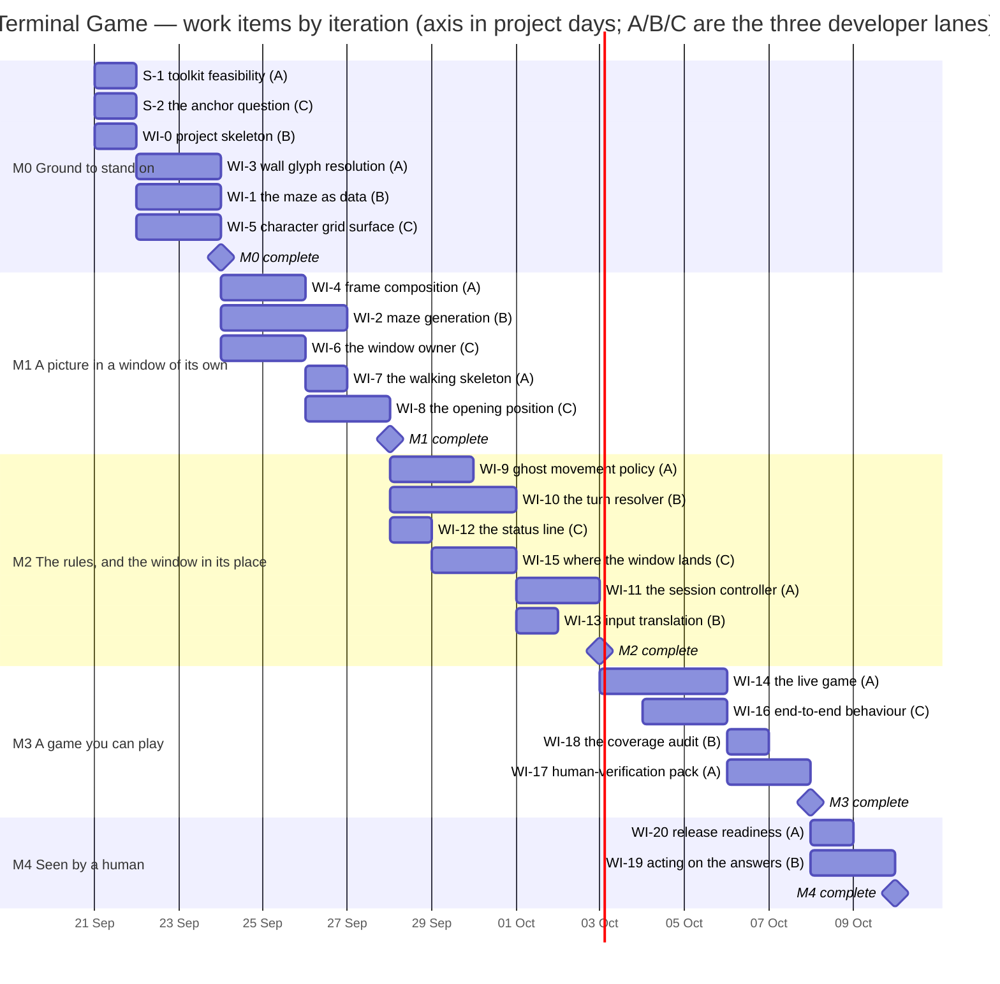
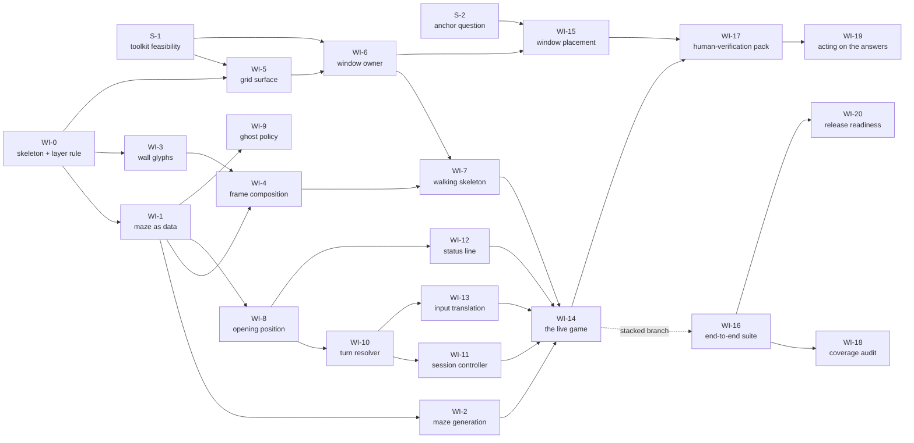

# Terminal Game — Implementation Plan

**For:** the three developers, and the conductor who dispatches them
**From:** the Technical Lead
**Inputs:** `docs/FUNCTIONAL_REQUIREMENTS.md` (49 requirement codes) and `docs/ARCHITECTURE.md`

---

## 0. The four things to read before anything else

**This project runs with real pull requests. It is not local mode.** Every work item goes
to `git@github.com:replicant1/NewTerminalGame.git` as a branch and becomes a real pull
request. **Each developer opens, marks ready and merges its own pull request**, and then
confirms `main` is still green by bringing it to their own branch (`git fetch origin &&
git merge origin/main`) and running the whole suite. The technical lead merges nothing on
this run; there is no merge gate in the mechanics, so the gate is the definition of done
in section 8 and it is on you. If a `gh` command is refused, stop and report it — never
route around a refusal.

**The architecture adopted is CANDIDATE 2 — "Single-process windowed character grid".**
This is the user's own ruling, relayed through the conductor. Candidate 2 is the
architect's *second* preference and `docs/ARCHITECTURE.md` says so in its opening lines;
the user has overridden that ordering deliberately, and it is not to be re-litigated.
What candidate 2 changes, and what it costs, is in section 2.

**There are three developers** — lanes **A**, **B** and **C**. Every effort total and
every boundary in the chart in section 6 rests on that number.

**Nothing exists yet.** The repository holds the two input documents, the agent
definitions, the shared files, the orchestration monitor and `.gitignore`. There is no
application and there are no tests. Where `docs/ARCHITECTURE.md` section 5 names an
implementation file and describes tests that pin its behaviour, that is the architect's
commentary on an earlier build — treat it as opinion, not as a description of this tree.

---

## 1. Ground rules

These are the working practices. They apply to every work item, and they are the reason a
developer does not have to ask.

### 1.1 Branches, and what they are called

Every branch on this run is prefixed **`r7/`**, followed by the item code in lower case and
a two-or-three-word hyphenated slug:

```
r7/wi-3-wall-glyphs        r7/s-1-tk-feasibility        r7/wi-10-turn-resolver
```

Your progress log is named after your branch with `/` rendered as `-`, so
`r7/wi-3-wall-glyphs` logs to **`docs/progress/r7-wi-3-wall-glyphs.md`**. Be consistent;
another developer is working in their own worktree at the same time and a shared log file
is the one thing worktrees cannot protect you from.

Branch from **`main`** unless this plan says otherwise. One item stacks: **WI-16 branches
from `r7/wi-14-live-assembly`** and its pull request is opened with
`--base r7/wi-14-live-assembly`, retargeted to `main` once WI-14 merges. Say so in its PR
body.

### 1.2 Language and runtime, which are fixed

| | |
|---|---|
| Language | **Python**, written to the **3.9** language level |
| Interpreter | **`/usr/bin/python3` — CPython 3.9.6**, in a project virtual environment created from it |
| Windowing toolkit | **`tkinter`**, the standard-library binding, on **Tcl/Tk 8.5** |
| Test runner | **`pytest`** installed into that virtual environment |
| Suite command | **`.venv/bin/python -m pytest -q`**, run from the repository root |

**Why the older interpreter.** Candidate 2 needs a windowing toolkit, and on this machine
only one interpreter has one. Measured at 01:29Z on 17 Sep 2026 from this worktree:
`/usr/bin/python3` is 3.9.6 and reports `TkVersion 8.5, TclVersion 8.5`;
`/opt/homebrew/bin/python3` is 3.14.7 and has no `_tkinter` at all. There is no `uv` and
no `pyenv`. So the choice is between a modern Python with no window and an old Python with
one, and candidate 2 settles it.

**The trade is uncomfortable and I am saying so.** Tcl/Tk 8.5 is the old Aqua build and it
is the weakest part of this stack: box-drawing glyph metrics, font substitution and Retina
scaling are all places it may disappoint. **S-1 exists to find out on day zero.** If S-1
finds Tk 8.5 unusable, what I would need is a modern Tk — in practice
`brew install python-tk@3.14` alongside the Homebrew Python — and **that installs software
on the user's machine, so it needs their consent and it is in section 9.** Do not assume a
toolkit that has not been measured.

**What 3.9 forbids.** No structural pattern matching (`match`). No `X | Y` unions or
built-in generics evaluated at runtime — put `from __future__ import annotations` at the
top of every module and keep annotations as strings. No `functools.cache`,
`itertools.pairwise`, `str.removeprefix` on anything but `str`, or any 3.10+ standard
library. WI-0 pins the interpreter so a developer finds this out from a failing suite and
not from a user.

### 1.3 The dependency rule between layers

Four layers. An arrow reads "may import":

**Shell → Presentation → Application → Domain**

- **Domain** imports nothing from the three layers above it and nothing impure: no
  windowing toolkit, no clock, no filesystem, no environment, no process. It does not
  reach for a module-level random source — **randomness arrives as an argument**. This is
  what makes MAZE-4/5/6 and every `END-*` rule testable with no window and no clock.
- **Application** imports Domain only. No toolkit. No clock: a tick *arrives as a call*, it
  is never read from a clock.
- **Presentation** imports Application and Domain. Everything it produces is **data** — a
  field of glyphs and colours — except for the single responsibility that actually paints,
  which is the only part of Presentation permitted to name the toolkit.
- **Shell** may import anything. It owns the window, the event loop, the tick timer and
  the entry point.

**WI-0 owns the test that pins this**, by inspecting imports across the source tree. It is
a test, not a sentence in this document, because a sentence remembers what was true once
and nothing re-runs it.

### 1.4 Characters only (SCRN-2)

Under candidate 2 the medium no longer enforces SCRN-2, so it is a rule, and this is where
you meet it. The architect's caution C5 asks for exactly this.

> **Everything the player sees is a character.** The surface draws text glyphs from the
> chosen fixed-width font, and flat colour behind them for the black ground and for each
> cell's colour. Nothing else. No image, bitmap, photo or icon object of any kind. No
> lines, arcs, ovals or polygons standing in for picture content — the wall corners, tees
> and crossings come from the box-drawing *characters*, never from drawn strokes.

**WI-5 owns the test that pins it**: the surface offers no route to draw anything but a
glyph and a flat cell colour, and the assembled game creates no image object.

### 1.5 Window hygiene — this runs on somebody's desk while they watch

A real person is sitting in front of this screen. Treat every window you open as borrowed.

- **Capture the window id at the moment you create it, and only ever act on that id.**
  Never "the front window", never by title. The user's own shells, their editor and the
  session running this project are all windows in the same application.
- **Let the child process exit, confirm it has exited, and only then close the window.**
  Closing a window whose process is still running raises a modal sheet only the user can
  dismiss — and **a modal sheet blocks every subsequent `osascript` call in the run**,
  which the next agent will report as a mysterious timeout.
- **Never launch a process that blocks forever** — no `cat`, no `sleep infinity`, no bare
  `read`. You then have no way to end it without the sheet.
- **Verify a close with `visible`, not `exists`.** A closed window stays in the scripting
  collection; the architect measured that (V5, caution C1b).
- **Reap on the failure path too.** A blocked or timed-out work item cleans up before it
  reports.

This binds S-1, S-2, WI-6, WI-7, WI-14, WI-15 and WI-17 in particular, and any spike or
throwaway script anyone writes.

### 1.6 Testing: what is required, and what is forbidden

**Required.** Every work item is covered by tests, and section 5 says for each item what
its tests must establish. Write tests that assert the **consequence** — what the function
returned, what the state became, what the player would see — not the shape of the code and
not that a call was made.

**Assert the seam, not both sides of it.** When you wire two things together, the wiring
test owns the join and nothing else. What the lower thing says is already owned by its own
tests; proving it again through a bigger object adds maintenance and nothing else.

**The default suite must never put a window on the user's screen.** WI-5 owns the test
that pins this for the surface and WI-16 owns it for the assembled game. Any test that
genuinely needs a real window is marked so it is excluded by default and is subject to
section 1.5 without exception.

**Forbidden, without exception: do not deliberately break working code to watch a test go
red.** Not as a mutation check, not as a sweep, not as a one-off. No changing a value, an
operator or a condition to see what turns red; no deleting a guard to check something
notices; no commenting code out for the same purpose; no tooling for it. If you find
yourself editing correct code so that something fails, stop. **If you doubt a test, say so
in your progress log and your report, naming the test and why** — that is the whole
remedy, and it costs a line of text.

**One fragility worth the user's attention, stated once:** END-3 ("eating the last dot on
the ghost's square is a loss, not a win") lives entirely in the order of two steps inside
the turn resolver, and both orderings end the game, so an ordinary test that merely
observes "the game ended" would not catch a refactor that swapped them — WI-10's tests
must assert *which* outcome, on a board built so the two orderings disagree. I am naming
it rather than imposing extra machinery; the user can decide whether more is wanted.

### 1.7 Where documents go

Do not invent a name. Four places, exactly these shapes:

| Path | One per | Example |
| --- | --- | --- |
| `docs/prs/PR-<ITEM>-<slug>.md` | work item | `docs/prs/PR-WI-3-wall-glyphs.md` |
| `docs/completions/COMPLETION-<MILESTONE>-DEV-<X>.md` | lane, per iteration | `docs/completions/COMPLETION-M2-DEV-B.md` |
| `docs/progress/<branch-name>.md` | branch | `docs/progress/r7-wi-3-wall-glyphs.md` |
| `docs/findings/<ITEM>-<slug>.md` | measurement worth keeping | `docs/findings/S-1-tk-headless.md` |

`<ITEM>` is the code exactly as this plan writes it. `<slug>` is two or three lowercase
hyphenated words. Never underscores. If something you need to write fits none of these
four, ask rather than inventing a fifth.

Every commit subject starts with the item code: `WI-3: ...`, `S-1: ...`.

### 1.8 What is not in this plan, deliberately

**File names, module names, package layout, class and function names, which module a piece
of logic lives in, the internal interfaces between modules, and where tests sit are yours**
— all three of you, settled between yourselves as you build, looking at the code. This plan
describes outcomes. Where two items touch the same ground, section 7 says who owns which
*responsibility* and leaves the boundary to the two of you.

If you arrange something differently from what this plan imagined, that is not a deviation
and needs no ruling. Report it and carry on.

---

## 2. Candidate 2, and what adopting it costs

The Application and Domain layers are unchanged from candidate 1 — same session
controller, same turn resolver, same maze generator, same ghost policy. Everything from
the Presentation layer down changes, and the second process disappears.

**What gets easier.**

- **WIN-3 stops being a caveat.** The application sets its own window title and nothing
  composes around it. The architect's assumption A1 and caution C2 fall away, and so does
  A5 (the terminal-profile question) — we never touch a terminal profile.
- **One process.** No supervisor, no start-up race, so the architect's caution C1 falls
  away with them. The window is the right size before the first frame is painted.
- **No application-scripting bridge for the window's own life**, so no automation consent
  is needed to create, size, title or close it.

**What gets harder, and becomes real work.**

- **You build the presentation medium.** Cell metrics, colour, a flicker-free repaint,
  caret suppression and glyph alignment for the double-line box characters are all code to
  write. That is **WI-5**, and it is why WI-5 is two days rather than a morning.
- **WIN-2's 40 × 30 is derived, not native.** The window is a pixel rectangle computed
  from the font's cell metrics, and a font substitution silently changes it. That makes
  the metrics calculation load-bearing: it is a named, tested responsibility inside WI-5,
  and WI-6 applies its result.
- **SCRN-2 becomes a convention.** Hence the ground rule in section 1.4 and the test in
  WI-5.
- **WIN-4 is no easier.** Finding "whatever window the player was last looking at" still
  needs a privileged query of another application's windows. Assumption A2 applies
  unchanged, and **S-2** exists to find out what it actually costs before WI-15 is written.

---

## 3. Contradictions found in the inputs

Each of these was found at planning time and cost a line of text. They are in
`docs/progress/technical-lead.md` as `CONTRADICT` lines with their evidence.

**C-1 — WIN-5 contradicts END-5 and END-6, and it is the one that matters.** WIN-5 says
the window closes as soon as the game ends; END-5 says the last picture stays on screen
and END-6 says `q` is the only way to leave a finished game. These cannot all be literally
true. **Unanswered by the user.** We proceed on the architect's reading (A3): *outcome
decided → the final picture is shown and everything stops → the player presses `q` → the
process exits and the window closes itself, with the player never having to close it.*
**This is an assumption, not a ruling.** It rests on WI-11's terminal state, WI-6's
self-close, WI-14's assembly, and the WIN-5 / END-5 / END-6 rows of the trace in section
4. It is in section 9 for the user.

**C-2 — the architecture disagrees with itself about the maze's width on screen.** Its
MAZE-1 coverage row says "19 × 2 = 38 columns … leaving a 2-column right-hand margin".
Its own measurement V8 says the maze rows are "37 columns wide". I measured the specimen
picture from this worktree: **30 rows; every maze row is exactly 37 columns; maze squares
sit on even columns 0 to 36 and connectors on the odd columns between them.** V8 is right
and the coverage row is wrong. **Ruling: one maze square maps to screen column 2c for
c = 0…18, giving 37 columns in a 40-column window and a three-column right-hand margin.**
WI-4 builds to that.

**C-3 — GHOST-3's reverse clause can never fire in a real maze.** GHOST-3 says the ghost
turns back the way it came "only when there is no other choice"; MAZE-5 says every corridor
square has at least two ways on. With no dead ends the non-reversing exit set is never
empty, so the clause is unreachable in any maze this game generates. This is not a defect —
the clause must still be implemented and must still be correct — but **WI-9's test for it
has to use a hand-built maze containing a dead end**, and nobody should be puzzled that a
generated maze never exercises it.

**C-4 — the status line's literals are not internally consistent.** STAT-2's prose gives
`score 0    arrows, q quits` (26 characters) but the specimen picture's bottom row carries
a **leading space** (27 characters). The three literals also pad differently from one
another: `q quits` begins at column 19 in the CAUGHT form and column 20 in the CLEARED
form, so there is no column discipline to infer. **Ruling: the specimen is normative, as
the architect's A6 already assumes for the grid mapping** — row 29 is one leading space
followed by the literal text of STAT-2 or STAT-3 with the score substituted and the
spacing exactly as the requirement prints it, and the rest of the row blank. WI-12 pins
all three forms as exact strings.

**C-5 — `docs/ARCHITECTURE.md` section 5 describes code that does not exist.** Under the
rejected "dirty-region rendering" option it names an implementation file and three tests
that pin its behaviour. No such file and no such tests exist; the tree holds thirteen
files, none of them source. It is the architect's commentary carried over from an earlier
build. **It is not a description of this project and it does not rule on anything.** WI-5
decides for itself whether to repaint every cell or only the changed ones, on its own
merits; if it chooses the latter, the architect's three safety conditions in that
paragraph are worth reading first.

---

## 4. Every requirement, and where it is realised

All 49 codes. Verified against the specification: 49 in the spec, 49 traced, none missing
and none invented.

| Req | Realised in | Req | Realised in |
|---|---|---|---|
| GAME-1 | WI-1 + WI-8 | SCORE-1 | WI-10 |
| GAME-2 | WI-10 + WI-11 | SCORE-2 | WI-10 |
| GAME-3 | WI-11 (by omission) | SCORE-3 | WI-10 |
| WIN-1 | WI-6 | SCORE-4 | WI-9 + WI-4 |
| WIN-2 | WI-5 (metrics) + WI-6 | SCORE-5 | WI-8 + WI-12 |
| WIN-3 | WI-6 | END-1 | WI-10 |
| WIN-4 | S-2 + WI-15 | END-2 | WI-10 |
| WIN-5 | WI-11 + WI-6 *(assumption A3)* | END-3 | WI-10 |
| SCRN-1 | WI-4 (rows 0–28) + WI-12 (row 29) | END-4 | WI-4 |
| SCRN-2 | ground rule 1.4 + WI-5 (the test) | END-5 | WI-11 |
| SCRN-3 | WI-3 | END-6 | WI-11 |
| SCRN-4 | WI-4 | STAT-1 | WI-12 |
| SCRN-5 | WI-4 | STAT-2 | WI-12 |
| SCRN-6 | WI-12 | STAT-3 | WI-12 |
| SCRN-7 | WI-5 | MAZE-1 | WI-1 |
| START-1 | WI-8 | MAZE-2 | WI-1 + WI-2 |
| START-2 | WI-8 | MAZE-3 | WI-2 + WI-10 |
| START-3 | WI-8 | MAZE-4 | WI-2 |
| START-4 | WI-8 | MAZE-5 | WI-2 + WI-1 (checker) |
| START-5 | WI-11 + WI-14 | MAZE-6 | WI-2 + WI-1 (checker) |
| CTRL-1 | WI-13 + WI-10 | GHOST-1 | WI-9 + WI-14 (cadence) |
| CTRL-2 | WI-10 | GHOST-2 | WI-9 |
| CTRL-3 | WI-10 | GHOST-3 | WI-9 *(see C-3)* |
| CTRL-4 | WI-13 + WI-11 | GHOST-4 | WI-9 |
| CTRL-5 | WI-13 + WI-5 | | |

---

## 5. The work items

Effort is in **developer-days**, which are a planning unit of work rather than wall-clock
time. "Tests must establish" is the bar for done; it is not an exhaustive test list.

### Spikes

**S-1 — toolkit feasibility.** *(1 day, depends on nothing, lane A, M0)*
Find out whether a Tk root can be constructed inside a test **without a window reaching the
user's screen**; measure the cell metrics of a candidate fixed-width font at a candidate
size; and confirm the double-line box-drawing glyphs and the block glyphs from the specimen
picture render at a consistent cell width. Section 1.5 applies in full — anything that does
reach the screen is captured by id at creation and reaped, including on failure.
*Output:* a `docs/findings/` document with the numbers, and a plain verdict: can the
Presentation layer be tested headlessly, yes or no. **If the answer is no, stop and report
it** — it changes WI-5, WI-6, WI-7, WI-14 and WI-16, and it is the trigger for the modern-Tk
request in section 9.
*Tests must establish:* whatever the spike proves is pinned by a test that runs in the
default suite if it can run headlessly; otherwise the finding document stands alone.

**S-2 — the anchor question.** *(1 day, depends on nothing, lane C, M0)*
Find out whether a Python process can read the position of "whatever window the player was
last looking at" — and specifically whether the terminal application's own frontmost window
can be read without an Accessibility permission prompt, given that the caller is now the
game process itself rather than a launcher started from the terminal (the architect's
caution C3 turned on that distinction, and candidate 2 changes it). Measure what a refusal
looks like. Section 1.5 applies.
*Output:* a `docs/findings/` document saying what works, what prompts, and what the
fallback is. **Do not grant, request or click through any permission dialog** — report it.
*Tests must establish:* nothing in the default suite may query the desktop; the spike's
conclusions live in the finding.

### Iteration M0 — Ground to stand on

**WI-0 — project skeleton and the layer rule.** *(1 day, depends on nothing, lane B)*
The runtime of section 1.2 pinned and reproducible, the single suite command of section
1.2 working, a package to put things in, and the test that pins the dependency rule of
section 1.3. Everything after this branches from it.
*Tests must establish:* that the suite runs and reports; that the interpreter in use is
3.9.x; and that the layer rule holds — Domain names nothing above it and nothing impure,
Application names no toolkit and no clock, and only the painting responsibility inside
Presentation names the toolkit.

**WI-1 — the maze as data.** *(2 days, depends on WI-0, lane B)*
A 19 × 29 grid in which each square is wall or corridor and nothing else, with neighbour
queries, plus a **structural checker** that answers three questions about any grid: is the
border ring solid, has any corridor square fewer than two corridor neighbours, and is every
corridor square reachable from every other. The checker is WI-2's oracle and must exist
before it.
*Tests must establish:* MAZE-1, that the grid is 19 × 29 and no other shape is
representable; MAZE-2, that a square has exactly two kinds; and that the checker correctly
accepts and rejects hand-built grids for each of its three questions independently.

**WI-3 — wall glyph resolution.** *(2 days, depends on WI-0, lane A)*
A pure function from a wall square's four neighbours — each wall or not — to the right
double-line glyph, and to the lone blue block when it has no wall neighbour at all. Sixteen
inputs; all sixteen are named. It needs nothing but four booleans, which is why it does not
wait for WI-1.
*Tests must establish:* SCRN-3, by naming the expected glyph for each of the sixteen
neighbour combinations, including the lone-block case, and by checking those glyphs against
the ones that actually appear in the specimen picture.

**WI-5 — the character grid surface.** *(2 days, depends on WI-0 and S-1, lane C)*
The thing that turns a 40 × 30 field of glyph-and-colour into pixels: cell metrics for the
chosen font (so that 40 × 30 cells yield a pixel size), a paint that shows no flicker and
no caret, and the colours the specification names. **This is the one part of Presentation
allowed to name the toolkit.** Whether it repaints every cell or only the changed ones is
yours to decide on its merits — see C-5.
*Tests must establish:* SCRN-7, that a repaint is composed off-screen and presented once
and that no caret or text-entry focus exists; SCRN-2, that the surface offers no route to
draw anything but a glyph and a flat cell colour; the cell-metrics calculation, that 40
columns and 30 rows of the chosen font produce the pixel size claimed; and that **the
default suite puts no window on the screen.**

### Iteration M1 — A picture in a window of its own

This is the walking skeleton. At the end of it the architecture is proven end to end: a
real window, of its own, correctly sized and titled, with a real randomly generated maze
drawn in it out of characters.

**WI-2 — maze generation.** *(3 days, depends on WI-1, lane B)*
A fresh maze per run from an injected random source: single-width axis-aligned corridors, a
solid border ring never carved, no dead ends, and every corridor square reachable from
every other. **Caution C4 is the biggest algorithmic risk in the project.** Expect
carve-then-repair: generate, eliminate each dead end by opening a further wall, verify
connectivity, and only then hand the maze out. It is also the easiest thing here to test,
because it needs neither a clock nor a window.
*Tests must establish:* MAZE-3, MAZE-4, MAZE-5 and MAZE-6 hold **over many seeds, not one**
— drive WI-1's checker across a large range of seeds and assert all three properties every
time; MAZE-4, that two different seeds give two different mazes and the same seed gives the
same maze; and MAZE-2, that no corridor is wider than one square.

**WI-4 — frame composition.** *(2 days, depends on WI-1 and WI-3, lane A)*
From a maze, a dot field and two actor positions, the whole 40 × 30 field of
glyph-and-colour for rows 0 to 28, as **pure data** — no toolkit, no painting. Row 29 is
supplied from outside; WI-4 places it and owns nothing of its content. Three measured facts
from the specimen picture, which you may rely on:
- one maze square maps to screen column `2c`, `c = 0…18`, giving 37 columns and a
  three-column right margin (ruling C-2);
- **each actor is drawn three cells wide** — the square's own column plus the connector
  column either side (the player's block sits at columns 19, 20, 21 and the ghost's at 1,
  2, 3 in the specimen);
- a connector column flanking a corridor square is always blank, because a horizontal wall
  join needs walls on both sides, so the three-cell actor never overwrites a wall glyph.

*Tests must establish:* SCRN-1, that rows 0–28 are the maze and row 29 is left to its
supplier; MAZE-1's mapping, that the composed rows are 37 columns wide inside a 40-wide
field; SCRN-4, a dim gold dot on each undisturbed corridor square and none where a dot has
been eaten; SCRN-5, that player and ghost differ in **both** glyph and colour; SCORE-4,
that an actor standing on a dot hides it without removing it; and END-4, that when both
actors are on one square the ghost is what you see.

**WI-6 — the window owner.** *(2 days, depends on WI-5 and S-1, lane C)*
The application's own native window: titled exactly *Terminal Game*, black ground, sized
from WI-5's cell metrics to 40 × 30 cells, and able to close itself and end the process on
request. Placement is **not** yours — that is WI-15, and it is the only later writer here.
Section 1.5 applies to anything you run.
*Tests must establish:* WIN-1, that a window is created and owned by this process; WIN-3,
that the title is exactly the string required, with nothing appended; WIN-2, that the
window's pixel size is the one WI-5's metrics computed for 40 × 30 and the ground is black;
and WIN-5, that a close request ends the session and the window with it. Keep every one of
these off the default suite's screen — assert against the toolkit's own reported state, not
by looking.

**WI-7 — the walking skeleton.** *(1 day, depends on WI-4 and WI-6, lane A)*
An entry point that opens the window, paints exactly one frame composed from a **fixture**
maze with fixture actor positions and a fixture status row, and closes on `q`. No
generator, no timer, no rules. Its whole purpose is to prove the vertical slice, and WI-14
supersedes its fixtures.
*Tests must establish:* that the composed frame reaches the surface unaltered — assert the
join, not what WI-4 and WI-5 already own — and that `q` ends it.

**WI-8 — the opening position.** *(2 days, depends on WI-1, lane C)*
The game's starting state: the player on the corridor square nearest the grid centre; the
ghost on the corridor square at the greatest **straight-line grid distance** from the
player, explicitly not corridor distance; a dot on every corridor square except the
player's; score zero and increment-only. It also settles the **outcome vocabulary** —
undecided, caught, cleared — which WI-10 and WI-12 both need.
*Tests must establish:* START-1, START-2 (with a hand-built maze where straight-line and
corridor distance disagree, so the test can tell which was used), START-3, START-4;
SCORE-5, that score offers no way to fall; and the tie-break rule you chose for START-2,
whatever it is, pinned so it is deterministic.

### Iteration M2 — The rules, and the window in its place

**WI-9 — the ghost's movement policy.** *(2 days, depends on WI-1, lane A)*
A pure function of the maze, the ghost's square and its heading: keep going straight while
the corridor allows; otherwise choose uniformly at random among the exits other than the one
it came from; reverse only when that set is empty. **The player is not a parameter.**
*Tests must establish:* GHOST-2, that a straight corridor is followed without deviation;
GHOST-3, the random choice at a junction — over a seeded run, that every non-reversing exit
is chosen and the reversing one never is; the reverse clause, **using a hand-built maze with
a dead end, because a generated maze can never reach it** (see C-3); and GHOST-4, which is
established by the signature and by a test that the same inputs give the same move wherever
the player is standing.

**WI-10 — the turn resolver.** *(3 days, depends on WI-8, lane B)*
**One named place holding one fixed order of steps.** For a player move: is the target a
wall — if so nothing happens at all; otherwise move, then test collision, then eat, then
test the win. For a ghost move: move, then test collision. The ghost's next square arrives
from a policy the resolver is handed, so this does not wait for WI-9. MAZE-3's "no tunnels"
lives here too: movement never wraps.
*Tests must establish:* CTRL-1 and CTRL-2, one intent moves exactly one square; CTRL-3,
that a blocked move changes nothing at all — not the position, not the score, not the
outcome; SCORE-1, SCORE-2, SCORE-3; END-1, on both arms — the player walking into the ghost
and the ghost walking into the player; END-2; **END-3, on a board built so that the two
orderings give different answers, asserting that the outcome is the loss and not the win**
(see section 1.6); GAME-2; and MAZE-3, that a move at the grid edge cannot leave it.

**WI-12 — the status line.** *(1 day, depends on WI-8, lane C)*
The exact content of row 29, in cyan, and nothing else on that row: the playing form, the
caught form and the cleared form, chosen by the outcome. Ruling C-4 settles the literals —
one leading space, then the requirement's text with the score substituted and its spacing
exactly as printed, the rest blank.
*Tests must establish:* STAT-1, that row 29 carries the status and nothing else; STAT-2,
the playing string as an exact string at several scores; STAT-3, both decided strings as
exact strings, including the examples the requirement prints verbatim; SCRN-6, cyan.

**WI-15 — where the window lands.** *(2 days, depends on WI-6 and S-2, lane C)*
Read the anchor window's position by whatever route S-2 found, and place the game window a
little below and to the right of it. If S-2 found that the general case needs a permission
nobody can grant, implement the fallback it names and **say plainly in the PR body that
WIN-4 is met under assumption A2 and not in general.** Section 1.5 applies.
*Tests must establish:* WIN-4, that given an anchor position the window's placement is that
position plus the chosen offset, and that a failure to read the anchor degrades to a sane
default rather than crashing or prompting. Do this against a supplied anchor position, not
against the real desktop.

**WI-11 — the session controller.** *(2 days, depends on WI-10, lane A)*
Three states and no more: **Playing**, **Decided**, **Ended**. There is no ready state and
no restart edge — GAME-3 is met by their absence. Playing accepts moves and ticks; Decided
stops the tick, ignores moves and leaves the last picture standing; quit is honoured in
every state and takes you to Ended, which ends the process and, with it, the window
(assumption A3 — see C-1).
*Tests must establish:* START-5, that there is no state to pass through before play;
GAME-3, that no transition adds a life, a level, a timer, a pause or a restart; END-5, that
in Decided a tick moves nothing and an arrow changes nothing; END-6 and CTRL-4, that quit is
accepted in Playing and in Decided and that nothing else is accepted in Decided; and WIN-5,
that reaching Ended is what ends the session.

**WI-13 — input translation.** *(1 day, depends on WI-10, lane B)*
Raw key events to intents: the four arrow keys to the four moves, `q` and `Q` to quit,
everything else discarded silently.
*Tests must establish:* CTRL-1, each arrow to its direction; CTRL-4, both cases of `q`; and
CTRL-5, that a representative spread of other keys — letters, digits, modifiers, function
keys — produces no intent at all and nothing is echoed anywhere.

### Iteration M3 — A game you can play

**WI-14 — the live game.** *(3 days, depends on WI-2, WI-7, WI-11, WI-12, WI-13, lane A)*
Everything joined up: a real generated maze at start-up, a repeating timer at the ghost's
cadence, key events routed through translation into the session, a repaint after each turn,
and the process ending when the session does. The cadence is **about seven times a second,
which I am fixing at 143 milliseconds** — GHOST-1 says "about", so it is a constant with a
name, not a magic number. The clock and the timer are injectable, so the game can be driven
from a test without waiting.
*Tests must establish:* GHOST-1, that the ghost moves on the timer whether or not a key
arrives, and that the interval is the named cadence; START-5, that the first frame is
painted and the timer is running before any key is pressed; and the joins — that a key
event reaches the resolver and that a completed turn reaches the surface. Assert the seams;
do not re-prove what WI-10, WI-11, WI-12 and WI-13 already own.

**WI-16 — the end-to-end behaviour suite.** *(2 days, depends on WI-14, lane C)*
**Branch this from `r7/wi-14-live-assembly` and open its PR with `--base` set to that
branch**; retarget to `main` once WI-14 merges. Drive the assembled game **headlessly**,
with a fake clock and a seeded random source, through the journeys that no unit test covers:
a full game played to a win, a full game played to a loss, the END-3 board played to its
decision, and `q` from Playing and from Decided.
*Tests must establish:* that a complete playthrough reaches the right outcome, the right
final score and the right status line; that the picture after the loss shows the ghost over
the player; that after the decision the game is frozen and stays frozen; and **that running
the whole default suite puts no window on the user's screen.**

**WI-18 — the coverage audit.** *(1 day, depends on WI-16, lane B)*
A document tying **each of the 49 requirement codes** to the test or tests that pin it, and
saying plainly which codes are pinned only by a human check. Where a code has no test,
that is the finding — report it, do not paper over it.
*Tests must establish:* nothing new; this item adds a document, and any test it writes is
one it found missing.

**WI-17 — the human-verification pack.** *(2 days, depends on WI-14 and WI-15, lane A)*
Run every check on the real desktop that an agent can run, **strictly under section 1.5**,
and write up the exact steps for the ones only a person can do — what to run, what to look
at, and what a good answer looks like. Reap every window, including on the failure path.
Never record as verified anything you did not observe: "I could not determine this without
the user" is the right answer.
*Output:* a `docs/findings/` document, and the human items in section 9 turned into
instructions somebody can follow in two minutes.

### Iteration M4 — Seen by a human

**WI-20 — release readiness.** *(1 day, depends on WI-16, lane A)*
A full suite run against `main` with the counts recorded, and a short note saying how to
create the environment and run the game.
*Tests must establish:* nothing new; the counts are the deliverable.

**WI-19 — acting on the answers.** *(2 days, depends on WI-17, lane B — held in reserve)*
This is the item that spends the user's answers: whatever the ruling on WIN-5 requires, a
font size adjusted if it was judged uncomfortable, the titlebar or placement fixed if
either disappointed, and any defect WI-17 turned up. It has a bar in the chart because it
is real work with a real cost, even though its content cannot be known until the answers
arrive.
*Tests must establish:* whatever changes, changes with a test that pins the new behaviour.

---

## 6. The schedule

**Units.** Effort is in **developer-days**; the chart's axis is in **project days**, one
calendar day on the axis to one project day, starting at a notional Monday 21 September
2026. Weekends are not excluded because the unit is a project day, not a working day; the
dates are a scale, not a commitment.

**Grouping.** The chart is grouped **by iteration**, matching the table below. Each bar
carries its work-item code and, in brackets, the lane (A, B or C) that owns it. Each
iteration ends with a milestone marker bearing the same code the table uses.



Twenty-three bars, one per work item and spike, and five milestones, one per iteration.
Nothing in the tables below is absent from the chart and nothing in the chart is absent
from the tables.

### 6.1 The iterations

| Iteration | Theme | Project days | Ends | Effort | Items | Requirements delivered |
|---|---|---|---|---|---|---|
| **M0** | Ground to stand on | 0 → 3 | 24 Sep | **9 dev-days** | S-1, S-2, WI-0, WI-1, WI-3, WI-5 | MAZE-1, SCRN-3, SCRN-7, SCRN-2 |
| **M1** | A picture in a window of its own | 3 → 7 | 28 Sep | **10 dev-days** | WI-2, WI-4, WI-6, WI-7, WI-8 | GAME-1, WIN-1, WIN-2, WIN-3, SCRN-1 (maze rows), SCRN-4, SCRN-5, MAZE-2, MAZE-3, MAZE-4, MAZE-5, MAZE-6, START-1, START-2, START-3, START-4, END-4 |
| **M2** | The rules, and the window in its place | 7 → 12 | 3 Oct | **11 dev-days** | WI-9, WI-10, WI-11, WI-12, WI-13, WI-15 | GAME-2, GAME-3, WIN-4, WIN-5, SCRN-1 (status row), SCRN-6, CTRL-1…5, GHOST-2, GHOST-3, GHOST-4, SCORE-1…5, END-1, END-2, END-3, END-5, END-6, STAT-1, STAT-2, STAT-3 |
| **M3** | A game you can play | 12 → 17 | 8 Oct | **8 dev-days** | WI-14, WI-16, WI-17, WI-18 | GHOST-1, START-5 |
| **M4** | Seen by a human | 17 → 19 | 10 Oct | **3 dev-days** | WI-19, WI-20 | — (spends the user's answers) |
| | | | **Total** | **41 dev-days over 19 project days** | 23 items | 49 of 49 |

Every effort total above is the sum of its iteration's bars: M0 = 1+1+1+2+2+2 = 9;
M1 = 2+3+2+1+2 = 10; M2 = 2+3+1+2+2+1 = 11; M3 = 3+2+1+2 = 8; M4 = 1+2 = 3. Total 41.

**Each iteration ends with something that runs.** M0 ends with a tested surface and a
tested maze model; M1 ends with a real window showing a real random maze — the point at
which candidate 2 is proven or found wanting; M2 ends with a complete, fully tested rule
engine; M3 ends with a game a person can play; M4 ends with the user's answers spent.

### 6.2 The lanes

| Lane | M0 | M1 | M2 | M3 | M4 |
|---|---|---|---|---|---|
| **A** | S-1, WI-3 | WI-4, WI-7 | WI-9, WI-11 | WI-14, WI-17 | WI-20 |
| **B** | WI-0, WI-1 | WI-2 | WI-10, WI-13 | WI-18 | WI-19 |
| **C** | S-2, WI-5 | WI-6, WI-8 | WI-12, WI-15 | WI-16 | — |

**Lane occupancy is 41 developer-days against 57 available (3 lanes × 19 days), about 72%.
The idle is real and I am not hiding it:** A waits 27–28 Sep and 30 Sep – 1 Oct; B waits
27–28 Sep, 2–6 Oct and 7–8 Oct; C waits 1–4 Oct and from 6 Oct to the end. It comes from
the dependency graph narrowing towards the end, which is
normal — the final assembly is one person's job and cannot be split without manufacturing
conflicts. **The conductor may start any item whose dependencies have all landed, even if
this plan places it in a later iteration.** The iteration boundaries are for reasoning
about scope, not gates on dispatch.

---

## 7. The dependency graph, and what may run beside what

This is what the conductor dispatches from. An arrow means "must have landed on `main`
before this starts", with the single stacking exception noted below.



### What unblocks what, in dispatch order

| Once this has landed | These become startable |
|---|---|
| *(nothing)* | S-1, S-2, WI-0 |
| WI-0 | WI-3 |
| WI-0, S-1 | WI-5 |
| WI-0 | WI-1 |
| WI-1 | WI-2, WI-8, WI-9 |
| WI-1, WI-3 | WI-4 |
| WI-5, S-1 | WI-6 |
| WI-4, WI-6 | WI-7 |
| WI-6, S-2 | WI-15 |
| WI-8 | WI-10, WI-12 |
| WI-10 | WI-11, WI-13 |
| WI-2, WI-7, WI-11, WI-12, WI-13 | WI-14 |
| WI-14 *(as a stacked branch, not a merge)* | WI-16 |
| WI-14, WI-15 | WI-17 |
| WI-16 | WI-18, WI-20 |
| WI-17 | WI-19 |

### Safe to run in parallel

S-1, S-2 and WI-0 touch nothing in common. WI-1, WI-3 and WI-5 sit in three different
layers. WI-2, WI-4 and WI-6 likewise — domain, presentation-as-data and shell. WI-9,
WI-10, WI-12 and WI-15 are four separate responsibilities. WI-11 and WI-13 are two.

### Sequenced because they touch the same ground

These are ordered deliberately. Do not run them side by side.

| Earlier | Later | The shared ground, and who owns what |
|---|---|---|
| WI-1 | WI-2 | The maze representation. WI-1 owns the grid and the checker; WI-2 owns the carving and consumes both. |
| WI-5 | WI-6 | The shell. **WI-5 owns the drawing surface and the cell metrics; WI-6 owns the window** — title, size, ground, self-close — and asks WI-5 for the pixel size. |
| WI-6 | WI-15 | The window owner. WI-6 creates and dresses it; **WI-15 is the only later writer, and it adds placement and nothing else.** |
| WI-4 | WI-12 | The frame. **WI-4 owns rows 0–28 and the assembly of the whole field; WI-12 owns the content of row 29 and nothing else.** WI-4 lands first and therefore defines the seam; WI-12 fills it. |
| WI-8 | WI-10 | The game state. WI-8 creates it and owns the outcome vocabulary; WI-10 is the only thing that changes it. |
| WI-7 | WI-14 | The entry point. WI-7 builds it with fixtures to prove the slice; **WI-14 supersedes those fixtures** and owns it thereafter. |
| WI-10 | WI-11, WI-13 | The intent vocabulary and the resolver's surface. WI-10 lands before either starts. |

**The one stacked branch: WI-16 branches from `r7/wi-14-live-assembly`** while WI-14 is
still in flight, because C would otherwise wait three days for A. **Developer A: commit
the assembled game's public surface before developer C branches, and tell C when it is
there.** Developer C: your PR targets `r7/wi-14-live-assembly` and is retargeted to `main`
after WI-14 merges. If the surface moves under you, that is a conversation between the two
of you, not an escalation.

---

## 8. Definition of done for a work item

All of these, in this order:

1. The behaviour exists and is covered by tests that assert consequences, meeting the bar
   in section 5 for that item.
2. **The whole suite is green** with the exact command from section 1.2, and you have the
   exact counts in front of you — never "tests pass".
3. The PR summary exists at `docs/prs/PR-<ITEM>-<slug>.md`, and the pull request carries it
   as its body.
4. `gh pr ready <n>` and then `gh pr merge <n> --merge`, by you.
5. **`main` is confirmed green afterwards**: `git fetch origin && git merge origin/main` on
   your branch, then the whole suite again. A PR that merges cleanly can still break `main`
   when it lands beside something merged since it was opened; the suite is what tells you,
   not the merge.
6. A `MERGE` line in your progress log with the test count, and your progress log committed
   alongside the work.
7. Your report to the conductor, in the order `developer.md` prescribes — worktree, branch
   and base; branches merged with PR numbers; what you built; **the exact command and the
   exact counts**; deviations needing a ruling, additive ones included; contradictions you
   found in this plan or the architecture, with the measurement that shows them; and what
   needs a human.

Items six and seven are not paperwork. The technical lead sees your work only through what
the conductor relays, and a number arriving without the command that produced it is a
number somebody retyped.

---

## 9. What needs a human

None of these may be recorded as verified by an agent, and no agent may guess at any of
them. Route them all to the conductor, which is the only path to the user.

1. **Rule on WIN-5 versus END-5 and END-6.** Does the window close the instant the outcome
   is decided, or when the player presses `q` after seeing the final picture? This is a
   genuine contradiction in the requirements, not an ambiguity. **We are proceeding on the
   second reading** (contradiction C-1, the architect's assumption A3). *Blast radius:*
   WI-11's terminal state, WI-6's self-close, WI-14's assembly, and three rows of the trace
   in section 4 — all cheap to flip while M2 is still open, expensive afterwards.
2. **Look at a running game window and say whether the titlebar reads exactly
   *Terminal Game*.** Candidate 2 sets the title directly, so this should be a formality —
   but the architect could not confirm it under candidate 1 and nobody has looked yet.
   *Owned by WI-17, which prepares the steps.*
3. **Look at the running game and say whether the type is large enough to read
   comfortably** (WIN-2, the architect's assumption A4). No objective test exists. *Blast
   radius:* one constant, plus WI-5's metrics test and WI-6's size test, which both quote
   it. *Owned by WI-17; acted on by WI-19.*
4. **Decide what to do about WIN-4 if the anchor cannot be read without permission.**
   Reading the frontmost window of *any* application needs macOS Accessibility permission,
   which no agent can grant itself (the architect's assumption A2, unchanged by candidate
   2). S-2 finds out on day zero. If it is needed, the user must either grant it or accept
   that WIN-4 is met only for the case where the game is started from a terminal window.
5. **Consent to installing a modern Tk, if S-1 finds Tcl/Tk 8.5 unusable.** The fallback is
   `brew install python-tk@3.14` alongside the Homebrew Python, which installs software on
   the user's machine. **Only ask if S-1 actually fails**; do not install anything on
   anyone's say-so but the user's.
6. **Confirm the reading of the status-line literals**, if it matters to them — ruling C-4
   takes the specimen picture as normative, including its leading space. Low stakes; three
   assertions in WI-12. Mentioned for completeness rather than as a blocker.

---

## 10. Assumptions this plan rests on

Recorded so that an answer arriving later has a known set of places to change. None of
these is a ruling; each is a way of proceeding chosen deliberately.

| # | Assumption | Rests on it |
|---|---|---|
| **P1** | WIN-5 means *when the session ends*, not *when the outcome is decided* (the architect's A3 — see C-1 and human item 1) | WI-6, WI-11, WI-14; the WIN-5 / END-5 / END-6 trace rows |
| **P2** | "Whatever window the player was last looking at" is the terminal window the game was started from (the architect's A2) | S-2, WI-15, the WIN-4 trace row |
| **P3** | "A little below and to the right" is a fixed pixel offset chosen by eye; the architect used +40, +40 in his own measurement and that is a reasonable starting point | one constant in WI-15, one test |
| **P4** | "Large enough to read comfortably" is a fixed point size chosen by eye (the architect's A4) | one constant; WI-5's metrics test and WI-6's size test |
| **P5** | The specimen picture is normative for the grid-to-screen mapping, the three-cell actor glyphs and the status-line literals (the architect's A6, extended by rulings C-2 and C-4) | WI-4, WI-12 |
| **P6** | "About seven times a second" is 143 ms, as a named constant | WI-14, the GHOST-1 trace row |
| **P7** | START-2's "furthest square" may tie; the tie is broken by a deterministic rule of WI-8's choosing, pinned by a test | one test in WI-8 |
| **P8** | Tcl/Tk 8.5 can render the specimen's box-drawing and block glyphs at a consistent cell width, and a Tk root can be built in a test without a window reaching the screen | **S-1 tests this on day zero**; if it fails, WI-5, WI-6, WI-7, WI-14 and WI-16 all change, and human item 5 opens |

P8 is the one that would hurt, and it is the reason S-1 runs before anything depends on it.
