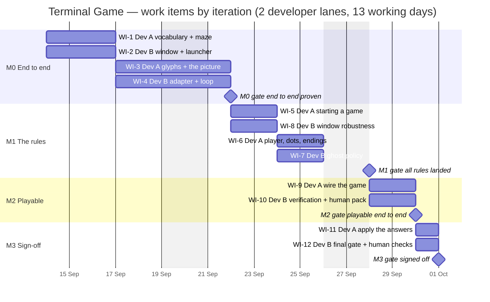

# Terminal Game — Implementation Plan

Source of truth for requirements: `docs/FUNCTIONAL_REQUIREMENTS.md` (49 codes).
Architecture being implemented: `docs/ARCHITECTURE.md` (approved; not re-litigated here).
Developer working practices: `.claude/agents/developer.md` (this plan overrides it in exactly one place — see §2.7).

Team size **D = 2**. Two developers work simultaneously, each in their own git
worktree. Four iterations, twelve work items, thirteen working days.

---

## 1. How to read this plan

This plan says **what** gets built, in what order, by whom, and how each piece is
judged done. It deliberately does **not** say what to call anything.

**File names, module names, class and function names, how a package is split,
the internal APIs between modules, and the shape of the tree under the source
root are yours, not mine.** The architecture sketches a module layout in its §3;
treat that as a helpful illustration of the intended *shape*, not as a
specification. If you find a better arrangement while looking at the code, take
it — that is not a deviation and needs no ruling from me. The one exception is
the child executable's file name, which is load-bearing (§2.6).

Where two work items touch the same area, I say which developer owns which
**responsibility** and leave the file boundary to the two of you to agree
between yourselves.

---

## 2. Ground rules — settled once, for everybody

These are the cross-cutting decisions. They are not open. Everything else is.

### 2.1 You are in NON-LOCAL MODE — real pull requests

Read this even if you read nothing else, because `developer.md` tells you to stop
and ask the user if the technical lead has not told you which mode you are in.
**You have been told. You are not in local mode.**

- The remote is **github.com/replicant1/NewTerminalGame**.
- Push your own work-item branch: `git push -u origin <branch>`.
- Open a **draft** PR as soon as you have a first commit, with your PR-summary
  markdown as the body.
- When the item is finished and the whole suite is green, update the body if it
  has drifted, then `gh pr ready <number>`.
- **Report the PR number and branch. Do not merge. Do not approve. Do not
  close.** The conductor merges, one branch at a time.
- Never push `main`. Never force-push. Never push another developer's branch.
- If a `gh` command is refused by permission tooling, stop, leave the branch and
  PR exactly as they are, and report what was refused.

### 2.2 One interpreter, one runner, one command

Two Pythons are installed on this machine and `pytest` is on neither. Measured
just now:

| | |
|---|---|
| `/usr/bin/python3` | 3.9.6, ships with macOS, **first on `PATH`** |
| `/opt/homebrew/bin/python3` | 3.14.7 |
| `pytest` | absent from both |
| `unittest` | present on both, behaviour identical on both |

**Pinned interpreter: `/usr/bin/python3`.** It is what a player who has
installed nothing will run, and pinning the system one means the game is proved
against the worst case. Use the absolute path in anything scripted.

**Pinned test runner: the standard library's `unittest`.** Do not add `pytest`,
a `requirements.txt`, a virtualenv, a `tox.ini`, a `pyproject.toml` or any
packaging. There are no third-party dependencies and there will not be.

**The whole suite is this one command, run from the root of your worktree:**

```
/usr/bin/python3 -m unittest discover -s tests
```

Every developer reports counts from **that exact command** and no other. "Ran N
tests … OK" or "FAILED (failures=x, errors=y)" is the line to quote. Never
report "tests pass".

**Language level: write for Python 3.9.** No `match`, no `X | Y` type unions, no
3.10+ standard library. (Architecture assumption A7.) Both interpreters must run
the suite; 3.14 is a cross-check, 3.9 is the gate.

### 2.3 Where tests live

**All tests live in `tests/` at the repo root, as flat files named `test_*.py`
directly in that directory.**

This is not a style preference. **Measured:** `unittest discover -s tests` does
**not** recurse into subdirectories of `tests/` unless they are importable
packages. I wrote two tests, one in `tests/` and one in `tests/sub/`, and the
command discovered **one** of them and reported `OK`. A test that silently does
not run is worse than a test that does not exist, because the suite stays green.

So:

- Flat `test_*.py` files in `tests/`. No nesting of test modules.
- **Do not add `tests/__init__.py`** — with it present, the pinned command
  changes behaviour.
- `tests/fixtures/` may hold **data** files (the spec's picture, hand-written
  maze grids). It must never hold a `test_*.py`.
- If you ever think the suite needs a directory structure, that is an `ASK`, not
  a decision.

### 2.4 The dependency rule between layers

The architecture has a pure core and an impure shell. This is the constraint;
how you arrange the files that satisfy it is yours.

**The pure core may import nothing impure.** Concretely, no module of the core
may import — directly or transitively — `curses`, `time`, `subprocess`, `os`,
`sys`, `pathlib`, or anything that reads a file, a clock, a terminal, an
environment variable or a window.

- `random` is the single permitted exception, and only as a **type**: every pure
  function that needs randomness takes a `random.Random` **as a parameter**.
  There is no module-level `random.*` call anywhere in the core. (Architecture
  C7. This is the only reason maze and ghost tests are reproducible.)
- The core reads no files. The golden fixture is loaded by the **test**, and
  handed to the core as a value.

**The shell may import the core. The core may never import the shell.** Arrows
point inward only.

**Nothing that crosses the seam may carry a curses type.** The rendered picture
is a value carrying *style identifiers*; the curses adapter is the only thing
that maps an identifier to a colour pair or an attribute. If the renderer ever
imports `curses`, the frame-comparison tests stop working without a tty and the
main safeguard on SCRN-1..6 is gone. (Architecture C6.)

**Exactly one module may `import curses`**, and exactly one module may shell out
to `osascript`. Neither may be the same module, and neither may be in the core.

A cheap way to keep yourself honest: a test that imports every core module with
`curses` and `subprocess` removed from `sys.modules` and poisoned, and asserts
the import still succeeds. Whoever builds WI-1 should write it; it then protects
everyone.

### 2.5 Where documents go

Four paths, from `developer.md`. Do not invent a fifth.

| Path | One per | Example |
|---|---|---|
| `docs/prs/PR-<ITEM>-<slug>.md` | work item | `docs/prs/PR-WI-3-glyph-tables.md` |
| `docs/completions/COMPLETION-<MILESTONE>-DEV-<X>.md` | lane, per iteration | `docs/completions/COMPLETION-M0-DEV-B.md` |
| `docs/progress/<branch-name>.md` | branch | `docs/progress/wi-3-glyph-tables.md` |
| `docs/findings/<ITEM>-<slug>.md` | measurement worth keeping | `docs/findings/WI-2-terminal-window-id.md` |

`<MILESTONE>` is the iteration code from §4 — `M0`, `M1`, `M2`, `M3`. `<X>` is
`A` or `B`, your lane. `<ITEM>` is the work item code exactly as this plan writes
it. `<slug>` is two or three lowercase hyphenated words. Never underscores.

If a document you want to write does not fit one of these four shapes, ask me
rather than inventing a fifth.

### 2.6 Working on the user's real desktop — the window-safety rules

Any work item touching WIN-1..5 (WI-2, WI-8, WI-9, WI-10, WI-12) opens Terminal
windows **on a real person's screen while they are sitting at it**. The user's
own shells, their editor, and the session you are running inside are all windows
in the same application. These rules are not style points; getting them wrong
destroys someone's work or freezes every subsequent AppleScript call in the
system.

1. **Capture the window `id` at the moment you create it, and address that id and
   nothing else.** Never `close front window`. Never close by title. Never
   enumerate windows and guess. Never close by index.
2. **Let the child exit, and confirm it has exited, before you close its
   window.** Poll `busy of tab 1 of (window id N)` until it is `false`.
3. **Never close a tab whose `busy` is `true`.** Terminal raises a modal
   confirmation sheet that only a human can dismiss, and **a modal sheet blocks
   every subsequent AppleScript call**. You will read that as a mysterious
   timeout and spend an hour on it. Do not.
4. **Never launch anything in a window you opened that blocks forever** — no
   `cat`, no `sleep infinity`, no `read` with no input. If you cannot end it, you
   cannot close its window without the sheet.
5. **Clean up on the failure path too.** Wrap the whole create/use/close sequence
   so that an exception, a timeout, or an interruption still runs the same
   wait-then-close-by-id. If the wait times out, report the window id and leave
   the window open rather than forcing it.
6. **After closing, verify with `visible`, not `exists`** — Terminal keeps a
   stale window object after a close.
7. **The child executable's file name is load-bearing** and is the one place in
   this project where I am fixing a name. Terminal composes the window title from
   its active process name; the recipe measured to produce a title of exactly
   *Terminal Game* requires the executable to be named literally `Terminal Game`,
   invoked with **no arguments**, via `do script "exec '<repo>/Terminal Game'"`.
   Renaming it, invoking it as `python3 "Terminal Game"`, or passing it an
   argument all break WIN-3. (Architecture C2.)

### 2.7 Testing — what I require, and the one place this plan overrides `developer.md`

**What I require:** every work item is covered by tests, and each item's entry in
§5 says what its tests must establish. Write assertions that pin the actual
behaviour, not the shape of the code — assert the consequence, not that a call
was made.

**What I do not require, at all:** proving that a test can fail. No mutation
sweeps. No `.mutations.json`. No table of mandatory mutations. No verification
work item that re-runs them. This is the user's decision and they have chosen not
to spend the effort here.

`developer.md` is internally inconsistent on this point: its section *"Proving
that tests can fail is not part of this workflow"* forbids the practice, but its
progress-log format still lists a `MUTATE` line and its final-report format still
has a section 5 headed *"Mutation checks"*. **This plan rules on the
inconsistency:**

- **Never write a `MUTATE` line** in your progress log.
- **Report section 5 reads exactly: `not applicable — not part of this
  workflow`.** Do not delete the section; a missing section makes two developers'
  reports unreadable against each other.

One requirement is fragile enough that I am raising it and leaving the decision
to the user rather than taking it myself: **END-3** — *eating the last dot on the
ghost's square is a loss, not a win* — is correct only because the collision test
is evaluated before the last-dot test, so a refactor that reorders two branches
breaks it invisibly and an ordinary test would still have been written against
the working order. If the user wants that one case specifically proved able to
fail, say so and I will add it; **no developer should do it on their own
initiative.**

### 2.8 Branches, baselines and the merge order

- **Branch each work item off `main`**, at the moment you start it. The conductor
  merges the previous round before dispatching the next, so `main` already
  contains what you depend on.
- **One branch per work item.** Do not create a "lane" branch. Do not stack
  unless §6 explicitly tells you to.
- **Never check out, merge into, reset, or otherwise touch `main`.** It is checked
  out in the primary worktree and git will refuse you anyway.
- **Commit as soon as a thing is true**, not when the work item is finished.
  Start every commit subject with the work item code: `WI-3: …`. All worktrees
  share one object store, so the conductor watches `git log --all --oneline` to
  see progress while you are still working. An interrupted developer who has
  committed loses nothing.
- **Branch names** — use these exactly, so the conductor knows what to merge and
  your progress log has a predictable name:

| Item | Branch | Progress log |
|---|---|---|
| WI-1 | `wi-1-vocabulary-maze` | `docs/progress/wi-1-vocabulary-maze.md` |
| WI-2 | `wi-2-window-launcher` | `docs/progress/wi-2-window-launcher.md` |
| WI-3 | `wi-3-glyphs-picture` | `docs/progress/wi-3-glyphs-picture.md` |
| WI-4 | `wi-4-adapter-loop` | `docs/progress/wi-4-adapter-loop.md` |
| WI-5 | `wi-5-starting-a-game` | `docs/progress/wi-5-starting-a-game.md` |
| WI-6 | `wi-6-player-dots-endings` | `docs/progress/wi-6-player-dots-endings.md` |
| WI-7 | `wi-7-ghost-policy` | `docs/progress/wi-7-ghost-policy.md` |
| WI-8 | `wi-8-window-robustness` | `docs/progress/wi-8-window-robustness.md` |
| WI-9 | `wi-9-wire-the-game` | `docs/progress/wi-9-wire-the-game.md` |
| WI-10 | `wi-10-verification-pack` | `docs/progress/wi-10-verification-pack.md` |
| WI-11 | `wi-11-apply-answers` | `docs/progress/wi-11-apply-answers.md` |
| WI-12 | `wi-12-final-gate` | `docs/progress/wi-12-final-gate.md` |

- **When your branch conflicts with `main`:** `git merge main` from your branch —
  do **not** rebase, it invalidates the PR. Resolve on the merits; the other side
  is a work item that has already landed. Run the **whole** suite afterwards, not
  just your own tests. Note in your log what conflicted and how you resolved it.
  If the resolution is not obvious, that is an `ASK`, not a quiet decision.

---

## 3. Dependency graph

The order of work is a topological sort of this graph. Two tracks run almost
independently: the **core track** (game vocabulary and rules, Dev A) and the
**shell track** (window, terminal, loop, Dev B). They meet at exactly two places
— the shared value vocabulary that WI-1 lands first, and the wiring that WI-9
lands last.

```
                        ┌──────────────────────────────────────────┐
                        │  WI-1  shared vocabulary + maze          │  (nothing)
                        └───┬───────────────┬───────────────┬──────┘
                            │               │               │
              ┌─────────────▼──┐   ┌────────▼───────┐   ┌───▼──────────────┐
              │ WI-3  glyphs   │   │ WI-4  adapter  │   │ WI-5  starting   │
              │       + picture│   │       + loop   │   │       a game     │
              └─────┬──────────┘   └───┬────────────┘   └──┬───────────┬───┘
                    │                  │                   │           │
                    │                  │        ┌──────────▼──┐  ┌─────▼──────┐
                    │                  │        │ WI-6 player │  │ WI-7 ghost │
                    │                  │        │ dots, ends  │  │ policy     │
                    │                  │        └──────┬──────┘  └─────┬──────┘
                    │                  │               │               │
                    │                  └───────────────┼───────────────┘
                    │                                  │
                    │                        ┌─────────▼──────────┐
                    │                        │ WI-9  wire the game│
                    │                        └─────────┬──────────┘
  ┌──────────────┐  │                                  │
  │ WI-2  window │──┼──►┌──────────────────┐           │
  │    + launcher│  │   │ WI-8 robustness  │           │
  └──────────────┘  │   └────────┬─────────┘           │
      (nothing)     │            │                     │
                    └────────────┼─────────────────────┤
                                 │                     │
                        ┌────────▼─────────────────────▼───┐
                        │ WI-10  verification + human pack │
                        └────────────────┬─────────────────┘
                                         │
                     ┌───────────────────┴───────────────────┐
                     │                                       │
          ┌──────────▼───────────┐            ┌──────────────▼─────────┐
          │ WI-11 apply answers  │            │ WI-12 final gate       │
          │       (conditional)  │            │       + human checks   │
          └──────────────────────┘            └────────────────────────┘
```

**WI-1 is the bottleneck and I have made it so deliberately.** It defines the
shared vocabulary that seven other items speak, so it lands first and alone in
its lane. Its one non-obvious obligation (§5, WI-1) is to ship the
*corridor / open-neighbour* query, because **WI-6 and WI-7 both need it** and
they are the one parallel pair in this plan that shares a module. If WI-1 does
not ship it, they will each invent it and collide.

---

## 4. The iterations

Effort is in **developer-days**, where one day is one focused work-item turn.
Two lanes run every day, so an iteration of *n* elapsed days carries *2n*
developer-days.

| Iteration | Theme | Requirements landed | Work items | Days (elapsed) | Effort (dev-days) | Ends |
|---|---|---|---|---|---|---|
| **M0** | **End to end through every layer** — prove the architecture: two processes, a real window, a real curses screen, a real random maze, a real picture, and the pure/impure seam holding | GAME-1, GAME-3, WIN-1..5, SCRN-1..7, MAZE-1..6, START-5 (paint-first), CTRL-1, CTRL-4, CTRL-5, GHOST-1 (clock), END-4, END-6, SCORE-5 (shown), STAT-1..3 | WI-1, WI-2, WI-3, WI-4 | 1–6 | 12 | day 6 |
| **M1** | **The rules of the game** — every remaining pure decision: where things start, what a move does, what the ghost does, and which ending wins a race | START-1..4, CTRL-2, CTRL-3, SCORE-1..5, GHOST-2..4, END-1, END-2, END-3, END-5, GAME-2 | WI-5, WI-8, WI-6, WI-7 | 7–10 | 8 | day 10 |
| **M2** | **A game you can actually play** — the real transitions replace the stand-ins; the whole thing is exercised as a game, and everything a human must judge is packaged for them | (integration of all of the above; no new codes) | WI-9, WI-10 | 11–12 | 4 | day 12 |
| **M3** | **Verification and sign-off** — the three open questions applied, the suite gated, the six human checks run against the final build | (none new) | WI-11, WI-12 | 13 | 2 | day 13 |
| | | **49 of 49 traced** | **12 items** | **13** | **26** | |

Reconciliation: 13 elapsed days × 2 lanes = 26 developer-days = the sum of the
twelve work-item efforts in §5. The per-iteration effort column is the sum of its
own items' bars in §7.

---

## 5. The work items

Each item states: the outcome (not a layout), the requirements it lands, what its
tests must establish, and how I will judge it done.

Throughout: *"a maze"* means the 29-row × 19-column grid of wall/corridor cells;
*"the picture"* means the 30-row × 40-column grid of character-plus-style that
crosses the pure/impure seam; *"the state"* means the immutable value carrying
maze, player, ghost, ghost heading, remaining dots, score and outcome. Call them
whatever you like in code.

---

### WI-1 — The shared value vocabulary and the maze generator
**Iteration M0 · Dev A · 3 days · depends on nothing · branch `wi-1-vocabulary-maze`**

**Outcome.** The immutable value types every other work item speaks, and a pure
function that, given a seeded random source, produces a maze satisfying every
MAZE requirement.

Specifically:

- Frozen value types for: a maze, a position, a direction, an outcome
  (playing / caught / cleared), a game state, and **the picture** (a grid of
  character-plus-style-identifier that can be read back as 30 plain strings).
  Every transition anywhere in this project returns a **new** state; nothing
  mutates. Define the picture type here even though nothing fills it yet —
  **WI-3 fills it and WI-4 consumes it in parallel, and they can only do that if
  the type is already merged.**
- **The maze value must answer, for any cell, whether it is corridor, and which
  of its four neighbours are corridor.** This is the item's one non-obvious
  obligation. WI-6 and WI-7 both need that answer and neither may introduce it
  into a file the other is editing at the same time.
- `generate(rng)` over a 9 × 14 node lattice: randomised depth-first search for a
  spanning tree, then a braid pass adding one edge to every degree-1 node, then
  painted onto the 29 × 19 cell grid. The architecture's §5.2 explains why this
  shape makes MAZE-5 tractable; follow the reasoning, not the pseudocode.
- A loader that turns a text grid into a maze value, so tests and later items can
  hand-write boards. It reads a **string**, not a file — the test does the file
  reading (§2.4).
- The import-purity test described in §2.4.

**Lands.** GAME-1 (the state carries a player, a ghost, dots and a maze),
GAME-3 (*by absence* — the state has no lives, level, timer, power-up, pause or
restart field, and nothing anywhere may add one), MAZE-1, MAZE-2, MAZE-3,
MAZE-4, MAZE-5, MAZE-6.

**Tests must establish.**
- Over **1000 seeds**, every generated maze: has a solid wall border (row 0 and
  28, column 0 and 18 are never corridor — MAZE-3); has **no corridor cell with
  fewer than two corridor neighbours** (MAZE-5); has all corridor cells mutually
  reachable by flood fill (MAZE-6); contains **no 2×2 block of corridor**, which
  is what pins "corridors are one square wide" (MAZE-2); and is 29 × 19
  (MAZE-1).
- Two different seeds produce two different mazes (MAZE-4); the same seed
  produces the identical maze twice (which is what makes every other test in this
  project reproducible).
- The spec's own picture, decoded into a grid and loaded, satisfies every
  invariant above. If it does not, the decoding is wrong, not the spec — the
  architect measured it as a legal maze with 264 corridors.
- The state type is frozen: attempting to mutate it raises.
- The maze's neighbour query agrees with a naive recount on a hand-written board.
- Every core module imports cleanly with `curses` and `subprocess` unavailable.

**Done when.** The suite is green at the pinned command; 1000-seed invariants
pass in under a couple of seconds; a reviewer can read the state type and see
that GAME-3 holds by there being nothing there.

---

### WI-2 — The window, the launcher and the two executables
**Iteration M0 · Dev B · 3 days · depends on nothing · branch `wi-2-window-launcher`**

**Read §2.6 before you write a line of this.** This item drives the user's real
desktop.

**Outcome.** Two executables and the AppleScript adapter behind them.

- A **supervisor** the player runs. It reads the position of the window the
  player was last looking at — preferring the Terminal window whose tab's `tty`
  equals the supervisor's own controlling tty, falling back to Terminal's front
  window, falling back to a fixed position. It creates a new Terminal window
  running the child, **captures that window's id immediately**, and thereafter
  addresses that id and nothing else. It sets the new tab to 40 columns × 30
  rows, Menlo 18, black background, every scriptable title component off. It
  positions the window at a modest offset below and right of the reference. It
  then waits for the child to exit, and closes that window by id — on the success
  path and on the failure path alike.
- A **child** executable named literally `Terminal Game`, invoked with no
  arguments. Its first write is the escape sequence that clears Terminal's
  working-directory title prefix. Its body is **one call into a game entry
  point**; in M0 that entry point may be a placeholder that paints a static
  screen and returns on `q`. WI-9 replaces the entry point's implementation and
  **must not need to touch this executable**.
- The AppleScript adapter itself: the only thing in the project that shells out
  to `osascript`.

**Lands.** WIN-1, WIN-2, WIN-3, WIN-4, WIN-5.

**Tests must establish.** The AppleScript is not unit-testable, so pull the
decisions out of it and test *those*:
- The **offset arithmetic** is a pure function of the reference position — test
  it directly, including that a reference near the bottom-right of a screen still
  yields coordinates the architect measured as on-screen for a 477 × 707 px
  window.
- The **fallback chain** is a pure function of what the query returned: reference
  found / reference not found but a front window exists / neither. Three cases,
  three assertions. Do not test it by opening windows.
- The **AppleScript the adapter composes** is a pure function of a window id and
  the settings — assert the generated script text addresses `window id` and
  contains neither `front window` nor a title match. That assertion is the
  cheapest guard in the project against rule 1 of §2.6.
- One **live smoke** that opens a window running a child which exits
  immediately, asserts the window was created, asserts it was closed **by the
  captured id**, and asserts the number of Terminal windows is what it was
  before. Guard it so it is skipped when there is no controlling tty, and make
  its cleanup unconditional.

**Done when.** `./play` opens a black 40 × 30 window; `stty size` inside it
reports `30 40`; the window's `name` reads back exactly `Terminal Game`; pressing
`q` ends the child and the window closes and nothing else on the screen moved.
The last three of those are **human checks H1–H4** (§8) — you may report what you
observed, but **you may not report WIN-4 as done on your own say-so**: you have
no controlling tty and cannot see the screen.

**Write a `docs/findings/` document** recording every AppleScript incantation
that worked and every one that did not, with the exact error text. WI-8 and
WI-10 will rely on it and your PR summary will not be read again.

---

### WI-3 — Glyph and colour tables, and the whole picture
**Iteration M0 · Dev A · 3 days · depends on WI-1 · branch `wi-3-glyphs-picture`**

**Outcome.** A pure function from a game state to the picture, and the tables it
draws from. No curses anywhere near it.

- The **wall glyph rule**: a pure mapping from a 4-bit mask of which of a wall
  cell's north / south / east / west cell-neighbours are wall, to its glyph. All
  sixteen cases. Fifteen of them were read directly off the spec's mock-up; the
  all-four case is the only inferred one.
- The **joiner-column rule**: the picture is twice as wide as the maze; the odd
  columns hold a horizontal bar if and only if the cells on both sides are wall,
  and are blank otherwise.
- The **dot**, the **player** and the **ghost** glyphs, and a **style identifier**
  for each colour-and-attribute the spec names — blue walls, dim gold dots,
  bright yellow player, pink ghost, cyan status line. Style *identifiers*, not
  curses constants (§2.4).
- The **draw order**: walls, then dots, then the player, then **the ghost last**.
  That single ordering is all of END-4 and costs nothing.
- The **status line** on the bottom row, in cyan, carrying the score and the
  keys and nothing else, with a different text for each of the three outcomes.
- The **right-hand margin**: the picture is 40 columns; the maze occupies 0–36;
  37–39 are blank. That is MAZE-1's "narrow blank margin".

**Lands.** SCRN-1, SCRN-2, SCRN-3, SCRN-4, SCRN-5, SCRN-6, MAZE-1 (the margin),
SCORE-5 (the score is shown), END-4 (draw order), STAT-1, STAT-2, STAT-3.

**Tests must establish.**
- **All sixteen wall masks**, each asserted against the table decoded from the
  mock-up. Exhaustive, not sampled.
- **The golden fixture**: the spec's own picture, stored as data under
  `tests/fixtures/`, decoded into a maze; rendering a state built on that maze
  must produce **exactly** those 30 rows of text. This is the strongest test in
  the project and it pins SCRN-1..6 to the specification document itself.
- **The joiner-column invariant**: for every corridor cell, the picture columns
  either side of it are blank. The three-character-wide player and ghost spill
  into those columns and the whole scheme collapses quietly if this is ever not
  true. Assert it over many seeds.
- The player and ghost never spill off the left or right edge of the picture —
  they only ever stand on corridor cells, and column 0 and column 18 are always
  wall, so the spill is always in range. Assert it rather than reasoning about it.
- **Draw order**: a state with the player and the ghost on the same cell renders
  the ghost (END-4).
- **All three status strings**, character for character, at each of the three
  outcomes, including the score substituted. Note assumption **A3** below.
- The rendered picture contains only characters and style identifiers — no
  curses types (SCRN-2 in the sense that matters).

**Done when.** The suite is green and the golden fixture passes. The picture
looking *right* to a person is **human check H6**; you cannot judge it.

**Open question A3 touches only this item.** See §9.

---

### WI-4 — The curses adapter and the loop with its one deadline
**Iteration M0 · Dev B · 3 days · depends on WI-1, WI-2 · branch `wi-4-adapter-loop`**

**Outcome.** The only module that imports curses, and the single-threaded loop
that owns the game's one clock.

- The **adapter**: enter and leave curses safely; hide the cursor; turn echo off;
  cbreak; enable the keypad; set the escape delay so a stray escape does not look
  like a freeze; paint a picture; read a key with a timeout.
- The **key decision must be a pure function of a key code** — arrows to
  directions, `q` and `Q` to quit, **everything else to nothing**. Pull it out of
  the adapter so it can be tested with no terminal attached.
- The **deadline decision must be a pure function of (now, next deadline)** —
  likewise pulled out.
- The **loop**: paint before the first read, so the game is already under way
  when the window appears; read a key with a timeout equal to the time remaining
  until the ghost's deadline; a quit key returns; a direction applies a player
  transition; when the deadline has passed, apply a ghost transition and advance
  the deadline by adding a tick to it (never by resetting it to *now* plus a
  tick, which accumulates drift); repaint; repeat.
- **The loop must be drivable in a test by a fake screen and a fake clock.** This
  is a hard requirement, not a suggestion — see the contradiction in §10.
- The real player and ghost transitions do not exist yet. Ship **stand-ins** that
  the loop calls through whatever seam you choose: a player stand-in that steps
  if the target is corridor, and a ghost stand-in that does nothing. **They carry
  no requirement code and WI-9 deletes them.** They exist so the M0 demo actually
  moves, which is what proves the seam.
- **Guard the bottom-right cell.** Measured by the architect: writing a character
  at the last cell of the last row raises `addwstr() returned ERR`; inserting at
  the same cell succeeds. The status line is on that row and a naive full repaint
  writes every cell. Either keep the paint off that one cell or insert rather
  than write there. Do not discover this during a demo.
- Do **not** add a second clock, a thread, `asyncio`, or a signal handler. Do
  **not** optimise the repaint — it was measured at 0.25 ms against a 143 ms
  budget, and dirty-rectangle tracking would be the first thing to introduce a
  rendering bug and the last thing to be needed.

**Lands.** SCRN-7, CTRL-1 (the mapping), CTRL-2 (one move per key event — the
loop holds no auto-repeat state), CTRL-4, CTRL-5, GHOST-1 (the deadline),
START-5 (painted before the first read), END-6 (the loop returns only on quit).

**Tests must establish.**
- The **key mapping table exhaustively**: each of the four arrow codes maps to
  its direction; `q` and `Q` map to quit; a representative sweep of other codes —
  letters, digits, punctuation, function keys, a resize event — maps to nothing.
  No tty needed.
- The **deadline function**: given a now before the deadline it says wait that
  many milliseconds; given a now at or past it, it says the tick is due; and the
  advance is *additive*, so a sequence of late calls does not accumulate drift.
  Assert the drift property over a simulated hundred ticks with deliberately
  late clock readings.
- The **loop, against a fake screen and a fake clock**: a quit key returns
  immediately; an arrow key produces exactly one player transition and no more;
  a run with no key presses still produces one ghost transition per tick
  ("whether or not the player is moving" — GHOST-1); a picture is painted before
  the first key is read (START-5); a picture is painted after every state change.
- The bottom-right cell can be written without raising — as a unit test against a
  small pseudo-terminal if you can make one, otherwise as an assertion that the
  paint never targets that cell.

**Done when.** The suite is green, and `./play` shows a real random maze with
dots, the player moving on the arrow keys, the cursor invisible, and `q` closing
the window. Absence of flicker is **human check H5**.

---

### WI-5 — Starting a game
**Iteration M1 · Dev A · 2 days · depends on WI-1 · branch `wi-5-starting-a-game`**

**Outcome.** A pure function from a seeded random source to a fresh game state.

- The player starts on the corridor cell nearest the middle of the grid, ties
  broken by lowest row then lowest column.
- The ghost starts on the corridor cell furthest from the player, measured across
  the grid rather than along the corridors, ties broken the same way. See
  assumption **A2** in §9.
- Every corridor cell holds a dot **except** the player's.
- The score is zero and the outcome is "playing".
- The ghost faces a direction that is open from where it stands — chosen from the
  same random source, so a seed reproduces the whole starting position.

**Lands.** START-1, START-2, START-3, START-4, and the state half of START-5
(nothing has to be pressed; there is no title screen and no "press any key"
anywhere in this item).

**Tests must establish.** Over many seeds:
- The player's cell is corridor, and **no other corridor cell is strictly nearer
  the centre**; where one ties, the chosen one is the lowest `(row, column)`.
  Assert by exhaustive recount over the board, not by recomputing with the same
  expression the code uses.
- The ghost's cell is corridor, and **no other corridor cell is strictly further
  from the player** under the chosen metric, with the same tie rule.
- The count of dots is exactly the count of corridor cells minus one, and the
  player's cell is not among them.
- The score is zero and the outcome is "playing".
- The ghost's initial heading is open from its cell.
- On a hand-written board small enough to check by hand, the player and ghost
  land where a reader would expect.
- The same seed gives the identical starting state twice.

**Done when.** The suite is green and a reviewer can read the two placement rules
off the code without running it.

**Open question A2 touches only this item.** See §9.

---

### WI-6 — Player movement, dots, score, and the endings the player's move decides
**Iteration M1 · Dev A · 2 days · depends on WI-1, WI-5 · branch `wi-6-player-dots-endings`**

**Outcome.** A total pure transition from (state, direction) to a new state.

- If the game has already ended, return the state **unchanged** — arrows do
  nothing after an ending.
- If the target cell is wall, return the state **unchanged**: not a different
  state that happens to be equal, and not a state with a changed score. "Nothing
  at all" is the requirement's own phrase.
- Otherwise the player moves one cell. If the target held a dot, the dot is
  removed and the score goes up by exactly one; if it did not, the score is
  unchanged.
- **Then the outcome**, and the order here is the requirement: **if the target is
  the ghost's cell, the game is lost. Otherwise, if no dots remain, the game is
  won.** Lost is tested first. That ordering *is* END-3.

**You own the player transition. Dev B owns the ghost transition in the same
iteration** (WI-7). Neither of you may add a shared helper for "is this corridor"
or "which neighbours are open" — WI-1 shipped that on the maze value. If you
find you need something else in common, agree the boundary with Dev B directly
before either of you writes it; that is a conversation between two people looking
at the code, not a line in this plan.

**Lands.** CTRL-1 (the move itself), CTRL-2, CTRL-3, SCORE-1, SCORE-2, SCORE-3,
SCORE-5 (never goes down), END-1 (player walks into ghost), END-2, END-3,
END-5 (the player half), GAME-2.

**Tests must establish.**
- A press towards a wall leaves the state **identical** — position, dots, score
  and outcome all unchanged (CTRL-3).
- A press towards a corridor moves exactly one cell and no more (CTRL-2).
- Moving onto a dotted cell removes that dot and adds exactly one to the score;
  the dot is gone from the state for good (SCORE-1, SCORE-2).
- Moving back onto that same cell adds nothing (SCORE-3).
- Across a scripted run of many moves, the score is **non-decreasing at every
  step** (SCORE-5).
- Walking onto the ghost's cell loses the game (END-1).
- Eating the last dot on an empty cell wins the game (END-2).
- **END-3, as a named test of its own:** a board with exactly one dot left, that
  dot on the ghost's cell, and the player one step away. The result is a **loss**,
  not a win. Name the test so it cannot be deleted by accident. (This is the
  requirement flagged in §2.7.)
- After a loss and after a win, every direction leaves the state identical
  (END-5).
- Every test board is hand-written and small enough that a reader can verify the
  expected answer by eye.

**Done when.** The suite is green and the END-3 test is present, named, and
passing.

---

### WI-7 — The ghost's movement policy
**Iteration M1 · Dev B · 2 days · depends on WI-1, WI-5 · branch `wi-7-ghost-policy`**

**Outcome.** A total pure transition from (state, random source) to a new state.
A pure function of the maze, the ghost's cell and the ghost's heading — testable
with no terminal, no window and no clock.

- If the game has already ended, return the state **unchanged**.
- If the cell straight ahead is open, keep going: same heading, one cell on.
- Otherwise, choose uniformly at random from the open directions **other than the
  reverse of the current heading**; reverse only when there is no other choice.
- The ghost moves; if it lands on the player, the game is lost.
- **Dots and score are returned untouched.** A dot under the ghost is still there
  to be taken.
- **The ghost must not read the player's position for anything except the
  collision test.** It does not hunt and takes no notice of where the player is.

See the note in WI-6 about the shared module boundary; it binds you equally.

**Lands.** GHOST-2, GHOST-3, GHOST-4, SCORE-4, END-1 (ghost walks into player),
END-5 (the ghost half).

**Tests must establish.**
- In a straight corridor, the ghost keeps the same heading for the whole run and
  arrives where a reader would expect (GHOST-2).
- At a hand-built T-junction, with a seeded random source, the chosen direction
  is always one of the non-reverse arms — assert over many seeds that **the
  reverse is never chosen** and that **both arms are chosen at least once**, so
  the test would catch a policy that always picks the first option (GHOST-3).
- In a hand-built cul-de-sac — which a generated maze never contains, by MAZE-5,
  so you must build one — the ghost reverses (GHOST-3's last clause).
- **GHOST-4:** run the ghost for many ticks from the same seed with the player
  placed in three different positions, and assert the three ghost paths are
  **identical**. This is the test that would catch a ghost that quietly started
  hunting.
- Dots and score are the same object-for-object before and after a ghost move,
  including when the ghost stands on a dotted cell and when it leaves one
  (SCORE-4).
- The ghost landing on the player loses the game (END-1).
- After an ending, a ghost tick leaves the state identical (END-5).

**Done when.** The suite is green and the GHOST-4 test is present.

---

### WI-8 — Window robustness, the failure-path close, and the launch smoke
**Iteration M1 · Dev B · 2 days · depends on WI-2 · branch `wi-8-window-robustness`**

**Read §2.6 again before you start.** This item exists because WI-2 proves the
happy path and the happy path is not what loses somebody's work.

**Outcome.** Every failure path in the launcher ends with the window closed, the
user's other windows untouched, and a message that says what happened.

- The child crashes on startup → the supervisor still waits for busy to clear,
  then closes by id.
- The child hangs → the supervisor times out, **reports the window id, and leaves
  the window open rather than forcing a close on a busy tab**. Make the timeout a
  named constant and say in the PR summary what you set it to and why.
- The supervisor itself is interrupted → the window is still closed.
- The reference-window query fails, or Terminal is not running, or the game was
  launched from something that is not Terminal → the fixed-position fallback is
  used and the game still runs.
- `osascript` returns an error at any step → it is surfaced with its text, not
  swallowed.
- After a close, existence is confirmed with `visible`, not `exists`.

**A repeatable launch smoke** that the conductor and the user can run in one
command: launch, confirm the window appeared with the right size and title,
confirm the child exited, confirm the window closed by the captured id, and
confirm the Terminal window count is unchanged. It must be safe to run while the
user has other windows open, and it must clean up if it fails partway.

**Lands.** No new codes. It hardens WIN-1..5, which WI-2 landed.

**Tests must establish.**
- Each failure branch, with the AppleScript layer replaced by a fake that returns
  the failure in question: assert the close-by-id was attempted in every case
  **including the exception path**, and assert that on timeout the close was
  **not** attempted and the id was reported.
- The fake records every command issued; assert that **no command in any path
  mentions `front window`, a window title, or a window index**. That is the
  regression test for the rule that matters most.
- The fallback chain again, end to end, with the query faked to fail.

**Done when.** The smoke runs green twice in a row on a machine with other
Terminal windows open, and those windows are still there afterwards. Record the
timeout you chose in `docs/findings/`.

---

### WI-9 — Wire the real game together
**Iteration M2 · Dev A · 2 days · depends on WI-4, WI-6, WI-7 · branch `wi-9-wire-the-game`**

**Outcome.** The stand-ins from WI-4 are deleted and the real starting state, the
real player transition and the real ghost transition are what the loop drives.
The result is the game the specification describes, playable end to end.

- A fresh game is generated at startup from an unseeded random source, so no two
  games are the same.
- The first picture is painted before the first key is read, and the ghost's
  first deadline is one tick after that.
- Arrow keys move the player; the ghost moves about seven times a second whether
  or not the player is moving.
- When the game ends, the last picture stays on the screen, the ghost stands
  still, the arrow keys do nothing, and the status line says which ending
  happened and the final score.
- `q` is the only way out of a finished game, and the process exiting is what
  lets the supervisor close the window.
- **The child executable from WI-2 must not need to change.** If it does, say so
  in your PR summary — that means the seam WI-2 built was in the wrong place, and
  it is worth knowing.

**Lands.** No new codes; it is where GAME-1, GAME-2, START-5, CTRL-1..5,
GHOST-1, END-4, END-5, END-6 and WIN-5 stop being true in pieces and start being
true of the running program.

**Tests must establish.**
- A **scripted full game** against a fake screen and a fake clock: feed a
  sequence of keys and clock readings and assert the state trajectory. Include at
  minimum a run that ends in a win and a run that ends in a loss.
- After the state's outcome is not "playing": further arrow keys and further
  ticks leave the state identical, and a picture is still painted (END-5), and
  the status line shows the ending (STAT-3).
- Only quit returns from the loop; an ending does not (END-6).
- Two consecutive fresh games from an unseeded source differ (MAZE-4 end to end).
- The whole suite from every previous item still passes — quote the counts.

**Done when.** A person can play the game to a win and to a loss, and the suite
is green. Report what you observed but do not claim the perceptual checks.

---

### WI-10 — The verification harness and the human-check pack
**Iteration M2 · Dev B · 2 days · depends on WI-3, WI-8 · branch `wi-10-verification-pack`**

**Outcome.** Everything a human must judge, packaged so that judging it takes
minutes rather than an afternoon — plus the automated verification that can be
run repeatedly.

- A **human-check pack**: the six checks in §8, each written as *what to type*,
  *what you should see*, and *what would count as a failure*. It goes in
  `docs/findings/WI-10-human-checks.md`. It must be usable by someone who has not
  read this plan.
- For each check, whatever setup makes it a single step. H1 (where the window
  lands) in particular: give the user a way to run it from a window they have
  deliberately positioned, so they can see whether the offset is right rather
  than guessing.
- A **repeatable end-to-end verification** that runs as far as an agent can get
  without a controlling tty: the whole suite, the launch smoke from WI-8, and a
  scripted play-through that drives the loop with a fake screen and asserts the
  final picture. One command.
- Confirm and, if necessary, fix the bottom-right-cell behaviour against a real
  40 × 30 window rather than against reasoning.

**Lands.** No new codes. It re-verifies WIN-1..5 and SCRN-7 and packages H1–H6.

**Tests must establish.** The verification command is itself green, and its
failure output names which stage failed. A harness that cannot say what broke is
not a harness.

**Done when.** The pack exists, the verification command runs green, and the
conductor can hand the pack to the user unchanged.

---

### WI-11 — Apply the answers to the three open questions
**Iteration M3 · Dev A · 1 day · conditional · branch `wi-11-apply-answers`**

**This item is conditional and may close empty.** Three questions are with the
user (§9). The plan proceeds on the architect's assumptions. If the answers
confirm them, this item is a no-op and you close it saying so. If any answer
differs, apply it:

- **A1 differs** (the window should close on the final frame rather than on `q`):
  remove the wait from the supervisor. Touches WI-2's and WI-8's deliverable and
  human check H2. Note that this makes WIN-5 and END-5/END-6 genuinely
  contradictory — see §10 — so if the answer comes back this way, raise it with
  me before implementing, because the specification then needs a second answer.
- **A2 differs** (a different distance metric for START-2): change one expression
  and its test, in WI-5's deliverable.
- **A3 differs** (different status-line spacing): change one function and three
  tests, in WI-3's deliverable.

**Tests must establish.** Whatever the answer changed, plus the whole suite
still green.

**Done when.** Each of A1, A2 and A3 is either applied or recorded as confirmed,
in the PR summary, by name.

---

### WI-12 — The final gate and the human-check run
**Iteration M3 · Dev B · 1 day · depends on everything · branch `wi-12-final-gate`**

**Outcome.** Evidence that the finished program does what the specification says.

- Run the whole suite at the pinned command on a `main` with everything merged.
  Quote the exact counts.
- Run the verification command from WI-10. Quote its output.
- Walk the user through **all six human checks** and record their answers,
  verbatim, in `docs/findings/WI-12-human-check-results.md` — one line per check
  saying pass, fail, or not run, and what the user actually saw.
- Produce a **traceability confirmation**: all 49 requirement codes, each with the
  test or the human check that demonstrates it. Where a code is demonstrated only
  by a human check, say so plainly rather than implying a test exists. This goes
  in `docs/completions/COMPLETION-M3-DEV-B.md`.
- List anything still unverified. "I could not determine this without the user"
  is a good answer.

**Done when.** The traceability confirmation covers 49 of 49 and the human-check
results file has a line for each of H1–H6.

---

## 6. Parallelism — the pairing, per round

The conductor runs **two developers at a time** and merges **one branch at a
time**, so the second branch of every pair merges into a `main` that has moved.
The pairing below is chosen so that the second merge is a fast-forward or a clean
three-way merge in every case but one, which is called out.

**Merge round *n* completely before dispatching round *n+1*.** Every round-2
item depends on something from round 1.

| Round | Days | Dev A | Dev B | Why the pair is safe |
|---|---|---|---|---|
| **1** | 1–3 | **WI-1** vocabulary + maze | **WI-2** window + launcher | **Zero overlap by construction.** WI-1 is pure core and touches nothing that knows a terminal exists. WI-2 is the AppleScript island and imports nothing from the core — it does not even need the game to exist. Neither can see the other's area. Merge in either order. |
| **2** | 4–6 | **WI-3** glyphs + picture | **WI-4** adapter + loop | **They meet at one already-merged value type.** WI-1 landed the picture type in round 1; WI-3 fills it, WI-4 consumes it, and neither changes it. WI-3 is pure and forbidden to import curses; WI-4 is the sole curses importer and forbidden to hold game logic. The dependency rule (§2.4) is what makes this pair safe, so if either of you is tempted to break it, that is the moment to stop. Merge WI-3 first — WI-4's demo reads better against a real picture. |
| **3** | 7–8 | **WI-5** starting a game | **WI-8** window robustness | **Zero overlap.** Pure core versus the AppleScript island again. Merge in either order. |
| **4** | 9–10 | **WI-6** player, dots, endings | **WI-7** ghost policy | **This is the one pair that shares a module, and I am pairing them anyway.** They own two different transitions. The mitigation is structural: WI-1 already shipped the corridor/open-neighbour query on the maze value, so **neither item needs to introduce a shared helper**, which is the only thing that would make this collide badly. Merge **WI-6 first** (it is the larger diff and carries END-3), then WI-7. If WI-7 conflicts, it is WI-7's developer who resolves it, and the resolution should be mechanical. If it is not mechanical, that is an `ASK` — it would mean the two transitions disagreed about something real. |
| **5** | 11–12 | **WI-9** wire the game | **WI-10** verification + human pack | **Near-zero overlap.** WI-9 touches the loop and deletes the stand-ins; WI-10 touches the harness, the pack, and at most the one bottom-right cell in the adapter. Merge **WI-9 first**, because WI-10's play-through assertion is worth more against the real game than against the stand-ins. If WI-10 finds the bottom-right cell needs a real fix, it stacks cleanly on WI-9 having already merged. |
| **6** | 13 | **WI-11** apply answers | **WI-12** final gate | **WI-12 must merge last**, because its whole output is evidence about a finished `main`. If WI-11 is not a no-op, dispatch WI-11 first and let WI-12 start only once it has merged; if WI-11 closes empty, run them together. This is the one pair that may need to be sequenced, and you will know which as soon as the user answers §9. |

**Stacking.** No branch in this plan is stacked on an unmerged branch. If a
situation arises where one must be, the PR is opened with `--base <parent
branch>`, the PR body says which branch it is stacked on and why, and it is
retargeted to `main` with `gh pr edit <number> --base main` once the parent
merges.

---

## 7. Schedule

The chart below is **grouped by iteration**, one section per iteration, and each
bar is one work item labelled with its code and its lane. Each iteration also
carries a milestone marker at its boundary — `M0 gate` through `M3 gate` — so
every iteration in the §4 table is visible in the chart as both a section and a
marker. The two lanes run concurrently, which is why two bars share every date
range.

Days are **working days**. Day 1 is Monday 14 September; weekends are excluded.
The mapping, so the dates in the chart and the day numbers in the §4 table can be
checked against each other:

| Day | 1 | 2 | 3 | 4 | 5 | 6 | 7 | 8 | 9 | 10 | 11 | 12 | 13 |
|---|---|---|---|---|---|---|---|---|---|---|---|---|---|
| Date | Mon 14 | Tue 15 | Wed 16 | Thu 17 | Fri 18 | Mon 21 | Tue 22 | Wed 23 | Thu 24 | Fri 25 | Mon 28 | Tue 29 | Wed 30 |



**Reconciliation** — checked bar by bar against §4 and §5:

| Iteration | Bars in the chart | Bar days | Sum | §4 effort | §4 elapsed days | Gate marker |
|---|---|---|---|---|---|---|
| M0 | WI-1, WI-2, WI-3, WI-4 | 3+3+3+3 | 12 | 12 | 1–6 | `M0 gate` at end of day 6 |
| M1 | WI-5, WI-8, WI-6, WI-7 | 2+2+2+2 | 8 | 8 | 7–10 | `M1 gate` at end of day 10 |
| M2 | WI-9, WI-10 | 2+2 | 4 | 4 | 11–12 | `M2 gate` at end of day 12 |
| M3 | WI-11, WI-12 | 1+1 | 2 | 2 | 13 | `M3 gate` at end of day 13 |
| **Total** | **12 bars = 12 work items** | | **26** | **26** | **13** | **4 gates = 4 iterations** |

Each milestone is drawn on the first day *after* the iteration it closes, which
is how a zero-duration marker renders at a boundary: `M0 gate` on 22 Sep marks
the end of day 6 (21 Sep), and so on.

---

## 8. What needs a human, and when

Six checks cannot be asserted by any agent in this project. Every agent here runs
without a controlling tty — the architect confirmed `tty` reports "not a tty" —
and none of us can see the screen.

**No work item may report any of these as done on an agent's say-so.** A
developer may report what they observed indirectly; they may not report the
requirement as verified.

| # | Check | Requirement | Who runs it | When | What to look for |
|---|---|---|---|---|---|
| **H1** | The window lands a little below and to the right of the window `./play` was typed in, and is fully on screen | **WIN-4** | The user | **M0 gate** (after WI-2 merges), re-run at M3 | Move a Terminal window to an awkward place — near the bottom-right of the screen — then run `./play` from it. The new window should be offset from *that* window, and entirely visible. **This one is structurally impossible for an agent:** with no controlling tty there is no "window the player was last looking at" to be offset from. |
| **H2** | Pressing `q` closes the game window and leaves every other window alone | **WIN-5** | The user | **M0 gate**, re-run at **M2 gate** and M3 | Open three or four other Terminal windows first. Play, press `q`. The game window closes; all the others are exactly as they were; no confirmation sheet appears. The failure mode here is destructive, which is why it is a human check rather than a smoke test. |
| **H3** | The title bar reads exactly *Terminal Game* | **WIN-3** | The user | **M0 gate**, re-run at M3 | No working-directory prefix, no process-name suffix, no doubled name. This depends on Terminal's per-profile title settings and on the macOS version, and it was measured on macOS 26.6.2 — re-run it on any other version. |
| **H4** | 18 pt Menlo is large enough to read comfortably | **WIN-2** | The user | **M0 gate** | A judgement, not a measurement. If it is wrong it is one constant. |
| **H5** | No visible flicker while the ghost moves | **SCRN-7** | The user | **M2 gate** (needs real movement) | Watch the ghost cross the maze. Nothing should tear, blink or briefly blank. Not judgeable before WI-9, because before that nothing moves on its own. |
| **H6** | The walls look like the picture in the specification, and the player and the ghost can be told apart at a glance by colour and by outline | **SCRN-3, SCRN-5** | The user | **M0 gate** (static), re-run at **M2 gate** (moving) | Compare against the mock-up in `FUNCTIONAL_REQUIREMENTS.md` §3. Corners, tees and crossings should join up; a lone wall square should be a single block. |

**How they get run.** WI-10 packages all six as one-step instructions. WI-12
walks the user through them against the final build and records the answers
verbatim. But H1–H4 and H6 should be run **as soon as M0 merges**, not held to
the end — they are the checks that could invalidate the whole window approach,
and finding that out on day 6 costs an iteration while finding it out on day 13
costs the project.

---

## 9. Three open questions, and what would change

These are with the user and **unanswered**. The plan proceeds on the architect's
assumptions. **None of these is a ruling.** All three are single-function changes
and all three are collected into **WI-11**.

| | Question | Proceeding on | Work items that would change | Cost to flip |
|---|---|---|---|---|
| **A1** | Does **WIN-5** mean the window vanishes on the final frame, or when the player presses `q`? | **When the player presses `q`.** The last picture stays on screen (END-5), `q` is the only way to leave a finished game (END-6), the process exits, and the supervisor then closes the window. | **WI-2** (the wait before the close), **WI-8** (the failure paths), **WI-9** (the exit path), human check **H2**, and WI-11 | One wait removed from the supervisor — minutes. **But see §10:** if the answer is "on the final frame", the specification becomes genuinely self-contradictory and needs a second answer before anyone implements it. |
| **A2** | What does **START-2**'s "measured across the grid" mean — squared Euclidean, Manhattan, or Chebyshev? | **Squared Euclidean**, ties broken by lowest `(row, column)`. | **WI-5** only | One expression and one test. |
| **A3** | What is the exact **status-line** spacing? The specification's two end-of-game examples do not align with each other — `q quits` begins at offset 19 in `CAUGHT  score 37   q quits` and at offset 20 in `CLEARED  score 274  q quits` — and the mock-up shows a leading blank column that the quoted strings do not contain. | **All three strings reproduced verbatim, each indented by one column.** That reproduces both the quotes and the picture. | **WI-3** only | One function and three tests. |

---

## 10. Contradictions found

These are findings, not complaints. Each is either ruled on here or escalated.

### 10.1 The architecture declares five requirements untestable and then traces them to unit tests

`ARCHITECTURE.md` §8 says: *"Impure, not unit-tested — `screen.py`, `loop.py`,
`window.py`."* But §10's traceability table traces **CTRL-1, CTRL-2, CTRL-4,
CTRL-5 and END-6** to exactly those two modules, with **"unit"** named as how
each is checked. Taken together, **five requirements would have no test at all**,
and the traceability table would be claiming coverage that does not exist.

**Ruled.** §8 is right about *curses* and wrong about *decisions*. WI-4 must pull
the two decisions in that layer out into pure functions — **the key mapping** (a
function of a key code) and **the deadline** (a function of now and the next
deadline) — and must make the loop drivable by a fake screen and a fake clock.
That satisfies §8's actual concern (no test may need a tty) while giving those
five requirements real tests. This is written into WI-4's and WI-9's test
obligations.

### 10.2 `unittest discover -s tests` silently skips nested tests

The architecture's §3 gives the test command as
`python3 -m unittest discover -s tests`. **Measured on this machine:** with one
test in `tests/` and one in `tests/sub/`, that command discovered **one** test and
reported `OK`. A test that does not run and a suite that stays green is the worst
possible combination.

**Ruled.** Tests are flat `test_*.py` files directly in `tests/`, with no
`__init__.py`; `tests/fixtures/` holds data only (§2.3).

### 10.3 The test command names an ambiguous interpreter

`python3` resolves to two different interpreters on this machine — 3.9.6 at
`/usr/bin/python3` and 3.14.7 at `/opt/homebrew/bin/python3` — and the
architecture's command does not say which. Two developers would each report
counts from a different one.

**Ruled.** `/usr/bin/python3`, absolutely (§2.2).

### 10.4 The specification contradicts itself about when the window closes

**WIN-5:** *"The window closes by itself as soon as the game ends."*
**END-5:** *"Once a game has ended everything stops … the last picture stays on
screen."*
**END-6:** *"`q` still quits, and is the only way to leave a finished game."*

A window that closes as soon as the game ends cannot also leave the last picture
on screen for a player to look at and dismiss with `q`. This is a contradiction
in the **specification**, not in the architecture — the architect spotted it and
resolved it in favour of END-5/END-6 (assumption A1).

**Escalated, not ruled.** This is §9's question A1. If the user answers "the
window vanishes on the final frame", then END-5 and END-6 must be reinterpreted
too, and that needs a second answer before WI-11 implements anything.

### 10.5 The specification's two status-line examples disagree with each other

`CAUGHT  score 37   q quits` and `CLEARED  score 274  q quits` put `q quits` at
different offsets, and the mock-up in §3 shows a leading blank column that
neither quoted string contains. **Escalated** as §9's question A3.

### 10.6 `developer.md` forbids mutation testing and then asks for it twice

The section *"Proving that tests can fail is not part of this workflow"* says
plainly that developers are not asked to run mutation sweeps. But the
progress-log format still lists `MUTATE  <the change you made> -> <red | GREEN,
WHICH IS A DEFECT>` as one of its lines, and the final-report format still has a
section 5 headed *"Mutation checks"* asking for failure messages verbatim. A
developer following the format literally would reinstate the practice the same
document forbids.

**Ruled** in §2.7: never write a `MUTATE` line; report section 5 reads exactly
`not applicable — not part of this workflow`.

---

## 11. Requirement traceability — all 49 to work items

Every code has a work item. A code with no item is a code nobody builds.

| Code | Iteration | Work item(s) | How it is judged |
|---|---|---|---|
| GAME-1 | M0, M2 | WI-1, WI-9 | unit on the state shape; scripted play-through |
| GAME-2 | M1 | WI-6 | unit on both outcomes |
| GAME-3 | M0 | WI-1 | *absence* — the state has no lives, level, timer, power-up, pause or restart field; a reviewer confirms by reading it |
| WIN-1 | M0 | WI-2 | live smoke; **human H1** |
| WIN-2 | M0 | WI-2 | `stty size` reports `30 40` from inside; **human H4** for the font |
| WIN-3 | M0 | WI-2 | window `name` read back; **human H3** |
| WIN-4 | M0 | WI-2 | offset arithmetic + fallback chain as unit tests; **human H1 — no agent can verify this** |
| WIN-5 | M0, M1, M2 | WI-2, WI-8, WI-9 | unit on every close path incl. failure; **human H2** |
| SCRN-1 | M0 | WI-3 | golden fixture: 29 maze rows + 1 status row |
| SCRN-2 | M0 | WI-3 | the picture carries only characters and style ids |
| SCRN-3 | M0 | WI-3 | all 16 wall masks; golden fixture; **human H6** |
| SCRN-4 | M0 | WI-3 | unit on the dot glyph and style |
| SCRN-5 | M0 | WI-3 | unit on both entity glyphs and styles; **human H6** |
| SCRN-6 | M0 | WI-3 | unit on the status-line style |
| SCRN-7 | M0, M2 | WI-4, WI-10 | one paint per state change, cursor hidden; **human H5** |
| MAZE-1 | M0 | WI-1, WI-3 | grid is 29×19; picture columns 37–39 blank |
| MAZE-2 | M0 | WI-1 | no 2×2 corridor block, 1000 seeds |
| MAZE-3 | M0 | WI-1 | solid border, 1000 seeds |
| MAZE-4 | M0 | WI-1 | two seeds differ; same seed repeats |
| MAZE-5 | M0 | WI-1 | every corridor cell has ≥ 2 corridor neighbours, 1000 seeds |
| MAZE-6 | M0 | WI-1 | flood fill, 1000 seeds |
| START-1 | M1 | WI-5 | exhaustive recount: no corridor cell is nearer the centre |
| START-2 | M1 | WI-5 | exhaustive recount: no corridor cell is further from the player — **assumption A2** |
| START-3 | M1 | WI-5 | dot count = corridor count − 1, player's cell excluded |
| START-4 | M1 | WI-5 | unit |
| START-5 | M0, M1, M2 | WI-4, WI-5, WI-9 | a picture is painted before the first key read; no title screen exists |
| CTRL-1 | M0, M1 | WI-4, WI-6 | exhaustive key-mapping table; unit on the move |
| CTRL-2 | M0, M1 | WI-4, WI-6 | one transition per key event against a fake screen; no auto-repeat state exists |
| CTRL-3 | M1 | WI-6 | a wall press leaves the state **identical** |
| CTRL-4 | M0 | WI-4 | `q` and `Q` map to quit; the loop returns |
| CTRL-5 | M0 | WI-4 | a sweep of other key codes maps to nothing; echo is off |
| GHOST-1 | M0, M2 | WI-4, WI-9 | additive deadline, drift asserted over 100 simulated late ticks |
| GHOST-2 | M1 | WI-7 | a straight corridor keeps the heading |
| GHOST-3 | M1 | WI-7 | T-junction over many seeds: reverse never chosen, both arms chosen; cul-de-sac reverses |
| GHOST-4 | M1 | WI-7 | same seed, three player positions, identical ghost paths |
| SCORE-1 | M1 | WI-6 | the dot is gone for good |
| SCORE-2 | M1 | WI-6 | exactly one per dot |
| SCORE-3 | M1 | WI-6 | re-entering an eaten cell adds nothing |
| SCORE-4 | M1 | WI-7 | dots and score identical before and after a ghost move, incl. on a dotted cell |
| SCORE-5 | M0, M1 | WI-3, WI-6 | non-decreasing at every step of a scripted run; shown in the status line |
| END-1 | M1 | WI-6, WI-7 | both directions — player onto ghost, ghost onto player |
| END-2 | M1 | WI-6 | last dot on an empty cell wins |
| END-3 | M1 | WI-6 | **a named test:** last dot on the ghost's cell is a loss. *See §2.7 — this is the one requirement I am flagging as fragile.* |
| END-4 | M0 | WI-3 | ghost painted last; asserted on a coincident state |
| END-5 | M1, M2 | WI-6, WI-7, WI-9 | after an ending, every key and every tick leaves the state identical |
| END-6 | M0, M2 | WI-4, WI-9 | the loop returns only on quit; an ending does not return |
| STAT-1 | M0 | WI-3 | the status row carries the score and the keys and nothing else |
| STAT-2 | M0 | WI-3 | character for character — **assumption A3** |
| STAT-3 | M0 | WI-3 | both endings, character for character — **assumption A3** |

**49 of 49.** No code is unassigned.

---

## 12. Risks

| Risk | What it would cost | Mitigation |
|---|---|---|
| **WI-2's title recipe fails on this macOS version.** Terminal composes the window title from components that have no AppleScript toggle; the working recipe depends on the executable's name being the active process name, and it was measured on macOS 26.6.2 only. | WIN-3 becomes unmeetable without changing a Terminal preference, which the design deliberately avoids. Cost: an iteration, plus a question to the user about whether a profile change is acceptable. | It is in **round 1** precisely so this is discovered on day 3, not day 12. **Human check H3 runs at the M0 gate.** WI-2 writes a `docs/findings/` record of every incantation tried. |
| **WI-6 and WI-7 collide** — the one parallel pair sharing a module. | One developer's turn to resolve a merge. | WI-1 ships the corridor/open-neighbour query so neither needs a shared helper; WI-6 merges first; the two developers agree the file boundary directly. |
| **The bottom-right cell** raises on write, and a naive full repaint writes every cell. | Found late, it surfaces only with a real 40 × 30 window — i.e. in front of the user. Cost: a turn, at the worst moment. | Explicit in WI-4's outcome and re-verified against a real window in WI-10. |
| **END-3 is one branch order away from being wrong**, and the failure is invisible except in a rare board position. | A wrong ending in the one place the specification bothers to disambiguate. | A named test in WI-6. Flagged to the user in §2.7 as the one candidate for stronger treatment; **no developer acts on this alone.** |
| **A window is left open, or the wrong window closed**, on the user's real desktop. | Somebody's work. | §2.6, enforced by a test in WI-2 and WI-8 that asserts no generated command mentions `front window`, a title, or an index. |
| **The user's answers to §9 arrive late.** | WI-11 is sized for confirmation, not for a rewrite. | All three are single-function changes and all three are named with their blast radius in §9, so a late answer has a known set of places to change. |

---

## 13. Definition of done, for the project

1. `/usr/bin/python3 -m unittest discover -s tests`, run from the repo root on a
   fully merged `main`, reports `OK` with a non-trivial test count.
2. All twelve work items are merged, each via a pull request the conductor
   merged.
3. All 49 requirement codes appear in WI-12's traceability confirmation, each
   with the test or the human check that demonstrates it.
4. All six human checks have been run by the user and their answers recorded
   verbatim, including any that failed or were not run.
5. The three questions in §9 have either been answered and applied, or are
   recorded as still open with the assumption they were built on stated next to
   them.
6. A person can type `./play`, see a window open where they expect it, play a
   game to a win and to a loss, press `q`, and have the window close and nothing
   else on their screen disturbed.
