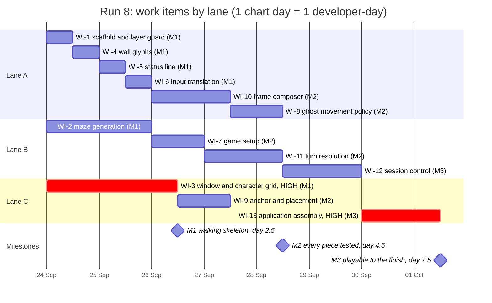
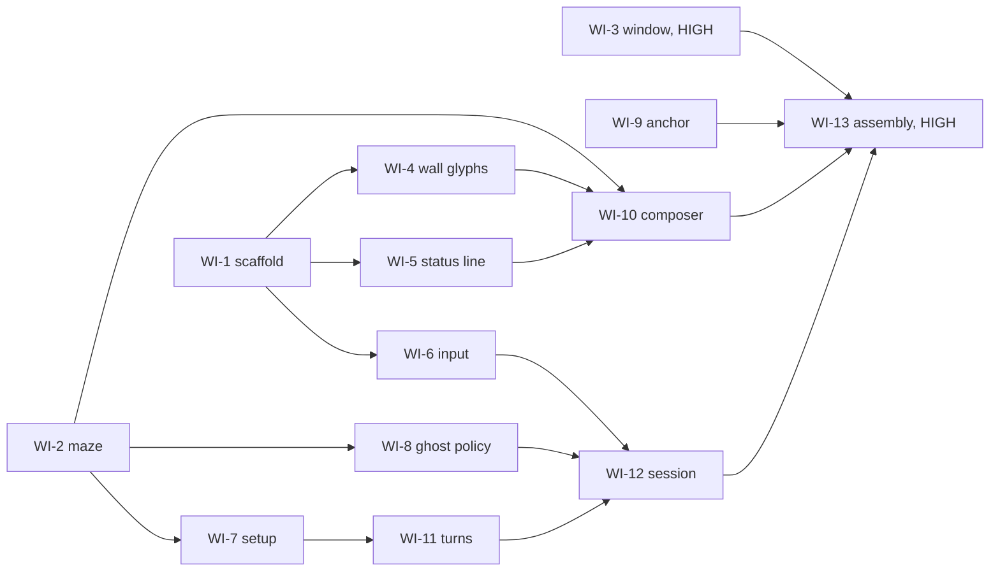

# Terminal Game — Implementation Plan (run 8)

**From:** the technical lead
**Inputs:** `docs/FUNCTIONAL_REQUIREMENTS.md` (49 codes), `docs/ARCHITECTURE.md`
**Landed as:** `AMEND-0`. Every later change to this document is an `AMEND-<n>` pull request of its own.

> **This project runs with real pull requests** against `replicant1/NewTerminalGame` on GitHub.
> It is **not** local mode. What follows from that:
>
> - Each developer pushes its own work-item branch, opens a **draft** pull request at its first commit, marks it ready when its suite is green, answers Copilot, and asks the verifier for a round (`developer.md`, "Working with real pull requests").
> - **The developer merges its own pull request** with `gh pr merge`, once the gate in `developer.md` holds: suite green, Copilot answered, and an `APPROVED` review from the verifier's login **at the head being merged**. The verifier's login is `newterminalgame-code-reviewer[bot]` (the conductor recorded it at 02:04:55Z on 2026-09-23).
> - **A HIGH pull request, or one with a claim marked needs eyes, is merged by the user and nobody else.** In this plan that is WI-3 and WI-13.
> - The technical lead merges nothing. Nobody checks out `main`.

---

## 1. Ground rules

### 1.1 Architecture adopted

**Candidate 2, "Single-process windowed character grid"**, from `docs/ARCHITECTURE.md` §3. It is the architect's second choice. The user chose it, as in runs 6 and 7, and this plan adopts it without re-deliberating.

In one paragraph: one process creates and owns its own native window through the Tk toolkit, sets its title, size and position itself, paints a 40 × 30 grid of characters onto a drawing surface in a fixed-width typeface on black, and closes its own window when the session ends. The toolkit owns the event loop and calls the program back once per key press and once per expiry of a repeating timer at the ghost's cadence. Below that, the Application layer (session control, turn resolution) and the Domain layer (maze, dots, player, ghost, score, game state) are pure and are tested with no window, no clock and no randomness they were not handed.

Consequences the architecture itself records and this plan carries into claims:

- WIN-3 is exact in this candidate: the program sets the title (WI-3).
- The window is 40 × 30 **by calculation from font metrics**, so a font substitution must not break it (WI-3/C4).
- **SCRN-2 is a rule, not a fact of the medium** (architecture caution C5). The rule is: *the game draws characters and a black background, and nothing else — no images, no shapes standing in for glyphs.* WI-3/C8 makes it a claim that is re-checked.
- Anything that opens a window must reap it on the failure path as well (caution C7). `developer.md`, "If your work opens windows on the user's screen", applies to every desktop test and harness.

### 1.2 Runtime, and the commands everybody runs

| | |
|---|---|
| Language | Python |
| Interpreter | **CPython 3.14**, `/opt/homebrew/bin/python3.14`, with **Tk 9.0** |
| Environment | a project virtual environment at `.venv/` (git-ignored), built from `requirements.txt` |
| Build the environment | `/opt/homebrew/bin/python3.14 -m venv .venv && .venv/bin/python -m pip install -r requirements.txt` |
| **Default suite** | `.venv/bin/python -m pytest -q` (from the repository root) |
| **Desktop tests** | `.venv/bin/python -m pytest -q -m desktop` (opens real windows; opt-in only) |
| Platform | macOS only. Nothing asks for portability. |
| Third-party packages | pytest. Anything further is added to `requirements.txt` in the pull request that needs it and is justified by a claim. |

Why 3.14 and not `/usr/bin/python3`: the conductor measured, at 02:04Z on 2026-09-23, that `/usr/bin/python3` is 3.9.6 with Tk 8.5, and that the Homebrew 3.14.7 now has `_tkinter`. I re-measured at 02:06Z: Homebrew's reports Tk 9.0; the system one reports Tk 8.5, which is Apple's deprecated build. Painting into the window is the riskiest thing candidate 2 does, so it gets the maintained toolkit. A fresh 3.14 venv installed pytest 9.1.1 and ran the existing suite at 36 passed, 1 skipped (my measurement, 02:06Z). **These are snapshots.** Homebrew's Python lacked `_tkinter` as recently as 17 September. So the property is made a claim (WI-1/C2), not left as this sentence.

**For the verifier:** `verifier.md` builds its environment with `/usr/bin/python3 -m venv .venv`. On this project use the command in the table above instead. The conductor relays this (see §1.10, X1). Until WI-1 lands there is no `requirements.txt`: install `pytest` directly.

### 1.3 Team, lanes and responsibilities

**Three developers**, lanes **A**, **B** and **C**. That number was given to me by the conductor, relayed from the user, and every total and boundary below rests on it.

| Lane | Responsibility it owns across the run |
|---|---|
| **A** | repository scaffolding and the layer guard; the pure presentation leaves (wall glyphs, status line, input translation); the frame composer; the ghost's movement policy |
| **B** | the domain and application core: maze generation, game setup, turn resolution, session control |
| **C** | everything that touches the operating system: the window and character grid, the anchor and placement, and the final assembly of the application |

Files, module names, packages, class and function names, internal interfaces and where the tests live are **the developers' to decide**, between themselves. Where two items meet (the composer reading game state; the session receiving translated keys; the assembly wiring all of it), the two developers agree the interface directly, on the pull request or through each other's briefs and logs. The plan does not name files.

### 1.4 The layer rule

The tree has four layers. Each may import from the layers **below** it, and never from one above:

1. **Shell**: the window, the toolkit's event loop, the tick timer, key capture, the character grid surface, the anchor query. **The only layer that may import `tkinter` or any operating-system or windowing API.**
2. **Presentation**: frame composition, wall glyphs, the status line, input translation. Pure: it turns state into characters and colours, and key names into intents. No toolkit.
3. **Application**: the session controller and the turn resolver. No toolkit, **no clock**, no presentation imports. Ticks and intents arrive as calls; it reads no time.
4. **Domain**: maze and maze generation, dots, player, ghost and its policy, score, game state. Standard library only, no clock, no toolkit, and **no randomness it was not handed**: a random source is passed in.

The architecture's candidate-2 diagram draws the Session Controller calling the Frame Composer. That breaks the rule it states (§1.10, X2). Here, the shell asks the session for its state after each event, hands that state to the composer, and paints the result. The application never calls upward.

This is a constraint, not a description of the tree. **WI-1 turns it into a test** (WI-1/C3, C4), and how the tree declares which module is in which layer is WI-1's developer's decision, recorded in the README.

### 1.5 Where documents go

Exactly the five shapes in `developer.md`, "Where documents go": `docs/prs/PR-<ITEM>-<slug>.md`, `docs/completions/COMPLETION-<MILESTONE>-DEV-<X>.md` (milestones are M1, M2, M3 below), `docs/progress/<branch-name>.md`, `docs/findings/<ITEM>-<slug>.md`, `evidence/<ITEM>/`. Nothing else.

### 1.6 Testing and evidence

- **Every work item is covered by tests**, and its claims (§4) are what its tests and evidence must establish. Claims are proved by the evidence pack in `developer.md`; tier by tier, §1.9 says what is owed.
- **Assert consequences, not calls.** What a function returned, what the state became, what the person would see.
- **Do not try to prove a test can fail.** No mutation of working code, by any name. A **control on the base commit** (MEDIUM and HIGH) runs your evidence against the code as it stood before your change, edits nothing, and is not the prohibited practice.
- **The default suite never opens a window.** Anything that does is a desktop test, marked so and run only by the desktop command (§1.2). WI-1/C5, C6 make that a guard.
- **Pure logic is tested pure.** Maze, setup, ghost, turn and session logic are driven with seeded random sources and injected ticks.
- **Many seeds, not one**, wherever a claim is about generated mazes (architecture caution C4).
- **One requirement is fragile in the way an ordinary test may not catch**: END-3 depends on the order of two steps in turn resolution (architecture caution C6). WI-11/C9 tests the consequence. If the user wants more than that, it is theirs to ask for.
- **Window hygiene** for every desktop test and harness: capture your own window, reap it on success and failure, never touch a window you did not open (`developer.md`).

### 1.7 Effort and verification budget

Effort is in **developer-days** (one developer, one working day). Every figure **includes** writing the evidence pack and **two verifier rounds**; a third round is ordinary and is absorbed by the slack in lanes A and C. The **user's wait on a HIGH or needs-eyes pull request is not in any figure**, because it is not mine to predict.

**Where the user's wait sits on the critical path:** WI-13 is the last item and is HIGH, so the run cannot finish before the user merges it. That is unavoidable: a finished application is a window on the user's desktop. WI-3 is HIGH too, but nothing needs it merged until WI-13 starts (day 6.0), which leaves 3.5 days for the user to reach it. Nothing else waits on a human.

### 1.8 Open questions for the user, and how this plan proceeds

| # | Question | How the plan proceeds (`ASSUME`) | What changes if the answer differs |
|---|---|---|---|
| Q1 | Does the titlebar of the running window read exactly "Terminal Game"? (architecture §8.1) | Candidate 2 sets it directly. Machine read-back is WI-3/C6; the user glances at the titlebar under **WI-3/C16 (needs eyes)**. | WI-3 only |
| Q2 | WIN-5 against END-5 and END-6: close the moment the outcome is decided, or on `q` after the final picture? (architecture §8.2, A3) | **A3, as in run 7**: outcome decided → final picture stays → player presses `q` → the window closes itself and the process exits, with nothing for the player to close. | WI-12/C4–C6, WI-13/C5–C7 |
| Q3 | Is the font size comfortable? (architecture §8.3, A4) A terminal profile no longer arises: this candidate owns its window. | WI-3's developer picks a fixed size; the user judges it under **WI-3/C15 (needs eyes)**. | one constant in WI-3 |
| Q4 | The specimen's status line starts with one blank (` score 0    arrows, q quits`). Intended, and for the CAUGHT and CLEARED forms too? | The specimen is normative (architecture A6): one leading blank on all three forms. | WI-5/C1–C3 |
| Q5 | END-3: when the last dot is on the ghost's square, is that dot eaten before the loss? | "Meeting the ghost is decided first": the move ends at the collision, the dot is **not** eaten, and the final score excludes it. | WI-11/C9 |
| Q6 | START-1 and START-2: distance in grid squares, or on screen, where a square is two columns wide? | Straight-line distance in **grid squares**. The specimen does not settle it either way (§1.10, X5). | WI-7/C1, C2 |
| Q7 | WIN-4: the window last looked at in any application, or the terminal's own front window? (architecture A2) | The window frontmost at start-up in any application, found **without any permission prompt**. Started from Terminal, that is the Terminal window. | WI-9, WI-13/C8, C13 |

### 1.9 Risk floors and what each tier costs

Every work item carries a **risk floor**: HIGH, MEDIUM or LOW. It answers one question: *how much harm would follow if bad code in this work item reached production?* It does not measure difficulty or diff size. **Where a work item names no floor, it is MEDIUM.**

- **HIGH**: a defect would corrupt data, compromise security, break the application for every user, or drive the user's machine into a state they must recover from by hand. On this project that includes anything that opens, sizes or closes windows on the user's real desktop.
- **MEDIUM**: a defect would break a feature, or would be expensive to unpick once other work is built on top of it.
- **LOW**: a defect is visible, local and cheap to fix: documentation, a spike whose output is a finding, an isolated leaf.

| | LOW | MEDIUM | HIGH |
|---|---|---|---|
| Claims (the lead's) | yes | yes | yes |
| Evidence the developer owes | executable | + controls on the base commit | + walk-through + observation |
| Verifier re-runs evidence and suite at the head | yes | yes | yes |
| Verifier maps every hunk to a claim | — | yes | yes |
| Verifier probes an edge case nobody claimed | — | — | yes |
| **The user** | only for a needs-eyes claim | only for a needs-eyes claim | always: reads the brief, runs the needs-eyes scripts, and merges it |

It is a floor, not a fixed value. The developer may raise it, and so may the verifier. Neither may lower it.

**How many items bring the user in:** two of thirteen, WI-3 and WI-13, both HIGH because they open windows on the real desktop. All five needs-eyes claims sit on those two items, so they add no visit of their own. That is under one in four.

**Needs-eyes scripts** follow the shape in `developer.md`: the exact command from the repository root at the head sha, what the person will see, and for each check **what failure looks like**, in two minutes at most. (`developer.md` points to a WI-17 example in `docs/findings/`. That file is not in this tree, see §1.10 X4. The shape described here is enough.)

### 1.10 Contradictions found while planning

| # | What is wrong | Evidence | How this plan handles it |
|---|---|---|---|
| X1 | `verifier.md` builds the environment with `/usr/bin/python3`, which is 3.9.6 with Tk 8.5. | Conductor's measurement, 02:04:36Z; mine, 02:06Z. | The plan pins 3.14 (§1.2). The conductor should tell each verifier to build with §1.2's command. WI-1/C2 makes a wrong interpreter fail loudly. |
| X2 | Candidate 2's structure diagram draws Session Controller → Frame Composer and → Status Line Renderer, against its own rule Presentation → Application → Domain. | `docs/ARCHITECTURE.md` §3, edges `D1 --> C6`, `D1 --> C8`. | §1.4: the shell composes and paints; the application never calls upward. |
| X3 | `docs/ARCHITECTURE.md` §5, "Reversed during implementation", describes `terminal_game/shell/grid_surface.py` and three tests pinning a cell-diffing repaint. | `git ls-files` at `099b803` has no such file: it is run 7's code. | It binds nothing here. Repainting only changed cells is allowed, not required. If a developer does it, the stale-cache hazards that paragraph names are theirs to cover with an `A` claim. |
| X4 | `developer.md` and `verifier.md` cite `docs/findings/WI-17-human-verification.md`, `AMEND-2-*` and `AMEND-6-*`. | `git ls-files` at `099b803`: no `docs/findings/` directory. | §1.9 gives the needs-eyes shape. The measured Copilot behaviour is restated in `developer.md` itself. |
| X5 | The specimen picture draws the player at grid square (column 10, row 13), counting from 0. That is not the corridor square nearest the centre (START-1). The centre square (9, 14) is wall, and (9, 13) and (9, 15) are corridor at distance 1.0, against 1.41 for (10, 13). With a score of 0 and only the player's and ghost's squares dotless, the picture otherwise reads as a starting position. The ghost at (1, 27) *is* the square furthest from (10, 13). | My scripted reading of the specimen, 2026-09-23 at about 02:15Z. The same script found the WI-4/C1 glyph table reproduces every wall and joining cell in the specimen with 0 mismatches, 264 corridor squares, no dead ends and no 2 × 2 corridor block. | **The requirement text governs where things start** (WI-7). The specimen governs only how things are drawn (architecture A6): WI-4/C4 and WI-10/C1 reproduce it from the positions it shows. |

---

## 2. Iterations

Three iterations, each ending at a milestone. **Days are counted from the moment the first three items are dispatched (day 0).** An iteration ends when its last item lands. Lanes run continuously, so an item of the next iteration may start in a free lane before the previous milestone. The chart in §3 shows exactly where.

| Code | Theme | Work items (lane) | Effort, developer-days | Ends (day) | What is proved at the milestone |
|---|---|---|---|---|---|
| **M1** | **Walking skeleton: a window that paints, a maze that holds** | WI-1 (A), WI-2 (B), WI-3 (C), WI-4 (A), WI-5 (A), WI-6 (A) | 0.5 + 2.0 + 2.5 + 0.5 + 0.5 + 0.5 = **6.5** | **2.5** | The medium works end to end: a real window of exactly 40 × 30 cells, titled, black, paints the specimen picture in colour, takes keys, ticks at about 7/s and closes itself with nothing left behind (WI-3). The riskiest algorithm, the maze, holds its three invariants over a thousand seeds (WI-2). The layer rule is a test (WI-1). |
| **M2** | **Every piece of the game, tested pure** | WI-7 (B), WI-8 (A), WI-9 (C), WI-10 (A), WI-11 (B) | 1.0 + 1.0 + 1.0 + 1.5 + 1.5 = **6.0** | **4.5** | Start positions, the ghost's policy, placement beside the anchor, the whole composed frame (the specimen reproduced character for character) and every scoring and ending rule, each proved without a window. |
| **M3** | **A game you can play to the finish** | WI-12 (B), WI-13 (C) | 1.5 + 1.5 = **3.0** | **7.5** | The session state machine, then the application assembled: a real game from launch to `q`, a win and a loss played in the real window, observed and merged by the user. |
| | | **13 items** | **15.5** | | |

The critical path is WI-2 → WI-7 → WI-11 → WI-12 → WI-13: 2.0 + 1.0 + 1.5 + 1.5 + 1.5 = **7.5 days**, all but the last in lane B. Lane A carries 4.5 days, lane B 6.0, lane C 5.0. The idle time in A and C absorbs third verifier rounds. The user's wait at WI-13 comes on top of day 7.5 (§1.7).

---

## 3. Schedule

**The chart is grouped by developer lane, not by iteration.** Each bar is labelled with its work item and its iteration code, and each iteration's end is a milestone marker (M1, M2, M3) at the day in the table above. Calendar dates are nominal: **one chart day is one developer-day of effort** (a 12-hour bar is half a day), counted from day 0 on 24 Sep 2026. Weekends and the user's waits are not modelled. Bars sequence work within a lane; the dependencies are listed in §4 and §5.

How the chart reconciles with §2:

- **M1** bars: WI-1 12h + WI-4 12h + WI-5 12h + WI-6 12h + WI-2 48h + WI-3 60h = 156h = **6.5 days**. The last to end is WI-3, at day 2.5 (26 Sep 12:00), which is where M1 stands.
- **M2** bars: WI-7 24h + WI-8 24h + WI-9 24h + WI-10 36h + WI-11 36h = 144h = **6.0 days**. WI-7 and WI-10 start at day 2.0, before M1, in lanes that are already free. The last to end are WI-8 and WI-11, at day 4.5 (28 Sep 12:00), where M2 stands.
- **M3** bars: WI-12 36h + WI-13 36h = 72h = **3.0 days**. WI-13 starts at day 6.0 (30 Sep 00:00), when WI-12 lands, and ends at day 7.5 (1 Oct 12:00), where M3 stands.
- The two HIGH items, WI-3 and WI-13, are drawn as critical (highlighted), because each waits for the user to merge it.
- The axis shows nominal calendar dates: day 0 is 24 Sep, so day 2.5 is 26 Sep at noon, day 4.5 is 28 Sep at noon and day 7.5 is 1 Oct at noon. The milestone labels give the plan day.

---

## 4. Work items and their claims

Each item gives its lane, effort, risk floor, dependencies (items that must have **merged** before it starts), the requirements it realises, the outcome it must deliver, and its **claims**. The claims were written by the technical lead before any code existed. A developer copies them into the brief **word for word**, may add `A` claims, and may never remove, reword, weaken or re-mark one. If a claim looks wrong, record `CONTRADICT`, say so in the brief, prove the rest, and the verifier posts `BLOCKED` for a ruling.

Colour words in claims refer to six colour roles: **wall blue, dot dim gold, player bright yellow, ghost pink, status cyan, background black**. The exact colour values are the developers' to choose. "Grid square" means one of the maze's 19 × 29 squares. "Cell" means one of the window's 40 × 30 character positions.

---

### WI-1: Project scaffold and the layer guard

**Lane A · 0.5 days · Risk MEDIUM** (a wrong guard is expensive to unpick once everything is built on it) · **Depends on:** nothing · **Iteration M1**
**Realises:** no requirement code directly; the non-functional rules of §1.2, §1.4 and §1.6.

**Outcome.** A fresh clone can be set up and tested with the §1.2 commands. `requirements.txt`, the test configuration and a README section on setting up and running exist. The layer rule of §1.4 and the "default suite opens no window" rule of §1.6 are tests, not sentences. WI-1 owns these repository-wide files. WI-2 and WI-3 do not create them. If they need a change, they ask lane A.

- **WI-1/C1** Following the README's setup steps in a fresh clone, with the pinned interpreter, gives an environment in which the default suite command runs and reports the existing infrastructure tests passing.
- **WI-1/C2** Run under any interpreter other than the pinned one, or under one without a working Tk 9, the suite says so plainly, naming the interpreter and Tk it found and the ones it wants, instead of passing or failing for some unrelated reason.
- **WI-1/C3** The layer check reports every import that breaks the layer rule of §1.4: given a sample tree containing such an import, it names the importing module and what it imported; on the real tree it reports none.
- **WI-1/C4** The layer check cannot pass vacuously: it reports how many modules it examined in each layer, and fails when it examines no module in a layer the tree declares.
- **WI-1/C5** A test marked as a desktop test is not run by the default suite command and is run by the desktop command.
- **WI-1/C6** A test that would create a toolkit window without the desktop mark fails, naming the test, instead of opening a window.

### WI-2: Maze generation

**Lane B · 2.0 days · Risk MEDIUM** · **Depends on:** nothing (merge `main` once WI-1 lands, before requesting verification) · **Iteration M1**
**Realises:** MAZE-1 (the grid), MAZE-2, MAZE-3, MAZE-4, MAZE-5, MAZE-6.

**Outcome.** A pure domain generator that, handed a random source, returns a 19 × 29 maze satisfying every structural requirement, and a maze value the rest of the game can ask questions of (is this square a wall, which neighbours are corridor). Architecture caution C4 applies: carve, repair dead ends, check connectivity, and prove all of it over many seeds.

- **WI-2/C1** Every generated maze is 19 grid squares across and 29 deep, and every square is either wall or corridor.
- **WI-2/C2** Over at least 1,000 mazes from distinct seeds, every square of the outer ring is wall, so nothing can leave the maze and there are no tunnels through the sides.
- **WI-2/C3** Over the same mazes, every corridor square has at least two corridor neighbours among north, south, east and west: there are no dead ends.
- **WI-2/C4** Over the same mazes, every corridor square can be reached from every other corridor square by steps north, south, east and west.
- **WI-2/C5** Over the same mazes, corridors are one square wide: no 2 × 2 block of squares is all corridor.
- **WI-2/C6** The same seed always gives the same maze, and 1,000 distinct seeds give 1,000 distinct mazes.
- **WI-2/C7** Generation always finishes: over the same 1,000 seeds, no maze takes longer than one second to generate.

### WI-3: Window and character grid

**Lane C · 2.5 days · Risk HIGH** (opens, sizes and closes windows on the user's real desktop) · **Depends on:** nothing (merge `main` once WI-1 lands, before requesting verification) · **Iteration M1**
**Realises:** WIN-1, WIN-2, WIN-3, WIN-5 (the mechanism), SCRN-2, SCRN-7, CTRL-5 (no echo), GHOST-1 (the timer).
**Human gate:** HIGH, and needs eyes on C15 and C16. **The user merges it.**

**Outcome.** The shell of candidate 2: a program that opens one window of its own, exactly 40 × 30 cells of a fixed-width typeface on black, titled "Terminal Game", able to paint any character in any of the six colour roles into any cell, deliver named key presses and a steady tick, and close itself cleanly. It is proved end to end with a harness in `evidence/WI-3/` that paints the specimen picture from `docs/FUNCTIONAL_REQUIREMENTS.md` §3 as a test card and moves a marker on arrow keys and on ticks. The harness is evidence, not production code. Placing the window beside the anchor is WI-9 and WI-13, not this item.

- **WI-3/C1** Started from a terminal, the program opens exactly one new window of its own, and writes nothing to the terminal it was started from during a normal session.
- **WI-3/C2** The window's drawing area is exactly 40 cells wide and 30 cells deep for the fixed-width typeface in use, with no extra margin, measured in the real window.
- **WI-3/C3** The person cannot resize the window: after an attempt to resize it, the drawing area is still exactly 40 × 30 cells.
- **WI-3/C4** If the preferred typeface is not available, the window uses another fixed-width typeface and still measures exactly 40 × 30 of that typeface's cells.
- **WI-3/C5** The whole drawing area is black wherever nothing is painted, including the two right-hand columns.
- **WI-3/C6** The window's title, as the toolkit reports it, is exactly `Terminal Game`.
- **WI-3/C7** Every character the game can draw (U+0020–U+007E, the space and printable ASCII; U+2500–U+259F, the box-drawing, block and shade characters; `■` U+25A0 and `▪` U+25AA) can be painted in any of the 1,200 cells in any of the six colour roles. A screenshot of the real window shows each painted character inside its own cell in its role's colour, and a painted space leaves its cell showing only the background. Double-width characters, such as CJK, are outside the game's alphabet and are not claimed.
- **WI-3/C8** Only characters are drawn: everything on the drawing surface is text or the black background, never an image or a shape standing in for a glyph.
- **WI-3/C9** Replacing one frame with another never shows a picture that is neither: over 5 seconds of repeated repaints, every screenshot matches, cell for cell, one of the frames that was asked for, and no text cursor or caret is visible in any of them.
- **WI-3/C10** Keys pressed in the window reach the program as named keys (the four arrows, `q`, `Q`, and any other key as itself), and nothing typed ever appears in the window.
- **WI-3/C11** A repeating tick is delivered between 6.5 and 7.5 times a second, measured over 5 seconds with no key pressed, and again over 5 seconds while keys are pressed as fast as a script can send them.
- **WI-3/C12** When the program ends the session, its window closes by itself and the process exits with status 0 within one second, leaving no window and no process behind.
- **WI-3/C13** Closing the window with its title-bar close button, or quitting from the application menu, ends the process in the same way, leaving no window, no process and no dialog.
- **WI-3/C14** If a key or tick handler raises an error, the window still closes and the process exits with a non-zero status and prints the error, instead of leaving a frozen window.
- **WI-3/C15** At the chosen type size, a person at a normal seat can read the characters comfortably and can tell the double-line, block and dot characters apart. — **needs eyes**
- **WI-3/C16** The window's title bar shows exactly "Terminal Game" and nothing else. — **needs eyes**
- **WI-3/C17** The default suite command opens no window, while the desktop command runs this item's window tests.

### WI-4: Wall glyphs

**Lane A · 0.5 days · Risk LOW** (an isolated pure leaf; a defect is visible and local) · **Depends on:** WI-1 · **Iteration M1**
**Realises:** SCRN-3.

**Outcome.** A pure function from a wall square's four neighbours to its character, plus the character for the column joining two horizontally adjacent squares (each grid square is drawn two cells wide, architecture A6).

- **WI-4/C1** A wall square gets its character from which of its north, south, east and west neighbours are wall, for all 16 combinations: none `■`; east and/or west only `═`; north and/or south only `║`; south+east `╔`; south+west `╗`; north+east `╚`; north+west `╝`; north+south+east `╠`; north+south+west `╣`; east+west+south `╦`; east+west+north `╩`; all four `╬`.
- **WI-4/C2** The cell between two horizontally adjacent grid squares shows `═` when both squares are wall, and is blank otherwise.
- **WI-4/C3** A square beyond the edge of the grid counts as not wall, so the four corners of the outer wall come out `╔`, `╗`, `╚` and `╝`.
- **WI-4/C4** Applied to the maze in the specimen picture (`docs/FUNCTIONAL_REQUIREMENTS.md` §3), every wall square and every joining cell comes out exactly as the specimen shows it.

### WI-5: Status line

**Lane A · 0.5 days · Risk LOW** · **Depends on:** WI-1 · **Iteration M1**
**Realises:** STAT-1, STAT-2, STAT-3, SCRN-6, SCORE-5 (display).

**Outcome.** A pure function from the score and the outcome (none, lost, won) to the 40 characters of the bottom row, all in the status colour. The text follows the specimen and STAT-2/STAT-3 exactly, with one leading blank (§1.8, Q4).

- **WI-5/C1** During play with a score of 0 the row reads exactly ` score 0    arrows, q quits`, followed by blanks to 40 cells.
- **WI-5/C2** On a loss with a score of 37 the row reads exactly ` CAUGHT  score 37   q quits`, and on a win with a score of 274 exactly ` CLEARED  score 274  q quits`, each followed by blanks to 40 cells.
- **WI-5/C3** For every score from 0 to 459 in each of the three states, the row is exactly 40 cells, shows the score in decimal, and the text after the score starts in the same cell as it does in the C1 and C2 examples for that state.
- **WI-5/C4** The row contains the state word (on an ending), the score and the key hints, and no other text.
- **WI-5/C5** Every cell of the row is in the status colour.

### WI-6: Input translation

**Lane A · 0.5 days · Risk LOW** · **Depends on:** WI-1 · **Iteration M1**
**Realises:** CTRL-1 (which key means which direction), CTRL-4 (which keys mean quit), CTRL-5.

**Outcome.** A pure mapping from the shell's key names to the game's intents: move up, down, left or right, quit, or nothing.

- **WI-6/C1** The up, down, left and right arrow keys translate to moves up, down, left and right respectively.
- **WI-6/C2** `q` and `Q` both translate to quit, including `Q` typed with Caps Lock on.
- **WI-6/C3** Every other key, including letters, digits, space, Return, Escape, Tab, Backspace, function keys and a modifier pressed alone, translates to nothing.

### WI-7: Game setup

**Lane B · 1.0 day · Risk MEDIUM** · **Depends on:** WI-2 · **Iteration M2**
**Realises:** START-1, START-2, START-3, START-4, GAME-1.

**Outcome.** Given a maze, the starting game state: the player, the ghost, a dot on every corridor square but the player's, a score of zero and no outcome. Setup uses no randomness of its own.

- **WI-7/C1** The player starts on the corridor square nearest the centre square (column 9, row 14, counting from 0), by straight-line distance in grid squares. When several are equally near, the same maze always gives the same one.
- **WI-7/C2** The ghost starts on the corridor square furthest from the player's start by straight-line distance in grid squares, not by distance along the corridors. This is shown on a hand-built maze where the two measures pick different squares.
- **WI-7/C3** When the centre square is itself corridor, the player starts on it.
- **WI-7/C4** Every corridor square holds one dot except the player's start square, which holds none, and no wall square holds a dot.
- **WI-7/C5** The ghost's start square holds a dot.
- **WI-7/C6** The score starts at zero and no outcome is decided.
- **WI-7/C7** Over 1,000 generated mazes, the player and the ghost never start on the same square, and neither starts on a wall.

### WI-8: Ghost movement policy

**Lane A · 1.0 day · Risk MEDIUM** · **Depends on:** WI-2 · **Iteration M2**
**Realises:** GHOST-2, GHOST-3, GHOST-4, SCORE-4 (the ghost leaves dots alone).

**Outcome.** A pure policy: from the maze, the ghost's square, its heading and a random source handed to it (**and nothing about the player**), the ghost's next square.

- **WI-8/C1** While the square ahead in its current heading is corridor, the ghost's next square is that square, at junctions as well as along corridors.
- **WI-8/C2** When the square ahead is wall, the ghost moves to one of its other open neighbours, excluding the square it came from, chosen at random: over 10,000 trials at a square with two such exits, each is chosen at least 40% of the time.
- **WI-8/C3** The ghost turns back the way it came only when no other way is open, shown on a hand-built maze with a dead end.
- **WI-8/C4** The ghost's next square never depends on where the player is: for the same maze, ghost square, heading and random sequence, it is the same wherever the player stands.
- **WI-8/C5** The ghost only ever moves exactly one square north, south, east or west, and never onto a wall.
- **WI-8/C6** On its first move, having no heading yet, the ghost moves to one of its open neighbours.
- **WI-8/C7** A ghost move never changes the dots: every dot present before it is present after it, including the dot on the square the ghost moves onto.
- **WI-8/C8** Over 1,000 generated mazes and 1,000 moves in each, the ghost moves on every move and is never stuck.

### WI-9: Anchor and placement

**Lane C · 1.0 day · Risk MEDIUM** (it reads other windows and computes a position; it opens, sizes and closes nothing) · **Depends on:** nothing · **Iteration M2**
**Realises:** WIN-4.

**Outcome.** Two parts, the developer's to arrange: finding the anchor (the window that was frontmost at start-up, §1.8 Q7) through a platform query in the shell, and a pure placement policy that turns the anchor, the game window's size and the visible screen area into the game window's position. WI-13 applies the position. The query must not raise any permission or consent prompt, and must not activate, move or change any window.

- **WI-9/C1** The game window's top-left corner is placed a little below and to the right of the anchor's top-left corner: a fixed offset of between 20 and 60 points in each direction.
- **WI-9/C2** If that position would put any part of the game window off the visible screen, the window is moved just far enough to lie wholly on it.
- **WI-9/C3** If no anchor can be found (no window on screen, or the query fails), the window is placed wholly on the visible screen at a default position, and start-up carries on.
- **WI-9/C4** When the anchor is on a second display, the game window lands on that same display, wholly visible.
- **WI-9/C5** Finding the anchor finishes within 500 milliseconds, or gives up and falls back as in C3.
- **WI-9/C6** Run from a Terminal window on the real desktop, finding the anchor returns that Terminal window's position and size, matching what Terminal itself reports for its front window.

### WI-10: Frame composer

**Lane A · 1.5 days · Risk MEDIUM** · **Depends on:** WI-2, WI-4, WI-5 · **Iteration M2**
**Realises:** SCRN-1, SCRN-4, SCRN-5, MAZE-1 (the grid-to-cell mapping), END-4, SCORE-4 (drawing).

**Outcome.** A pure function from the game's state (maze, dots, player and ghost squares, score, outcome) to a 40 × 30 frame of characters and colour roles, which the shell paints. It reads state and changes none.

- **WI-10/C1** Given the specimen's maze, dots, player and ghost squares and a score of 0, the composed frame reproduces the specimen picture in `docs/FUNCTIONAL_REQUIREMENTS.md` §3 character for character, all 30 rows, each specimen row padded with blanks to 40 cells, ignoring the `← …` annotations.
- **WI-10/C2** The frame is 40 cells by 30 rows. Rows 0 to 28 hold the maze, and row 29 is exactly the status line WI-5 gives for the same score and outcome. Nothing from the maze is ever drawn on row 29.
- **WI-10/C3** Grid square *n* (counting from 0) is drawn in cell 2*n*, with its joining cell to the east in cell 2*n*+1, so the maze's characters occupy cells 0 to 36. Cell 37, the joining cell after the last square, has no square east of it, and it and cells 38 and 39 are blank on every maze row, as in the specimen, whose maze rows are 37 characters wide.
- **WI-10/C4** A corridor square holding a dot shows `▪` in the dot colour. A corridor square without one shows blank.
- **WI-10/C5** The player is drawn as `▐█▌` in the player colour and the ghost as `▗█▖` in the ghost colour, centred on their squares, so the two differ in colour and in outline.
- **WI-10/C6** When the player and the ghost stand on the same square, the ghost is drawn and the player cannot be seen.
- **WI-10/C7** While the ghost stands on a square with a dot, the dot is hidden. Once the ghost moves off, it is drawn again.
- **WI-10/C8** When the player and the ghost stand on horizontally adjacent squares, both centre blocks `█` are drawn, each in its own colour.
- **WI-10/C9** Every wall character is in the wall colour, every dot in the dot colour, the status row in the status colour, and every blank cell has the background colour.
- **WI-10/C10** Composing a frame changes nothing: composing twice from the same state gives identical frames, and the state is unchanged.

### WI-11: Turn resolution

**Lane B · 1.5 days · Risk MEDIUM** · **Depends on:** WI-7 · **Iteration M2**
**Realises:** CTRL-1 (the move), CTRL-2 (one square per move), CTRL-3, SCORE-1, SCORE-2, SCORE-3, SCORE-5, END-1, END-2, END-3, GAME-2.

**Outcome.** The rules in one place, in a fixed order (architecture F3, caution C6). A player move is: wall? then nothing; otherwise move, then collision, then eat, then win. A ghost step is: move, then collision.

- **WI-11/C1** A move towards a corridor square moves the player exactly one square in that direction.
- **WI-11/C2** A move towards a wall changes nothing at all: the player's square, the dots, the score and the outcome are identical afterwards.
- **WI-11/C3** Moving onto a square that holds a dot removes that dot for the rest of the game and adds exactly one to the score.
- **WI-11/C4** Moving onto a square whose dot has already been eaten, including the start square, adds nothing to the score.
- **WI-11/C5** Over 1,000 games of random moves and ghost steps, the score never goes down.
- **WI-11/C6** The player walking onto the ghost's square loses the game.
- **WI-11/C7** The ghost stepping onto the player's square loses the game.
- **WI-11/C8** Eating the last dot wins the game.
- **WI-11/C9** Walking onto the ghost's square when it holds the last dot loses the game, not wins it. That dot is not eaten, and the score stays what it was before the move.
- **WI-11/C10** From adjacent squares, the player and the ghost can never pass through each other: a player move towards the ghost, or a ghost step towards the player, loses the game on that step.
- **WI-11/C11** Over 1,000 games of 1,000 random moves each, the player never stands on a wall and never leaves the maze.

### WI-12: Session control

**Lane B · 1.5 days · Risk MEDIUM** · **Depends on:** WI-6, WI-8, WI-11 · **Iteration M3**
**Realises:** START-5, GHOST-1 (one step per tick), CTRL-2, CTRL-4, END-5, END-6, GAME-3.

**Outcome.** The session's state machine (Playing, Decided, Ended) and its routing: intents from WI-6 and ticks from the shell go in, the turn resolver and the ghost policy are applied, and the current state comes out for the shell to compose and paint. No clock, no toolkit, no presentation imports (§1.4).

- **WI-12/C1** A new session is already playing: the first tick moves the ghost, with no key pressed.
- **WI-12/C2** While playing, each tick moves the ghost exactly one square, and key presses between ticks neither add ghost moves nor remove them.
- **WI-12/C3** Each arrow key press moves the player at most one square, and with no key presses the player never moves, however many ticks pass.
- **WI-12/C4** Once the game is won or lost, ticks no longer move the ghost, arrow keys no longer move the player, and the state the shell would paint no longer changes.
- **WI-12/C5** `q` or `Q` ends the session at once, both while playing and after the game is decided.
- **WI-12/C6** After the game is decided, quit is the only input that has any effect.
- **WI-12/C7** An arrow key that arrives immediately after the tick in which the ghost catches the player does not move the player.
- **WI-12/C8** Nothing leads back from an ending: no sequence of inputs starts a new game, restores the player or resumes play.
- **WI-12/C9** Given the same maze, the same random source and the same sequence of ticks and keys, two sessions end in identical states.
- **WI-12/C10** A tick or a key that arrives after the session has ended is ignored without error.

### WI-13: Application assembly

**Lane C · 1.5 days · Risk HIGH** (the whole game on the user's real desktop) · **Depends on:** WI-3, WI-9, WI-10, WI-12 · **Iteration M3**
**Realises:** everything end to end, and in particular WIN-4 (applied), WIN-5, MAZE-4 (a fresh maze each run), START-5 and GAME-1/GAME-2 as a person meets them.
**Human gate:** HIGH, and needs eyes on C11, C12 and C13. **The user merges it.**

**Outcome.** One command, written in the README, starts the game: the shell creates a fresh random source, generates the maze, sets up the game, places the window from WI-9, and runs the session, composing and painting after every event, until `q`. Scripted runs that play to a loss and to a win (with a test-only way to fix the maze's seed) provide the observations.

- **WI-13/C1** The README's one command, run from a Terminal window, opens the game window showing a fresh maze, the player, the ghost and ` score 0    arrows, q quits`, and the ghost is moving within half a second with no key pressed.
- **WI-13/C2** Two launches in a row show different mazes.
- **WI-13/C3** In the real window, with no key pressed, the ghost moves between 32 and 38 squares in 5 seconds.
- **WI-13/C4** In the real window, one arrow key press moves the player one square onto a dot, the dot disappears, and the status line's score goes up by one, shown by screenshots before and after.
- **WI-13/C5** Played to a loss in the real window, the final picture shows the ghost over the player and ` CAUGHT  score N   q quits` with the right N, and it stays unchanged for at least 3 seconds while ticks pass and arrow keys are pressed.
- **WI-13/C6** Played to a win in the real window, the final picture shows ` CLEARED  score N  q quits` with N equal to the number of dots the maze started with, and it stays unchanged until `q`.
- **WI-13/C7** Pressing `q` or `Q`, during play and after an ending, closes the window and ends the process within one second, leaving no window, no process and no dialog.
- **WI-13/C8** The window opens a little below and to the right of the Terminal window it was started from, wholly on the visible screen, at the right place on a Retina display (not at half or double the intended position).
- **WI-13/C9** A screenshot of the real window shows walls in the wall colour, dots in the dot colour, the player in the player colour, the ghost in the ghost colour, the status line in the status colour and the background black, and the dots are dimmer than the player.
- **WI-13/C10** The default suite command opens no window, and the layer check (WI-1/C3, C4) passes on the finished tree with modules examined in every layer.
- **WI-13/C11** Seen in play, the walls join into corners, tees and crossings like the specimen picture, with no gaps or misaligned pieces between neighbouring characters, and a lone wall square shows as a single block. — **needs eyes**
- **WI-13/C12** Seen in play, the picture changes without flicker, the ghost moves at a steady pace, and no text cursor is visible. — **needs eyes**
- **WI-13/C13** Started from a Terminal window, the game window appears a little below and to the right of it, and no permission or consent dialog appears at any point. — **needs eyes**

**Claim totals:** WI-1 6, WI-2 7, WI-3 17, WI-4 4, WI-5 5, WI-6 3, WI-7 7, WI-8 8, WI-9 6, WI-10 10, WI-11 11, WI-12 10, WI-13 13 = **107 claims**, of which **5 are needs eyes** (WI-3/C15, C16; WI-13/C11, C12, C13).

---

## 5. Dependencies and dispatch

### 5.1 Dependency graph

An arrow means *must have merged before the next starts*.

WI-2 and WI-3 depend on WI-1 only softly: they may start at once, but must merge `main` once WI-1 has landed, before asking for verification, so the verifier can build the environment from `requirements.txt`.

### 5.2 Dispatch table

| When | Item | Lane | Area it owns (responsibility, not files) | Disjoint from what runs beside it because |
|---|---|---|---|---|
| **At once** | WI-1 | A | repository configuration: `requirements.txt`, test configuration, README setup section, the layer and no-window guards | touches no game code |
| **At once** | WI-2 | B | domain: the maze and its generator | pure domain; no configuration, no shell |
| **At once** | WI-3 | C | shell: window, drawing surface, keys, timer, close | shell only; its test card lives in `evidence/WI-3/` |
| after WI-1 | WI-4, then WI-5, then WI-6 | A | presentation leaves | each is a separate pure function with no shared state |
| after WI-2 | WI-7 | B | domain: game setup | domain, separate from lane A's presentation work |
| after WI-2, WI-4, WI-5 | WI-10 | A | presentation: frame composition | reads the maze and state; B owns them and agrees the shape with A |
| lane C free (≈ day 2.5) | WI-9 | C | shell: anchor query; placement policy | no dependency, and touches nothing the others touch |
| after WI-7 | WI-11 | B | application: turn resolution | — |
| after WI-2 (lane A free ≈ day 3.5) | WI-8 | A | domain: the ghost's policy | B and A agree where the ghost's state lives, since B's WI-11 moves the ghost using it |
| after WI-6, WI-8, WI-11 | WI-12 | B | application: session control | — |
| after WI-3 (merged by the user), WI-9, WI-10, WI-12 | WI-13 | C | shell: assembly and the start command | the last item; everything it wires has landed |

Where two items genuinely share an area, the owners agree the boundary themselves: A and B on the game state the composer reads (WI-10 and WI-7) and on the ghost's state (WI-8 and WI-11); B and C on how the shell drives the session (WI-12 and WI-13).

---

## 6. Traceability: all 49 requirements

| Code | Work items (claims) |
|---|---|
| GAME-1 | WI-7 (C4, C7), WI-13 (C1) |
| GAME-2 | WI-11 (C6–C9), WI-13 (C5, C6) |
| GAME-3 | WI-12 (C8) |
| WIN-1 | WI-3 (C1) |
| WIN-2 | WI-3 (C2–C5, C15) |
| WIN-3 | WI-3 (C6, C16) |
| WIN-4 | WI-9 (C1–C6), WI-13 (C8, C13) |
| WIN-5 | WI-3 (C12, C13), WI-13 (C7) |
| SCRN-1 | WI-10 (C2) |
| SCRN-2 | WI-3 (C8) |
| SCRN-3 | WI-4 (C1–C4), WI-13 (C11) |
| SCRN-4 | WI-10 (C4, C9), WI-13 (C9) |
| SCRN-5 | WI-10 (C5, C8), WI-13 (C9) |
| SCRN-6 | WI-5 (C5), WI-10 (C9) |
| SCRN-7 | WI-3 (C9), WI-13 (C12) |
| MAZE-1 | WI-2 (C1), WI-10 (C3) |
| MAZE-2 | WI-2 (C1, C5) |
| MAZE-3 | WI-2 (C2), WI-11 (C11) |
| MAZE-4 | WI-2 (C6), WI-13 (C2) |
| MAZE-5 | WI-2 (C3) |
| MAZE-6 | WI-2 (C4) |
| START-1 | WI-7 (C1, C3) |
| START-2 | WI-7 (C2) |
| START-3 | WI-7 (C4, C5) |
| START-4 | WI-7 (C6) |
| START-5 | WI-12 (C1), WI-13 (C1) |
| CTRL-1 | WI-6 (C1), WI-11 (C1), WI-13 (C4) |
| CTRL-2 | WI-11 (C1), WI-12 (C3) |
| CTRL-3 | WI-11 (C2) |
| CTRL-4 | WI-6 (C2), WI-12 (C5), WI-13 (C7) |
| CTRL-5 | WI-6 (C3), WI-3 (C10) |
| GHOST-1 | WI-3 (C11), WI-12 (C1, C2), WI-13 (C3) |
| GHOST-2 | WI-8 (C1) |
| GHOST-3 | WI-8 (C2, C3, C6) |
| GHOST-4 | WI-8 (C4) |
| SCORE-1 | WI-11 (C3), WI-13 (C4) |
| SCORE-2 | WI-11 (C3) |
| SCORE-3 | WI-11 (C4) |
| SCORE-4 | WI-7 (C5), WI-8 (C7), WI-10 (C7) |
| SCORE-5 | WI-11 (C5), WI-5 (C3) |
| END-1 | WI-11 (C6, C7, C10) |
| END-2 | WI-11 (C8), WI-13 (C6) |
| END-3 | WI-11 (C9) |
| END-4 | WI-10 (C6), WI-13 (C5) |
| END-5 | WI-12 (C4, C7), WI-13 (C5) |
| END-6 | WI-12 (C5, C6), WI-13 (C7) |
| STAT-1 | WI-5 (C4), WI-10 (C2) |
| STAT-2 | WI-5 (C1, C3) |
| STAT-3 | WI-5 (C2, C3) |

---

## 7. Risks

| Risk | Cost if it happens | What the plan does |
|---|---|---|
| The user's merge of WI-13 is the last step, and its timing is not predictable. | The run ends only when the user reaches it. | Nothing else waits on it. WI-3's user gate has 3.5 days of slack before WI-13 needs it (§1.7). |
| Homebrew's Python 3.14 loses `_tkinter` or changes Tk, as it did before 17 Sep. | Every desktop claim becomes unprovable. | WI-1/C2 makes the suite name the problem. The plan is amended if the pin has to move. |
| The verifier builds with `/usr/bin/python3` (X1). | Rounds fail for reasons unrelated to the work. | §1.2 names the command. The conductor relays it. WI-1/C2 makes it fail plainly. |
| The maze generator's three invariants fight (architecture C4). | WI-2 slips, and with it the critical path. | Two days are allotted, and C2–C7 test over 1,000 seeds. Lane A's slack absorbs a slip in WI-10 and WI-8, but not on the critical path. |
| Box-drawing characters do not join across cells in the chosen typeface. | WI-13/C11 fails at the user's look, late. | WI-3/C7 and C15 put the typeface in front of the user in M1, with the specimen as the test card. |
| Anchor coordinates and Tk coordinates disagree on a Retina display. | The window lands in the wrong place. | WI-9/C6 and WI-13/C8 check against the real desktop. |
| An anchor query raises a permission prompt. | A dialog on the user's desktop at every start. | Forbidden in WI-9's outcome. WI-13/C13 puts it in front of the user. |
