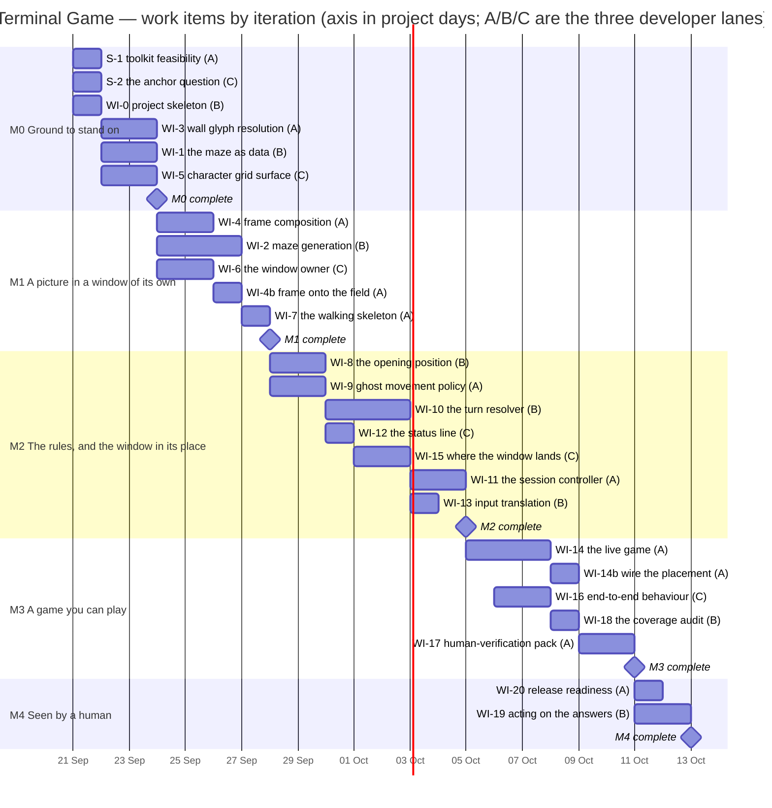
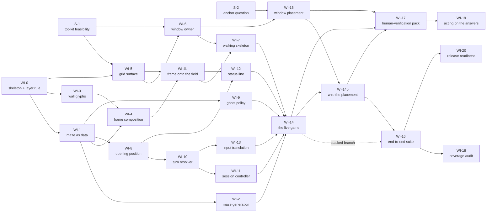

# Terminal Game — Implementation Plan

**For:** the three developers, and the conductor who dispatches them
**From:** the Technical Lead
**Inputs:** `docs/FUNCTIONAL_REQUIREMENTS.md` (49 requirement codes) and `docs/ARCHITECTURE.md`

### Amendments

Newest first. Re-read a section an amendment names before you work in it.

| # | What changed | Sections |
|---|---|---|
| **1** | **Calling into Objective-C, AppKit, Quartz or CoreGraphics through `ctypes` is prohibited outright**, after it put three crash dialogs on the user's screen; S-2 and WI-15 lose that route and **WIN-4's general case becomes a decision for the user**, with P2 promoted to how WIN-4 is actually built. **S-1 reported and it is good news: P8 and P4 retire by measurement** — Tk 8.5 is headless-testable, the font is fixed at Menlo 16 (cell 10 × 19, window 400 × 570) — and human item 5 closes. **A measured Tk defect gets an owner:** `root.update()` never returns on a mapped window, which lands on WI-5 and WI-6. **AppleScript's `position` is wrong by a display height on a secondary display**, so WI-15 must use `bounds`. **Five WI-0 deviations ruled on**, of which `unplaced-module` is upheld into the layer rule and the `needs_window` marker is adopted as the one mechanism. **Section 8 settles the log-tail problem** every developer meets at their first merge, and the case of an item that precedes the suite. **A trace gap closed: SCRN-3 splits into WI-3 (glyph) and WI-4 (colour)**, because the original row pointed the whole requirement at an item whose test clause asked only about glyphs, leaving the blue unowned; two specimen facts about wall glyphs go into WI-4's bar with it. Two new human items (now 8 and 9) and two new assumptions (P9, P10). | 1.3, 1.5, 1.6, 1.7, 2, 4, S-1, S-2, WI-3, WI-4, WI-5, WI-6, WI-7, WI-15, WI-17, 8, 9, 10 |
| **1i** | **The assembled game never placed its window, and the root cause is this plan's dependency graph.** WI-14's inputs never included WI-15, and **WI-15's only outgoing edge went to a verification item, which consumes nothing** — so nothing was ever told to call placement, and it shipped complete, tested and dead at the toolkit's default corner. **WI-14b** is added to wire it, with a bar saying so plainly. The generalisation is now a rule *and* a check I run on this document: **every item that produces a capability must have a non-verification consumer**. On its first run it found a second instance — **WI-9 had no outgoing edge at all** — so three edges are added to the graph. Also: the WIN-4 row reads **not met and not wired**, WI-16 must assert the assembled game *placed* its window (**no test can catch an absent call site by testing the things either side of it**), human item 4 gains the hidden cost of granting the permission, and section 7 gains lane B's test for whether a guard will rot. **Totals now 43 developer-days over 22 project days in 25 items.** | 3, 4, 5 (WI-14b, WI-16), 6.1, 6.2, 7, 9 |
| **1h** | **Rule, then affordance, then guard.** The one-source-of-truth rule has now been broken **twice in places nobody would classify as asking whether the game is over** — a `__repr__` and the status row — and **neither was caught by the suite**; both were found by somebody going to look after the first turned up, and the second would have put a stale outcome on the screen where the player reads it. Section 7 now says a rule of the form "everywhere must X" fails invisibly among the things nobody counts as candidates, so close it at three levels. **WI-18 gains a named sweep for reads of the stored outcome — and is told to leave a guard test rather than a finding if it can**, on the model of WI-0's layer test: a sweep runs once, a guard runs forever. Section 1.6 gains a seventh entry, distinct from the six about fixtures: **a double whose lifecycle does not match the real thing gives a false pass on the very behaviour it was built to check.** | 1.6, 5 (WI-18), 7 |
| **1g** | **Whoever built a thing does not write the script that judges it.** I was minded to move WI-17 to the lane that built the items it verifies; that lane argued **against its own interest** and produced a better third option — *"the checks I fail to think of are exactly the ones I failed to think of when writing the code"* — so **WI-17 stays where it is and the item owners supply its checklist**. That is now a rule about verification items generally. WI-17 also absorbs the **four-arrow key-delivery extension**, because converting a human check into an agent check is that item's whole purpose. **WI-20 gains the one run that includes the `needs_window` tests**, which nothing else executes — an affordance where an audit line would only have recorded the rot. WI-16 gains **END-4 on a state the system produced**, not only a hand-made one. WI-18 gains three precise audit entries: WIN-4 misleading rather than thin, GAME-1 named in no file, SCRN-3 evidenced at the font level and not the rendered one. | 5 (WI-16, WI-17, WI-18, WI-20) |
| **1f** | **WIN-4 is marked NOT MET in the trace table itself, and WI-18 is told not to tick it.** A developer reported its own green, fully-satisfied item as not honouring the requirement traced to it — and the defect was in **my table**, which had no way to say "traced, implemented, tested, and still not satisfied". Section 4 now says a row is a pointer and not a claim; WI-18's bar says **report what each test establishes, never that an item landed**, and treat any requirement resting on an unanswered human item as NOT MET regardless of the suite. **Human item 4 is recast as a choice between two closable endings** — grant the permission and WIN-4 is met by a small substitution, or decline and it is formally descoped — because asking a fifth time in the same shape would not help. Section 1.5 gains the **coordinate class**: right at the origin, wrong away from it, now twice from two unrelated systems. Section 1.6 gains **"a getter answering is not evidence a setter ran"**. | 1.5, 1.6, 4, 5 (WI-18), 9 |
| **1e** | **C-4 amended: I was wrong about the status line and lane C corrected me from the specification's own examples.** There *is* a column discipline — **the score is left-aligned in a field of 5**, which reproduces all three printed forms verbatim where widths 2, 3, 4, 6, 7 and 8 reproduce none; the column difference I read as inconsistency was only `CAUGHT` being a character shorter than `CLEARED`. Where the literals underdetermine the choice, **STAT-2 settles it**: the score is kept up to date all game, so a fixed separator would make `arrows, q quits` jump columns in front of the player. Section 7 gains **"close a generalisation with an affordance, not only a rule"**, from WI-12 answering a rule with a call that obeys it for you; section 1.6 gains **"pin both directions of a trap"**. Human item 6 is now cheap to flip. | 1.6, 3, 7, 9 |
| **1d** | **One source of truth means one, not one per component.** The game state carries a stored outcome *and* a derived function computes it, and on a hand-built board they can disagree — found by a failing test in WI-11. The rules are authoritative and the stamp is a cache, so **everything** that asks whether the game is over asks the same function: the session, the status line (**the STAT-3 trace row said "the outcome held on Game State" and was pointing at the stale cache**), the draw order, the tick. **WI-16's bar** gains the warning that a stamp a test sets itself will not be believed, and that its determinism rests on three things — candidate order, seed, **and the ghost's initial heading**. Section 1.6 gains END-5's test as a worked example of asserting the consequence rather than the refusal; section 8 gains "quote the deselections"; human item 8 is upgraded from hypothetical to live now that 235 Presentation tests construct a Tk root on every run. | 1.6, 4, 5 (WI-12, WI-16), 8, 9 |
| **1c** | **END-3 landed structural, so the section 1.6 fragility note is struck** — the win branch is unreachable while the player and ghost share a square, so there is no ordering left to get wrong, and the question stops costing the user anything. In its place, the plan now records **how to know a test has power without breaking code**: make the fixture prove it discriminates, add the control, make a sweep check itself, and guard the fixture against being flattened — four moves three items invented independently before anyone wrote them down. **Ruled:** eating the last dot on the ghost's square **does** score it, on END-3's own wording, so the final line reads `CAUGHT  score N` including it — player-visible, so it is human item 7 for the user to overturn. **WI-13 returns to lane B**, restoring the original assignment now that the WI-8/WI-10 pair it was moved aside for has landed; same dates, no redraw. | 1.6, 5 (WI-10, WI-13), 6.2, 9, 10 |
| **1b** | **END-3 becomes structural.** WI-10 derives the outcome as one total function of the state, testing caught before cleared, instead of setting it in two ordered steps — so there is no collision test left to migrate and caution C6's failure mode closes. The section 1.6 fragility note says it will be struck if that lands, but is not struck yet. WI-11's Decided state becomes load-bearing for END-3, and both bars say so. Also **C-6 added**: START-3 and SCORE-4 agree, sit four sections apart, and decide one line of code between them, where reading either alone gives the wrong answer. | 1.6, 3, 5 (WI-10, WI-11) |
| **1a** | **Two reassignments and one new landing, with the schedule redrawn twice to match.** **WI-8 moves to lane B and to M2**, because lane B owns WI-10 and one developer doing both removes a seam the plan had asked two to manage; WI-13 moved to lane C behind it, and back to lane B once that pair had landed and the reason expired. **WI-4b is added** to rewrite frame composition onto the field type WI-5 owns, after WI-4 and WI-5 each built that seam independently — **a plan defect, not a developer error**, and section 7 gains the rule that came out of it. **WI-12 is blocked behind WI-4b.** WI-8's bar gains a measured trap in START-1; WI-16's gains the fact its determinism rests on. **Totals now 42 developer-days over 21 project days in 24 items**, up from 41 / 19 / 23. | 4, 5 (WI-2, WI-4b, WI-8, WI-9, WI-16), 6.1, 6.2, 7 |

---

## 0. The four things to read before anything else

**This project runs with real pull requests. It is not local mode.** Every work item goes
to `git@github.com:replicant1/NewTerminalGame.git` as a branch and becomes a real pull
request. **Each developer opens, marks ready and merges its own pull request**, and then
confirms `main` is still green by bringing it to their own branch (`git fetch origin &&
git merge origin/main`) and running the whole suite. The technical lead merges nothing on
this run; there is no merge gate in the mechanics, so the gate is the definition of done
in section 8 and it is on you. If a `gh` command is refused, stop and report it — never
route around a refusal.

**The architecture adopted is CANDIDATE 2 — "Single-process windowed character grid".**
This is the user's own ruling, relayed through the conductor. Candidate 2 is the
architect's *second* preference and `docs/ARCHITECTURE.md` says so in its opening lines;
the user has overridden that ordering deliberately, and it is not to be re-litigated.
What candidate 2 changes, and what it costs, is in section 2.

**There are three developers** — lanes **A**, **B** and **C**. Every effort total and
every boundary in the chart in section 6 rests on that number.

**Nothing exists yet.** The repository holds the two input documents, the agent
definitions, the shared files, the orchestration monitor and `.gitignore`. There is no
application and there are no tests. Where `docs/ARCHITECTURE.md` section 5 names an
implementation file and describes tests that pin its behaviour, that is the architect's
commentary on an earlier build — treat it as opinion, not as a description of this tree.

---

## 1. Ground rules

These are the working practices. They apply to every work item, and they are the reason a
developer does not have to ask.

### 1.1 Branches, and what they are called

Every branch on this run is prefixed **`r7/`**, followed by the item code in lower case and
a two-or-three-word hyphenated slug:

```
r7/wi-3-wall-glyphs        r7/s-1-tk-feasibility        r7/wi-10-turn-resolver
```

Your progress log is named after your branch with `/` rendered as `-`, so
`r7/wi-3-wall-glyphs` logs to **`docs/progress/r7-wi-3-wall-glyphs.md`**. Be consistent;
another developer is working in their own worktree at the same time and a shared log file
is the one thing worktrees cannot protect you from.

Branch from **`main`** unless this plan says otherwise. One item stacks: **WI-16 branches
from `r7/wi-14-live-assembly`** and its pull request is opened with
`--base r7/wi-14-live-assembly`, retargeted to `main` once WI-14 merges. Say so in its PR
body.

### 1.2 Language and runtime, which are fixed

| | |
|---|---|
| Language | **Python**, written to the **3.9** language level |
| Interpreter | **`/usr/bin/python3` — CPython 3.9.6**, in a project virtual environment created from it |
| Windowing toolkit | **`tkinter`**, the standard-library binding, on **Tcl/Tk 8.5** |
| Font | **Menlo 16** — cell 10 × 19 px, window 400 × 570 for 40 × 30 (measured by S-1, not chosen) |
| Test runner | **`pytest`** installed into that virtual environment |
| Suite command | **`.venv/bin/python -m pytest -q`**, run from the repository root |

**Why the older interpreter.** Candidate 2 needs a windowing toolkit, and on this machine
only one interpreter has one. Measured at 01:29Z on 17 Sep 2026 from this worktree:
`/usr/bin/python3` is 3.9.6 and reports `TkVersion 8.5, TclVersion 8.5`;
`/opt/homebrew/bin/python3` is 3.14.7 and has no `_tkinter` at all. There is no `uv` and
no `pyenv`. So the choice is between a modern Python with no window and an old Python with
one, and candidate 2 settles it.

**The trade looked uncomfortable and it has come good.** Tcl/Tk 8.5 is the old Aqua build
and I expected box-drawing metrics, font substitution and Retina scaling to disappoint.
**S-1 measured it on day zero and it did not.** A Tk root can be built in a test and
withdrawn so that nothing reaches the screen, and **Menlo at 16 point** gives an exact
40-character row: cell 10 × 19 pixels, window 400 × 570 for 40 × 30. No modern Tk is
needed and nothing has to be installed on the user's machine. **The font is therefore
fixed, not chosen** — of 180 families on this machine only Menlo owns every glyph the game
draws without substitution, and the row is exact only at sizes 8–16. See S-1 in section 5
for the numbers and what still cannot be measured.

**What 3.9 forbids.** No structural pattern matching (`match`). No `X | Y` unions or
built-in generics evaluated at runtime — put `from __future__ import annotations` at the
top of every module and keep annotations as strings. No `functools.cache`,
`itertools.pairwise`, `str.removeprefix` on anything but `str`, or any 3.10+ standard
library. WI-0 pins the interpreter so a developer finds this out from a failing suite and
not from a user.

### 1.3 The dependency rule between layers

Four layers. An arrow reads "may import":

**Shell → Presentation → Application → Domain**

**The rule governs which of the four layers a layer may name.** It is not a ban on
importing anything at all: `enum`, `typing`, `dataclasses` and the rest of the pure
standard library are free everywhere. What is forbidden is named, per layer, below.
*(Confirmed as a ruling on WI-0's reading; it is the only reading under which the layer
works.)*

- **Domain** names none of the three layers above it, and nothing impure: **no windowing
  toolkit, no clock, no filesystem, no network, no environment, no process, no
  randomness it was not handed.** Randomness arrives as an argument. This is what makes
  MAZE-4/5/6 and every `END-*` rule testable with no window and no clock.
- **Application** names Domain and no other layer. **No toolkit, and no clock** — a tick
  *arrives as a call*, it is never read.
- **Presentation** names Application and Domain. Everything it produces is **data** — a
  field of glyphs and colours — except for the single responsibility that actually paints,
  which is the only part of Presentation permitted to name the toolkit.
- **Shell** may name anything. It owns the window, the event loop, the tick timer and the
  entry point.

**Every module in the package sits in one of the four layers.** A module one level up,
belonging to no layer, is not outside the rule — it is the hole the rule exists to close,
and the checker rejects it. Only the package's own top-level `__init__` is exempt.
*(Upheld from WI-0, where it arrived as a deviation; it is the rule rather than an
addition to it, so it belongs here as plan text.)*

**WI-0 owns the test that pins all of this**, by inspecting imports across the source
tree. It is a test, not a sentence in this document, because a sentence remembers what was
true once and nothing re-runs it. **It has landed and it is green.** If you think the
checker is wrong, say so and it will be changed — do not work around it.

### 1.4 Characters only (SCRN-2)

Under candidate 2 the medium no longer enforces SCRN-2, so it is a rule, and this is where
you meet it. The architect's caution C5 asks for exactly this.

> **Everything the player sees is a character.** The surface draws text glyphs from the
> chosen fixed-width font, and flat colour behind them for the black ground and for each
> cell's colour. Nothing else. No image, bitmap, photo or icon object of any kind. No
> lines, arcs, ovals or polygons standing in for picture content — the wall corners, tees
> and crossings come from the box-drawing *characters*, never from drawn strokes.

**WI-5 owns the test that pins it**: the surface offers no route to draw anything but a
glyph and a flat cell colour, and the assembled game creates no image object.

### 1.5 What you may do to the user's machine

A real person is sitting in front of this screen, watching.

#### Never call into Objective-C through `ctypes`

**Prohibited outright, for the rest of this run, with no exceptions:** no agent may call
into **Objective-C, AppKit, Quartz or CoreGraphics through `ctypes`** — not in a probe,
not in a spike, not in a test, not in the application. **This is a technique that is off
limits, not a defect to be fixed and retried. Do not plan or attempt a safer variant of
the same call.**

Why, measured: at 01:38:55Z, 01:39:19Z and 01:39:24Z on 17 September 2026, three identical
*"Python quit unexpectedly"* crash dialogs appeared on the user's screen —
`EXC_BAD_ACCESS (SIGSEGV)`, `objc_msgSend ← libffi ← _ctypes ← Python`. The source was a
probe reading the window list through Quartz via `ctypes`. **A segfault is worse than a
stray window.** It puts a dialog on the screen that only the user can dismiss, and it runs
no `finally` block, no `atexit` handler and no cleanup of any kind — so every protection
in the rest of this section is bypassed at once. Nothing was orphaned that time, and only
luck decided that.

**The evidence is narrower than the rule, and the plan should say so rather than claim
more than was measured.** S-2 found the same CoreGraphics call ran **clean 8 times out of
8 in a plain process** and **crashed 3 times out of 3 inside a process with a live Tk
root**. It is the Tk-plus-`ctypes` combination that is lethal, not the call by itself.
**That does not narrow the prohibition**, which is the user's to decide and has been put
to them — a rule that depends on correctly predicting whether a Tk root is live somewhere
in the process is not a rule anybody can follow. It is recorded because a finding should
say what was seen.

**If a question can only be answered that way, it is a question for the user, not a
probe.** Raise it; do not reach for the interpreter.

The permitted routes for anything that must ask the operating system about windows,
applications or permissions are: **`/usr/bin/lsappinfo`**; **AppleScript addressed to an
application that is already permitted**; and the consent-state checks that are known not
to prompt. Consent state measured at 01:36:41Z without prompting anybody: Accessibility
`True` for the responsible process; Automation — `com.apple.Terminal` permitted,
`com.apple.finder` permitted, `com.google.Chrome` **would prompt (-1744)**,
`com.microsoft.VSCode` **would prompt (-1744)**, `com.apple.systemevents` not running
(-600). **Never address a target that would prompt.**

#### Coordinates: right at the origin, wrong away from it

**This is a named class of defect, because it has now bitten twice in two unrelated
systems, and both times the wrong form was the one a reasonable person writes.**

| Written | Produces | Actually means |
|---|---|---|
| `"+{}+{}".format(-877, -1348)` | `+-877+-1348` | x = −877, y = −1348 — what you meant |
| `"{:+d}{:+d}".format(-877, -1348)` | `-877-1348` | **877 from the right, 1348 from the bottom** |

Both are legal geometry strings and they name different places. The tidy form is
**correct on the main display**, where the coordinates are positive, and wrong by about a
display width anywhere else — *"so it fails exactly where it is least likely to be
tested"*. The first instance of the same class was the terminal's AppleScript `position`
property disagreeing with the same window's `bounds` by exactly the display height on a
secondary display.

Two further measured facts that belong with it:

- **`winfo_screenwidth` and `winfo_screenheight` report the main display only** — 1512 ×
  982 on this machine. A bounds check written against them would reject every valid
  position on two of the user's three displays.
- **Nothing clamps, and there is a test per display that fails if anyone adds a clamp.**
  The trap is guarded rather than merely documented, which is the right way round.

This desktop has three displays with **negative global origins**. If you touch geometry,
assume the origin is not where you think it is, and test off the main display.

#### Every window you open is borrowed

- **Capture the window id at the moment you create it, and only ever act on that id.**
  Never "the front window", never by title. The user's own shells, their editor and the
  session running this project are all windows in the same application.
- **Let the child process exit, confirm it has exited, and only then close the window.**
  Closing a window whose process is still running raises a modal sheet only the user can
  dismiss — and **a modal sheet blocks every subsequent `osascript` call in the run**,
  which the next agent will report as a mysterious timeout.
- **Never launch a process that blocks forever** — no `cat`, no `sleep infinity`, no bare
  `read`. You then have no way to end it without the sheet.
- **Verify a close with `visible`, not `exists`.** A closed window stays in the scripting
  collection; the architect measured that (V5, caution C1b).
- **Reap on the failure path too.** A blocked or timed-out work item cleans up before it
  reports.

All of section 1.5 binds S-1, S-2, WI-6, WI-7, WI-14, WI-15 and WI-17 in particular, and
any spike or throwaway script anyone writes.

### 1.6 Testing: what is required, and what is forbidden

**Required.** Every work item is covered by tests, and section 5 says for each item what
its tests must establish. Write tests that assert the **consequence** — what the function
returned, what the state became, what the player would see — not the shape of the code and
not that a call was made.

**Assert the seam, not both sides of it.** When you wire two things together, the wiring
test owns the join and nothing else. What the lower thing says is already owned by its own
tests; proving it again through a bigger object adds maintenance and nothing else.

**The default suite must never put a window on the user's screen.** WI-5 owns the test
that pins this for the surface and WI-16 owns it for the assembled game. **The mechanism
is the `needs_window` marker, excluded by default, which WI-0 built and landed** — use
that one and do not invent a second. A test carrying it is subject to section 1.5 without
exception. *(WI-0 built it as a deviation because section 1.6 required the exclusion and
said nothing about who provided it; adopted, and named here so S-1, WI-5 and WI-16 all
reach for the same thing.)*

**Forbidden, without exception: do not deliberately break working code to watch a test go
red.** Not as a mutation check, not as a sweep, not as a one-off. No changing a value, an
operator or a condition to see what turns red; no deleting a guard to check something
notices; no commenting code out for the same purpose; no tooling for it. If you find
yourself editing correct code so that something fails, stop. **If you doubt a test, say so
in your progress log and your report, naming the test and why** — that is the whole
remedy, and it costs a line of text.

**~~One fragility worth the user's attention~~ — struck, because it was retired by
design.** This section used to name END-3 as the one requirement where an ordinary test
might not catch a plausible refactor, since correctness lived in the order of two steps
and both orderings end the game, and it asked the user whether to spend more effort on
it. **WI-10 removed the ordering instead.** The outcome is derived as one total function
of the state, so the win branch is **unreachable** while the player and ghost share a
square — not merely tested second. There is no longer an ordering to get wrong, so the
question no longer has a cost attached to either answer. The record is kept here so that
nobody reintroduces the shape. *The residual, and it is real: a derived outcome is only
stable while the state is, so **END-5's Decided state now holds END-3 up.** That coupling
is named in WI-10's and WI-11's bars.*

**How to know a test has power, without breaking anything: make the fixture prove it
discriminates.** This is the plan's answer, and three items arrived at it independently
before it was written down. The pattern:

- **Assert that the fixture really is the hard case.** WI-10's END-3 board asserts that
  after the move the state satisfies **both** end conditions — so the board genuinely
  would read as a win under the other order — and it establishes that **without touching
  the resolver**.
- **Add the control.** WI-10 also pins that eating the last dot *away* from the ghost
  **is** a win. Without it, "the outcome is caught" would be satisfied by a resolver that
  never says anything else.
- **Make a sweep check itself.** WI-8's START-1 sweep asserts the rule in both halves
  **and separately asserts that both halves actually occurred** — otherwise it is, in its
  author's words, "a single-seed test wearing a sweep".
- **Guard the fixture against being flattened.** WI-8's START-2 maze asserts that
  straight-line and corridor distance really do disagree on it, so a later edit cannot
  quietly remove the discrimination while the tests keep passing.
- **Pin both directions of a trap, not just the one you feared.** WI-12 pinned that a
  caught board with a stale `UNDECIDED` stamp renders the caught form **and** that a
  playable board with a stale `CAUGHT` stamp renders the playing form — in its author's
  words, "so it is not passing merely because decided wins".
- **Check that your double matches the real thing's lifecycle.** This one is not about
  fixtures at all: a scheduler double left its entry pending after firing, where the real
  `after` is one-shot — **so it reported a timer as still scheduled after the game had
  deliberately stopped rescheduling, which is a false pass on the exact behaviour the
  test existed to check.** The game was correct throughout; **the double was fixed, not
  the code**, and nothing was broken to find out. When a double stands in for something
  with a lifecycle — fires once, closes, expires, is consumed — pin the lifecycle too.
- **A getter answering is not evidence a setter ran.** A fresh Tk toplevel already has a
  position, `(5, 38)`, so a placement test that merely asks whether the window has a
  position **would pass with the placement code deleted**. Move to distinctive
  coordinates and assert those. WI-15 found this in its own docstring, which claimed a
  fresh window had no position — and corrected the docstring, because the docstring was
  the false claim.

Every one of these asks a question *about the test* and answers it from the test's own
data. None of them requires editing working code, which remains prohibited without
exception.

**And one worked example of "assert the consequence, not the shape", because the
difference is easy to miss.** END-5 says a decided game stops. The weak test asserts that
the session *declines to act*. The test WI-11 actually wrote throws **ten ticks and thirty
arrows** at a decided game and asserts the **board, score, dots and outcome are all
identical afterwards** — which catches the case the refusal-test cannot: a session that
accepts a move and then quietly undoes it.

### 1.7 Where documents go

**These four shapes govern the documents the *process* produces — not the source tree.** A
`README`, a `pytest.ini`, a tooling directory and anything else the code needs are part of
the tree, and section 1.8 leaves the tree to you. Do not ask permission for those.

Do not invent a name. Four places, exactly these shapes:

| Path | One per | Example |
| --- | --- | --- |
| `docs/prs/PR-<ITEM>-<slug>.md` | work item | `docs/prs/PR-WI-3-wall-glyphs.md` |
| `docs/completions/COMPLETION-<MILESTONE>-DEV-<X>.md` | lane, per iteration | `docs/completions/COMPLETION-M2-DEV-B.md` |
| `docs/progress/<branch-name>.md` | branch | `docs/progress/r7-wi-3-wall-glyphs.md` |
| `docs/findings/<ITEM>-<slug>.md` | measurement worth keeping | `docs/findings/S-1-tk-headless.md` |

`<ITEM>` is the code exactly as this plan writes it. `<slug>` is two or three lowercase
hyphenated words. Never underscores. If something you need to write fits none of these
four, ask rather than inventing a fifth.

**Two rulings on `<ITEM>`, both from things that have already come up.** The follow-up
branch that lands the tail of a work item's log when you have no next branch to carry it
on (see section 8, step 6) is named `r7/<item>-completion-record` and needs no PR summary
of its own — it is the same work item. And an **amendment to this plan** by the technical
lead uses
`docs/prs/PR-AMEND-<n>-<slug>.md`, numbered as in the amendments table at the top. That
shape is the technical lead's, not yours; it is written down so you can recognise one, not
so you can copy it.

Every commit subject starts with the item code: `WI-3: ...`, `S-1: ...`.

### 1.8 What is not in this plan, deliberately

**File names, module names, package layout, class and function names, which module a piece
of logic lives in, the internal interfaces between modules, and where tests sit are yours**
— all three of you, settled between yourselves as you build, looking at the code. This plan
describes outcomes. Where two items touch the same ground, section 7 says who owns which
*responsibility* and leaves the boundary to the two of you.

If you arrange something differently from what this plan imagined, that is not a deviation
and needs no ruling. Report it and carry on.

---

## 2. Candidate 2, and what adopting it costs

The Application and Domain layers are unchanged from candidate 1 — same session
controller, same turn resolver, same maze generator, same ghost policy. Everything from
the Presentation layer down changes, and the second process disappears.

**What gets easier.**

- **WIN-3 stops being a caveat.** The application sets its own window title and nothing
  composes around it. The architect's assumption A1 and caution C2 fall away, and so does
  A5 (the terminal-profile question) — we never touch a terminal profile.
- **One process.** No supervisor, no start-up race, so the architect's caution C1 falls
  away with them. The window is the right size before the first frame is painted.
- **No application-scripting bridge for the window's own life**, so no automation consent
  is needed to create, size, title or close it.

**What gets harder, and becomes real work.**

- **You build the presentation medium.** Cell metrics, colour, a flicker-free repaint,
  caret suppression and glyph alignment for the double-line box characters are all code to
  write. That is **WI-5**, and it is why WI-5 is two days rather than a morning.
- **WIN-2's 40 × 30 is derived, not native.** The window is a pixel rectangle computed
  from the font's cell metrics, and a font substitution silently changes it. That makes
  the metrics calculation load-bearing: it is a named, tested responsibility inside WI-5,
  and WI-6 applies its result.
- **SCRN-2 becomes a convention.** Hence the ground rule in section 1.4 and the test in
  WI-5.
- **WIN-4 is no easier, and it is now the hardest thing left.** Finding "whatever window
  the player was last looking at" still needs a privileged query of another application's
  windows. Assumption A2 applies unchanged — and since amendment 1 the one route that
  would have avoided the permission is prohibited, so **WIN-4's general case is a decision
  for the user (human item 4)** and WI-15 builds the started-from-a-terminal case that
  assumption P2 names.

---

## 3. Contradictions found in the inputs

Each of these was found at planning time and cost a line of text. They are in
`docs/progress/technical-lead.md` as `CONTRADICT` lines with their evidence.

**C-1 — WIN-5 contradicts END-5 and END-6, and it is the one that matters.** WIN-5 says
the window closes as soon as the game ends; END-5 says the last picture stays on screen
and END-6 says `q` is the only way to leave a finished game. These cannot all be literally
true. **Unanswered by the user.** We proceed on the architect's reading (A3): *outcome
decided → the final picture is shown and everything stops → the player presses `q` → the
process exits and the window closes itself, with the player never having to close it.*
**This is an assumption, not a ruling.** It rests on WI-11's terminal state, WI-6's
self-close, WI-14's assembly, and the WIN-5 / END-5 / END-6 rows of the trace in section
4. It is in section 9 for the user.

**C-2 — the architecture disagrees with itself about the maze's width on screen.** Its
MAZE-1 coverage row says "19 × 2 = 38 columns … leaving a 2-column right-hand margin".
Its own measurement V8 says the maze rows are "37 columns wide". I measured the specimen
picture from this worktree: **30 rows; every maze row is exactly 37 columns; maze squares
sit on even columns 0 to 36 and connectors on the odd columns between them.** V8 is right
and the coverage row is wrong. **Ruling: one maze square maps to screen column 2c for
c = 0…18, giving 37 columns in a 40-column window and a three-column right-hand margin.**
WI-4 builds to that.

**C-3 — GHOST-3's reverse clause can never fire in a real maze. Now measured, not argued:
5000 ghost steps around the specimen maze reverse zero times.** GHOST-3 says the ghost
turns back the way it came "only when there is no other choice"; MAZE-5 says every corridor
square has at least two ways on. With no dead ends the non-reversing exit set is never
empty, so the clause is unreachable in any maze this game generates. This is not a defect —
the clause must still be implemented and must still be correct — but **WI-9's test for it
has to use a hand-built maze containing a dead end**, and nobody should be puzzled that a
generated maze never exercises it.

**C-4 — the status line's literals are not internally consistent.** STAT-2's prose gives
`score 0    arrows, q quits` (26 characters) but the specimen picture's bottom row carries
a **leading space** (27 characters). **Ruling: the specimen is normative, as the
architect's A6 already assumes for the grid mapping** — row 29 is one leading space
followed by the literal text of STAT-2 or STAT-3 with the score substituted, and the rest
of the row blank. WI-12 pins all three forms as exact strings **and re-reads the specimen
from the requirements file on every run**, so this ruling cannot drift from its source.

> **Amended — the second half of C-4 was wrong, and lane C corrected it with the
> specification's own examples.** This paragraph used to say the three literals "pad
> differently from one another … so there is no column discipline to infer", because
> `q quits` starts at column 19 in the CAUGHT form and 20 in the CLEARED. **There is a
> discipline, and the three examples determine it uniquely: the score is left-aligned in
> a field of 5.** Re-measured independently: width 5 reproduces all three printed forms
> verbatim and widths 2, 3, 4, 6, 7 and 8 reproduce none. The column difference I took for
> inconsistency is **entirely `CAUGHT` being one character shorter than `CLEARED`**. I saw
> that two columns disagreed and concluded there was no rule, instead of asking what would
> make them disagree by exactly one.
>
> **And where the literals could not choose, a requirement could.** A field of 5 and a
> fixed separator both reproduce all three printed examples; they differ only at score
> widths the specification never prints. **STAT-2 settles it** — the score is "kept up to
> date" all game, so the player is watching this line, and with a fixed separator
> `arrows, q quits` jumps from column 11 to 12 to 13 as the score crosses 10 and 100, in
> front of them. With a field of 5 it stays at column 11 for every score the 19 × 29 grid
> can produce. **When the examples underdetermine a choice, look for the requirement that
> describes the behaviour over time.**

**C-6 — two requirements that agree, sit four sections apart, and decide one line of code
between them.** START-3 says "every corridor square holds one dot, except the square the
player starts on". SCORE-4 says "a dot under the ghost is still there to be taken". They
do not conflict — but **reading START-3 alone, a careless implementation excepts both
actors' squares**, and the requirement that would have caught it is in a different
section about a different subject. Found by the developer who implemented START-3, and
there is a test named for it.

This is a class of defect the trace table in section 4 cannot show, because both rows are
correct and point at different items. **When you implement a requirement, read the
requirements that mention the same objects, not only the ones in the same section.**

**C-5 — `docs/ARCHITECTURE.md` section 5 describes code that does not exist.** Under the
rejected "dirty-region rendering" option it names an implementation file and three tests
that pin its behaviour. No such file and no such tests exist; the tree holds thirteen
files, none of them source. It is the architect's commentary carried over from an earlier
build. **It is not a description of this project and it does not rule on anything.** WI-5
decides for itself whether to repaint every cell or only the changed ones, on its own
merits; if it chooses the latter, the architect's three safety conditions in that
paragraph are worth reading first.

---

## 4. Every requirement, and where it is realised

**This table says where a requirement is realised. It does not say the requirement is
met.** That distinction was missing until a developer reported its own green item as not
satisfying the requirement traced to it, and it matters most to whoever reads the table
last. **A row is a pointer, not a claim.**

**One row is currently NOT MET, and it is WIN-4.** S-2 and WI-15 have both landed with
green suites and WI-15's bar is fully satisfied — the arithmetic against a supplied
anchor and the graceful degradation are both done and tested. But **there is no permitted
reader for the anchor**, so what ships follows nothing — **and worse, the placement is not
called at all**, so the window opens at the toolkit's default corner rather than even the
centred fallback. Measured: the assembled game puts its window at `(5, 38)` where the
placement says `(556, 206)`. WI-14b connects it. **Do not read WIN-4 off the green suite:
"not met" alone would leave a reader believing the fallback is running, and it is not.**
It is human item 4 and it is the one requirement this run cannot honestly claim.

All 49 codes. Verified against the specification: 49 in the spec, 49 traced, none missing
and none invented.

| Req | Realised in | Req | Realised in |
|---|---|---|---|
| GAME-1 | WI-1 + WI-8 | SCORE-1 | WI-10 |
| GAME-2 | WI-10 + WI-11 | SCORE-2 | WI-10 |
| GAME-3 | WI-11 (by omission) | SCORE-3 | WI-10 |
| WIN-1 | WI-6 | SCORE-4 | WI-9 + WI-4 |
| WIN-2 | WI-5 (metrics) + WI-6 | SCORE-5 | WI-8 + WI-12 |
| WIN-3 | WI-6 | END-1 | WI-10 |
| **WIN-4** | **S-2 + WI-15 — landed, green, NOT MET and NOT WIRED.** See below | END-2 | WI-10 |
| WIN-5 | WI-11 + WI-6 *(assumption A3)* | END-3 | WI-10 |
| SCRN-1 | WI-4 (rows 0–28) + WI-12 (row 29) | END-4 | WI-4 |
| SCRN-2 | ground rule 1.4 + WI-5 (the test) | END-5 | WI-11 |
| SCRN-3 | WI-3 (glyph) + WI-4 (colour) | END-6 | WI-11 |
| SCRN-4 | WI-4 | STAT-1 | WI-12 |
| SCRN-5 | WI-4 | STAT-2 | WI-12 |
| SCRN-6 | WI-12 | STAT-3 | WI-12 (from the derived outcome, not the stored stamp) |
| SCRN-7 | WI-5 | MAZE-1 | WI-1 |
| START-1 | WI-8 | MAZE-2 | WI-1 + WI-2 |
| START-2 | WI-8 | MAZE-3 | WI-2 + WI-10 |
| START-3 | WI-8 | MAZE-4 | WI-2 |
| START-4 | WI-8 | MAZE-5 | WI-2 + WI-1 (checker) |
| START-5 | WI-11 + WI-14 | MAZE-6 | WI-2 + WI-1 (checker) |
| CTRL-1 | WI-13 + WI-10 | GHOST-1 | WI-9 + WI-14 (cadence) |
| CTRL-2 | WI-10 | GHOST-2 | WI-9 |
| CTRL-3 | WI-10 | GHOST-3 | WI-9 *(see C-3)* |
| CTRL-4 | WI-13 + WI-11 | GHOST-4 | WI-9 |
| CTRL-5 | WI-13 + WI-5 | | |

---

## 5. The work items

Effort is in **developer-days**, which are a planning unit of work rather than wall-clock
time. "Tests must establish" is the bar for done; it is not an exhaustive test list.

### Spikes

**S-1 — toolkit feasibility.** *(1 day, depends on nothing, lane A, M0)*
Find out whether a Tk root can be constructed inside a test **without a window reaching the
user's screen**; measure the cell metrics of a candidate fixed-width font at a candidate
size; and confirm the double-line box-drawing glyphs and the block glyphs from the specimen
picture render at a consistent cell width. Section 1.5 applies in full — anything that does
reach the screen is captured by id at creation and reaped, including on failure.
*Output:* a `docs/findings/` document with the numbers, and a plain verdict: can the
Presentation layer be tested headlessly, yes or no. **If the answer is no, stop and report
it** — it changes WI-5, WI-6, WI-7, WI-14 and WI-16, and it is the trigger for the modern-Tk
request in section 9.
*Tests must establish:* whatever the spike proves is pinned by a test that runs in the
default suite if it can run headlessly; otherwise the finding document stands alone.

> **S-1 has reported, and it closes assumption P8 favourably.** Measured 01:37:42Z: a Tk
> root followed by `withdraw()` gives `state=withdrawn`, `ismapped=False`,
> `viewable=False`, with the frontmost application unchanged before and after. **The
> Presentation layer can be tested headlessly on Tcl/Tk 8.5.** Human item 5 — consent to
> install a modern Tk — **does not open.**
>
> The font is settled by measurement rather than by eye, which retires assumption P4:
> **Menlo at 16 point, cell 10 × 19 pixels, window 400 × 570 for 40 × 30.** Of 180
> families only Menlo owns every glyph this game draws with no substitution, and a
> 40-character row equals 40 × advance only at sizes 8–16 — from 17 up it drifts. **WI-5
> and WI-6 build to those numbers.** Two things S-1 could not settle are now in section 9.

**S-2 — the anchor question.** *(1 day, depends on nothing, lane C, M0)*
Find out whether the position of "whatever window the player was last looking at" can be
read at all, **using only the routes section 1.5 permits** — `/usr/bin/lsappinfo`,
AppleScript to an application that is already permitted, and consent checks known not to
prompt. **The Quartz-through-`ctypes` route is prohibited and is not to be retried in any
form.** Measure what a refusal looks like without provoking one.
*Output:* a `docs/findings/` document saying what works, what would prompt, and what the
fallback is. **Do not grant, request or click through any permission dialog** — report it.
*Tests must establish:* nothing in the default suite may query the desktop; the spike's
conclusions live in the finding.

> **Already settled by the ruling in section 1.5, so S-2 need not re-derive it:** reading
> the frontmost window of an arbitrary application needs a privilege that no agent may
> obtain by any permitted route, so **WIN-4 in the general case is a decision for the
> user, not a probe** — human item 4. S-2's remaining job is to establish the
> started-from-a-terminal fallback that assumption P2 now rests on, and to confirm it
> prompts nobody.

### Iteration M0 — Ground to stand on

**WI-0 — project skeleton and the layer rule.** *(1 day, depends on nothing, lane B)*
The runtime of section 1.2 pinned and reproducible, the single suite command of section
1.2 working, a package to put things in, and the test that pins the dependency rule of
section 1.3. Everything after this branches from it.
*Tests must establish:* that the suite runs and reports; that the interpreter in use is
3.9.x; and that the layer rule holds — Domain names nothing above it and nothing impure,
Application names no toolkit and no clock, and only the painting responsibility inside
Presentation names the toolkit.

**WI-1 — the maze as data.** *(2 days, depends on WI-0, lane B)*
A 19 × 29 grid in which each square is wall or corridor and nothing else, with neighbour
queries, plus a **structural checker** that answers three questions about any grid: is the
border ring solid, has any corridor square fewer than two corridor neighbours, and is every
corridor square reachable from every other. The checker is WI-2's oracle and must exist
before it.
*Tests must establish:* MAZE-1, that the grid is 19 × 29 and no other shape is
representable; MAZE-2, that a square has exactly two kinds; and that the checker correctly
accepts and rejects hand-built grids for each of its three questions independently.

**WI-3 — wall glyph resolution.** *(2 days, depends on WI-0, lane A)*
A pure function from a wall square's four neighbours — each wall or not — to the right
double-line glyph, and to the lone blue block when it has no wall neighbour at all. Sixteen
inputs; all sixteen are named. It needs nothing but four booleans, which is why it does not
wait for WI-1.
*Tests must establish:* **SCRN-3's glyph half** — the expected glyph for each of the
sixteen neighbour combinations, including the lone block, checked against the glyphs that
actually appear in the specimen picture. **SCRN-3's colour half belongs to WI-4**, which
already owns glyph-and-colour for rows 0–28; do not put a speculative colour constant
here for WI-4 to work around. *(Ruled after WI-3 shipped: my original trace pointed the
whole of SCRN-3 at WI-3 while this clause asked only about glyphs, so the blue was
unowned. WI-3 is complete and is not reopened.)*

**WI-5 — the character grid surface.** *(2 days, depends on WI-0 and S-1, lane C)*
The thing that turns a 40 × 30 field of glyph-and-colour into pixels: cell metrics for the
font (so that 40 × 30 cells yield a pixel size), a paint that shows no flicker and no
caret, and the colours the specification names. **This is the one part of Presentation
allowed to name the toolkit.** Whether it repaints every cell or only the changed ones is
yours to decide on its merits — see C-5.

**The font is not a choice any more: S-1 measured it.** Use **Menlo at 16 point**, which
gives a **10 × 19 pixel cell** and a **400 × 570 window** for 40 × 30. Of 180 families on
this machine only Menlo owns every glyph the game draws without substitution, and the
40-character row equals 40 × advance only at sizes 8–16. Compute the window size from the
metrics rather than writing 400 × 570 down — the derivation is the thing WIN-2 rests on —
but expect those numbers, and treat a different answer as a defect to investigate.
Construct the root **withdrawn** in tests, which S-1 proved keeps it off the screen.

> **A measured Tk defect that lands on you, and it is why this is called out here rather
> than found in a hang.** S-2 bisected it with `faulthandler`: on Tcl/Tk 8.5 under macOS
> 26, **`root.update()` never returns once the window is mapped.** `Tk()`, `withdraw`,
> `geometry`, `deiconify` and `update_idletasks()` all return normally; `update()` hangs
> at `tkinter/__init__.py` line 1314, and a watchdog had to kill it after eight seconds
> with the window visible on the user's desktop.
>
> **SCRN-7's "compose off-screen and present once" is exactly the operation that reaches
> for `update()`.** So: **do not call `update()` on a mapped window.** `update_idletasks()`
> returns and is the tool for forcing a repaint; the toolkit's own event loop is what
> drives presentation in the finished application. S-1's headless verdict is untouched by
> this — it was measured on a *withdrawn* root, which never reaches that path.
>
> Nobody owns this defect: S-2 measured it and rightly declined to chase it, and S-1 had
> already merged. **WI-5 owns the constraint, WI-6 inherits it, and WI-7 is where a
> mistake would show as a hang rather than a failure.** If you find a case where
> `update()` is unavoidable, that is a finding worth a `docs/findings/` document.
*Tests must establish:* SCRN-7, that a repaint is composed off-screen and presented once
and that no caret or text-entry focus exists; SCRN-2, that the surface offers no route to
draw anything but a glyph and a flat cell colour; the cell-metrics calculation, that 40
columns and 30 rows of the chosen font produce the pixel size claimed; and that **the
default suite puts no window on the screen.**

### Iteration M1 — A picture in a window of its own

This is the walking skeleton. At the end of it the architecture is proven end to end: a
real window, of its own, correctly sized and titled, with a real randomly generated maze
drawn in it out of characters.

**WI-2 — maze generation.** *(3 days, depends on WI-1, lane B)*
A fresh maze per run from an injected random source: single-width axis-aligned corridors, a
solid border ring never carved, no dead ends, and every corridor square reachable from
every other. **Caution C4 is the biggest algorithmic risk in the project.** Expect
carve-then-repair: generate, eliminate each dead end by opening a further wall, verify
connectivity, and only then hand the maze out. It is also the easiest thing here to test,
because it needs neither a clock nor a window.

**Two things WI-1 has already given you, before you asked.** The maze is **immutable**, so
you can hold a maze you have already checked while you try a repair on a copy — which is
exactly what carve-then-repair needs. And the structural oracle **returns which squares
fail, not merely whether any do**, so a repair that removes a dead end and breaks
connectivity tells you *where*; a generator told only "not sound" cannot tell whether its
last repair helped, and that is the difference between converging and thrashing.
*Tests must establish:* MAZE-3, MAZE-4, MAZE-5 and MAZE-6 hold **over many seeds, not one**
— drive WI-1's checker across a large range of seeds and assert all three properties every
time; MAZE-4, that two different seeds give two different mazes and the same seed gives the
same maze; and MAZE-2, that no corridor is wider than one square.

**WI-4 — frame composition.** *(2 days, depends on WI-1 and WI-3, lane A)*
From a maze, a dot field and two actor positions, the whole 40 × 30 field of
glyph-and-colour for rows 0 to 28, as **pure data** — no toolkit, no painting. Row 29 is
supplied from outside; WI-4 places it and owns nothing of its content. Three measured facts
from the specimen picture, which you may rely on:
- one maze square maps to screen column `2c`, `c = 0…18`, giving 37 columns and a
  three-column right margin (ruling C-2);
- **each actor is drawn three cells wide** — the square's own column plus the connector
  column either side (the player's block sits at columns 19, 20, 21 and the ghost's at 1,
  2, 3 in the specimen);
- a connector column flanking a corridor square is always blank, because a horizontal wall
  join needs walls on both sides, so the three-cell actor never overwrites a wall glyph;
- **a wall square with a *single* wall neighbour draws the full line, not a stub** — 37
  such squares in the specimen and no half-glyph anywhere in it;
- **outside the grid is not a wall**, proved by the border corners being corner glyphs
  rather than crossings. (The crossing is the one case the specimen never shows; WI-3
  labels it derived and pins which case is missing.)

*Tests must establish:* SCRN-1, that rows 0–28 are the maze and row 29 is left to its
supplier; MAZE-1's mapping, that the composed rows are 37 columns wide inside a 40-wide
field; **SCRN-3's colour half, that walls render blue — lines and the lone block in the
same blue** (the glyph half is WI-3's and already landed; do not re-prove it here);
SCRN-4, a dim gold dot on each undisturbed corridor square and none where a dot has
been eaten; SCRN-5, that player and ghost differ in **both** glyph and colour; SCORE-4,
that an actor standing on a dot hides it without removing it; and END-4, that when both
actors are on one square the ghost is what you see.

**WI-6 — the window owner.** *(2 days, depends on WI-5 and S-1, lane C)*
The application's own native window: titled exactly *Terminal Game*, black ground, sized
from WI-5's cell metrics to 40 × 30 cells, and able to close itself and end the process on
request. Placement is **not** yours — that is WI-15, and it is the only later writer here.
Section 1.5 applies to anything you run, and **so does WI-5's `update()` constraint: you
are the item that maps the window, so you are the first to reach the path that hangs.**
*Tests must establish:* WIN-1, that a window is created and owned by this process; WIN-3,
that the title is exactly the string required, with nothing appended; WIN-2, that the
window's pixel size is the one WI-5's metrics computed for 40 × 30 — expect 400 × 570 from
Menlo 16 — and the ground is black;
and WIN-5, that a close request ends the session and the window with it. Keep every one of
these off the default suite's screen — assert against the toolkit's own reported state, not
by looking.

**WI-4b — frame composition onto the field the surface actually takes.** *(1 day, depends
on WI-4 and WI-5, lane A)*
Rewrite WI-4's output so that it produces **the field type WI-5 owns**, rather than the
parallel one WI-4 invented while WI-5 was still unlanded. WI-5's type wins on its merits
and not on landing order: it **enforces SCRN-2 in the data**, which a bare tuple of tuples
cannot, and its own documentation had already declared that both WI-4 and WI-12 would
produce one. Entirely inside the composing side; touch nothing the surface owns.
*Tests must establish:* that everything WI-4's tests already establish still holds through
the new type, and that what `compose_frame` returns is what `present` accepts — **assert
that join and nothing either side already owns.**
*Why it is a separate landing rather than the front of WI-7:* the two concerns should be
able to fail separately, and WI-7 is the first item to put a window on a real person's
screen, so its pull request should be about that alone.

**WI-7 — the walking skeleton.** *(1 day, depends on WI-4b and WI-6, lane A)*
An entry point that opens the window, paints exactly one frame composed from a **fixture**
maze with fixture actor positions and a fixture status row, and closes on `q`. No
generator, no timer, no rules. Its whole purpose is to prove the vertical slice, and WI-14
supersedes its fixtures.
*Tests must establish:* that the composed frame reaches the surface unaltered — assert the
join, not what WI-4 and WI-5 already own — and that `q` ends it.

**WI-7's window is the first chance anybody has to see whether Menlo's box-drawing ink
spans the full cell** — whether a run of the horizontal double-line reads as one unbroken
line or a dashed one. S-1 could measure advance but not ink: Tk 8.5 has no
canvas-to-image path and this interpreter has no PyObjC and no PIL. **Look at it, say what
you saw, and put it in your PR body.** It is human item 9 and WI-17 carries it, but you
will have the first window.

**WI-8 — the opening position.** *(2 days, depends on WI-1, lane B)*
The game's starting state: the player on the corridor square nearest the grid centre; the
ghost on the corridor square at the greatest **straight-line grid distance** from the
player, explicitly not corridor distance; a dot on every corridor square except the
player's; score zero and increment-only. It also settles the **outcome vocabulary** —
undecided, caught, cleared — which WI-10 and WI-12 both need.
> **START-1 has a trap in it, measured over 200 seeds — read this before you write a
> line.** The grid centre **(9, 14) is not always corridor**. Row 14 is even, which makes
> it a *connector* square, and it came out corridor in only **109 of 200 seeds**. The
> always-corridor squares nearest the middle are **(9, 13) and (9, 15), 200 of 200**.
>
> An implementation that assumes the centre square is walkable works on a bit over half
> of real games — **and passes a single-seed test**, which is the worst failure shape
> available. **Sweep seeds for START-1; do not pin it on one.** START-1 says "the corridor
> square *nearest* the middle", and nearest is a search, not a constant.

*Tests must establish:* **START-1 over many seeds**, that the chosen square is always
corridor and always a nearest such square — the same discipline WI-2 used, and for the
same reason; START-2 (with a hand-built maze where straight-line and corridor distance
disagree, so the test can tell which was used), START-3, START-4; SCORE-5, that score
offers no way to fall; and the tie-break rule you chose for START-2, whatever it is,
pinned so it is deterministic.

### Iteration M2 — The rules, and the window in its place

**WI-9 — the ghost's movement policy.** *(2 days, depends on WI-1, lane A)*
A pure function of the maze, the ghost's square and its heading: keep going straight while
the corridor allows; otherwise choose uniformly at random among the exits other than the one
it came from; reverse only when that set is empty. **The player is not a parameter.**

**A direction vocabulary already exists in the Domain layer — WI-1 shipped it, including
`opposite()`. Use it; do not make a second one.** That was ruled deliberately: one shared
vocabulary beats two parallel ones, and reconciling them later would be a refactor across
two lanes instead of a conversation. **The vocabulary is WI-1's; the policy is entirely
yours**, and so is every test that pins GHOST-2, GHOST-3 and GHOST-4. If you want the type
shaped differently, settle it with WI-1's author — that does not come back to the plan.
*Tests must establish:* GHOST-2, that a straight corridor is followed without deviation;
GHOST-3, the random choice at a junction — over a seeded run, that every non-reversing exit
is chosen and the reversing one never is; the reverse clause, **using a hand-built maze with
a dead end, because a generated maze can never reach it** (see C-3); and GHOST-4, which is
established by the signature and by a test that the same inputs give the same move wherever
the player is standing.

**WI-10 — the turn resolver.** *(3 days, depends on WI-8, lane B)*
**One named place holding one fixed order of steps.** For a player move: is the target a
wall — if so nothing happens at all; otherwise move, then test collision, then eat, then
test the win. For a ghost move: move, then test collision. The ghost's next square arrives
from a policy the resolver is handed, so this does not wait for WI-9. MAZE-3's "no tunnels"
lives here too: movement never wraps.

> **Make the outcome derived, and END-3 stops being fragile.** Rather than two ordered
> steps that set an outcome, compute the outcome as **one total function of the state**
> that tests caught before cleared. Caution C6's fear was that "the collision test
> migrates into the movement code and the requirement breaks silently" — **a derived
> outcome leaves no collision test to migrate.** The order becomes one expression whose
> branches are mutually exclusive by construction, rather than two statements somebody
> could reorder. This is the strongest available reading of force F3, "the order belongs
> in one place", and it is better than the design this plan originally described.
>
> **One coupling it creates, which is now load-bearing: a derived outcome is only stable
> while the state is.** END-5 is what makes it safe — Decided stops the tick, ignores
> moves and leaves the last picture standing, so nothing can change underneath a decision
> and re-derive a different answer. **Say so in your PR body**, and know that WI-11's
> Decided state is what keeps this honest. If anything ever makes the state mutable after
> a decision, END-3 breaks again in a new way.
>
> **The required test is unchanged either way**, and so is the prohibition: a board where
> the two orderings disagree, asserting **which** outcome — and nobody proves it by
> swapping the steps.
>
> **One consequence of deriving rather than sequencing, which is ruled and not open.**
> A win cannot be seen until the last dot is gone, so the eat must happen before the
> derivation — which means **a player who eats the last dot on the ghost's square does
> eat it, does score it, and is still caught.** The final line reads `CAUGHT  score N`
> with that dot counted. This is what END-3's own wording says: *"**Eating** the last dot
> on the square the ghost is standing on is a loss"* describes the act as eating and then
> rules on the outcome — had the dot been meant to survive, it would have said "moving
> onto". SCORE-1 and SCORE-2 then apply unconditionally; neither is conditioned on
> surviving. It is player-visible, so it is in section 9 for the user to overturn if they
> disagree, at the cost of one constant and one test.

**One consequence of how WI-1 built the maze.** Asking about a square outside the grid
**raises** rather than answering "wall" — deliberately, because a silent "wall" makes an
out-of-bounds bug look like an ordinary dead end. So MAZE-3's test, that a move at the
grid edge cannot leave it, **must be satisfied by the border ring stopping the move, not
by catching an exception.** If you find yourself needing to ask about a square outside the
grid, that is a design smell rather than a case to handle.
*Tests must establish:* CTRL-1 and CTRL-2, one intent moves exactly one square; CTRL-3,
that a blocked move changes nothing at all — not the position, not the score, not the
outcome; SCORE-1, SCORE-2, SCORE-3; END-1, on both arms — the player walking into the ghost
and the ghost walking into the player; END-2; **END-3, on a board built so that the two
orderings give different answers, asserting that the outcome is the loss and not the win**
(see section 1.6); GAME-2; and MAZE-3, that a move at the grid edge cannot leave it.

**WI-12 — the status line.** *(1 day, depends on WI-8, lane C)*
The exact content of row 29, in cyan, and nothing else on that row: the playing form, the
caught form and the cleared form, chosen by the outcome.

> **Ask the rules, not the stamp.** The game state carries a stored outcome *and* there is
> a derived function that computes the outcome from the state, and **on a hand-built board
> the two can disagree.** WI-11 found this with a failing test. The settlement is that
> **the rules are authoritative and the stamp is a cache of them**, so *everything* that
> asks whether the game is over and how — the session, this status line, the frame
> composer's draw order, the live game's tick — **asks the same function.** One source of
> truth means one, not one per component: a status line reading the stale stamp would show
> a decided game still inviting the player to use the arrow keys. Ruling C-4 settles the literals —
one leading space, then the requirement's text with the score substituted and its spacing
exactly as printed, the rest blank.
*Tests must establish:* STAT-1, that row 29 carries the status and nothing else; STAT-2,
the playing string as an exact string at several scores; STAT-3, both decided strings as
exact strings, including the examples the requirement prints verbatim; SCRN-6, cyan.

**WI-15 — where the window lands.** *(2 days, depends on WI-6 and S-2, lane C)*
Place the game window a little below and to the right of the anchor window. **The anchor
may be read only by a route section 1.5 permits** — `/usr/bin/lsappinfo`, or AppleScript
addressed to an application already known to be permitted (Terminal and Finder are;
Chrome and VS Code would prompt, so never address them). **Nothing through `ctypes`, in
any form.** Never provoke a permission prompt: if the anchor cannot be read without one,
that is not a route to try, it is the fallback path taken.

**WIN-4 in the general case is not yours to solve** — it is human item 4. What you build
is the started-from-a-terminal case that assumption P2 names, plus a sane default when
even that fails. **Say plainly in your PR body that WIN-4 is met under P2 and not in
general.** Section 1.5 applies in full to anything you run.

> **Do not use AppleScript's `position` property. S-2 measured it wrong on a non-main
> display, and it is the route the architect actually used.** For three windows on
> secondary displays `position` disagreed with the same window's `bounds` by exactly the
> display height — window 7104 reported `y=52` against a `bounds` top of `-1388`; 8007,
> `36` against `-1404`; 2420, `30` against `-1410` — all off by +1440, while two windows
> on the main display agreed exactly. **The architect's V3 placed a window at
> "position + (40, 40)"; on this desktop that is wrong by 1440 pixels.**
>
> Use `bounds`. And note the coordinate space: three displays with global origins
> (0, 0) at 1512 × 982, (−3509, −1440) and (−949, −1440), so **origins are negative and
> "below and to the right" is arithmetic in that global space, not in any display's own**.
> Assumption P3's +40/+40 is fine as an *offset*; what it is added to is the thing that
> was wrong.
*Tests must establish:* WIN-4, that given an anchor position the window's placement is that
position plus the chosen offset, and that a failure to read the anchor degrades to a sane
default rather than crashing or prompting. **Do this against a supplied anchor position,
not against the real desktop** — that was right when it was written and the ruling makes
it mandatory.

**WI-11 — the session controller.** *(2 days, depends on WI-10, lane A)*
Three states and no more: **Playing**, **Decided**, **Ended**. There is no ready state and
no restart edge — GAME-3 is met by their absence. Playing accepts moves and ticks; Decided
stops the tick, ignores moves and leaves the last picture standing; quit is honoured in
every state and takes you to Ended, which ends the process and, with it, the window
(assumption A3 — see C-1).

**Decided now holds END-3 up, not only END-5.** WI-10 derives the outcome from the state
rather than setting it in two ordered steps, which is what retires END-3's fragility — and
a derived outcome is only stable while the state is. **Your Decided state is the
guarantee.** Treat "nothing changes after a decision" as a correctness condition for
somebody else's requirement, not merely as END-5's own behaviour.

*Tests must establish:* START-5, that there is no state to pass through before play;
GAME-3, that no transition adds a life, a level, a timer, a pause or a restart; END-5, that
in Decided a tick moves nothing and an arrow changes nothing; END-6 and CTRL-4, that quit is
accepted in Playing and in Decided and that nothing else is accepted in Decided; and WIN-5,
that reaching Ended is what ends the session.

**WI-13 — input translation.** *(1 day, depends on WI-10, lane B)*
Raw key events to intents: the four arrow keys to the four moves, `q` and `Q` to quit,
everything else discarded silently.
*Tests must establish:* CTRL-1, each arrow to its direction; CTRL-4, both cases of `q`; and
CTRL-5, that a representative spread of other keys — letters, digits, modifiers, function
keys — produces no intent at all and nothing is echoed anywhere.

### Iteration M3 — A game you can play

**WI-14 — the live game.** *(3 days, depends on WI-2, WI-7, WI-11, WI-12, WI-13, lane A)*
Everything joined up: a real generated maze at start-up, a repeating timer at the ghost's
cadence, key events routed through translation into the session, a repaint after each turn,
and the process ending when the session does. The cadence is **about seven times a second,
which I am fixing at 143 milliseconds** — GHOST-1 says "about", so it is a constant with a
name, not a magic number. The clock and the timer are injectable, so the game can be driven
from a test without waiting.
*Tests must establish:* GHOST-1, that the ghost moves on the timer whether or not a key
arrives, and that the interval is the named cadence; START-5, that the first frame is
painted and the timer is running before any key is pressed; and the joins — that a key
event reaches the resolver and that a completed turn reaches the surface. Assert the seams;
do not re-prove what WI-10, WI-11, WI-12 and WI-13 already own.

**WI-14b — wire the placement the assembled game never calls.** *(1 day, depends on WI-14
and WI-15, lane A)*
`run_game` builds, starts, shows and runs — and never asks where the window should go, so
the game opens at the toolkit's default corner while a complete, tested placement sits
unused. **Connect it. Nothing else.** Do not touch the placement arithmetic or the window
owner: the behaviour was decided by S-2, implemented and tested by WI-15, and this item is
the call that was missing.

**This is a defect in this plan, not in WI-14.** WI-14's dependencies never included WI-15
— **WI-15's only outgoing edge went to WI-17, a verification item, which consumes
nothing** — so nothing ever told the assembly that placement was its business, and WI-14's
list of joins to pin omitted it. An enumeration that is missing an entry is worse than no
enumeration, because it reads as complete.
**Leave the anchor reader injectable on `build_game`. That is a requirement of this bar,
not a preference.** Section 1.6 forbids the default suite from querying the desktop, so a
placement journey that cannot be handed a stub reader **can only live behind
`needs_window` — where nothing runs it by default, and it therefore cannot catch the very
defect it exists for.** That would be this same failure one level up: a test complete,
correct and never executed.

*Tests must establish:* that **the assembled game places its window** — not that the
arithmetic is right, which WI-15 already owns, and not that a window the test built can be
moved, which it also owns, but that **the program asks**. And that **placing does not
disturb the 400 × 570 size**: a geometry string carrying `WxH` would silently overrule
WIN-2, which is a way this item could break a requirement it has nothing to do with.
*Why its own landing, and not folded into WI-17 or deferred to WI-19:* folding a fix into
the item that judges it defeats the separation in WI-17's bar, and WI-19 lands after
WI-17 — so the user would be asked to judge window placement on a build that never
places, which is worse than not asking.

**WI-16 — the end-to-end behaviour suite.** *(2 days, depends on WI-14, lane C)*
**Branch this from `r7/wi-14-live-assembly` and open its PR with `--base` set to that
branch**; retarget to `main` once WI-14 merges. Drive the assembled game **headlessly**,
with a fake clock and a seeded random source, through the journeys that no unit test covers:
a full game played to a win, a full game played to a loss, the END-3 board played to its
decision, and `q` from Playing and from Decided.

> **Your determinism rests on something invisible, and WI-9 measured it.** The ghost's
> candidate order is part of the contract: a random choice over a list is repeatable only
> if the list is, so candidates drawn from a set would send the same seed down a different
> maze — and **your seeded playthroughs would be worthless while still passing.** WI-9
> pinned it by walking the specimen 500 steps twice from one seed. If a seeded playthrough
> here ever goes flaky, look there first.
>
> **Your determinism rests on three things, not one:** that candidate order, the seed, and
> **the ghost's initial heading**, which the session fixes. The heading is arbitrary —
> nothing in the specification chooses one — but it is fixed and pinned precisely so that
> your playthroughs reproduce.
>
> **And a stamp you set yourself will not be believed.** The game state carries a stored
> outcome, but everything that asks whether the game is over asks the *derived* function
> instead, because the rules are authoritative and the stamp is only a cache of them
> (see WI-12). In production the two can never disagree, since the resolver always stamps
> what the function returned — **so this bites only on boards a test builds, and you are
> the item most likely to build one.** A fixture stamped `CAUGHT` whose actors stand a
> square apart gives you a *playing* session and a confusing failure. Build the position,
> not the verdict.
>
> **And then check the verdict on positions the system built.** END-4 — the ghost drawn
> over the player — is pinned today on a **hand-made** position, and nothing checks it on
> a state the running system actually produced. That gap is yours: a full playthrough to
> a loss reaches a genuine caught position, and that is where END-4 should also be
> asserted. It is the same instinct as the paragraph above, pointed the other way.
>
> **And assert that the assembled game *placed* its window, not merely that it can.** The
> sharpest instance of the invisible-failure class on this run was an **absent call
> site**: the arithmetic was tested in isolation, the join was tested through a window a
> test built itself, both passed, **and neither could know whether the running program
> ever asked.** It never did. **No test can catch an absent call site by testing the
> things on either side of it** — only something driving the assembled program can, and
> that is you.
>
> **And it is seven capabilities, not one.** An item whose output is consumed by a *lower*
> item gets wired as a side effect of that item being built — the ghost policy survived
> because the session needed a ghost to tick, which was luck rather than design. **An item
> whose only possible consumer is the assembly has exactly one chance to be connected.**
> Seven are in that shape: **WI-2 (maze generation), WI-7 (the entry point), WI-9 (the
> ghost policy), WI-11 (the session), WI-12 (the status line), WI-13 (input translation)
> and WI-15 (placement)**. WI-15 is the one that failed; WI-9 was verified wired after the
> fact; **the other five are unverified.** For each of the seven, **assert that the
> assembled game actually uses it.** This is the concrete form of the paragraph above, and
> it is checkable rather than exhortatory.
*Tests must establish:* that a complete playthrough reaches the right outcome, the right
final score and the right status line; that the picture after the loss shows the ghost over
the player; that after the decision the game is frozen and stays frozen; and **that running
the whole default suite puts no window on the user's screen.**

**WI-18 — the coverage audit.** *(1 day, depends on WI-16, lane B)*
A document tying **each of the 49 requirement codes** to the test or tests that pin it, and
saying plainly which codes are pinned only by a human check. Where a code has no test,
that is the finding — report it, do not paper over it.

> **Report what each test establishes. Never report that an item landed.** An item landing
> is not evidence its requirement is met: a bar can be fully satisfied by tests that are
> all green while the requirement it was written for is not honoured. **WIN-4 is exactly
> that case** — S-2 and WI-15 both landed, WI-15's bar is fully met, and the shipped
> behaviour follows no anchor at all. A line reading "WIN-4 → S-2 + WI-15, both landed,
> tests green" would be **the single most misleading sentence in the finished
> documentation**, and section 4's table would have led you straight to writing it.
>
> So, as a rule: **any requirement whose satisfaction depends on an unanswered human item
> is reported NOT MET regardless of the suite**, with the human item named beside it. A
> green suite is evidence about code, not about promises. Walk the requirements, not the
> work items.
>
> **Three entries are already known and should be reported in these terms, not softer
> ones.** **WIN-4** is not thin, it is *misleading* — three mentions and a green suite
> while the shipped reader follows nothing. **GAME-1** is named in no file anywhere: it
> is arguably realised by everything, but *"a code no file mentions is a code nobody has
> claimed, and I would rather report it than assume it"*. **SCRN-3** has evidence **at
> the font level, not the rendered level** — the glyph choice and the colour are both
> pinned and nobody has seen the result, which is human item 9. Precise entries beat
> alarming ones.
>
> **Also report the `needs_window` tests** — how many exist, and that they are executed
> only by WI-20's complete run. A test that nothing runs is a claim nobody is checking.

**One named sweep, and preferably a guard rather than a sweep.** The one-source-of-truth
rule — everything that asks whether the game is over asks the derived function, never the
stored field — **has been broken twice in places nobody would classify as asking**, and
neither was caught by the suite. **Find every read of the stored outcome on a game state
and check each one.** The resolver is the single legitimate reader; everything else asks
the function.

Then do the better thing: **if that is mechanically expressible, leave a guard test
behind rather than a finding**, on the model of WI-0's layer-rule test. A finding tells us
about today; a guard tells whoever adds the third `__repr__` in three weeks. If it cannot
be expressed without an allowlist that would rot, say so — that is a real answer, and the
sweep result stands as the finding.
*Tests must establish:* nothing new; this item adds a document, and any test it writes is
one it found missing.

**WI-17 — the human-verification pack.** *(2 days, depends on WI-14 and WI-15, lane A)*
Run every check on the real desktop that an agent can run, **strictly under section 1.5**,
and write up the exact steps for the ones only a person can do

> **The checklist is not yours to invent, and that is deliberate.** It comes from **the
> lanes that built the things being verified**, and a *different* lane runs it. The
> reason, in the words of the developer who argued itself out of owning this item:
> *"there is something wrong with the person who wrote the code also writing the script
> that judges it — not because I would cheat, but because **the checks I fail to think of
> are exactly the ones I failed to think of when writing the code**."* So: collect what
> must be verified, **and what must not be claimed**, from the item owners; then run it
> as somebody who did not write it.
>
> **Shrink the human pack wherever you can, because that is this item's whole purpose.**
> Every check you convert from a person's job into an agent's is the item working. A
> worked example that is yours to do: `event_generate("<Key-q>")` is already proved to
> deliver, with `keysym` returning `"q"` — **for `q` only**. Extending that to the four
> arrows is four lines in an existing `needs_window` test that already opens and reaps
> correctly, and it **closes the misspelling risk properly**, where a bind-time check only
> proves the names exist. Only the *physical* keypress then remains human, which is the
> honest irreducible.
>
> **Reuse the window-opening-and-reaping pattern that already works rather than writing a
> second one.** The hazard here is a second pattern, not a second author. — what to run, what to look
at, and what a good answer looks like. Reap every window, including on the failure path.
Never record as verified anything you did not observe: "I could not determine this without
the user" is the right answer.
*Output:* a `docs/findings/` document, and the human items in section 9 turned into
instructions somebody can follow in two minutes. **Human item 9 — whether Menlo's
box-drawing ink spans the full cell, so that a wall run reads as an unbroken line rather
than a dashed one — is yours to put in front of the user**, because no agent on this
machine can capture the pixels to judge it. **Ask it precisely.** The surface's metrics
took S-1's Menlo 16 and its 10 × 19 cell as constants, so what the user looks at is
exactly the configuration S-1 measured: the question is not "is the font right" but "does
*this* read as unbroken lines".

### Iteration M4 — Seen by a human

**WI-20 — release readiness.** *(1 day, depends on WI-16, lane A)*
A full suite run against `main` with the counts recorded, and a short note saying how to
create the environment and run the game.

**And the one run of the year that includes the `needs_window` tests.** Those tests are
collected cleanly and executed by nothing, so the only thing standing between them and
rot is somebody choosing to pay the cost — **and this is the item that pays it.** Run the
whole suite *with* them, once, **under section 1.5 in full** (they are the tests that put
windows on a real desktop), and **report both counts**: the default suite and the
complete one. Release readiness is the natural home for it and the one item where a
window on screen is expected. An audit line would have recorded the rot; this prevents it.
*Tests must establish:* nothing new; the two counts are the deliverable.

**WI-19 — acting on the answers.** *(2 days, depends on WI-17, lane B — held in reserve)*
This is the item that spends the user's answers: whatever the ruling on WIN-5 requires, a
font size adjusted if it was judged uncomfortable, the titlebar or placement fixed if
either disappointed, and any defect WI-17 turned up. It has a bar in the chart because it
is real work with a real cost, even though its content cannot be known until the answers
arrive.
*Tests must establish:* whatever changes, changes with a test that pins the new behaviour.

---

## 6. The schedule

**Units.** Effort is in **developer-days**; the chart's axis is in **project days**, one
calendar day on the axis to one project day, starting at a notional Monday 21 September
2026. Weekends are not excluded because the unit is a project day, not a working day; the
dates are a scale, not a commitment.

**Grouping.** The chart is grouped **by iteration**, matching the table below. Each bar
carries its work-item code and, in brackets, the lane (A, B or C) that owns it. Each
iteration ends with a milestone marker bearing the same code the table uses.



Twenty-three bars, one per work item and spike, and five milestones, one per iteration.
Nothing in the tables below is absent from the chart and nothing in the chart is absent
from the tables.

### 6.1 The iterations

| Iteration | Theme | Project days | Ends | Effort | Items | Requirements delivered |
|---|---|---|---|---|---|---|
| **M0** | Ground to stand on | 0 → 3 | 24 Sep | **9 dev-days** | S-1, S-2, WI-0, WI-1, WI-3, WI-5 | MAZE-1, SCRN-3 (glyph), SCRN-7, SCRN-2 |
| **M1** | A picture in a window of its own | 3 → 7 | 28 Sep | **9 dev-days** | WI-2, WI-4, WI-4b, WI-6, WI-7 | WIN-1, WIN-2, WIN-3, SCRN-1 (maze rows), SCRN-3 (colour), SCRN-4, SCRN-5, MAZE-2, MAZE-3, MAZE-4, MAZE-5, MAZE-6, END-4 |
| **M2** | The rules, and the window in its place | 7 → 14 | 5 Oct | **13 dev-days** | WI-8, WI-9, WI-10, WI-11, WI-12, WI-13, WI-15 | GAME-1, GAME-2, GAME-3, WIN-4, WIN-5, SCRN-1 (status row), SCRN-6, START-1, START-2, START-3, START-4, CTRL-1…5, GHOST-2, GHOST-3, GHOST-4, SCORE-1…5, END-1, END-2, END-3, END-5, END-6, STAT-1, STAT-2, STAT-3 |
| **M3** | A game you can play | 14 → 20 | 11 Oct | **9 dev-days** | WI-14, WI-14b, WI-16, WI-17, WI-18 | GHOST-1, START-5 |
| **M4** | Seen by a human | 20 → 22 | 13 Oct | **3 dev-days** | WI-19, WI-20 | — (spends the user's answers) |
| | | | **Total** | **43 dev-days over 22 project days** | 25 items | 49 of 49 |

Every effort total above is the sum of its iteration's bars: M0 = 1+1+1+2+2+2 = 9;
M1 = 2+3+1+2+1 = 9; M2 = 2+2+3+1+2+2+1 = 13; M3 = 3+1+2+1+2 = 9; M4 = 1+2 = 3. Total 43.

**Redrawn twice, and here is why, because the numbers changed both times.**

**First, for WI-8.** It was lane C's and in M1; it is now **lane B's and in M2**. Section
7 already listed WI-8 → WI-10 as a pair touching the same ground, with a seam two
developers would have to manage — and lane B owns WI-10, so **one developer doing both
removes the seam instead of managing it.** That is a better plan than the one first
shipped, not merely a faster one. Lane B could not fit five days of work into M1's four,
so WI-8 moved iteration with its lane: M1 fell from 10 dev-days to 8 and M2 rose from 11
to 13, with GAME-1 and START-1…4 moving from M1 to M2 with the item.

**Second, for WI-4b.** WI-4 and WI-5 each built the same Presentation seam independently,
which was the plan's fault and not a developer's — see section 7. The repair is **its own
landing rather than the front half of WI-7**, so that the two concerns fail separately and
WI-7's pull request is about putting a window on somebody's screen and nothing else.
**M1 rises from 8 dev-days to 9 and gains a day**, and everything downstream shifts one
day with it.

**So the totals moved: 42 developer-days over 21 project days in 24 items**, where the
first draft said 41 over 19 in 23. Every dependency still holds and no lane does two
things at once.

**Each iteration ends with something that runs.** M0 ends with a tested surface and a
tested maze model; M1 ends with a real window showing a real random maze — the point at
which candidate 2 is proven or found wanting; M2 ends with a complete, fully tested rule
engine; M3 ends with a game a person can play; M4 ends with the user's answers spent.

### 6.2 The lanes

| Lane | M0 | M1 | M2 | M3 | M4 |
|---|---|---|---|---|---|
| **A** | S-1, WI-3 | WI-4, WI-4b, WI-7 | WI-9, WI-11 | WI-14, WI-14b, WI-17 | WI-20 |
| **B** | WI-0, WI-1 | WI-2 | WI-8, WI-10, WI-13 | WI-18 | WI-19 |
| **C** | S-2, WI-5 | WI-6 | WI-12, WI-15 | WI-16 | — |

**Lane occupancy is 42 developer-days against 63 available (3 lanes × 21 days), about 67%.
The idle is real and I am not hiding it:** C waits 26–30 Sep and from 8 Oct to the end; B
waits 27–28 Sep, 5–8 Oct and 9–10 Oct; A waits 30 Sep – 3 Oct. It comes from
the dependency graph narrowing towards the end, which is
normal — the final assembly is one person's job and cannot be split without manufacturing
conflicts. **The conductor may start any item whose dependencies have all landed, even if
this plan places it in a later iteration.** The iteration boundaries are for reasoning
about scope, not gates on dispatch.

---

## 7. The dependency graph, and what may run beside what

This is what the conductor dispatches from. An arrow means "must have landed on `main`
before this starts", with the single stacking exception noted below.



### What unblocks what, in dispatch order

| Once this has landed | These become startable |
|---|---|
| *(nothing)* | S-1, S-2, WI-0 |
| WI-0 | WI-3 |
| WI-0, S-1 | WI-5 |
| WI-0 | WI-1 |
| WI-1 | WI-2, WI-8, WI-9 |
| WI-1, WI-3 | WI-4 |
| WI-4, WI-5 | **WI-4b** |
| WI-5, S-1 | WI-6 |
| WI-4b, WI-6 | WI-7 |
| WI-6, S-2 | WI-15 |
| WI-8 | WI-10 |
| WI-8, **WI-4b** | WI-12 |
| WI-10 | WI-11, WI-13 |
| WI-2, WI-7, **WI-9**, WI-11, WI-12, WI-13 | WI-14 |
| WI-14 *(as a stacked branch, not a merge)*, WI-14b | WI-16 |
| WI-14, WI-15 | **WI-14b** |
| WI-14, WI-14b, WI-15 | WI-17 |
| WI-16 | WI-18, WI-20 |
| WI-17 | WI-19 |

### The shared test fixtures are the one place the layer split does not protect you

The layer split predicts where *source* will collide. It predicts nothing about test
scaffolding, and the run's first conflict proved it: an **add/add on the shared
`conftest`** between two lanes working in *different* layers. Three items have now added
to it.

So, for everybody: **expect to collide there, append rather than reorganise, and settle
it between yourselves.** The developer who hit it first did it exactly right — kept both
halves verbatim, touched none of the other lane's lines, and re-ran the whole suite so
that both sides run. Neither the conductor nor I heard about it until afterwards, which
is the correct outcome.

S-1, S-2 and WI-0 touch nothing in common. WI-1 and WI-3 sit in two different layers.
WI-2 and WI-6 likewise — domain and shell. WI-9, WI-10 and WI-15 are three separate
responsibilities. WI-11 and WI-13 are two.

**A rule this table earned the hard way, so read it before adding to the list.** Two items
in the same layer that **produce and consume each other's data are not parallel-safe
merely because they are different modules.** WI-4 and WI-5 were run side by side on the
strength of "different modules" and each built the Presentation seam independently: two
incompatible cell types, two field types, two palettes, both landed and both green, with
nothing joining them. That cost WI-4b.

**A layer split predicts where *source* will collide. It predicts nothing else** — not
shared test scaffolding (the `conftest`, twice) and not an invented shared seam (this,
once). Before calling two items parallel-safe, ask what data passes between them and who
owns its type, not which files they touch.

**Rule, then affordance, then guard.** A rule of the form *"everywhere must X"* is the
weakest thing you can write, because **it fails invisibly in exactly the places nobody
classifies as candidates.** The one-source-of-truth rule has now been broken twice — in a
`__repr__` and in the status row — and **neither was found by a test failing**; both were
found by somebody going to look after the first one turned up. A `__repr__` is not where
anyone hunts for game logic, and the status-row one would have put a stale outcome on the
screen in the one place a player reads it.

So close a generalisation at all three levels:

1. **The rule** states the intent. It relies on recall, and recall is what fails.
2. **The affordance** makes the right thing the easy thing — WI-12 answered the rule with
   a call that obeys it for you, *"so the right thing is the easy thing rather than a rule
   to remember."* This closes it wherever people think to look.
3. **The guard** finds where they didn't. A sweep is the cheap form and **a test is the
   strong one**: WI-0's layer-rule test already inspects the whole tree and fails on a
   violation, and most "everywhere" rules can be expressed the same way. **Prefer the
   guard, because a sweep runs once and a guard runs forever.** If a rule genuinely needs
   an allowlist that would rot, say so and leave a finding instead — that is a real
   answer.

**How to tell whether a guard will rot, which is worth knowing before you build one.**
**A guard whose allowlist is empty is permanent; a guard whose allowlist has entries
decays at the rate people add reasons to it.** The layer rule needs one exemption because
it forbids a thing that is *legitimately needed somewhere*. The one-source-of-truth rule
needs none, because the affordance is always available and **no module legitimately needs
the stored field** — so a zero-exemption guard is available there, and a zero-exemption
allowlist cannot rot. When you can get to zero exemptions, that is not merely tidy: it is
the difference between a guard and a future irritation.

**One more thing a graph can be guarded against, because this plan failed it.** *Every
item that produces a capability must have at least one **non-verification** consumer in
the dependency graph.* WI-15 had exactly one outgoing edge, to a verification item — and
**a verification item consumes nothing, it only checks** — so nothing was ever told to use
placement, and it shipped complete, tested and dead. WI-9 had **no** outgoing edge at all.
An item whose only consumers are checkers is not finished work; it is an orphan waiting to
be discovered by a person looking at the screen. In one lane's words, which is the sharper
statement of the same check: *"any item whose outgoing edges all point at verification
items is an item whose output nothing is required to use."*

**And the check has a refinement that tells you which items are actually at risk.** An
item whose output is consumed by a **lower** item gets wired as a side effect of that item
being built, whether the graph says so or not — the ghost policy survived because the
session needed a ghost to tick. **An item whose only possible consumer is the final
assembly has exactly one chance**, and if the graph does not say so, nothing else will
catch it. So the question to ask of any plan is not only "does every producer have a
consumer" but **"which producers can only be consumed by the assembly"** — those are the
ones a single omission kills, and they are the ones the end-to-end suite must confirm are
actually used.

**And when two modules must agree on a type, assert the identity, not the behaviour.**
Throughout the WI-4/WI-5 divergence every behaviour test on both halves passed, and they
always would have — behaviour tests cannot see that two modules are talking about
different objects. WI-4b's guard is the right shape: it asserts that what the composer
returns is an instance of the field class **the surface itself imported**, and that the
two names refer to one class. Use that reflex wherever a type crosses a seam.

### Sequenced because they touch the same ground

These are ordered deliberately. Do not run them side by side.

| Earlier | Later | The shared ground, and who owns what |
|---|---|---|
| WI-1 | WI-2 | The maze representation. WI-1 owns the grid and the checker; WI-2 owns the carving and consumes both. |
| WI-5 | WI-6 | The shell. **WI-5 owns the drawing surface and the cell metrics; WI-6 owns the window** — title, size, ground, self-close — and asks WI-5 for the pixel size. |
| WI-6 | WI-15 | The window owner. WI-6 creates and dresses it; **WI-15 is the only later writer, and it adds placement and nothing else.** |
| WI-5 | WI-4 → WI-4b | The field, cell and palette types. **WI-5 owns them; WI-4 and WI-12 produce them.** This was originally left unsaid and both items built it — see the rule above. Struck: the old row claiming "WI-4 lands first and therefore defines the seam". |
| WI-4b | WI-12 | Row 29. **WI-12 must not start until WI-4b has landed**, or it will build row 29 against a type being replaced underneath it. WI-4b owns rows 0–28 and the assembly of the whole field; **WI-12 owns the content of row 29 and nothing else.** Whether WI-12 hands over a row of cells or hands over text and a colour for WI-4b to write is **theirs to settle** — but **row 29's content is decided in exactly one place and that place is WI-12**, so no part of its text may be composed anywhere else. |
| WI-8 | WI-10 | The game state. **No longer a seam: both are lane B's, so one developer owns creating it and changing it.** That is why WI-8 was reassigned — a seam removed beats a seam managed. |
| WI-7 | WI-14 | The entry point. WI-7 builds it with fixtures to prove the slice; **WI-14 supersedes those fixtures** and owns it thereafter. |
| WI-10 | WI-11, WI-13 | The intent vocabulary and the resolver's surface. WI-10 lands before either starts. |

**The one stacked branch: WI-16 branches from `r7/wi-14-live-assembly`** while WI-14 is
still in flight, because C would otherwise wait three days for A. **Developer A: commit
the assembled game's public surface before developer C branches, and tell C when it is
there.** Developer C: your PR targets `r7/wi-14-live-assembly` and is retargeted to `main`
after WI-14 merges. If the surface moves under you, that is a conversation between the two
of you, not an escalation.

---

## 8. Definition of done for a work item

All of these, in this order:

1. The behaviour exists and is covered by tests that assert consequences, meeting the bar
   in section 5 for that item.
2. **The whole suite is green** with the exact command from section 1.2, and you have the
   exact counts in front of you — never "tests pass".

   **Quote the whole line, deselections included.** Once anything carries `needs_window`
   the line reads like `612 passed, 0 failed, 0 skipped, 2 deselected`. That is the
   section 1.6 mechanism working, not tests going missing — but **a count that silently
   drops the deselections hides the day somebody marks a test `needs_window` that should
   have run.** So report the number and say what it is.
3. The PR summary exists at `docs/prs/PR-<ITEM>-<slug>.md`, and the pull request carries it
   as its body.
4. `gh pr ready <n>` and then `gh pr merge <n> --merge`, by you.
5. **`main` is confirmed green afterwards**: `git fetch origin && git merge origin/main` on
   your branch, then the whole suite again. A PR that merges cleanly can still break `main`
   when it lands beside something merged since it was opened; the suite is what tells you,
   not the merge.
6. A `MERGE` line in your progress log with the test count, and your progress log committed
   alongside the work.

   **Steps 4 and 6 cannot both be satisfied from one branch. Here is the one answer, so
   that five people do not invent five.** The `MERGE` line and its count only exist
   *after* the merge, by which time the branch carrying the log is already merged. So:

   - Land the work item with its log as complete as it can be, and merge it.
   - Write the `MERGE` line the moment you have the count.
   - **Carry the tail forward on the next branch you cut** — it is two lines in a file
     nobody else touches, and it costs no extra pull request.
   - **Only if you have no next branch**, land it on a short follow-up named
     `r7/<item>-completion-record` as its own small pull request, which is what lane B
     did for WI-0.

   Never hold a work item's merge back to make its log tidy, and never push a tail
   straight to `main`.

   **If your item legitimately precedes the suite, report what is true.** S-1 merged with
   an honest `0 passed, 0 failed, 0 skipped` because no suite existed yet, and then
   re-ran at the merge commit and got 56. That is the right behaviour and this plan
   should have said so: **report the real counts at the time, then re-run once a suite
   exists and record the second number too.** Never round `0 passed` up to "green".
7. Your report to the conductor, in the order `developer.md` prescribes — worktree, branch
   and base; branches merged with PR numbers; what you built; **the exact command and the
   exact counts**; deviations needing a ruling, additive ones included; contradictions you
   found in this plan or the architecture, with the measurement that shows them; and what
   needs a human.

Items six and seven are not paperwork. The technical lead sees your work only through what
the conductor relays, and a number arriving without the command that produced it is a
number somebody retyped.

---

## 9. What needs a human

None of these may be recorded as verified by an agent, and no agent may guess at any of
them. Route them all to the conductor, which is the only path to the user.

1. **Rule on WIN-5 versus END-5 and END-6.** Does the window close the instant the outcome
   is decided, or when the player presses `q` after seeing the final picture? This is a
   genuine contradiction in the requirements, not an ambiguity. **We are proceeding on the
   second reading** (contradiction C-1, the architect's assumption A3). *Blast radius:*
   WI-11's terminal state, WI-6's self-close, WI-14's assembly, and three rows of the trace
   in section 4 — all cheap to flip while M2 is still open, expensive afterwards.
2. **Look at a running game window and say whether the titlebar reads exactly
   *Terminal Game*.** Candidate 2 sets the title directly, so this should be a formality —
   but the architect could not confirm it under candidate 1 and nobody has looked yet.
   *Owned by WI-17, which prepares the steps.*
3. **Look at the running game and say whether the type is large enough to read
   comfortably** (WIN-2, the architect's assumption A4). No objective test exists. *Blast
   radius:* one constant, plus WI-5's metrics test and WI-6's size test, which both quote
   it. *Owned by WI-17; acted on by WI-19.*
4. **Decide WIN-4 — and it is now a choice between two closable endings, not a request
   for a permission.** It has been asked four times; the shape of the question is the
   problem, so here it is as a decision:
   - **Grant Accessibility/Automation permission** → the anchor reader is a single
     substitution point and swapping it is a small tested change. **WIN-4 becomes met.**
     *One hidden cost to know before choosing this:* it has been shown that the toolkit
     *accepts* a negative absolute origin, **not** that the toolkit's (0, 0) is the
     display server's (0, 0). That assumption is dormant while the reader reads nothing
     and **becomes load-bearing the moment one does** — so granting the permission also
     activates a thing nobody has verified. It is checkable, and cheap, but it is work
     that this answer creates.
   - **Decline** → **WIN-4 is formally descoped** to the shipped behaviour — the window
     centres on the main display — and is recorded as not met in the trace table, the
     coverage audit and the final report. That is an acceptable ending.

   **What is not acceptable is shipping it looking met**, which is why the trace table
   now says NOT MET in the row and WI-18 is told not to tick it. The background: Reading the frontmost window of an
   arbitrary application needs macOS Accessibility or Automation permission, and the one
   route that would have sidestepped it — Quartz through `ctypes` — is now prohibited
   outright (section 1.5). **No agent may keep attempting this.** The user either grants
   the permission, or accepts that **WIN-4 holds only for the case where the game is
   started from a terminal window**, which is assumption P2. The plan proceeds on P2 and
   WI-15 builds it; an answer either way costs one constant and one test.
5. ~~**Consent to installing a modern Tk.**~~ **Closed.** S-1 measured Tcl/Tk 8.5 usable
   and headless-testable at 01:37:42Z. Nothing needs installing. Kept here numbered so
   that references elsewhere in this plan still resolve.
6. **Confirm the reading of the status-line literals**, if it matters to them — ruling C-4
   takes the specimen picture as normative, including its leading space, and reads the
   score as left-aligned in a field of 5. Low stakes and **now cheap to flip**: the
   leading space is pinned by three assertions plus a live comparison against the
   specimen, and the field width is one constant. Mentioned for completeness rather than
   as a blocker.
7. **Overturn, if you disagree, that eating the last dot on the ghost's square still
   scores it.** A player who does that eats the dot, scores it, and is caught — so the
   final line reads `CAUGHT  score N` **including** that dot. **Ruled, not open**, on
   END-3's own wording: it says "*Eating* the last dot ... is a loss", describing the act
   as eating and then ruling on the outcome, and SCORE-1 and SCORE-2 are not conditioned
   on surviving. It is listed here only because **it is a number a player sees**, and a
   number on a screen is yours to have an opinion about. *Cost to overturn:* one constant
   and one test.
8. **Say whether a "Python" Dock tile appearing for the duration of a test run is
   acceptable.** A withdrawn Tk root still registers with Launch Services as a foreground
   process, so the tile appears whenever the suite touches the toolkit. It is not a
   window, so the bar in section 1.6 still holds — but it is a visible effect on the
   user's machine that nobody anticipated, and they should get to say. **We proceed on
   "acceptable".**
   **This has gone from hypothetical to live since it was first raised.** When S-1 asked
   it there were no Presentation tests; there are now 235, so **every run of the default
   suite constructs a Tk root and the tile appears every time**, and WI-16 will add more.
   The question is no longer "would this be acceptable" but "this is happening on every
   run — is it acceptable". *If the answer is no:* WI-5 and WI-16 each need a marker excluding
   their Tk tests from the default suite, which also costs the headlessness those tests
   were pinning.
9. **Look at a wall in the running game and say whether the double lines join up into one
   unbroken run, or read as dashes.** S-1 could measure Menlo's glyph *advance* but not
   its *ink*: Tk 8.5 has no canvas-to-image path and this interpreter has neither PyObjC
   nor PIL, so no agent on this machine can capture the pixels to judge it. SCRN-3 says
   the walls "join up neatly", so this is a requirement nobody can verify without eyes.
   WI-7 gives the first window and should report an impression; WI-17 puts it formally to
   the user.

---

## 10. Assumptions this plan rests on

Recorded so that an answer arriving later has a known set of places to change. None of
these is a ruling; each is a way of proceeding chosen deliberately.

| # | Assumption | Rests on it |
|---|---|---|
| **P1** | WIN-5 means *when the session ends*, not *when the outcome is decided* (the architect's A3 — see C-1 and human item 1) | WI-6, WI-11, WI-14; the WIN-5 / END-5 / END-6 trace rows |
| **P2** | "Whatever window the player was last looking at" is the terminal window the game was started from (the architect's A2). **Promoted: this is now how WIN-4 is built, pending the user, not merely how we are proceeding** — the general case needs a permission no agent may obtain and the one route that avoided it is prohibited (section 1.5). Human item 4 is the live decision | S-2, WI-15, the WIN-4 trace row |
| **P3** | "A little below and to the right" is a fixed pixel offset chosen by eye; +40, +40 to start. **Still fine as an offset — but S-2 measured that the thing the architect added it to, AppleScript's `position`, is wrong by the display height on a secondary display. Use `bounds`, and do the arithmetic in a global space whose origins are negative** | one constant in WI-15, one test; the anchor route in WI-15 |
| ~~**P4**~~ | ~~"Large enough to read comfortably" is a point size chosen by eye (A4)~~ **Retired — measured, not assumed.** S-1 found Menlo 16 the only family owning every glyph without substitution, with the 40-character row exact only at sizes 8–16: cell 10 × 19, window 400 × 570. Human item 3 remains, because only a person can say whether 16 point is *comfortable* | WI-5, WI-6 |
| **P5** | The specimen picture is normative for the grid-to-screen mapping, the three-cell actor glyphs and the status-line literals (the architect's A6, extended by rulings C-2 and C-4) | WI-4, WI-12 |
| **P6** | "About seven times a second" is 143 ms, as a named constant | WI-14, the GHOST-1 trace row |
| **P7** | START-2's "furthest square" may tie; the tie is broken by a deterministic rule of WI-8's choosing, pinned by a test | one test in WI-8 |
| ~~**P8**~~ | ~~Tcl/Tk 8.5 can render the box glyphs at a consistent cell width, and a Tk root can be built in a test without a window reaching the screen~~ **Closed favourably by S-1, 01:37:42Z.** `Tk()` then `withdraw()` gives `state=withdrawn`, `ismapped=False`, `viewable=False`, frontmost application unchanged; Menlo 16 has a consistent advance across every glyph the game draws. Human item 5 does not open | — |
| **P9** | A "Python" Dock tile during a suite run is acceptable to the user, because it is a process indicator and not a window | WI-5 and WI-16, each of which would need a default-excluded marker if the answer is no. Human item 8 |
| **P10** | Menlo's box-drawing ink spans the full cell, so a wall run reads as one unbroken line. **Nobody has seen it.** Advance was measurable; ink was not — no canvas-to-image path, no PyObjC, no PIL | SCRN-3, and the font choice itself if it is wrong. WI-7 gives the first sight of it; human item 9 |

P8 was the one that would have hurt, and it is why S-1 ran before anything depended on it;
it came back good. **P2 and P10 are now the two that would cost most**, and neither can be
settled by any agent: P2 needs a permission, P10 needs eyes.
