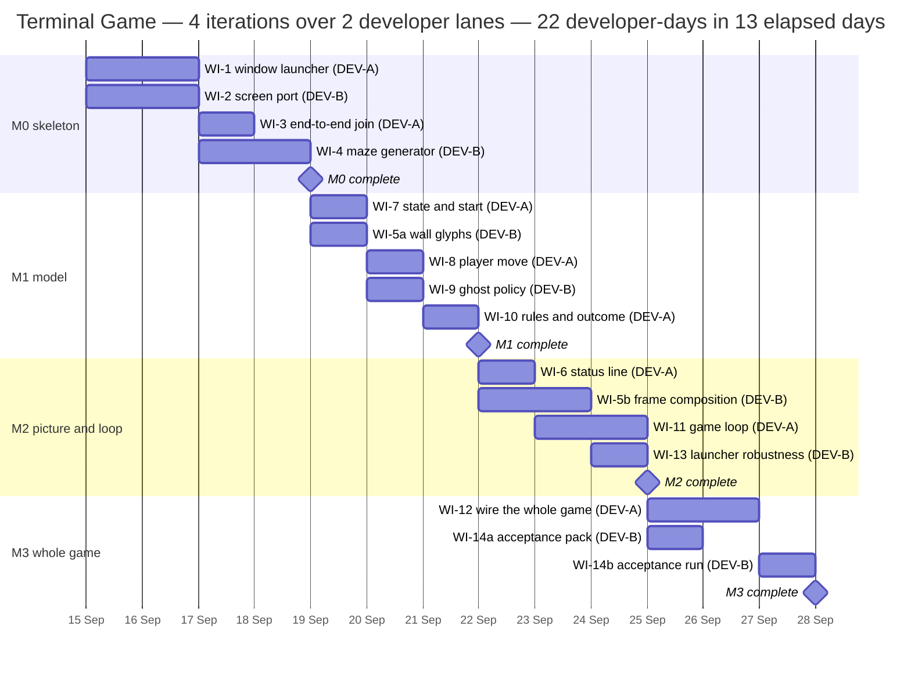
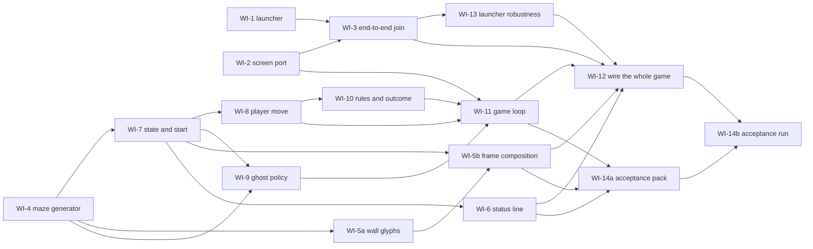

# Terminal Game — Implementation Plan

**This project runs in LOCAL MODE.** There is no remote for this run. Do not push, do not use `gh`,
do not open real pull requests. The technical lead performs every merge into `main`; developers finish
a work item, leave the branch in their worktree, and report it.

**Team: exactly 2 developers**, working as two lanes, **DEV-A** and **DEV-B**. Every effort total and
every boundary in the chart below rests on that number.

**Architecture: Candidate 1 — "Launched Terminal Session with a Layered Game Core."** This is the
user's ruling, relayed through the conductor, not a choice made here. Candidate 2 stays in
`docs/ARCHITECTURE.md` as a documented fallback only, to be reached for if driving the terminal
application turns out to be blocked — nobody on this run implements it.

**Input documents:** `docs/FUNCTIONAL_REQUIREMENTS.md` (49 requirement codes) and
`docs/ARCHITECTURE.md` (sections 8, 9 and 10 especially).

---

## 1. Starting point — the tree is empty

There is **no application code and no test suite**. The previous run's application was deleted
deliberately, with the user's permission, in commit `35ee1d7`. You build from an empty tree, from the
specification.

**The repo-root executables are stale leftovers and are not yours to build on.** These files still
exist:

```
verify    launch-smoke    check-window-placement    play    "Terminal Game"
```

They reference a package that no longer exists, so they are broken. They are **not authoritative, not
a starting point, and not a test harness**. Do not read them for design, do not repair them, do not
call them from a test. If you want a verification script or a launcher, write your own as part of a
work item, under your own name. Leave the stale files alone; whether they are deleted is a decision
sitting with the user.

Stale `docs/progress/wi-*.md` logs from that run are also present. Ignore them. If your branch name
happens to match one, overwrite it with your own `START` line.

---

## 2. Runtime, and what the target forbids

| | |
| --- | --- |
| Language and runtime | **Python 3.9.6**, the `python3` on this machine. Verified: it runs, and its `curses` module imports. |
| Dependencies | **The standard library only.** No third-party packages, no virtualenv, no packaging, no `requirements.txt`. |
| Test framework | **`unittest`** from the standard library. Verified: `pytest` is **not installed** and nothing may install it. |
| Whole-suite command | The suite must run from the repository root by one command with no arguments and no installation. The expected shape is `python3 -m unittest discover`. That is the command the technical lead runs on `main` after every merge. If your layout needs a different single command, agree it between the two of you during M0 and tell the technical lead **before the first merge**. |
| Desktop automation | `osascript` via `subprocess`, from the launcher process only. |

**3.9 forbids things you may reach for by habit:** `match`/`case`, `int | None` in an annotation
evaluated at runtime, `@dataclass(slots=True)`, `zoneinfo` niceties, `functools.cache` (use
`lru_cache`), and the walrus-free assumption that `dict` ordering is your problem. `list[int]` and
`dict[str, int]` in annotations *are* fine in 3.9. If you want modern annotation syntax, use
`from __future__ import annotations`.

---

## 3. The layer dependency rule

This is a constraint on the code, not a description of a directory tree. Where things live and what
they are called is yours.

- **The Domain is pure.** It imports nothing impure: no `curses`, no `subprocess`, no `os`, no
  `sys.stdout`, no `time`, no screen geometry. Randomness enters it only through a seed or a random
  source passed in, so any maze or ghost behaviour can be reproduced in a test.
- **Presentation depends on Domain, and on the screen port's value vocabulary — and on nothing
  else.** It turns a domain state into a grid of characters *and colours*, and it cannot name a colour
  without the port's name for one. What it may take from the port is **names**: the value types and
  constants a frame is made of. What it must never take is **behaviour or state** — no screen handle,
  no adapter, no function that draws, presents, or reads a key. It never reads a key, never writes to
  a terminal, never sleeps. The permitted set is pinned in one place in the suite, so that a ruling
  the other way costs one line and the suite reports what else moves. *(The original wording said "and
  on nothing else" flatly, which contradicted this plan's own §9 rows describing a "glyph **and
  colour** table" for SCRN-4, SCRN-5 and SCRN-6. The plan assumed this in one section and forbade it
  in another. Corrected after WI-5a raised it rather than quietly complying with the stricter
  reading.)*
- **Application depends on Presentation, Domain and the Screen port.** Nothing depends on Application.
- **The Screen port is an interface; the terminal adapter is the only thing behind it that knows
  `curses` exists.** Nothing above the port imports `curses`.
- **The Launcher process shares no code with the game's Domain, Presentation or Application.** It
  knows nothing about mazes. The game process shares no code with the Launcher and **never touches the
  desktop** — no moving, titling or closing of windows from inside the game (architecture caution C11).
- **Keep screen geometry out of the Domain** (caution C5). Two columns per square, three-column actor
  glyphs and the 40 x 30 frame belong to Presentation. If that geometry leaks into the maze, the maze
  tests stop being about mazes and MAZE-5 and MAZE-6 become much harder to check.

Beyond that rule, **file names, module and package names, class and function names, which module a
piece of logic belongs in, the internal interfaces between modules, the shape of the tree and where
tests live are the developers' to settle** — between yourselves, looking at the code. This plan
deliberately names none of them. If your arrangement differs from whatever the plan's prose seems to
imagine, that is you doing your job, not a deviation.

---

## 4. Ground rules

### 4.1 Machine safety — a real person is sitting at this machine

Several work items open Terminal windows, take focus and ask macOS for permissions while a human is
using the screen. These are not cosmetic:

- **Capture the window id at the moment of creation, and only ever act on that id.** Never "the front
  window", never by title, never by "the newest one". The user's own shells, their editor and the
  session running this project are all windows in the same application.
- **Let the child process exit, confirm it has exited, and only then close the window.** Closing a
  window whose process is still alive raises a modal sheet that only a human can dismiss — and **a
  modal sheet blocks AppleScript**, so the next `osascript` anyone runs hangs behind a dialog nobody
  is watching. It will be reported as a mysterious timeout, and it will waste an hour.
- **Never launch a process that blocks forever** — no `cat`, no `sleep infinity`, no bare `read`. You
  would then have no way to end it without the sheet.
- **Reap your windows on the failure path too.** A blocked, failed or timed-out work item closes what
  it opened *before* it reports. After a close, verify with `visible`, not `exists`.
- **But reaping never means closing a busy window.** These two rules pull against each other when
  setup fails while the child is still running, and the one above does **not** win. Wait a bounded
  time for the process to exit; if it has not, **leave the window and name its id in the failure**.
  Closing it anyway raises the modal sheet, and the sheet blocks every later automation call
  *including the cleanup itself* — so "reap anyway" does not even achieve reaping. An orphan window is
  a nuisance a human closes in one gesture; a sheet stops the whole team and needs the user. *(Added
  after WI-1 measured it. See §11.)*
- **Every automation call gets a timeout and a way out.**
- **Anything that needs a human to look at a screen, flip a preference or grant a macOS permission
  cannot be done by an agent.** No agent on this team can grant the Automation/Accessibility
  permission or confirm it was granted. Collect such things as **human checks** in your report. Do not
  guess and record it as verified.

### 4.2 Git, branches and merges

- One work item, one branch, cut from `main` unless this plan says otherwise. Name it
  `wi-<code>-<two-or-three-word-slug>`, lowercase and hyphenated — `wi-1-window-launcher`,
  `wi-5a-wall-glyphs`. Your progress log is `docs/progress/<branch-name>.md`, so the branch name is
  what makes your log findable.
- Start every commit subject with the work item code: `WI-3: ...`.
- **You never merge.** `main` is checked out in the primary working tree and git will not let you
  check it out from your worktree. Leave the branch where it is and report it. The technical lead
  merges one work item at a time and runs the whole suite on `main` after each.
- **Write the PR-summary markdown anyway.** In local mode it stands in for the pull request.
- **If your branch conflicts with `main`, the conflict is yours to settle with the other developer** —
  not to hand up. `git merge main` into your branch, resolve on the merits, run the **whole** suite,
  report the branch ready, and record what conflicted in a `NOTE` line. The other developer's PR
  summary in `docs/prs/` and progress log in `docs/progress/` tell you what their change was for. If
  the two of you find you disagree about something real — where a responsibility belongs, which
  interface survives — escalate *that*, named plainly, not the merge conflict it arrived as.
- **Prefer not creating the conflict to resolving it cheaply.** The rule above settles a collision for
  the price of a merge; avoiding it costs nothing at all. One case recurs often enough to name:
  **where a guard sweeps a directory automatically, do not also list the swept thing explicitly in a
  file that two lanes edit.** The explicit entry buys no coverage the sweep does not already give, and
  it puts two developers on adjacent lines of a shared file for no return. Put the equivalent
  assertion in your own test file and import the shared helper rather than duplicating it.
- **If you leave something out deliberately, say so where the next person will look** — in the commit
  message and in your PR summary. An absent entry that looks like an oversight will be "fixed" by
  whoever notices it next, and the conflict you avoided arrives a week late with nobody remembering
  why.

### 4.3 Where documents go

Exactly these four shapes, no fifth:

| Path | One per | Example |
| --- | --- | --- |
| `docs/prs/PR-<ITEM>-<slug>.md` | work item | `docs/prs/PR-WI-3-end-to-end-join.md` |
| `docs/completions/COMPLETION-<MILESTONE>-DEV-<X>.md` | lane, per iteration | `docs/completions/COMPLETION-M1-DEV-B.md` |
| `docs/progress/<branch-name>.md` | branch | `docs/progress/wi-8-player-move.md` |
| `docs/findings/<ITEM>-<slug>.md` | measurement worth keeping | `docs/findings/WI-1-window-id-capture.md` |

`<ITEM>` is the work item code exactly as this plan writes it — `WI-3`, `WI-5a`, `WI-14b`. A finding
goes in `docs/findings/` when it is a measurement someone will rely on later: a coordinate space
measured, a probe proved not to work, a race timed.

### 4.4 Testing

Every work item is covered by tests, and each item below says **what its tests must establish**. Write
tests that assert the consequence — what the function returned, what the state became, what the player
would see — rather than that a call was made.

**Do not try to prove that a test can fail.** Do not break working code to watch something go red, not
as a mutation check, not as a one-off, not under any other name. Do not write tooling for it and do
not log it. There is no mutation sweep on this project and no work item that runs one. If you doubt a
test, **say so** — name it and why, in your progress log and your report. That is the right answer and
it costs a line of text.

**Ask what a green result would look like if the thing you are testing were absent.** This is the most
reusable practice this project has produced, and all three times it came up, the check and the
flattering reading of it had quietly come apart:

- A grid of **solid wall** satisfies MAZE-2, MAZE-3, MAZE-5 and MAZE-6 vacuously — so the maze sweep
  asserts a corridor count as well, or it is a true statement about nothing.
- A **word-list scan** for the screen's vocabulary passes against a bare `40` typed by hand — so it is
  not the guard it appears to be, and the nine-size tests are.
- **"I built it"** is true of a test whose point was missed.

The whole of the work is noticing that they have come apart. Nothing needs running.

**This is not the prohibited practice wearing a new coat, and the difference is worth being precise
about.** You never touch the code. You never make anything fail. You ask what your test would say
about a system that had *never* had the property you think you are testing — and if the honest answer
is "it would still pass", the test is measuring something else and the remedy is to rewrite the
assertion. Breaking working code to watch a test go red remains prohibited; asking what a test would
say about a system you never build is just reading.

**This shape is not only about tests, and it has now appeared three times in three different places.**
A grid of solid wall satisfies four maze requirements vacuously — a test that passes whether or not
the property holds. Terminal's `busy` flag reports false for the whole life of a process in any window
this system grids, so "window confirmed idle" read identically whether the window was idle or the
check was blind — a **safety rule** that passes whether or not the property holds (§11.3). And
"applied verbatim" read identically whether the developer agreed with the text or silently thought it
wrong — a **process rule** that passes whether or not the property holds (§11.10). Three instances,
one shape. When you write a check of any kind — a test, a ground rule, a convention between two
people — ask what it would report in a world where the thing it checks was never there. If the answer
is "the same", you have written something that cannot fail, which is not the same as something that
passes.

**Some requirements are discharged by absence, and their tests should say so.** GAME-3 asks for no
lives, levels, time limits, power-ups, pause or restart; §9 already records that "the absence is the
design". CTRL-2's "the player never drifts on their own" is the same shape — drift would need
somewhere to live, and there is no velocity and no persistent player heading for it to live in. You
cannot write a behavioural test for a thing that has nowhere to happen. **This is a legitimate
discharge, and it is not an excuse.** The distinction is that the test must **name what must not
exist, and fail if it appears**. A test that asserts `GameState` has no velocity field is a real test:
it goes red the day somebody adds one, which is the day CTRL-2 starts being at risk. Two obligations
follow. **The test's docstring says it is structural rather than behavioural**, so no later reader
mistakes it for proof about runtime behaviour. And **where the requirement also has a behavioural
half, that half is named and placed** — CTRL-2's is in the game loop, where a tick must move the ghost
and not the player.

**A guard written when a category has one member has not been tested — it has only been written.**
WI-5a's permitted-import list named the Domain and the screen port but not Presentation itself, so no
presentation module could import a sibling. The omission could not show, because Presentation had
exactly one module and nothing to import. It surfaced the moment a second arrived. The shape, in
DEV-B's words: **a guard written when a category has one member cannot distinguish "this rule is
right" from "this rule has never been exercised."** Both read as green. So when you write a rule about
a category — a layer, a directory, a kind of module — ask how many members it has *today*. If the
answer is one, the guard is a statement of intent and not yet a check. **The second member is the
first real test of the rule**: treat its arrival as the moment to re-read the guard, not merely to
extend it.

**A guard can be wrong about the thing it guards, and that fault gets "fixed" by loosening the
guard.** WI-12's import scanner hardcoded relative imports to the launcher package, so the *game's*
`from .screen import port` was reported as importing the launcher. The guard was wrong; the code was
right. The tempting repair is to relax the rule until the false report goes away, which removes a real
check to silence a bug in the checker. Two things make it survivable. **Find it with the guard's own
tests** — a guard needs tests as much as the code beneath it, and more than most, because nothing else
is watching it. And when the guard cannot determine something, **make it refuse rather than assume**.
That is §11.8 applied to a guard. **When a guard fires, establish which of the two is wrong before you
touch either**, and the way to tell is to reproduce what the guard claims, not to reason about whether
it is plausible.

**A warning is not a guard.** WI-13 deleted `Desktop.is_busy` outright rather than adding a correct
sibling beside it, and the reason is the sharpest statement of this the project produced: the correct
answer had been documented at length for an entire work item, and the wrong one was still the default,
so the defect survived on the path the docstring told people not to use. Where an interface has a
right answer and a wrong one, the wrong one goes — a comment saying "do not use this" is not a
mechanism, it is a hope.

One consequence of that prohibition: `.claude/agents/developer.md` asks for a report section 5,
"Mutation checks". **Write "not applicable — mutation checking is prohibited on this project" there.**
The instruction is a leftover and it contradicts the prohibition in the same file.

**One requirement is fragile in a way an ordinary test may not catch, and it is the user's call
whether to spend anything extra on it: END-3.** Its correctness is the *order* of two tests inside one
function, and a refactor that reorders them leaves every other end-condition test green. The plan's
mitigation is architectural rather than procedural — END-3 lives in one named ordered function
(caution C6) and WI-10's tests hit the exact square where a dot and the ghost coincide. No further
obligation is imposed here.

---

## 5. Assumptions carried, not settled

Three questions are open. The user has **not** answered them; the architect proceeded on an assumption
for each and so do we. None is recorded here as a decision, and each is cheap to flip.

- **A1 — WIN-5 against END-5 and END-6.** WIN-5 says the window closes as soon as the game ends; END-5
  says the finished picture stays on screen and END-6 says `q` is the only way out. These cannot all
  hold at the instant of a win or a loss. **Proceeding on:** the picture freezes at the ending, and the
  window closes by itself — without the player closing it — when the player quits. *Requirements
  affected:* WIN-5, END-5, END-6. *Work items affected:* WI-3, WI-11, WI-12. Flipping it moves one
  signal earlier inside the loop.
- **A2 — the one-off macOS Automation / Accessibility permission** needed to read the frontmost
  window's position (WIN-4) and to drive the window. **Proceeding on:** it is available and the player
  is asked for it once; a refusal degrades to a documented default window position rather than
  aborting. *Requirements affected:* WIN-2, WIN-3, WIN-4, WIN-5. *Work items affected:* WI-1, WI-13.
  **No agent can grant this permission or verify it was granted** — it is a dialog in front of a human.
- **A3 — which terminal application may be automated.** **Proceeding on:** the system-supplied
  terminal, driven per window, with the player's saved preferences left untouched — no profile
  installed, no global setting changed. *Requirements affected:* WIN-2, WIN-3. *Work item affected:*
  WI-1.

Two further assumptions are inherited from the architecture and are the implementer's to pin down and
state in a PR summary: **A4** the below-and-right offset is a small fixed number clamped to the visible
screen, and **A6** START-2's "measured across the grid" is straight-line grid distance, not corridor
distance.

---

## 6. Contradictions found while planning

| What is wrong | The evidence |
| --- | --- |
| `ARCHITECTURE.md` §6, MAZE-1 row: "19 x 2 = 38 of 40 columns; the remainder is the blank right margin" — implying a 2-column margin. | Measured from the specification's own picture: every one of its 29 maze rows is **exactly 37 columns** wide, so the right margin is **3 columns**. Assumption A5 in the same document says 37 and is the correct one. **Build to 37 + 3.** |
| `ARCHITECTURE.md` A5: the three-column actor glyph "bleeds one column into the square to the west". | Measured: square glyphs occupy the **even** columns 0, 2, … 36 (19 squares) and the odd columns carry only wall joiners or blanks. A three-column actor centred on column 2k covers columns 2k−1 and 2k+1, which are **joiner columns on both sides, never another square**. It can erase a horizontal wall join beside it — which is why the frame is composed in a fixed order with actors drawn last (WI-5b). |
| `FUNCTIONAL_REQUIREMENTS.md` WIN-5 against END-5 and END-6. | WIN-5: "The window closes by itself as soon as the game ends." END-5: "the last picture stays on screen." END-6: "`q` … is the only way to leave a finished game." All three cannot hold at the moment of a win or loss. Carried as assumption A1 above — **not** ruled on here. |
| `.claude/agents/developer.md` requires a report section 5, "Mutation checks — the failure messages verbatim". | The same file, under "Do not try to prove that a test can fail", prohibits exactly that. Developers write "not applicable" — see §4.4. |
| `FUNCTIONAL_REQUIREMENTS.md` STAT-2 quotes the status line as `score 0    arrows, q quits`; the picture shows it indented by one leading space. | Measured: the picture's last row is `' score 0    arrows, q quits'`, 27 characters including a leading space. Too small to rule on — WI-6 picks one, states it in its PR summary, and pins it with a test. |

Requirement counts were re-extracted independently: **49 codes** — GAME 3, WIN 5, SCRN 7, MAZE 6,
START 5, CTRL 5, GHOST 4, SCORE 5, END 6, STAT 3. Caution C12 is confirmed. Any document reporting 58
is double-counting.

---

## 7. The iterations

Four iterations. The first exists to prove the architecture end to end, and it is deliberately
front-loaded with the risky half: **the launcher and the desktop automation are the dangerous part of
this system, not the game logic.** The game logic is a solved problem; the window is not.

Each iteration ends with something that runs.

### M0 — "Walking skeleton: a window, a screen, and a pure maze" (7 developer-days)

*What it proves:* that the two-process shape works — a launcher can create, own and safely destroy a
window by its captured id; a game process can draw a whole frame in that window through curses and
give the terminal back; and the pure domain layer really can be generated and checked thousands of
times with no window in the way. At the end of M0 you can run the launcher and watch a window open,
show something, and close itself.

| Item | Outcome | Effort | Depends on | Lane |
| --- | --- | --- | --- | --- |
| **WI-1** | **The window launcher and the desktop automation adapter.** One component, the only thing in the system that touches the desktop. It asks the desktop for the geometry of the window the player was last looking at **before** creating anything; opens a new terminal window running a given command; **captures that window's identity at the moment of creation**; sets 40 columns x 30 rows, the title *Terminal Game*, a black ground and a legible fixed-width font on that identity alone; moves it a small fixed offset down and right of the remembered geometry, clamped so it lands visible; and closes that identity once the window is idle. Every call bounded; every failure path reaps the window it opened. | 2 d | — | A |
| **WI-2** | **The screen port and its terminal adapter, plus a game process that draws one frame and quits.** A character-cell port — put a cell, present a whole frame in one pass, read a key with a timeout — with a curses adapter behind it in raw, non-echoing mode with the cursor hidden. The terminal is restored on **every** exit path, including an unhandled error. If the window is not at least 40 x 30 the process fails loudly rather than drawing a truncated picture. | 2 d | — | B |
| **WI-3** | **The end-to-end join.** The launcher opens the window running the real game process; the game runs inside it; the game exits on `q`; the launcher confirms the window is idle and closes it by the identity it captured. Nothing is left on the user's desktop. | 1 d | WI-1, WI-2 | A |
| **WI-4** | **The maze model and its generator.** A 19-wide by 29-deep grid of corridor and wall; a solid border ring that is never carved; a spanning-tree carve on the odd-coordinate lattice only; a braiding pass, restricted to that same lattice, that opens out every dead end. Seeded, so any maze is reproducible. Neighbour queries for the four sides. No screen geometry anywhere in it. | 2 d | — | B |

**Tests must establish:**

- **WI-1** — with the automation calls behind a seam a test can stand in for: that the frontmost-window
  query is issued **before** the creation call and never after (otherwise the launcher's own new window
  becomes "the window the player was last looking at"); that every subsequent operation names the
  captured identity and never a front-window or by-title expression; that the offset is applied to the
  remembered geometry and clamped into the visible screen; that a failure after creation still results
  in a close of the captured identity; that every call has a timeout. Plus one **real** run against the
  real desktop, reported as a finding with what was observed.
- **WI-2** — that a frame is presented in a single pass rather than cell by cell; that the terminal is
  restored after a normal exit, after an exception, and after a signal; that a key read returns
  promptly when a key is waiting and returns "nothing" when the timeout expires; that echo is off. The
  curses calls need a seam so these are testable with no terminal.
- **WI-4** — over **several hundred seeds**: 19 x 29 every time; the border ring intact on all four
  sides; **no 2 x 2 block of open corridor** anywhere (which is what keeps corridors one square wide);
  **zero dead ends** (every corridor square has at least two open neighbours); **every corridor square
  reachable from every other**; and two different seeds giving two different mazes. Also that the same
  seed gives the same maze twice.

**Do the two lanes overlap?** No. WI-1 is the launcher process and touches nothing the game imports;
WI-2 is the game process's screen edge; WI-4 is pure domain. They share no code. WI-3 is sequenced
after both and is written by the WI-1 author, because it is mostly launcher-side.

### M1 — "A model that can be played, headlessly" (5 developer-days)

*What it proves:* that the whole game can be played to a win and to a loss with no window and no
terminal anywhere — every rule in sections 5 to 9 of the specification, in pure code, tested by the
thousand.

| Item | Outcome | Effort | Depends on | Lane |
| --- | --- | --- | --- | --- |
| **WI-7** | **The game state and the opening position.** The state vocabulary the rest of the game speaks: the maze, the player's square, the ghost's square and heading, which squares still hold a dot, the score, and an outcome value with the three cases *playing*, *caught*, *cleared*. A new game gets a fresh random seed; the player starts on the corridor square nearest the middle; the ghost on the corridor square furthest from the player measured in a straight line across the grid — state which metric, and keep it in the domain; every corridor square but the player's holds one dot; the score is zero. One game per process: no lives, no level, no timer, no pause, no restart. | 1 d | WI-4 | A |
| **WI-8** | **The player's move.** A move of one square in one of four directions: into a wall changes **nothing at all**, not the score and not the picture; onto a square with a dot eats it — gone for the rest of the game — and adds one to the score; onto an already-eaten square scores nothing. The score never decreases. | 1 d | WI-7 | A |
| **WI-10** | **The rules and the outcome, as one ordered function.** After **every** move, by either actor: the player and the ghost on the same square is a loss, whoever walked into whom; otherwise, no dots remaining is a win. The collision test runs **first**, so eating the last dot on the ghost's square is a loss. The order lives in that one function, not in whoever calls it. | 1 d | WI-7, WI-8 | A |
| **WI-5a** | **Wall-glyph selection.** A pure mapping from a wall square's four neighbours to the blue double-line glyph that joins up with them — the straights, the corners, the tees, the crossing — and the single blue block for a wall square with no wall beside it. Presentation owns the glyph table; the domain only answers which neighbours are wall. | 1 d | WI-4 | B |
| **WI-9** | **The ghost's policy.** A pure function of the maze, the ghost's square and its heading — **the player's position is not a parameter of it**. It carries straight on while the corridor allows; where it cannot, it picks at random among the other open ways; it turns back the way it came only when there is no other choice. It touches neither dots nor score. | 1 d | WI-4, WI-7 | B |

**Tests must establish:**

- **WI-7** — the player's square is a corridor square and is the nearest such to the centre, with ties
  broken the same way every time; the ghost's square is the corridor square at greatest distance under
  the stated metric; the dot count equals the corridor count minus one and the player's square is the
  one without a dot; score zero; two sessions with different seeds give different mazes and placements,
  the same seed gives the same.
- **WI-8** — a move into a wall leaves the state **identical**, including the score; a move onto a dot
  increments the score by exactly one and removes exactly that dot; re-entering that square later adds
  nothing; a sequence of moves produces a score equal to the number of distinct dotted squares entered.
- **WI-10** — a constructed state where the player and ghost co-locate gives *caught*, arrived at both
  by the player moving in and by the ghost moving in; a state with no dots left gives *cleared*; **the
  state where the last dot sits on the ghost's square gives *caught*, not *cleared*** — that is END-3
  and it deserves its own named test; a state with dots remaining and the two apart stays *playing*.
- **WI-5a** — every one of the sixteen neighbour patterns maps to the glyph that joins its neighbours,
  the isolated case included; the colour is blue; the mapping is a function of the four neighbours and
  of nothing else.
- **WI-9** — given an open way ahead it goes ahead, over many steps in a long corridor; at a T it never
  goes ahead (there is no ahead) and over many runs with a seeded random source it visits every
  available branch; in a dead end — which the generator makes rare but not impossible to construct in a
  test — it reverses; with the player standing in every possible square in turn, the ghost's chosen
  move is identical, which is GHOST-4 stated as a test; the dots and score are unchanged by a ghost
  move.

**Do the two lanes overlap?** Lane A owns the state's definition, the player's move and the outcome.
Lane B owns the glyph table (presentation) and the ghost's policy (domain, but its own
responsibility). The one shared thing is the state vocabulary from WI-7, which lands on day 5 before
WI-9 starts, so lane B extends it rather than defining it. **If WI-9 needs a field that WI-7 did not
define, DEV-B agrees it with DEV-A before adding it** — that is a two-minute conversation and it
prevents the only plausible conflict in this iteration.

### M2 — "The picture, the loop, and a launcher that fails safely" (6 developer-days)

*What it proves:* that the model can be turned into the specification's exact picture, driven by a
loop that serves two independent event sources without threads, and that the launcher survives a
refused permission.

| Item | Outcome | Effort | Depends on | Lane |
| --- | --- | --- | --- | --- |
| **WI-6** | **The status line.** The bottom row of the window and nothing else in it, written in cyan: during play, the score kept live alongside the keys that can be used; on a loss and on a win, a line that says which ending happened and what the final score was. Decide the leading-space question from §6 and pin it with a test. | 1 d | WI-7 | A |
| **WI-11** | **The game loop.** One thread and no locks. Each pass reads a key with a timeout **recomputed from the clock as the time remaining until the next ghost tick** — a key that arrives early is handled at once and the tick still lands on schedule; no key, and the read times out exactly when the tick is due. A key that is not an arrow and not `q` is discarded. The ghost moves about seven times a second whether or not the player does. The clock is running from the first pass: nothing is pressed to begin. `q` or `Q` quits at once, at any point. Once the outcome is not *playing*, no more ticks and no more moves are issued and the frame is not rebuilt — the picture stands and only `q` is acted on. | 2 d | WI-2, WI-8, WI-9, WI-10 | A |
| **WI-5b** | **Frame composition.** A 40 x 30 grid of characters and colours from a game state: 29 rows of maze then the status row; each maze square drawn at an even column 0 to 36 with the joiner columns between them, leaving **three blank columns** of right margin; a dim gold dot on each corridor square that still has one; a bright yellow player and a pink ghost, distinguishable by **both** colour and outline, each three columns wide centred on its square; a fixed draw order with the ghost drawn **after** the player, so a loss shows what happened; and the ghost drawn over a dot without eating or hiding it. The whole frame is rebuilt each pass, never dirty cells. | 2 d | WI-5a, WI-7 | B |
| **WI-13** | **Launcher robustness.** The permission refused, or the geometry query failing for any other reason, degrades to a documented default position rather than aborting the game. Every automation call is bounded and has a way out. Idleness is confirmed before any close. Nothing the launcher opens survives a failure, a timeout or an interruption. A window is verified gone with `visible`, not `exists`. | 1 d | WI-3 | B |

**Tests must establish:**

- **WI-6** — the in-play text with a score of 0 and with a score of 37; the caught text; the cleared
  text; that the line is cyan; that it occupies the bottom row only and never writes above it.
- **WI-11** — with an injected clock and an injected key source: that the computed timeout equals the
  time remaining to the next tick and is recomputed every pass; that a key arriving early does **not**
  postpone the tick — over a simulated run of many passes with keys arriving at arbitrary moments, the
  number of ghost ticks matches elapsed time, not key count; that a run with no keys at all still
  ticks; that `q` and `Q` quit in play and after an ending; that unmapped keys change nothing; that
  after the outcome becomes *caught* or *cleared*, arrow keys do nothing, no further tick is issued and
  the frame is not rebuilt. This is the item where GHOST-1 lives or dies, and a fixed sleep or a fixed
  timeout quietly breaks it.
- **WI-5b** — the composed frame is exactly 30 rows of exactly 40 columns; maze rows are 37 columns of
  picture and 3 of margin; a known small maze composes to a known expected picture, compared as text;
  a dot appears on every corridor square holding one and on none that do not; the player and ghost have
  distinct glyphs **and** distinct colours; with the two on the same square the ghost's glyph is what
  shows; a ghost standing on a dotted square leaves the dot in the state untouched.
- **WI-13** — with the geometry query made to fail, the window is still created and positioned at the
  documented default and the game still runs; a failure injected after creation still closes the
  captured identity; a call that exceeds its timeout returns rather than hanging, and reaps.

**Do the two lanes overlap?** WI-6 writes row 29 and WI-5b writes rows 0 to 28 of the same frame. They
are on different lanes and **WI-6 lands first** (day 8) so WI-5b composes against a status row that
already exists. The two developers own disjoint rows; if they find themselves editing the same
assembly point, that is the conversation to have rather than a merge to fight. WI-11 (lane A) and
WI-13 (lane B) are in different processes entirely. **WI-13 is launcher code, written by DEV-B while
DEV-A is in the game loop** — DEV-A does not touch the launcher during M2, which is what keeps that
safe; DEV-B should read DEV-A's WI-1 and WI-3 PR summaries first.

### M3 — "The whole game in its own window" (4 developer-days)

*What it proves:* the finished application. A player runs one thing, a window opens below and right of
what they were looking at, a fresh maze is already alive with a ghost in it, they play it to a win or
a loss, the picture freezes, `q` closes the window.

| Item | Outcome | Effort | Depends on | Lane |
| --- | --- | --- | --- | --- |
| **WI-12** | **Wire the whole game and play it.** The loop drives the real domain, asks the real frame builder for a frame and presents it through the real screen port, inside the window the real launcher created; the launcher closes that window once the game has exited. The picture matches the specification's: blue double-line walls that join up, dim gold dots, a bright yellow player, a pink ghost, a cyan status line, redrawn without flicker and with the cursor never visible. | 2 d | WI-3, WI-5b, WI-6, WI-11, WI-13 | A |
| **WI-14a** | **The acceptance pack.** Automated checks that read the specification's 49 codes and assert what a machine can assert about the assembled pieces — frame dimensions and content, maze properties over many seeds, status text at each ending, the ordered end tests, the ghost's blindness. Plus the written list of what **only a human at the screen can confirm**, with the exact steps and what to look for. | 1 d | WI-5b, WI-6, WI-11 | B |
| **WI-14b** | **Run the acceptance pack against the wired game and report.** Every code answered *verified*, *verified by a human*, or *not verified, and why*. No code is recorded as verified on the strength of a guess. | 1 d | WI-12, WI-14a | B |

**Tests must establish:**

- **WI-12** — an end-to-end run with a scripted key sequence and an injected clock, against the real
  domain, the real frame builder and a screen port stood in for, playing to a loss and to a win, and
  asserting the final frame in both cases; that the game restores the terminal on exit; and one **real**
  run in a real window, observed and reported as a finding.
- **WI-14a / WI-14b** — the pack runs from the repository root by one command with no arguments; its
  report names every one of the 49 codes exactly once; the human-check list contains every item no
  agent can confirm, with at least the font's legibility (WIN-2), the colours as rendered (SCRN-3 to
  SCRN-6), the window landing visibly below and right of the previous one (WIN-4), and the one-off
  permission dialog (A2).

**The human checks are the deliverable here, not an appendix.** An agent that records "colours look
right" has recorded nothing.

---

## 8. Schedule

Effort is in **developer-days**. Days are elapsed project days, numbered from day 1; the calendar
dates exist only so the chart renders and carry no meaning about weekends.

| Iteration | Theme | Days | Dates | Work items | Effort | Lane capacity | Float |
| --- | --- | --- | --- | --- | --- | --- | --- |
| **M0** | Walking skeleton: a window, a screen, and a pure maze | 1–4 | 15–18 Sep | WI-1, WI-2, WI-3, WI-4 | 7 d | 8 d | 1 d (A) |
| **M1** | A model that can be played, headlessly | 5–7 | 19–21 Sep | WI-7, WI-8, WI-10, WI-5a, WI-9 | 5 d | 6 d | 1 d (B) |
| **M2** | The picture, the loop, and a launcher that fails safely | 8–10 | 22–24 Sep | WI-6, WI-11, WI-5b, WI-13 | 6 d | 6 d | 0 d |
| **M3** | The whole game in its own window | 11–13 | 25–27 Sep | WI-12, WI-14a, WI-14b | 4 d | 6 d | 2 d |
| | | | | **16 work items** | **22 d** | **26 d** | **4 d** |

Sixteen work items, sixteen bars. WI-5 and WI-14 are each split into two items that land
separately — WI-5a/WI-5b and WI-14a/WI-14b — because each has a half that can start well before its
other half is unblocked.

### Lane allocation

| Lane | Work items | Developer-days |
| --- | --- | --- |
| **DEV-A** | WI-1, WI-3, WI-7, WI-8, WI-10, WI-6, WI-11, WI-12 | 11 d |
| **DEV-B** | WI-2, WI-4, WI-5a, WI-9, WI-5b, WI-13, WI-14a, WI-14b | 11 d |

The two lanes are equal at 11 developer-days each, which is 22 in total against 26 days of capacity
over 13 elapsed days — 4 days of float. **The float is not padding.** Lane A's spare day in M0 is
there because WI-1 is the riskiest item in the project and the one most likely to overrun; lane B's
spare day in M1 absorbs a late question about the state vocabulary; the two spare days in M3 absorb
whatever WI-14b finds. M2 has no float at all, which makes it the iteration to watch.

**Lane A is the launcher and the application layer; lane B is the screen edge, the pure generator, the
presentation and the acceptance pack** — with the one deliberate crossover of WI-13, which puts
launcher robustness on lane B precisely because lane A is elsewhere that week.

### Gantt chart

The chart is **grouped by iteration**, one section per iteration, and each bar's label names the lane
that owns it. Each section closes with its milestone marker, placed at the start of the following day.



Reading the chart: **M0** runs days 1–4 with WI-1 and WI-2 starting together on day 1 in the two
lanes, WI-3 on day 3 once both have landed, and WI-4 filling lane B's days 3 and 4. **M1** runs days
5–7, with WI-7 and WI-5a starting together on day 5 and lane B free on day 7. **M2** runs days 8–10
and is fully packed: WI-6 on day 8 releases WI-11 on days 9 and 10, while WI-5b takes days 8 and 9 and
WI-13 day 10. **M3** runs days 11–13: WI-12 takes days 11 and 12, WI-14a builds the pack on day 11,
and WI-14b runs it on day 13 once WI-12 has landed — the gap on lane B's day 12 is the wait for WI-12
and is the float noted in the table. The four milestone markers sit at the boundaries the iteration
table quotes, each at the start of the day following its iteration's last.

### Dependency graph



The longest chain is WI-4 → WI-7 → WI-8 → WI-10 → WI-11 → WI-12 → WI-14b, which is 9 developer-days
and sets the floor under the schedule. WI-1, the riskiest item, is **not** on it — which is the point
of starting it on day 1 beside WI-2 rather than saving it up.

---

## 9. Traceability — all 49 requirement codes

| Req | Work item(s) | How it is met |
| --- | --- | --- |
| GAME-1 | WI-4, WI-7 | One pure state holding the maze, the player, the ghost and the dots. |
| GAME-2 | WI-10 | The outcome value: *cleared* on the last dot, *caught* on meeting the ghost. |
| GAME-3 | WI-7, WI-11 | One game per process. No lives, level, timer, power-up, pause or restart component exists — the absence is the design. |
| WIN-1 | WI-1 | The launcher creates the window; the game process never creates one. |
| WIN-2 | WI-1, WI-14b | 40 x 30, fixed-width, black ground, applied to the captured identity. Legibility is a human check. |
| WIN-3 | WI-1 | Title *Terminal Game*, on the captured identity only. |
| WIN-4 | WI-1, WI-13 | Frontmost geometry queried **before** creation, offset down and right, clamped visible; WI-13 owns the refused-permission fallback. |
| WIN-5 | WI-3, WI-12 | The captured identity is closed once the game process has exited and the window is idle. Under assumption A1. |
| SCRN-1 | WI-5b, WI-6 | Rows 0–28 the maze, row 29 the status line. |
| SCRN-2 | WI-2 | A character-cell port. No image path exists anywhere in the design. |
| SCRN-3 | WI-5a | Neighbour-sensitive blue double-line glyphs, the lone block included. |
| SCRN-4 | WI-5b | A dim gold dot, one per corridor square that still holds one. |
| SCRN-5 | WI-5b | Bright yellow player, pink ghost, different outlines — distinguishable by colour **and** by shape. |
| SCRN-6 | WI-6 | Cyan. |
| SCRN-7 | WI-2, WI-12 | Whole frame composed off-screen and presented in one pass; cursor hidden for the session; no dirty-cell optimisation. |
| MAZE-1 | WI-4, WI-5b | A 19 x 29 grid; 37 columns of picture and 3 of right margin. |
| MAZE-2 | WI-4 | Carving on the odd-coordinate lattice only, braiding restricted to the same lattice — no 2 x 2 open block. |
| MAZE-3 | WI-4 | The border ring is never carved. |
| MAZE-4 | WI-4, WI-7 | A fresh seed per session. |
| MAZE-5 | WI-4 | The braiding pass opens out every dead end. |
| MAZE-6 | WI-4 | A spanning-tree carve, and braiding only ever opens walls, so it cannot break connectivity. |
| START-1 | WI-7 | The corridor square nearest the middle. |
| START-2 | WI-7 | The corridor square at greatest straight-line grid distance — assumption A6; the metric is stated and lives in the domain. |
| START-3 | WI-7 | A dot on every corridor square but the player's. |
| START-4 | WI-7 | Score zero. |
| START-5 | WI-11 | The clock runs from the first pass; there is no title screen and no ready state to leave. |
| CTRL-1 | WI-11, WI-8 | The four arrow keys map to a one-square move. |
| CTRL-2 | WI-8, WI-11 | One key, one square. No held-direction or auto-repeat state exists, so drifting is not possible. |
| CTRL-3 | WI-8 | A move into a wall leaves the state identical — not even the score changes. |
| CTRL-4 | WI-11 | `q` or `Q` on every pass, in play and after an ending alike. |
| CTRL-5 | WI-11, WI-2 | Unmapped keys discarded; raw non-echoing mode, so nothing typed reaches the maze. |
| GHOST-1 | WI-11, WI-9 | The key read's timeout recomputed each pass as the time to the next tick — about 140 ms — so the tick lands whether or not a key comes. |
| GHOST-2 | WI-9 | Straight on while the corridor allows. |
| GHOST-3 | WI-9 | Random among the other open ways; reversal only when it is the only one left. |
| GHOST-4 | WI-9 | The player's position is not a parameter of the policy, so it cannot hunt. |
| SCORE-1 | WI-8 | The dot is cleared on entry and gone for the rest of the game. |
| SCORE-2 | WI-8 | One dot, one point. |
| SCORE-3 | WI-8 | An already-eaten square scores nothing. |
| SCORE-4 | WI-9, WI-5b | The ghost's move touches neither dots nor score; presentation draws the ghost over an intact dot. |
| SCORE-5 | WI-6, WI-8 | Shown in the status line; only the player's move changes it, and only upward. |
| END-1 | WI-10 | Co-location tested after **every** move, so it does not matter who walked into whom. |
| END-2 | WI-10 | No dots remaining. |
| END-3 | WI-10 | Collision evaluated before the cleared test, inside one ordered function, with its own named test. |
| END-4 | WI-5b | A fixed draw order — the ghost after the player. |
| END-5 | WI-11 | Once the outcome is not *playing*: no ticks, no moves, the frame is not rebuilt. Under assumption A1. |
| END-6 | WI-11 | `q` remains the only key acted on after an ending. |
| STAT-1 | WI-6 | Nothing else writes the bottom row. |
| STAT-2 | WI-6 | The in-play text with the live score. |
| STAT-3 | WI-6 | The text selected by outcome, naming which ending happened and the final score. |

All 49 codes are placed. None is unassigned.

---

## 10. Risks

| Risk | What it would cost | What is done about it |
| --- | --- | --- |
| WI-1's desktop automation overruns, or the permission dialog blocks it. | M0 slips and every iteration slips behind it. | It starts on day 1, not later; lane A carries a day of float in M0 for exactly this; WI-13's fallback keeps a refusal from being fatal to the game. |
| A window is closed while its process is still alive. | A modal sheet no agent can dismiss, which **blocks every subsequent `osascript`**. The run appears to hang on an unexplained timeout and a human has to intervene. | Restated as a ground rule in §4.1 and owned by WI-13: confirm idle, then close, and verify with `visible`. |
| The terminal application's saved preferences override the per-window font, size or colours. | WIN-2 quietly fails in a way only a human at the screen can see. | Collected as a human check in WI-14b rather than guessed at. Assumption A3 forbids changing the player's saved preferences to work around it. |
| A fixed sleep or a fixed timeout creeps into the game loop. | GHOST-1 breaks silently: every key press postpones the ghost, and nothing else notices. | Caution C7 is written into WI-11's outcome, and WI-11's tests count ticks against elapsed time rather than against passes. |
| WI-5b and WI-6 collide over the frame. | A merge conflict between the two lanes in the one iteration with no float. | WI-6 lands first and the two own disjoint rows; the conflict, if it happens, is theirs to settle with each other. |
| A developer treats a stale root executable as a starting point. | Time lost to code that references a package that no longer exists, and a design imported from a run we are deliberately redoing. | §1 says plainly that they are not authoritative and no work item may read them. |
| Two copies of the game run at once. | Not a case the specification contemplates; the design does not defend against it (assumption A10). | Out of scope, recorded here so nobody spends a day on it. |

---

## 11. Amendments after M0

M0 ran, and then the run was paused. These are the things the plan got wrong or left unsaid, corrected
here rather than left to disagree with the tree. Each is backed by a measurement in
`docs/findings/` or in a developer's PR summary.

### 11.1 What M0 and M1 delivered

**M0 finished complete: all four planned items — WI-1, WI-2, WI-3 and WI-4.** It was interrupted by a
pause after the first two and resumed. An earlier version of this section recorded it as ending short
at two of four, which was true when written and is not now.

M0's purpose was to prove the architecture end to end before any game logic was worth writing, and it
did — including by breaking. The launcher creates, owns and destroys a window by its captured id; the
game draws a whole frame through curses inside it and gives the terminal back; the maze generator runs
headlessly by the thousand; and WI-3 joined them and then found that the join's central safety check
had never worked (§11.3). Better found in M0 by the item whose job was to join them than in M3 by a
player.

**M1 is complete — WI-5a, WI-7, WI-8, WI-9, WI-10 — and M2 is all but done**, with WI-5b, WI-6 and
WI-11 landed and WI-12 and WI-13 in flight. `main` stands at **620 tests, 0 failed, 0 skipped**.

**One thing about how it landed belongs in the record.** For an extended stretch neither the technical
lead nor the conductor could reach the primary working tree, and a queue of nine finished branches
accumulated unmerged. It was cleared by the user, from the primary tree, one branch at a time in plan
order with the whole suite run after each and a hard stop at the first red or first conflict — the
discipline this plan asks for, applied by the only party who could reach the tree. Nothing conflicted
and nothing went red. The full record is `docs/findings/integration-queue-lockout.md`.

Two lessons were paid for and should not be relearned. **The blockage changed the shape of the work,
not only its timing** — with nothing merging, developers had to stack branches on branches and
integrate their own dependencies, which is work that normally belongs to the merge. And **absent
metadata is not evidence of an absent method**: the merges carry git's default messages, from which
both the conductor and this lead inferred that no suite had been run between them. That inference was
wrong.

### 11.2 WI-13 changes character — it is no longer first implementation

WI-1 built the A2 fallbacks — a refused reference-window query falls back to a documented default
position, a refused screen query to a documented default screen — because **the clamp cannot function
without a screen rectangle**, so the fallback was not separable from WI-1's own outcome. That was the
right call and it is ruled accepted.

The consequence is for WI-13, which §7 gives to lane B as though it were writing those fallbacks from
nothing. **It is now hardening and verification:** failure-injection tests around the fallbacks that
exist, confirmation that nothing the launcher opens survives a failure or a timeout, and a revisit of
the C2/C3 resolution in §11.3 against a real failing launch. The effort stays at 1 day; what is in it
has changed. Its dependency on WI-3 is unchanged.

### 11.3 C2 beats C3 — and the guard both rely on does not work

Cautions C2 (never close a busy window) and C3 (clean up on the failure path) give opposite
instructions when setup fails while the game is still running, and §4.1 of this plan repeated C3
without noticing. **C2 wins**, and §4.1 says so: wait a bounded time, and if the process has not gone,
leave the window and name its id in the failure.

**That resolution was, when written, satisfied vacuously — and the reason matters more than the bug.**
WI-3 measured that setting `number of columns` and `number of rows` on a tab, which is exactly what
WIN-2 requires of every window this system opens, makes that tab's `busy` property report **false for
the entire life of the process in it**. Fonts, colours and the title switches are harmless; the grid
alone does it; and doing it to a blank window before running anything does not help. So the bounded
wait never waited, the confirmation always confirmed, and "window confirmed idle" read exactly the
same whether the window was idle or the flag was blind. The launcher closed windows on live games and
reported success.

**This is §4.4's practice applied to a ground rule instead of a test**: ask what a green result would
look like if the thing being checked were absent. "Idle confirmed" looked identical in both worlds.

**Do not read this as retiring the modal-sheet hazard.** The sheet is real and C2's reasoning is sound
— for windows that have *not* been gridded, where `busy` tracks the process exactly. It is precisely
the windows this launcher creates that are blind, and for them the danger is inverted: not a blocked
call behind a sheet nobody can dismiss, but a game killed under the player with no prompt at all,
because Terminal does not prompt about a window it believes idle. Two hazards; which applies depends
on whether the window has a grid.

**What to ask instead:** `processes of selected tab`, which keeps telling the truth and empties when
the game ends. See §11.12.

Relatedly, §4.1's "verify with `visible`, not `exists`" now has a measurement behind it rather than
only the architecture's say-so: `id of every window` reported a window the launcher had already
closed, and `every window whose visible is true` did not.

### 11.4 WIN-4's mechanism was wrong in the architecture

`ARCHITECTURE.md` A4 and its WIN-4 coverage row say the position is "clamped to the visible screen so
the window always lands somewhere visible". **Measured: the desktop reports the union of all displays
— `-3509,-1440,1611,982` — much of which is over no display at all**, so clamping to that rectangle
does not deliver visibility and WIN-4 would not be met.

**The mechanism that does work, and which WI-1 implements:** keep the new window's corner inside the
reference window's own frame. The reference window is by construction on a display the player is
looking at, so a corner inside it is visible. Anyone revisiting window placement uses this, not the
clamp.

Related and measured on the same item: **`set position` is a request, not an instruction.** Asked for
`Point(-876,-1353)`, the window landed at `Point(-876,30)`, because macOS constrains a window to the
screen it is on. **WIN-4 is confirmed by reading the position back, never by the move call
succeeding.** `GameWindow.asked_for` exists beside `GameWindow.position` to keep that difference
visible instead of discarding it.

### 11.5 WIN-3 cannot be met exactly by automation alone

Measured: with every scriptable title switch off, the bar reads `rodneybailey — sleep 6`; with the
custom title on, `rodneybailey — Terminal Game — sleep 6`. Two components — the active process name,
and the working directory the login shell publishes — are **absent from Terminal's scripting
dictionary** and are governed by the player's saved profile, which assumption A3 forbids changing.

So the launcher sets the custom title, does **not** clear the profile-governed components, and
**WIN-3 is not recorded as verified**. The §9 traceability row for WIN-3 should be read with that
attached. This is the second requirement where the platform will not give what the specification asks
without touching the player's preferences — WIN-2's font and colours are the first. Both are the
user's to settle and both sit on WI-14b's human-check list.

### 11.6 Where a test seam belongs, when the requirement is about a script

WI-1 put its seam at the subprocess runner rather than at the adapter, so its tests assert on the
**AppleScript text**. The reasoning is worth keeping: caution C1 is a claim about the *words in a
script* — act on a captured id, never on "the front window" — and a test that watched Python method
calls would watch a perfectly well-behaved adapter emit `close front window` and notice nothing. That
is §4.4's rule about asserting the consequence rather than the shape, applied somewhere this plan had
not thought to apply it. Later items that generate scripts should do the same.

### 11.7 C8 is a proof, not a measurement — and the restriction cannot be relaxed

Caution C8 tells implementers to restrict braiding to the same odd-coordinate lattice the carve used,
and backs it with the architect's sweep: *"with the restriction I measured 0 such blocks … across 300
generated mazes; without it, no such guarantee."* **That understates it. MAZE-2 holds by
construction**, and WI-4 showed why:

- An opened square is either a cell, at **(odd, odd)**, or the wall between two cells, which has
  **exactly one even coordinate**. So a square with **both** coordinates even is never opened.
- Every 2 x 2 block of squares contains **exactly one** both-even square, because exactly one of any
  two adjacent coordinates is even.
- Therefore every 2 x 2 block contains a wall, and no 2 x 2 block can be fully open — **at any size,
  under any random source, for every seed there will ever be.**

Verified independently before this was written: the real generator over 720 mazes at nine sizes
produced **0 open squares with both coordinates even** and **0 fully-open 2 x 2 blocks**. The premise
is a property of the code and was measured; the conclusion is arithmetic and was checked by hand.

**Why this matters beyond tidiness.** A sweep invites the question *"the numbers are fine — could we
relax the restriction?"* The answer is **no**, not *probably not*. Anyone tempted to braid an
arbitrary wall is not weakening a safety margin, they are removing the only thing that makes MAZE-2
true. The write-up is in `docs/findings/WI-4-maze-invariants-over-seeds.md`.

**The proof does not retire the sweep.** Its premise — that only the odd lattice is ever opened — is a
property of the code, not of arithmetic, so if a later change alters what the carve and braid may
open, the proof lapses without a word. The seed sweep is what would notice. Keep both: the proof says
the restriction cannot be relaxed on purpose, the sweep says it has not been relaxed by accident.

### 11.8 Refusing beats silently degrading — now the rule in both lanes

Two work items reached the same decision independently and it is worth stating once as policy.
`Frame.put` **raises** on an out-of-range cell rather than clipping (WI-2), and `generate_maze`
**raises** `MazeTooSmall` on an even dimension or a lattice under 2 x 2 cells rather than returning a
grid that cannot satisfy MAZE-5 (WI-4). In both cases the input makes a requirement unsatisfiable, and
a quietly degraded result would turn a geometry bug into a picture or a maze that is subtly wrong
rather than obviously broken. **Later items follow the same rule**: where an argument makes a
requirement impossible, refuse and say which requirement.

**Unsatisfiable is not the same as vacuous, and only the first calls for a refusal.** The rule above is
for inputs that make a requirement **impossible** — a maze too small to have no dead ends, a cell
outside a frame that must be 40 x 30. It is not for inputs that make a requirement **not apply**. A
ghost on a square with no open way out satisfies GHOST-2 and GHOST-3 vacuously: both are conditioned
on there being somewhere to go, and where there is not, neither is being broken. It stays put.
Refusing there would turn a silent non-event into a crash, which is the opposite of what this rule is
for. **The test of which you have: name the requirement the input defeats.** If you can — MAZE-5,
SCRN-1 — refuse and say so. If the honest answer is "none, the requirement simply has nothing to say
here", do the quiet thing. One consequence decided that case as much as the reasoning did: **sibling
functions in one subsystem must agree about it**, because the next reader will infer a rule from
whichever they meet first.

### 11.9 On guarding C5, and a guard that already exists

`tests/test_layering.py` grew a domain-purity case under the standing obligation from §11 — but its
screen-geometry check is a text scan for the port's vocabulary and **cannot catch a bare `40` typed by
hand**. WI-4 flagged that rather than defending it, which is the right behaviour and needs no work in
response: extending the word list would not fix it.

The stronger guard is already built, though it was not framed as one. **The generator is exercised at
nine different grid sizes**, so a screen dimension hard-coded anywhere in the domain would fail those
tests outright. Later domain items should keep testing at sizes other than 19 x 29 for that reason,
not merely for generality.

### 11.10 When the technical lead cannot reach the tree

**A developer may apply the technical lead's exact words to this plan. A developer may not otherwise
amend it, however right the edit.** When the lead is cut off from the working tree and a defect in the
plan is known, the correction may be carried by whoever has access, under four conditions: the lead
asks explicitly; the lead supplies the text; the developer applies it verbatim and attributes it; and
the lead checks it word for word before the branch merges.

**The third and fourth conditions are only checkable because of the second**, and that is the
load-bearing half. Had the developer been asked to write the paragraph from the lead's intent, there
would have been nothing to diff against, and "verbatim" would rest on goodwill instead of on an audit.
Supplying the words is not ceremony — it is what makes the rest of the rule enforceable. A rule that
cannot be checked is a convention, and this run has already watched a convention fail quietly: two
developers agreed `tests/__init__.py` would be empty and identical on both sides, both believed it
held, and it did not. It merged cleanly by luck.

*(The distinction is DEV-B's, made while declining to apply an edit it had been offered and could have
made unasked.)*

**What the four conditions did not cover.** This rule was written the day the situation arose, by the
two parties it favoured, about an instance that went well — which is exactly when a rule is most
likely to be generous to itself. It had been tested once, in the easy case: a defect both parties
already agreed was a defect, in text neither disputed. The case that tests it is the one where **the
developer believes the supplied paragraph is wrong**, and the four conditions were silent on it.
"Applies it verbatim" tells a dissenting developer what to type, not whether to speak; and the lead's
word-for-word check at merge would pass a paragraph the developer thought was a mistake, because it
checks transcription and not agreement. A developer could have complied exactly, in silence, and
nobody would ever have learned they disagreed.

That is the same defect this rule exists to prevent, one level up: **a check that reads the same
whether the thing it is checking is there or not.**

**So there is a fifth condition: the developer records agreement or dissent in the commit message that
carries the text.** Dissent is a step, not an omission. They apply the text either way — the plan is
the lead's document and disagreement is not a veto — but a dissent recorded travels with the change
into the history, where the next reader meets it, instead of dying with the worktree. **And the lead
answers a recorded dissent, before or at the merge**, by amending or by saying plainly why the text
stands. Silence from the lead is not an answer either.

*(The gap was found by DEV-B, which declined to amend the rule itself and left it on the record
instead — which is the fifth condition being followed before it existed.)*

### 11.11 The specification's purpose clauses are weaker than its mechanisms

Five requirements state a mechanism and then a purpose the mechanism does not deliver. In each, the
mechanism is what is specified and what we build; the purpose clause is not a guarantee and must not
be read as one.

| Requirement | The mechanism, which is met | The purpose clause, which it does not deliver |
| --- | --- | --- |
| WIN-3 | the custom title is set on the captured window id | *"titled Terminal Game"* — two title components are outside the scripting dictionary and governed by the player's saved profile |
| WIN-2 | 40 x 30, fixed-width, black ground | *"large enough to read comfortably"* — only a human at the screen can say |
| START-2 | furthest corridor square by straight-line grid distance | *"so the two always start well apart"* — on a winding maze, far across the grid can be a short walk |
| GHOST-1 | one square at a time, about seven times a second, independent of the player | *"roams the maze"* — in about 1 game in 62 the ghost is confined to a loop over as little as 4.5% of it |
| END-1 | co-location decides a loss, read from the state | *"whether the player walked into the ghost or the ghost walked into the player"* — a state does not record how it came about |

**Conformance is settled in every row: the mechanism is implemented as written.** What is open in the
first four is a judgement about how the finished game looks or feels, which is the user's and not this
plan's. **END-1 is the exception and the interesting one:** its purpose clause is met *precisely
because* the mechanism cannot honour the distinction. An implementation that could tell would be
carrying history it has no reason to have, so "identical either way" is the requirement, proved by two
tests arriving by each route.

**WI-14b reports rows of this kind as two lines, not one** — the mechanism verified, and the purpose
clause named as a human check with the measurement beside it. A single "met" would be true of the
mechanism and misleading about the requirement.

**Where two witnesses to a requirement disagree, prefer the one that can carry the detail.** The
specification says things twice: once in prose, once in its worked example. Three items settled a
question by parsing the picture rather than reading the sentence — the wall-glyph table, the joiner
rule and the status line's leading space — and in each the picture decided it, because a 37-column
rendering carries information a sentence cannot and did not have to be interpreted. This is not a
licence to prefer whichever witness is convenient: it applies where one witness is **richer in the
dimension under dispute**. The picture settles layout, glyphs and spacing; the prose settles intent,
ordering and what counts as an ending. Ask which witness could even express the distinction you are
trying to resolve, and take that one. And prefer a test that reads the **document** over one that
reads a copy of it, so that editing the specification tells you the code needs rechecking.

### 11.12 One answer to "is it still running", and where it lives

Ruled after WI-3. `WindowLauncher.run` and `Desktop.is_busy` move from Terminal's `busy` flag to the
process list; **WI-13 owns it and it is WI-13's first obligation**, not the revisit §11.2 described.
Not folded into WI-3, which was green and measured, and whose 29-window evidence would have had to be
re-measured on a changed foundation.

The exposure meanwhile was bounded and deliberate: nothing on `main` depends on `run` except WI-1's
own tests and entry point, M1 is pure-domain work that touches no launcher, and the first real
consumer is WI-12 — which already depends on WI-13. Until it lands, the defect is stated in `run`'s
own docstring, because nobody calling a function reads the plan first. **WI-13 removes that note when
it lands the fix**: a warning that outlives the defect it warns about teaches readers that warnings in
this code are not to be believed.

**The outcome WI-13 must reach: exactly one answer exists in the system to "is this window's command
still running."** Today there are two, and they disagree — the `busy` flag behind a default and the
process list behind an injected argument. Which of them survives, and whether the seam survives at
all, is the developer's call. Two sides of one seam disagreeing about the meaning of one question is
not.

**Also carried into WI-13, measured by WI-3 and DEV-A:** creating the window empty, gridding it while
nothing runs in it, and only then running the command **removes the 0.496 s configure/start-up race
entirely rather than narrowing it** — there is no interval in which the game could observe the
pre-resize size. Two caveats, supplied unasked and to be honoured: it was measured for the *busy*
question and **not** with the size gate removed, so nobody drops the gate without re-measuring; and it
changes `open_window_running`, the call that captures the window identity, so it is a change to
**caution C1's mechanism** and gets its own tests rather than riding along as a side effect.

### 11.13 END-5's guard lives in the domain, not the loop

Ruled after WI-10, **against the technical lead's stated lean**, on the developer's argument. Once a
game's outcome is not *playing*, the domain itself refuses to move the player or the ghost. The loop
is free to keep calling and correctness does not depend on it declining to.

The lead's position had been that END-5 — *"everything stops"* — is a property of the loop. **The
argument that overturned it: the loop cannot stop.** `q` must still work (END-6, CTRL-4), so after an
ending the loop keeps running and keeps reading keys. There is no moment at which it ceases to call
in. So the rule is a *condition* wherever it lives, and the only question is where the condition is
cheapest to get right and hardest to bypass. Three things then decide it:

- **A guard a caller can bypass is not a guard.** WI-12's acceptance pack, a replay tool or any test
  can call the domain primitive directly. With the rule only in the loop, each can silently produce a
  state the requirements say cannot exist.
- **It belongs where testing is cheap.** END-5 is not hard to get right, it is easy to forget — which
  is the worst kind of rule to place in the one component that needs a terminal to test.
- **Both halves land in one place.** END-5 stops the ghost as well as the player, and the domain
  refuses both; a loop-side guard has to remember each separately.

**A consequence worth having, because it is the point rather than a side effect:** with the guard in
the domain, every loop-side END-5 behaviour becomes an *optimisation* rather than a correctness
requirement. The loop may skip the tick; it need not. It may skip rebuilding the frame; if it
rebuilds, the state has not changed, so the frame is identical and the picture stands anyway. Nothing
END-5 requires can be lost by forgetting something in the loop — exactly the property you want for a
rule that is easy to forget.

**What remains WI-11's:** `q` and `Q` quitting in play and after an ending (CTRL-4, END-6); unmapped
keys discarded (CTRL-5); the tick timing (GHOST-1); and not rebuilding the frame after an ending, now
as an optimisation rather than a requirement. **Do not re-add a loop-side guard "for safety"** — two
enforcements of one rule is §11.12's shape, and the second is the one that rots, because the domain's
has the whole domain suite behind it and the loop's would have a handful.

### 11.14 One obligation carried into WI-12

`compose(state, status_line=None)` leaves row 29 blank when no status line is handed to it. That seam
is right — it is what let WI-5b and WI-6 proceed in either order — but it means a wiring omission in
WI-12 produces a blank status row that composes cleanly and passes every WI-5b test: a silent STAT-1
violation wearing the costume of a legitimately blank row. **WI-12 must assert the status row is
non-blank in the wired game.**

### 11.15 `--seed`, `--hold`, and what the launcher passes the game

**`--hold` is retired from both sides, in one commit.** It was M0 scaffolding and the WI-2 ruling said
so; WI-12's real game exits on `q` and never on a timer. Changing both sides together was right and is
the general rule: **where an interface change spans two components, it lands as one commit**, because
either half alone leaves the launcher starting a game with an argument it will reject.

**What that costs, recorded where the constant used to be:** the launched command is no longer bounded
by anything the launcher controls. That is correct for a game with a person at the keyboard, and safe,
because the launcher waits on the process list and never closes a busy window. But **anything that
starts a game with nobody at the keyboard must arrange its own way out.** That is an obligation on
**WI-14b**: it may not use a hold and may not launch an unbounded game and hope. It either drives `q`
into the tab it created — WI-3 measured `do script "q" in selected tab of window id N` reaching the
game in 0.14 s with no focus stealing — or it exercises the loop with no window at all.

**`--seed` is accepted on both sides**, which this plan asked for on neither. The justification is that
**one seed must name the whole game**: a single random source feeds both the maze and the loop, because
with two sources a seed reproduces the maze but not the game played on it. Reproducing the maze alone
would make a failing acceptance run an anecdote rather than a bug.

**The boundary, which preserves MAZE-4:** the default path takes a fresh random seed every time, and
nothing in the launcher's normal operation passes a fixed one. MAZE-4 describes what happens when a
player starts a game, and that is unchanged. Assumption A8 permits exactly this much — "no
command-line options beyond whatever the launcher must pass the game".

### 11.16 What the specification does not say

Distinct from §11.11, and the distinction matters: §11.11 is about requirements that state a mechanism
**and** a purpose the mechanism does not deliver. This section is about cases the specification does
not address at all. **A silence is not a contradiction, and reading one as the other invents a defect.**

**A game that is never quit holds its window indefinitely.** END-6 governs a *finished* game; GAME-3
rules out a time limit; nothing anywhere says what becomes of a game left running. The implementation
is therefore correct in doing nothing, and this is recorded so that nobody later reports it as a bug
**or adds a timer to close it** — a timer would breach GAME-3, which is explicit. It is also why
retiring `--hold` needed a note rather than being a silent tidy-up: the silence is harmless with a
person at the keyboard and is a trap for anything automated. See §11.15.

### 11.17 The acceptance pack's boundary

**Confirmed: the acceptance pack may import the launcher and must import nothing from the game.** It
drives the assembled application from outside — opening a real window, running the real command,
reading the picture back — and that is the whole of its value. A check that reaches inside the game can
pass while the thing the player runs is broken, which is precisely the failure an acceptance pack
exists to catch. **`tests/test_layering.py` guards this boundary** like the others; a new category with
rules nobody enforces is §4.4's one-member guard waiting to happen.

**Where the pack lives and what it is called are not this plan's to decide** — that is the developers',
as §3 says, and it is worth saying so plainly in the one case where the lead was asked directly. What
is the plan's is the dependency rule, and that is the paragraph above.

**One item in WI-14a's brief is discharged elsewhere and must not be duplicated here.** The brief asked
for "maze properties over many seeds"; WI-4's sweep already does that over 20 000 mazes inside the unit
suite, where it belongs, because it is a property of the generator and not of the assembled
application. The pack correctly does not reach into the domain to repeat it.

### 11.18 WI-3's finding is superseded in one particular

WI-3 measured that setting the grid alone makes Terminal's `busy` flag lie. **WI-13 could not reproduce
that, and rather than report a fix to a defect it could not reproduce, it measured a 2 x 2**: `sleep`
without the grid, 0 lies of 9; `sleep` with the grid, 0 of 8; a real game without the grid, 0 of 15; **a
real game with the grid, 8 of 9. It takes both** — the grid *and* a real curses program in the tab.

Nothing that was built on the original finding changes: every window this launcher opens has a grid and
runs the real game, so the flag lies on all of them and §11.3's conclusion stands unaltered. What
changes is the explanation, and an explanation that is wrong in its cause is how somebody later
concludes the problem does not apply to their case. **`docs/findings/WI-3-busy-is-false-after-a-grid-resize.md`
carries a pointer to WI-13's finding**, added by the technical lead rather than by editing another
developer's measurement. Asking rather than amending it unasked was the right call.
