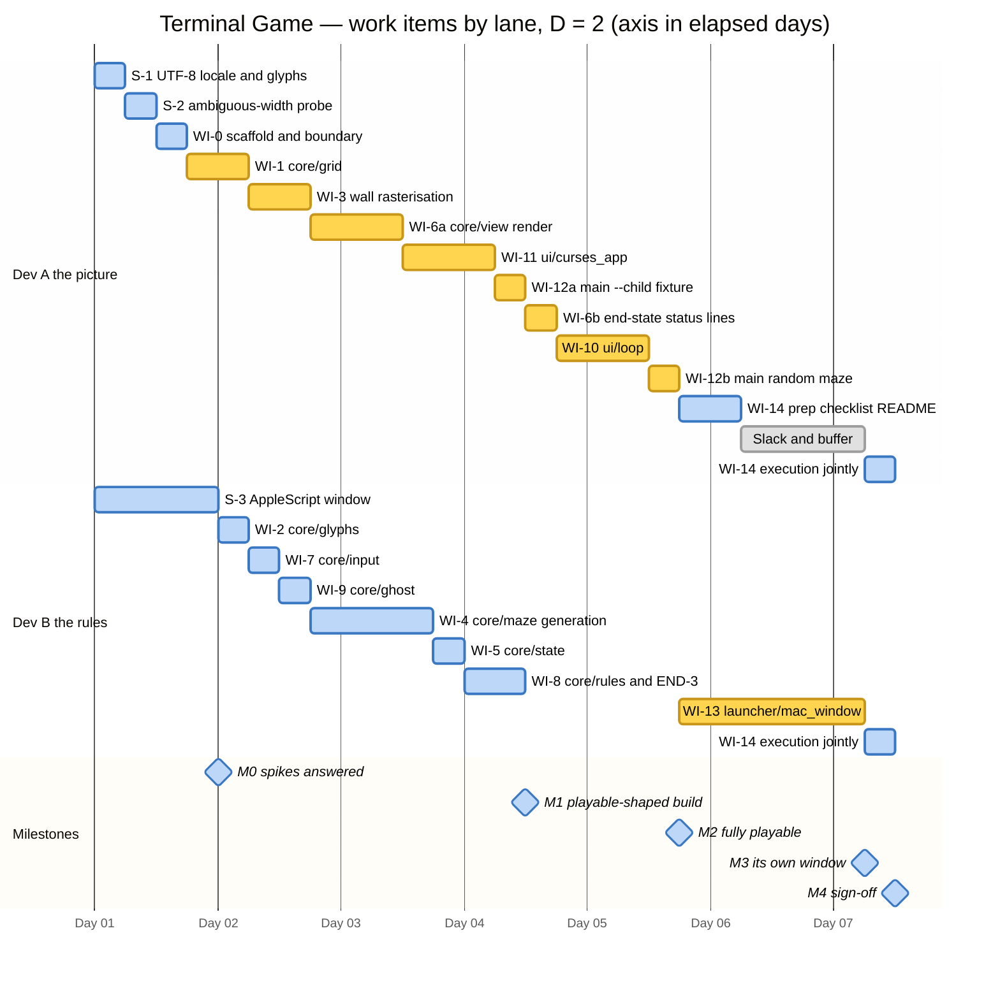

# Terminal Game — Implementation Plan

Implementation plan for [`FUNCTIONAL_REQUIREMENTS.md`](FUNCTIONAL_REQUIREMENTS.md)
built to the design in [`ARCHITECTURE.md`](ARCHITECTURE.md).

Greenfield: the repository currently contains `docs/` and `.claude/` only. Every path
below is created by this plan, against the layout in ARCHITECTURE.md §4.

Team size **D = 2** — selected by the user, and the basis of every schedule below.
The two lanes are *Dev A ("the picture")* and *Dev B ("the rules")*; §7 assigns them.
Effort is quoted in ideal developer-days for a competent Python developer; elapsed days
are what two developers working the lanes in §7 actually take.

---

## 1. Decisions needed before coding

Both questions that needed the user have now been answered (§1.1, §1.2); nothing here
blocks work. The rest are recorded so that no developer has to invent them.
Full treatment of every ARCHITECTURE.md §12 assumption and §13 open question is in §8.

### 1.1 RESOLVED — the status-line spacing, ARCHITECTURE.md §13.4

The architect flagged the three example strings in STAT-2/STAT-3 as mutually
inconsistent. Measured against the specification text they are:

| Phase | Spec string | `q quits` at column | Leading |
| --- | --- | --- | --- |
| PLAYING | `` score 0    arrows, q quits`` | 20 | one space |
| CAUGHT | `CAUGHT  score 37   q quits` | 19 | none |
| CLEARED | `CLEARED  score 274  q quits` | 20 | none |

**They are not in fact inconsistent.** A single rule reproduces all three byte-for-byte:

> `prefix + "score " + f"{score:<3}" + "  " + hint`
> where `prefix` is `" "` / `"CAUGHT  "` / `"CLEARED  "` and `hint` is
> `"arrows, q quits"` / `"q quits"` / `"q quits"`.

Verified: the score sits **left-justified in a three-character field followed by two
spaces**. `0` → `0` + 2 pad + 2 sep = four spaces before `arrows`; `37` → 1 pad + 2 sep =
three spaces before `q`; `274` → 0 pad + 2 sep = two spaces before `q`. All three spec
examples fall out exactly. The residual column difference between CAUGHT (19) and
CLEARED (20) is just the one-character difference between the two words.

Three options, therefore:

| | Rule | Reproduces the three spec strings | Tail stays put as the score grows |
| --- | --- | --- | --- |
| **A** | Three literal templates, `{score}` unpadded (ARCHITECTURE.md §8) | yes | **no** — `score 9` vs `score 100` shifts `q quits` |
| **B** | The padded-field rule above (**recommended default**) | yes | yes, for any score 0–999 |
| **C** | B, plus the outcome word padded to a common width so CAUGHT and CLEARED align | **no** — emits `CAUGHT   score …` | yes |

**Decision: option B — confirmed by the user.** It is a strict improvement on A at
identical fidelity to the specification. The maximum achievable score is ≤ 270
(ARCHITECTURE.md §6 measured 258–270 dots), so the three-wide field never overflows.

Option C was offered and **not** taken: `q quits` is therefore *not* column-aligned
between a win and a loss, and STAT-3's literal strings are reproduced exactly as the
specification writes them. This question is closed — WI-6 implements B, and its tests
assert the three spec strings byte-for-byte.

### 1.2 RESOLVED — the ambiguous-width fallback behaviour

ARCHITECTURE.md §13.2: every double-line box character and `■` is East-Asian *Ambiguous*
width, and Terminal.app's *Profiles → Advanced → "Treat ambiguous-width characters as
double-width"* preference is not settable via AppleScript. If a player has it on, the
37-column maze occupies 74 cells in a 40-column window and every row tears.

**Decision: detect and refuse — confirmed by the user.** Rather than draw a broken maze,
the game declines to start. Spike S-2 settles whether the probe works; WI-11 implements
it. If the probe reports double-width, the game paints a single plain-ASCII message
(`This game needs "Treat ambiguous-width characters as double-width" turned OFF in
Terminal → Preferences → Profiles → Advanced.`) and exits on any key. This is behaviour
not named by any requirement; it is defensive and cheap. This question is closed.

Should S-2 conclude that no reliable probe exists, the fallback is **not** to draw the
torn maze anyway: raise it then, because the choice the user made here was refusal over
a broken picture.

### 1.3 Decisions recorded, no user input needed

- **END-3 scoring** (§12.6): stepping onto the ghost is fatal *before* the dot is eaten.
  The dot stays in `state.dots` and the score does **not** include it. Visible on the
  CAUGHT line, so it is tested explicitly (WI-8).
- **START-2 metric** (§12.5): straight-line squared Euclidean distance, explicitly not BFS.
  Tested on a hand-built grid where the two metrics give *different* answers.
- **Ghost initial heading** (§12.8): chosen uniformly by the injected RNG from the open
  directions at the ghost's start square; `NORTH` if there are none (unreachable in a
  generated maze, MAZE-5).
- **GHOST-1 period** (§12.7): exactly `1.0 / 7.0` s.
- **`score 274`** (§13.5): illustrative. No test asserts a dot count; 274 appears only as
  a literal in the STAT-3 template test.

---

## 2. Ground rules for every developer

These are enforced by tests or review, not by good intentions.

1. **`core/` imports nothing impure.** No `curses`, `os`, `time`, `subprocess`, `locale`,
   `sys`, `threading`, `asyncio`. `random` may be imported for the `random.Random` *type*
   only — never its module-level functions. Enforced by WI-0's AST test.
2. **Python 3.9.6 (`/usr/bin/python3`) is the target.** `from __future__ import
   annotations` at the top of every module. No `match`, no runtime `X | Y`, no runtime
   `list[int]` outside annotations. Enforced by running the suite under `/usr/bin/python3`.
3. **No threads, no async, no timers** (ARCHITECTURE.md §13.8). The timeout-driven loop is
   the whole concurrency model.
4. **`# END-3` and `# GHOST-3 last resort` comments stay put** (§13.6, §13.7). The
   statement order in `rules.move_player` *is* the requirement; the unreachable reverse
   branch in `ghost.choose_direction` is required behaviour, not dead code.
5. **Never `clear()` or `erase()`** in `curses_app` (§8). Every cell is written each frame;
   curses damage-tracking supplies SCRN-7.
6. **Never write screen cell (29, 39).** `addstr` to the last cell of the last line raises
   `curses.error`. `view.render` still emits a full 40-wide row 29 (a blank in the last
   cell); `curses_app.blit` skips that one cell. This reconciles ARCHITECTURE.md §8's
   "space-padded to 40" with its own "do not write the bottom-right cell".
7. **Every test must be proved able to fail.** For each work item below, the *Mutation
   check* line names the change to the production code that must turn the test red. Make
   the change, watch it fail, read the message, restore. A test that stays green is
   rewritten before the work item is called done.

---

## 3. Milestones (iterations)

| # | Theme | Work items | Deliverable a stakeholder can see | Effort (ideal d) | Ends day (D = 2) |
| --- | --- | --- | --- | --- | --- |
| **M0** | Prove the risky ground | S-1, S-2, S-3, WI-0 | Three throwaway spikes answered; repo skeleton; the import-boundary test already green | 1.75 | 1.0 |
| **M1** | A real maze on a real screen, end to end | WI-1, WI-2, WI-3, WI-6a, WI-7, WI-11, WI-12a | **Earliest playable-shaped build.** `python3 -m terminal_game --child` in a 40×30 terminal draws a fixture maze in blue double lines with dots, player, ghost and status line; arrows move the player; `q` quits | 3.25 | 3.5 |
| **M2** | Rules, ghost, score, endings | WI-4, WI-5, WI-6b, WI-8, WI-9, WI-10, WI-12b | **Fully playable game**, still inside an ordinary terminal. Random maze each run, ghost at 7 Hz, scoring, both endings | 3.25 | 4.75 |
| **M3** | A window of its own | WI-13 | `./play` opens its own 40×30 black *Terminal Game* window, offset down-and-right, closing itself on `q` | 1.5 (3.0 worst case) | 6.25 |
| **M4** | Acceptance and hardening | WI-14 | Manual smoke checklist executed and signed off; traceability audit; degraded-colour and small-terminal paths exercised | 1.0 | 6.5 |

Total **10.75 ideal developer-days**, which two developers working the §7 lanes complete
in **6.5 elapsed days** ≈ **8 calendar days** with the usual overheads. The two lanes are
not evenly loaded — Dev A carries 5.5 ideal days and Dev B 5.25 — and Dev A has roughly
**one full day of genuine slack** during M3, because WI-13 is serial and nothing else is
left to hand them. That gap is real, not an estimating artefact; §7 says what to put in it.

### 3.1 Gantt chart — the schedule at D = 2

Bars are the §5 work items at their stated efforts, in the lane assignment of §7. The
axis is marked in **elapsed days from project start**, not calendar dates: `Day 01` is
the first day of work. Bar lengths are in the same unit — a 6-hour bar is a quarter-day
of effort, 12 hours a half-day, and so on.



Amber bars are the critical path (§7); blue bars are off it and have float. The grey bar
is slack.

**The two lanes are the developers, not the milestones**, because the point of the chart
is who is doing what and where they wait on each other. All five milestone boundaries
from §3 therefore appear as diamonds in the bottom row rather than as bands: M0 on day
1.0, M1 on **day 3.5**, M2 on **day 4.75**, M3 on day 6.25 and M4 on day 6.5. The work
items belonging to M3 and M4 are WI-13 and WI-14, on Dev B's and Dev A's lanes
respectively.

The two diamonds that are demonstrable *releases* are M1 — a playable-shaped build — and
M2, a fully playable game, at which point 44 of the 49 requirement codes are discharged
and the game is shippable with a "run it in a 40 × 30 terminal" note if WI-13 slips.

**Three hand-offs govern this chart** and are what a stand-up should ask about:

| Hand-off | Due | If it is late |
| --- | --- | --- |
| Dev B's **WI-2** → Dev A's WI-3 | day 1.25 | Dev A idles immediately; it is the first thing due in the project after the spikes |
| Dev B's **WI-8** → Dev A's WI-10 | day 3.5 | M2 slips day for day |
| Dev A's **WI-12b** → Dev B's WI-13 | day 4.75 | M3 slips day for day, and WI-13 is already the largest unknown (§9) |

**The grey block on Dev A's lane is real slack, not padding.** From day 5.25 to 6.25 the
critical path runs entirely through Dev B's WI-13 and there is no remaining work to
give Dev A. Do not invent scope to fill it — GAME-3 forbids the obvious candidates (a
title screen, a restart key, a high-score table). Sensible uses: pairing on WI-13's
AppleScript, extending the maze soak from 300 to 2000 seeds (§9), or simply absorbing
WI-13's worst case, which is exactly what the 1.5 → 3.0 day range in §3 anticipates.

> **Note on the arithmetic.** Summing the §5 efforts gives 1.75 + 3.25 + 3.25 + 1.5 + 1.0
> = **10.75 ideal days**. An earlier draft of §3 rounded this to 10.5 with M0 at 1.5; the
> item-level figures are the ground truth and the table now carries them.

**M1 is the architecture proof.** It exercises the whole vertical stack — the `Grid`, the
glyph table, the `ScreenBuffer` seam, curses initialisation, colour pairs, the UTF-8 and
ambiguous-width paths, key decoding, and process teardown — before a single game rule
exists. If the architecture is wrong, it is wrong at M1, three days in, with maybe 400
lines to throw away.

---

## 4. Spikes (M0) — throwaway, timeboxed

Spike code lives in `spikes/` and is **deleted or rewritten** when the real work item
lands. It is not tested and not shipped.

### S-1 — UTF-8 locale and glyph coverage (ARCHITECTURE.md §13.3)
- **Timebox:** 2 hours. **Depends on:** nothing.
- **Creates:** `spikes/s1_glyphs.py`.
- **Does:** `locale.setlocale(locale.LC_ALL, "")`, `curses.initscr()`, draw all 16
  double-line box characters plus `■ ▪ ▐█▌ ▗█▖` in the six intended 256-colour pairs;
  print `curses.COLORS`, `locale.nl_langinfo(locale.CODESET)`, `TERM`.
- **Done when:** a human confirms every glyph renders as itself (not `?`, not a
  replacement box) at Menlo 16 pt, and the recorded `COLORS` value is known. Rerun once
  with `LC_ALL=C` to confirm the failure mode we are defending against is what §13.3 says.
- **Discharges:** de-risks SCRN-2, SCRN-3, SCRN-4, SCRN-5, SCRN-6.
- **Feeds:** WI-11 (the exact setlocale/initscr order), WI-13 (the `LANG`/`LC_ALL` values
  in the spawned command).

### S-2 — ambiguous-width probe (ARCHITECTURE.md §13.2)
- **Timebox:** 2 hours. **Depends on:** S-1.
- **Creates:** `spikes/s2_width.py`.
- **Does:** `addstr(0, 0, "═")` then `getyx()`; the cursor column advance is 1 (good) or 2
  (the preference is on). Verify by flipping *Treat ambiguous-width characters as
  double-width* in Terminal preferences and rerunning. Also try `curses.window.instr` and
  `wcwidth`-by-hand as backups if `getyx` proves unreliable.
- **Done when:** the probe is demonstrated to report 1 with the preference off and 2 with
  it on, **or** it is demonstrated not to work — in which case record that and WI-11 ships
  without the guard, with the risk noted in the smoke checklist.
- **Discharges:** de-risks SCRN-1, SCRN-3. **Feeds:** WI-11, decision §1.2.

### S-3 — the AppleScript window (ARCHITECTURE.md §13.1, §3)
- **Timebox:** 1 day (this is the largest unknown in the project). **Depends on:** nothing.
- **Creates:** `spikes/s3_window.sh` / `spikes/s3_window.py`.
- **Does:** end to end, by hand: read `position of front window of (first application
  process whose frontmost is true)` via System Events; fall back to Terminal's own front
  window; fall back to a screen-origin constant. Then `do script` a command that sleeps
  and writes a done-file; set the new tab's `number of rows` / `number of columns` /
  `background color` / `font name` / `font size` / `custom title` / `title displays custom
  title`; set the window `position`; poll for the done-file; `close window id N`.
- **Done when:** a black 40×30 window titled *Terminal Game* appears offset (+40, +40)
  from the previously focused window and closes itself with no confirmation sheet — **and**
  the same run is repeated with Accessibility permission denied, proving fallback 2 keeps
  WIN-4 satisfiable.
- **Answers, and these answers must be written into the spike's own header comment:**
  1. Does setting rows/columns immediately after `do script` race the shell start-up?
     (If so, WI-13 needs a short retry loop.)
  2. What is the reliable handle for the new window — `window id` of `front window`
     immediately after `do script`, or the returned tab's window?
  3. Which TCC prompts appear on first run (Automation for Terminal, Accessibility for
     System Events) and what the denial behaviour is.
  4. How much of a menu-bar/dock-safe clamp the visible frame needs.
- **Discharges:** de-risks WIN-1, WIN-2, WIN-3, WIN-4, WIN-5. **Feeds:** WI-13.

---

## 5. Work items

Each item is independently verifiable: it lands with its own tests green under
`/usr/bin/python3 -m unittest discover -s tests -t .`.

---

### WI-0 — Repository scaffold and the boundary guard
- **Depends on:** nothing. **Effort:** 0.25 d. **Milestone:** M0.
- **Creates:** `src/terminal_game/__init__.py`, `src/terminal_game/core/__init__.py`,
  `src/terminal_game/ui/__init__.py`, `src/terminal_game/launcher/__init__.py`,
  `tests/__init__.py`, `tests/fakes.py` (empty shell), `tests/test_boundaries.py`,
  `play` (executable shell stub that resolves its own directory, exports
  `PYTHONPATH=<repo>/src`, and execs `/usr/bin/python3 -m terminal_game "$@"`),
  `.gitignore` additions, `docs/SMOKE_CHECKLIST.md` (empty headings).
- **Done when:** `python3 -m unittest discover -s tests -t .` runs and passes with the
  boundary test in it; `./play` runs and exits with a "not implemented" message.
- **Requirements:** none directly; it is the enforcement mechanism for ARCHITECTURE.md
  §1 and §13.9.
- **Tests — `tests/test_boundaries.py`:**
  - Parse every `src/terminal_game/core/*.py` with `ast`; collect every `Import` and
    `ImportFrom` root module name; assert the intersection with
    `{curses, os, time, subprocess, locale, sys, threading, asyncio, socket, pathlib}` is
    empty.
  - Assert no `core` module contains an `ast.Attribute` whose value is `Name("random")`
    and whose attr is not `Random` — i.e. `random.choice(...)` at module level is banned,
    `random.Random` as a type is allowed.
  - Assert every `core` and `ui` module's first statement after the docstring is
    `from __future__ import annotations` (rule 2 of §2).
  - Assert `src/terminal_game/core/view.py` is importable in a process where `curses` has
    been replaced in `sys.modules` by an object that raises on attribute access.
  - **Mutation check:** add `import time` to a scratch `core/` module and confirm the test
    names *that file and that import*, not just "assertion failed". Then remove it.
- **Note:** this test exists from day one precisely so it can never be retro-fitted onto a
  breach. ARCHITECTURE.md §13.9 is correct that the whole §10 test strategy collapses
  without it.

---

### WI-1 — `core/grid.py`: positions, directions, the cell map
- **Depends on:** WI-0. **Effort:** 0.5 d. **Milestone:** M1.
- **Creates:** `src/terminal_game/core/grid.py`, `tests/test_grid.py`, and the
  `grid_from_string` helper in `tests/fakes.py`.
- **Contents:** `WIDTH = 19`, `HEIGHT = 29`; `Pos = Tuple[int, int]`; `Direction` enum
  (`NORTH/SOUTH/EAST/WEST`) with `.delta` and `.opposite`; `add(pos, direction)`;
  `Grid` with `cells: bytes`, `is_wall(pos)`, `is_corridor(pos)`, `in_bounds(pos)`,
  `corridor_neighbours(pos)`, `corridors()`. `wall_glyphs` is declared here but populated
  by WI-3.
- **Done when:** a `Grid` can be built from a 29-line string fixture and answers
  neighbour queries; out-of-bounds positions report as wall, never raise.
- **Requirements:** MAZE-1 (19 × 29 dimensions), MAZE-2 (cell is wall or corridor).
- **Tests — `tests/test_grid.py`:**
  - Dimensions: `WIDTH, HEIGHT == 19, 29`; `len(cells) == 551`; index formula
    `y * 19 + x` verified by setting one known cell and reading it back at a position
    where `x` and `y` differ (never a diagonal like (3,3), which passes under a
    transposed index).
  - `Direction.opposite` is an involution over all four directions and never returns the
    input.
  - `is_wall` outside `0 ≤ x < 19, 0 ≤ y < 29` is `True` for all eight surrounding
    out-of-range cases.
  - `corridor_neighbours` on a hand-built plus-shape returns exactly the four; on a
    corner returns exactly two.
  - **Mutation check:** transpose the index to `x * 29 + y` — the index test must go red.
    Choose the probe cell as (2, 5), where the two formulas give different answers; (0,0)
    would pass under both.

---

### WI-2 — `core/glyphs.py`: the character and colour vocabulary
- **Depends on:** WI-0 (parallel with WI-1). **Effort:** 0.25 d. **Milestone:** M1.
- **Creates:** `src/terminal_game/core/glyphs.py`, `tests/test_glyphs.py`.
- **Contents:** `Style` enum (`WALL, DOT, PLAYER, GHOST, STATUS, BLANK`); the mask bit
  constants `N=1, S=2, E=4, W=8`; `WALL_GLYPHS: Tuple[str, ...]` of length 16 exactly as
  ARCHITECTURE.md §5.2 tabulates; `glyph_for_mask(mask)`; `INTERSTITIAL = "═"`;
  `DOT_GLYPH = "▪"`; `PLAYER_GLYPH = "▐█▌"`; `GHOST_GLYPH = "▗█▖"`; `BLANK = " "`.
- **Done when:** all 16 masks resolve; the module imports nothing.
- **Requirements:** SCRN-3 (the join-up vocabulary), and the glyph constants behind
  SCRN-4 and SCRN-5.
- **Tests — `tests/test_glyphs.py`:**
  - Table-driven over all 16 masks against the §5.2 table written out independently in
    the test (do not import the production table into the expectation — that is a test
    that cannot fail).
  - Assert the four "collapse onto the orientation" cases explicitly: mask `N` and mask
    `S` both give `║`; mask `E` and mask `W` both give `═`; mask 0 gives `■`; mask 15
    gives `╬`.
  - Assert every entry is exactly one character wide, and that `PLAYER_GLYPH` and
    `GHOST_GLYPH` are exactly three.
  - **Mutation check:** swap `╔` and `╗` in the production table; the corner cases must
    go red and the message must print both the mask and the two characters.

---

### WI-3 — Wall-glyph rasterisation: `Grid.wall_glyphs`
- **Depends on:** WI-1, WI-2. **Effort:** 0.5 d. **Milestone:** M1.
- **Changes:** `core/grid.py` (a `_build_wall_glyphs` pass run once at construction).
  **Creates:** `tests/test_wall_glyphs.py`.
- **Contents:** for every wall cell, build the 4-bit mask from grid neighbours that are
  also walls (out-of-bounds counts as **not** a wall, so the outer border resolves into
  corners and tees, exactly as the sample picture shows); place it at screen column `2x`.
  Odd column `2x+1` is `═` iff cells `x` and `x+1` on that row are **both** walls, else
  blank. Result: 29 strings of exactly 37 characters, computed once, immutable.
- **Done when:** a hand-written fixture maze rasterises to a byte-exact expected block of
  29 × 37 text held as a string literal in the test.
- **Requirements:** SCRN-3, MAZE-1 (37 columns + 3-column margin arithmetic).
- **Tests — `tests/test_wall_glyphs.py`:**
  - **Golden test:** a ~12-feature hand-built grid (containing at least one lone block,
    one cross, all four corners, both tees pairs, and a border run) → expected rows as a
    triple-quoted literal. On failure, print the first differing row with a `^` marker.
  - Every row is exactly 37 characters, for a fixture and for three generated mazes
    (once WI-4 lands; add the assertion then).
  - Interstitial rule tested in isolation: wall–wall gives `═`, wall–corridor gives blank,
    corridor–corridor gives blank.
  - Border corners: `(0,0)` is `╔`, `(18,0)` is `╗`, `(0,28)` is `╚`, `(18,28)` is `╝` —
    proving out-of-bounds is treated as not-a-wall.
  - **Mutation check:** change the interstitial rule to "either flanking cell is a wall";
    the golden test must go red on a specific named row. Also invert the out-of-bounds
    convention and confirm the corner test goes red — these two conventions are the ones a
    later developer is most likely to "clean up".

---

### WI-4 — `core/maze.py`: generation and start placement
- **Depends on:** WI-1, WI-3. **Effort:** 1.0 d. **Milestone:** M2 scope, built in
  Dev B's M1 window (day 1.75–2.75); off the critical path at D = 2.
- **Creates:** `src/terminal_game/core/maze.py`, `tests/test_maze.py`.
- **Contents:** `generate(rng: random.Random) -> Grid` — iterative randomised DFS over the
  9 × 14 odd lattice, then the braid pass of ARCHITECTURE.md §6 (repeatedly collect
  degree-1 corridor squares, shuffle with `rng`, carve one more wall to an in-bounds
  lattice neighbour, preferring a neighbour that is itself a dead end).
  `place_player(grid)` — corridor square minimising squared Euclidean distance to
  `(9.0, 14.0)`, tie-broken by lowest `y` then lowest `x`. `place_ghost(grid, player)` —
  corridor square maximising squared Euclidean distance from the player, same tie-break.
- **Done when:** 300 seeds pass every invariant below with zero failures.
- **Requirements:** MAZE-2, MAZE-3, MAZE-4, MAZE-5, MAZE-6, START-1, START-2.
- **Tests — `tests/test_maze.py`:**
  - **Invariants over 300 seeds** (`random.Random(seed)` for `seed in range(300)`), each
    assertion reporting the offending seed and position in its message:
    - MAZE-3: every cell with `x in (0, 18)` or `y in (0, 28)` is wall.
    - MAZE-5: every corridor square has ≥ 2 corridor neighbours.
    - MAZE-6: BFS from the first corridor square reaches every corridor square
      (`len(reached) == len(corridors)`).
    - MAZE-2: no 2 × 2 block of corridor exists anywhere (proves "one square wide"); every
      corridor step is axis-aligned by construction of the neighbour function.
    - Sanity band: corridor count lands in 240–290 (a deliberately loose band — a
      generator that returned an all-corridor or all-wall grid must fail loudly, but the
      band must not encode the measured 259–271 as a requirement).
  - MAZE-4: `generate(Random(1))` and `generate(Random(2))` differ in `cells`;
    `generate(Random(1))` twice gives identical `cells` (reproducibility for debugging).
  - START-1 on a hand-built grid whose centre square is a *wall*, asserting the nearest
    corridor is chosen, and a second fixture with two equidistant candidates asserting the
    documented tie-break — not a fixture where the centre is itself corridor, which any
    broken implementation would also pass.
  - START-2 on a hand-built grid **where Euclidean and corridor distance disagree** (a
    long U-shaped corridor: the far end of the U is close as the crow flies, the mouth is
    far). Assert the Euclidean answer. This is the only test that can distinguish §12.5's
    reading from a BFS implementation.
  - Ghost and player are never the same square, over 300 seeds.
  - **Mutation check:** remove the braid pass; the MAZE-5 assertion must go red on seed 0
    with a named coordinate. Widen the braid candidate range to include `x == 0`; the
    MAZE-3 assertion must go red. Replace the START-2 metric with a BFS; the U-shape test
    must go red.
- **Risk:** the braid loop's termination argument (degrees only increase) is sound, but a
  buggy implementation can still spin. Add a pass counter with a hard cap of 10 that
  raises with a diagnostic; the 300-seed run asserts the observed cap is ≤ 2 passes.

---

### WI-5 — `core/state.py`: `GameState` and `Phase`
- **Depends on:** WI-1, WI-4. **Effort:** 0.25 d. **Milestone:** M2.
- **Creates:** `src/terminal_game/core/state.py`, `tests/test_state.py`.
- **Contents:** `Phase(Enum)` = `PLAYING | CAUGHT | CLEARED`; the `GameState` dataclass of
  ARCHITECTURE.md §5.3; `new_game(rng) -> GameState` which generates the maze, places both
  entities, sets `dots = set(corridors) - {player}`, `score = 0`, `phase = PLAYING`, and
  picks the ghost's initial `facing` (§1.3).
- **Done when:** `new_game(Random(0))` produces a state satisfying every START-* assertion.
- **Requirements:** START-3, START-4, GAME-3 (there is nowhere in the record to put lives,
  levels or a pause flag — that is the point).
- **Tests — `tests/test_state.py`:**
  - START-3: `len(dots) == len(corridors) - 1` and `player not in dots` and every other
    corridor square *is* in dots. Assert the count against the *computed* corridor count,
    never against a literal like 265 (which would be a coincident expectation on a
    generator change).
  - START-4: `score == 0` and `phase is PLAYING`.
  - Ghost's initial facing is an open direction from the ghost square, over 50 seeds.
  - **Mutation check:** change `- {player}` to `- {ghost}`; the START-3 test must go red
    naming the player square.

---

### WI-6 — `core/view.py`: `ScreenBuffer` and `render`
Split into two landings so M1 does not wait for the rules.

**WI-6a (M1)** — `ScreenBuffer`, the maze/dot/entity paint, the PLAYING status line.
**WI-6b (M2)** — the CAUGHT and CLEARED status lines and the END-4 paint-order test.

- **Depends on:** WI-2, WI-3, WI-5 (6a may use a hand-built state before WI-5 lands).
- **Effort:** 0.75 d (6a) + 0.25 d (6b).
- **Creates:** `src/terminal_game/core/view.py`, `tests/test_view.py`,
  `tests/test_status_line.py`.
- **Contents:** `ScreenBuffer` = 30 rows × 40 columns of `(char, Style)`, with
  `text_rows() -> List[str]` and `style_rows() -> List[str]` helpers so tests assert plain
  strings. `render(state) -> ScreenBuffer` in ARCHITECTURE.md §8 order: wall glyphs into
  rows 0–28 columns 0–36 (`WALL`); columns 37–39 blank; dots at `(2x, y)`; player glyph
  across `2x−1 … 2x+1`; **ghost last**; row 29 the status line per §1.1 option B,
  space-padded to 40 in `STATUS` style with the final cell blank.
- **Done when:** a hand-built state renders to 30 asserted strings, and the sample-picture
  fixture reproduces the specification's row shapes.
- **Requirements:** SCRN-1, SCRN-2, SCRN-4, SCRN-5, SCRN-6 (style assignment), END-4,
  STAT-1, STAT-2, STAT-3, MAZE-1 (the right-hand margin), SCORE-5 (the score is displayed).
- **Tests — `tests/test_view.py`:**
  - Shape: exactly 30 rows, every row exactly 40 columns.
  - MAZE-1: columns 37, 38, 39 are blank on rows 0–28, for a fixture and a generated maze.
  - SCRN-1: rows 0–28 carry maze content; row 29 carries only the status line (STAT-1 —
    assert the row equals the expected status string padded to 40, i.e. nothing else can
    have been written there).
  - SCRN-4: a dot at grid `(3, 5)` appears as `▪` at buffer `(5, 6)` with `Style.DOT`.
    Pick a cell where `x != y` so a transposed render cannot pass.
  - SCRN-5: player renders `▐█▌` across three columns in `Style.PLAYER`; ghost renders
    `▗█▖` in `Style.GHOST`; assert both the characters and the styles, since SCRN-5 asks
    for the two to be distinguishable *by colour and by outline*.
  - **Spill safety** (§12.4): a player standing adjacent to a wall on both sides — assert
    the wall glyphs at the flanking screen columns are untouched, proving the interstitial
    either side of a corridor cell really is blank.
  - **SCORE-4 visibility:** a dot on the ghost's square renders as the ghost; move the
    ghost away in the state and re-render — the dot is back. This asserts the *consequence*
    (the dot was never removed) rather than merely that paint order ran.
  - **END-4:** ghost and player on the *same* square → the buffer shows `▗█▖` in
    `Style.GHOST`. Assert the style too: a paint order that drew the ghost's characters
    with the player's style would otherwise pass.
  - **Spec-fidelity test:** a fixture grid transcribed from the specification's sample
    picture renders to those same rows (walls, dots, and the two entity glyphs at their
    pictured squares).
  - **Mutation check:** move the ghost paint above the player paint — the END-4 test must
    go red. Change `2x` to `x` — the SCRN-4 test must go red at a named column.
- **Tests — `tests/test_status_line.py` (STAT-1/2/3):**
  - The three specification strings asserted byte-for-byte, as literals typed into the
    test from the requirements document, at scores 0, 37 and 274 respectively.
  - **Stability assertions that option A would fail:** at scores 5, 50 and 500 the
    `q quits` / `arrows,` token starts at the same column within each phase.
  - The rendered row is exactly 40 characters and cell (29, 39) is a blank.
  - **Mutation check:** drop the `:<3` padding; the stability assertions must go red while
    the three spec-literal assertions stay green — which is precisely the bug option A has.

---

### WI-7 — `core/input.py`: key codes to commands
- **Depends on:** WI-1. **Effort:** 0.25 d. **Milestone:** M1 (parallel).
- **Creates:** `src/terminal_game/core/input.py`, `tests/test_input.py`.
- **Contents:** `Command` — either `Command.QUIT` or a move carrying a `Direction`.
  `to_command(key: int) -> Optional[Command]`. Arrow key constants are passed in as plain
  integers matching `curses.KEY_UP` etc., defined as module constants in `input.py` so
  that `core/` never imports curses (they are stable terminfo values; WI-11 asserts they
  agree with the real `curses` constants at start-up in a debug assertion, and the smoke
  checklist covers the live case).
- **Done when:** the mapping table is complete and everything else maps to `None`.
- **Requirements:** CTRL-1, CTRL-4, CTRL-5.
- **Tests — `tests/test_input.py`:**
  - The four arrows map to the four directions (asserted individually, not as a set).
  - `ord('q')` and `ord('Q')` both map to `QUIT` (CTRL-4 says either case).
  - CTRL-5: a sweep over `range(0, 512)` asserts every code outside the six mapped ones
    returns `None` — including `ord('Q')`'s neighbours, `\n`, `\t`, `KEY_RESIZE`, and
    `-1` (curses' no-input sentinel). This is the assertion that stops a stray key
    reaching the maze.
  - **Mutation check:** add `ord('w')` to the table; the sweep must go red naming code 119.

---

### WI-8 — `core/rules.py`: state transitions and end-condition ordering
- **Depends on:** WI-5, WI-9. **Effort:** 0.5 d. **Milestone:** M2.
- **Creates:** `src/terminal_game/core/rules.py`, `tests/test_rules.py`.
- **Contents:** `move_player(state, direction) -> bool` and `tick_ghost(state) -> bool`
  exactly as ARCHITECTURE.md §7 writes them, statement for statement, with the `# END-3`
  comment on the collision check. Both return "needs redraw".
- **Done when:** every ordering test below is green and each has been proved able to fail.
- **Requirements:** CTRL-3, SCORE-1, SCORE-2, SCORE-3, SCORE-4, SCORE-5, END-1, END-2,
  END-3, END-5, GAME-2.
- **Tests — `tests/test_rules.py`.** Every state is hand-constructed on a small fixture
  grid; no maze generation is involved, so no test here depends on WI-4.
  - CTRL-3: a move into a wall returns `False`, and `player`, `score`, `dots` and `phase`
    are all unchanged. Assert all four — "returns False" alone would pass on a function
    that moved the player and forgot to report it.
  - SCORE-1 + SCORE-2: moving onto a dot removes it from `dots` **and** increments the
    score. Start the score at 7, not 0, so an implementation that assigns rather than
    increments cannot coincide.
  - SCORE-3: moving onto an already-eaten square leaves the score at 7.
  - SCORE-5: over a scripted 20-move walk, the score sequence is non-decreasing.
  - SCORE-4: `tick_ghost` over a corridor of dots leaves `dots` and `score` identical
    (compare the whole set, not its length).
  - END-1 both ways: player steps onto the ghost → `CAUGHT`; `tick_ghost` walks the ghost
    onto the player → `CAUGHT`.
  - **END-3, the critical test.** State: exactly **one** dot left, the ghost standing on
    that square, the player adjacent. `move_player` towards it. Assert **all three**:
    `phase is Phase.CAUGHT` (not `CLEARED`), `state.score` unchanged, and the dot still
    present in `state.dots` (§1.3). The last two are what make the test fail on the
    "tidied" implementation that eats the dot first and *then* notices the collision — a
    test asserting only `CAUGHT` would still pass on an implementation that scored the dot
    before setting the phase.
  - END-2: eating the last dot with the ghost elsewhere → `CLEARED`.
  - END-5: from `CAUGHT` and again from `CLEARED`, `move_player` in every direction and
    `tick_ghost` each return `False` and leave `player`, `ghost`, `score`, `dots` and
    `phase` byte-identical (compare a snapshot tuple of all five).
  - **Mutation check (mandatory, run and recorded in the PR):** move the dot-eating block
    above the collision check. The END-3 test must go red with a message naming
    `CLEARED != CAUGHT`. Restore. This is ARCHITECTURE.md §13.6's named hazard and the
    reason this test exists.

---

### WI-9 — `core/ghost.py`: the direction decision
- **Depends on:** WI-1. **Effort:** 0.25 d. **Milestone:** M2 scope, built in Dev B's
  M1 window (day 1.5–1.75).
- **Creates:** `src/terminal_game/core/ghost.py`, `tests/test_ghost.py`, `StubRandom` in
  `tests/fakes.py`.
- **Contents:** `choose_direction(grid, pos, facing, rng)` exactly as ARCHITECTURE.md §7.
  The signature does not include the player — that *is* GHOST-4.
- **Done when:** all four branches are covered, including the unreachable one.
- **Requirements:** GHOST-2, GHOST-3, GHOST-4.
- **Tests — `tests/test_ghost.py`.** Grids are string literals via `grid_from_string`.
  - GHOST-2: in a straight corridor, the returned direction is `facing`, for all four
    headings. Use a `StubRandom` whose `choice` **raises** — proving the straight-line
    path never consults the RNG, which is a stronger statement than asserting the return
    value alone.
  - GHOST-3 at a T-junction: with `StubRandom` recording the options list, assert the
    reverse direction is **not** in the offered options, and that the returned direction
    is the one the stub selected. Run the same junction with the stub selecting each index
    in turn, asserting each is reachable.
  - **GHOST-3 last resort (ARCHITECTURE.md §13.7):** a **hand-built dead-end grid** — a
    one-square pocket that a generated maze can never contain — asserts the return is
    `facing.opposite` and that `rng.choice` was never called. Do not attempt this with a
    generated maze; MAZE-5 makes it unreachable there.
  - GHOST-4 by signature: `inspect.signature(choose_direction).parameters` has exactly
    `(grid, pos, facing, rng)`. A structural test, cheap, and it fails loudly the day
    someone "helpfully" passes the player in.
  - GHOST-4 by behaviour: the same grid, position and facing, with the player placed on
    four different squares in a wrapper state, produces the same decision — the function
    has no access to it, so this is a regression guard on the call site in `rules`.
  - **Mutation check:** delete the `d is not facing.opposite` filter; the T-junction test
    must go red because the reverse appears in the recorded options. Delete the final
    `return facing.opposite`; the dead-end test must fail with an error, not a pass.

---

### WI-10 — `ui/loop.py`: the game loop and its seams
- **Depends on:** WI-6, WI-7, WI-8. **Effort:** 0.75 d. **Milestone:** M2.
- **Creates:** `src/terminal_game/ui/loop.py`, `tests/test_loop.py`, `FakeClock` and
  `ScriptedKeys` in `tests/fakes.py`.
- **Contents:** `PERIOD = 1.0 / 7.0`; `run(state, screen, keys, clock)` exactly as
  ARCHITECTURE.md §7, including `next_tick += PERIOD` (never `now + PERIOD`), the
  catch-up guard, the `dirty` flag, and the `wait_ms = None` block after the game ends.
  `Clock` and `KeySource` are duck-typed seams (`now()`; `read(timeout_ms) -> Optional[int]`)
  with a `Screen` seam exposing `blit(buffer)`.
- **Done when:** the loop is driven entirely by fakes, with no terminal and no real time.
- **Requirements:** GHOST-1, CTRL-1, CTRL-2, CTRL-4, END-5, END-6, START-5.
- **Fakes design (this is what makes the whole item testable):**
  - `FakeClock(t=0.0)` with `now()` and `advance(dt)`.
  - `ScriptedKeys(clock, events)` where each event is `(due_time, key)`. `read(wait_ms)`
    advances the clock to `min(now + wait_ms, next_due)` and returns the key if it came
    due, else `None`. `wait_ms is None` advances straight to the next due time.
    **When the script is exhausted it returns `ord('q')`**, so no test can ever hang
    regardless of how the loop misbehaves.
  - `RecordingScreen` collects every blitted buffer's `text_rows()` — a fake that behaves,
    not a spy that only counts.
- **Tests — `tests/test_loop.py`:**
  - **GHOST-1:** a script with no keys for one simulated second → assert the ghost moved
    **exactly 7 times** (count the distinct ghost positions recorded, or a tick counter
    on a rules-level probe) and that the elapsed fake time is 1.0 s. Assert 7, not "≥ 1":
    a loop that ticked every pass would also pass a weak assertion.
  - **No drift:** over 10 simulated seconds, 70 ticks — this fails if the implementation
    uses `now + PERIOD`, because `ScriptedKeys` deliberately returns keys slightly after
    the deadline to simulate a late wake-up.
  - **CTRL-1 responsiveness:** a key due 10 ms into a 143 ms window is serviced at
    `t = 0.010`, before the tick at `t = 0.143`. Assert the *order* of recorded frames:
    the player-moved frame precedes the ghost-moved frame.
  - **CTRL-2:** one `KEY_LEFT` event → the player is exactly one square left, and stays
    there over the following second of ticks. Asserting "moved one square" alone would
    pass on a drifting implementation; the "and stays there" half is the requirement.
  - **CTRL-4 / END-6:** `q` returns from `run` promptly in `PLAYING`, in `CAUGHT` and in
    `CLEARED`. Assert `run` returned *and* that no further frame was blitted.
  - **END-5:** after the phase becomes `CAUGHT`, a script of 2 seconds of arrow presses
    produces **no** change in ghost position, player position or score, **and** the loop is
    still reading keys (assert `keys.reads` kept increasing). Without that second half, a
    loop that had simply crashed out would pass.
  - **Idle CPU (the `dirty` flag):** with no keys and after the game has ended, assert the
    number of `blit` calls stops growing.
  - **Mutation check:** change `next_tick += PERIOD` to `next_tick = clock.now() + PERIOD`
    — the no-drift test must go red. Remove the `phase is PLAYING` guard on ticking — the
    END-5 test must go red naming the moved ghost.

---

### WI-11 — `ui/curses_app.py`: the humble curses object
- **Depends on:** WI-6a, S-1, S-2. **Effort:** 0.75 d. **Milestone:** M1.
- **Creates:** `src/terminal_game/ui/curses_app.py`. Deletes `spikes/s1_glyphs.py`,
  `spikes/s2_width.py`.
- **Contents, in this order:** `locale.setlocale(locale.LC_ALL, "")` **before**
  `curses.initscr()`; `curses.wrapper` for guaranteed teardown; `curs_set(0)`, `noecho()`,
  `cbreak()`, `keypad(True)`, `leaveok(True)`; `start_color()` and six colour pairs (wall
  `12`, dot `178`, player `226`, ghost `213`, status `14`, blank — all on black), with an
  8-colour + `A_BOLD`/`A_DIM` fallback when `curses.COLORS < 256`; `blit(buffer)` grouping
  each row into runs of one `Style` and issuing one `addstr` per run, then
  `noutrefresh()` + `doupdate()`, **skipping cell (29, 39)**; a `KeySource` adapter whose
  `read(timeout_ms)` sets `stdscr.timeout(...)` and returns `getch()` or `None` on `-1`.
  Two start-up guards: the ambiguous-width probe of §1.2, and a terminal-size check
  (`getmaxyx() < (30, 40)` → clean message and exit, never a `curses.error` traceback).
  A debug assertion that `input.KEY_UP == curses.KEY_UP` and its three siblings.
- **Done when:** the smoke items in `docs/SMOKE_CHECKLIST.md` for SCRN-3…SCRN-7 pass by
  eye in a real Terminal window, at both 256 and 8 colours (`TERM=xterm` forces the
  fallback).
- **Requirements:** SCRN-2, SCRN-3, SCRN-4, SCRN-5, SCRN-6, SCRN-7, CTRL-1, CTRL-5.
- **Tests:** **deliberately not unit-tested** — this is the Humble Object bargain of
  ARCHITECTURE.md §10. Two exceptions that *are* cheap and worth having:
  - A pure helper `runs_of(row) -> List[(col, text, Style)]` is extracted and unit-tested
    (`tests/test_runs.py`): a row of alternating styles produces the expected run
    boundaries; a uniform row produces one run; the last row's run stops at column 39.
    This is the only real logic in the module, so pulling it out shrinks the untested
    surface to plumbing.
  - The colour-pair table is a plain dict, asserted for completeness against `Style`
    (every enum member has a pair; no extras).
  - Everything else is covered by the manual checklist. **This must never be reported as
    verified on the strength of a green suite** — a human looks at the window.
- **Manual smoke items added to `docs/SMOKE_CHECKLIST.md`:** cursor invisible; no flicker
  while the ghost runs for 30 s; walls blue and joined; dots dim gold; player bright
  yellow; ghost pink and a different shape; status line cyan; typing letters leaves no
  marks in the maze (CTRL-5); the game still draws correctly at 8 colours.

---

### WI-12 — `__main__.py`: the role switch and the child entry point
Two landings.

**WI-12a (M1)** — `--child` only, with a *fixture* maze, so M1 can run before WI-4 exists.
**WI-12b (M2)** — swaps the fixture for `state.new_game(random.Random())`, seeded from
system entropy, with an optional `--seed N` for debugging.

- **Depends on:** WI-11, WI-6a (12a); WI-4, WI-5, WI-10 (12b). **Effort:** 0.25 d + 0.25 d.
- **Creates:** `src/terminal_game/__main__.py`. **Changes:** `play`.
- **Contents:** argument parse (`--child`, `--seed`); with `--child`, build the state, run
  `curses.wrapper` around `loop.run(...)`, and exit 0. Without `--child`, hand off to the
  launcher (WI-13; until then, print a message and run the child in place so M1 and M2 are
  playable in an ordinary terminal).
- **Done when (12b):** `PYTHONPATH=src /usr/bin/python3 -m terminal_game --child` in a
  40 × 30 terminal is a complete, winnable, losable game.
- **Requirements:** MAZE-4 (entropy seeding), START-5 (the loop is entered immediately;
  nothing is waited on), END-6 (process exit on `q`).
- **Tests:** `tests/test_main.py` — `--seed 7` twice produces identical `GameState.cells`,
  `player`, `ghost` and `dots`; no-seed produces different states across two calls (build
  the state through the same factory the entry point uses, without entering curses). The
  curses entry itself is smoke-tested only.
- **Note:** the `src/` layout means `-m terminal_game` needs `PYTHONPATH`. `play` resolves
  its own directory and exports it; WI-13's spawned command must do the same.

---

### WI-13 — `launcher/mac_window.py`: the OS window
- **Depends on:** S-3, WI-12b. **Effort:** 1.5 d nominal, **3.0 d worst case**.
- **Creates:** `src/terminal_game/launcher/mac_window.py`. **Changes:**
  `__main__.py` (the no-`--child` branch), `play`. Deletes `spikes/s3_window.*`.
- **Contents, straight from ARCHITECTURE.md §3 and the S-3 findings:**
  1. Refuse politely on non-Darwin (`platform.system() != "Darwin"`) with a message
     telling the player to run `python3 -m terminal_game --child` in a 40 × 30 terminal.
  2. Sample the anchor position **before** `do script`, via the three-step fallback chain:
     System Events frontmost process → Terminal's own front window → main screen origin.
     Every step wrapped so an `osascript` failure or a TCC denial falls through silently
     to the next rather than raising.
  3. `tempfile.mkdtemp()` for the done-file; shell-quote the path and the repo path with
     `shlex.quote`, and AppleScript-escape the resulting string.
  4. `do script "cd <repo> && PYTHONPATH=src TERM=xterm-256color LANG=en_US.UTF-8
     LC_ALL=en_US.UTF-8 /usr/bin/python3 -m terminal_game --child; echo $? > <done>; exit"`.
  5. Capture the new `window id`; set the tab's rows 30, columns 40, background black,
     font Menlo 16, `custom title` *Terminal Game*, `title displays custom title`. Retry
     this block up to N times if S-3 found a race with shell start-up.
  6. Offset the anchor by (+40, +40), **clamp to the visible screen frame** (menu bar and
     Dock accounted for), then set the window position.
  7. Poll the done-file at 100 ms; on appearance, `close window id N`; surface a non-zero
     exit code and any captured traceback in the player's original terminal.
- **Done when:** every WIN-* item on the smoke checklist passes, **including the
  Accessibility-denied run**.
- **Requirements:** WIN-1, WIN-2, WIN-3, WIN-4, WIN-5.
- **Tests:** the AppleScript itself is not unit-tested (Humble Object). Three pure helpers
  *are* extracted and tested in `tests/test_launcher_helpers.py`, and they are where the
  bugs will be:
  - `offset_and_clamp(anchor, window_size, screen_frame) -> Pos` — a table of cases:
    anchor in the middle (plain +40/+40); anchor near the right edge (clamped so the whole
    window stays visible); near the bottom edge; a screen origin that is not (0,0) (a
    second display placed left of or above the main one — the case that puts a window
    off-screen in the field); an anchor already off-screen. Assert the resulting rectangle
    is *fully inside* the frame, not merely that the origin is.
  - `build_command(repo, done_file) -> str` — asserts the `PYTHONPATH`, `TERM`, `LANG`
    and `--child` tokens are present, that a repo path containing a space and a quote is
    correctly quoted, and that the `echo $? >` redirection follows the game command
    unconditionally (a `&&` here instead of `;` would leave the window open forever on a
    crash — assert the separator).
  - `parse_position(osascript_output) -> Optional[Pos]` — parses `"123, 456"`; returns
    `None` for an empty string, an error string, and `"missing value"`.
  - **Mutation check:** change the clamp to clamp only the origin; the near-right-edge
    case must go red. Change `;` to `&&` in the command builder; the separator test must
    go red.
- **Risk:** this is the item most likely to slip; see §9.

---

### WI-14 — Acceptance, hardening and traceability
- **Depends on:** everything. **Effort:** 1.0 d. **Milestone:** M4.
- **Changes:** `docs/SMOKE_CHECKLIST.md` (completed and signed), `README.md` (new),
  `docs/IMPLEMENTATION_PLAN.md` (this file — mark actuals against estimates).
- **Contents:**
  1. Execute the full manual smoke checklist on a clean machine state (TCC prompts
     unanswered) and record the result per WIN-* and SCRN-* item.
  2. Play three full games to a win and three to a loss; confirm END-4's final picture and
     both STAT-3 strings by eye.
  3. Degraded paths: `TERM=xterm` (8-colour fallback), a 30 × 20 terminal (size guard), a
     non-UTF-8 `LC_ALL` (should be impossible via `play`, but confirm the message).
  4. **Requirement audit:** walk all 49 requirement codes against §10's coverage matrix
     and confirm each is discharged by a named test or a signed checklist line. Any code
     with neither is a defect against this plan.
  5. Run the full mutation-check list from every work item once, end to end, and record it.
- **Done when:** the checklist is signed, the audit shows 49/49, and the suite is green
  under `/usr/bin/python3`.

---

## 6. Requirement coverage matrix

| Requirement | Discharged by | Verified by |
| --- | --- | --- |
| GAME-1 | WI-4, WI-5, WI-8, WI-9 | the M2 playable build |
| GAME-2 | WI-8 | `test_rules` END-1, END-2 |
| GAME-3 | WI-5 (nothing in `GameState` to hold a life or a level) | design review + `test_state` |
| WIN-1 | WI-13 | smoke |
| WIN-2 | WI-13 | smoke (40 × 30, Menlo 16, black) |
| WIN-3 | WI-13 | smoke (title *Terminal Game*) |
| WIN-4 | WI-13 | `test_launcher_helpers` (offset/clamp) + smoke, incl. TCC-denied run |
| WIN-5 | WI-13 | smoke (window closes, no confirmation sheet) |
| SCRN-1 | WI-6a | `test_view` shape + STAT-1 row |
| SCRN-2 | WI-2, WI-11 | `test_glyphs` + S-1 + smoke |
| SCRN-3 | WI-2, WI-3, WI-11 | `test_glyphs` (16 masks), `test_wall_glyphs` (golden), smoke |
| SCRN-4 | WI-6a, WI-11 | `test_view` dot placement + smoke (dim gold) |
| SCRN-5 | WI-6a, WI-11 | `test_view` glyph + style + smoke (yellow/pink) |
| SCRN-6 | WI-6a, WI-11 | `test_view` STATUS style + smoke (cyan) |
| SCRN-7 | WI-11 | smoke (no flicker, no cursor) |
| MAZE-1 | WI-1, WI-3, WI-6a | `test_grid` dimensions, `test_view` margin |
| MAZE-2 | WI-4 | `test_maze` no 2 × 2 corridor block, 300 seeds |
| MAZE-3 | WI-4 | `test_maze` border, 300 seeds |
| MAZE-4 | WI-4, WI-12b | `test_maze` seed difference, `test_main` |
| MAZE-5 | WI-4 | `test_maze` degree ≥ 2, 300 seeds |
| MAZE-6 | WI-4 | `test_maze` BFS reachability, 300 seeds |
| START-1 | WI-4 | `test_maze` centre placement + tie-break |
| START-2 | WI-4 | `test_maze` Euclidean-vs-BFS U-shape fixture |
| START-3 | WI-5 | `test_state` dot set |
| START-4 | WI-5 | `test_state` score 0 |
| START-5 | WI-10, WI-12 | `test_loop` (ticks begin immediately) + smoke |
| CTRL-1 | WI-7, WI-10, WI-11 | `test_input`, `test_loop` responsiveness |
| CTRL-2 | WI-10 | `test_loop` one press, one square, no drift |
| CTRL-3 | WI-8 | `test_rules` wall guard |
| CTRL-4 | WI-7, WI-10 | `test_input` q/Q, `test_loop` quit in all three phases |
| CTRL-5 | WI-7, WI-11 | `test_input` 512-code sweep + smoke (no echo) |
| GHOST-1 | WI-10 | `test_loop` exactly 7 ticks/second, no drift over 10 s |
| GHOST-2 | WI-9 | `test_ghost` straight corridor, RNG never consulted |
| GHOST-3 | WI-9 | `test_ghost` T-junction + hand-built dead end |
| GHOST-4 | WI-9 | `test_ghost` signature + behavioural invariance |
| SCORE-1 | WI-8 | `test_rules` |
| SCORE-2 | WI-8 | `test_rules` (non-zero starting score) |
| SCORE-3 | WI-8 | `test_rules` |
| SCORE-4 | WI-8, WI-6a | `test_rules` set identity, `test_view` dot survives the ghost |
| SCORE-5 | WI-8, WI-6a | `test_rules` monotonic walk, `test_status_line` |
| END-1 | WI-8 | `test_rules` both directions |
| END-2 | WI-8 | `test_rules` |
| **END-3** | WI-8 | `test_rules` **ordering test + mandatory mutation check** |
| END-4 | WI-6b | `test_view` paint order (char *and* style) |
| END-5 | WI-8, WI-10 | `test_rules` frozen snapshot, `test_loop` still-reading assertion |
| END-6 | WI-10, WI-13 | `test_loop` quit path + smoke (window closes) |
| STAT-1 | WI-6a | `test_view` row 29 equals the status string, padded |
| STAT-2 | WI-6a | `test_status_line` spec literal + stability |
| STAT-3 | WI-6b | `test_status_line` both spec literals + stability |

49 of 49 requirement codes are accounted for. Nine are discharged by manual smoke only
(WIN-1…5, SCRN-7, and the visual halves of SCRN-3…6) — that is the Humble Object bargain,
and WI-14 is where it is honoured.

---

## 7. Build order, parallelism and the critical path

### Dependency graph

```
WI-0 ──┬── WI-1 ──┬── WI-3 ── WI-4 ── WI-5 ──┬── WI-6a ── WI-11 ── WI-12a ─┐
       │          │                          │                             │
       ├── WI-2 ──┘                          ├── WI-6b ────────────────┐   │
       │                                     │                         │   │
       ├── WI-7 ─────────────────────────────┤                         │   │
       │                                     │                         ▼   ▼
       └── WI-9 ──────────────── WI-8 ───────┴───────── WI-10 ──── WI-12b ── WI-13 ── WI-14
S-1 ── S-2 ────────────────────────────────────────────── WI-11
S-3 ────────────────────────────────────────────────────────────────────────  WI-13
```

### Critical path (D = 2)

`WI-0 → WI-1 → WI-3 → WI-6a → WI-11 → WI-12a → WI-6b → WI-10 → WI-12b → WI-13 → WI-14`
— **6.5 elapsed days**, and it runs almost entirely down Dev A's lane until WI-13.

Two of Dev B's items are *feeders* that are not themselves on the path but put it at risk
the moment they are late: **WI-2** (due day 1.25, feeds WI-3) and **WI-8** (due day 3.5,
feeds WI-10). Treat their due dates as commitments, not estimates.

**WI-4**, the maze generator, is the largest single item at 1.0 d and is *off* the
critical path at D = 2 — it runs inside Dev B's lane while Dev A builds the renderer. At
D = 1 it is on the path. This is the main thing the second developer buys.

S-3 is off the critical path *provided it is done in M0*; if it slips to M3 it becomes
the critical path and drags the whole schedule.

### What can proceed in parallel

Genuinely independent, no shared files:

- **WI-1 (grid) ‖ WI-2 (glyphs)** — glyphs takes an integer mask and imports nothing.
- **WI-7 (input) ‖ WI-9 (ghost) ‖ WI-4 (maze)** — all three depend only on WI-1.
- **S-3 (AppleScript) ‖ everything** — it touches no shared file and needs no game code.
- **WI-6b (end-state status lines) ‖ WI-8/WI-9** — different files.

Contended: `tests/fakes.py` is touched by WI-1 (`grid_from_string`), WI-9 (`StubRandom`)
and WI-10 (`FakeClock`, `ScriptedKeys`). At D = 2 that is Dev A (WI-1, WI-10) and Dev B
(WI-9) editing one file. Land the file's skeleton in WI-0 with the three class stubs
already declared, so both developers only fill in bodies and never collide on imports.

### Lane assignment

**D = 2 — the selected team size.** The split is *inside `core/`* vs *at the edges*.
The Gantt chart for this lane assignment is §3.1; the table below is the same schedule
by milestone.

| | Dev A ("the picture") | Dev B ("the rules") |
| --- | --- | --- |
| M0 | S-1, S-2, WI-0 | S-3 (the whole day) |
| M1 | WI-1, WI-3, WI-6a, WI-11, WI-12a | WI-2, WI-4, WI-7, WI-9 |
| M2 | WI-6b, WI-10, WI-12b | WI-5, WI-8 |
| M3 | WI-14 prep, smoke checklist | WI-13 |
| M4 | WI-14 jointly | WI-14 jointly |

**6.5 elapsed days** ≈ 8 calendar days. Dev B's M1 lane is a clean fan-out from WI-1;
the first hand-off is WI-1's `Grid` API, which should therefore be the very first thing
agreed and landed. Per-milestone elapsed boundaries:

| Milestone | Ends day | Gate |
| --- | --- | --- |
| M0 | 1.0 | S-3 answered, WI-0 green, WI-2 landed |
| M1 | 3.5 | `--child` draws a fixture maze and takes arrow keys |
| M2 | 4.75 | fully playable in an ordinary terminal; 44/49 codes |
| M3 | 6.25 | `./play` opens its own window (worst case 7.75) |
| M4 | 6.5 | smoke checklist signed off; 49/49 audited |

See §3.1 for the Gantt of this assignment, the three governing hand-offs, and what to do
with Dev A's slack in the M3 window.

**Why not D = 1 or D = 3.** At D = 1 the schedule is strictly the milestone order in §3:
10.75 ideal days ≈ 12–13 calendar days, with WI-4 pulled onto the critical path. At D = 3
the third developer would take WI-2 + WI-7 + WI-9 + `tests/fakes.py` ownership in M1 and
then the smoke checklist, saving perhaps half a day — the critical path
`grid → wall glyphs → view → curses → main → launcher` is inherently serial, and §3.1
already shows Dev A idle for a day in M3. **D = 2 is the right size; do not staff above
it.** If the team drops to one developer mid-project, the recovery is to defer WI-13 and
ship at M2 rather than to compress anything.

### Earliest end-to-end playable milestone

**End of M1 (day 3.5):** a fixture maze drawn in blue double
lines with dots, a player that moves on the arrow keys, a stationary ghost glyph, a live
status line and a working `q`, inside an ordinary 40 × 30 Terminal window. Everything the
architecture claims — the `ScreenBuffer` seam, the pure renderer, curses damage-tracking,
the UTF-8 and ambiguous-width paths, key decoding — is proved by then.

**Fully playable (M2), still without its own window: day 4.75.**
Shipping the game at M2 with a "run it in a 40 × 30 terminal" instruction is a viable
fallback if WI-13 slips; it satisfies 44 of the 49 requirements.

---

## 8. Disposition of ARCHITECTURE.md §12 and §13

### §12 assumptions — all accepted, with these implementation notes

| # | Assumption | Implementation |
| --- | --- | --- |
| 1 | macOS + Terminal.app | Accepted. `core/` and `ui/` stay portable; WI-13 refuses politely on non-Darwin with instructions for the `--child` path, so the game is never simply broken elsewhere. |
| 2 | `/usr/bin/python3` 3.9.6 | Accepted. `from __future__ import annotations` everywhere, asserted by WI-0's test; the suite is run under `/usr/bin/python3`, which is itself the 3.9 compatibility check. |
| 3 | 3-column right margin | Accepted, and asserted in `test_view` for both a fixture and a generated maze. |
| 4 | 3-wide entity glyphs | Accepted. WI-6a adds the *spill-safety* test proving the interstitial either side of a corridor cell is blank, so the claim is checked rather than assumed. |
| 5 | START-2 Euclidean, not BFS | Accepted, and pinned by a fixture where the two metrics disagree — otherwise the assumption is untested. |
| 6 | END-3: the fatal dot is not eaten or scored | Accepted, and asserted (score and dot set both unchanged). Visible on the CAUGHT line; low risk, but recorded in §1.3 in case the user disagrees. |
| 7 | GHOST-1 = exactly 1/7 s | Accepted. `test_loop` asserts exactly 7 ticks per simulated second and 70 over ten. |
| 8 | Ghost's initial heading random | Accepted, specified in §1.3 (uniform over open directions; `NORTH` if none). |
| 9 | `q` is a clean quit, not an outcome | Accepted. The status line keeps whatever it said; no new phase. |
| 10 | Menlo 16 pt | Accepted. WI-14 confirms a 40 × 30 Menlo-16 window fits on a 1280 × 800 display; if it does not, drop to 14 pt (WIN-2 asks only for "large enough to read comfortably"). |

### §13 open questions — dispositions

| # | Question | Disposition |
| --- | --- | --- |
| 1 | WIN-4 needs Accessibility (TCC) | Spike S-3 proves the three-step fallback chain **and the denied path** before WI-13 starts. Clamping is a tested pure function (`offset_and_clamp`), not inline AppleScript. |
| 2 | Ambiguous-width characters | Spike S-2, then the detect-and-refuse guard of §1.2 — **confirmed by the user**. If S-2 shows the probe is unreliable, raise it rather than silently shipping the torn maze: the user chose refusal over a broken picture. |
| 3 | Prove the Unicode path early | Spike S-1 on day one. `setlocale` before `initscr` in WI-11; `LANG`/`LC_ALL` forced in WI-13's spawned command. |
| 4 | **STAT-2/STAT-3 spacing** | **Closed. Option B confirmed by the user** (score left-justified in a 3-wide field, two-space separator), which reproduces all three spec strings byte-for-byte *and* is internally consistent. Option C — aligning CAUGHT with CLEARED — was declined, so the two outcome lines are not column-aligned. No further input needed. |
| 5 | `score 274` exceeds the generator's range | Accepted as illustrative. The maze test's corridor-count band is deliberately loose (240–290) so it catches a broken generator without encoding a dot count no requirement states. |
| 6 | END-3 is the requirement a refactor will break | Guarded by the ordering test, the `# END-3` comment, and a **mandatory recorded mutation check** in WI-8's PR. Added to the review checklist. |
| 7 | GHOST-3's reverse branch is unreachable | Tested against a hand-built dead-ended grid only (WI-9). Never covered from a generated maze, and never deleted. |
| 8 | Do not add a thread for the ghost | Ground rule §2.3; WI-0's boundary test bans `threading` and `asyncio` from `core/`, and code review covers `ui/`. |
| 9 | Keep `core/` pure | WI-0's AST test, landed before any `core/` module exists, so the boundary is never retro-fitted. |
| 10 | WIN-5 teardown ordering | The launcher-waits-then-closes design is kept. Explicitly on the review checklist: the game must never close its own window. |

### Gaps this plan closes that the architecture did not name

1. **The bottom-right cell.** §8 says both "space-padded to 40" and "do not write
   (29, 39)". Resolved in ground rule §2.6: the buffer is 40 wide, the blit skips one cell.
2. **A terminal smaller than 40 × 30.** Reachable whenever someone runs `--child` by hand.
   WI-11 adds a size guard; without it, `addstr` raises and the player sees a traceback.
3. **`PYTHONPATH` for the `src/` layout.** `-m terminal_game` does not resolve on its own.
   `play` and the spawned command both set it (WI-12, WI-13).
4. **Arrow-key constants in `core/`.** `core/input.py` cannot import curses, so the key
   codes are module constants there, cross-checked against `curses` at start-up (WI-7,
   WI-11).
5. **Braid-loop termination.** The argument is sound but a buggy implementation can spin;
   WI-4 adds a hard pass cap that raises with a diagnostic.
6. **Shell/AppleScript quoting.** Two layers of escaping around a filesystem path is a
   classic defect site; WI-13 extracts `build_command` as a tested pure function.

---

## 9. Risks and where this plan slips

| Risk | Likelihood | Impact | Mitigation | Trigger to escalate |
| --- | --- | --- | --- | --- |
| **AppleScript window control fights back** (rows/columns race the shell, no stable `window id`, TCC prompts, close raises a sheet) | Medium | **High — WI-13 doubles to 3 days** | S-3 spends a full day answering exactly this in M0, before any dependent code exists | S-3 not fully green by end of M0 |
| Accessibility permission denied in the field, WIN-4 degrades | High (it is a normal state) | Low | Three-step fallback + tested clamp; fallback 2 is a good proxy | — |
| Ambiguous-width preference on, layout tears | Low | High if unguarded | S-2 + detect-and-refuse (§1.2), user-confirmed | S-2 shows no reliable probe → escalate; do not silently ship the torn maze |
| Non-UTF-8 locale turns glyphs into `?` | Low | High | S-1; `setlocale` + forced `LANG`/`LC_ALL` | — |
| 256 colours unavailable | Low | Medium | 8-colour + `A_BOLD`/`A_DIM` fallback in WI-11, exercised in WI-14 | — |
| **END-3 broken by a later refactor** | Medium over the project's life | High (a loss silently becomes a win) | Ordering test + comment + recorded mutation check + review checklist item | any PR touching `rules.move_player` |
| Maze generator produces a rare bad maze | Low | High | 300-seed invariant run; raise the count to 2000 in a one-off soak before M4 | any seed failure at all |
| Golden render tests become brittle and get deleted | Medium | Medium | Keep exactly one golden test (WI-3); everything else asserts a property, not a picture | a developer proposing to delete it |
| Scope creep (a title screen, a restart key, a high-score file) | Medium | Medium | GAME-3 forbids all of it; `GameState` has nowhere to put it | any such PR |

**The single largest schedule risk is WI-13.** Everything else is bounded by tests that
run in milliseconds. If S-3 does not go cleanly in M0, re-plan M3 as a 3-day item
immediately rather than discovering it on day 9 — and note that M2 is a shippable
fallback (44 of 49 requirements) if the launcher has to be dropped.

---

## 10. How the suite is run

```sh
/usr/bin/python3 -m unittest discover -s tests -t .        # everything, no terminal
/usr/bin/python3 -m unittest tests.test_rules -v           # one module
```

No pytest, no virtualenv, no third-party packages, per ARCHITECTURE.md §2. Running under
`/usr/bin/python3` is simultaneously the test run and the 3.9-compatibility check.

Expected suite size at M4: roughly 90–110 test methods across 12 files, running in well
under two seconds — the 300-seed maze run is the only slow part and stays under a second.

**Definition of done for any work item:** its tests are green; the named mutation checks
have each been performed and observed red; the boundary test still passes; and, for WI-11
and WI-13 only, the relevant smoke-checklist lines have been observed by a human. A green
suite is never sufficient evidence for a WIN-* or SCRN-7 claim.
