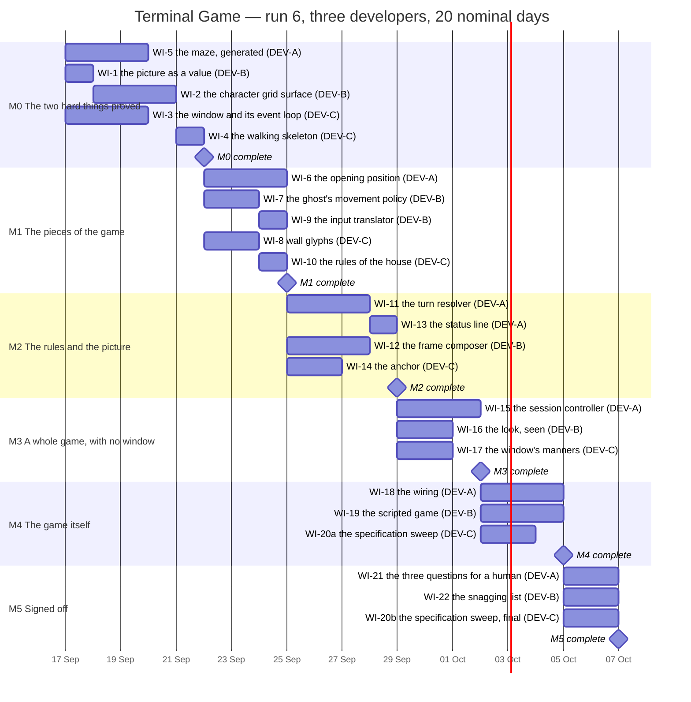

# Terminal Game — Implementation Plan

**For:** the three developers, and the conductor
**From:** the Technical Lead
**Inputs:** `docs/ARCHITECTURE.md`, `docs/FUNCTIONAL_REQUIREMENTS.md` (49 requirement codes)
**Run:** 6. The tree is bare — there is no application and no test suite. Everything below is built from nothing.

---

## 0. The four things you need before you touch anything

**This project runs with real pull requests. It is not local mode.** You push your own
branch to `origin`, open a **draft** PR as soon as you have a first commit, mark it ready
when your suite is green, **merge your own PR**, and then confirm `main` is still green.
The technical lead merges nothing on this run. `gh pr merge` runs on the server, so you
never need `main` in your working tree — and you must never check it out.

**There are three developers**, referred to throughout as **DEV-A**, **DEV-B** and
**DEV-C**. Every effort total and every boundary in the chart in section 9 rests on that
number.

**Branch names all begin `r6/`.** See section 2 — this is not cosmetic, it is how we
avoid colliding with fourteen branches left on `origin` by run 5.

**The runtime is `/usr/bin/python3`, version 3.9.6, standard library only.** See section
3. Typing `python3` may get you a different interpreter that cannot run this application
at all.

---

## 0a. Amendment 1 — recorded after M0, read it before your next work item

M0 landed. `origin/main` carried **282 tests, 0 failures, 0 skips** on the pinned command.
The counts reconcile exactly across the landings — 45 + 68 + 54 = 167, then +61 for WI-2,
then +54 for WI-6 — which is itself worth saying, because it means nobody retyped a number.

Five items were created that are not in this plan: **WI-5a** (collapse two root packages to
one), **WI-3a** (flatten WI-3's tests to the convention everyone else used), **WI-2a** and
**WI-3b** (completion records), and a WI-5a log closeout. **All five are approved,
retrospectively.** Each conformed its own author's files to something already landed,
touched nobody else's files, and merged green. No arbitration was needed and none was
asked for, which is the right outcome.

The cause is worth naming plainly. WI-1 landed a root package spelled one way and WI-5
landed one spelled another, so `main` briefly carried two. Neither imported the other, so
the suite stayed green — which is exactly why nobody noticed. **That is the honest cost of
leaving names to you rather than to me, and I am not taking that decision back**; it is
still the right call, and DEV-A's fix (conform *your own* files to what landed first) was
the right instinct. What follows makes that instinct a convention instead of a piece of
luck, and adds one line to a guard that has not been written yet so the machine catches it
next time.

**The five approved items deliberately do not get bars** in the chart in section 9. They
are landed and retrospective; the chart is a forward schedule, and back-filling completed
conforming branches into it would make every effort total disagree with the table for no
reader's benefit. The schedule below is unchanged: 22 work items, 23 bars, 50 developer-days.

Three of the risks in section 12 are **retired by measurement**, not by assertion, and the
table there now says so. Two Tk 8.5 behaviours discovered during WI-3 are carried into
WI-15 and WI-17, where they change what those items have to build.

---

## 0b. Amendment 2 — a correction to amendment 1, and the most valuable finding of the run

M0 is complete. `main` green at `4dfd4eb` with **324 passed, 0 failed, 0 skipped**.

**First, a correction, and the error is mine.** Amendment 1 said, in the risk table, that
"neither `tkinter` nor `_tkinter` is in `sys.modules` after the whole suite, so the no-window
rule holds by construction rather than by discipline." **That is false.** Exactly one test
module brings the toolkit in, and it **must** — it is the test that checks the real adapter
against the seam. A guard written to that wording would forbid the one test keeping the
adapter honest.

The measurement was not wrong. **It expired.** It was true on its branch at 04:40, and WI-3
landed the toolkit test at 04:40:24. What went wrong is that I restated a timestamped
observation as a standing property and then wrote a rule on it. **A measurement carries the
moment it was taken; a rule does not.** That is worth more than the correction itself: if a
relayed number is going to become a rule, the rule has to be re-measured at the moment it
lands, and that is on me, not on whoever measured it.

**The property that actually holds is stronger, and it is the one WI-10 guards:** *no Tk
interpreter is ever created by the suite* — `tkinter._default_root` is `None` after every
test module is imported, and only constructing one reaches the window server. Importing is
harmless; **constructing** is what puts a window on somebody's screen. WI-10's rule list in
section 8 is restated accordingly, and it now has **six** rules.

**Second, the finding that matters most so far.** Tk-internal focus is not enough to receive
a key: with the canvas focused but the window never force-focused, **no key event arrives at
all**. `q` is the only way out of a finished game (CTRL-4, END-6), so a window that opens
without OS keyboard focus is an unquittable game. **WI-3's tests passed and WI-3's probe
passed because neither ever pressed a key.** WI-4 caught it; no test in my plan would have.

That is a general failure, not a one-off, and section 4 now carries a standing rule about it
— *proved by a double is not proved* — together with the list of things this plan still owes
a real-medium exercise. I would rather spend a paragraph on that than find the same shape of
hole in WI-14 or WI-17.

Two deviations are **approved**: DEV-C's focus fix, landed on WI-3's adapter from WI-4's
branch, and the window's close button wired to end the session ahead of WI-17. Both are
DEV-C's own files in both directions, which is the whole reason they are approved — see
section 2. WI-17's scope shrinks accordingly.

And one ruling that is mine because it is a dependency direction: **nothing that is not a
test may depend on test code.** See section 1.

---

## 0c. Amendment 3 — two lane changes, and a new gap in the specification

WI-11 landed. `main` at `7eb6ff0`, **349 passed, 0 failed, 0 skipped**. Three of the six
critical-path items are done: WI-5, WI-6, WI-11.

**WI-13 moves from DEV-C to DEV-A.** It is one day, its dependencies landed, and DEV-A —
which holds the whole critical path — was idle waiting for it. The conductor was right to
ask rather than move it, and right about why: A7 confines the status-line literals to this
item, so who writes it is not a neutral choice. It moves anyway, and the confinement moves
with it, because **DEV-A already owns the outcome vocabulary** that WI-13 selects by. One
lane now owns the outcome, the status line and the session controller, and a cross-lane
conform disappears.

**WI-15 no longer depends on WI-12.** This is the change that actually unblocks the critical
path; moving WI-13 alone would not have, because WI-12 is gated on WI-8 and a fresh
developer has only just started it. The session controller is the **caller** of the
composer, and the caller's need defines the call: DEV-A writes WI-15 against a one-call
seam — a game state goes in, a frame comes out — and tests it with a fake. **WI-12
implements that seam**; its own tests still own everything about what the frame looks like,
so nothing is asserted twice. WI-15's dependencies are now **WI-9, WI-11 and WI-13**.

Two consequences worth stating. **WI-8 is now effectively on the critical path to WI-18**,
via WI-12 — DEV-C should know that. And if DEV-B finds the seam DEV-A defined is *wrong*
rather than merely differently spelled, that is the "conforming would change behaviour"
case in section 2: stop and settle it between you.

**A new gap in the specification, recorded as A8.** On the losing turn, is the dot the
player walked onto still eaten and still scored? As built: **CAUGHT, score 7 rather than
6.** Both readings satisfy END-3 literally. We proceed as built, and for a better reason
than a coin flip — see section 7. It lands in **WI-11**, which has already merged.

---

## 1. The architecture we are building, and why

### The ruling

**We are building CANDIDATE 2 — "Single-process windowed character grid".**

This is a **relayed ruling from the user**, not a decision taken here, and it **overrides
the architect's ranking**, which put candidate 1 first. It is the user's call to make and
it is settled; do not re-open it, and do not partially implement candidate 1 because a
piece of it looks easier.

### What that means in one paragraph

One process. The application creates and owns its **own native window**: it sets the
title, the size, the position and the background, and it closes that window itself when
the session ends. Inside the window it paints a **40-column by 30-row grid of characters**
in a fixed-width typeface on a black ground. The Application and Domain layers are exactly
as the architect described them for candidate 1 — the same Session Controller, Turn
Resolver, Maze Generator, Ghost policy and Game State — and they are pure: no clock, no
window, no randomness they were not handed. What is different is everything from the
Presentation layer down, and the absence of a second process.

### What candidate 2 buys, and what it costs

It buys three things. **WIN-3 stops being a caveat**: the process owns the window, so the
title is exactly what it says it is, with nothing composed around it. **The start-up race
disappears**: the window is the right size before the first frame is painted, so the
architect's caution C1 does not apply to us. And **no automation consent is needed**: a
process creating its own window asks nobody's permission.

It costs one large thing, and you must plan your time around it. In the architect's own
words, candidate 2 *"replaces a small amount of bought capability with a large amount of
built capability"*. Character cells, cell metrics, colour attributes, a repaint that does
not flicker, cursor suppression, timed input, and glyph alignment for the double-line
box-drawing characters are all now **code we write and get right**. Candidate 1 would have
received every one of them working, from a character-cell toolkit. That is why the first
iteration is what it is.

There is a second, quieter cost. **"40 characters wide and 30 rows deep" is now derived**
from font metrics rather than a property you set and read back, so a font substitution
silently changes it. WI-2 must pin the font by name and fail loudly if it is not there.

### The layer dependency rule — this one is fixed, and it is guarded

```
Shell  ->  Presentation  ->  Application  ->  Domain
```

- **Domain** names nothing above it. It imports no windowing toolkit, reads no clock, and
  creates no randomness — it is *handed* a random source and asked questions. This is what
  makes the maze, the ghost and every scoring and ending rule testable with no window.
- **Application** (Session Controller, Turn Resolver) may name Domain. It may not name
  Presentation or the Shell.
- **Presentation** (Frame Composer, Wall Glyph Resolver, Status Line, Input Translator)
  may name Application and Domain. **It may not import the windowing toolkit.**
- **Shell** (Window Owner, event loop, tick timer, key handler, character grid surface) is
  the only place the windowing toolkit may be named at all. **This is a rule about
  production code, not about tests** *(clarified in amendment 2)*: a test that checks the
  real adapter against the seam must import the toolkit, and is right to.

*Amendment 2 — one more direction, and it is the same kind of rule.* **Nothing that is not
a test may depend on test code.** Tests may reach anywhere; nothing may reach into them.
This came up because the walking skeleton imports the specimen picture from a test module —
the picture genuinely has two consumers, a test and a tool, and transcribing thirty rows
twice would be worse than the import. So the fixture is right to be shared and wrong to
live under `tests/`: **put it where both consumers can depend on it.** Exactly where is
DEV-B's call, as its own file, under the first-lander rule.

### The one seam I am fixing, because the whole test strategy hangs off it

**The frame is a value.** The Presentation layer does not draw. It *returns a picture*: a
pure 30-row by 40-cell structure where each cell carries a glyph and a named colour. The
Shell's surface is the only thing that turns that value into pixels.

Everything follows from this. The entire picture — every wall glyph, every dot, the draw
order that puts the ghost over the player, the status line, the right-hand margin — is
asserted in tests as **text**, with no window and no toolkit anywhere near the test. The
surface below the seam is the only thing that needs a window, and it is small.

**The automated suite must never construct a toolkit window.** Not once, not withdrawn,
not "just to check". Anything that has to appear on screen is a separate script a person
runs deliberately — see section 5.

### What is not fixed, and is yours

File names, module and package names, class and function names, which module a piece of
logic lives in, the internal interfaces between modules, where tests sit in the tree. You
are looking at the code; I am not. Settle those between yourselves. If a work item's
description and your better arrangement disagree, your arrangement wins and you say so in
your report — that is not a deviation needing a ruling.

---

## 2. How you work

### Branch naming — read this before your first push

Run 5 left **fourteen branches on `origin`**, all named `wi-N-...`:

```
wi-1-vocabulary-maze     wi-2-window-launcher    wi-3-glyphs-picture
wi-4-adapter-loop        wi-5-starting-a-game    wi-6-player-dots-endings
wi-7-ghost-policy        wi-8-window-robustness  wi-9-wire-the-game
wi-10-verification-pack  wi-10a-census-race      wi-12-final-gate
wi-12a-regate            wi-13-close-the-gaps
```

They have not been deleted and they are staying. Our work items are also numbered WI-1
upward, so an unprefixed `wi-1-...` push would collide with a stale branch or look like it
was resurrecting its history.

**Every run-6 branch is named `r6/<item>-<two-or-three-word-slug>`**, lower case, hyphens,
no underscores. For example:

```
r6/wi-1-picture-value      r6/wi-5-maze-generated      r6/wi-20a-spec-sweep
```

**Before your first push on any branch, confirm it does not already exist on the remote:**

```
git ls-remote --heads origin 'r6/wi-<n>-*'
```

Empty output means you are clear. **If a push is refused anyway, stop.** Leave the branch
where it is and report what was refused and what you were trying to do. Do not force, do
not rename around it, do not retry with different flags.

### Base, and stacked branches

Branch from **`main`** unless the work item's dependency row says otherwise. Two items in
this plan are stacked on a parent branch (WI-2 on WI-1; see the item). A stacked PR is
opened with `--base <parent-branch>`, says in its body which branch it is stacked on and
why, and is retargeted with `gh pr edit <n> --base main` once the parent merges.

### Pull requests

```
gh pr create --draft --base main --title "WI-3: the window and its event loop" \
             --body-file docs/prs/PR-WI-3-window-event-loop.md
# ... keep pushing; the PR updates itself ...
gh pr edit <n> --body-file docs/prs/PR-WI-3-window-event-loop.md
gh pr ready <n>
gh pr merge <n> --merge
git fetch origin && git merge origin/main     # then run the whole suite again
```

Merge **only your own** PR, and only when your suite is green. After merging, bring `main`
to your branch as above and run the whole suite: a PR that merges cleanly can still break
`main` when it lands beside something merged since it was opened.

Start every commit subject with the work item code: `WI-3: ...`.

### Where documents go

Four paths, exactly these shapes, no fifth:

| Path | One per | Example |
| --- | --- | --- |
| `docs/prs/PR-<ITEM>-<slug>.md` | work item | `docs/prs/PR-WI-3-window-event-loop.md` |
| `docs/completions/COMPLETION-<MILESTONE>-DEV-<X>.md` | lane, per iteration | `docs/completions/COMPLETION-M2-DEV-B.md` |
| `docs/progress/<branch-name>.md` | branch | `docs/progress/r6-wi-3-window-event-loop.md` |
| `docs/findings/<ITEM>-<slug>.md` | measurement worth keeping | `docs/findings/WI-2-cell-metrics.md` |

The progress log is named after the branch with the slash flattened to a hyphen, so that
two worktrees never write the same file.

### Shared vocabulary: the first-lander rule *(added in amendment 1)*

Three lanes working from the same tree will sometimes both need a name that neither of them
owns — a package root, a direction, an outcome, a test helper for building a maze by hand.
When that happens:

1. **The first spelling to land on `main` wins.** Not the better one, not the one argued
   for best — the one that landed first. This is arbitrary on purpose, because any rule that
   requires judgement requires a conversation, and the conversation costs more than the
   name is worth.
2. **The later lane conforms its own files**, in a small branch named after its parent item
   with a letter suffix (`r6/wi-5a-package-name` is the model), says in the PR body what it
   is conforming to and why no arbitration was needed, and **never edits the earlier lane's
   files**.
3. **If conforming would change behaviour rather than spelling, it is not a conforming
   change.** Stop and take it to the other developer. That is a design disagreement, and
   section 2's conflict rules apply.
4. **Announce anything another lane will obviously need.** If you land a vocabulary, a seam,
   or a test helper that somebody else is going to want, say so in the first line of your PR
   body and put a `NOTE` line in your progress log naming it. The next lane should be able
   to find it by grepping, not by inventing it a second time.

**Fixing a landed item from a later item's branch** *(added in amendment 2)*. M0 did this:
a defect in WI-3's adapter was fixed on WI-4's branch, and the window's close button was
wired ahead of WI-17. **Both approved** — and the reason is the same one as above:
**DEV-C owned WI-3, WI-4 and WI-17, so in every direction it was editing its own files.**
Blocking a correct fix on the ceremony of which branch it belongs to serves nobody, and
DEV-C was right to flag the route as irregular rather than let it pass unremarked.

The general rule, so nobody has to guess next time:

- **Your own landed files, small fix, on the branch you are on: do it**, say so in the PR,
  and note that it changes an item somebody has already read.
- **Another developer's landed files: never.** Tell them, and let them fix it. Even when
  you are sure, and even when it is one line.
- **Anything that changes what a later item is for, rather than repairing what an earlier
  one did**, comes to me before it lands.

A conforming change or a document `developer.md` already requires does not need a *new*
work item in this plan — but giving it a suffixed code, as M0 did, makes it traceable and
is welcome. Report it as an additive deviation either way.

**Who owns what, where two items in this plan will meet.** These are ownership calls, not
design calls; the owner decides the spelling and the other lane conforms.

| Shared thing | Owner | Who conforms |
| --- | --- | --- |
| The root package and the tree's shape | settled by WI-5a | everybody |
| The maze and every query asked of it | DEV-A (WI-5) | WI-7, WI-8, WI-12 |
| The random-source seam | DEV-A (WI-5, landed) | **WI-7** takes the same shape; do not invent a second one |
| Directions and headings | DEV-B, in whichever of **WI-7** or **WI-9** lands first | WI-11, WI-15 |
| A test helper that builds a maze from an ASCII picture | whichever of WI-7 / WI-8 needs it first, announced per rule 4 | the other |
| Wall glyphs and the connector rule | DEV-C (**WI-8**) | WI-12 declares none of them |
| The dot glyph and the two actor motifs | DEV-B (**WI-12**) | WI-8 declares none of them |
| The outcome vocabulary — playing, caught, cleared | DEV-A, wherever it landed (WI-6, else WI-11) | **WI-13** selects by it and does not define it |
| The clock seam and the headless session | DEV-A (**WI-15**) | **WI-19** consumes it and builds no second one |
| The frame value and the colour vocabulary | settled by WI-1 | everybody |

### When your branch conflicts with main

It is yours to resolve, with the other developer, not through me. `git merge main` (never
rebase), read both sides, run the **whole** suite, and record what conflicted and how you
resolved it with a `NOTE` line. If the two of you find you disagree about something real —
where a responsibility belongs, which interface survives — escalate *that*, named plainly.
Section 10 tells you which pairs of items are most likely to meet.

---

## 3. The runtime, and the suite

### The interpreter is pinned, and pinned by absolute path

Measured on this machine while writing this plan:

| What was run | Result |
| --- | --- |
| `/usr/bin/python3 --version` | `Python 3.9.6` |
| `/usr/bin/python3 -c "import tkinter"` | OK — Tk 8.5, Tcl 8.5 |
| `/opt/homebrew/bin/python3 --version` | `Python 3.14.7` |
| `/opt/homebrew/bin/python3 -c "import tkinter"` | `ModuleNotFoundError: No module named '_tkinter'` |
| `which -a python3` | `/usr/bin/python3`, then `/opt/homebrew/bin/python3` |
| `python3 -m pytest --version` | `No module named pytest` |

**Use `/usr/bin/python3`, written out in full, in every command, script shebang and
document.** The other interpreter on this machine has no windowing toolkit at all, and a
developer who picks it up will watch the entire Shell layer fail to import for a reason
that has nothing to do with their code.

The conductor measured this independently in the default shell you will be given: there,
`which python3` already resolves to `/usr/bin/python3`, Python 3.9.6, with `import tkinter`
reporting Tk 8.5, and no homebrew interpreter shadowing it. So the hazard does not bite by
accident — it bites only if you invoke some other interpreter on purpose. Pin the absolute
path anyway; the symptom is a bad one to debug from cold.

**Language level: Python 3.9.** No structural pattern matching, no `int | None` in runtime
positions, no `dataclass(slots=True)`. Use `from __future__ import annotations` if you
want the newer annotation spellings.

**Standard library only. No third-party packages, no `pip install`, no network.** The
windowing toolkit is the one the standard library ships; nothing else is available offline
on this machine, and adding a dependency is not a decision for a work item.

### The suite command is pinned

Run from the repository root:

```
/usr/bin/python3 -m unittest discover -t . -s . -p "test_*.py"
```

Verified to run in the bare tree (`Ran 0 tests ... OK`). Whatever test layout you choose —
that is yours — it must make this exact command find every test. **Report counts from this
exact command**, quoting the command alongside the numbers. Never "tests pass". A number
without the command that produced it is a number somebody retyped.

`unittest` is the runner because pytest is not installed and we are not installing it.

---

## 4. Standing constraints — these apply to every work item

### Do not try to prove that a test can fail

**This is a prohibition, not a preference.** You must not deliberately break working code
to watch a test go red — not as a mutation check, not as a sweep, not as a one-off. Do not
write tooling for it. No mutation table, no verification item that re-runs one. If you
find yourself editing correct code so that something fails, stop.

Write tests that assert the **consequence**: what the function returned, what the state
became, what the picture says. A test coupled to real behaviour does not need proving. If
you doubt a test, **say so** in your progress log and your report, naming it and why.

### Assert the seam, not both sides of it

When you wire two units together, the wiring test owns the join and nothing else. If the
lower unit already has a unit test for a behaviour, the integration test must not repeat
it. One defect should turn one test red, not fifteen across four files.

### There are no images — this is now a rule, not a fact (caution C5)

In candidate 1 the medium made SCRN-2 impossible to break. On a graphical surface nothing
stops a later developer drawing a picture. **Everything on screen is a character in a
cell.** No image objects, no bitmaps, no photo images, no line or rectangle primitives
standing in for glyphs. WI-10 builds an automated guard for this; until it lands, it is on
your conscience.

### Proved by a double is not proved *(added in amendment 2)*

Most of the Shell's tests in this plan run against a recording double, because the suite
must never construct a window. That is the right trade and it stays. But it has a cost that
M0 made concrete: **WI-3 passed its tests and passed its own probe, and neither ever pressed
a key.** With the canvas focused but the window never force-focused, Tk delivers no key
event at all — so the item was green, and the game would have been unquittable. WI-4 caught
it by accident. Nothing in my plan would have caught it on purpose.

So, for every item that touches the Shell:

1. **Name, in your PR body, the one thing you exercised against the real toolkit, and what
   you observed.** Not "I tested it" — the command, and the observation. If the honest
   answer is "nothing; it is all doubles", write that. It is a useful sentence and somebody
   will act on it.
2. **The exercise must do the real thing, not stand next to it.** A probe that opens a
   window and never presses a key does not prove keys arrive. A test that asserts something
   raised does not prove the window got reaped, if the toolkit swallows the exception.
3. It is a bounded, self-closing script obeying the rules below — never part of the suite.

**What this plan still owes a real-medium exercise.** These are the places where the same
hole could be hiding, named now rather than found later:

| Owed | Where it lands |
| --- | --- |
| A real key press reaching a real window, and being acted on | **WI-17**, and again in the finished game at **WI-21** |
| A real exception inside a real `after()` callback, with the window confirmed reaped | **WI-17** — Tk swallows it, so a double will happily report success |
| The real anchor query, on this machine, confirmed not to raise a permission prompt | **WI-14** — a stub cannot prove the absence of a dialog |
| A real `q` and a real close button ending the process with no orphan left behind | **WI-17**, confirmed at **WI-21** |
| The real surface painting the real glyphs at the right cells | **WI-16**, by eye — this one is honestly only ever provable by a person |

### If your work puts a window on the user's screen

A real person is sitting in front of that screen with a live monitor open.

- **The automated suite never opens a window.** Any on-screen check is a separate script,
  run deliberately, never discovered by `unittest`.
- **Every such script must end by itself.** A hard self-quit after a bounded number of
  seconds, or a `q` path the script drives. Never launch something that blocks forever.
- **Let the process exit, confirm it has exited, then close anything left.** Never close a
  window whose process is still alive.
- **Only ever act on a handle captured at the moment of creation.** Never "the front
  window", never by title.
- **Reap on the failure path too.** If your work item ends early — blocked, timed out,
  interrupted — kill what you started first.

A window left holding a live process raises a modal dialog only the user can dismiss, and
that blocks every later scripted call in the run.

---

## 5. The picture, measured

These are measurements taken from the specimen picture in `FUNCTIONAL_REQUIREMENTS.md`
while writing this plan, not readings of prose. They are normative for WI-1, WI-8 and
WI-12. (The architect's assumption **A6** — that the specimen picture is normative for the
grid-to-screen mapping — is carried unchanged; these numbers are what it amounts to.)

| Measured | Value |
| --- | --- |
| Rows in the picture | 30 — rows 0–28 maze, row 29 status line (SCRN-1) |
| Width of every maze row | **exactly 37 characters** |
| Grid | 19 squares across, 29 deep (MAZE-1); one grid row is one screen row |
| Mapping | square *c* is drawn at **column 2c** — columns 0, 2, … 36 |
| Odd columns | **connectors**, holding only a space or the horizontal wall glyph `═` |
| Right-hand margin in a 40-column window | **3 columns** (37 … 39) |
| Dot | `▪` U+25AA |
| Lone wall square (no wall neighbour) | `■` U+25A0 |
| Player | `▐█▌` — U+2590 U+2588 U+258C, **three columns**, centred on its square's column |
| Ghost | `▗█▖` — U+2597 U+2588 U+2596, **three columns**, centred on its square's column |
| Wall glyphs seen in square columns | `═ ║ ╔ ╗ ╚ ╝ ╠ ╣ ╦ ╩` (and `╬` for a crossing, which the specimen happens not to contain) |

Two consequences worth stating plainly, because both are easy to miss and expensive to
retrofit:

1. **The actors are three columns wide** and overwrite the connector column on each side.
   That is safe: a connector adjacent to a corridor square is always blank, because `═`
   appears only between two horizontally joined wall squares.
2. **Draw each cell at its own computed position**, rather than drawing whole rows as
   strings. The picture must be correct cell by cell whatever a glyph's natural advance
   width happens to be. This is the mitigation for the glyph-alignment risk candidate 2
   carries, and it costs nothing to do from the start.

---

## 6. Assumptions carried, none of them answered

**Every one of these is an assumption, not a ruling.** The user has ruled on the
architecture candidate, the mode, the team size and the scope — nothing else. If an answer
arrives later, the "rests on it" column is the complete list of places to change.

| # | Assumption we proceed on | Rests on it |
| --- | --- | --- |
| **A1** | The titlebar of the running game window will read exactly *Terminal Game*. In candidate 2 the process sets its own title and nothing composes around it, so this largely resolves itself — but nobody has looked at a titlebar yet. | **WI-3**'s titling; the human look in **WI-4**, confirmed in **WI-21** |
| **A2** | *"Whatever window the player was last looking at"* means the frontmost window the game can see **without asking for Accessibility permission**, with a fixed screen offset as the fallback. The general case needs a permission only the user can grant. **This caveat survives from candidate 1 unchanged.** | **WI-14** alone |
| **A3** | WIN-5's *"as soon as the game ends"* means **when the session ends, not when the outcome is decided**: outcome decided → final picture stands → player presses `q` → process exits → the window closes itself without the player closing it. **This is the load-bearing one, and it is a contradiction in the specification, not an ambiguity** — see section 7. | **WI-15** (the session controller) — *the single place to change* — plus the WIN-5, END-5 and END-6 rows of the sweep in **WI-20** |
| **A4** | *"Large enough to read comfortably"* is one named font-size constant, checked by eye. No objective test exists. | **WI-2**'s metrics constant; looked at in **WI-16** and **WI-21** |
| **A5** | The game may **not** create or modify a profile or anything else in the user's preferences. | Nothing: candidate 2 needs no profile, so the blast radius is empty. Recorded so an answer has somewhere to land. |
| **A6** | The specimen picture is normative for the grid-to-screen mapping. | Section 5, and through it **WI-1**, **WI-8**, **WI-12** |
| **A8** | *(Added in amendment 3.)* On the losing turn the dot under the player **is** still taken and still scored — the player is caught *and* the dot counts. Not a coin flip: **END-3's own wording presupposes it** — "*eating* the last dot on the square the ghost is standing on is a loss, not a win" says the eating happens and only the outcome changes. | **WI-11** alone, already landed. A reversal is a WI-11 follow-up branch, **never** a WI-15 change — scattering the step order is the exact failure caution C6 exists to prevent. |
| **A7** | The literal strings in STAT-2 and STAT-3 are normative; the specimen picture's leading space on row 29 is illustrative; the two STAT-3 examples are reproduced as **per-ending templates** rather than by a column-alignment rule. (Mine, not the architect's — see section 7.) | **WI-13** and its tests |

---

## 7. Contradictions found while planning

Raised here rather than discovered by a developer in week three.

**C-1 — The architecture contradicts its own measurement about the maze width.**
`ARCHITECTURE.md`'s MAZE-1 coverage row says *"19 × 2 = 38 columns, leaving a 2-column
right-hand margin"*. Its own measurement V8, and mine, both give **37** columns per maze
row (19 squares × 2, less the final connector column), which leaves a **3-column** margin
in a 40-column window. Evidence: all 29 maze rows of the specimen picture are exactly 37
characters. **37 and a 3-column margin is what we build.** This is a correction to the
architecture, not an open question: the architecture's own measurement agrees with mine and
only its prose arithmetic is wrong. The conductor is carrying it to the user as a
correction.

**C-2 — WIN-5 contradicts END-5 and END-6 in the specification itself.** WIN-5 says the
window *"closes by itself as soon as the game ends"*; END-5 says *"the last picture stays
on screen"*; END-6 says *"`q` … is the only way to leave a finished game"*. All three
cannot hold on the literal reading of WIN-5. We proceed on **A3**. **It lands in WI-15**,
and nowhere else, so an answer costs one work item's worth of change.

**C-3 — STAT-2's literal disagrees with the specimen picture by one leading space.**
STAT-2 gives `score 0    arrows, q quits` — 26 characters, no leading space. Row 29 of the
picture is ` score 0    arrows, q quits` — 27 characters, with one. We take **A7**: the
STAT-2 literal is normative.

**C-5 — The specification never says whether the dot is eaten on the losing turn.**
*(Added in amendment 3, found by DEV-A while building WI-11.)* END-3 fixes that meeting the
ghost is *decided* first, and the step order move → collision → eat → win implements that.
But neither END-3 nor SCORE-1 says whether the dot under the player is still **taken** when
the player is caught on that square. You can decide the loss first and still eat, or decide
the loss first and stop; both satisfy END-3 as written. It changes the number on the last
line the player ever sees. We proceed on **A8** — the dot is eaten — because END-3's own
phrasing, "*eating* the last dot … is a loss, not a win", only makes sense if the eating
happens. It lands in **WI-11**.

**C-4 — STAT-3's two examples cannot both come from one alignment rule.**
`CAUGHT  score 37   q quits` puts `q quits` at column 19; `CLEARED  score 274  q quits`
puts it at column 20. No single padding rule produces both. We take **A7**: two per-ending
templates, each reproducing its own example exactly, with the score substituted.

---

## 8. The work items

Effort is in **developer-days**, one developer working one day. Every item is covered by
tests, and the "tests must establish" line says what those tests own. Requirements listed
against an item are the ones it is **responsible for**; the full 49-row trace is section
11.

### M0 — *The two hard things proved*

The first iteration exists to prove the architecture, and candidate 2 has exactly two
things that could sink it: **the medium we now have to build**, and **the maze generator**
(the architect's caution C4, the single algorithm most likely to ship subtly wrong). Both
start on day 1, and by the end of the iteration a real window is on screen showing a real
picture, taking keys, ticking, and closing itself.

---

**WI-1 — The picture as a value** · DEV-B · **1 day** · depends on nothing ·
`r6/wi-1-picture-value`

*Outcome.* A pure, comparable value representing what is on screen: 30 rows of 40 cells,
each cell a glyph and a colour drawn from a closed vocabulary (blue walls, dim gold dots,
bright yellow player, pink ghost, cyan status, black ground). It can be built, read, and
rendered to plain text so that every later picture test is a text comparison. It imports
nothing but the standard library and names no toolkit.

*Tests must establish.* That a frame is 30 × 40 and rejects being anything else; that a
cell out of range is refused rather than silently ignored; that two frames built the same
way compare equal and two that differ in one cell do not; that rendering to text
reproduces a known picture character for character, including trailing blanks in the
3-column right margin; that only colours in the closed vocabulary are accepted.

---

**WI-2 — The character grid surface** · DEV-B · **3 days** · depends on **WI-1** ·
stacked: `r6/wi-2-grid-surface` branches from `r6/wi-1-picture-value` ·
PR opened `--base r6/wi-1-picture-value`, retargeted to `main` once WI-1 merges

*Outcome.* The one thing that turns a frame value into pixels. It measures the fixed-width
font's cell metrics, reports **how many pixels 40 × 30 cells need** (this is what makes
WIN-2 true), paints every cell at its own computed position on a black ground in the right
colour, shows no text caret ever, and repaints without flicker at the ghost's cadence. It
pins the font by name and **fails loudly** if that font is not present, because a silent
substitution silently changes the window's size. It draws characters and nothing else.

*Tests must establish.* That the pixel size reported for 40 × 30 is the cell metrics
multiplied out, and changes correctly if the metrics change; that painting a frame
produces one placement per non-blank cell, at the position the mapping says, in the colour
the cell says — asserted by **reconstructing the picture from what was recorded and
comparing it as text to the expected picture**, not by counting calls; that a repaint of
an unchanged frame produces the same picture; that a missing font raises rather than
substitutes; that no image, bitmap or geometric primitive is ever emitted. These tests run
with **no window**: the toolkit is stood in for by a recording double.

*Also produces.* `docs/findings/WI-2-cell-metrics.md` — the font chosen, its measured cell
width and height, the resulting window size in pixels, and whether the double-line
box-drawing glyphs and the block glyphs render at the right advance width. This is the
measurement the whole of candidate 2 rests on; write it down.

---

**WI-3 — The window and its event loop** · DEV-C · **3 days** · depends on nothing ·
`r6/wi-3-window-event-loop`

*Outcome.* The process's own native window: created at a pixel size it is **told**, titled
*Terminal Game*, black, not resizable, placed at a fixed screen offset for now (WI-14
replaces that with a real anchor). A repeating timer at the ghost's cadence — about seven
times a second — and raw key events, both delivered to a collaborator it is given. A way
to end the session that stops the timer, closes the window and lets the process exit,
cleanly, exactly once, on the failure path as well as the success path.

*Responsibility boundary with WI-2 — read this, the two items run side by side.* **WI-3
owns the window, the timer and key delivery. WI-2 owns everything inside the pixels.** The
surface tells the window owner how many pixels it needs; the window owner tells the
surface nothing about the game. Neither reaches into the other. Agree the exact shape of
that one call between yourselves before either of you writes it.

*Tests must establish.* That the timer's configured interval is the ghost's cadence and
that each expiry delivers exactly one tick to the collaborator; that a key event is handed
on unchanged and un-echoed; that ending the session stops the timer before it closes the
window, closes the window once, and is safe to call twice; that an exception raised by the
collaborator still reaps the window. Again: **no window in these tests** — the toolkit is a
recording double.

---

**WI-4 — The walking skeleton** · DEV-C · **1 day** · depends on **WI-2**, **WI-3** ·
`r6/wi-4-walking-skeleton`

*Outcome.* The end-to-end proof that candidate 2 works: a runnable script that opens the
real window, paints **the specimen picture from the requirements** through the real
surface, logs the ticks arriving and the arrow keys pressed, and closes the window and
exits when `q` is pressed or after a bounded number of seconds, whichever comes first. It
is not part of the suite; it is run deliberately, and it obeys every rule in section 4.

*Tests must establish.* That the assembled skeleton wires the surface to the window and
the key events to the logger — **the join only**; what the surface and the window do is
already owned by WI-2 and WI-3. The visual proof is not a test, it is the human check
below.

*Also produces.* `docs/findings/WI-4-first-window.md` — what the window actually looked
like, and **what the titlebar read**. This is the architect's caution C2: get the WIN-3
question in front of the user early, on day 5, not in week three.

---

**WI-5 — The maze, generated** · DEV-A · **3 days** · depends on nothing ·
`r6/wi-5-maze-generated`

*Outcome.* A 19 × 29 grid of wall and corridor, laid out at random from a random source it
is **handed** (never `random` reached for globally, never a clock), with a solid wall right
around the outside, corridors one square wide running only north–south and east–west, **no
dead ends** — every corridor square has at least two corridor neighbours — and **every
corridor square reachable from every other**. Plus the queries the rest of the system will
ask of it: is this square a wall, what are this square's corridor neighbours. DEV-A owns
that query surface; other developers who need a new query ask for it rather than adding
it.

The architect's caution C4 applies in full: the obvious generators produce dead ends in
quantity, so expect **carve, then repair, then verify** — and verify before handing the
maze out, not after.

*Tests must establish.* Over **many seeds**, not one: that the border ring is solid on all
four sides; that no corridor square has fewer than two corridor neighbours; that a flood
fill from any corridor square reaches every corridor square; that the grid is 19 × 29 and
every square is one of exactly two kinds; that the same seed twice gives the identical
maze and two different seeds give different mazes; that no corridor is two squares wide
and no corridor runs diagonally. Assert the properties of the grid, not the steps the
algorithm took.

---

### M1 — *The pieces of the game*

Four independent pieces, and the guard that keeps the layers honest. Nothing in this
iteration opens a window.

---

**WI-6 — The opening position** · DEV-A · **3 days** · depends on **WI-5** ·
`r6/wi-6-opening-position`

*Outcome.* The game's state at the moment the window opens, and the vocabulary for
carrying it: a maze, a dot on **every corridor square except the player's start square**,
the player on the corridor square **nearest the middle of the grid**, the ghost on the
corridor square at the **greatest straight-line grid distance** from the player —
explicitly *not* corridor distance — and a score of zero which can only ever rise. Plus
the dot field's behaviour: taking a dot removes it permanently, and a square whose dot has
gone reports no dot.

*Tests must establish.* That the player's start square is a corridor square and that no
other corridor square is closer to the grid's centre; that the ghost's start square is a
corridor square and that no other corridor square is further by straight-line distance;
that the two start apart; that the dot count equals the corridor count minus one and the
player's square has none; that taking a dot twice yields a dot once; that the score
starts at zero and exposes no way to decrease.

---

**WI-7 — The ghost's movement policy** · DEV-B · **2 days** · depends on **WI-5** ·
`r6/wi-7-ghost-policy`

*Outcome.* A pure function of the maze, the ghost's square and its heading: **carry
straight on while the corridor allows it**; where it cannot, choose **uniformly at random
among the other ways on**; **turn back the way it came only when there is no other
choice**. It is handed a random source. **The player is not a parameter** — it cannot hunt
even by mistake — and it never touches the dot field.

*Amendment 1.* The random-source seam already landed with WI-5; **take its shape rather
than inventing a second one**. WI-7 or WI-9, whichever lands first, also settles the
direction and heading vocabulary for the whole project — announce it per the first-lander
rule, because WI-11 and WI-15 will both conform to it.

*Tests must establish.* On hand-built mazes: that in a straight corridor it continues,
every time, for many draws; that at a T-junction it never chooses the square it came from
while another exit exists; that in a dead end — which the real generator will not produce,
but the function must still be total — it reverses; that over many draws at a junction with
two onward exits both are chosen and roughly evenly; that the same seed gives the same
walk. Its signature carries no player.

---

**WI-8 — Wall glyphs** · DEV-C · **2 days** · depends on **WI-1**, **WI-5** ·
`r6/wi-8-wall-glyphs`

*Outcome.* A pure function from a wall square's four neighbours to the glyph that square is
drawn as: the double-line corners, tees, crossings and straights that join up neatly, and
the **lone blue block** `■` when the square has no wall next to it. Plus the rule for the
connector column between two horizontally joined wall squares. All of it blue.

*Amendment 1.* **WI-8 owns every wall glyph and the connector rule; WI-12 declares none of
them, and WI-8 declares neither the dot nor the actor motifs.** If either item needs a test
helper that builds a maze from an ASCII picture, whichever of WI-7 and WI-8 needs it first
lands it and announces it; the other uses it.

*Tests must establish.* All sixteen neighbour combinations, each mapped to its glyph, named
in the test so a reader can check them against the specimen picture; that a wall square
with no wall neighbours is the lone block; that the connector between two horizontally
joined wall squares is the horizontal glyph and is blank in every other case; that walls on
the border ring resolve to the glyphs the specimen picture shows at the corners and edges.

---

**WI-9 — The input translator** · DEV-B · **1 day** · depends on **WI-1** ·
`r6/wi-9-input-translator`

*Outcome.* Raw key events become intents: the four arrow keys become Move up, down, left
and right; `q` **and** `Q` become Quit; **every other key is discarded** and nothing is
echoed anywhere.

*Tests must establish.* Each of the four arrows maps to its own direction; `q` and `Q` both
map to Quit; a representative spread of other keys — letters, digits, space, return,
escape, function keys, modified keys — all map to nothing; nothing in the translator can
produce output of any kind.

---

**WI-10 — The rules of the house, enforced** · DEV-C · **1 day** · depends on **WI-2**,
**WI-5** · `r6/wi-10-house-rules`

*Outcome.* An automated guard, part of the ordinary suite, that fails when the architecture
is violated. **Six rules, restated in full in amendment 2** — read this list rather than the
original three, which amendment 1 got partly wrong:

1. **No production code below the Shell names the windowing toolkit.** *Production code
   only.* A test that checks the real adapter against the seam must import the toolkit, and
   must not be caught by this rule.
2. **The Domain names nothing above it**, reads no clock, and reaches for no global random
   source.
3. **Nothing anywhere draws an image** — no image or bitmap objects, no geometric primitives
   standing in for glyphs. Caution C5; this is the price candidate 2 pays for SCRN-2.
4. **There is exactly one root package.** *(Amendment 1.)* In M0 two landed within hours of
   each other and the suite stayed green, because neither imported the other. This rule
   would have caught it the moment it landed.
5. **The suite never constructs a Tk interpreter.** `tkinter._default_root` is `None` after
   every test module has been imported. *(Amendment 2, replacing a wrong rule.)* Amendment 1
   asserted the suite never *imports* the toolkit; that was measured true on a branch and
   became false 24 seconds later when WI-3 landed its adapter test. **Guard construction,
   not import** — importing is harmless, constructing is what reaches the window server, and
   a rule on importing would forbid necessary work.
6. **Nothing that is not a test depends on test code.** *(Amendment 2.)* Tests may reach
   anywhere; nothing may reach into them.

Rule 5 is the one to write carefully. It is also the one that shows why this item exists: a
rule nobody can violate by accident is worth a line of code, and a rule stated wrongly is
worse than no rule, because it fails honest work.

This is an architecture guard. It is not a duplicate of any other test and it does not fall
under the "assert the seam" rule.

*Tests must establish.* That the guard actually inspects the whole tree and not an empty
set — it must fail if it finds nothing to inspect, so it can never pass vacuously; that
each of the six rules is reported separately and names the offending place; that the
current tree satisfies all six. For rule 5 specifically: that the check would notice a
constructed interpreter, and that it does **not** fire on a module that merely imports the
toolkit — the adapter's own test must keep passing.

---

### M2 — *The rules and the picture*

The fixed rule order, and the whole picture composed from a game state. Still no window.

---

**WI-11 — The turn resolver** · DEV-A · **3 days** · depends on **WI-6**, **WI-7** ·
`r6/wi-11-turn-resolver`

*Outcome.* **One named, readable place** holding the fixed order in which the rules of a
turn are applied. On a player move: is the target a wall — if so **nothing happens at all**,
no state change; otherwise **move**, then **test collision**, then **eat**, then **test the
win**. On a tick: move the ghost, then test collision. Collision is always tested before
the win, which is what makes END-3 true. The player moves exactly one square per intent
and never drifts, because nothing can move them but an intent.

The architect's caution C6 is the point of this item: if the collision test ever migrates
into the movement code, END-3 breaks silently and both the losing and the winning case
still "end the game". **Keep the order in one place a reader can see at a glance.**

*Amendment 3 — A8 lands here, and nowhere else.* The specification never says whether the
dot under the player is still taken when the player is caught on that square
(contradiction C-5). **It is taken, and it scores**: a loss on a dotted square reads
`CAUGHT  score 7`, not 6. The reason is textual rather than arbitrary — END-3 says
"*eating* the last dot on the square the ghost is standing on is a loss, not a win", which
only parses if the eating happens and only the outcome changes. Assert that case directly.
**If the user rules the other way, it is a WI-11 follow-up branch, never a change in
WI-15** — moving the step order out of this item is precisely the failure caution C6 warns
about.

*Tests must establish.* A move into a wall changes nothing — not the square, not the score,
not the dot field, not the outcome; a move onto a dotted square eats the dot exactly once
and adds exactly one to the score; a move onto an already-eaten square scores nothing; a
move onto the ghost's square is a loss; **eating the last dot on the square the ghost is
standing on is a loss and not a win** (END-3, asserted directly); eating the last dot
anywhere else is a win; the ghost moving onto the player is a loss; the ghost never changes
the score or the dot field; after an outcome is set, applying another move changes nothing.

---

**WI-12 — The frame composer** · DEV-B · **3 days** · depends on **WI-1**, **WI-6**,
**WI-8** · `r6/wi-12-frame-composer`

*Outcome.* A game state becomes rows 0–28 of a frame value: 37 columns of maze — square
*c* at column 2c, connectors in the odd columns — and a **blank 3-column right margin**.
Dots as the dim gold `▪`, one to a corridor square; the player as the three-column bright
yellow `▐█▌`; the ghost as the three-column pink `▗█▖`; **the player painted first and the
ghost second**, so that on a loss the ghost covers the player and the final picture shows
what happened. The ghost is drawn over a dot without disturbing it. It places row 29
exactly as the status line hands it over and writes nothing there itself.

*Responsibility boundary with WI-13 — the two run side by side.* **WI-13 owns row 29 and
produces it as a value. WI-12 owns rows 0–28 and places whatever row 29 it is given.**
Neither writes into the other's rows.

*Tests must establish.* A small hand-built maze composes to a known picture, asserted as
text; every maze row is 37 characters with three blank columns after it; the actors sit at
column 2c and occupy 2c−1 … 2c+1; a dot under the ghost is still in the dot field after
composing; when the player and ghost share a square the ghost's glyph is what appears; an
eaten square shows blank, not a dot; the colours are the ones the requirements name.

---

**WI-13 — The status line** · **DEV-A** *(moved from DEV-C in amendment 3)* · **1 day** ·
depends on **WI-1**, **WI-6** · `r6/wi-13-status-line`

*Outcome.* Row 29, in cyan, and **nothing else on that row ever**. Three formats, taken as
literal templates with the score substituted (assumption A7, contradictions C-3 and C-4):

- while playing — `score 0    arrows, q quits`
- on a loss — `CAUGHT  score 37   q quits`
- on a win — `CLEARED  score 274  q quits`

> **This is where the status-line contradictions land.** Contradictions **C-3** (the
> specification's STAT-2 literal disagrees with its own specimen picture by one leading
> space) and **C-4** (STAT-3's two examples cannot both come from one alignment rule) are
> resolved here under assumption **A7**, and nowhere else. **No other work item and no other
> developer's tests may contain a status-line literal** — WI-12 places row 29 as a value and
> never composes its text. If the user rules differently, the change is these three
> templates and this item's tests. One place, not a hunt across three developers.

*Amendment 1, revised by amendment 3.* **WI-13 selects by the outcome vocabulary; it does
not define it.** DEV-A owns that vocabulary, and **as of amendment 3 DEV-A owns this item
too**, so the cross-lane conform this note existed to manage no longer exists. The
prohibition stands unchanged and is about the *item*, not the person: no other work item
and no other developer's tests may contain a status-line literal.

*Tests must establish.* That the playing line with score 0 is **character for character**
the STAT-2 literal; that the loss line with score 37 and the win line with score 274 are
character for character the two STAT-3 literals; that the score shown is the live score and
a three-digit score does not corrupt the line; that the row is 40 cells, cyan, and blank
past the text; that the ending shown is chosen by the outcome and there is no third ending.

---

**WI-14 — The anchor** · DEV-C · **2 days** · depends on **WI-3** ·
`r6/wi-14-window-anchor`

*Outcome.* WIN-4: the window appears **a little below and to the right** of the window the
player was last looking at, so it always lands somewhere visible. Under **assumption A2**:
use the frontmost window the game can see **without triggering a permission prompt**, and
fall back to a fixed screen offset when there is nothing to anchor to or the query fails.
**A permission dialog must never appear during a test**, and the game must still start
perfectly well when the query returns nothing.

*Tests must establish.* That given an anchor position the placement is that position plus
the offset; that a failed or empty query falls back to the fixed offset rather than raising;
that the query is attempted exactly once at start-up and never again; that a window placed
past the edge of the screen is brought back so it is visible. The query itself is stood in
for by a double — no real window, no real permission prompt, in the suite.

*Also produces.* `docs/findings/WI-14-anchor-query.md` — what the query actually returns on
this machine, and whether it prompted. Assumption A2 is the thing being measured.

*Amendment 2.* That findings document is not optional and it is not paperwork: **a stub
cannot prove the absence of a permission dialog.** Per section 4, the real query must be
run for real, once, and what happened written down. WI-3 is the cautionary case — green
tests, passing probe, and a defect that only a real key press could have found.

---

### M3 — *A whole game, with no window*

The session comes together, and the two shell items that finish the window's behaviour.

---

**WI-15 — The session controller** · DEV-A · **3 days** · depends on **WI-9**, **WI-11**,
**WI-13** *(WI-12 dropped in amendment 3)* · `r6/wi-15-session-controller`

*Outcome.* Three states and no more: **Playing**, **Decided**, **Ended** — no restart edge,
no lives, no levels, no timer, no pause, because GAME-3 says so in as many words. In
Playing it hands Move intents to the turn resolver and ticks the ghost. The moment an
outcome is set it enters **Decided**: the ghost is no longer ticked, arrow keys do nothing,
the last picture stays exactly as it is, and the status line says which ending happened.
`q` is honoured in every state and is the **only** way out of a finished game; it takes the
session to Ended, at which point the process exits and — because the process owns its
window — the window closes without the player closing it.

**The game is under way the moment the window opens**: the first frame is composed and the
ticking has begun before control is handed to the event loop, and nothing has to be pressed
to begin.

**A whole session must be runnable with no window.** The controller is handed a clock, a
random source and a place to send frames; a test supplies fakes for all three. This is not
a convenience — WI-19 depends on it, and it is what keeps WI-18 and WI-19 out of each
other's way. **DEV-A owns this seam and WI-19 consumes it**; if it is not there, WI-19 will
build a second one and the two items will collide.

*Amendment 3 — this item no longer waits for WI-12.* The controller is the **caller** of the
composer, and the caller's need defines the call: define a one-call seam — a game state
goes in, a frame comes out — and test this item against a fake. **WI-12 implements that
seam** and its own tests keep owning everything about what the frame contains, so nothing
is asserted twice and the two items stay in different files. Announce the seam per the
first-lander rule the moment it lands. If DEV-B finds the seam is *wrong* rather than
differently spelled, that is section 2's "conforming would change behaviour" case: stop and
settle it between you, do not bring it to me as a merge conflict.

*Amendment 1 — a Tk 8.5 behaviour measured during WI-3 that changes what this item must
build.* **Tk swallows an exception raised inside an `after()` callback.** It goes to
`report_callback_exception`, a traceback is printed, and the main loop carries on. So an
error inside a tick will **not** propagate out of the run loop, and a session that relies on
letting it propagate will hang with a broken game on screen instead of shutting down. The
controller must route a failure to the same shutdown path `q` uses, deliberately, rather
than raising and hoping. Add a test for it: a tick that fails ends the session cleanly
rather than being silently absorbed.

> **This is where the WIN-5 / END-5 / END-6 contradiction lands.** Assumption **A3** is
> implemented here and nowhere else: the outcome is decided, the final picture stands, the
> player presses `q`, the process exits, the window closes itself. If the user rules the
> other way — the window closing the instant the outcome is decided — the change is to this
> item's Decided state and to the WIN-5, END-5 and END-6 rows of the sweep. One work item,
> not a hunt.

*Tests must establish.* That from a fresh start the state is Playing, a frame has already
been composed, and the ghost ticks without any key being pressed; that a tick in Decided
moves nothing and composes nothing new; that an arrow key in Decided changes nothing; that
`q` in Playing and `q` in Decided both reach Ended; that reaching Ended asks for the
session to be closed down exactly once; that the outcome recorded is the one the resolver
set and the status line shown matches it. The join to the resolver and to the composer is
asserted once each — what they produce is already owned by WI-11, WI-12 and WI-13.

---

**WI-16 — The look, seen** · DEV-B · **2 days** · depends on **WI-2**, **WI-4**, **WI-12** ·
`r6/wi-16-the-look-seen`

*Outcome.* The real colours and the real glyphs, painted by the real surface from frames
the real composer produced, looked at by a person. The blue double lines join up; the dots
are dim gold and the player bright yellow and the ghost pink and distinguishable by both
colour **and** outline; the status line is cyan; **the font size is settled** (assumption
A4) and written down as one named constant. A script, bounded and self-closing, obeying
section 4 in full.

*Tests must establish.* That the colour named for each kind of thing is the one the
requirements name, asserted on composed frames — the picture is already pinned by WI-12, so
this item's automated tests own only the colour vocabulary reaching the surface unchanged.
The rest of this item is a human looking at a screen, and that is the point.

*Also produces.* `docs/findings/WI-16-the-look.md` — the font size chosen, whether the
double-line glyphs join up cleanly at the chosen size, and whether the five colours are
distinguishable. If the box-drawing glyphs do not align, this is where we find out, and it
is the risk candidate 2 carries.

---

**WI-17 — The window's manners** · DEV-C · **2 days** · depends on **WI-3**, **WI-4**,
**WI-9** · `r6/wi-17-window-manners`

*Outcome.* The window behaves itself. It cannot be resized and the grid is never anything
but 40 × 30. **No text caret is ever visible.** Nothing typed is echoed anywhere — not into
the picture, not to a console (CTRL-5 at the shell level). The window closes **exactly
once** and leaves no orphan process behind, whether the session ended normally, was quit
with `q`, or fell over. Anything that opens a window reaps it on the failure path.

*Amendment 2 — this item's scope has changed, in both directions.* Two things it was going
to build **have already landed** from WI-4's branch and are approved: the window is
force-focused at start-up, and the window's own close button ends the session. **Verify
them rather than build them**, and say in your PR that you did.

But the focus fix arrived with a warning attached. With Tk-internal focus alone, **no key
event is delivered at all** — and WI-3 was green and its probe passed because neither ever
pressed a key. So this item now owes **real-medium exercises**, per section 4, and they are
the substance of it: a **real key press reaching a real window and being acted on**; a
**real exception inside a real `after()` callback with the window confirmed reaped**; and a
**real `q` and a real close button ending the process with no orphan**. A double will
cheerfully report success on all three. Bounded, self-closing scripts; record what you
observed in `docs/findings/`.

*Amendment 1 — two Tk 8.5 behaviours measured during WI-3, both of which land here.*
**`root.resizable()` with no arguments returns the string `'0 0'`, not a pair**, so
unpacking it raises — assert against the string, or pass arguments. And **Tk swallows an
exception raised inside an `after()` callback**: it reaches `report_callback_exception` and
the main loop carries on. This item's promise that "an exception during the session still
results in the window being closed" therefore cannot be built by letting an exception
propagate out of the loop; the failure path has to be wired explicitly, and the test has to
drive a callback that fails rather than asserting that something raised.

*Tests must establish.* That the window is configured non-resizable and that a resize
request does not change the grid; that no caret is ever enabled; that unmapped keys produce
no output of any kind; that closing twice is harmless and closes once; that an exception
during the session still results in the window being closed and the process exiting; that
the exit is clean — no lingering timer, no lingering callback.

---

### M4 — *The game itself*

---

**WI-18 — The wiring** · DEV-A · **3 days** · depends on **WI-4**, **WI-14**, **WI-15**,
**WI-16**, **WI-17** · `r6/wi-18-the-wiring`

*Outcome.* The game. One entry point: seed a random source, lay out a maze, build the
opening position, create the window at the anchor, size it from the surface's metrics, title
it, paint the first frame, start ticking, hand over to the event loop — and, when the
session ends, close the window and exit. Played end to end, by a person, from a single
command.

*Tests must establish.* **The join only** — that the entry point assembles the real
components and that starting it produces a first frame before the loop is entered, and that
ending the session closes the window. Everything below has its own tests; do not re-assert
any of it here. One defect should turn one test red.

---

**WI-19 — The scripted game** · DEV-B · **3 days** · depends on **WI-15** ·
`r6/wi-19-scripted-game`

*Outcome.* A whole game played **headless**, in the suite: a seeded maze, a fake clock, a
scripted sequence of key presses, and the frames asserted as text. At least a **win path**
— every dot eaten, the status line reading `CLEARED`, the ghost stopped, further keys doing
nothing, `q` ending it — and a **loss path** — the ghost and the player meeting, the ghost
drawn over the player, the status line reading `CAUGHT`. This is the whole-application test
and it never opens a window.

It uses the headless session WI-15 provides. **It does not assemble the shell** — that is
WI-18's, and keeping the two apart is what lets them run side by side.

*Amendment 1 — a property this item rests on, measured during WI-5.* Maze generation is
**independent of `PYTHONHASHSEED`**: an identical sha256 over 50 seeded mazes at hash seeds
0, 1, 12345 and twice at random. This item's asserted pictures only hold while that stays
true, and it is the kind of thing a later change quietly undoes by iterating a set. Pin it:
assert that a seeded game replays identically, and say in the PR body that the scripted
game depends on it.

*Tests must establish.* The two paths above, end to end, as sequences of asserted pictures;
that the score at the end equals the number of dots eaten; that END-3's precedence holds in
a full game and not only in the resolver's unit test — the last dot on the ghost's square
ends the game as `CAUGHT`; that nothing moves after the outcome is decided.

---

**WI-20a — The specification sweep, first landing** · DEV-C · **2 days** · depends on
**WI-15** · `r6/wi-20a-spec-sweep`

*Outcome.* A traceability document covering every requirement code landed by the end of M3:
the code, the work item, and **the named test that pins it** or the named human check that
must look at it. Where a requirement is covered only by a caveated assumption (WIN-2, WIN-4,
WIN-5, SCRN-2), the row says so and names the assumption. A requirement with no test and no
named human check is a finding, reported as one — not quietly ticked.

*Tests must establish.* That every requirement code in `FUNCTIONAL_REQUIREMENTS.md` appears
exactly once in the sweep, checked automatically rather than by eye, so the document cannot
drift out of step with the specification.

---

### M5 — *Signed off*

---

**WI-21 — The three questions for a human** · DEV-A · **2 days** · depends on **WI-18** ·
`r6/wi-21-human-questions`

*Outcome.* One script, bounded and self-closing and obeying section 4 in full, that shows
the finished game so that a person can answer the three questions nobody else can:

1. **Does the titlebar read exactly *Terminal Game*?** (A1 — the architect could not
   establish this, and in candidate 2 it should simply be true; confirm it.)
2. **Did the window land a little below and to the right of what you were last looking at,
   somewhere visible?** (A2)
3. **Is the type large enough to read comfortably?** (A4)

The answers are written down in `docs/findings/WI-21-human-answers.md`, with what was run
and what was seen. An unanswered question is reported as unanswered.

*Tests must establish.* That the script cannot run unbounded — it exits by itself within its
stated time even if nobody presses anything — and that it reaps its window on the failure
path. That is the part of this item a machine can check; the rest is a person looking.

---

**WI-22 — The snagging list** · DEV-B · **2 days** · depends on **WI-19**, **WI-20a** ·
`r6/wi-22-snagging-list`

*Outcome.* **Deliberate reserve capacity.** Defects found by the scripted game, the sweep
and the human checks get fixed here, in one branch, rather than being wedged into items
that were finished. If nothing is found, DEV-B is idle for these two days and that is a
good outcome, not a planning failure — but on a project that builds its own display medium,
something will be found.

*Tests must establish.* A test for each defect fixed, asserting the consequence that was
wrong, placed at the level that owns the behaviour. **Not a mutation of working code to see
a test go red** — that is prohibited.

*Coordination.* Because this item may touch anything, DEV-B agrees with DEV-A and DEV-C
what it is touching before it starts. See section 10.

---

**WI-20b — The specification sweep, second landing** · DEV-C · **2 days** · depends on
**WI-18**, **WI-19**, **WI-20a** · `r6/wi-20b-spec-sweep-final`

*Outcome.* The sweep completed against the wired game: the remaining codes traced, the four
caveated rows (WIN-2, WIN-4, WIN-5, SCRN-2) recorded with their assumption and the finding
that supports them, and the human answers from WI-21 cited by document name. The final
statement of what is proved, what rests on an assumption, and what is still open.

*Tests must establish.* The same automated completeness check as WI-20a, now over all 49
codes, plus that every finding and human-check document the sweep cites actually exists.

---

## 9. The schedule

### Iterations

| Iteration | Theme | Work items | Days | Ends day | Effort (dev-days) |
| --- | --- | --- | --- | --- | --- |
| **M0** | The two hard things proved | WI-1, WI-2, WI-3, WI-4, WI-5 | 1–5 | **5** | **11** |
| **M1** | The pieces of the game | WI-6, WI-7, WI-8, WI-9, WI-10 | 6–8 | **8** | **9** |
| **M2** | The rules and the picture | WI-11, WI-12, WI-13, WI-14 | 9–12 | **12** | **9** |
| **M3** | A whole game, with no window | WI-15, WI-16, WI-17 | 13–15 | **15** | **7** |
| **M4** | The game itself | WI-18, WI-19, WI-20a | 16–18 | **18** | **8** |
| **M5** | Signed off | WI-21, WI-22, WI-20b | 19–20 | **20** | **6** |
| | | **22 work items, 23 bars** | | | **50** |

*Amendment 3 rescheduled M2 onward.* Moving WI-13 into DEV-A's lane puts four days of work
in a lane during a three-day iteration, so **M2 is now four days and everything after it
shifts by one**: the schedule is **20 days**, not 19. I would rather the plan be a day
longer and true than the day shorter and wrong.

Three developers over 20 days is 60 developer-days of capacity; 50 are committed and 10 are
slack — M0 (4), M2 (3), M3 (2), M4 (1). The slack is real and deliberate — it is where the
dependency chain holds a lane back — and it is not to be filled by inventing work.

**The critical path** is now WI-5 → WI-6 → WI-11 → **WI-13** → WI-15 → WI-18 → WI-21:
**18 developer-days of chained work in a 20-day schedule**. It grew by one day on paper and
got materially shorter in practice, which is the point of the change: WI-15 used to wait on
WI-12, which waits on WI-8, which is in another lane and had to be restarted. It now waits
only on items DEV-A holds itself. **A chain that stays inside one lane beats a shorter chain
that crosses three.** Every item on the path is DEV-A's, which remains the project's single
biggest exposure.

### Per-developer lanes

| Iteration | DEV-A | DEV-B | DEV-C |
| --- | --- | --- | --- |
| **M0** (d1–5) | WI-5 (d1–3) | WI-1 (d1), WI-2 (d2–4) | WI-3 (d1–3), WI-4 (d5) |
| **M1** (d6–8) | WI-6 (d6–8) | WI-7 (d6–7), WI-9 (d8) | WI-8 (d6–7), WI-10 (d8) |
| **M2** (d9–12) | WI-11 (d9–11), **WI-13 (d12)** | WI-12 (d9–11) | WI-14 (d9–10) |
| **M3** (d13–15) | WI-15 (d13–15) | WI-16 (d13–14) | WI-17 (d13–14) |
| **M4** (d16–18) | WI-18 (d16–18) | WI-19 (d16–18) | WI-20a (d16–17) |
| **M5** (d19–20) | WI-21 (d19–20) | WI-22 (d19–20) | WI-20b (d19–20) |

### Gantt chart

The chart is **grouped by iteration**, one section per iteration, each bar labelled with the
work item code and the developer who owns it. Each iteration ends with a milestone carrying
the same code as the table above. Dates are **nominal consecutive days** starting at day 1
= 2026-09-17; they are the shape of the schedule, not a calendar commitment. A bar's length
in days is that item's effort in developer-days, and the bars in each section sum to that
iteration's effort total in the table.



Reconciling the chart against the table: M0's bars are 3 + 1 + 3 + 3 + 1 = **11**; M1's are
3 + 2 + 1 + 2 + 1 = **9**; M2's are 3 + 3 + 1 + 2 = **9**; M3's are 3 + 2 + 2 = **7**; M4's
are 3 + 3 + 2 = **8**; M5's are 2 + 2 + 2 = **6**. Total **50**, matching the table. The
milestone dates are the day after each iteration's last day, which is the same boundary the
table's "ends day" column gives: M0 day 5, M1 day 8, **M2 day 12, M3 day 15, M4 day 18, M5
day 20** *(shifted by amendment 3)*. WI-20 appears as two bars, WI-20a and WI-20b, because
it has two landings.

---

## 10. What can run side by side, and what would collide

For the conductor, who chooses what runs concurrently. In every iteration the three lanes
are meant to run at once; this section says where that is safe and where it is not.

| Iteration | Safe in parallel | The pair to watch, and why | How it is kept apart |
| --- | --- | --- | --- |
| **M0** | WI-5 (pure Domain) is disjoint from everything else in the run and can start immediately. WI-1 and WI-3 can start together. | **WI-2 and WI-3** — both are Shell work and both touch the windowing toolkit. Also **WI-1 must land, or at least be branchable, before WI-2 starts.** | The boundary in WI-3's entry: WI-3 owns the window, the timer and key delivery; WI-2 owns everything inside the pixels. WI-2 is **stacked on WI-1's branch** rather than waiting for it to merge. WI-4 follows both and is DEV-C's. |
| **M1** | WI-6 (DEV-A), WI-7 (DEV-B) and WI-8 (DEV-C) run at once; WI-9 and WI-10 are small and disjoint. | **WI-7 and WI-8** — both are *consumers of the maze* and both may want to add a query to it. | **DEV-A owns the maze's query surface.** DEV-B and DEV-C ask DEV-A for a query they need rather than adding one. WI-10 must land **last in the iteration**, since it guards code the others are still writing. |
| **M2** | WI-11 (Application) and WI-14 (Shell) are disjoint from everything. | **WI-12 and WI-13** — both write into the frame. *Amendment 3: the pair is now DEV-B and **DEV-A**, not DEV-B and DEV-C. Different lanes either way, so the hazard is unchanged and the boundary below stands verbatim.* | WI-13 owns row 29 and produces it as a value; WI-12 owns rows 0–28 and places what it is given. Neither writes the other's rows. |
| **M3** | WI-15 (Application) is disjoint from both others. | **WI-16 and WI-17** — both Shell again, same hazard as WI-2/WI-3 in M0. | Same boundary: WI-16 is inside the pixels, WI-17 is the window. |
| **M4** | **All three run in parallel with no expected collision.** WI-18 assembles the shell; WI-19 uses the headless session WI-15 provides and never touches the shell; WI-20a is documents and one completeness test. | None, *provided* WI-15 really did expose a session runnable with no window. If it did not, WI-18 and WI-19 will both try to build one and will collide. | The requirement is written into WI-15. If DEV-A reports it was not done, sequence WI-19 after WI-18. |
| **M5** | WI-21 (a script and findings) and WI-20b (documents) are disjoint. | **WI-22 can collide with anything**, by its nature — it is the reserve that fixes whatever turned up. | DEV-B says what WI-22 is touching before starting it, and agrees it with whoever owns that area. If it needs to touch WI-18's or WI-20b's work, sequence it after them. |

*Amendment 1 — the collisions this table missed.* The table above named the pairs that
would collide over *files*. M0's real collision was over a *name*, between two lanes that
never touched the same file at all, and no dependency arrow would have predicted it. The
first-lander rule and the ownership table in section 2 are the answer to that class; the
three specific ones still ahead are **directions and headings** (WI-7 or WI-9 settles it,
WI-11 and WI-15 conform), **the outcome vocabulary** (DEV-A settles it, WI-13 conforms),
and **the clock seam** (WI-15 settles it, WI-19 conforms). All three are in the ownership
table. Also note **WI-10 must still land last in M1** — it now guards four rules over a
tree the other lanes are actively writing.

One more, across iterations rather than within one: **DEV-A holds the whole critical path.**
If DEV-A is blocked, the project is blocked, and no amount of parallelism elsewhere helps.
WI-5 is the item to watch — caution C4 says it is the algorithm most likely to ship subtly
wrong, and it is the first thing on that path.

---

## 11. Every requirement, traced

All 49 codes. The work item named first is the one **responsible** for the requirement.

| Req | Work item(s) | Note |
| --- | --- | --- |
| GAME-1 | WI-6, WI-18 | one player, one ghost, one maze, dots |
| GAME-2 | WI-11 | the two outcomes |
| GAME-3 | WI-15 | three states, no restart edge, nothing else exists |
| WIN-1 | WI-3 | the process's own native window |
| WIN-2 | WI-2, WI-3 | 40 × 30 derived from cell metrics; font size is **A4** ⚠ |
| WIN-3 | WI-3 | title set directly; looked at in WI-4 and WI-21 — **A1** |
| WIN-4 | WI-14 | anchor + offset, fallback offset — **A2** ⚠ |
| WIN-5 | WI-15, WI-3 | **A3** — the contradiction lands in WI-15 ⚠ |
| SCRN-1 | WI-12, WI-13 | rows 0–28 maze, row 29 status |
| SCRN-2 | WI-10 | a rule, not a fact, in candidate 2 — caution C5 ⚠ |
| SCRN-3 | WI-8 | double lines that join, lone block |
| SCRN-4 | WI-12 | dim gold `▪`, one per corridor square |
| SCRN-5 | WI-12 | distinct glyph **and** colour per actor |
| SCRN-6 | WI-13 | cyan |
| SCRN-7 | WI-2, WI-18 | no flicker, no caret — **built, not bought** |
| MAZE-1 | WI-5, WI-12 | 19 × 29; 37 columns + a 3-column margin (contradiction C-1) |
| MAZE-2 | WI-5 | single-width axis-aligned corridors |
| MAZE-3 | WI-5 | solid border, no tunnels |
| MAZE-4 | WI-5 | random from a handed-in source |
| MAZE-5 | WI-5 | no dead ends — caution C4 |
| MAZE-6 | WI-5 | fully connected — caution C4 |
| START-1 | WI-6 | nearest the middle |
| START-2 | WI-6 | furthest by straight-line grid distance |
| START-3 | WI-6 | a dot everywhere but the player's square |
| START-4 | WI-6 | score zero |
| START-5 | WI-15, WI-18 | under way the moment the window opens |
| CTRL-1 | WI-9, WI-11 | arrows → Move → one square |
| CTRL-2 | WI-11 | one square per press, no drift |
| CTRL-3 | WI-11 | a press into a wall does nothing at all |
| CTRL-4 | WI-9, WI-15 | `q`/`Q` quits at once, in every state |
| CTRL-5 | WI-9, WI-17 | unmapped keys discarded; nothing echoed |
| GHOST-1 | WI-3, WI-15 | ~7 ticks a second, independent of the player |
| GHOST-2 | WI-7 | straight on while it can |
| GHOST-3 | WI-7 | random non-reversing exit; reverse only as a last resort |
| GHOST-4 | WI-7 | the player is not a parameter |
| SCORE-1 | WI-11 | eat the dot, permanently |
| SCORE-2 | WI-11 | +1 per dot actually taken |
| SCORE-3 | WI-11 | an eaten square scores nothing |
| SCORE-4 | WI-7, WI-12 | the ghost neither eats nor hides a dot |
| SCORE-5 | WI-6, WI-13 | shown in the status line, increment only |
| END-1 | WI-11 | collision after both moves |
| END-2 | WI-11 | won when the dot field empties |
| END-3 | WI-11 | collision decided first — the fixed step order |
| END-4 | WI-12 | ghost painted over the player |
| END-5 | WI-15 | Decided: nothing moves, the picture stands |
| END-6 | WI-15 | `q` only |
| STAT-1 | WI-13 | row 29, and nothing else on it |
| STAT-2 | WI-13 | the playing literal — **A7** |
| STAT-3 | WI-13 | the two ending literals — **A7** |

**49 of 49 traced. None unaccommodated.** Five rows carry a caveat (WIN-2, WIN-3, WIN-4,
WIN-5, SCRN-2); four of those are the caveats the architect's own candidate-2 coverage table
records, and WIN-3 is listed here only because A1 has not yet been looked at by a person,
not because the design falls short.

---

## 12. Risks

| Risk | What it would cost |
| --- | --- |
| ~~**The built medium flickers.**~~ **RETIRED by measurement, amendment 1.** DEV-B measured the real canvas: 5.6ms for a full first paint, 0.68ms median and 0.71ms worst over 20 repaints of a player move, against a 143ms tick budget — half a percent of it. | The two days I costed will not be spent. |
| ~~**The box-drawing glyphs do not align.**~~ **RETIRED by measurement, amendment 1.** All 113 glyphs the picture uses share one advance in Menlo at 14, 16, 18 and 20pt — and the control matters: glyphs Menlo lacks fall back to visibly *different* advances (CJK 16px, emoji 21px, private-use 18px against 10px), so the uniform figure is Menlo's own coverage and not an artefact of fallback. | Nothing. This was candidate 2's signature risk and it is gone. |
| **WI-5 ships subtly wrong.** MAZE-4, MAZE-5 and MAZE-6 fight each other (caution C4), and WI-5 is first on the critical path. | Every later iteration moves. This is the single biggest schedule risk and it is why WI-5 starts on day 1 with many-seed property tests. |
| **A developer uses the wrong `python3`.** A 3.14.7 interpreter exists on this machine with no windowing toolkit at all. Measured: it does *not* shadow `/usr/bin/python3` in the default shell, so this bites only someone who invokes it deliberately. | An afternoon lost to a mystifying import error. Mitigated by pinning the absolute path everywhere. ~~**Amendment 1:** DEV-B confirmed neither `tkinter` nor `_tkinter` is in `sys.modules` after the whole suite.~~ **Withdrawn in amendment 2 — that was true on a branch and false 24 seconds later.** What holds is stronger: the suite never *constructs* a Tk interpreter, guarded by WI-10 rule 5. |
| **Maze generation stops being independent of `PYTHONHASHSEED`** — measured true today over 50 seeded mazes at four hash seeds, and quietly undone by anything that iterates a set. *Added in amendment 1.* | WI-19's asserted pictures go non-deterministic and the failure looks random. Pinned by a replay assertion in WI-19. |
| **Two more lanes independently invent the same name**, as happened with the root package in M0. *Added in amendment 1.* | One conforming branch, as WI-5a was — cheap, provided the first-lander rule in section 2 is followed and WI-10's rule 4 lands. |
| **An item is green on a path that never exercises the real thing**, as WI-3 was over keyboard focus. *Added in amendment 2.* | A defect that ships. The mitigation is section 4's rule and the table of owed exercises; the residual risk is whatever is not on that table, which is why I would rather it be over-long than short. |
| **A measurement is relayed, then restated as a standing property, then written into a rule** — which is how amendment 1 acquired a wrong guard. *Added in amendment 2.* | A rule that fails honest work. Any relayed number that becomes a rule is re-measured at the moment the rule lands. |
| **A1, A2, A3 or A4 is answered against us late.** | A3 is the expensive one and it is confined to WI-15. A1, A2 and A4 are each confined to one item. That confinement is the mitigation. |
| **DEV-A holds the entire critical path.** | Any DEV-A block stops the project. Consider re-cutting the lanes if DEV-A slips more than a day. |

**One requirement I would flag for the user's attention**, per the instruction not to build
verification obligations into the plan myself: **END-3** — "eating the last dot on the
ghost's square is a loss, not a win" — is correctness that lives in the *order of two
statements* inside WI-11, and an ordinary test that exercises the losing case and the
winning case separately would still pass if the two were swapped in some refactors. WI-11's
test list asks for the precedence case to be asserted **directly**, and WI-19 asserts it
again in a whole game, which is the strongest ordinary coverage available. If the user wants
more than that, it is their call to make; I am not building it in.

---

## 13. What needs a human

Four questions, none of which any of us can answer:

1. **Look at the titlebar of the running game window and say whether it reads exactly
   *Terminal Game*.** First asked at WI-4, confirmed at WI-21. (Assumption A1.)
   *Amendment 1:* DEV-C read the title back from Tk as exactly `Terminal Game`, with nothing
   composed around it — which is the candidate-1 shortfall the architect measured at V4 now
   apparently closed. DEV-C was right to record that **reading a string back from the
   toolkit that set it is not a person seeing a titlebar**, and to leave A1 open. It stays
   open. The question for the user is unchanged and it is now cheap to answer.
2. **Rule on WIN-5 versus END-5 and END-6.** Does the window close the instant the outcome
   is decided, or when the player presses `q` after seeing the final picture? We proceed on
   A3 — the second reading — and it lands in **WI-15** alone. (Contradiction C-2.)
3. **Confirm the window lands somewhere visible relative to what you were last looking at,
   and that the type is comfortable to read.** (Assumptions A2 and A4, at WI-21.)
   *Amendment 1:* A4 now has a concrete form, which makes it far easier to answer — **is
   Menlo at 16pt, in a window of about 400 × 570 pixels, large enough to read comfortably?**

4. **On the losing turn, is the dot the player walked onto still eaten and still scored?**
   *(Added in amendment 3.)* As built it is: `CAUGHT  score 7`, not 6. The specification
   never says, and both readings satisfy END-3. We proceed on **A8**, because END-3's own
   wording — "*eating* the last dot on the square the ghost is standing on is a loss, not a
   win" — only parses if the eating happens. It changes the last number the player ever
   sees, so it deserves a ruling even though we have a defensible reading. It lands in
   **WI-11**, which has already merged, so a reversal is a small follow-up branch rather
   than a redesign. (Contradiction C-5.)

And one smaller one, which we have decided ourselves under A7 and will flag rather than
re-open: the status line literals disagree with the specimen picture by one leading space,
and STAT-3's two examples cannot both come from one alignment rule. We reproduce the STAT-2
and STAT-3 literals exactly. (Contradictions C-3 and C-4.)
