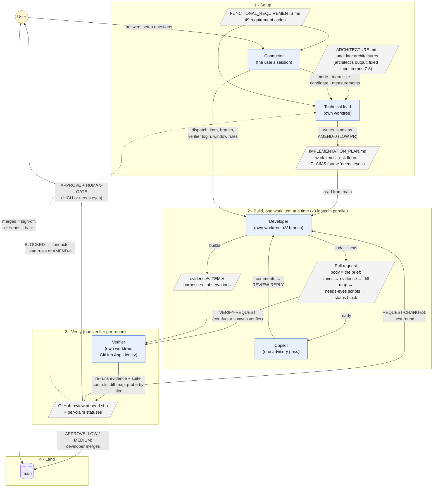
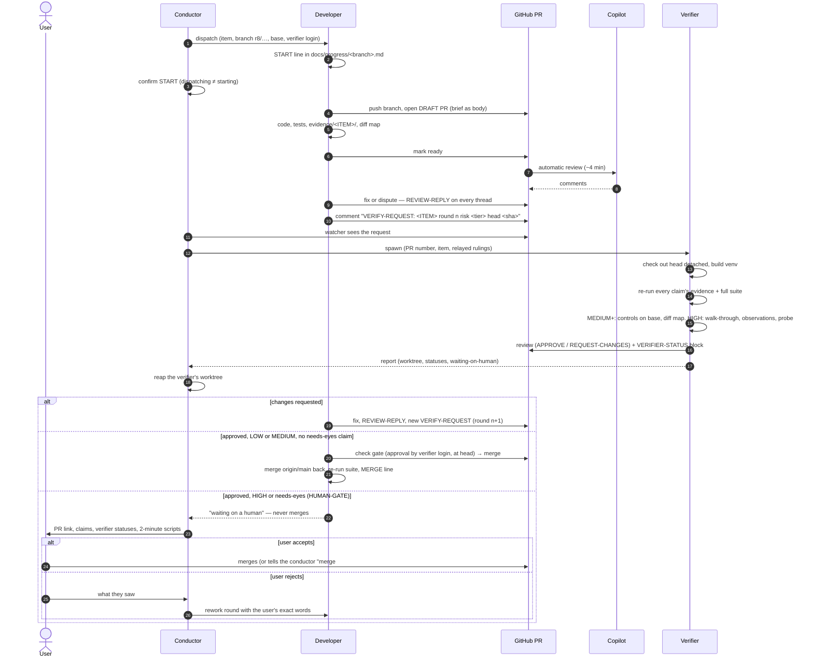

# The multi-agent workflow (as of the end of run 8)

How this project turns a specification into a finished application: which agents take part, what each one receives and hands on, where the gates are, and where the user comes in.

Every rule shown here comes from `.claude/agents/*.md`, `.claude/shared/*.md` and `docs/IMPLEMENTATION_PLAN.md`. When a diagram and one of those files disagree, the file governs.

---

## 1. The whole run

Every run also leaves a trail: each agent's `docs/progress/<branch>.md` log, one `docs/completions/` record per lane per iteration, and `docs/findings/` for measurements worth keeping. The conductor's own log, `docs/progress/conductor.md`, is git-ignored.

---

## 2. One work item, from dispatch to merge

---

## 3. What each tier owes

The table is the one plan §1.9 must carry.

| | LOW | MEDIUM | HIGH |
|---|---|---|---|
| Claims (the lead's, written before code) | yes | yes | yes |
| Evidence the developer owes | executable | + controls on the base commit | + walk-through + observation |
| Verifier re-runs evidence and suite at the head | yes | yes | yes |
| Verifier runs the suite on the head merged with current `main` | yes | yes | yes |
| Verifier maps every hunk to a claim | — | yes | yes |
| Verifier probes an edge case nobody claimed | — | — | yes |
| **The user** | only for a needs-eyes claim | only for a needs-eyes claim | always: reads the brief, runs the scripts, merges |

A developer or the verifier may **raise** a tier, and nobody may lower one. Plan amendments are always LOW and never go to the user.

---

## 4. Agents at a glance

| Agent | Receives | Produces | Never does |
|---|---|---|---|
| **Conductor** | the specification; mode, team size, candidate and scope from the user | spawns every other agent; relays reports and rulings; brings the user to human gates; `docs/progress/conductor.md` (git-ignored) | merges, writes code, settles conflicts, records a human verdict it was not given in the user's words |
| **Architect** | the specification | `docs/ARCHITECTURE.md` with candidate architectures | (skipped in runs 7 and 8: the architecture is a fixed input) |
| **Technical lead** | the architecture; mode, team size, candidate | the plan: iterations, work items, risk floors, **claims**, needs-eyes marks; `AMEND-n` PRs; rulings on `BLOCKED` | decides file layout, merges work items, lowers a floor |
| **Developer** | a work item, its branch and base, the verifier login | code, tests, `evidence/<ITEM>/`, the brief (PR body), progress log, completion record; merges its own LOW/MEDIUM PR | removes or weakens a plan claim, merges a human-gated PR, mutates working code to watch a test fail |
| **Copilot** | a PR marked ready | one advisory review, never re-run | approves |
| **Verifier** | a PR number and item code | re-run evidence; per-claim statuses (`REPRODUCED`, `HOLLOW`, `CONTROL INVALID`, `NO EVIDENCE`, `NEEDS EYES`, …); a GitHub review under its own identity; the PR's status block | writes or fixes code, merges, speaks for the user |
| **User** | the setup questions; human-gated PRs | answers; the **merge** that signs off HIGH and needs-eyes work | — |

---

## 5. Signals on a pull request

| Marker | Written by | Means |
|---|---|---|
| `VERIFY-REQUEST: <ITEM> round n risk <tier> head <sha>` | developer (or lead, for `AMEND-n`) | ready for the verifier. The conductor spawns one. |
| `REVIEW-REPLY: FIXED <sha>` / `REVIEW-REPLY: DISPUTE` | developer | a Copilot or verifier finding is answered |
| `VERIFY-VERDICT: APPROVE / REQUEST-CHANGES / BLOCKED …` | verifier | the round's result; a real GitHub review bound to the head sha |
| `<!-- VERIFIER-STATUS:BEGIN/END -->` | verifier only | per-claim status at the head it ran, inside the PR body |
| `HUMAN-GATE: <ITEM> — <HIGH / needs eyes: ids>` | verifier | approved by the machine; **the user merges** |
