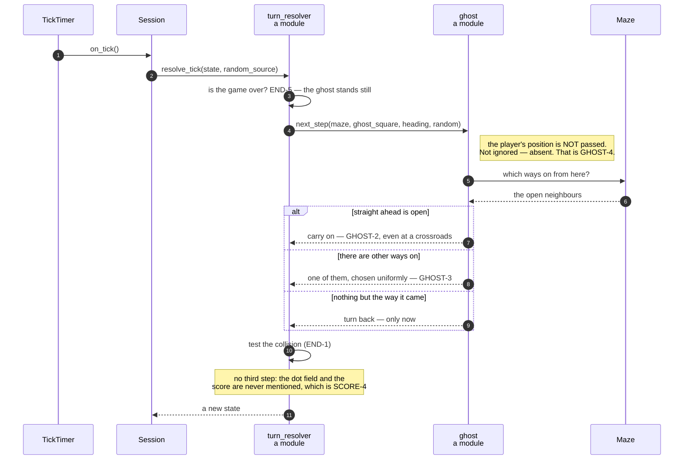

# A clock tick moves the ghost, which is never told where the player is

**Priority: `HIGH`** — this runs about seven times a second for the whole of every game, whether the player touches the keyboard or not. It is one of the two ways a game can end, and the only one that happens while the player does nothing. [What the priorities mean](SCENARIO_INDEX.md#what-the-priorities-mean).

GHOST-2[^codes] says the ghost keeps going in a straight line for as long as the
corridor lets it. GHOST-3 says where it cannot carry on it picks one of the
other ways on at random, and turns back the way it came only when there is no
other choice. **GHOST-4 says the ghost does not hunt the player and takes no
notice of where they are.**

Three rules about movement, and one about ignorance. The third is the one this
program takes seriously in an unusual way.

## GHOST-4 is enforced by the signature, not by good behaviour

[`next_step`](../../terminal_game/domain/ghost.py#L82) and
[`onward_choices`](../../terminal_game/domain/ghost.py#L64) take the maze, the
ghost's square, its heading, and a random source. **They do not take the
player's position.** Not as an unused argument — absent.

The module says so where anybody about to change it will read it:

> **The player is not a parameter (GHOST-4).** Not an unused one — absent. The
> ghost cannot hunt the player even by mistake, because it is never told where
> the player is. Anyone tempted to add the argument should read GHOST-4 first.

That turns a promise into a property. "The ghost ignores the player" is
normally a claim you verify by reading the body and trusting it stays true; here
it is a claim you verify by reading one line of a signature. A function that
cannot see something cannot take notice of it.

[`resolve_tick`](../../terminal_game/domain/turn_resolver.py#L69) is the one
function handed a whole `GameState` — which *does* contain the player — so it
is the single place the guarantee could be lost. It is three lines long, and it
pulls out exactly the maze, the square and the heading before calling the
policy.

## Straight on wins, even at a crossroads

The order inside the policy is worth stating because the first rule is stronger
than it first looks:

- **GHOST-2** — if the way ahead is open, take it. This wins *even where there
  are side openings*: a crossroads the ghost can drive straight through is not
  a place it has to choose. The random source is not consulted at all.
- **GHOST-3** — otherwise, pick uniformly among the other ways on.
- **and back the way it came only when there is nothing else.**

So reversal is never chosen while anything else is available. That is GHOST-3's
"only when there is no other choice" written as code rather than hoped for —
and in a maze the generator produced it is very nearly unreachable, because
MAZE-5 guarantees no dead ends. A forced reversal needs a square with exactly
one way on, and the generator makes none.

## Two steps, and deliberately no third

```
1. the ghost moves one square, the way its policy says
2. then the collision is tested        (END-1's second arm)
```

There is no third step, and the docstring says why:

> The ghost neither eats a dot nor scores a point (SCORE-4), and the only way to
> be sure of that is for this function never to touch the dot field or the
> score — which it does not.

SCORE-4 — *a dot under the ghost is still there to be taken* — is not a rule
enforced anywhere. It is a consequence of `resolve_tick` having no line that
mentions dots.

And as with the player's move, END-5 is guarded first: once a game is over the
ghost stands still, checked here so that no caller can reach past it.

| Class | What it represents, and its part in this scenario |
| --- | --- |
| [`ghost`](../../terminal_game/domain/ghost.py) | A module of plain functions. In this scenario it is **the policy**, and the shape of its signature is GHOST-4 |
| [`GhostStep`](../../terminal_game/domain/ghost.py#L42) | A square and a direction. In this scenario it is **the answer**: where to be next and which way you are then facing, which the next tick needs |
| [`turn_resolver`](../../terminal_game/domain/turn_resolver.py#L69) | A module function. In this scenario it is **the only thing holding both the player and the ghost**, and therefore the only place GHOST-4 could be lost |
| [`GhostIsWalledIn`](../../terminal_game/domain/ghost.py#L54) | A ghost with nowhere at all to go. In this scenario it is the **refusal** — unreachable in a generated maze, and loud rather than silent if a hand-built one produces it |
| [`random.Random`](https://docs.python.org/3/library/random.html) | Handed in, never created. In this scenario it is **what makes a run reproducible**: a seeded source replays a whole game exactly |



## Related scenarios

- **The tick timer keeps the ghost's beat without drifting** — where the tick
  comes from, and why it does not slow down.
- **An arrow key moves the player one square** — the other half of a turn.
- **A maze is carved into a spanning tree, then braided until no dead ends
  remain** — why a forced reversal is nearly unreachable.

### Footnotes

[^codes]: Requirement codes are the specification's own, in
    [`docs/FUNCTIONAL_REQUIREMENTS.md`](../FUNCTIONAL_REQUIREMENTS.md).
