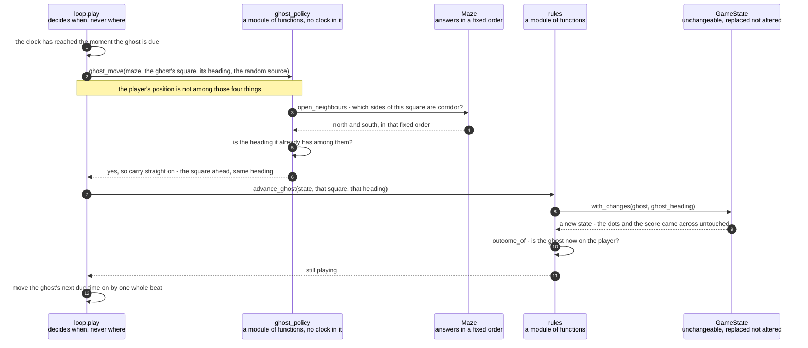

# A clock tick moves the ghost, which is never told where the player is

**Priority: `HIGH`** — this happens about seven times a second for the whole length of every game, whether anyone is pressing anything or not. It is the only thing in the game that moves by itself. [What the priorities mean](SCENARIO_INDEX.md#what-the-priorities-mean).

The player holds still. The pink block keeps moving anyway: straight along the
corridor it is in, and when the corridor runs out, off in some other direction.
It never comes looking for the player. It simply wanders.

Three requirement codes[^codes] describe that wandering, and they are short
enough to quote. GHOST-2: "the ghost keeps going in a straight line for as long
as the corridor lets it." GHOST-3: "where it cannot carry on, it picks one of the
other ways on at random, and turns back the way it came only when there is no
other choice." GHOST-4: "the ghost does not hunt the player and takes no notice of
where they are."

The last of those is the interesting one, because it is a promise about something
**not** happening, and promises like that are usually impossible to check. Here it
is checkable in one line, and the trick is worth learning. The functions that
decide where the ghost goes **do not take the player's position as an argument.**
Not "take it and ignore it" — do not take it at all. A function that cannot see
something cannot take notice of it. So GHOST-4 stops being a promise about good
behaviour and becomes a property of the code that a reader can confirm by looking
at the top line of
[`choose_heading`](../../terminalgame/domain/ghost_policy.py#L82).

There is exactly one place that guarantee could be lost.
[`move_ghost`](../../terminalgame/domain/ghost_policy.py#L128) is handed a whole
game state, and a whole game state does contain the player. It is three lines
long, and all it does is pull out the maze, the ghost's square and the ghost's
heading before passing those three things on. Running the ghost's move with the
player placed on every corridor square of a maze in turn gives exactly one
answer every time, which is what turns the argument list into a measurement.

| Class | What it represents, and its part in this scenario |
|---|---|
| [`loop`](../../terminalgame/application/loop.py) | A module of plain functions, and the whole Application layer. In this scenario it is the **metronome**. It decides *when* the ghost moves and has no opinion whatever about *where*. It is handed the ghost's rule [as something to call](../../terminalgame/application/loop.py#L113) rather than reaching for it directly, and the three things it passes are the whole of GHOST-4 enforced at the call |
| [`ghost_policy`](../../terminalgame/domain/ghost_policy.py) | A module of plain functions rather than a class. In this scenario it is the **wanderer's rule**. [`choose_heading`](../../terminalgame/domain/ghost_policy.py#L82) holds all three of the requirements above, in the order they are written in the specification, and it contains no clock because nothing in the Domain is allowed to know about time |
| [`Maze`](../../terminalgame/domain/maze.py#L76) | The grid of squares, fixed for the whole game. In this scenario it is the **map**. [`open_neighbours`](../../terminalgame/domain/maze.py#L140) answers "which of the four sides can I go on to from here", and it answers in a fixed order — north, south, east, west — so that a game grown from a given seed[^seed] plays out identically every time |
| [`rules`](../../terminalgame/domain/rules.py) | A module of plain functions. In this scenario it is the **judge of what the move meant**. [`advance_ghost`](../../terminalgame/domain/rules.py#L99) is deliberately handed the square and heading that have **already** been decided, rather than working them out itself, so that where the ghost goes and what it means once it is there stay two separate questions |
| [`GameState`](../../terminalgame/domain/game_state.py#L97) | Everything true of a game at one moment, unchangeable[^immutable] once made. In this scenario it is the **thing that changes by exactly two fields**: where the ghost is, and which way it is heading. Nothing else, which is requirement SCORE-4 |

## A tick arriving, and a ghost that carries straight on

| Step | Message | What is going on |
|---:|---|---|
| 1 | the clock has reached the moment the ghost is due | About seven times a second, which is one beat every 142.86 thousandths of a second. How that moment is arrived at without a second thread is the subject of its own scenario, listed below. All that matters here is that it arrives whether the player pressed anything or not, which is the whole of GHOST-1 |
| 2 | [`ghost_move`](../../terminalgame/domain/ghost_policy.py#L114)`(maze, the ghost's square, its heading, the random source)` | Four things are handed over and the player is not one of them. The loop is the layer that holds the whole state and could pass anything, so this argument list is the last place GHOST-4 could have been lost and the place it is actually kept |
| 3 | [`open_neighbours`](../../terminalgame/domain/maze.py#L140) - which sides of this square are corridor? | "The ways on." Requirement MAZE-5 promises there are always at least two of them from any corridor square, which is the promise this whole rule leans on: a ghost in a maze with no dead ends is never stuck and never has to turn round for want of anywhere else to go |
| 4 | north and south, in that fixed order | The fixed order is not decoration. A random choice made from a list is only reproducible if the list is in the same order every time, and reproducing a whole game from a single seed is how a puzzling run can be looked at again |
| 5 | is the heading it already has among them? | GHOST-2, and it is asked **first**. Notice what this means at a crossroads: a ghost that can carry straight on does so, even where there are openings to the side. A crossroads it can drive straight through is not a place where it has to choose. This was checked against the code — a ghost heading east at a four-way crossroads carries on east |
| 6 | yes, so carry straight on - the square ahead, same heading | The commonest answer by far, because most squares in a corridor have a way on ahead |
| 7 | [`advance_ghost`](../../terminalgame/domain/rules.py#L99)`(state, that square, that heading)` | The square and heading are handed **in** rather than worked out here. That is what keeps the ghost's rule and the game's rules from growing into each other: this step has no opinion about where the ghost should go, only about what it means once it is there |
| 8 | [`with_changes`](../../terminalgame/domain/game_state.py#L128)`(ghost, ghost_heading)` | Two things change and nothing else. Requirement SCORE-4 — "the ghost neither eats dots nor hides them, a dot under the ghost is still there to be taken" — is true here because nothing in this module so much as mentions dots or the score |
| 9 | a new state - the dots and the score came across untouched | Every field not named is copied across as it was. The old state is not altered in any way, which is what lets the loop tell that something happened simply by noticing it is now holding a different object |
| 10 | [`outcome_of`](../../terminalgame/domain/rules.py#L55) - is the ghost now on the player? | The same question asked after a player's move, in the same order, by the same code. That is why requirement END-1 can say "whether the player walked into the ghost or the ghost walked into the player" without the program needing to know which happened. It never asks |
| 11 | still playing | If the answer had been otherwise the game would be over, and what happens then is a scenario of its own |
| 12 | move the ghost's next due time on by one whole beat | Moved on from where it already was, never set to "now plus a beat". That is the difference between a ghost that keeps time and one that drifts slower each round as the loop's own working time is added on |

The other two answers to *is the heading it already has among them* are worth
reading, even though the diagram takes only the first. When the heading ahead is **not** a way on, the rule picks at
random from the ways on that are neither straight ahead nor back the way it came.
Only if that list is empty does it turn round. So turning back is never chosen
while anything else is available, which is GHOST-3's "only when there is no other
choice" written as code rather than hoped for. Checked against a corridor with a
closed end: a ghost heading east at the far end comes back west, because west is
the only thing left.

Because the maze has no dead ends, that last case is rare by construction rather
than by luck. A ghost only ever has to turn round where a corridor genuinely
stops, and the braiding pass that produces the maze exists precisely to make sure
that almost never happens.

One more thing this step does **not** do: it does not decide whether the game is
over. Setting the outcome here would put the fixed order of the two end
conditions in two places, and that order is itself a requirement.

## Related scenarios

- [The key read's timeout is recomputed every pass so the ghost keeps its beat](the-key-reads-timeout-is-recomputed-every-pass-so-the-ghost-keeps-its-beat.md)
  — where the moment in the first step comes from, and how one thread serves both
  a clock and a keyboard.
- [An arrow key moves the player one square and eats the dot it lands on](an-arrow-key-moves-the-player-one-square-and-eats-the-dot-it-lands-on.md)
  — the other half of the same loop, arriving at the same outcome question by a
  different route.
- [A maze is carved into a spanning tree and then braided until no dead ends remain](a-maze-is-carved-into-a-spanning-tree-and-then-braided-until-no-dead-ends-remain.md)
  — where the promise of at least two ways on comes from, which is what makes
  turning round rare.
- [Eating the last dot on the ghost's square is a loss and not a win](eating-the-last-dot-on-the-ghosts-square-is-a-loss-and-not-a-win.md)
  — the one arrangement of a game where the order of the outcome questions
  decides which ending the player gets.

### Footnotes

[^codes]: A **requirement code** is a short name such as `WIN-2` or `GHOST-1`
    given to one sentence of
    [the specification](../FUNCTIONAL_REQUIREMENTS.md). There are 49 of them,
    in ten groups, and the group name says what the sentence is about: `GAME`,
    `WIN` for the window, `SCRN` for what is on screen, `MAZE`, `START`, `CTRL`
    for the controls, `GHOST`, `SCORE`, `END` for how a game finishes, and
    `STAT` for the bottom row. They are quoted throughout the code as well as
    in these documents, so a reader who finds `CTRL-3` in a comment can look up
    the exact sentence it is keeping.

[^seed]: A **seed** is a number that decides what a run of random choices will
    be. The same seed always gives the same sequence, so "random" here means
    "unpredictable to a player" rather than "different every time no matter what".
    One seed names one whole game in this program: it is used for the maze, for
    where the two characters start, and for every choice the ghost ever makes,
    because [a single random source is threaded through all
    three](../../terminalgame/game_main.py#L68). With two sources a seed would
    reproduce the maze but not the game played on it.

[^immutable]: An **unchangeable** value is one that cannot be altered after it
    is made. If something different is wanted, an entirely new one is built
    instead — here by
    [`with_changes`](../../terminalgame/domain/game_state.py#L128), which copies
    everything and replaces only what was named. Two things follow that this
    game relies on. Nobody can alter a game state that somebody else is holding,
    so the ghost's policy cannot quietly change a state it was only asked to look
    at. And "nothing at all happened" can be checked by asking whether the very
    same object came back, instead of listing everything that did not change and
    hoping the list is complete.
