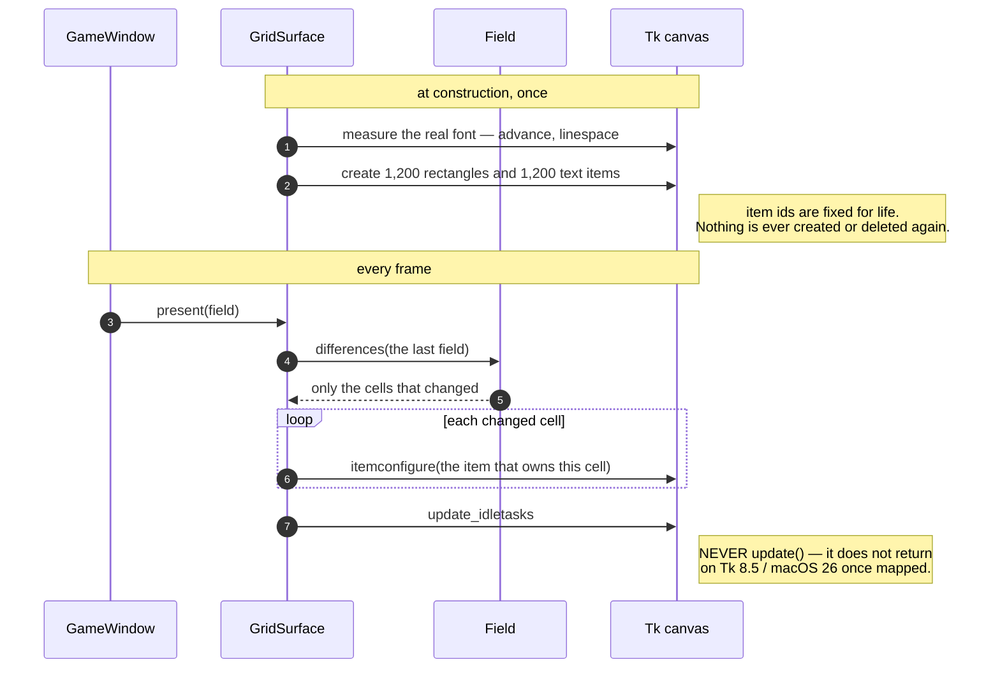

# A field is painted onto the canvas, touching only the cells that changed

**Priority: `HIGH`** — it is the only route by which anything reaches the screen, and it runs on every frame. [What the priorities mean](SCENARIO_INDEX.md#what-the-priorities-mean).

[`GridSurface`](../../terminal_game/presentation/surface.py#L115) is **the only
module in the Presentation layer allowed to name the windowing toolkit**. The
layer rule holds a single named exception for it —
[`PAINTING_MODULE`](../../tools/layer_rule.py#L45) — and the suite pins that the
exception stays exactly one module, so the toolkit cannot spread through the
layer quietly.

Everything upstream of here is data. Everything from here on is pixels. SCRN-2
and SCRN-7[^codes] are both met here, and neither is met by trying.

## Flicker is what you get from clearing, so this never clears

SCRN-7: *"the picture is redrawn as things move, without flicker."*

Flicker is what happens when a surface is cleared and then redrawn — for one
frame the player sees the clearing. At construction this surface creates **one
background rectangle and one text item per cell, 2,400 items for the 40 × 30
grid**, and thereafter a repaint only *reconfigures* them.

The item identifiers never change for the life of the surface, so **there is no
moment at which the picture is incomplete.**
[`present`](../../terminal_game/presentation/surface.py#L258) does the whole
frame's worth of reconfiguration before asking the toolkit to draw anything, and
asks exactly once. That is "composed off-screen and presented once".

## The diffing is not there for speed

Only the cells that differ from the last frame are touched, and the numbers say
that is not why:

| | measured on this machine, Menlo 16 |
| --- | --- |
| reconfiguring all 1,200 cells | 7.3 ms |
| the dozen cells an actor move really touches | 0.092 ms |
| the tick budget | 143 ms |

Either would fit nine times over. **The diffing is there because it keeps the
item set fixed**, and because the architect's caution C5 warned against
dirty-*region* rendering — which this deliberately is not.

The distinction is the whole of C5's concern. A dirty-region painter decides
*which part of the screen to redraw* and is wrong whenever it decides wrongly.
Here, **every item permanently owns exactly one cell and is always set to that
cell's current content**, so there is no region that can be missed. A cell whose
content did not change did not need touching; a cell whose content did change
gets set. There is no third case for a bug to live in.

## No caret, by making one impossible

SCRN-7's other half: *"the text cursor is never visible."*

A canvas has no insertion caret unless a text item on it holds the keyboard
focus. This surface gives nothing focus, creates no entry or text widget
anywhere, and sets `takefocus=0` so the canvas is skipped by tab traversal
altogether. Key events belong to the window, and translating them belongs to a
module that has never heard of a canvas.

[`caret_is_impossible`](../../terminal_game/presentation/surface.py#L363)
reports that, so it is **checked rather than assumed** — the difference between
"we do not show a caret" and "a caret cannot appear here".

## SCRN-2, checked against the canvas rather than claimed

*"Everything is drawn from characters — there are no images."*

There is no method here that draws anything. The only way to change the picture
is `present`, which takes a [`Field`](../../terminal_game/presentation/field.py#L113),
and a field can hold nothing but one-character
[`Cell`](../../terminal_game/presentation/field.py#L38)s. So the canvas only
ever contains `text` and `rectangle` items — never `image`, `bitmap`, `line`,
`arc`, `oval`, `polygon` or `window`.

[`item_types`](../../terminal_game/presentation/surface.py#L322) reports what is
**actually on the canvas**, which is a different and better claim than what the
code intended to put there. The same is true of `shown_cell`, `shown_row` and
`descendant_widget_classes`: they let a test ask the canvas what it is
displaying rather than ask this class what it believes it drew.

## The call that never returns

`root.update()` **blocks forever** on Tcl/Tk 8.5 under macOS 26 once the window
is mapped. Measured and bisected with `faulthandler`: `Tk()`, `withdraw()`,
`geometry()`, `deiconify()` and `update_idletasks()` all return; `update()` never
does, pinned at `tkinter/__init__.py` line 1314.

This surface therefore calls `update_idletasks` and never `update` — and that
turns out to be the right call regardless of the bug: it flushes the pending
redraw **without reprocessing the event queue**, so a repaint cannot re-enter
the game through a key event that arrives mid-frame.

| Participant | What it represents, and its part in this scenario |
| --- | --- |
| [`GridSurface`](../../terminal_game/presentation/surface.py#L115) | The canvas and its 2,400 items. In this scenario it is **the only thing that turns data into light** |
| [`Field`](../../terminal_game/presentation/field.py#L113) | A 40 × 30 grid of cells. In this scenario it is **the only input**, and `differences` is what makes the repaint small |
| [`Cell`](../../terminal_game/presentation/field.py#L38) | One glyph and two colours. In this scenario it is **why SCRN-2 cannot be broken here**: there is no shape an image could arrive in |
| [`CellMetrics`](../../terminal_game/presentation/metrics.py#L72) | Pixels per cell. In this scenario it is **where each item goes**, measured from the real font at construction |
| [`GameWindow`](../../terminal_game/shell/window.py#L81) | The window. In this scenario it is **the thing the canvas lives in**, and the only caller of `present` |

## Related scenarios

- **A game state is composed into a 40 × 30 field, three cells to an actor** —
  where the field comes from.
- **The font is measured at start-up, and the window's size is derived from what
  was found** — the measurement this surface takes before it creates anything.
- **The window is opened withdrawn, dressed, placed, and only then shown** — the
  window this canvas lives in.

### Footnotes

[^codes]: Requirement codes are the specification's own, in
    [`docs/FUNCTIONAL_REQUIREMENTS.md`](../FUNCTIONAL_REQUIREMENTS.md).
