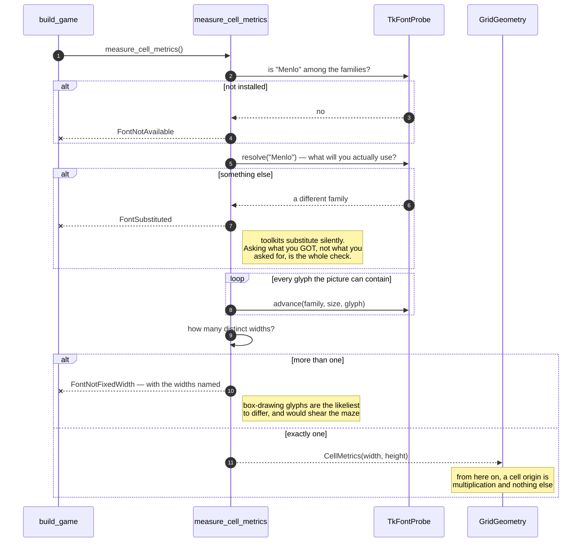

# A font that is missing, substituted or not fixed-width is refused before a window opens

**Priority: `MEDIUM`** — it runs once, before the window exists. A fault does not crash the game: it produces a picture that is subtly and permanently sheared, which is the hardest kind of wrong to see and the hardest to attribute. [What the priorities mean](SCENARIO_INDEX.md#what-the-priorities-mean).

WIN-2[^codes] asks for a window 40 characters wide and 30 rows deep in a
fixed-width typeface. Every other part of this program takes that literally: a
[`Frame`](../../terminal_game/presentation/frame.py#L148) is 1,200 cells, the
maze is drawn two columns to a square, an actor's motif is exactly three
columns, and [`GridGeometry`](../../terminal_game/shell/grid_surface.py#L160)
turns a row and column into a pixel origin by multiplication.

**All of that rests on one assumption: every glyph the picture can contain is
the same width.** This scenario is where that assumption is checked instead of
trusted.

## Three ways a font can let you down, and they are not the same

[`measure_cell_metrics`](../../terminal_game/shell/grid_surface.py#L244) raises
a different error for each, and the distinction is worth having because the
remedies differ:

| | |
| --- | --- |
| [`FontNotAvailable`](../../terminal_game/shell/grid_surface.py#L129) | the named family is not installed |
| [`FontSubstituted`](../../terminal_game/shell/grid_surface.py#L133) | the toolkit quietly gave us a different family than the one asked for |
| [`FontNotFixedWidth`](../../terminal_game/shell/grid_surface.py#L137) | the family does not give every glyph we draw the same advance |

The middle one is the interesting one. A toolkit asked for a font it does not
have will often not say so — it resolves the request to something else and
carries on. The check is explicit: ask for the family, then ask what you
actually got, and compare.

That is a whole class of bug that only appears on somebody else's machine.

## Every glyph the picture can contain, measured

[`_required_glyphs`](../../terminal_game/shell/grid_surface.py#L87) is not a
sample. It is the complete set:

```python
ascii_printable = "".join(chr(code) for code in range(32, 127))
walls  = "═║╔╗╚╝╠╣╦╩╬"
marks  = "▪■"          # dot, lone wall square
player = "▐█▌"         # SCRN-5
ghost  = "▗█▖"         # SCRN-5
```

Printable ASCII covers the status line; the rest are the box-drawing, dot and
actor glyphs taken from the specimen picture. Every one is measured, and the
advances are collected into a set — if that set has more than one member, the
font is refused and the offending widths are named.

This matters because the box-drawing and block characters are exactly the ones
a font is most likely to lack or to render at a different advance. A font that
is perfectly monospaced across ASCII and half a pixel wider on `╬` would shear
the maze and nothing else, and it would do it consistently enough to look
deliberate.

## Refused before the window, not after

The measurement happens during construction, before a window is created. A
program that opened a window and *then* discovered it could not draw in it
would have to take the window away again — and would have shown the player
something broken first.

The error names the font and the problem, so the person reading it knows
whether to install something, change the pinned family, or look at their
system's font substitution settings. `FontNotFixedWidth` also guards against a
degenerate measurement — a zero or negative advance — which would otherwise
produce a grid geometry that divides by nothing.

| Class | What it represents, and its part in this scenario |
| --- | --- |
| [`measure_cell_metrics`](../../terminal_game/shell/grid_surface.py#L244) | A module function. In this scenario it is **the inspector**, and it runs before there is anything to inspect it with |
| [`TkFontProbe`](../../terminal_game/shell/tk_grid.py) | `families`, `resolve` and `advance`. In this scenario it is **the only thing that asks the real toolkit**, and the seam that lets every refusal be tested with no font anywhere |
| [`CellMetrics`](../../terminal_game/shell/grid_surface.py#L141) | One cell's width and height in pixels. In this scenario it is **the product** — and once it exists, everything downstream may multiply by it without asking again |
| [`GridGeometry`](../../terminal_game/shell/grid_surface.py#L160) | Row and column to pixel origin. In this scenario it is **the beneficiary**: it is pure arithmetic precisely because this check has already passed |
| [`SurfaceFontError`](../../terminal_game/shell/grid_surface.py#L125) | The three refusals share a base. In this scenario it is **the thing a caller can catch once** while still being told which of the three happened |



## Related scenarios

- **A window is opened, dressed, and placed where the player was looking** —
  what happens once the metrics exist.
- **A frame is painted onto the grid, touching only the cells that changed** —
  the code that assumes one cell is one glyph is one advance.
- **A wall square chooses its double-line glyph from its four neighbours** —
  where the box-drawing characters this measures come from.

### Footnotes

[^codes]: Requirement codes are the specification's own, in
    [`docs/FUNCTIONAL_REQUIREMENTS.md`](../FUNCTIONAL_REQUIREMENTS.md).
