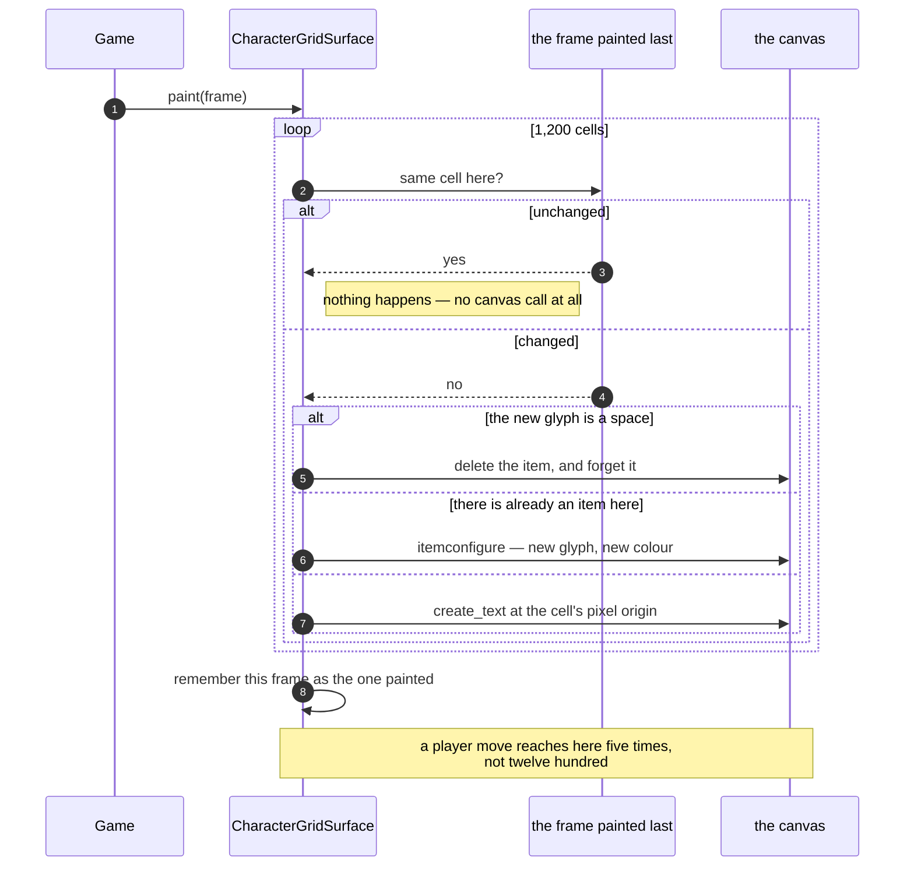

# A frame is painted onto the grid, touching only the cells that changed

**Priority: `HIGH`** — this is the last step before light reaches the player, and the only one. It runs for every frame, and because the window and the game are one process, a fault here does not degrade the picture: it takes the game down. [What the priorities mean](SCENARIO_INDEX.md#what-the-priorities-mean).

A [`Frame`](../../terminal_game/presentation/frame.py#L148) is 1,200 cells of
glyph and colour, and it knows nothing about pixels. A
[`CharacterGridSurface`](../../terminal_game/shell/grid_surface.py#L309) turns
one into marks on a canvas. It is the only class in the program that does, and
the only one below the Shell boundary permitted to name the toolkit at all.

What makes it worth a document is that it does **less work than the
architecture told it to**, deliberately, and the reasons on both sides are
worth reading.

## It compares against the frame it painted last

[`paint`](../../terminal_game/shell/grid_surface.py#L402) walks all 1,200
positions, and for each one asks whether the cell differs from the same cell in
the previous frame. If it does not, it does nothing at all:

```python
previous = self._painted
for row in range(FRAME_ROWS):
    for column in range(FRAME_COLUMNS):
        cell = frame.cell_at(row, column)
        if previous is not None and previous.cell_at(row, column) == cell:
            continue
        self._show(row, column, cell)
self._painted = frame
```

The measured effect: **a player moving one square costs five cell updates
rather than twelve hundred.** Three tests pin it, and they are worth naming
because they are the reason the behaviour cannot quietly regress —
[`test_repainting_an_unchanged_frame_costs_no_drawing_at_all`](../../tests/test_grid_surface.py#L446),
[`test_moving_the_player_touches_only_the_cells_that_changed`](../../tests/test_grid_surface.py#L462),
and
[`test_a_move_costs_five_cells_and_not_the_whole_twelve_hundred`](../../tests/test_grid_surface.py#L472).

Five, because the player's three-column motif shifts by two columns: three
cells gain a glyph, two lose one.

## The architecture said not to

[`docs/ARCHITECTURE.md`](../ARCHITECTURE.md) lists dirty-region rendering under
*options considered and rejected*:

> A 40 × 30 frame is 1,200 cells. Composing all of it every tick and letting
> the toolkit's double buffer emit only what changed is both simpler and
> already flicker-free. Tracking dirty rectangles would be optimising a cost
> nobody is paying.

That reasoning still holds — the cost was not being paid. The code was written
anyway, nothing in the implementation plan rules on the departure, and it was
found afterwards by an automated review of the pull requests, which is late.
It is kept rather than reverted, and the architecture now records the reversal
rather than contradicting the tree.

**What makes it safe is narrower than it looks**, and this is the part to
remember if you change anything here. The cached frame cannot go stale because
of three facts at once:

- `grid_surface` is the **only writer to the canvas** — every
  `create_text`, `itemconfigure` and `delete` is inside
  [`_show`](../../terminal_game/shell/grid_surface.py#L429) or
  [`clear`](../../terminal_game/shell/grid_surface.py#L417);
- [`clear`](../../terminal_game/shell/grid_surface.py#L417) resets the cache to
  `None`, so the next paint is unconditional;
- nothing binds `<Configure>` and nothing resizes the surface after it is built.

**If any of those three stops being true, this optimisation becomes a defect** —
a cell the cache believes is already correct will not be repainted, and the
screen will disagree with the frame.

## A blank is an absence, not a space

[`_show`](../../terminal_game/shell/grid_surface.py#L429) has one asymmetry
worth knowing. A cell whose glyph is a space does not draw a space: it
**deletes** the canvas item and forgets it. Only a cell with something in it
holds an item at all.

So the canvas carries roughly 696 items for a full maze rather than 1,200, and
the ground shows through everywhere else. That is also why a move costs five
updates and not six — two of the five are deletions.

| Class | What it represents, and its part in this scenario |
| --- | --- |
| [`CharacterGridSurface`](../../terminal_game/shell/grid_surface.py#L309) | The one class that turns cells into marks. In this scenario it is the **painter**, and the holder of the only cache in the drawing path |
| [`Frame`](../../terminal_game/presentation/frame.py#L148) | 1,200 immutable cells. In this scenario it is **both the instruction and the record** — the frame just painted becomes the thing the next one is compared against, which only works because it cannot be altered afterwards |
| [`GridGeometry`](../../terminal_game/shell/grid_surface.py#L160) | Cell metrics to pixel origins. In this scenario it is the **ruler**, consulted once per newly-created item and never afterwards |
| [`Cell`](../../terminal_game/presentation/frame.py#L84) | A glyph and a colour, compared by value. In this scenario it is **the unit of the comparison**: the whole optimisation rests on two cells being equal when they look the same |



## Related scenarios

- **A game state is composed into a 40 × 30 frame** — where the frame comes from.
- **A font that is missing, substituted or not fixed-width is refused before a
  window opens** — why this surface can assume every glyph is one cell wide.
- **The tick timer keeps the ghost's beat without drifting** — what calls this,
  and how often.

### Footnotes

[^codes]: Requirement codes are the specification's own, in
    [`docs/FUNCTIONAL_REQUIREMENTS.md`](../FUNCTIONAL_REQUIREMENTS.md).
