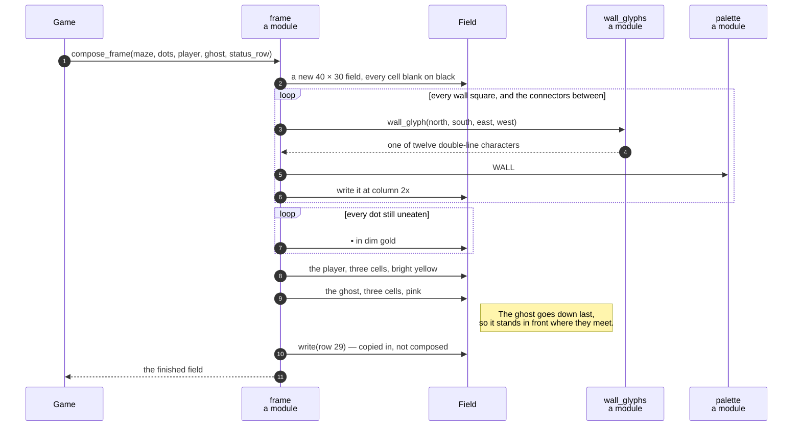

# A game state is composed into a 40 × 30 field, three cells to an actor

**Priority: `HIGH`** — every picture the player ever sees is built here, on every key press and every tick. [What the priorities mean](SCENARIO_INDEX.md#what-the-priorities-mean).

[`compose_frame`](../../terminal_game/presentation/frame.py#L199) takes a maze, a
dot set, two actor positions and a finished status row, and fills in a
[`Field`](../../terminal_game/presentation/field.py#L113). It never paints,
never names a toolkit and never reads a pixel. SCRN-1 to SCRN-5[^codes] are
here.

## The grid mapping is measured, not assumed

Ruling C-2: **maze square *x* is drawn at screen column *2x***. Nineteen squares
at even columns span 0 to 36 — 37 of the 40 columns — and the last three are a
blank right margin, which is MAZE-1's *"narrow blank margin"*.

The odd columns between squares are **connectors**, and a connector carries the
horizontal double line only when the squares on *both* sides of it are walls;
otherwise it is blank.

Every one of those facts was read off the specimen picture in the requirements,
which assumption P5 makes normative, and the suite **re-derives the whole
picture from this module on every run**. The mapping is not a convention
somebody chose; it is what the picture does.

## Three cells to an actor, and why that is safe

```
PLAYER_GLYPHS = ("▐", "█", "▌")     # a solid block flanked by half blocks
GHOST_GLYPHS  = ("▗", "█", "▖")     # the same block, on two feet
```

Each actor occupies its square's own column **plus the connector either side** —
the specimen draws the player at columns 19, 20, 21 and the ghost at 1, 2, 3.

That could overwrite a wall glyph, and it never does, for a reason rather than
by luck: **a connector beside a corridor square is always blank**, because a
horizontal wall join needs walls on *both* sides and an actor stands on
corridor. The tests do not take that argument on trust — they stand the player
on all **264 corridor squares** of the specimen and check.

The two actors differ by **outline** as well as by colour, which is what SCRN-5
asks for: *"can be told apart by colour and by outline"*. So they remain
distinguishable in a photograph that loses the colour, and the claim is testable
without a camera.

## The order the layers go down is load-bearing

```
ground  →  walls  →  dots  →  player  →  ghost
```

The ghost is painted **last**, so it stands in front where the two meet. That is
one line of ordering and it decides what the last frame of a lost game looks
like.

## Row 29 is copied in, not composed

The status row arrives as an argument and is copied in unexamined apart from its
width. Its content belongs to
[`status`](../../terminal_game/presentation/status.py), and this module decides
nothing about it — **a status line composed partly in one place and partly in
another is a status line nobody owns.**

## The seam, and why this module changed shape to reach it

Two work items landed within minutes of each other and each invented this seam,
differently: one returned a tuple of tuples with a colour *enum*, the other
built a `Field` of `#rrggbb` cells and declared in its own docstring that both
composers would produce one.

The `Field` won, for three reasons that are in the code rather than in anyone's
preference: it had already been specified there, **it enforces SCRN-2 in the
data** where a tuple of tuples cannot, and the painting surface already consumed
it. The reconciliation is its own small work item in the history, which is worth
knowing when reading the module — it is why colours come from the palette here
and from nothing local.

| Participant | What it represents, and its part in this scenario |
| --- | --- |
| [`frame`](../../terminal_game/presentation/frame.py) | A module of plain functions. In this scenario it is **the composer** — it decides what the picture *is*, for rows 0 to 28 |
| [`Field`](../../terminal_game/presentation/field.py#L113) | A 40 × 30 grid of cells. In this scenario it is **the product**, and the seam every other part of Presentation meets at |
| [`Cell`](../../terminal_game/presentation/field.py#L38) | One glyph and two colours. In this scenario it is **SCRN-2 made structural**: there is no shape an image could travel in |
| [`Maze`](../../terminal_game/domain/maze.py#L115) | The grid. In this scenario it is **what is being drawn**, asked only whether each square is wall |
| [`wall_glyphs`](../../terminal_game/presentation/wall_glyphs.py) | A module. In this scenario it is **the answer to "which line character"**, given four neighbours |
| [`palette`](../../terminal_game/presentation/palette.py) | A module of constants. In this scenario it is **the one place a colour word becomes a number** |



## Related scenarios

- **A field is painted onto the canvas, touching only the cells that changed** —
  what happens to this field next.
- **A wall square chooses its double-line glyph from its four neighbours** — the
  table this module consults.
- **The status row shows the score and the keys that still work** — who decides
  what row 29 says.

### Footnotes

[^codes]: Requirement codes are the specification's own, in
    [`docs/FUNCTIONAL_REQUIREMENTS.md`](../FUNCTIONAL_REQUIREMENTS.md).
