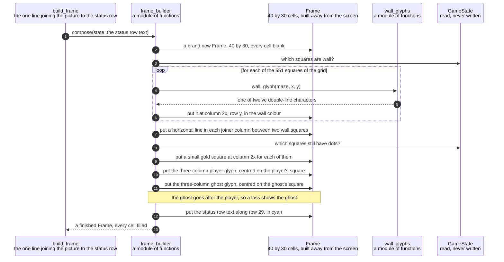

# A game state is composed into a 40 by 30 frame with the ghost drawn last

**Priority: `HIGH`** — every picture the player ever sees is built here, and a new one is built from scratch several times a second. If this is wrong there is no picture. [What the priorities mean](SCENARIO_INDEX.md#what-the-priorities-mean).

A game state says where the player is, where the ghost is, which squares still
have dots and what the score is. None of that is a picture. This is the step that
turns it into one: a rectangle of 1,200 character cells, exactly 40 across and 30
deep, each cell holding one character and the name of a colour.

The value of doing it here, in one place, is that the part of the program that
knows the rules never learns what anything looks like. A maze square is a square.
That two columns of the terminal are spent drawing one of them, that a character
is three columns wide, and that there is a blank margin down the right — all of
that lives on this side of the line and nowhere else. This is caution
C5[^cautions], and the reason it is worth the trouble is practical: the promises
about the maze having no dead ends and everything being reachable are checked by
walking the grid, and they would have to be checked by reading a picture if the
picture leaked into the grid.

Two facts about the geometry are worth stating before the diagram, because
everything else follows from them. **A maze square is two terminal columns wide,
and neighbouring squares share the column between them.** So 19 squares occupy
`2 x 19 - 1 = 37` columns, square number `x` is drawn at column `2x`, and the
three columns left over are the blank margin requirement MAZE-1[^codes] asks
for. The odd column between two squares is called the **joiner**, and its rule
was not guessed: it was worked out from the picture in the specification, over
all 518 joiner positions in it. Where both neighbouring squares are wall it is a
horizontal double line, 122 times with no exceptions. Otherwise it is blank, 396
times, with exactly four exceptions — and all four turn out to be the edges of
the two characters, which are drawn last and over everything else.

The second fact is the **order**, and it is a requirement rather than a
convenience. Walls, then joiners, then dots, then the player, then the ghost. The
ghost goes last so that when the two are on the same square the picture shows the
ghost. That is what a loss looks like, and it is the whole of requirement END-4.

| Class | What it represents, and its part in this scenario |
|---|---|
| [`frame_builder`](../../terminalgame/presentation/frame_builder.py) | A module of plain functions rather than a class. In this scenario it is the **composer**. [`compose`](../../terminalgame/presentation/frame_builder.py#L131) builds a brand new picture every time it is called and fills every one of its 1,200 cells. There is no path that redraws only what moved, and there is nowhere for one to live |
| [`Frame`](../../terminalgame/screen/port.py#L128) | A whole picture, built away from the screen and handed over as one thing. In this scenario it is the **canvas**. [`put`](../../terminalgame/screen/port.py#L160) refuses a cell outside its edges rather than quietly trimming it, because a character that had wandered off the edge would be a mistake worth hearing about |
| [`wall_glyphs`](../../terminalgame/presentation/wall_glyphs.py) | A module of plain functions. In this scenario it is the **draughtsman**. It answers, for one wall square, which of twelve double-line characters it should be drawn as, and it has its own scenario because the question is subtler than it sounds |
| [`GameState`](../../terminalgame/domain/game_state.py#L97) | Everything true of a game at one moment. In this scenario it is the **subject being drawn**, and it is read and never written. Nothing in this document alters a game in any way |
| [`Colour`](../../terminalgame/screen/port.py#L54) | A colour named rather than numbered — wall, dot, player, ghost, status. In this scenario it is the **vocabulary of appearance**. Presentation asks for the wall colour and has no idea that it means blue on a terminal, which is what keeps the terminal library out of everything above the port[^port] |

## Building the whole picture, in an order that ends with the ghost

| Step | Message | What is going on |
|---:|---|---|
| 1 | [`compose`](../../terminalgame/presentation/frame_builder.py#L131)`(state, the status row text)` | The status row is handed **in** rather than fetched. That looks like a formality and is not. A picture with a blank bottom row is a perfectly well-formed picture — it builds without complaint and passes every check the composing code has — so forgetting to pass the row would produce a game that quietly failed requirement STAT-1 while looking entirely correct to everything automatic. That is why the joining line is [a named function with a test of its own](../../terminalgame/game_main.py#L59) rather than an argument written at the call |
| 2 | a brand new `Frame`, 40 by 30, every cell blank | New every time, and every cell filled before it is handed over. This is caution C9, and the reason is in the last-but-two step: a character is three columns wide and overwrites a column of its neighbour's square, so a pass that drew only what had moved would leave half of somebody's block behind. 1,200 cells seven times a second does not need saving |
| 3 | which squares are wall? | The grid is 19 across and 29 deep, which is 551 squares. A game grown from seed 7 has 262 of them corridor, so 289 are wall |
| 4 | [`wall_glyph`](../../terminalgame/presentation/wall_glyphs.py#L173)`(maze, x, y)` | Asked once for each wall square. What it does with the four neighbours is its own scenario, listed below, and the short version is that the answer is a lookup in a table of sixteen entries that was measured from the specification's own picture rather than invented |
| 5 | one of twelve double-line characters | Twelve: four corners, two straights, four tees, one crossing, and a lone block for a wall square with no wall next to it |
| 6 | put it at column `2x`, row `y`, in the wall colour | The one line where the doubling happens. Everything above this module counts in squares, and everything from here on counts in columns |
| 7 | put a horizontal line in each joiner column between two wall squares | Drawn without asking which two characters they are. Two side-by-side wall squares always join horizontally, because each is the other's east or west neighbour, so each character already has an arm pointing at the other. That is why this rule needs no case-by-case reasoning at all |
| 8 | which squares still have dots? | Read from the **state**, never from the maze. A dot that has been eaten is simply absent from the set, so there is no "eaten" marker anywhere that could disagree with the picture |
| 9 | put a small gold square at column `2x` for each of them | Requirement SCRN-4 — "a small dim gold square, one to a corridor square" |
| 10 | put the three-column player glyph, centred on the player's square | Three columns wide, so it covers the joiner column on either side and can rub out a line that was there. That is not a fault: the player is in front of the wall behind them, and the whole picture is rebuilt next time round anyway |
| 11 | put the three-column ghost glyph, centred on the ghost's square | Requirement SCRN-5 asks for the two to be told apart by **both** colour and outline, so they differ in both: a bright yellow block between two half-blocks for the player, a pink block between two small corner blocks for the ghost. Both shapes were taken from the specification's own picture rather than chosen |
| 12 | put the status row text along row 29, in cyan | The bottom row, and the only row this module does not build itself. What it says is a separate question with a scenario of its own |
| 13 | a finished `Frame`, every cell filled | Handed over whole. Nothing ever shows a half-built picture and nothing ever shows a single cell, which is what makes the redrawing flicker-free |

A character can never run off the edge of the picture, and it is worth knowing
why nothing clips it. Requirement MAZE-3 puts a solid wall right around the
outside of the maze, so a character only ever stands on squares 1 to 17 of the 19,
and a three-column glyph centred on those spans columns 1 to 35 of the 37. There
is always a column to spare on each side. This was checked against the composed
picture: with the ghost on square 1, its glyph occupies columns 1, 2 and 3, and
the wall in column 0 is untouched.

The right-hand margin is the last thing to notice. The picture is 37 columns wide
and the window is 40, so columns 37, 38 and 39 are never written to at all. They
stay blank for the whole game, which is exactly the "narrow blank margin down the
right-hand edge" the specification asks for — not a gap left by accident but the
three columns that 19 squares at two columns each cannot fill.

## Related scenarios

- [A wall square chooses its double-line glyph from its four neighbours](a-wall-square-chooses-its-double-line-glyph-from-its-four-neighbours.md)
  — what happens inside the fourth step, and the one place in the program where
  "is that square a wall" has two different right answers.
- [A whole frame is written to the terminal and made visible in one pass](a-whole-frame-is-written-to-the-terminal-and-made-visible-in-one-pass.md)
  — takes over the moment this document finishes, and turns the finished picture
  into something on the glass.
- [The status row shows the score and the keys that still work](the-status-row-shows-the-score-and-the-keys-that-still-work.md)
  — where the text handed in at the first step comes from, and the one row of the
  picture this document does not build.
- [The key read's timeout is recomputed every pass so the ghost keeps its beat](the-key-reads-timeout-is-recomputed-every-pass-so-the-ghost-keeps-its-beat.md)
  — who calls this, how often, and the one check that stops it being called when
  nothing has changed.

### Footnotes

[^codes]: A **requirement code** is a short name such as `WIN-2` or `GHOST-1`
    given to one sentence of
    [the specification](../FUNCTIONAL_REQUIREMENTS.md). There are 49 of them,
    in ten groups, and the group name says what the sentence is about: `GAME`,
    `WIN` for the window, `SCRN` for what is on screen, `MAZE`, `START`, `CTRL`
    for the controls, `GHOST`, `SCORE`, `END` for how a game finishes, and
    `STAT` for the bottom row. They are quoted throughout the code as well as
    in these documents, so a reader who finds `CTRL-3` in a comment can look up
    the exact sentence it is keeping.

[^cautions]: A **caution** is a numbered warning in
    [the architecture document](../ARCHITECTURE.md), written before any code
    existed, about something known to be easy to get wrong — `C1` is "never act
    on the front window", `C9` is "redraw the whole frame each pass, not dirty
    cells". Each names one specific way this program could break rather than
    giving general advice, and several of them are quoted in the code at the
    exact line that obeys them.

[^port]: The **screen port** is the small set of things the game is allowed to
    ask of a screen: how big are you, give me a blank picture, show this picture,
    and wait a stated length of time for a key. It is
    [`Screen`](../../terminalgame/screen/port.py#L314), and it names those three
    operations plus the size, and nothing else. A **port** in this sense is a
    boundary written as a list of operations, with the real implementation kept
    on the far side of it, so that everything on the near side can be exercised
    by standing something simpler in its place.
