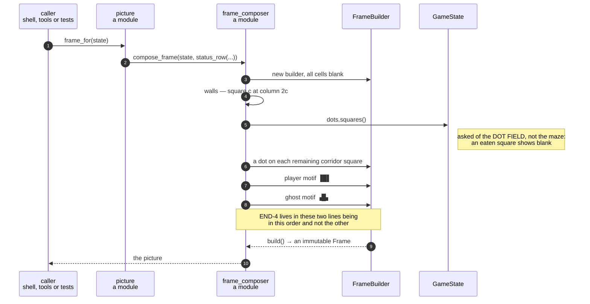

# A game state is composed into a 40 × 30 frame, with the ghost drawn last

**Priority: `HIGH`** — every picture the player ever sees comes through here, seven times a second, and nothing else produces one. A fault is immediately visible and total: the game still runs and still scores, and the player cannot see any of it. [What the priorities mean](SCENARIO_INDEX.md#what-the-priorities-mean).

Requirement SCRN-1[^codes] asks for a picture 40 characters wide and 30 rows
deep: 29 rows of maze and a status row beneath. This is where a
[`GameState`](../../terminal_game/domain/game_state.py) — which knows nothing
about characters, colours or rows — becomes one.

The whole of it is one function,
[`compose_frame`](../../terminal_game/presentation/frame_composer.py#L123), and
the interesting thing about it is not any single step. It is **the order the
steps run in**, because one of them is a requirement rather than an
implementation detail.

## The order is the requirement

Four layers go down, and they go down in this order:

1. **The walls**, laid out by
   [`wall_layer`](../../terminal_game/presentation/wall_glyphs.py) — square *c*
   drawn at column *2c*, the connector at *2c + 1*, corridor squares left blank.
2. **The dots**, one on every corridor square that still has one. They are
   asked of [`state.dots`](../../terminal_game/domain/dot_field.py) and *not* of
   the maze, which is what makes an eaten square show blank rather than a dot.
3. **The player**, a three-column motif `▐█▌`.
4. **The ghost**, a three-column motif `▗█▖`.

Steps 3 and 4 are the requirement. END-4 says that when the player and the
ghost are on the same square, the picture shows the ghost — which is what a
loss looks like. The composer does not test for that case or branch on it. It
simply draws the player and then draws the ghost over the top, and the
requirement falls out of the order:

```python
# END-4: the player first and the ghost second, so that when they share a
# square the ghost is what is seen and the last picture shows the loss.
```

Swap those two calls and every test still passes except the ones about a loss.
That single state — two actors on one square — is the whole of the difference
between a correct picture and a wrong one.

## A motif is three columns wide, and the maze is 37

A maze square is drawn **two columns wide**, so square *c* sits at column *2c*
and 19 squares occupy 37 columns —
[`MAZE_COLUMNS`](../../terminal_game/presentation/frame.py#L61) — with the
remaining three the blank right margin MAZE-1 asks for.

But an actor's motif is *three* columns, centred on its square, so it covers
`2c - 1` through `2c + 1` and overwrites the connector on each side. That is
deliberate: the actor is nearer the viewer than the wall behind it, and the
whole frame is rebuilt next tick anyway.

[`_place_motif`](../../terminal_game/presentation/frame_composer.py#L101) clips
rather than refuses at the edges. Its docstring is careful about why, and the
reasoning is worth keeping:

> a square on the border ring is a wall and cannot hold an actor, but clipping
> keeps the function total rather than making the picture depend on it.

In other words: the border ring already guarantees an actor is never at column
0 or 18, so the clip should never fire. Making the function total anyway means
the picture does not become a second place that guarantee has to hold.

## One call, and one place the two halves meet

[`frame_for`](../../terminal_game/presentation/picture.py#L59) is the seam the
rest of the program uses — *a game state in, a frame out*:

```python
return compose_frame(state, status_row(state.score.points, state.outcome))
```

That is the only place the two halves of SCRN-1 are put together, and every
consumer goes through it: the Shell's composition root, the headless game
apparatus, and the on-screen tools in `tools/`. Composing a picture takes
nothing from the state and changes nothing in it — *a question, not a move*.

| Class | What it represents, and its part in this scenario |
| --- | --- |
| [`compose_frame`](../../terminal_game/presentation/frame_composer.py#L123) | A module function. In this scenario it is the **draughtsman**, and the order of its four steps is the whole of END-4 |
| [`FrameBuilder`](../../terminal_game/presentation/frame.py#L279) | A mutable frame under construction. In this scenario it is the **paper**: cells are set into it in layers and it is sealed once with [`build`](../../terminal_game/presentation/frame.py#L357) |
| [`Frame`](../../terminal_game/presentation/frame.py#L148) | The finished picture, immutable. In this scenario it is the **result**, and the only thing handed onward — nothing downstream can alter a painted picture |
| [`GameState`](../../terminal_game/domain/game_state.py) | Where the two actors are, what dots remain, the score and the outcome. In this scenario it is the **subject**, and it is read and never written |
| [`frame_for`](../../terminal_game/presentation/picture.py#L59) | A module function. In this scenario it is the **one door**: the only place the maze half and the status half of SCRN-1 are joined |



## Related scenarios

- **A frame is painted onto the grid, touching only the cells that changed** —
  what happens to this frame next.
- **A wall square chooses its double-line glyph from its four neighbours** — how
  step 1's layer is produced.
- **The status row shows the score and the keys that still work** — the other
  half `frame_for` joins.
- **Eating the last dot on the ghost's square is a loss and not a win** — the
  domain's ordered rule, of which END-4 here is the visible half.

### Footnotes

[^codes]: Requirement codes are the specification's own, in
    [`docs/FUNCTIONAL_REQUIREMENTS.md`](../FUNCTIONAL_REQUIREMENTS.md).
