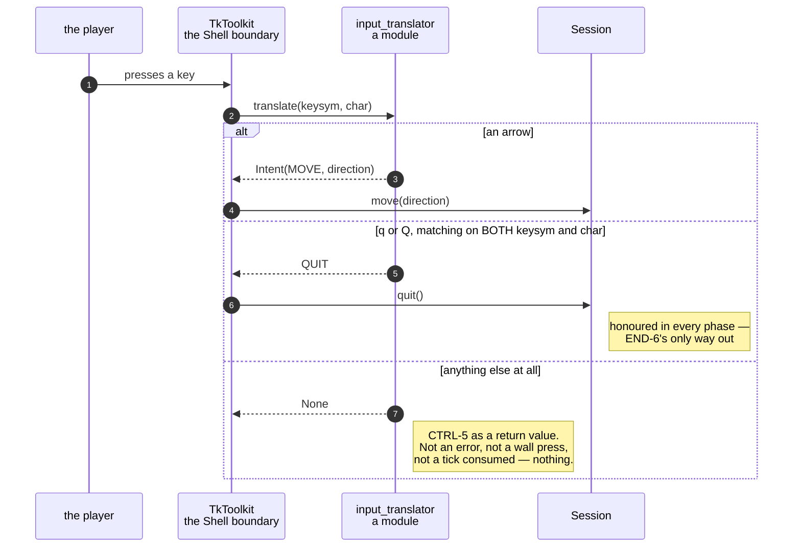

# A key press becomes an intent, and an unknown key becomes nothing

**Priority: `HIGH`** — every key the player presses passes through here, and it is the only route by which a game can be driven or left. A fault makes the game unplayable or, worse, unquittable. [What the priorities mean](SCENARIO_INDEX.md#what-the-priorities-mean).

CTRL-1[^codes] names the four arrow keys. CTRL-4 says `q` leaves the game, in
upper case or lower. CTRL-5 says **no other key does anything**. END-6 says `q`
is the only way out of a finished game.

Four sentences, and between them they describe a very small vocabulary: five
keys, and everything else deliberately inert. This module is where a toolkit
event becomes one of those five, or becomes nothing at all.

## Nothing is the answer, and it is a real answer

[`translate`](../../terminal_game/presentation/input_translator.py#L119) returns
an [`Intent`](../../terminal_game/presentation/input_translator.py#L82) or
`None`. `None` is not a failure and is not an error: it is CTRL-5 expressed as
a return value. A function key, a letter, a modifier, a mouse report — each
arrives, is recognised as nothing, and is discarded by the caller.

That matters more than it sounds. The alternative designs both go wrong:
raising on an unknown key makes a stray keystroke fatal, and silently treating
an unknown key as "no move" makes it indistinguishable from a press into a
wall, which is a real outcome with its own rule.

## Two facts about a key, not one

`translate` takes both a **keysym** and a **char**, and uses them differently:

```python
direction = ARROW_KEYS.get(keysym)
...
if keysym in QUIT_KEYS and char in QUIT_KEYS:
    return QUIT
```

An arrow is identified by its keysym alone — arrows have no character. `q` is
required to match on **both**, and that belt-and-braces is worth keeping: a
keysym of `q` arriving with some other character, or the reverse, is not a
player pressing `q`, and the only way out of a finished game is not a thing to
guess at.

[`QUIT_KEYS`](../../terminal_game/presentation/input_translator.py#L116) is a
`frozenset` of `q` and `Q`, which is CTRL-4's "upper or lower case" stated once
rather than as a `.lower()` call at the point of use.

## The vocabulary is the module's, and the layers are kept apart

The intent vocabulary —
[`IntentKind`](../../terminal_game/presentation/input_translator.py#L70),
[`Intent`](../../terminal_game/presentation/input_translator.py#L82),
[`QUIT`](../../terminal_game/presentation/input_translator.py#L94) and
[`move`](../../terminal_game/presentation/input_translator.py#L97) — lives in
Presentation, and the session in the Application layer consumes it.

The direction of that dependency is the point. Presentation may name
Application and Domain; Application may not name Presentation. So the session
cannot be handed a Tk event and cannot import anything that knows what one is.
What crosses the seam is a value with two fields, and the toolkit stops at the
Shell boundary.

| Class | What it represents, and its part in this scenario |
| --- | --- |
| [`input_translator`](../../terminal_game/presentation/input_translator.py) | A module of plain functions. In this scenario it is the **interpreter**, and the only place a keysym is given a meaning |
| [`Intent`](../../terminal_game/presentation/input_translator.py#L82) | A kind and an optional direction. In this scenario it is **the thing that crosses the seam** — small enough that the Application layer need know nothing about keyboards |
| [`IntentKind`](../../terminal_game/presentation/input_translator.py#L70) | Move or quit, and nothing else. In this scenario it is **the whole vocabulary**: a third kind would need a transition before it could be reached |
| [`Direction`](../../terminal_game/domain/maze.py) | One of four. In this scenario it is the **payload of a move**, and it comes from the Domain rather than being invented here |
| [`Session`](../../terminal_game/application/session.py) | The game as a state machine. In this scenario it is the **consumer**, and it never sees a key |



## Related scenarios

- **An arrow key moves the player one square and eats the dot it lands on** —
  what a `MOVE` intent causes.
- **A session goes Playing → Decided → Ended, and only `q` leaves it** — what a
  `QUIT` intent causes, and why it is honoured in every phase.
- **The window closes itself when the session ends** — where `q` finally leads.

### Footnotes

[^codes]: Requirement codes are the specification's own, in
    [`docs/FUNCTIONAL_REQUIREMENTS.md`](../FUNCTIONAL_REQUIREMENTS.md).
