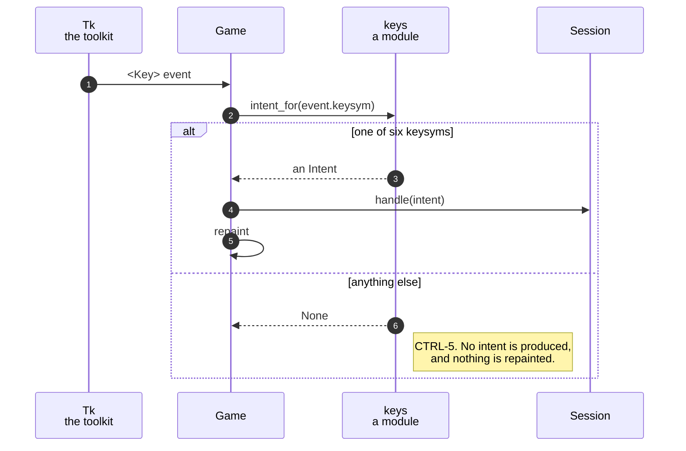

# A key press becomes an intent, and an unknown key becomes nothing

**Priority: `HIGH`** — it is the only route by which a player can do anything at all, and it is on the path of every key press. [What the priorities mean](SCENARIO_INDEX.md#what-the-priorities-mean).

[`intent_for`](../../terminal_game/presentation/keys.py#L62) is the whole of
this scenario: a string in, an [`Intent`](../../terminal_game/application/turn.py#L44)
or `None` out. It names no toolkit, opens no window, holds no state and is
six entries long. CTRL-1, CTRL-4 and CTRL-5[^codes] are all of it.

The reason it is worth a document is not the lookup. It is the seam: **the part
that knows a key was pressed never learns what it means, and the part that knows
what it means never learns there is a window.**

## What actually arrives

A **keysym** — the name Tk puts in `event.keysym`. Not a character, not a key
code, not a binding name. `"Up"`, `"q"`, `"F1"`, `"Shift_L"`.

```python
ARROW_INTENTS = {"Up": Intent.MOVE_NORTH, "Down": Intent.MOVE_SOUTH, ...}
QUIT_KEYSYMS  = frozenset({"q", "Q"})
```

**It is read strictly, and that is a decision rather than an oversight.**
`"<Key-Up>"` is a *binding* name rather than a keysym and means nothing here;
neither does `"up"`. Being lenient about either would turn a wiring mistake into
a silent one — and the wiring mistake worth worrying about is precisely the one
where the arrows quietly stop working.

**`q` and `Q` are two keysyms, not one case-folded comparison.** Tk reports the
shifted and unshifted key under different names, and folding would also swallow
anything else that happened to fold onto them.

## CTRL-5 is `None`, and `None` is not an intent

    *"Any other key does nothing."*

The translator expresses that by producing **no intent**, rather than by an
intent that means *do nothing*. Those are genuinely different: an intent for
doing nothing would have to be handled by everything downstream, and would
eventually be handled wrongly by one of them. A `None` gets no further than the
line that receives it —
[`Game.handle_key`](../../terminal_game/shell/game.py#L170) returns, and
**nothing is repainted for it either.**

## Six keysyms, and the one binding that needs no list

The intended wiring is a single binding, which is why this module exports
`TRANSLATED_KEYSYMS` for tests and not for callers:

```python
root.bind("<Key>", lambda event: handle(intent_for(event.keysym)))
```

A shell that binds `<Key>` once needs no list of keys from here and **cannot
fall out of step with this module when the list changes**. A shell that bound
each arrow separately would have to be edited every time the alphabet did.

## Knowing Tk's vocabulary without depending on Tk

This module is in the Presentation layer, which may not name the toolkit —
[only the painting surface may](../../tools/layer_rule.py#L45). So it knows Tk's
names for six keys while importing nothing from Tk, and the claim that those are
in fact Tk's names is checked in the suite against a real Tk rather than
believed.

| Participant | What it represents, and its part in this scenario |
| --- | --- |
| [`keys`](../../terminal_game/presentation/keys.py) | A module of one function. In this scenario it is **the whole rule**: six keysyms mean something and everything else means nothing |
| [`Intent`](../../terminal_game/application/turn.py#L44) | Four moves and a quit. In this scenario it is **the shared alphabet** — defined a layer below, so the input side and the session cannot each invent their own |
| [`Game`](../../terminal_game/shell/game.py#L90) | The assembly. In this scenario it is **the only caller**, and the place CTRL-5 stops |
| [`Session`](../../terminal_game/application/session.py#L85) | The game being played. In this scenario it is **what an intent is for**, and it never sees a keysym |



## Related scenarios

- **An arrow key moves the player one square and eats the dot it lands on** —
  what happens to a move intent once the session has it.
- **A session goes Playing → Decided → Ended, and only `q` leaves it** — what
  happens to the quit intent, in every phase.

### Footnotes

[^codes]: Requirement codes are the specification's own, in
    [`docs/FUNCTIONAL_REQUIREMENTS.md`](../FUNCTIONAL_REQUIREMENTS.md).
