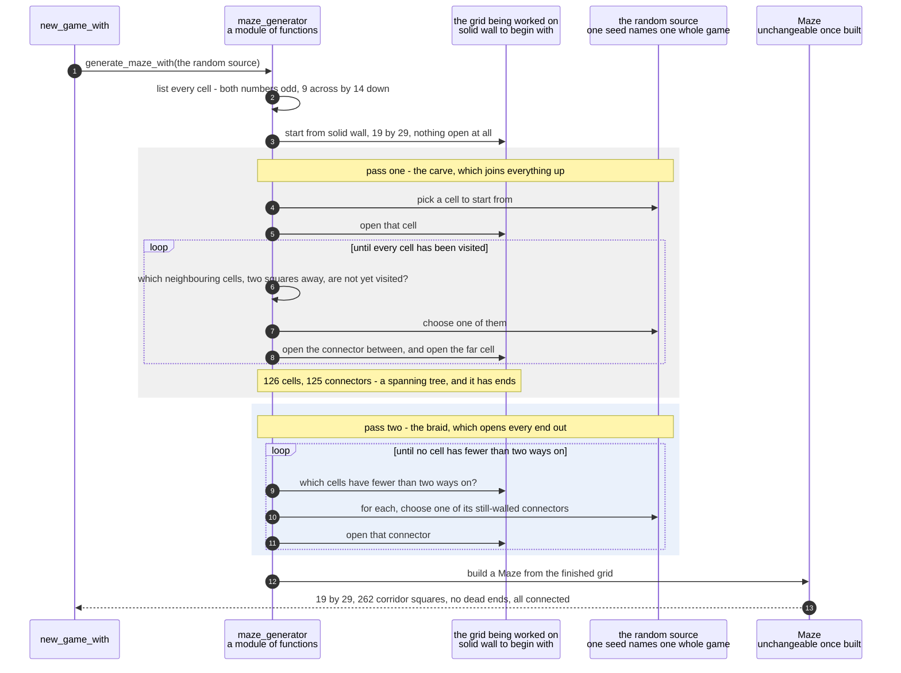

# A maze is carved into a spanning tree and then braided until no dead ends remain

**Priority: `MEDIUM`** — this runs once at the start of each game rather than on the path of every picture. A game survives a fault here and will still draw and still be playable. What is lost is the arena being fair: a player trapped in a pocket, or a dot they can never reach. [What the priorities mean](SCENARIO_INDEX.md#what-the-priorities-mean).

Every game gets a maze nobody has seen before. It is 19 squares across and 29
deep, it has a solid wall right around the outside, its corridors are one square
wide, **every corridor square has at least two ways out of it**, and every
corridor square can be walked to from every other one.

Those last two are the interesting ones, because they are properties of the whole
grid rather than of any one square. You cannot look at a square and say whether
the maze is fully connected. Requirement MAZE-5[^codes] forbids dead ends so that
a player is never trapped in a pocket with a ghost coming. Requirement MAZE-6
requires everything to be reachable so that no dot can be laid somewhere the
player can never get to — which would make winning impossible without anything
looking wrong.

The maze is made in two passes, and each pass exists to fix what the other one
cannot do alone. The first is a **carve**. It wanders through the grid opening
squares, and it is careful never to open its way into somewhere it has already
been. The result is a shape with a name: a **spanning tree**[^tree]. Everything
is joined to everything, and there is exactly one route between any two points.
That delivers MAZE-6 completely. But trees have ends — the outermost twigs — and
those ends are dead ends, so it fails MAZE-5 badly.

The second pass is a **braid**. It finds every dead end and opens one more wall
next to it, giving it a second way out. Opening a wall can only ever *add* ways
on, so this pass cannot create a dead end while removing one, and it cannot
disconnect anything the carve already joined up. It keeps going until there are
no dead ends left.

The whole thing rests on one rule that is easy to miss and expensive to get
wrong, so it is stated first.

## The odd lattice, and why nothing is ever opened off it

Number the squares from `(0, 0)` at the top left. Call a square a **cell** when
both its numbers are odd, and a **connector** when exactly one of them is.
Squares where both numbers are even are never opened by either pass. That single
rule delivers two requirements at once, and it delivers them by construction
rather than by testing.

**Corridors are one square wide (MAZE-2).** Take any block of two squares by two.
One of its two columns has an even number and one of its two rows has an even
number, so exactly one of the four squares has both numbers even. That square is
wall. So no two-by-two block can be all corridor, and a corridor can never be two
squares wide — not on most mazes, but on every maze this code will ever produce.

**A solid border (MAZE-3).** Cells run from 1 to one short of the far edge, and a
connector always lies between two cells, so nothing on the outside ring is ever
opened. The border is simply the squares the two passes cannot reach.

This is caution C8[^cautions], and it is aimed at the braid in particular. The
carve stays on the lattice naturally, because it moves two squares at a time. The
braid is the one that is looking for *any* wall it could open, so it is the one
that would wander off and make a two-by-two block if it were not held there. It
is held there.

| Class | What it represents, and its part in this scenario |
|---|---|
| [`maze_generator`](../../terminalgame/domain/maze_generator.py) | A module of plain functions rather than a class. In this scenario it is the **maker**. [`generate_maze_with`](../../terminalgame/domain/maze_generator.py#L85) runs the two passes and hands back a finished maze. Nothing in it is public except the two entry points and one error: both passes are private, because the halfway state between them is a grid with dead ends in it and nothing outside should ever hold one |
| [`Maze`](../../terminalgame/domain/maze.py#L76) | A finished maze, unchangeable once built. In this scenario it is the **result and the examiner**. It is built at the very end from a grid of squares, and the questions the promises are checked with are its own: [`ways_on`](../../terminalgame/domain/maze.py#L150) counts the exits from a square, and [`reachable_from`](../../terminalgame/domain/maze.py#L170) walks everything that can be walked to. It holds no screen geometry at all — a square is a square |
| [`Direction`](../../terminalgame/domain/maze.py#L34) | One of the four sides of a square. In this scenario it is the **whole of the geometry**. There are exactly four, [in a fixed order](../../terminalgame/domain/maze.py#L66), and the fixed order is what makes a maze grown from a given seed[^seed] come out identical every time |
| [`MazeTooSmall`](../../terminalgame/domain/maze_generator.py#L62) | A grid that cannot hold a maze with no dead ends. In this scenario it is the **refusal**. A grid with an even side, or with fewer than two cells in a direction, has a cell that no amount of braiding could give a second way out — so it is refused at the start with a sentence saying which requirement cannot be met, rather than producing a maze that quietly breaks one |

## Carving a tree, then opening every dead end out

| Step | Message | What is going on |
|---:|---|---|
| 1 | [`generate_maze_with`](../../terminalgame/domain/maze_generator.py#L85)`(the random source)` | The random source is handed **in** rather than made here. That is what lets one seed name a whole game — the same source is used for the maze, for where the two characters start and for every choice the ghost makes. With two separate sources a seed would reproduce the maze but not the game played on it, and reproducing the whole game is the point |
| 2 | list every cell - both numbers odd, 9 across by 14 down | A 19 by 29 grid has 9 cells across and 14 down, which is 126 cells. This is also where a grid that cannot work is [refused](../../terminalgame/domain/maze_generator.py#L102): an even side would put the last cell hard against the border with no room for its ring of wall, and a lattice only one cell wide would have cells with a single neighbour that no braiding could ever give a second way out |
| 3 | start from solid wall, 19 by 29, nothing open at all | Everything is wall and the carve opens squares out of it. The border of requirement MAZE-3 is not drawn on afterwards. It is simply what is left where the two passes never reach |
| 4 | pick a cell to start from | Anywhere on the lattice. The starting point does not matter, because the carve visits every cell wherever it begins |
| 5 | open that cell | The first square of corridor in a grid that was entirely wall a moment ago. From here the carve never opens a cell it has already reached, and that single restraint is what makes the result a tree rather than a tangle |
| 6 | which neighbouring cells, two squares away, are not yet visited? | **Two squares away**, never one. That is what keeps the carve on the lattice without needing a rule to say so: moving two at a time from an odd number always lands on another odd number |
| 7 | choose one of them | The randomness. When there are none — every neighbour already visited — the carve steps back the way it came and tries elsewhere, which is what makes it wander rather than run in a straight line. It is written to step back through a list rather than by calling itself, because the depth of the stepping-back is the length of the longest path through the maze and there is no reason to spend memory on it |
| 8 | open the connector between, and open the far cell | Two squares opened per step: the cell being reached, and the one square between it and where the carve came from. That single square is what joins them |
| 9 | which cells have fewer than two ways on? | Only **cells** can be dead ends, and that is worth pausing on. A connector has exactly two squares next to it that could ever be corridor — the two cells it joins — and both of those are open by the time the connector is. So walking the cells is walking every square that could possibly need opening out |
| 10 | for each, choose one of its still-walled connectors | Chosen only from connectors that lead to another cell, so the braid stays on the lattice exactly as the carve did. This is the line caution C8 is about |
| 11 | open that connector | This always ends. Each step opens a wall that was closed, there are only so many connectors, and opening one never takes a way out away from anything. So the number of dead ends can only fall |
| 12 | build a `Maze` from the finished grid | The grid stops being something that is worked on and becomes something that is only ever asked questions. From here on the maze cannot change for the rest of the game |
| 13 | 19 by 29, 262 corridor squares, no dead ends, all connected | Measured on the maze grown from seed 7. Across thirty different seeds the corridor count ran from 260 to 268 — it varies because the braid opens a different number of extra walls depending on how many ends the carve happened to leave. The two promises were checked directly on that maze: the smallest number of ways on from any corridor square is 2, and the set of squares reachable from the player's starting square is the whole set of corridor squares |

The two coloured bands mark the two passes, and the reason to draw them
separately is that they have opposite jobs. The carve **joins** and leaves ends.
The braid **removes ends** and cannot un-join. Neither could do the other's job:
a carve that avoided making ends would have to make loops, and then it would no
longer be visiting each cell exactly once. Putting them in that order, and only
that order, is what gets both requirements at the same time.

There is one thing in this collaboration that should be impossible and is checked
for anyway. If the braid ever finds a dead-end cell with no walled connector left
to open, it [stops loudly](../../terminalgame/domain/maze_generator.py#L62)
rather than going round for ever. That cannot happen while every cell has two
lattice neighbours, which the first step guarantees — so the check exists to turn
a silent endless loop into a sentence somebody can read, in the one place where a
mistake in the earlier reasoning would otherwise hang the game before it started.

## Related scenarios

- [A new game puts the player in the middle, the ghost far away, and a dot on every other square](a-new-game-puts-the-player-in-the-middle-the-ghost-far-away-and-a-dot-on-every-other-square.md)
  — what happens to the finished maze immediately afterwards, and why neither
  character can be given a fixed starting square once the maze is random.
- [A wall square chooses its double-line glyph from its four neighbours](a-wall-square-chooses-its-double-line-glyph-from-its-four-neighbours.md)
  — the pair to this document. One makes a shape out of open and closed squares
  knowing nothing about how it will look, and the other turns that shape into
  lines knowing nothing about how it was made.
- [A clock tick moves the ghost, which is never told where the player is](a-clock-tick-moves-the-ghost-which-is-never-told-where-the-player-is.md)
  — why the no-dead-ends promise matters while a game is being played, and what
  the ghost does on the rare occasions it is broken by hand in a test.

### Footnotes

[^codes]: A **requirement code** is a short name such as `WIN-2` or `GHOST-1`
    given to one sentence of
    [the specification](../FUNCTIONAL_REQUIREMENTS.md). There are 49 of them,
    in ten groups, and the group name says what the sentence is about: `GAME`,
    `WIN` for the window, `SCRN` for what is on screen, `MAZE`, `START`, `CTRL`
    for the controls, `GHOST`, `SCORE`, `END` for how a game finishes, and
    `STAT` for the bottom row. They are quoted throughout the code as well as
    in these documents, so a reader who finds `CTRL-3` in a comment can look up
    the exact sentence it is keeping.

[^tree]: A **spanning tree** is a way of joining up a set of points so that
    every point can be reached from every other, and there is exactly one route
    between any two. "Spanning" means it reaches all of them and "tree" means it
    has no loops. It is the most economical possible joining-up: remove any one
    link and something becomes unreachable. In a maze that produces the
    strongest possible connectivity and the worst possible corridors, because a
    shape with no loops is a shape made entirely of branches, and branches end.

[^cautions]: A **caution** is a numbered warning in
    [the architecture document](../ARCHITECTURE.md), written before any code
    existed, about something known to be easy to get wrong — `C1` is "never act
    on the front window", `C9` is "redraw the whole frame each pass, not dirty
    cells". Each names one specific way this program could break rather than
    giving general advice, and several of them are quoted in the code at the
    exact line that obeys them.

[^seed]: A **seed** is a number that decides what a run of random choices will
    be. The same seed always gives the same sequence, so "random" here means
    "unpredictable to a player" rather than "different every time no matter what".
    One seed names one whole game in this program: it is used for the maze, for
    where the two characters start, and for every choice the ghost ever makes,
    because [a single random source is threaded through all
    three](../../terminalgame/game_main.py#L68). With two sources a seed would
    reproduce the maze but not the game played on it.
