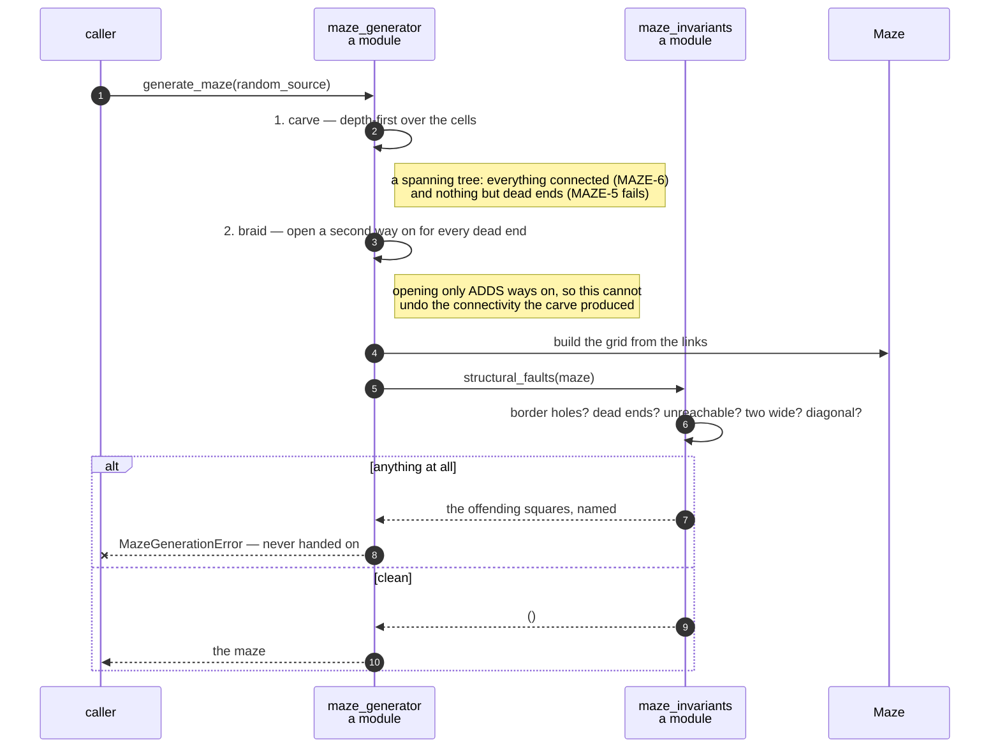

# A maze is carved into a spanning tree, and then braided until no dead ends remain

**Priority: `MEDIUM`** — it runs once per game, before anything is drawn. A fault does not stop the game and may not even be visible, which is exactly why it earns a document: the technical lead named this the single algorithm most likely to ship subtly wrong. [What the priorities mean](SCENARIO_INDEX.md#what-the-priorities-mean).

Six requirements bear on the maze, and two of them pull against each other.
MAZE-5[^codes] asks that there be **no dead ends**. MAZE-6 asks that **every
corridor square be reachable from every other**. MAZE-4 asks that the layout be
different every game. MAZE-2 wants corridors one square wide and MAZE-3 a solid
border.

The obvious generators satisfy connectivity and produce dead ends in quantity.
This one gets both by doing the job in three stages and then checking its own
work.

## Everything stays on the odd lattice, and two requirements fall out

Number the squares from `(0, 0)`. Call a square a **cell** when both its
coordinates are odd, and a **connector** when exactly one is. Squares with two
even coordinates are never carved — and that single rule delivers two
requirements without any code that mentions them:

- **MAZE-2, corridors one square wide.** In any 2 × 2 block, one column has an
  even *x* and one row an even *y*, so exactly one of the four squares has both
  even. That square is wall. No 2 × 2 block can be all corridor, so a corridor
  can never be two wide — not by measurement over some number of mazes, but by
  construction, on every maze this will ever produce.
- **MAZE-3, a solid border.** Cells run from 1 to width − 2, and a connector
  always lies between two cells, so nothing on the outermost ring is ever
  carved. The border is simply what the carve cannot reach.

## Carve, repair, verify

**1. Carve** — a depth-first walk over the cells, opening the connector to each
unvisited cell as it is first reached. That visits every cell exactly once and
opens exactly one connector per cell after the first, so the corridors form a
spanning tree. Everything is connected, so MAZE-6 holds. And a spanning tree is
nothing but dead ends, so MAZE-5 does not.

**2. Repair** — braiding. Every cell with only one way on gets a second
connector opened, chosen at random from the walled connectors that lead to
another cell. Opening a connector only ever *adds* ways on, so this cannot
create a dead end while removing one, and cannot disconnect what the carve
joined. It stops when no dead end is left.

Note why the braid must also stay on the lattice. The carve naturally does; the
braid is looking for *any* wall it can open, and left free would wander onto an
even-even square and make a 2 × 2 block. It is held there deliberately.

**3. Verify** — and this is the stage worth the document.

## It checks its own work, and refuses rather than shipping

[`maze_invariants`](../../terminal_game/domain/maze_invariants.py) is a module
of five questions, each of which returns the offending squares rather than a
boolean:

| | |
| --- | --- |
| [`holes_in_border`](../../terminal_game/domain/maze_invariants.py#L28) | MAZE-3 |
| [`dead_end_squares`](../../terminal_game/domain/maze_invariants.py#L48) | MAZE-5 |
| [`unreachable_corridor_squares`](../../terminal_game/domain/maze_invariants.py#L61) | MAZE-6 |
| [`two_wide_corridor_squares`](../../terminal_game/domain/maze_invariants.py#L82) | MAZE-2 |
| [`diagonal_only_corridor_pairs`](../../terminal_game/domain/maze_invariants.py#L103) | MAZE-2, the diagonal case |

[`structural_faults`](../../terminal_game/domain/maze_invariants.py#L136)
gathers them, and
[`MazeGenerationError`](../../terminal_game/domain/maze_generator.py#L71) is
raised rather than a faulty maze being handed on:

> a maze that breaks MAZE-2, MAZE-3, MAZE-5 or MAZE-6 is never handed to the
> rest of the program

This is the part that makes the algorithm safe to be subtle. The argument above
— the 2 × 2 block, the spanning tree, the braid that only adds — is a proof,
and proofs about code are only as good as the code matching them. Checking
every generated maze against the requirements it is supposed to satisfy costs
one pass over 551 squares and turns a subtle wrongness into a loud failure.

Returning the offending *squares* rather than `False` matters too: a generator
that failed would otherwise leave you with a seed and no idea where to look.

| Class | What it represents, and its part in this scenario |
| --- | --- |
| [`maze_generator`](../../terminal_game/domain/maze_generator.py) | A module of plain functions. In this scenario it is **the builder**: carve, braid, and refuse |
| [`maze_invariants`](../../terminal_game/domain/maze_invariants.py) | A module of five questions. In this scenario it is **the inspector**, and it is deliberately separate so that the tests can ask the same questions the generator does |
| [`Maze`](../../terminal_game/domain/maze.py) | The finished grid, immutable. In this scenario it is **the product**, and it is only constructed once the checks have passed |
| [`MazeGenerationError`](../../terminal_game/domain/maze_generator.py#L71) | A maze that broke its own requirements. In this scenario it is the **refusal** |
| [`random.Random`](https://docs.python.org/3/library/random.html) | Handed in, never created. In this scenario it is **MAZE-4 and reproducibility at once**: a different maze every game, and the same maze every time from a seed |

## Related scenarios

- **A new game puts the player in the middle, the ghost far away, and a dot on
  every other square** — what is done with the maze once it exists.
- **A wall square chooses its double-line glyph from its four neighbours** — how
  this grid becomes something a player can read.
- **A clock tick moves the ghost** — MAZE-5 is why the ghost is almost never
  forced to turn back.

### Footnotes

[^codes]: Requirement codes are the specification's own, in
    [`docs/FUNCTIONAL_REQUIREMENTS.md`](../FUNCTIONAL_REQUIREMENTS.md).
