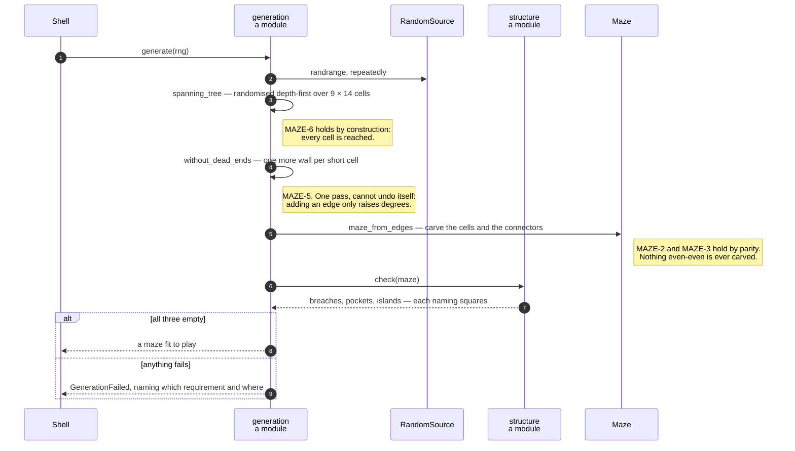

# A maze is carved on a lattice of odd cells, then braided until no dead ends remain

**Priority: `MEDIUM`** — it runs once per game, but a maze with a pocket or an unreachable dot makes the game unwinnable. [What the priorities mean](SCENARIO_INDEX.md#what-the-priorities-mean).

[`generate`](../../terminal_game/domain/generation.py#L289) is four lines and
four requirements. MAZE-2 wants corridors exactly one square wide, MAZE-3 a
solid border, MAZE-4 a new layout every run, MAZE-5 no dead ends and MAZE-6 full
connectivity[^codes].

The architect's caution C4 called this the biggest algorithmic risk in the
project, because the obvious generators — recursive backtracking, Prim —
satisfy connectivity and then produce dead ends by the dozen.

**Two of the constraints are made impossible rather than repaired, one comes
free with the carve, and only one needs a repair pass at all.**

## The lattice, and the two requirements it removes

Carving happens on a lattice of **cells at odd coordinates**: cell *(i, j)* is
the square `Position(2i + 1, 2j + 1)`, and two adjacent cells are joined by
opening the single square between them. That gives **9 cells across and 14
deep** inside a 19 × 29 grid, because 19 = 2·9 + 1 and 29 = 2·14 + 1.

From that one choice:

**MAZE-2 holds by parity.** Any 2 × 2 block of squares contains one whose
column and row are both even. Cells are odd–odd and connectors have exactly one
even coordinate, so a both-even square is never carved — and a corridor two
squares wide is **not merely unlikely, it cannot be represented.**

**MAZE-3 holds by parity too.** Cells lie at columns 1–17 and rows 1–27, and a
connector lies strictly between two cells, so at columns 2–16 and rows 2–26.
Nothing the generator carves can reach column 0 or 18, or row 0 or 28.

And that the original maze was built this way is **measured, not guessed**:
decoding all 29 rows of the specimen picture gives **zero corridor squares with
both coordinates even.**

## The carve gives MAZE-6 for nothing

[`spanning_tree`](../../terminal_game/domain/generation.py#L176) is a randomised
depth-first carve with an explicit stack. Every cell is reached by construction,
so connectivity holds of the result **and of anything built from it by adding
more edges** — which matters, because the next step only adds.

The stack is explicit rather than recursive. 126 cells would not trouble the
recursion limit; a carve that cannot overflow is simply one less thing for
anyone to wonder about.

## The braid, and why caution C4 did not bite

A spanning tree is all dead ends.
[`without_dead_ends`](../../terminal_game/domain/generation.py#L220) gives every
cell a second way on by opening one more wall.

**It converges in a single pass and cannot undo itself**, and the argument is
short enough to check:

- adding an edge only ever **raises** two degrees, so it never creates a dead
  end while removing one;
- adding an edge never disconnects anything already joined;
- every cell has at least two lattice neighbours, so a cell short of ways on
  always has a spare one to use.

C4 expected a repair loop that might not settle. **On this lattice there is
nothing for it to fight with** — and that is worth knowing as a shape, not just
as a fact about mazes: the risk was retired by choosing a representation in
which the two constraints cannot conflict, rather than by making the loop
cleverer.

## The gate, and the oracle behind it

[`verified`](../../terminal_game/domain/generation.py#L273) refuses to hand out
a maze that fails its own structural check, raising
[`GenerationFailed`](../../terminal_game/domain/generation.py#L95) rather than
returning something unplayable. An unreachable dot makes the game unwinnable
and a pocket traps the player; both must fail loudly at generation rather than
puzzlingly half an hour later.

The check is [`structure.check`](../../terminal_game/domain/structure.py#L158),
and two things about it are deliberate.

**It answers three questions independently**, each naming *which squares* fail
rather than whether any do. A carve-then-repair generator that only ever heard
"sound" or "not sound" would have no way to tell whether its last repair
helped.

**It is ignorant of how the maze was made.** It reads a maze and says what is
true of it — which is why **the same oracle the tests use is the one the
generator asks.** The generator cannot be sound by its own definition and broken
by everyone else's.

## Replayable, because randomness arrives as an argument

The Domain names no module-level random source, so this module does not import
`random` and could not. [`RandomSource`](../../terminal_game/domain/generation.py#L60)
is one method, `randrange`, and `random.Random` satisfies it.

The shuffle is written out from `randrange` rather than taken from the source,
so **a maze depends only on the sequence of integers it was given** and not on
the shuffling algorithm of whatever library supplied them. Same seed, same maze,
across Python versions — which is the entire value of being able to replay one.

| Participant | What it represents, and its part in this scenario |
| --- | --- |
| [`generation`](../../terminal_game/domain/generation.py) | A module of plain functions. In this scenario it is **the generator**, and its lattice is where two requirements go away |
| [`Cell`](../../terminal_game/domain/generation.py#L78) | A place on the carving lattice, *not* a grid square. In this scenario it is **the type that keeps the two coordinate systems from being confused** |
| [`Maze`](../../terminal_game/domain/maze.py#L115) | The grid. In this scenario it is **the product**, built by carving from `all_walls` |
| [`structure`](../../terminal_game/domain/structure.py) | A module. In this scenario it is **the oracle** — three independent questions, each naming the squares that fail it |
| [`RandomSource`](../../terminal_game/domain/generation.py#L60) | One method, `randrange`. In this scenario it is **why a seed replays**: the shuffle is written out from it rather than taken from the library |
| [`GenerationFailed`](../../terminal_game/domain/generation.py#L95) | The gate's refusal. In this scenario it is **what a maze unfit to play becomes** — raised, never returned |
| [`StructureReport`](../../terminal_game/domain/structure.py#L91) | Breaches, pockets, islands. In this scenario it is **the gate's verdict**, and what a failure message is built from |

## Related scenarios

- **A new game puts the player in the middle, the ghost far away, and a dot on
  every other square** — what happens to the maze next.
- **A tick moves the ghost, which is never told where the player is** — why
  MAZE-5 makes the ghost's reverse clause unreachable.
- **A wall square chooses its double-line glyph from its four neighbours** — how
  the result is drawn.

### Footnotes

[^codes]: Requirement codes are the specification's own, in
    [`docs/FUNCTIONAL_REQUIREMENTS.md`](../FUNCTIONAL_REQUIREMENTS.md).
