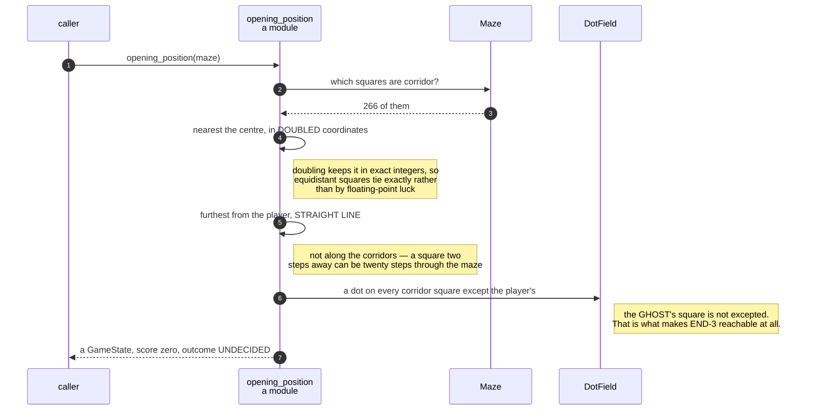

# A new game puts the player in the middle, the ghost far away, and a dot on every other square

**Priority: `MEDIUM`** — it runs once per game and never again. A fault would be visible on the very first frame, which is the kind that gets caught; but one of its decisions quietly determines whether a specified requirement is reachable at all. [What the priorities mean](SCENARIO_INDEX.md#what-the-priorities-mean).

START-1[^codes] puts the player on the corridor square nearest the middle.
START-2 puts the ghost on the corridor square furthest from the player,
"measured across the grid rather than along the corridors". START-3 puts a dot
on every corridor square **except the one the player starts on**. START-4 sets
the score to nothing. START-5 says the game is under way from the first instant.

[`opening_position`](../../terminal_game/domain/opening_position.py#L115) is
five lines that do all of it, and every one of the five is a requirement.

## Doubling, so the middle is a whole number

The centre of a 19 × 29 grid is the point (9, 14), which is a square. The
centre of an even-sided grid falls *between* squares — and the function must
work for both, because the size is a parameter.

Rounding would work and would need justifying: round which way, and why?
Instead, [`player_start_square`](../../terminal_game/domain/opening_position.py#L68)
doubles everything:

```python
doubled_centre_column = maze.width - 1
...
(2 * square.column - doubled_centre_column) ** 2 + ...
```

Doubling scales every distance by the same factor, so it cannot change which
square is nearest, and it keeps the whole calculation in exact integers. Two
squares that are genuinely equidistant tie exactly, rather than tying or not
according to floating-point error. Ties then go to the first square in
row-major order — stated in the key rather than inherited from whatever order
the corridors happen to come back in.

## Across the grid, not along the corridors

[`ghost_start_square`](../../terminal_game/domain/opening_position.py#L88) is
emphatic about a distinction the requirement makes and a reader might not:

> **Not the furthest along the corridors.** A square two steps away in a
> straight line can be twenty steps away through the maze, and the requirement
> says the straight line.

So the two actors start far apart *as the crow flies*, and may be much closer
or much further apart as the player actually walks. That is what START-2 asks
for, and the alternative — a breadth-first search along the corridors — would
be a different and defensible game that the specification did not ask for.

Distances are compared squared, never square-rooted, for the same reason as
above: ordering by *d²* is ordering by *d*, in exact integers.

## The line that makes END-3 reachable

```python
dots=DotField.over_corridors_except(maze, player)
```

Every corridor square gets a dot **except the player's**. The ghost's square is
not excepted — so the ghost begins standing on a dot, and a dot can still be
under it when the maze is nearly clear.

That is what makes END-3 reachable. If the ghost's square were also cleared,
the last dot could never be beneath the ghost, the win and the loss could never
become true in the same move, and the ordered rule that decides between them
would describe a state no game could produce.

It is worth noticing because it looks like an oversight and is not. "The ghost
is standing on a dot, that seems wrong" is a plausible bug report, and acting
on it would silently delete a specified behaviour.

## Under way from the first instant

The state comes back with `Outcome.UNDECIDED` and a score of zero, and the
session paints it before any event loop starts. START-5's "the game is under
way the moment the window opens" is not a flag anywhere: it is the absence of
any state before `PLAYING`.

| Class | What it represents, and its part in this scenario |
| --- | --- |
| [`opening_position`](../../terminal_game/domain/opening_position.py) | A module of plain functions. In this scenario it is **the dealer**, and each of its five lines is one START requirement |
| [`Maze`](../../terminal_game/domain/maze.py) | The finished grid. In this scenario it is **the board**, asked only which of its squares are corridor |
| [`DotField`](../../terminal_game/domain/dot_field.py) | The dots on the board. In this scenario it is **where the reachability of END-3 is decided**, in one method name |
| [`GameState`](../../terminal_game/domain/game_state.py) | Everything true of a game at one moment. In this scenario it is **the product**, complete and playable from the instant it exists |
| [`Score`](../../terminal_game/domain/game_state.py) | In this scenario it is **START-4**, and `Score.zero()` is the only way to make one that is not an increment of another |



## Related scenarios

- **A maze is carved into a spanning tree, then braided** — where the grid comes
  from.
- **Eating the last dot on the ghost's square is a loss and not a win** — the
  requirement this scenario's third line keeps reachable.
- **A game state is composed into a 40 × 30 frame** — what happens to this state
  immediately afterwards.

### Footnotes

[^codes]: Requirement codes are the specification's own, in
    [`docs/FUNCTIONAL_REQUIREMENTS.md`](../FUNCTIONAL_REQUIREMENTS.md).
