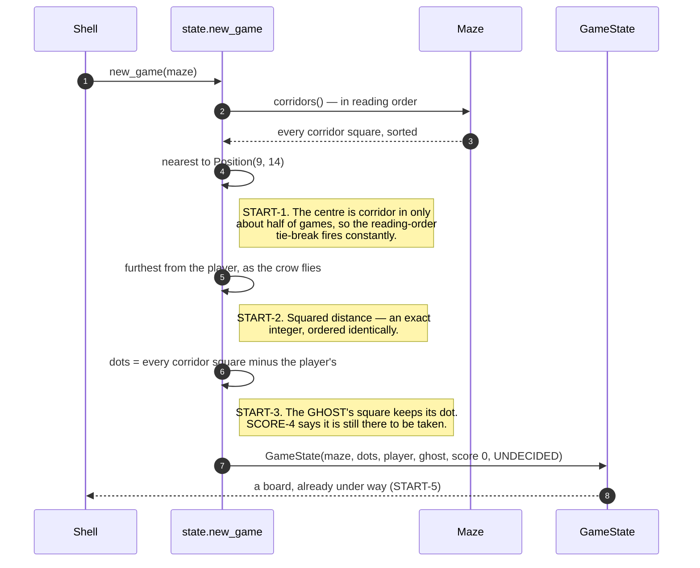

# A new game puts the player in the middle, the ghost far away, and a dot on every other square

**Priority: `MEDIUM`** — it runs once per game, and a wrong opening position is visible immediately rather than being a fault that hides. [What the priorities mean](SCENARIO_INDEX.md#what-the-priorities-mean).

[`new_game`](../../terminal_game/domain/state.py#L273) is four lines and four
requirements[^codes]:

```
START-1  the player on the corridor square nearest the grid centre
START-2  the ghost on the corridor square at the greatest straight-line
         distance from the player
START-3  a dot on every corridor square except the player's
START-4  the score at zero, and the game undecided
```

## "Nearest the middle" needs a middle that exists

[`CENTRE`](../../terminal_game/domain/state.py#L39) is `Position(9, 14)`. A
19 × 29 grid has a **true centre square** rather than a crossing point, so
START-1 has something exact to be near.

**It is not always corridor**, and the reason is the generator's lattice: row 14
is even, so the centre is a *connector* rather than a cell, and it is carved
only when that particular wall happens to be opened — **about half of real
games.**

So the tie-break is not a rare path. When the centre is wall, the two squares
one step above and below it are both at distance one, and
[`nearest_corridor_to`](../../terminal_game/domain/state.py#L80) has to choose
between them on roughly every other game.

## Ties break in reading order, and that is what makes a seed worth having

Topmost, then leftmost. It is an arbitrary rule and it is **pinned by a test**,
which is what assumption P7 asks for: the tie is the implementer's to break so
long as something fixes it.

Reading order is the one order already guaranteed stable, because
[`Maze.corridors`](../../terminal_game/domain/maze.py#L232) returns its squares
sorted rather than as a set. Without that, the same seed could open two
different games — and the ability to replay a puzzling game is the whole reason
any of this is deterministic.

## Straight-line distance, and why it is squared

START-2 says *"measured across the grid rather than along the corridors"* — as
the crow flies, ignoring walls entirely. It is worth noticing that the two give
**different answers in any maze worth the name**: the furthest square as the
crow flies is often not the furthest to walk to, and the specification chose the
one that is cheaper and less interesting on purpose.

[`distance_squared`](../../terminal_game/domain/state.py#L59) leaves it squared,
so it is **an exact integer**. Two squares are ordered the same way by the
square of their distance as by the distance itself, so nothing is lost — and
comparing integers cannot go wrong the way comparing floats eventually does.

## The ghost starts on a dot, and that is correct

START-3 excepts **the player's square and only the player's**. The ghost's
square keeps its dot, and SCORE-4 confirms it: *"the ghost neither eats dots nor
hides them; a dot under the ghost is still there to be taken."*

So the opening board has a dot the player can see under the ghost, and eating it
later is an ordinary move. The presentation layer decides what is drawn on top
of what — the ghost is painted last — and the dot is still in the state.

## What the state cannot do, which is most of START-4

The score is zero and the outcome undecided, which is one line. What is worth
more is what the type makes impossible afterwards: a negative score is rejected
in the constructor, exactly one of the four transitions touches the score, and
it adds one. **SCORE-5 is not enforced here; it is unrepresentable.**

| Participant | What it represents, and its part in this scenario |
| --- | --- |
| [`state`](../../terminal_game/domain/state.py) | A module and two classes. In this scenario it is **the opening position**, and the tie-breaks that make it reproducible |
| [`GameState`](../../terminal_game/domain/state.py#L116) | The board. In this scenario it is **the product**, immutable from the moment it exists |
| [`Maze`](../../terminal_game/domain/maze.py#L115) | The grid. In this scenario it is **the source of candidates**, and its reading-order sort is what the tie-break rests on |
| [`Position`](../../terminal_game/domain/maze.py#L60) | A coordinate. In this scenario it is **what is being chosen**, twice |
| [`Outcome`](../../terminal_game/domain/state.py#L42) | Undecided, caught, cleared. In this scenario it is **START-4's other half** |



## Related scenarios

- **A maze is carved on a lattice of odd cells, then braided until no dead ends
  remain** — where the maze comes from, and why the centre is often wall.
- **An arrow key moves the player one square and eats the dot it lands on** —
  the first thing that happens to this board.
- **A session goes Playing → Decided → Ended, and only `q` leaves it** — what
  wraps the board, and why it starts in Playing.

### Footnotes

[^codes]: Requirement codes are the specification's own, in
    [`docs/FUNCTIONAL_REQUIREMENTS.md`](../FUNCTIONAL_REQUIREMENTS.md).
