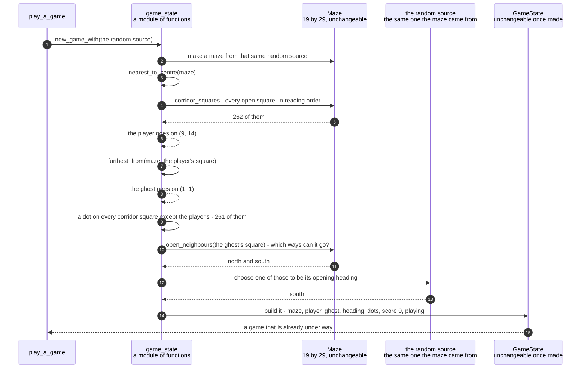

# A new game puts the player in the middle, the ghost far away, and a dot on every other square

**Priority: `MEDIUM`** — this runs once, at the start of each game. The picture survives a fault here and the game still plays. What is lost is the game being fair to begin with: a player who starts next to the ghost has lost before pressing anything. [What the priorities mean](SCENARIO_INDEX.md#what-the-priorities-mean).

A maze has just been made and nobody is standing on it. This step puts a game on
top of it: the player near the middle, the ghost as far away as the grid allows,
a dot on every corridor square except the one under the player, the score at
zero, and the ghost already heading somewhere.

The reason this needs describing at all is that **the maze is different every
time**, so neither character can be given a fixed starting square. A square that
is a nice open crossroads in one maze is solid wall in the next. So both starting
places have to be described as *questions about whatever maze turned up*, and
that is what requirements START-1 and START-2[^codes] do: "the corridor square
nearest the middle" and "the corridor square furthest from the player, measured
across the grid rather than along the corridors".

The word "furthest" hides a decision that the specification does not settle, and
the program is honest about it. There are several reasonable ways to measure how
far apart two squares on a grid are. Straight-line distance is one. Counting the
steps along and then down is another. Taking whichever of those two is larger is a
third. All three satisfy the words of START-2, and all three keep the characters
well apart. The program picks straight-line distance, writes down that it is an
assumption rather than a ruling, and puts the whole decision in [one
function](../../terminalgame/domain/game_state.py#L86) with [one sentence naming
it](../../terminalgame/domain/game_state.py#L57) beside it. If somebody decides
one of the others is wanted, exactly one function and one sentence change.

There is one small decision in here whose consequences reach much further than it
looks, and it is worth flagging now. **The player's starting square is the only
one left without a dot. The ghost's square is not excepted.** So a game can begin
with the ghost standing on a dot, and the very last dot of a game can be
underneath the ghost. That single possibility is what makes the ordering
requirement about endings reachable at all, and it has a scenario of its own.

| Class | What it represents, and its part in this scenario |
|---|---|
| [`game_state`](../../terminalgame/domain/game_state.py) | A module holding the game's vocabulary: one class for a whole game, one for how a game stands, and the functions that open a new one. In this scenario it is the **founder**. [`open_game_on`](../../terminalgame/domain/game_state.py#L260) places both characters and lays every dot, and it is kept separate from the maze-making so that a game can be opened on a maze written out by hand in a test |
| [`GameState`](../../terminalgame/domain/game_state.py#L97) | Everything true of a game at one moment, unchangeable[^immutable] once made. In this scenario it is the **thing being built**. Its list of fields is deliberately short, and the shortness is requirement GAME-3: there is no lives count, no level, no timer, no pause and no restart — not set to zero, but with nowhere to put them |
| [`Maze`](../../terminalgame/domain/maze.py#L76) | The finished grid, unchangeable. In this scenario it is the **ground being surveyed**. [`corridor_squares`](../../terminalgame/domain/maze.py#L162) hands back every open square in reading order, and the two placing questions are both answered by picking from that one list |
| [`Outcome`](../../terminalgame/domain/game_state.py#L60) | How a game stands: playing, caught or cleared. In this scenario it is the **starting position on a dial with three settings**. It begins at *playing*, and that is a positive statement that the game is under way rather than a way of saying nothing has been decided |
| [`NoCorridorToStartOn`](../../terminalgame/domain/game_state.py#L76) | A maze that cannot open a game. In this scenario it is the **refusal**. With no corridor square there is nowhere to put the player, and with exactly one there is nowhere to put the ghost that is not the player's own square, so it refuses and names the requirement that cannot be met |

## Placing two characters and 261 dots on a maze nobody has seen before

| Step | Message | What is going on |
|---:|---|---|
| 1 | [`new_game_with`](../../terminalgame/domain/game_state.py#L245)`(the random source)` | One random source for the whole game. The same one makes the maze, picks the ghost's opening heading, and goes on to make every choice the ghost ever makes. That is what lets a single seed[^seed] reproduce a whole game rather than only the maze it was played on |
| 2 | make a maze from that same random source | The two passes that produce a maze with no dead ends have a scenario of their own, listed below. All that matters here is the result: 19 by 29, a solid border, corridors one square wide, everything reachable |
| 3 | [`nearest_to_centre`](../../terminalgame/domain/game_state.py#L187)`(maze)` | Requirement START-1. Notice it is "nearest the middle" and not "the middle": the exact middle square of the grid may well be wall, and on most mazes it is |
| 4 | [`corridor_squares`](../../terminalgame/domain/maze.py#L162) - every open square, in reading order | One list, used for both placing questions and for laying the dots. Reading order means row by row, left to right |
| 5 | 262 of them | Measured on the maze grown from seed 7. It is not a fixed number: across thirty seeds it ran from 260 to 268, because the braiding pass opens a varying number of extra walls |
| 6 | the player goes on `(9, 14)` | The middle of a grid 19 across sits at 9, and of one 29 deep at 14, so on this maze the exact middle square happens to be corridor and the player gets it. There is an arithmetic detail worth knowing: the middle of a grid with an even number of squares falls **between** two squares, so rather than rounding it one way and having to justify the choice, [both the middle and every square are doubled](../../terminalgame/domain/game_state.py#L187). Doubling scales every distance by the same amount, so it cannot change which square is nearest, and it keeps the whole sum in exact whole numbers. Ties go to the first square in reading order, and that rule is written into the comparison rather than left to the order the list happens to arrive in |
| 7 | [`furthest_from`](../../terminalgame/domain/game_state.py#L216)`(maze, the player's square)` | Requirement START-2. Measured **across the grid**, not along the corridors, so the two need not be far apart as the player actually walks. That is the assumption named in the description above, and this is the only place it is applied |
| 8 | the ghost goes on `(1, 1)` | The top-left corner of the playable area, which on this maze is the corridor square furthest in a straight line from the middle — as far as it is possible to be. Distances are compared **squared**, and never square-rooted. Ordering by the squared distance gives exactly the same answer as ordering by the distance itself, and it keeps everything in whole numbers, so two squares that really are equally far away tie exactly rather than tying or not according to a rounding error |
| 9 | a dot on every corridor square except the player's - 261 of them | Requirement START-3. 262 corridor squares minus the one under the player. **The ghost's square is not excepted**, which on this maze means the ghost begins standing on a dot — checked directly, and true. That is a decision rather than an oversight, and the whole of a later requirement depends on it |
| 10 | [`open_neighbours`](../../terminalgame/domain/maze.py#L140)`(the ghost's square)` - which ways can it go? | The ghost needs a heading before anything has been pressed, because requirement START-5 says the game is under way the moment the window opens and the ghost is already moving |
| 11 | north and south | The no-dead-ends promise guarantees at least two, so this choice is never empty on a maze the generator produced. A maze written out by hand in a test could give a square with no ways out at all, and then [a fixed direction is used](../../terminalgame/domain/game_state.py#L283) rather than failing — a ghost with nowhere to go is a maze with nowhere to go, not a broken opening position |
| 12 | choose one of those to be its opening heading | Chosen from the ways it can actually travel rather than fixed. A fixed heading would point into a wall on most mazes, and the ghost would spend its first move turning round instead of moving |
| 13 | south | The ghost will travel south until the corridor stops letting it, which is the rule it follows for the rest of the game. On this maze the ghost begins in the top-left corner, so south is one of only two ways it could have gone |
| 14 | build it - maze, player, ghost, heading, dots, score 0, playing | Requirement START-4 is the score at zero. Requirement START-5 is the outcome starting at *playing*, which is a positive statement rather than "not yet decided". Seven things in total, and requirement GAME-3 is the statement that this list has no eighth |
| 15 | a game that is already under way | Handed back complete. The loop draws it immediately, before reading a single key |

The refusal is worth a last word, because it is a small piece of design that
appears several times in this program. A maze with no corridor squares at all
cannot satisfy START-1, and one with a single corridor square cannot satisfy
START-2 — there is nowhere to put the ghost that is not the player's own square.
Neither can be reached through the generator. Both can be reached by a test
handing in a maze it wrote by hand. In that case the program refuses, and [the
refusal names the requirement that cannot be met](../../terminalgame/domain/game_state.py#L304)
rather than failing somewhere further downstream with a message about an empty
list.

## Related scenarios

- [A maze is carved into a spanning tree and then braided until no dead ends remain](a-maze-is-carved-into-a-spanning-tree-and-then-braided-until-no-dead-ends-remain.md)
  — where the maze in the second step comes from, and where the promise of at
  least two ways out is made.
- [Eating the last dot on the ghost's square is a loss and not a win](eating-the-last-dot-on-the-ghosts-square-is-a-loss-and-not-a-win.md)
  — the requirement that the ninth step makes reachable, and the reason the
  ghost's square keeps its dot.
- [A clock tick moves the ghost, which is never told where the player is](a-clock-tick-moves-the-ghost-which-is-never-told-where-the-player-is.md)
  — what becomes of the opening heading chosen near the end of this document.
- [A game state is composed into a 40 by 30 frame with the ghost drawn last](a-game-state-is-composed-into-a-40-by-30-frame-with-the-ghost-drawn-last.md)
  — what the finished game is turned into, immediately, before anything is
  pressed.

### Footnotes

[^codes]: A **requirement code** is a short name such as `WIN-2` or `GHOST-1`
    given to one sentence of
    [the specification](../FUNCTIONAL_REQUIREMENTS.md). There are 49 of them,
    in ten groups, and the group name says what the sentence is about: `GAME`,
    `WIN` for the window, `SCRN` for what is on screen, `MAZE`, `START`, `CTRL`
    for the controls, `GHOST`, `SCORE`, `END` for how a game finishes, and
    `STAT` for the bottom row. They are quoted throughout the code as well as
    in these documents, so a reader who finds `CTRL-3` in a comment can look up
    the exact sentence it is keeping.

[^immutable]: An **unchangeable** value is one that cannot be altered after it
    is made. If something different is wanted, an entirely new one is built
    instead — here by
    [`with_changes`](../../terminalgame/domain/game_state.py#L128), which copies
    everything and replaces only what was named. Two things follow that this
    game relies on. Nobody can alter a game state that somebody else is holding,
    so the ghost's policy cannot quietly change a state it was only asked to look
    at. And "nothing at all happened" can be checked by asking whether the very
    same object came back, instead of listing everything that did not change and
    hoping the list is complete.

[^seed]: A **seed** is a number that decides what a run of random choices will
    be. The same seed always gives the same sequence, so "random" here means
    "unpredictable to a player" rather than "different every time no matter what".
    One seed names one whole game in this program: it is used for the maze, for
    where the two characters start, and for every choice the ghost ever makes,
    because [a single random source is threaded through all
    three](../../terminalgame/game_main.py#L68). With two sources a seed would
    reproduce the maze but not the game played on it.
