# A session goes Playing → Decided → Ended, and only `q` leaves it

**Priority: `HIGH`** — every key and every tick passes through it, and it is the only route by which a game can be brought to an end. [What the priorities mean](SCENARIO_INDEX.md#what-the-priorities-mean).

[`Session`](../../terminal_game/application/session.py#L85) is one game being
played and the state it is in. Three verbs — `handle`, `tick`, `quit` — and
three phases, and between them they hold GAME-3, START-5, END-5, END-6 and
CTRL-4[^codes].

## Three phases, and GAME-3 is met by their absence

```
PLAYING  ──────────────▶  DECIDED
   │   the board is over     │
   │                         │
   └──────── quit ───────────┴───────▶  ENDED
```

[`Phase`](../../terminal_game/application/session.py#L60) has three members.
**There is no ready state and no restart edge**, and that is the whole of
GAME-3: *"there are no lives, levels, time limits, power-ups, pause or restart:
one maze, one ghost, one outcome."*

A transition that cannot be spelled cannot be taken, so the test for GAME-3 is
largely a test that this enumeration has three members and that nothing ever
re-enters `PLAYING`. It is a requirement satisfied by a shape rather than by a
guard.

**A session begins in Playing with nothing to pass through first**, which is
START-5: *"the game is under way the moment the window opens."*

## Decided is the load-bearing one, and not for what it shows

The obvious reading of Decided is END-5 — the tick stops, moves are ignored, the
last picture stands. That is true and it is the smaller half.

The larger half is that **Decided is what keeps the board still, and therefore
what keeps the outcome honest.** The outcome is a derived function of the state,
and a derived answer is only as stable as its input. If anything ever makes the
game mutable after a decision, END-3 breaks again in a new way — and it will
break *here* rather than in the resolver.

That is why the tests assert a decided game is **unchanged** rather than that
the move was *ignored*. A session that accepted a move and then quietly undid it
would satisfy the weaker claim.

## Quit is honoured everywhere, and is idempotent

CTRL-4 says `q` quits at once and END-6 says it is the only way out of a decided
game. [`quit`](../../terminal_game/application/session.py#L192) is therefore
reachable from all three phases and does nothing on the second call.

That is not defensive coding. **The Shell will genuinely hear about a quit
twice** — a key press and a closing window — and neither should have to know
whether the other got there first. The window's `close` is idempotent for the
same reason, so the two calling each other settles at once instead of looping.

## Ending the process is not this layer's to do

Reaching Ended calls the `on_end` callback and makes `is_running` false. That is
all. **Application names no toolkit and no process**, so this is how WIN-5
reaches the window: the Shell passes something that closes it, and a test passes
something that records the call.

Likewise a tick *arrives as a call*. This module owns no clock and no timer, and
how often a beat happens is the Shell's business — which is what lets a whole
game be driven in a test with no real time passing.

## The settle step trusts the rule, not the field

[`_settle`](../../terminal_game/application/session.py) is the only non-quit
transition, and it asks
[`outcome_of`](../../terminal_game/application/turn.py#L83) rather than reading
`GameState.outcome`.

Deliberately. The stored field is *stamped* by the resolver; a board built by
hand — a fixture, a resumed game — can carry `UNDECIDED` while the player and
the ghost stand on the same square. Trusting the field would make such a board
**playable**, and Decided is precisely what must not be bypassed.

The same rule reached somewhere nobody expected. `__repr__` used to read the
stored field, so it could print `Session(decided, undecided, …)` — phase right,
outcome wrong. **`repr` is what pytest prints in a traceback**, so a misleading
one costs whoever is debugging a failed journey an hour chasing the wrong thing.
It was found by a developer reading ahead, and it is worth carrying away: *a
`repr` does not look like a component that asks whether the game is over.*

| Participant | What it represents, and its part in this scenario |
| --- | --- |
| [`Session`](../../terminal_game/application/session.py#L85) | One game being played. In this scenario it is **the subject** — three verbs, three phases, and the only thing that decides when a game is over |
| [`Phase`](../../terminal_game/application/session.py#L60) | Playing, Decided, Ended. In this scenario it is **GAME-3**, met by having no fourth member and no way back |
| [`Intent`](../../terminal_game/application/turn.py#L44) | Four moves and a quit. In this scenario it is **the only input**, and quit is the one honoured in every phase |
| [`turn`](../../terminal_game/application/turn.py) | A module. In this scenario it is **the authority on whether a board is over**, asked rather than remembered |
| [`Game`](../../terminal_game/shell/game.py#L90) | The assembly. In this scenario it is **what supplies the beat** and what acts on `on_end` |

```mermaid
stateDiagram-v2
  direction LR
  [*] --> Playing: a new game, already under way (START-5)
  Playing --> Playing: a move, or a tick
  Playing --> Decided: outcome_of says the board is over
  Playing --> Ended: quit (CTRL-4)
  Decided --> Decided: a move or a tick changes NOTHING (END-5)
  Decided --> Ended: quit — the only way out (END-6)
  Ended --> [*]: on_end fires once; the Shell closes the window
  note right of Decided
    No edge returns to Playing.
    There is no ready state and no restart:
    GAME-3 is met by what cannot be spelled.
  end note
```



## Related scenarios

- **The window closes itself when the session ends, and the process runs out of
  work** — what `on_end` is wired to, and the failure it was found by.
- **Eating the last dot on the ghost's square is a loss and not a win** — the
  requirement Decided exists to keep true.
- **The tick timer keeps the ghost's beat, and stops when the game is decided** —
  where the beat comes from and why it stops.

### Footnotes

[^codes]: Requirement codes are the specification's own, in
    [`docs/FUNCTIONAL_REQUIREMENTS.md`](../FUNCTIONAL_REQUIREMENTS.md).
