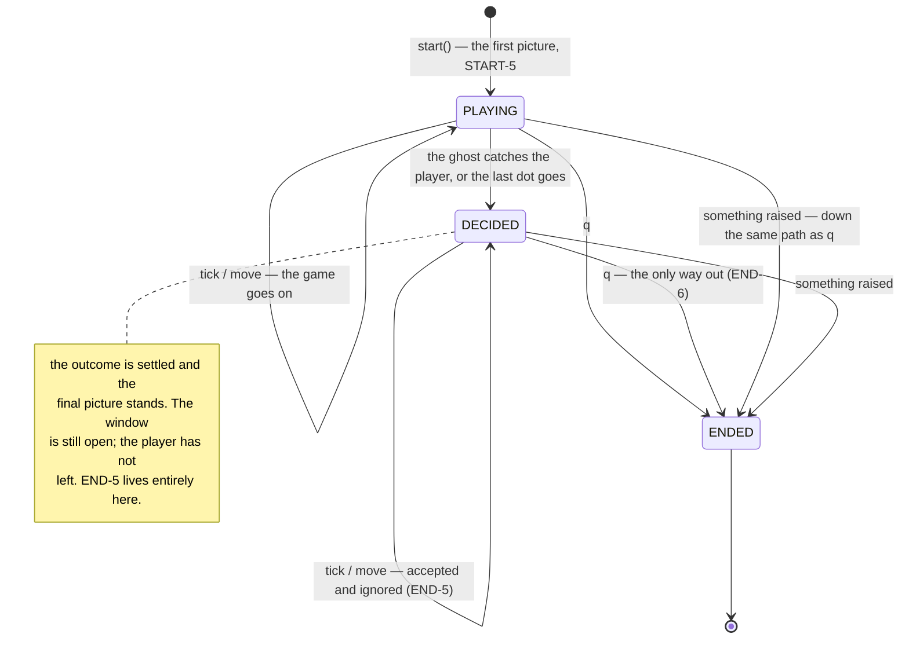

# A session goes Playing → Decided → Ended, and only `q` leaves it

**Priority: `HIGH`** — every tick and every key press goes through this object, and it is the only thing that knows whether a game is still being played. A fault here either freezes a live game or lets a finished one keep moving. [What the priorities mean](SCENARIO_INDEX.md#what-the-priorities-mean).

GAME-3[^codes] says one game per process: no lives, no levels, no restart.
END-5 says that once a game has ended everything stops — the ghost stands
still, the arrow keys do nothing, the last picture stays on screen. END-6 says
`q` still quits, and is the only way to leave a finished game.

Put together, those describe a state machine with exactly three states, one of
which the player can sit in for as long as they like.

## Three phases, and GAME-3 is why there is no fourth

[`Phase`](../../terminal_game/application/session.py#L101) has `PLAYING`,
`DECIDED` and `ENDED`, and says what it is not:

> There is no `PAUSED`, no `RESTARTING` and no `STARTING`: the specification
> rules out everything but these, and a member added here would have to be
> given a transition before it could ever be reached.

**`DECIDED` is the interesting one.** It is the interval END-5 describes: the
outcome is settled, the final picture is on screen, the ghost has stopped and
the arrows do nothing — but the window is still open and the player has not
left yet. Without it the program would have to choose between ending the
instant the outcome was decided (contradicting END-5) or pretending the game
was still playable (contradicting END-1).

## Ending is honoured everywhere; everything else is honoured only while playing

[`quit`](../../terminal_game/application/session.py#L259) is accepted in every
phase, and quitting an already-ended session does nothing:

> Honoured in **every** state, which is what makes `q` the only way out of a
> finished game. Quitting a session that has already ended does nothing and
> does not ask for a second shutdown.

[`tick`](../../terminal_game/application/session.py#L232) and
[`move`](../../terminal_game/application/session.py#L241) are the opposite:
both do nothing at all unless the phase is `PLAYING`. Note that this is a
*second* guard — the domain resolvers refuse a finished game too. The
duplication is deliberate and cheap: the domain's guard makes the rule
unbypassable by any caller, and the session's guard means nothing is composed
and no picture is painted when nothing could have changed.

## The one thing that may raise, and the one thing that may not

[`start`](../../terminal_game/application/session.py#L214) is deliberately
**not** guarded:

> This one is **not** guarded: it runs outside the event loop, where an
> exception propagates properly, and a game whose first picture cannot be
> composed should fail loudly rather than open a window.

Everything else runs through
[`_guarded`](../../terminal_game/application/session.py#L315), which catches
and **ends the session instead of raising**. The reason is a measured property
of the toolkit rather than a style preference:

> Tk swallows an exception raised inside an `after()` callback, so raising here
> would leave a broken game on an unquittable screen.

That is the third disguise of the defect this program met three times: a
failure that closes nothing and tells nobody. The remedy is that a failure
takes exactly the path `q` takes — the session ends, the window is reaped, and
the exception is kept on `failure` so the caller can report it afterwards.

| Class | What it represents, and its part in this scenario |
| --- | --- |
| [`Session`](../../terminal_game/application/session.py) | The game as a state machine. In this scenario it is **the only authority on whether a game is still being played**, and it cannot see a window |
| [`Phase`](../../terminal_game/application/session.py#L101) | Three states and no more. In this scenario it is **GAME-3 made structural** — a fourth would need a transition before it could be reached |
| [`turn_resolver`](../../terminal_game/domain/turn_resolver.py) | A module of plain functions. In this scenario it is **the second guard**, refusing a finished game even to a caller that reaches past the session |
| [`_guarded`](../../terminal_game/application/session.py#L315) | A wrapper around every event. In this scenario it is **the thing that turns a crash into an ending**, because a toolkit that swallows exceptions would otherwise turn it into a locked screen |

## Related scenarios

- **The window closes itself when the session ends, and the session learns that
  it did** — what `ENDED` causes, and the seam that keeps this class from
  knowing there is a window.
- **A key press becomes an intent, and an unknown key becomes nothing** — how
  `q` and the arrows arrive.
- **The tick timer keeps the ghost's beat** — what calls `tick`, and what
  happens when a tick is the thing that ends the game.

### Footnotes

[^codes]: Requirement codes are the specification's own, in
    [`docs/FUNCTIONAL_REQUIREMENTS.md`](../FUNCTIONAL_REQUIREMENTS.md).
