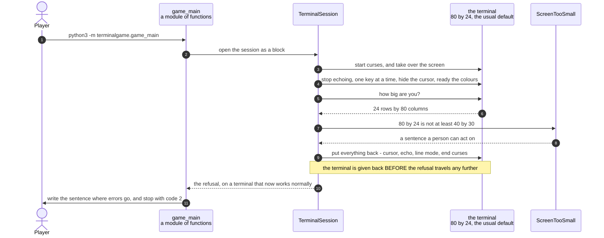

# A terminal too small to hold the picture is refused before a game starts

**Priority: `LOW`** — this only happens when something has already gone wrong, and on the ordinary way in it never happens at all, because the launcher makes the window the right size. It matters when somebody runs the game directly in a terminal of their own. [What the priorities mean](SCENARIO_INDEX.md#what-the-priorities-mean).

The picture is exactly 40 columns by 30 rows, and there is no margin anywhere in
it: 29 rows of maze and one row of status, 37 columns of picture and three of
blank edge. A terminal with 24 rows cannot show it. Not "shows it a bit
squashed" — there is nowhere for six rows of maze to go.

So the game measures the terminal once, before it draws anything, and if the
answer will not do it **stops**. The alternative is drawing a maze with the
bottom of it missing, which would look like a fault somewhere much deeper in the
program and would waste a player's time hunting for it.

Getting the refusal to be *readable* is the part worth describing. At the moment
the size is discovered, the terminal has already been taken over: it is in raw
mode[^rawmode], the screen has been cleared, the cursor is hidden, and anything
printed would be scrawled across a screen the game is in the middle of borrowing.
So the order matters, and it is the reverse of what a quick reading might suggest.
**The terminal is given back first, and the message is printed afterwards.** What
the player sees is an ordinary sentence at an ordinary prompt in a terminal that
works properly, which is the only form in which the message is any use to them.

This is also why the number 24 keeps coming up. A fresh terminal window on an
untouched profile opens at 80 columns by 24 rows, and 24 is less than 30. That is
not a coincidence and it is not rare — it is the default. The launcher resizes
the window it creates, but anybody running the game by hand starts from exactly
that shape.

| Class | What it represents, and its part in this scenario |
|---|---|
| [`TerminalSession`](../../terminalgame/screen/curses_adapter.py#L166) | Raw mode for as long as the game runs, and not one moment longer. In this scenario it is the **inspector**. [`_check_size`](../../terminalgame/screen/curses_adapter.py#L290) is the measuring, and it sits inside a guard that gives the terminal back before the refusal is allowed to travel any further |
| [`ScreenTooSmall`](../../terminalgame/screen/port.py#L34) | A terminal smaller than the picture the game must draw. In this scenario it is the **message**, and it is written to be read by a person rather than by a program: it says what is needed, what was found, and what to do about it |
| [`game_main`](../../terminalgame/game_main.py) | A module of plain functions rather than a class. In this scenario it is the **reporter**. [`main`](../../terminalgame/game_main.py#L80) is the one place that catches this particular refusal, prints it and gives back a number saying what went wrong |
| [`Screen`](../../terminalgame/screen/port.py#L314) | The port[^port]. In this scenario it is the **thing that is never handed over**. It only comes into existence at the very end of a successful setting-up, so there is no way to be holding something that can draw on a terminal that was found to be too small |

## Measuring once, giving the terminal back, and then saying why

| Step | Message | What is going on |
|---:|---|---|
| 1 | `python3 -m terminalgame.game_main` | The game run **directly**, which is not the ordinary way in. Ordinarily the launcher is run instead, and it makes a window of exactly the right size before the game ever looks. This document is about what happens when nobody has done that |
| 2 | open the session as a block | The same block that a successful game opens. Nothing about the start of this story is different, which is the point: the game cannot know whether the terminal will do until it asks |
| 3 | start curses, and take over the screen | From here the terminal is changed and somebody has to change it back. Everything after this point is [inside a guard](../../terminalgame/screen/curses_adapter.py#L208) that catches **anything at all** going wrong and tidies up before letting it carry on |
| 4 | stop echoing, one key at a time, hide the cursor, ready the colours | All the ordinary preparation, and all of it done before the size is checked. That order is deliberate. Measuring first would mean measuring a terminal that curses had not finished setting up, and the answer would be less trustworthy than the one taken here |
| 5 | how big are you? | Asked once. The game does not watch for the terminal changing size while it runs — a picture drawn to a screen that no longer matches is [refused whole rather than drawn wrong](../../terminalgame/screen/curses_adapter.py#L82), which is a different and much later story |
| 6 | 24 rows by 80 columns | The default shape of a fresh terminal window. Wide enough twice over and six rows too short |
| 7 | 80 by 24 is not at least 40 by 30 | Both dimensions are checked, and this one fails on the height alone. The numbers come from [one pair of constants](../../terminalgame/screen/port.py#L28) that the window the launcher builds is also sized from, so the two cannot drift apart |
| 8 | a sentence a person can act on | "This game needs a terminal of at least 40 columns by 30 rows; this one is 80 by 24. Make the window bigger and run it again." Three things in one line: what is needed, what was found, and what to do. The refusal also carries all four numbers separately, so a program that catches it does not have to read the sentence to find them |
| 9 | put everything back - cursor, echo, line mode, end curses | **The step this document exists for.** Each part is guarded on its own, so a terminal that refuses one of them cannot stop the others from running. Only after all of this does the refusal continue on its way |
| 10 | the refusal, on a terminal that now works normally | The guard [never swallows what it caught](../../terminalgame/screen/curses_adapter.py#L208). It tidies up and then lets the refusal carry on, because a game that stopped silently would leave the player with no idea why |
| 11 | write the sentence where errors go, and stop with code 2 | Written where error messages go rather than where ordinary output goes, so that a script running the game can keep the two apart. Code 2 comes from [a named constant](../../terminalgame/game_main.py#L56) rather than being a bare number, so that "the screen was too small" is distinguishable from any other kind of failure by something that is not reading English |

Notice what is **not** in this list. The game does not try to make the terminal
bigger, and it does not try to close anything. It does not know it might be in a
window that a launcher opened, and it never touches the desktop at all. That is
caution C11[^cautions]: only one part of the system drives windows, and it is the
other program entirely.

On the ordinary way in there is one more piece of protection in front of all
this, and it belongs to the launcher rather than the game. A new terminal window
opens at its profile default and is resized a moment later, so a game starting
immediately could look at the terminal before the resize has happened and refuse a
window that was about to become perfectly adequate. The launcher guards against
that by having the window wait for its size before starting the game at all, and
that guard is a scenario of its own.

## Related scenarios

- [The terminal is put into raw mode and given back on every way out](the-terminal-is-put-into-raw-mode-and-given-back-on-every-way-out.md)
  — the same cast reaching the same measuring step and getting an answer that
  will do, and the full list of what is borrowed and given back.
- [The game waits for its window to reach 40 by 30 before it starts drawing](the-game-waits-for-its-window-to-reach-40-by-30-before-it-starts-drawing.md)
  — the guard in front of this on the ordinary way in, and why it is bounded and
  always falls through rather than ever giving up.
- [The launcher asks where the player was looking, and then opens the game's window](the-launcher-asks-where-the-player-was-looking-and-then-opens-the-games-window.md)
  — where a window of the right size comes from when nobody has to think about it.

### Footnotes

[^rawmode]: **Raw mode** is the name for a terminal that has been told to stop
    being helpful. Normally a terminal collects a whole line before handing it
    over, prints each letter as it is typed, and watches for a few special keys
    itself. In raw mode it does none of that: every key press is handed straight
    to the program and nothing is printed unless the program prints it. A game
    needs all three of those changes, and all three have to be undone before the
    player gets their terminal back.

[^port]: The **screen port** is the small set of things the game is allowed to
    ask of a screen: how big are you, give me a blank picture, show this picture,
    and wait a stated length of time for a key. It is
    [`Screen`](../../terminalgame/screen/port.py#L314), and it names those three
    operations plus the size, and nothing else. A **port** in this sense is a
    boundary written as a list of operations, with the real implementation kept
    on the far side of it, so that everything on the near side can be exercised
    by standing something simpler in its place.

[^cautions]: A **caution** is a numbered warning in
    [the architecture document](../ARCHITECTURE.md), written before any code
    existed, about something known to be easy to get wrong — `C1` is "never act
    on the front window", `C9` is "redraw the whole frame each pass, not dirty
    cells". Each names one specific way this program could break rather than
    giving general advice, and several of them are quoted in the code at the
    exact line that obeys them.
