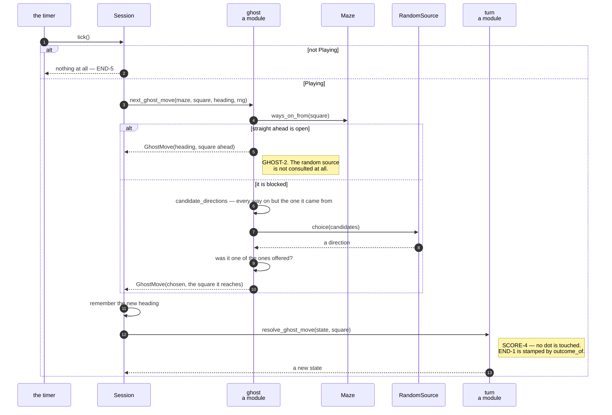

# A tick moves the ghost, which is never told where the player is

**Priority: `HIGH`** — it runs about seven times a second for the whole of every game, and it is the other of the two ways a game can end. [What the priorities mean](SCENARIO_INDEX.md#what-the-priorities-mean).

[`next_ghost_move`](../../terminal_game/domain/ghost.py#L109) is a pure function
of four things: the maze, the square the ghost is on, the way it is heading, and
a source of randomness. GHOST-2, GHOST-3 and GHOST-4[^codes] are all of it.

**The player is not one of the four**, and that is the entire mechanism by which
GHOST-4 — *"the ghost does not hunt the player and takes no notice of where they
are"* — is met. The policy could not hunt if it wanted to, and **no test has to
prove a negative about code that cannot express it.**

## Three clauses, in the requirement's own order

```
1. keep going straight, while the corridor lets it        (GHOST-2)
2. otherwise pick one of the other ways on, at random     (GHOST-3)
3. turn back the way it came, only when there is no
   other choice                                           (GHOST-3, last clause)
```

**The order matters and is not an implementation detail.** Straight ahead wins
over a turn *even at a junction* — a ghost that could carry on but rolled a die
anyway would satisfy no clause here. And the reversal is a last resort rather
than one option among several, which is what "only when there is no other
choice" means.

## The reverse clause cannot happen in a real game

Ruling C-3 settled this and it is worth knowing before reading the code.
GHOST-3's last clause fires only at a dead end, and MAZE-5 says every corridor
square has at least two ways on — so in any maze this program generates, the
non-reversing set is never empty and **clause 3 never runs.**

It is still implemented, still correct, and its test uses a hand-built maze with
a dead end in it, because nothing else can reach it. Nobody should be puzzled
that a generated maze never exercises it.

## Why the candidates are a list and not a set

[`candidate_directions`](../../terminal_game/domain/ghost.py#L82) builds its
answer by iterating [`Direction`](../../terminal_game/domain/maze.py#L88) in
declaration order, never in whatever order a set or a dict happened to produce.

That is a contract rather than a tidiness. **A seeded run has to walk the same
maze every time**, and a random choice over a list is only repeatable if the
list comes back the same way twice. Replaying a puzzling game from its seed
depends on this line and on `Maze.corridors()` being sorted, and on nothing
else.

`candidate_directions` is public for the same reason: a caller or a test can see
**the choice being offered** rather than infer it from the choice made. Note
that straight ahead is *not* special-cased out of it — the policy only asks for
candidates once it knows straight ahead is blocked, and somebody inspecting the
choice wants the real set rather than one with a hole in it.

## Randomness arrives, and is checked on the way back

The Domain may not name a module-level random source, so this module does not
import `random` and could not. It declares a one-method
[`RandomSource`](../../terminal_game/domain/ghost.py#L43) protocol instead, which
`random.Random` satisfies as it stands — so the Shell hands one in with no
adapter and a test hands in something that chooses predictably.

The answer is then **verified against the offer**: a source that returns a
direction not among the candidates raises rather than being obeyed. A test
double that has drifted from the code it doubles is a test that passes while the
program is wrong, and this is one line that refuses to let it.

## Two returns, not one

[`GhostMove`](../../terminal_game/domain/ghost.py#L57) carries the direction
*and* the square. The square is what the turn resolver needs; the direction is
what the **next** call needs, as the heading. Returning only the square would
make the caller re-derive the heading by subtracting two positions — the sort of
arithmetic that goes wrong once and then keeps working for a while.

| Participant | What it represents, and its part in this scenario |
| --- | --- |
| [`ghost`](../../terminal_game/domain/ghost.py) | A module of two functions. In this scenario it is **the whole policy**, and its parameter list is how GHOST-4 is met |
| [`Maze`](../../terminal_game/domain/maze.py#L115) | The grid. In this scenario it is **the only thing consulted**, through `ways_on_from`, which keeps the direction as well as the square |
| [`Direction`](../../terminal_game/domain/maze.py#L88) | One of four. In this scenario it is **the order the choice is offered in**, which is what makes a seeded run walk the same maze twice |
| [`GhostMove`](../../terminal_game/domain/ghost.py#L57) | Direction and square. In this scenario it is **the two answers one caller needs and the next call needs** |
| [`RandomSource`](../../terminal_game/domain/ghost.py#L43) | One method, `choice`. In this scenario it is **consulted only at a junction**, and its answer is checked against the offer |
| [`Session`](../../terminal_game/application/session.py#L85) | The game being played. In this scenario it is **the caller**: it keeps the heading, asks for the move, and hands the square on |
| [`turn`](../../terminal_game/application/turn.py) | A module. In this scenario it is **what the square means** — the ghost eats nothing, and END-1 is stamped the same way as on the player's side |



## Related scenarios

- **The tick timer keeps the ghost's beat, and stops when the game is decided**
  — where the beat comes from.
- **Eating the last dot on the ghost's square is a loss and not a win** — what
  `resolve_ghost_move` stamps, and why it is the same function as the player's.
- **A maze is carved on a lattice of odd cells, then braided until no dead ends
  remain** — why clause 3 is unreachable.

### Footnotes

[^codes]: Requirement codes are the specification's own, in
    [`docs/FUNCTIONAL_REQUIREMENTS.md`](../FUNCTIONAL_REQUIREMENTS.md).
