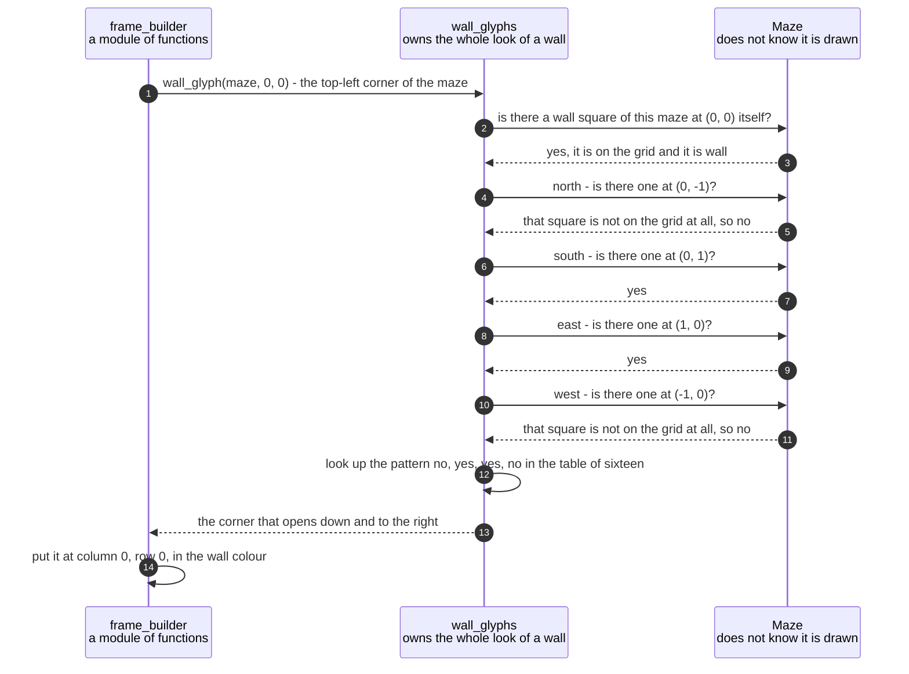

# A wall square chooses its double-line glyph from its four neighbours

**Priority: `MEDIUM`** — this runs for every wall square of every picture, which is several thousand times a second. But a fault here only makes the maze look wrong: the game still runs, still scores and still ends correctly. What is lost is a maze a player can read. [What the priorities mean](SCENARIO_INDEX.md#what-the-priorities-mean).

The maze is drawn with the double-line box-drawing characters — `╔`, `╣`, `╬`
and the rest. Requirement SCRN-3[^codes] asks that they "join up neatly with
their neighbours into corners, tees and crossings", and that a wall square with
no wall next to it be drawn as a single blue block.

Nothing in the maze itself knows any of that. A maze square is corridor or wall
and nothing more. The picture is a separate question asked of the same square,
and this is where it is answered: look at the four sides, ask which of them have
a wall square to join up with, and look the answer up in a table of sixteen
entries. Four sides, each a yes or a no, is sixteen possible patterns, and every
one has exactly one character.

What makes this worth a document of its own is not the table. It is **a question
that has two different right answers, spelled with the same words**, and a
program that was made to answer both. The question is "is that square a wall?"

- When an actor is walking, the answer for a square beyond the edge of the grid
  must be **yes**. Requirement MAZE-3 says nothing can leave the maze, and
  treating the outside world as solid means the border needs no special handling
  anywhere. [`is_wall`](../../terminalgame/domain/maze.py#L125) answers this one.
- When a character is being chosen, the answer for a square beyond the edge must
  be **no**. A wall square on the border has no neighbour out there to join up
  with, so the top-left corner of the maze must be drawn `╔` and not `╬`.
  [`joins_up_with`](../../terminalgame/presentation/wall_glyphs.py#L138) answers
  this one.

Both answers are right. They are two genuinely different questions that happen to
be said with the same words, which is why the second one has its own name instead
of being a branch inside the first. The comment above it says, in as many words,
**do not make them agree.**

And this is not a matter of taste. The table was worked out from the picture in
the specification, which is 29 rows of 37 columns and contains 287 wall squares
of worked example. Under the convention above, every pattern that appears in that
picture is drawn with exactly one character — no ambiguity anywhere. Re-deriving
the same table under the other convention makes five of the patterns ambiguous,
one of them drawn seven different ways. The picture settles it.

| Class | What it represents, and its part in this scenario |
|---|---|
| [`wall_glyphs`](../../terminalgame/presentation/wall_glyphs.py) | A module of plain functions rather than a class. In this scenario it is the **draughtsman**, and it owns the whole of the appearance of a wall. [`BY_NEIGHBOURS`](../../terminalgame/presentation/wall_glyphs.py#L79) is the table of sixteen, and [`joins_up_with`](../../terminalgame/presentation/wall_glyphs.py#L138) is the second of the two questions described above |
| [`Maze`](../../terminalgame/domain/maze.py#L76) | The grid, unchangeable for the whole game. In this scenario it is the **answerer of the first question and only the first**. It supplies [`contains`](../../terminalgame/domain/maze.py#L106) and [`is_wall`](../../terminalgame/domain/maze.py#L125), and it holds no opinion whatever about characters — it does not know the maze is drawn at all |
| [`frame_builder`](../../terminalgame/presentation/frame_builder.py) | A module of plain functions. In this scenario it is the **caller**, asking this question once for each wall square and putting the answer in the picture. It also draws the joins between side-by-side wall squares, which is a separate rule and a much simpler one |
| [`NotAWallSquare`](../../terminalgame/presentation/wall_glyphs.py#L110) | A character was asked for a square that is not wall. In this scenario it is the **refusal**. The question genuinely has no answer, and something plausible-looking would put a wall character on a corridor square where nothing would notice |

## Four neighbours, one character, and a border that stays a rectangle

| Step | Message | What is going on |
|---:|---|---|
| 1 | [`wall_glyph`](../../terminalgame/presentation/wall_glyphs.py#L173)`(maze, 0, 0)` - the top-left corner of the maze | The corner is chosen deliberately rather than picked at random. It is the square where the two meanings of "is that a wall" pull hardest in opposite directions: two of its neighbours are off the grid, so the answer differs between them on half of the questions asked |
| 2 | is there a wall square of this maze at `(0, 0)` itself? | Asked first, so that a square which is not wall is [refused](../../terminalgame/presentation/wall_glyphs.py#L110) rather than answered. There is no sensible character for a corridor square, and inventing one would mean a wall drawn in the middle of a corridor with nothing complaining |
| 3 | yes, it is on the grid and it is wall | The border of the maze is always wall, because the two passes that make a maze never reach the outside ring |
| 4 | north - is there one at `(0, -1)`? | Rows are counted downwards from the top, so north is one **less**. The square above the top row is simply not there |
| 5 | that square is not on the grid at all, so no | **The line this document exists for.** Asked the other way — "could an actor walk there" — the answer would be *yes, that is solid*, and the corner would be drawn as a four-way crossing with arms reaching out into nothing. Asked this way the answer is no, and the border comes out as a rectangle |
| 6 | south - is there one at `(0, 1)`? | South is one **more** on the vertical axis, for the same reason north is one less. The four questions are asked in a fixed order — north, south, east, west — and the table is keyed in that same order, so the two cannot drift apart |
| 7 | yes | The square below is part of the left-hand wall running down the side of the maze |
| 8 | east - is there one at `(1, 0)`? | East is one more across. Note that this question and the two before it are all the same question, asked of a different square each time. There is no special handling anywhere for the edges of the grid: being off the grid is simply one of the answers |
| 9 | yes | The square to the right is part of the wall running along the top |
| 10 | west - is there one at `(-1, 0)`? | The last of the four. A square needs all four answers before the table can be consulted, so there is no early exit and no cheaper path for a square in the middle of a wall |
| 11 | that square is not on the grid at all, so no | The same reasoning as the north answer, on the other axis |
| 12 | look up the pattern no, yes, yes, no in the table of sixteen | No lookup can fail, because four yes-or-no answers make exactly sixteen patterns and [all sixteen are in the table](../../terminalgame/presentation/wall_glyphs.py#L79). Fifteen of them appear in the specification's own picture. The only one that does not is the four-way crossing — and SCRN-3 names "crossings" in its own words, so there was only ever one candidate for it |
| 13 | the corner that opens down and to the right | Checked against the running program: the top-left square of a real maze comes out as `╔`, which is what the specification's picture shows |
| 14 | put it at column 0, row 0, in the wall colour | Every wall square is the same blue. Only the character changes with the neighbours, which is why the colour is [a single constant](../../terminalgame/presentation/wall_glyphs.py#L53) and not part of the table |

The table has one entry that surprises people, and it is worth explaining because
it looks like a compromise and is not. A wall square whose **only** wall neighbour
is to the west is drawn `═` — a full horizontal line, with an arm pointing east at
a corridor square where there is nothing to join to. Why not a half-line stopping
in the middle? Because the double-line set has no half-lines in it. There is no
"double line coming from the west and stopping". The specification's own picture
does exactly this, drawing `════ ▪` with the line running right up to the dot, so
it is the intended appearance rather than the best available. The rule that
produces the whole table can be said in one sentence: **every wall neighbour gets
an arm pointing at it, using the fewest extra arms available.**

One thing this document does not cover is the column *between* two side-by-side
wall squares, which is drawn separately and by a much simpler rule. Two adjacent
wall squares always join horizontally, because each is the other's east or west
neighbour, so each character already has an arm pointing at the other. The joining
column can therefore be filled in without asking which two characters they are.

## Related scenarios

- [A game state is composed into a 40 by 30 frame with the ghost drawn last](a-game-state-is-composed-into-a-40-by-30-frame-with-the-ghost-drawn-last.md)
  — who asks this question, how often, and what happens to the answer.
- [A maze is carved into a spanning tree and then braided until no dead ends remain](a-maze-is-carved-into-a-spanning-tree-and-then-braided-until-no-dead-ends-remain.md)
  — the pair to this document. One makes a shape out of open and closed squares
  knowing nothing about how it will look, and this one turns that shape into
  lines knowing nothing about how it was made.
- [An arrow key moves the player one square and eats the dot it lands on](an-arrow-key-moves-the-player-one-square-and-eats-the-dot-it-lands-on.md)
  — where the *other* meaning of "is that a wall" is used, and why treating the
  outside of the grid as solid is exactly right there.

### Footnotes

[^codes]: A **requirement code** is a short name such as `WIN-2` or `GHOST-1`
    given to one sentence of
    [the specification](../FUNCTIONAL_REQUIREMENTS.md). There are 49 of them,
    in ten groups, and the group name says what the sentence is about: `GAME`,
    `WIN` for the window, `SCRN` for what is on screen, `MAZE`, `START`, `CTRL`
    for the controls, `GHOST`, `SCORE`, `END` for how a game finishes, and
    `STAT` for the bottom row. They are quoted throughout the code as well as
    in these documents, so a reader who finds `CTRL-3` in a comment can look up
    the exact sentence it is keeping.
