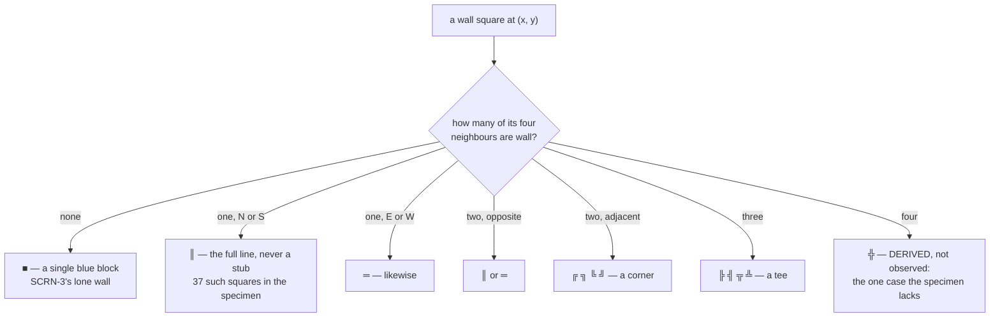

# A wall square chooses its double-line glyph from its four neighbours

**Priority: `MEDIUM`** — it runs for every wall square of every frame, but a wrong answer makes the maze look wrong rather than stopping the game. [What the priorities mean](SCENARIO_INDEX.md#what-the-priorities-mean).

[`wall_glyph`](../../terminal_game/presentation/wall_glyphs.py#L141) takes four
booleans and returns one character. SCRN-3[^codes]:

> *"The walls are drawn as blue double lines that join up neatly with their
> neighbours into corners, tees and crossings; a wall square with no wall next
> to it is drawn as a single blue block."*

Four booleans, sixteen combinations, sixteen answers. **Nothing else is
consulted** — not the position, not the maze, not the size of the grid — which
is why this could be written before the maze existed and why there is nothing
impure anywhere in the module.

## Fifteen of the sixteen were measured

The table was not recalled from what box-drawing characters usually do. The
specimen picture in the requirements was **parsed square by square**, each wall
square classified by its four neighbours, and the glyph it is drawn with read
off.

Every one of the fifteen occurs with **exactly one glyph** across all 19 × 29
squares — so the mapping really is a function of the four booleans and not of
anything else. That is the finding, and it is stronger than the table.

The suite re-runs that comparison against the specimen on every run, so **the
table cannot drift away from the picture it came from.**

## Two things the measurement settled that are easy to guess wrong

**A single wall neighbour gets the full line, not a stub.** North-only and
south-only are both `║` — never `╨` or `╥` — and east-only and west-only are
both `═`, never `╞` or `╡`. The specimen has **37 such squares** and not one of
them is a stub.

**Outside the grid is not a wall.** The border corners prove it: the top-left
square has no northern and no western neighbour and is drawn `╔`, which is the
glyph for *south and east only*. Had "outside" counted as a wall it would have
had to be `╬`.

A caller at the edge therefore passes `False` for neighbours that do not exist —
and because MAZE-3's border ring means every edge square is a wall, **this case
is reached constantly** rather than being an edge case in the other sense.

## The sixteenth is marked as derived

All four neighbours walls **does not occur in the specimen** and could not be
measured. It is `╬`, taken from the same double-line family as the other
fifteen, and it is labelled *derived, not observed* everywhere it appears — in
the constant's comment, in the module docstring, and in the class overview — so
that nobody later mistakes it for something that was seen.

That is a small discipline with a large payoff: the difference between the
fifteen and the one is the difference between a measurement and a reasonable
guess, and a reader who cannot tell them apart cannot audit either.

## The table is written out rather than computed

Sixteen entries, each spelled. It would compress — the four booleans are a
bitmask and the glyphs have structure — and it is deliberately not compressed,
because **the table *is* the specification of SCRN-3.** A reader should be able
to check it against the picture without running anything.

## Colour is not here

SCRN-3 also calls the walls blue. This module returns a character and names no
colour, no pixel and no toolkit; the blue comes from
[`palette.WALL`](../../terminal_game/presentation/palette.py#L61) when the
composer writes the cell. Presentation-as-data means the glyph and the colour
are decided in different places, and each is one place.

| Participant | What it represents, and its part in this scenario |
| --- | --- |
| [`wall_glyphs`](../../terminal_game/presentation/wall_glyphs.py) | A module of one function and a table. In this scenario it is **SCRN-3 in full**, and fifteen sixteenths of it are a measurement |
| [`frame`](../../terminal_game/presentation/frame.py) | A module. In this scenario it is **the only caller** — it works out the four booleans and pairs the answer with a colour |
| [`Maze`](../../terminal_game/domain/maze.py#L115) | The grid. In this scenario it is **where the four booleans come from**, and the reason "outside is not a wall" is reached on every border square |
| [`palette`](../../terminal_game/presentation/palette.py) | A module of constants. In this scenario it is **the other half of SCRN-3**, kept separate on purpose |

## Related scenarios

- **A game state is composed into a 40 × 30 field, three cells to an actor** —
  the caller, and where the blue is added.
- **A maze is carved on a lattice of odd cells, then braided until no dead ends
  remain** — where the walls being drawn come from.

### Footnotes

[^codes]: Requirement codes are the specification's own, in
    [`docs/FUNCTIONAL_REQUIREMENTS.md`](../FUNCTIONAL_REQUIREMENTS.md).
