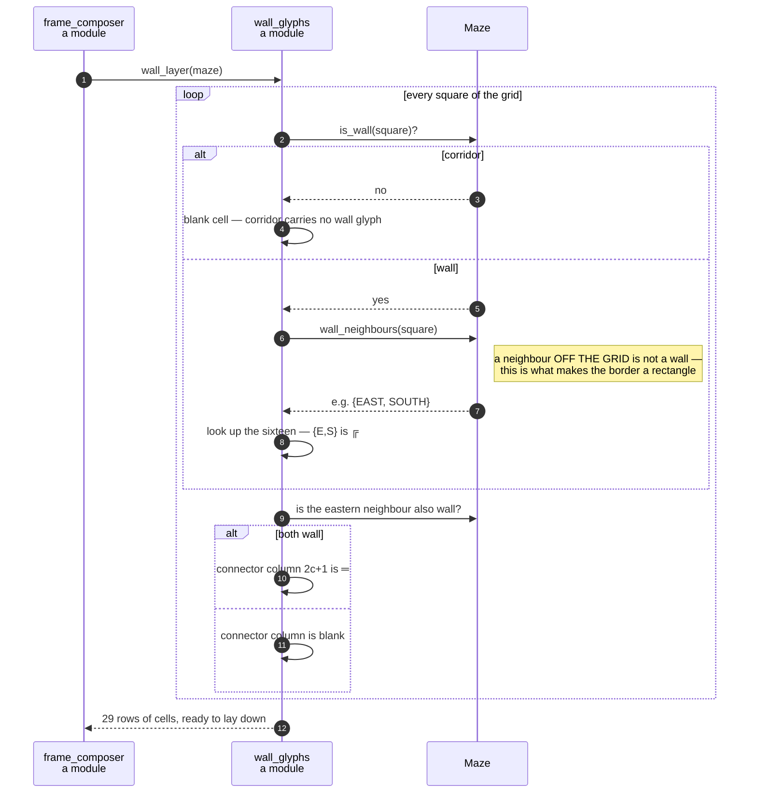

# A wall square chooses its double-line glyph from its four neighbours

**Priority: `MEDIUM`** — this runs for every wall square of every picture, which is thousands of times a second. But a fault here only makes the maze look wrong: the game still runs, still scores and still ends correctly. What is lost is a maze a player can read. [What the priorities mean](SCENARIO_INDEX.md#what-the-priorities-mean).

The maze is drawn with the double-line box-drawing characters — `╔`, `╣`, `╬`
and the rest. Requirement SCRN-3[^codes] asks that they "join up neatly with
their neighbours into corners, tees and crossings", and that a wall square with
no wall next to it be drawn as a single blue block.

Nothing in the maze itself knows any of that. A maze square is corridor or wall
and nothing more. The picture is a separate question asked of the same square,
and this is where it is answered: look at the four sides, ask which of them have
a wall to join up with, and look the answer up. Four sides, each a yes or a no,
is sixteen patterns, and every one has exactly one character.

What makes this worth a document is not the table. It is **where the question is
answered** — because the obvious place is the wrong one.

## Off the grid is not wall, and that is the whole of the border ring

A square in the top-left corner of the maze has no neighbour to the north and
none to the west. If those absent neighbours counted as wall, the corner would
be drawn `╬` — a crossing with arms reaching into nothing — and the border ring
would come out as a mesh rather than a rectangle.

[`Maze.wall_neighbours`](../../terminal_game/domain/maze.py#L203) settles it,
and says so in as many words:

> A neighbour outside the grid is **not** a wall, so the square in the top-left
> corner of a bordered maze reports `{EAST, SOUTH}`. That is what makes the
> border ring resolve to the corner and edge glyphs the specimen picture shows.

`{EAST, SOUTH}` is the corner that opens down and right — `╔`. The border ring
is drawn correctly not by any special case but by one decision about what
"neighbour" means at the edge.

Note what this is *not*. Asking whether an actor may walk somewhere has the
opposite right answer: MAZE-3 says nothing leaves the maze, so beyond the edge
must behave as solid. The two questions are one word apart and need different
answers, and the program keeps them apart by asking the picture question only
here.

## Two columns to a square, and the odd column between

A maze square is drawn two columns wide, so square *c* occupies frame column
*2c* and the odd column *2c + 1* is the **connector** between it and its
eastern neighbour.
[`connector_glyph_east_of`](../../terminal_game/presentation/wall_glyphs.py#L191)
has a rule short enough to state completely: the horizontal glyph `═` when both
squares are wall, and a blank in every other case.

It needs no case analysis, and the reason is a property of the table rather
than an argument about drawing. Two side-by-side wall squares each already have
an arm pointing at the other — that is what having a wall neighbour to the east
or west *means* in `glyph_for_wall_neighbours` — so the join between them is
always the same character.

Asking for the connector east of the last square in a row raises, rather than
returning a blank. There is no such column: a row of *w* squares is `2w - 1`
columns wide, and an off-by-one that silently produced a blank would be
invisible in the picture and wrong in the geometry.

## Refusing rather than answering

[`wall_glyph_at`](../../terminal_game/presentation/wall_glyphs.py#L171) raises
[`NotAWallSquare`](../../terminal_game/presentation/wall_glyphs.py#L135) when
asked about a corridor square. The question genuinely has no answer, and
something plausible — a blank, or a lone block — would put a wall character on a
corridor square where nothing would notice it.

| Class | What it represents, and its part in this scenario |
| --- | --- |
| [`wall_glyphs`](../../terminal_game/presentation/wall_glyphs.py) | A module of plain functions. In this scenario it is the **draughtsman**, and it owns the whole appearance of a wall — the sixteen-entry mapping, the connector rule, and the refusal |
| [`Maze`](../../terminal_game/domain/maze.py) | The grid, unchangeable for the whole game. In this scenario it is the **answerer of one question and only one**: [`wall_neighbours`](../../terminal_game/domain/maze.py#L203). It holds no opinion about characters and does not know the maze is drawn at all |
| [`Cell`](../../terminal_game/presentation/frame.py#L84) | A glyph and a colour. In this scenario it is the **unit handed upward** — [`wall_cell_at`](../../terminal_game/presentation/wall_glyphs.py#L186) pairs each glyph with wall blue, so the composer never chooses a colour |
| [`NotAWallSquare`](../../terminal_game/presentation/wall_glyphs.py#L135) | A glyph asked for a corridor square. In this scenario it is the **refusal**, and it exists so that a wrong caller fails loudly rather than drawing something plausible |
| [`wall_layer`](../../terminal_game/presentation/wall_glyphs.py#L227) | A module function. In this scenario it is the **caller**, walking the whole grid once and producing the rows the composer lays down first |

## Related scenarios

- **A game state is composed into a 40 × 30 frame** — what is laid on top of
  this layer, and in what order.
- **A maze is carved into a spanning tree, then braided until no dead ends
  remain** — where the grid this reads comes from.

### Footnotes

[^codes]: Requirement codes are the specification's own, in
    [`docs/FUNCTIONAL_REQUIREMENTS.md`](../FUNCTIONAL_REQUIREMENTS.md).
