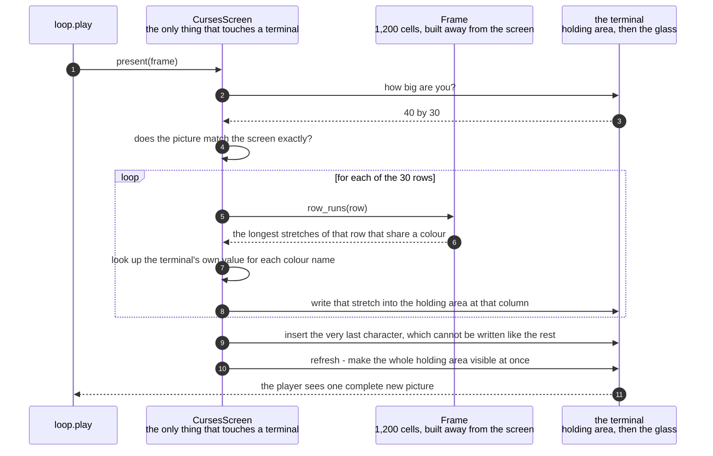

# A whole frame is written to the terminal and made visible in one pass

**Priority: `HIGH`** — this is the last step before the player sees anything, and it runs for every picture in every game. If it is wrong the game is unwatchable even though everything behind it is perfectly correct. [What the priorities mean](SCENARIO_INDEX.md#what-the-priorities-mean).

A finished picture arrives: 1,200 cells, each with one character and the name of
a colour. This step puts it on the terminal. Requirement SCRN-7[^codes] asks for
the picture to be "redrawn as things move, without flicker", and the whole of
this document is about the word *flicker* and what it takes to avoid it.

Flicker happens when a player can see a picture being painted. If the program
wrote each cell straight to the screen, the terminal would show a maze half
rubbed out and half redrawn, several times a second, and it would look like it
was flashing. The answer here has two halves. The picture is built away from the
screen first, so nothing incomplete is ever sent. And when it is sent, every cell
is written into a holding area and then **one instruction** makes the whole lot
visible at once. The player never sees a partly-drawn maze because one never
exists on the screen.

The second thing worth stating is what this step deliberately does *not* do. It
does not try to work out which cells changed and write only those. That sounds
like an obvious saving and it would be a bug. The player's and the ghost's shapes
are three columns wide and overwrite a column of the square next door, so a pass
that skipped unchanged cells would leave half of somebody's block lying about
where they used to be. This is caution C9[^cautions], and the arithmetic is
reassuring: 1,200 cells, seven times a second, is 8,400 cells a second, which is
nothing at all for a machine that can do millions of things in that time. There
is no saving worth the debris.

What this step *does* optimise is different and safe. A row of 40 cells is not
written one cell at a time. It is split into the longest stretches that share a
colour, and each stretch is written in one go. A typical row of the maze splits
into about 36 stretches rather than 40 separate writes — the saving is modest,
and it is safe because grouping cells never skips any. The whole row is always
covered.

| Class | What it represents, and its part in this scenario |
|---|---|
| [`CursesScreen`](../../terminalgame/screen/curses_adapter.py#L58) | The one object in the game that can actually put something on a terminal. In this scenario it is the **printer**. [`present`](../../terminalgame/screen/curses_adapter.py#L82) writes every cell and then makes the lot visible with a single instruction. It also owns the one piece of knowledge nobody expects, about the very last cell on the screen |
| [`Frame`](../../terminalgame/screen/port.py#L128) | A whole picture, built away from the screen and handed over as one thing. In this scenario it is the **thing being copied**. [`row_runs`](../../terminalgame/screen/port.py#L190) is the only clever part of it: one row split into the longest stretches that share a colour, with the whole row always covered |
| [`Colour`](../../terminalgame/screen/port.py#L54) | A colour named rather than numbered. In this scenario it is the **thing being translated**. Everything above the port[^port] asks for the wall colour by name, and this is the only place in the program that knows the wall colour means blue |
| [`TerminalSession`](../../terminalgame/screen/curses_adapter.py#L166) | Raw mode[^rawmode] for as long as the game runs. In this scenario it is the **supplier of the translation table**. The names are matched to real terminal colours [once, when the game starts](../../terminalgame/screen/curses_adapter.py#L271), because that matching cannot change afterwards and working it out per picture would be pure waste |

## Every cell written, then one instruction to reveal them all

| Step | Message | What is going on |
|---:|---|---|
| 1 | [`present`](../../terminalgame/screen/curses_adapter.py#L82)`(frame)` | Called only when something has actually changed. The loop compares the game state it now holds against the one already drawn, and skips this entirely when they are the same object. So a still game draws nothing at all, several times a second, quite happily |
| 2 | how big are you? | Asked every time rather than remembered. A player can resize a terminal at any moment, and a picture written to a screen that has changed size underneath it would be scattered across the wrong rows |
| 3 | 40 by 30 | The exact size the picture is built for. There is no margin: the window the launcher makes is 40 by 30 because the picture is |
| 4 | does the picture match the screen exactly? | If it does not, [nothing at all is drawn](../../terminalgame/screen/curses_adapter.py#L82) and the mismatch is reported. A picture is shown whole or not at all. Drawing 40 columns of it onto a 30-column screen would produce a scrambled maze that looked like a fault somewhere much deeper |
| 5 | [`row_runs`](../../terminalgame/screen/port.py#L190)`(row)` | One row of the picture, split by colour. The splitting **groups** cells and never skips them, and that distinction is the whole safety of it: the stretches always add up to the complete row. A row of the maze typically comes out as about 36 stretches, because the walls, the dots and the blanks alternate |
| 6 | the longest stretches of that row that share a colour | Each stretch is one instruction to the terminal instead of one per cell. This is the only saving made anywhere in the drawing, and it is safe in a way that skipping unchanged cells would not be |
| 7 | look up the terminal's own value for each colour name | The one place the names turn into something a terminal understands. A terminal with only eight colours has no gold and no pink, so [dim yellow stands for gold and bold magenta for pink](../../terminalgame/screen/curses_adapter.py#L41), which is what those two actually look like on a terminal. A terminal with no colour at all is not a reason to refuse to play — the lookup simply finds nothing and the game is drawn in one colour |
| 8 | write that stretch into the holding area at that column | Nothing is visible yet. Every one of these goes into a holding area that the player cannot see |
| 9 | insert the very last character, which cannot be written like the rest | The surprise in this document. Writing into the bottom-right cell of a terminal moves the cursor off the end of the screen, and the library reports that as an error even though the character actually lands. So the last stretch of the last row is written one character short, and the final character is *inserted* instead, which does not move the cursor. This was found by measurement rather than reasoned about, and it is written up in the project's own notes. If even that is refused by some terminal, [one missing character in the corner is not worth losing the whole picture over](../../terminalgame/screen/curses_adapter.py#L129) and it is quietly let go |
| 10 | refresh - make the whole holding area visible at once | **The line this document exists for.** One instruction, once per picture, and everything written above becomes visible together. The player sees one complete new picture and never a picture being made |
| 11 | the player sees one complete new picture | Which is the whole of "without flicker" |

There are no coloured bands on this diagram, because there is nothing on the
other side of a boundary to put in one. The game has a single thread and no locks
anywhere in it. Drawing happens on the same thread that read the key and moved
the ghost, which is why a picture can never arrive half-built from somewhere
else: there is nowhere else.

The cursor is not mentioned above, and that is because it was dealt with once at
the start of the game rather than once per picture. Requirement SCRN-7 also asks
that the text cursor never be visible, and hiding it is part of borrowing the
terminal rather than part of drawing on it.

## Related scenarios

- [A game state is composed into a 40 by 30 frame with the ghost drawn last](a-game-state-is-composed-into-a-40-by-30-frame-with-the-ghost-drawn-last.md)
  — where the picture in the first step is built, and why every cell of it is
  filled in before it arrives here.
- [The terminal is put into raw mode and given back on every way out](the-terminal-is-put-into-raw-mode-and-given-back-on-every-way-out.md)
  — where the object doing the drawing comes from, where the colour translation
  is worked out, and where the cursor is hidden.
- [The key read's timeout is recomputed every pass so the ghost keeps its beat](the-key-reads-timeout-is-recomputed-every-pass-so-the-ghost-keeps-its-beat.md)
  — who decides that this should happen at all, and the comparison that stops it
  happening when nothing has moved.

### Footnotes

[^codes]: A **requirement code** is a short name such as `WIN-2` or `GHOST-1`
    given to one sentence of
    [the specification](../FUNCTIONAL_REQUIREMENTS.md). There are 49 of them,
    in ten groups, and the group name says what the sentence is about: `GAME`,
    `WIN` for the window, `SCRN` for what is on screen, `MAZE`, `START`, `CTRL`
    for the controls, `GHOST`, `SCORE`, `END` for how a game finishes, and
    `STAT` for the bottom row. They are quoted throughout the code as well as
    in these documents, so a reader who finds `CTRL-3` in a comment can look up
    the exact sentence it is keeping.

[^cautions]: A **caution** is a numbered warning in
    [the architecture document](../ARCHITECTURE.md), written before any code
    existed, about something known to be easy to get wrong — `C1` is "never act
    on the front window", `C9` is "redraw the whole frame each pass, not dirty
    cells". Each names one specific way this program could break rather than
    giving general advice, and several of them are quoted in the code at the
    exact line that obeys them.

[^port]: The **screen port** is the small set of things the game is allowed to
    ask of a screen: how big are you, give me a blank picture, show this picture,
    and wait a stated length of time for a key. It is
    [`Screen`](../../terminalgame/screen/port.py#L314), and it names those three
    operations plus the size, and nothing else. A **port** in this sense is a
    boundary written as a list of operations, with the real implementation kept
    on the far side of it, so that everything on the near side can be exercised
    by standing something simpler in its place.

[^rawmode]: **Raw mode** is the name for a terminal that has been told to stop
    being helpful. Normally a terminal collects a whole line before handing it
    over, prints each letter as it is typed, and watches for a few special keys
    itself. In raw mode it does none of that: every key press is handed straight
    to the program and nothing is printed unless the program prints it. A game
    needs all three of those changes, and all three have to be undone before the
    player gets their terminal back.
