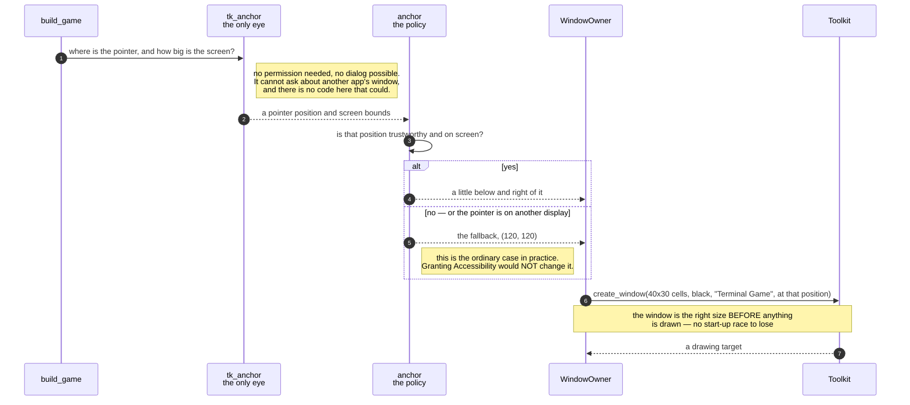

# A window is opened, dressed, and placed where the player was looking

**Priority: `HIGH`** — it runs once, before anything else can happen, and everything the player ever sees is inside what it produces. It is also the scenario carrying the program's largest unresolved question. [What the priorities mean](SCENARIO_INDEX.md#what-the-priorities-mean).

WIN-1[^codes] asks for a window of the game's own. WIN-2 asks that it be 40
characters wide and 30 rows deep, in a fixed-width typeface large enough to
read, on a black ground. WIN-3 asks that it be titled *Terminal Game*. WIN-4
asks that it appear "a little below and to the right of the window the player
was last looking at, so it always lands visible".

Under the architecture this program adopted, the application **owns** that
window rather than dressing somebody else's. That closes three of the four
caveats the other candidate carried: the title is exact because nothing else
composes it, there is no start-up race because the window is the right size
before anything is drawn into it, and no automation permission is needed at
all.

The fourth caveat is WIN-4, and it is still open.

## The arithmetic is separate from the looking

Two modules, deliberately split:

- [`anchor`](../../terminal_game/shell/anchor.py) — the policy and the
  arithmetic. [`is_on_screen`](../../terminal_game/shell/anchor.py#L109) and
  [`brought_onto_screen`](../../terminal_game/shell/anchor.py#L124) are
  ordinary functions over coordinates, testable with no window anywhere.
- [`tk_anchor`](../../terminal_game/shell/tk_anchor.py) — the one place that
  actually looks at the screen, and the only module in this item that names
  the toolkit.

Same shape as `toolkit.py` and `tk_toolkit.py`, for the same reason:
everything above the seam stays testable with no window.

## What it asks, and what it deliberately cannot ask

`tk_anchor`'s docstring is careful about the boundary, and the care is the
point:

> **It asks Tk where the mouse pointer is, and how big the screen is.** Both
> are answered by the toolkit about the machine, need **no permission of any
> kind**, and cannot raise a dialog.
>
> **It does not ask about another application's window**, and there is no code
> here that could.

That second sentence is a design decision with teeth. Finding the window the
player was *actually* looking at needs Accessibility or Automation consent on
this machine — a permission no agent can grant, and a dialog in front of a
person. So the program asks a question it is allowed to ask, and is honest
that it is a different question.

## And this is why the window opens at (120, 120)

Here is the part to know before you run it. **The pointer is not a good enough
proxy, and the program knows it.** Tk reports the pointer in whole-desktop
coordinates while describing only the primary display, so on a multi-display
machine the answer can be a position that is not on the screen being described.

When the anchor cannot be trusted, the policy falls back to
[`DEFAULT_WINDOW_POSITION`](../../terminal_game/shell/window_owner.py#L50) —
`ScreenPosition(x=120, y=120)` — which is far enough from the corner to clear
the menu bar and be grabbable.

So in practice the window opens at (120, 120) rather than near your pointer.
**Granting Accessibility would not change it**, because nothing here would ask
a different question if you did. That is recorded in
[`docs/TRACEABILITY.md`](../TRACEABILITY.md) §13 as an open item, and the
checklist tool prints it above the placement question so that nobody grants a
permission for nothing.

WIN-4's *"so it always lands visible"* is still satisfied — (120, 120) is
visible — but its *"a little below and to the right of the window you were
looking at"* is not, and that is a caveat rather than a claim.

| Class | What it represents, and its part in this scenario |
| --- | --- |
| [`WindowOwner`](../../terminal_game/shell/window_owner.py#L68) | Creates the window, drives it, closes it once. In this scenario it is **the tenant**, and it holds the [`WindowSpec`](../../terminal_game/shell/toolkit.py) that says what to ask for |
| [`anchor`](../../terminal_game/shell/anchor.py) | A module of plain functions over coordinates. In this scenario it is **the policy**, and it never looks at anything |
| [`tk_anchor`](../../terminal_game/shell/tk_anchor.py) | The one module here that names the toolkit. In this scenario it is **the eye**, and the boundary of what can be asked without a permission dialog |
| [`Toolkit`](../../terminal_game/shell/toolkit.py) | `create_window`, `schedule_once`, and the rest. In this scenario it is **the seam**, and the reason every one of these decisions can be tested with a fake |
| [`ScreenBounds`](../../terminal_game/shell/anchor.py#L62) | How big the screen is said to be. In this scenario it is **the thing that is not quite trustworthy**, and the reason the fallback exists |

## Related scenarios

- **A font that is missing, substituted or not fixed-width is refused before a
  window opens** — the other half of WIN-2, and the check that makes the cell
  grid trustworthy.
- **The window closes itself when the session ends** — the other end of this
  window's life.
- **A frame is painted onto the grid** — what fills it.

### Footnotes

[^codes]: Requirement codes are the specification's own, in
    [`docs/FUNCTIONAL_REQUIREMENTS.md`](../FUNCTIONAL_REQUIREMENTS.md).
    Assumption codes are the architecture's, in
    [`docs/ARCHITECTURE.md`](../ARCHITECTURE.md).
