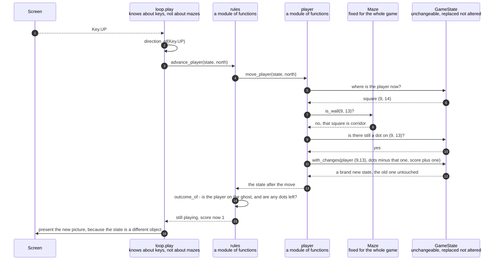

# An arrow key moves the player one square and eats the dot it lands on

**Priority: `HIGH`** — this is the only thing in the whole game a player can make happen, and it happens a few hundred times in every game. If it is wrong there is nothing left to play. [What the priorities mean](SCENARIO_INDEX.md#what-the-priorities-mean).

The player presses the up arrow. The yellow block moves one square up. The small
gold dot that was on that square disappears, and the score in the bottom row goes
up by one.

That is the whole of the game from the player's side, repeated a few hundred
times until either every dot is gone or the ghost arrives. This document is about
the moment in the middle: the single step that takes a key press and turns it
into a square, a dot and a point. Six separate requirement codes[^codes] are all
satisfied by that one step, and it is worth seeing why they belong together
rather than apart. CTRL-1 is the four arrows. CTRL-2 is one square per press.
CTRL-3 is a press into a wall doing nothing. SCORE-1, SCORE-2 and SCORE-3 are the
dot, the point, and an already-eaten square scoring nothing. They are all
consequences of the same movement, so they live in
[one function](../../terminalgame/domain/player.py#L55).

The design turns on a strict division of knowledge, and it runs in both
directions. **The part that knows a key was pressed never learns what it means to
the game. The part that knows what it means never learns that a key exists.** The
loop holds a small table[^table] turning `Key.UP` into "north" and then hands
north to the Domain. The Domain has no idea a keyboard is involved. That is why
the whole of a player's move can be checked with no terminal, no window and no
key press anywhere near it.

There is a second division worth naming, because it explains why this step is
smaller than it might be. **This step does not decide whether the game is over.**
After a move the player may be standing on the ghost, or may have taken the last
dot. Which of those matters is a separate question asked in a fixed order
somewhere else, and mixing it in here would put that order in two places.

| Class | What it represents, and its part in this scenario |
|---|---|
| [`loop`](../../terminalgame/application/loop.py) | A module of plain functions, and the whole Application layer. In this scenario it is the **translator**. [`direction_of`](../../terminalgame/application/loop.py#L87) turns a key into one of the four directions, or into nothing at all, and that is the entire extent of what this layer knows about what a key means |
| [`rules`](../../terminalgame/domain/rules.py) | A module of plain functions. In this scenario it is the **unit of one move**. [`advance_player`](../../terminalgame/domain/rules.py#L87) does the moving and then reads the outcome, in that order, so that "check after every move" is built into the step rather than being something a caller has to remember |
| [`player`](../../terminalgame/domain/player.py) | A module containing one function and one error. In this scenario it is the **mover and the scorer**. [`move_player`](../../terminalgame/domain/player.py#L55) is where all six requirements listed above actually happen, and the order of the checks inside it is the part worth reading twice |
| [`GameState`](../../terminalgame/domain/game_state.py#L97) | Everything true of a game at one moment, unchangeable[^immutable] once made. In this scenario it is the **before and the after**. It is never altered: [`with_changes`](../../terminalgame/domain/game_state.py#L128) builds a whole new one, naming only the handful of things that are different |
| [`Maze`](../../terminalgame/domain/maze.py#L76) | The grid of squares, each one corridor or wall, and unchangeable for the whole game. In this scenario it is the **authority on what is solid**. [`is_wall`](../../terminalgame/domain/maze.py#L125) is asked exactly once per move and answers `true` for anything beyond the edge of the grid as well, so the wall running round the outside needs no special handling |

## One key press becoming one square, one dot and one point

| Step | Message | What is going on |
|---:|---|---|
| 1 | `Key.UP` | A key with a **name** rather than a number. The terminal reports an arrow as a short burst of several characters beginning with an escape, and exactly one module in the program knows that. By the time a key reaches the loop it is one named thing, so nothing above the port[^port] has to know what an arrow looks like on a wire |
| 2 | [`direction_of`](../../terminalgame/application/loop.py#L87)`(Key.UP)` | A lookup in a table of four entries, and the whole of requirement CTRL-1. Anything not in that table answers with nothing at all, which is requirement CTRL-5 — the loop then does not look at it again. Note that `Key.UP` maps to north and north is one *less* on the vertical axis, because rows are counted downwards from the top of the screen |
| 3 | [`advance_player`](../../terminalgame/domain/rules.py#L87)`(state, north)` | From here down, nothing knows a key was pressed. What was handed over is a direction, and a direction is a fact about a maze rather than about a keyboard. That is the boundary the whole design turns on |
| 4 | [`move_player`](../../terminalgame/domain/player.py#L55)`(state, north)` | Something that is not one of the four directions is [refused loudly](../../terminalgame/domain/player.py#L45) rather than quietly treated as "no move". The alternative would be indistinguishable from a press into a wall, which would hide a wiring mistake in the one place the program is supposed to do nothing |
| 5 | where is the player now? | Read, never written. Nothing in this whole collaboration alters the state it was given |
| 6 | square `(9, 14)` | The player's opening square in the game grown from seed 7. It is the corridor square nearest the middle of the maze, which is requirement START-1, and how it was chosen is the subject of its own scenario |
| 7 | [`is_wall`](../../terminalgame/domain/maze.py#L125)`(9, 13)?` | **This comes first, and the order is the requirement.** Requirement CTRL-3 says a press towards a wall does "nothing at all" — not the square, not the dot, not the score. Checking the wall before anything else is what makes that true by construction: a blocked move cannot half-happen, because nothing has happened yet when the check runs |
| 8 | no, that square is corridor | The move is allowed. The other answer produces an outcome so different that it is drawn as its own document rather than as a branch here |
| 9 | is there still a dot on `(9, 13)`? | The question is asked of the **state**, not of the maze. The maze knows which squares are corridor and never changes for the whole game. Which of them still have dots is a fact about this particular game at this particular moment, and it lives in the state |
| 10 | yes | A game grown from seed 7 starts with 261 dots on 262 corridor squares — every corridor square except the one the player starts on, which is requirement START-3 |
| 11 | [`with_changes`](../../terminalgame/domain/game_state.py#L128)`(player (9,13), dots minus that one, score plus one)` | Requirements SCORE-1 and SCORE-2 in one step. The dot is removed from the set rather than marked as eaten, so there is no "eaten" flag anywhere that could be got wrong, and a dot that has gone is simply absent. Requirement SCORE-3 is the **absence** of a branch: a square whose dot has already gone is not in the set, so there is nothing to remove and nothing to add. Requirement SCORE-5 — the score never goes down — is the absence of any subtraction in the entire module |
| 12 | a brand new state, the old one untouched | Names only what changed and copies everything else. The maze, the ghost and the ghost's heading come across without being mentioned. A request to change something that is not part of a game is [refused by name](../../terminalgame/domain/game_state.py#L135), and the refusal says what a game does hold, because that list is deliberately short |
| 13 | the state after the move | Handed back with the outcome still reading *playing*, because the moving step never writes it. Whether this move ended the game is the next question, and it is deliberately not this one's to answer |
| 14 | [`outcome_of`](../../terminalgame/domain/rules.py#L55) - is the player on the ghost, and are any dots left? | Two questions in a fixed order, and the order is a requirement in its own right. It is asked here after **every** move, by either character, which is why it does not matter who walked into whom |
| 15 | still playing, score now 1 | "Still playing" is a positive statement that the game is under way, not a way of saying "nothing has been decided yet". That distinction matters from the very first instant, because requirement START-5 says the game is already going before anything has been pressed |
| 16 | present the new picture, because the state is a different object | The loop compares objects rather than contents. A real move built a new state, so the loop can see at a glance that something happened, without comparing several hundred dots |

Requirement CTRL-2 — one square per press, and the player never drifting on
their own — does not appear as a step anywhere above, and that is the point.
There is no step for it because there is nowhere for drifting to come from. The
move is worked out from a state and a direction, and a state holds no speed, no
held direction and no repeat. The player cannot drift because there is nothing in
the program for a drift to be stored in.

## Related scenarios

- [The key read's timeout is recomputed every pass so the ghost keeps its beat](the-key-reads-timeout-is-recomputed-every-pass-so-the-ghost-keeps-its-beat.md)
  — where the key in the first step came from, and why pressing it does not
  postpone the ghost.
- [Eating the last dot on the ghost's square is a loss and not a win](eating-the-last-dot-on-the-ghosts-square-is-a-loss-and-not-a-win.md)
  — the one move in a whole game where the order of the two questions in the
  outcome step decides the ending.
- [A clock tick moves the ghost, which is never told where the player is](a-clock-tick-moves-the-ghost-which-is-never-told-where-the-player-is.md)
  — the other half of the same loop, arriving at the same outcome step by a
  different route.
- **A press towards a wall changes nothing and no frame is drawn** — `MEDIUM`.
  The same cast with the wall question answered the other way, which stops the
  story four steps in and is why that check comes first.

*(The unlinked entry above is a document not written yet.)*

### Footnotes

[^codes]: A **requirement code** is a short name such as `WIN-2` or `GHOST-1`
    given to one sentence of
    [the specification](../FUNCTIONAL_REQUIREMENTS.md). There are 49 of them,
    in ten groups, and the group name says what the sentence is about: `GAME`,
    `WIN` for the window, `SCRN` for what is on screen, `MAZE`, `START`, `CTRL`
    for the controls, `GHOST`, `SCORE`, `END` for how a game finishes, and
    `STAT` for the bottom row. They are quoted throughout the code as well as
    in these documents, so a reader who finds `CTRL-3` in a comment can look up
    the exact sentence it is keeping.

[^table]: The **key table** is
    [`DIRECTION_OF_KEY`](../../terminalgame/application/loop.py#L69), four
    entries long: up to north, down to south, left to west, right to east. It is
    the only place in the program where a key and a direction appear in the same
    sentence. Everything below it deals in directions and has never heard of a
    keyboard.

[^immutable]: An **unchangeable** value is one that cannot be altered after it
    is made. If something different is wanted, an entirely new one is built
    instead — here by
    [`with_changes`](../../terminalgame/domain/game_state.py#L128), which copies
    everything and replaces only what was named. Two things follow that this
    game relies on. Nobody can alter a game state that somebody else is holding,
    so the ghost's policy cannot quietly change a state it was only asked to look
    at. And "nothing at all happened" can be checked by asking whether the very
    same object came back, instead of listing everything that did not change and
    hoping the list is complete.

[^port]: The **screen port** is the small set of things the game is allowed to
    ask of a screen: how big are you, give me a blank picture, show this picture,
    and wait a stated length of time for a key. It is
    [`Screen`](../../terminalgame/screen/port.py#L314), and it names those three
    operations plus the size, and nothing else. A **port** in this sense is a
    boundary written as a list of operations, with the real implementation kept
    on the far side of it, so that everything on the near side can be exercised
    by standing something simpler in its place.
