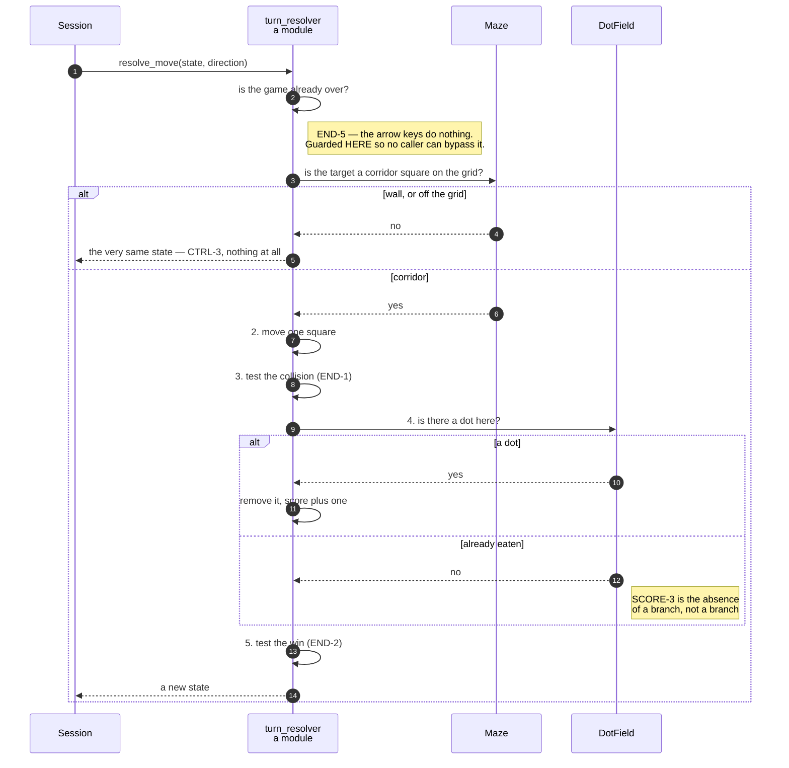

# An arrow key moves the player one square and eats the dot it lands on

**Priority: `HIGH`** — this is the whole of what a player does. It runs on every key press, it is the only way the score changes, and it is one of the two places a game can end. [What the priorities mean](SCENARIO_INDEX.md#what-the-priorities-mean).

[`resolve_move`](../../terminal_game/domain/turn_resolver.py#L40) is a pure
function: a game state and a direction in, a new game state out. It moves no
ghost, draws nothing, reads no clock and touches no window. Everything CTRL-1
to CTRL-3 and SCORE-1 to SCORE-3[^codes] asks for happens in it, in five steps,
and **the order of those steps is itself a requirement**.

## The five steps, and why they are numbered

```
1. a target square that is wall, or off the grid, means nothing happens at
   all — no move, no score, no tick consumed          (CTRL-3)
2. otherwise the player moves, exactly one square      (CTRL-1, CTRL-2)
3. then the collision is tested                        (END-1)
4. then the dot is eaten, if there is one              (SCORE-1, SCORE-2)
5. then the win is tested                              (END-2)
```

**Step 1 comes first, and "nothing at all" is literal.** A press into a wall
does not move the player, does not score, does not eat, does not consume a
turn and does not end anything. The function returns the state it was given.
That is checkable by identity rather than by listing the things that did not
change and hoping the list is complete.

**Step 2 is one square.** There is no momentum and no repeat, and CTRL-2 is
satisfied by construction rather than by a rule: the new position is a function
of the old one and a direction, and there is nowhere in a `GameState` to keep a
velocity.

**Steps 3 and 5 in that order are END-3**, and they are the subject of their own
scenario. Reversed, every test still passes except one: the state where the
player eats the last dot *on the square the ghost is standing on*.

**Step 4 is where the score changes, and it is the only place.** SCORE-3 — a
square whose dot has already gone scores nothing — is not a branch anywhere. It
is the absence of one: an eaten square is no longer in the dot field, so
[`_eat_any_dot_under_the_player`](../../terminal_game/domain/turn_resolver.py#L107)
finds nothing to remove and adds nothing.

## Ending first, and nothing after it

Before any of the five, the function asks whether the game is already over:

```python
if state.is_over:
    return state  # END-5: the arrow keys do nothing once a game has ended
```

END-5 says that once a game has ended, everything stops. This is where it is
enforced for the player, and it is enforced **here** rather than in the session
or the key handler, so that it cannot be bypassed by a caller that reaches the
resolver directly. The ghost has the matching guard in
[`resolve_tick`](../../terminal_game/domain/turn_resolver.py#L69).

## Nothing is mutated, and that is what makes it testable

Every step returns a new state. The domain is pure — no clock, no toolkit, no
global random source — which is why the whole of the rules can be exercised
thousands of times with no window anywhere near the test, and why this
scenario's participants are the same under either candidate architecture.

| Class | What it represents, and its part in this scenario |
| --- | --- |
| [`turn_resolver`](../../terminal_game/domain/turn_resolver.py) | A module of plain functions. In this scenario it is **the rulebook**, and its ordering is the requirement rather than an implementation choice |
| [`GameState`](../../terminal_game/domain/game_state.py) | Where both actors are, what dots remain, the score, the outcome. In this scenario it is **the subject and the result** — handed in, handed back, never altered in place |
| [`DotField`](../../terminal_game/domain/dot_field.py) | The dots still on the board. In this scenario it is **the reason SCORE-3 needs no branch**: an eaten square is simply absent |
| [`Score`](../../terminal_game/domain/game_state.py) | A number that offers `zero` and `plus_one` and nothing that lowers it. In this scenario it is **SCORE-5 made structural** rather than asserted |
| [`Maze`](../../terminal_game/domain/maze.py) | The grid. In this scenario it is **the answerer of step 1**, via `contains` and `is_corridor` |



## Related scenarios

- **Eating the last dot on the ghost's square is a loss and not a win** — steps
  3 and 5, and the single state that distinguishes them.
- **A clock tick moves the ghost, which is never told where the player is** —
  the other half of a turn.
- **A key press becomes an intent** — how a direction gets here.

### Footnotes

[^codes]: Requirement codes are the specification's own, in
    [`docs/FUNCTIONAL_REQUIREMENTS.md`](../FUNCTIONAL_REQUIREMENTS.md).
