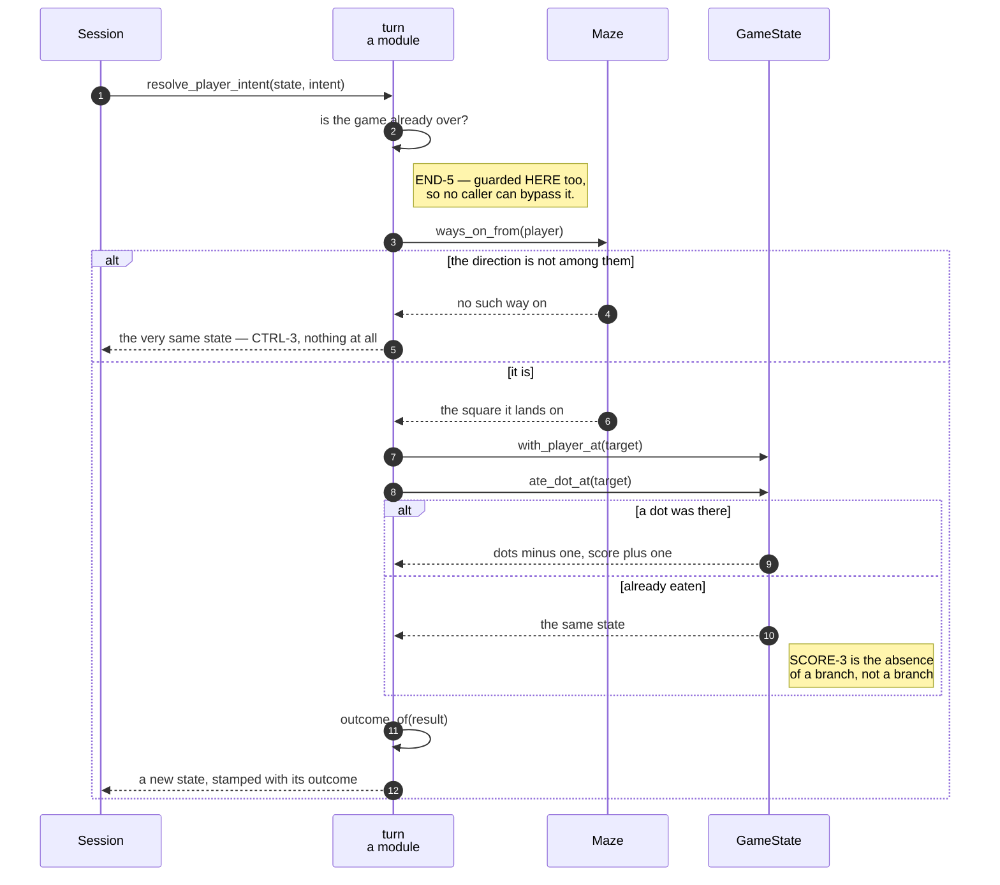

# An arrow key moves the player one square and eats the dot it lands on

**Priority: `HIGH`** — this is the whole of what a player does. It runs on every key press, it is the only way the score changes, and it is one of the two places a game can end. [What the priorities mean](SCENARIO_INDEX.md#what-the-priorities-mean).

[`resolve_player_move`](../../terminal_game/application/turn.py#L110) is a pure
function: a game state and a direction in, a new game state out. It moves no
ghost, draws nothing, reads no clock and touches no window. Everything CTRL-1 to
CTRL-3 and SCORE-1 to SCORE-3[^codes] asks for happens in it.

## The steps, in one place

```
0. a decided game does not move at all                 (END-5)
1. a direction that is not a way on means nothing
   happens at all — no move, no score, no turn used    (CTRL-3)
2. otherwise the player moves, exactly one square      (CTRL-1, CTRL-2)
3. the dot is eaten, if there is one                   (SCORE-1, SCORE-2)
4. the outcome is read off the result                  (END-1, END-2, END-3)
```

**Step 1's "nothing at all" is literal.** A press into a wall does not move the
player, does not score, does not eat, does not use a turn and does not end
anything — `return state` hands back the object it was given. That is checkable
by identity rather than by listing everything that did not change and hoping the
list is complete.

**A move cannot leave the grid, and there is no bounds check.** The legal moves
are exactly [`Maze.ways_on_from`](../../terminal_game/domain/maze.py#L276), which
yields only corridor squares that are on the grid. So a move at the edge is
stopped by *there being no way on* rather than by asking about a square outside
the grid and handling what comes back. **Movement cannot wrap**, either, because
a wrapped square is not adjacent and so is never a way on.

**Step 2 is one square, by construction rather than by rule.** The new position
is a function of the old one and a direction, and there is nowhere in a
[`GameState`](../../terminal_game/domain/state.py#L116) to keep a velocity. CTRL-2
is satisfied because momentum is unrepresentable.

**Step 3 is the only place in the program that scores.** SCORE-3 — a square
whose dot has already gone scores nothing — is not a branch anywhere. It is the
absence of one:
[`ate_dot_at`](../../terminal_game/domain/state.py#L223) finds the square absent
from the dot set and returns the state unchanged, so the caller may call it on
every move without first having to ask.

**SCORE-5 is structural.** Of the four transitions a `GameState` offers, exactly
one touches the score, and it adds one. There is no setter and no subtraction in
the module, so "the score never goes down" is a property of the shape rather
than a thing asserted.

## Step 4 does not decide, it reads

Notice what step 4 is **not**. There is no collision test in this function and
no win test either. It calls
[`outcome_of`](../../terminal_game/application/turn.py#L83), which is one total
function of the state, and stamps whatever comes back.

That matters because it is what makes END-3 unbreakable by a refactor here — see
the scenario that is entirely about it. The architect's caution C6 named the
hazard precisely: *if the collision test ever migrates into the movement code,
the requirement breaks silently.* **There is no collision test to migrate.**

## Ending first, and nothing after it

Before any of the steps, the function asks whether the game is already over and
returns the same state if it is. END-5 is enforced **here**, in the resolver, as
well as in the session — so it cannot be bypassed by a caller that reaches the
resolver directly. The ghost's arm has the matching guard in
[`resolve_ghost_move`](../../terminal_game/application/turn.py#L159).

| Participant | What it represents, and its part in this scenario |
| --- | --- |
| [`turn`](../../terminal_game/application/turn.py) | A module of plain functions. In this scenario it is **the rulebook**, and the one place a game in progress changes |
| [`GameState`](../../terminal_game/domain/state.py#L116) | Both actors, the dots left, the score, the outcome. In this scenario it is **the subject and the result** — handed in, handed back, never altered in place |
| [`Maze`](../../terminal_game/domain/maze.py#L115) | The grid. In this scenario it is **the answerer of step 1**, through `ways_on_from`, which is also why no bounds check is needed |
| [`Intent`](../../terminal_game/application/turn.py#L44) | What the player asked for. In this scenario it is **the way in**, unpacked to a direction by `resolve_player_intent` |
| [`Outcome`](../../terminal_game/domain/state.py#L42) | Undecided, caught, cleared. In this scenario it is **what step 4 stamps**, never what step 4 chooses |



## Related scenarios

- **Eating the last dot on the ghost's square is a loss and not a win** — what
  `outcome_of` does, and why it is a function rather than two statements.
- **A tick moves the ghost, which is never told where the player is** — the
  other half of a turn.
- **A key press becomes an intent** — how a direction gets here.

### Footnotes

[^codes]: Requirement codes are the specification's own, in
    [`docs/FUNCTIONAL_REQUIREMENTS.md`](../FUNCTIONAL_REQUIREMENTS.md).
