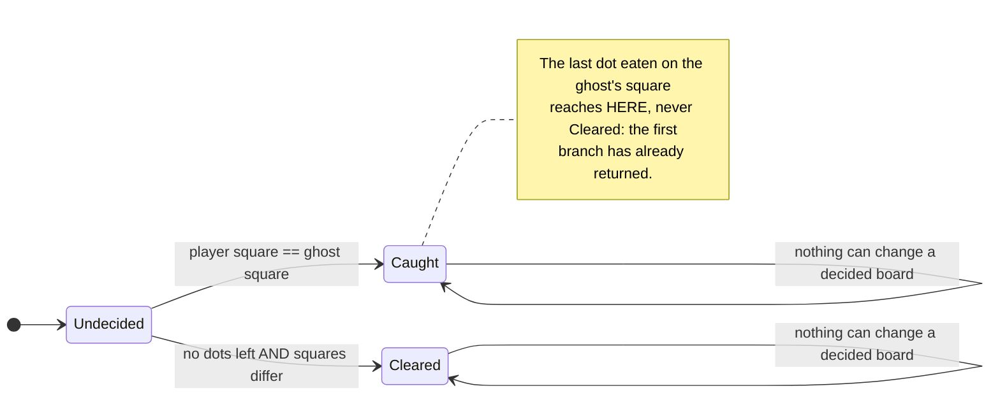

# Eating the last dot on the ghost's square is a loss and not a win

**Priority: `MEDIUM`** — it decides one state in a whole game, but that state is reachable in ordinary play and getting it wrong reverses the result. [What the priorities mean](SCENARIO_INDEX.md#what-the-priorities-mean).

END-3[^codes] is one sentence: *"eating the last dot on the square the ghost is
standing on is a loss, not a win."* The plan called it the project's single
fragility, and the architect's caution C6 said why: it used to live in the order
of two statements, **both orderings end the game**, and a test that merely
observed "the game ended" would not notice a refactor that swapped them.

This scenario is about how that hazard was removed rather than guarded against.

## The whole of it

[`outcome_of`](../../terminal_game/application/turn.py#L83):

```python
def outcome_of(state: GameState) -> Outcome:
    if state.player == state.ghost:
        return Outcome.CAUGHT      # END-1
    if state.dots_remaining == 0:
        return Outcome.CLEARED     # END-2
    return Outcome.UNDECIDED
```

**The win branch is not tested second. It is unreachable** while the player and
the ghost share a square, because the branches of one expression are mutually
exclusive. There are no two statements to reorder, because there is only one
expression; and there is no collision test sitting in the movement code that
could migrate, because the movement code does not test anything.

**It is total.** Every state has an outcome, and the outcome does not depend on
how the state was arrived at. A player who eats the last dot on the ghost's
square *does* eat it and *does* score it — SCORE-1 agrees, they moved onto a
square that still had a dot — and is still caught.

## What makes a derived outcome safe, and it is load-bearing

A function of the state is only as stable as the state is. If anything could
change the board after a decision, the outcome could be re-derived into a
different answer, and END-3 would break again in a new way.

**What keeps it still is END-5**, and that lives in the session's *Decided*
phase: once a game is decided the tick does nothing, moves are ignored, and the
last picture stands. The two modules say so about each other in their own
docstrings, and it is the condition the technical lead attached to approving the
structural form of END-3 in the first place.

So the tests for a decided game assert that it is **unchanged**, not that the
move was *ignored*. Those are different claims, and only one of them holds this
up: a session that accepted a move and then quietly undid it would pass the
weaker one.

## Where it is read, and where it is not

Two callers stamp it — [`resolve_player_move`](../../terminal_game/application/turn.py#L110)
and [`resolve_ghost_move`](../../terminal_game/application/turn.py#L159) — so
both arms of END-1 get the same answer from the same place. The player walking
into the ghost and the ghost walking into the player are the same situation, and
nothing has to say so twice.

And one caller pointedly does **not** trust the stamp.
[`Session`](../../terminal_game/application/session.py#L85) asks `outcome_of`
rather than reading `GameState.outcome`, because a board built by hand — a
fixture, a resumed game — can carry `UNDECIDED` while the two actors stand on
the same square. Trusting the stored field would make such a board *playable*,
and since Decided is what holds this requirement up, that is exactly the crack
to keep shut.

| Participant | What it represents, and its part in this scenario |
| --- | --- |
| [`turn`](../../terminal_game/application/turn.py) | A module of plain functions. In this scenario it is **the requirement itself**, written as one expression |
| [`GameState`](../../terminal_game/domain/state.py#L116) | The board. In this scenario it is **the only input** — the outcome is a function of it and of nothing else |
| [`Outcome`](../../terminal_game/domain/state.py#L42) | Undecided, caught, cleared. In this scenario it is **the vocabulary**, deliberately owned by the Domain while the ruling lives a layer up |
| [`Session`](../../terminal_game/application/session.py#L85) | The game being played. In this scenario it is **what keeps the answer honest**, by keeping the state still after a decision |



## Related scenarios

- **An arrow key moves the player one square and eats the dot it lands on** —
  the caller that stamps this on the player's side.
- **A tick moves the ghost, which is never told where the player is** — the
  caller that stamps it on the ghost's side.
- **A session goes Playing → Decided → Ended, and only `q` leaves it** — the
  phase that keeps this answer from being re-derived.

### Footnotes

[^codes]: Requirement codes are the specification's own, in
    [`docs/FUNCTIONAL_REQUIREMENTS.md`](../FUNCTIONAL_REQUIREMENTS.md).
