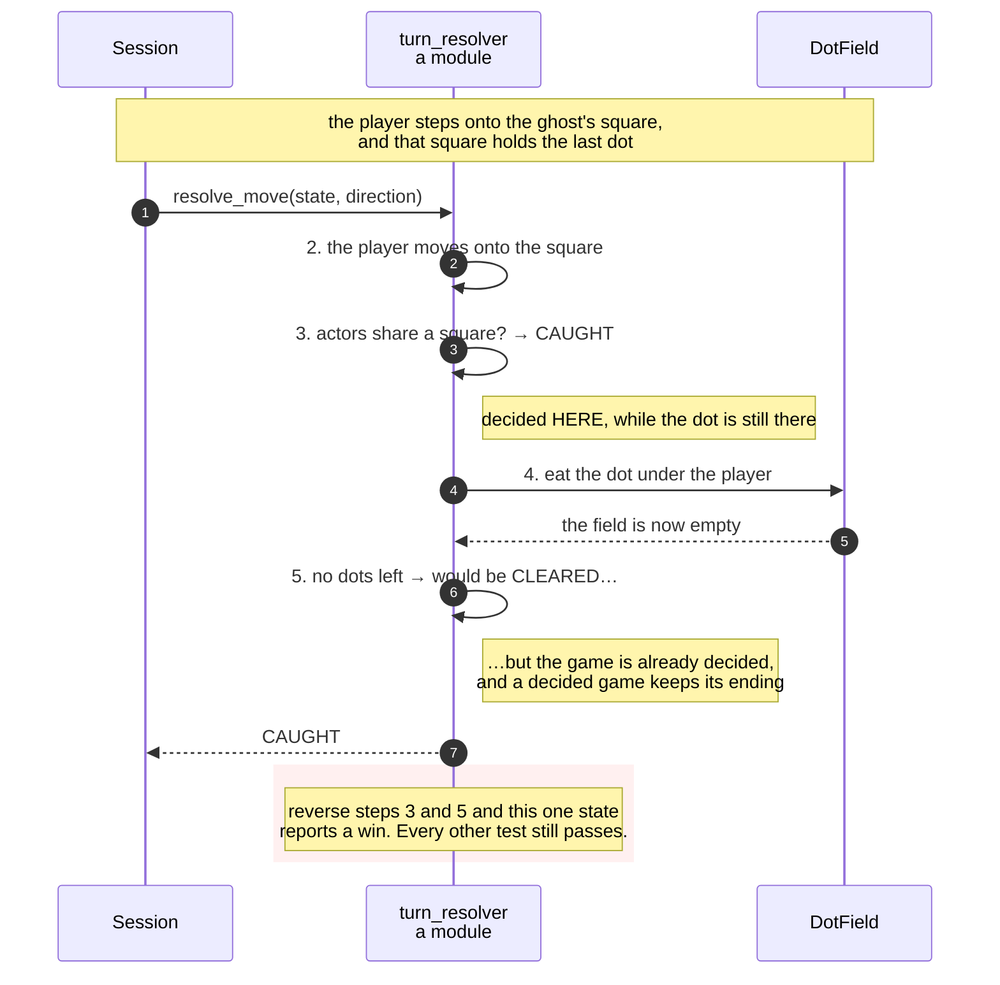

# Eating the last dot on the ghost's square is a loss and not a win

**Priority: `MEDIUM`** — it happens at most once in a game and in very few games at all. It earns a document because it is the single state that separates a correct implementation from a wrong one, and because both wrong versions pass every other test. [What the priorities mean](SCENARIO_INDEX.md#what-the-priorities-mean).

END-1[^codes] says the game is lost when the player and the ghost meet. END-2
says it is won when the last dot is eaten. **END-3 says which wins when both
happen at once**, and the answer is that the loss does.

There is exactly one state where this matters: the player steps onto the square
the ghost is standing on, and that square holds the last dot in the maze. Both
end conditions become true in the same move. One of them has to be reported.

## The order of two lines is the whole requirement

[`resolve_move`](../../terminal_game/domain/turn_resolver.py#L40) tests the
collision at step 3 and the win at step 5, with the dot eaten between them:

```
3. then the collision is tested      (END-1)
4. then the dot is eaten, if there is one
5. then the win is tested            (END-2)
```

Reverse steps 3 and 5 and the program still passes every test about being
caught, every test about clearing the maze, every test about scoring, and every
test about the ghost. It fails on one state, and that state is this one.

The docstring says it plainly:

> Steps 3 and 5 in that order are END-3, and they are why the game is lost
> rather than won when the last dot is on the ghost's square.

Note that step 4 sits *between* them deliberately. The collision is tested
before the dot is eaten, so the loss is decided while the dot is still there;
and the win is tested after, so it sees a dot field that has just been emptied.
Both orderings are load-bearing and neither is arbitrary.

## The state is reachable only because of a decision made elsewhere

This scenario exists at all because of a choice in the opening position.
START-3 says every corridor square holds a dot except the one the player starts
on — **and the ghost's square is not excepted.** So the ghost begins standing
on a dot, and a dot can still be under it at the end.

Clear the ghost's square at the start and END-3 becomes unreachable: the last
dot could never be beneath the ghost, the two conditions could never coincide,
and the ordering above would be untestable. A requirement that cannot be
reached is a requirement nobody can check.

That is worth knowing because it is the sort of thing an optimisation would
quietly destroy. "The ghost's square should not have a dot, it looks odd" is a
reasonable-sounding change that would silently remove a specified behaviour.

## Once decided, it stays decided

An outcome is written once. Both `resolve_move` and
[`resolve_tick`](../../terminal_game/domain/turn_resolver.py#L69) return the
state untouched if it is already over, so a game that has been lost cannot
later be recomputed into a win — which is what would happen if the outcome were
derived fresh from the board each time, since a won game whose ghost then
stepped onto the player would read as a loss.

| Class | What it represents, and its part in this scenario |
| --- | --- |
| [`turn_resolver`](../../terminal_game/domain/turn_resolver.py#L40) | A module of plain functions. In this scenario it is **the arbiter**, and the whole of END-3 is the order of two of its lines |
| [`Outcome`](../../terminal_game/domain/game_state.py) | Playing, caught, cleared. In this scenario it is **the thing written once** — a decided game keeps the ending it got |
| [`DotField`](../../terminal_game/domain/dot_field.py) | The dots still on the board. In this scenario it is **the clock on the win**: END-2 is "this is empty", tested after the eat and not before |
| [`opening_position`](../../terminal_game/domain/opening_position.py) | A module of plain functions. In this scenario it is **the reason the state is reachable at all**, by not excepting the ghost's square from START-3 |



## Related scenarios

- **An arrow key moves the player one square and eats the dot it lands on** —
  the five steps in full.
- **A new game puts the player in the middle, the ghost far away, and a dot on
  every other square** — where the reachability of this state is decided.
- **A game state is composed into a 40 × 30 frame, with the ghost drawn last** —
  END-4, which is this requirement's visible half: on a loss the picture shows
  the ghost.

### Footnotes

[^codes]: Requirement codes are the specification's own, in
    [`docs/FUNCTIONAL_REQUIREMENTS.md`](../FUNCTIONAL_REQUIREMENTS.md).
