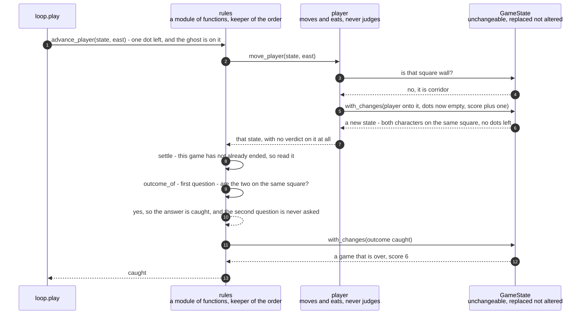

# Eating the last dot on the ghost's square is a loss and not a win

**Priority: `MEDIUM`** — this decides the ending of every game, so it runs after every move either character makes. It is `MEDIUM` rather than `HIGH` because the picture and the controls survive a fault here entirely: the game plays perfectly and simply finishes with the wrong word on the screen. [What the priorities mean](SCENARIO_INDEX.md#what-the-priorities-mean).

There is one arrangement of a game where two requirements[^codes] both apply and
disagree. The player has one dot left. The ghost is standing on it. The player
steps onto that square and eats it.

Requirement END-2 says the game is won when the last dot is eaten, and the last
dot has just been eaten. Requirement END-1 says the game is lost the moment the
player and the ghost stand on the same square, and they are now on the same
square. Both are true at once, and the player cannot have both endings.

Requirement END-3 settles it in one sentence: "eating the last dot on the square
the ghost is standing on is a loss, not a win: meeting the ghost is decided
first."

**That sentence is a requirement about the order two questions are asked in, and
the order is the whole of the requirement.** So the order lives in one named
function with the two questions one after the other, rather than emerging from
wherever the checks happen to sit in the loop. This is caution C6[^cautions], and
the reasoning behind it is that an order which is an accident of control flow is
an order a later change can silently reverse. Nothing would fail. The word on the
screen would just be wrong, in a situation that arises perhaps once in a hundred
games.

It is worth seeing how small the difference is. Swap those two lines and **every
end-of-game check still passes except one**: this exact arrangement. Every other
loss is still a loss, because the dots have not run out. Every other win is still
a win, because the characters are not on the same square. This single state is
the entire difference between a correct program and a wrong one, which is why it
has a function of its own and a document of its own.

There is one more thing to say, and it explains why this arrangement can happen
at all. It is only reachable because of a decision made when a game is set up:
**the player's starting square is the only one left without a dot, and the ghost's
square is not excepted.** So the ghost begins standing on a dot, and a dot can
still be underneath it at the very end. If the ghost's square were cleared at the
start, the last dot could never be under the ghost and this requirement would
describe something that could never happen.

| Class | What it represents, and its part in this scenario |
|---|---|
| [`rules`](../../terminalgame/domain/rules.py) | A module of plain functions rather than a class. In this scenario it is the **judge, and the keeper of the order**. [`outcome_of`](../../terminalgame/domain/rules.py#L55) asks the two questions in the fixed order, and it is a pure reading of the game: it changes nothing and it cannot ask how the game came to look this way, which is exactly why requirement END-1 can say "whether the player walked into the ghost or the ghost walked into the player" |
| [`player`](../../terminalgame/domain/player.py) | A module with one function and one error. In this scenario it is the **mover that deliberately does not judge**. [`move_player`](../../terminalgame/domain/player.py#L55) moves the player and eats the dot and then **stops**. It never writes down how the game stands, because deciding that here would put the order in a second place |
| [`GameState`](../../terminalgame/domain/game_state.py#L97) | Everything true of a game at one moment, unchangeable[^immutable] once made. In this scenario it is the **arrangement being judged**. The two things the judge looks at are where the two characters are and how many dots are left, and both are simply read off it |
| [`Outcome`](../../terminalgame/domain/game_state.py#L60) | How a game stands: playing, caught or cleared. In this scenario it is the **verdict**, and it has three settings and no fourth. Once it is not *playing*, it never changes again for the rest of the run |

## Two questions, in the order that decides the ending

| Step | Message | What is going on |
|---:|---|---|
| 1 | [`advance_player`](../../terminalgame/domain/rules.py#L87)`(state, east)` - one dot left, and the ghost is on it | This is the unit the loop calls, so that "check after every move" is built into the step rather than being something the caller has to remember. The same shape of step exists for the ghost, and it asks the same question afterwards, which is why it never matters which of the two was moving |
| 2 | [`move_player`](../../terminalgame/domain/player.py#L55)`(state, east)` | The moving happens here and the judging does not. Keeping them apart is the whole reason the order can live in exactly one place |
| 3 | is that square wall? | Checked first, before anything else, so that a blocked move cannot half-happen. Here the way is open |
| 4 | no, it is corridor | The ghost being on that square makes no difference to whether the move is allowed. Walking onto the ghost is a perfectly legal move — it is what the move *means* that ends the game, and that is decided afterwards |
| 5 | [`with_changes`](../../terminalgame/domain/game_state.py#L128)`(player onto it, dots now empty, score plus one)` | The last dot goes. The player is now standing exactly where the ghost is. **Note what is not in this list: how the game stands.** The move deliberately leaves that unwritten |
| 6 | a new state - both characters on the same square, no dots left | The arrangement the requirement is about, and it exists for exactly one instant before it is judged |
| 7 | that state, with no verdict on it at all | Handed back with the outcome still reading *playing*, because the moving step never writes it. For this one instant the game holds an arrangement that is both a win and a loss, and the next step is what settles which |
| 8 | [`settle`](../../terminalgame/domain/rules.py#L72) - this game has not already ended, so read it | A game that has **already** ended is handed straight back untouched, and that guard is not tidiness. Reading a finished game again could change its ending: the verdict is worked out purely from where the characters are and how many dots are left, so re-reading a won game whose ghost had since wandered onto the player would report it as lost. A game keeps the ending it got |
| 9 | [`outcome_of`](../../terminalgame/domain/rules.py#L55) - first question - are the two on the same square? | **The line this document exists for.** Requirement END-1, and it comes first. Requirement END-3 is precisely the statement that this line comes before the next one |
| 10 | yes, so the answer is caught, and the second question is never asked | The second question — are there any dots left — would answer "none", and if it were asked first the same game would be recorded as a win. The player ate every dot in the maze and still lost, which is what the requirement asks for |
| 11 | [`with_changes`](../../terminalgame/domain/game_state.py#L128)`(outcome caught)` | Written once. From here on nothing moves: both the player's move and the ghost's move refuse to do anything to a game that is over |
| 12 | a game that is over, score 6 | Run against the real code on a small maze written out by hand, with five dots already eaten and the sixth under the ghost. The score counts the last dot — it **was** eaten, and requirement SCORE-2 says every dot eaten adds one. Losing does not take it back |
| 13 | caught | Which is the word the bottom row will show, along with the final score |

The same two questions decide every other ending too, and it is worth seeing how
the ordinary cases fall out of the same two lines. When the ghost walks into the
player, the first question answers yes and the game is lost — the same question,
reached from the other direction, which is why requirement END-1 does not need the
program to know who moved. When the player eats the last dot anywhere else in the
maze, the first question answers no, the second answers "none left", and the game
is won. There is no third branch and no special case anywhere.

This is also the point where the drawing order of the final picture earns its
keep. The player and the ghost are on the same square, and the picture has to show
something. It shows the ghost, because the ghost is drawn after the player. That
is a separate requirement, END-4, kept in the drawing code rather than here —
this module has no idea the game is drawn at all.

## Related scenarios

- [An arrow key moves the player one square and eats the dot it lands on](an-arrow-key-moves-the-player-one-square-and-eats-the-dot-it-lands-on.md)
  — the ordinary version of the same move, where the second question is the one
  that answers and the game carries on.
- [A new game puts the player in the middle, the ghost far away, and a dot on every other square](a-new-game-puts-the-player-in-the-middle-the-ghost-far-away-and-a-dot-on-every-other-square.md)
  — the decision that makes this arrangement reachable at all: the ghost's square
  keeps its dot.
- [A clock tick moves the ghost, which is never told where the player is](a-clock-tick-moves-the-ghost-which-is-never-told-where-the-player-is.md)
  — the other route to the very same question, and the reason it does not matter
  which character was moving.
- [The status row shows the score and the keys that still work](the-status-row-shows-the-score-and-the-keys-that-still-work.md)
  — where the verdict decided here appears on the screen, and what changes about
  the bottom row once it has been decided.

### Footnotes

[^codes]: A **requirement code** is a short name such as `WIN-2` or `GHOST-1`
    given to one sentence of
    [the specification](../FUNCTIONAL_REQUIREMENTS.md). There are 49 of them,
    in ten groups, and the group name says what the sentence is about: `GAME`,
    `WIN` for the window, `SCRN` for what is on screen, `MAZE`, `START`, `CTRL`
    for the controls, `GHOST`, `SCORE`, `END` for how a game finishes, and
    `STAT` for the bottom row. They are quoted throughout the code as well as
    in these documents, so a reader who finds `CTRL-3` in a comment can look up
    the exact sentence it is keeping.

[^cautions]: A **caution** is a numbered warning in
    [the architecture document](../ARCHITECTURE.md), written before any code
    existed, about something known to be easy to get wrong — `C1` is "never act
    on the front window", `C9` is "redraw the whole frame each pass, not dirty
    cells". Each names one specific way this program could break rather than
    giving general advice, and several of them are quoted in the code at the
    exact line that obeys them.

[^immutable]: An **unchangeable** value is one that cannot be altered after it
    is made. If something different is wanted, an entirely new one is built
    instead — here by
    [`with_changes`](../../terminalgame/domain/game_state.py#L128), which copies
    everything and replaces only what was named. Two things follow that this
    game relies on. Nobody can alter a game state that somebody else is holding,
    so the ghost's policy cannot quietly change a state it was only asked to look
    at. And "nothing at all happened" can be checked by asking whether the very
    same object came back, instead of listing everything that did not change and
    hoping the list is complete.
