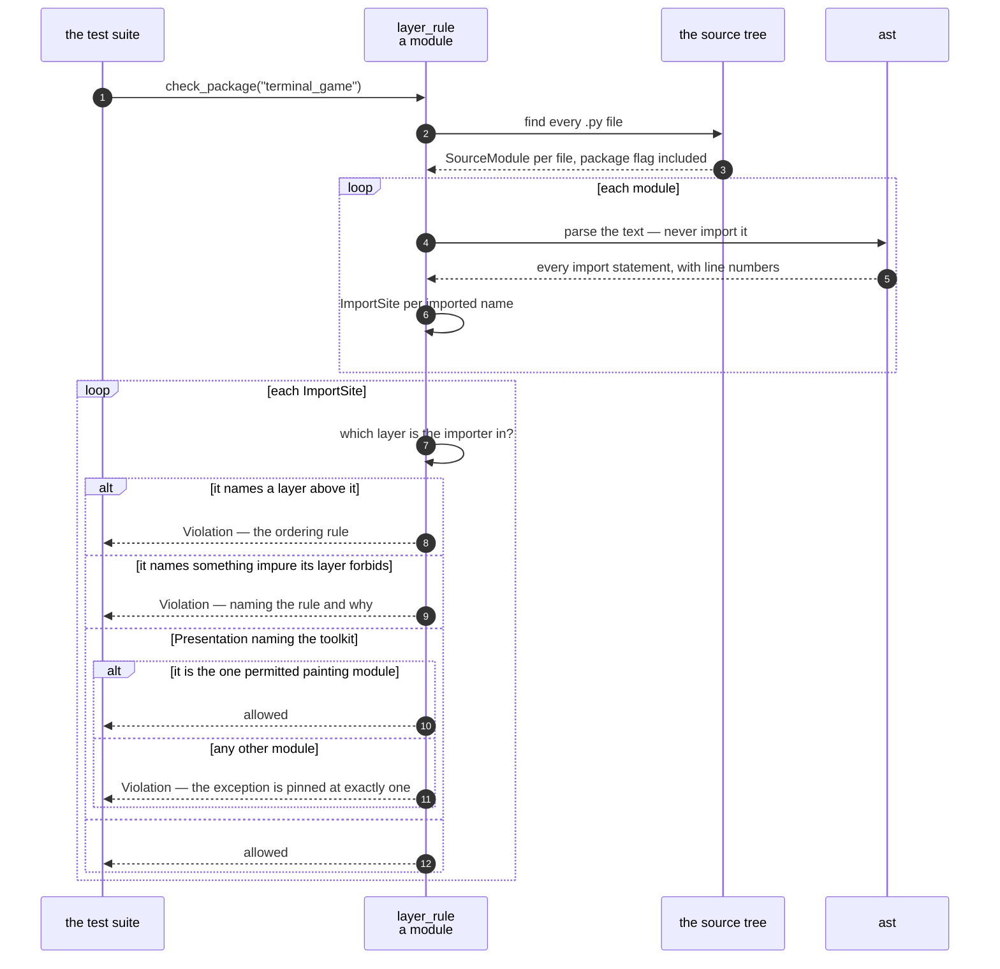

# Every import in the tree is checked against the layer rule

**Priority: `LOW`** — it runs under a tool in `tools/` rather than in the game, and nothing a player does reaches it. [What the priorities mean](SCENARIO_INDEX.md#what-the-priorities-mean).

Low priority, and one of the most consequential things in the repository. The
plan states the layer rule in prose and then says why it is also a test:

> *"A sentence remembers what was true once and nothing re-runs it."*

[`tools/layer_rule.py`](../../tools/layer_rule.py) is the part that re-runs it.

## The rule, with the arrow reading "may import"

```
shell  →  presentation  →  application  →  domain
```

and, on top of the ordering, four purity rules:

| Layer | May not name |
| --- | --- |
| **Domain** | any toolkit, clock, filesystem, environment, process — **or a module-level random source**. Randomness arrives as an argument |
| **Application** | any toolkit, and any clock. A tick arrives as a call |
| **Presentation** | the toolkit, from every module except exactly one — [`PAINTING_MODULE`](../../tools/layer_rule.py#L45) |
| **Shell** | nothing is forbidden. It owns the window and the event loop |

Those are not stylistic. Each one is why some part of the program can be tested
without a window: the Domain's purity is why every maze rule can be exercised
thousands of times in a suite that opens nothing, and Application's is why a
whole game can be driven beat by beat with no real time passing.

## It reads the source; it does not import it

[`scan`](../../tools/layer_rule.py#L270) parses every `.py` file under the
package with `ast`. That is the whole reason it works: **it can judge a module
that would open a window if it were imported.** A checker that imported the
tree to inspect it would have to run the thing it is checking.

It also means nothing in the game imports this and nothing here imports the
game — the tool and its subject are strangers, which is the only way the tool
can be trusted about a module that is broken.

## Three types, and why each earns its place

[`ImportSite`](../../tools/layer_rule.py#L122) carries the importing module, the
name imported, **the line number**, and what kind of import statement it was. A
layering violation is fixed by editing one line, and a report that names the
module without naming the line makes the reader search for it.

[`Violation`](../../tools/layer_rule.py#L136) carries the site, **which rule**
was broken, and a reason in words. Both halves matter: the rule name makes
violations countable and lets a test assert that a *specific* rule caught
something; the reason is what the person who broke it reads. The difference
between *"layer violation"* and *"Application may name no clock; a tick arrives
as a call"* is the difference between a puzzle and an instruction.

[`SourceModule`](../../tools/layer_rule.py#L147) carries a flag for whether the
file is a package, and that is not bookkeeping. `from . import x` resolves
differently in `foo/__init__.py` than in `foo/bar.py`, and getting it wrong
would either invent a violation or miss one.

## The one exception, pinned at one

Presentation must paint something eventually, so exactly one module may name the
toolkit. It is named once, in one constant, so **renaming it is a one-line
change and widening it is not** — the suite asserts that the number of modules
enjoying the exception is one.

That is the shape that makes an exception safe: not "be careful", but "the
exception is a value, and something counts it".

## The gap this closed

An earlier version of this guard checked only that the Domain imported nothing
from above it. Measured against a deliberately wrong tree, **a module under
`application` that imported both `presentation` and `shell` passed every rule** —
the guard was about one layer while the rule was about four.

That is the argument for a guard that walks the whole chain rather than
defending the layer somebody was most worried about. The rule has four arrows;
a checker that enforces one of them is not a weaker version of the rule, it is
a different rule with the same name.

| Participant | What it represents, and its part in this scenario |
| --- | --- |
| [`layer_rule`](../../tools/layer_rule.py) | A module and three types. In this scenario it is **the rule made executable**, over source text rather than over imports |
| [`ImportSite`](../../tools/layer_rule.py#L122) | One import, and where it was written. In this scenario it is **what makes a report actionable** |
| [`Violation`](../../tools/layer_rule.py#L136) | A forbidden import, and why. In this scenario it is **the output**, written for the person who has to fix it |
| [`SourceModule`](../../tools/layer_rule.py#L147) | A file found under the package. In this scenario it is **what relative imports are resolved against** |



## Related scenarios

- **A field is painted onto the canvas, touching only the cells that changed** —
  the one module the toolkit exception is for.
- **A tick moves the ghost, which is never told where the player is** — what the
  Domain's purity rule buys.

### Footnotes

[^codes]: Requirement codes are the specification's own, in
    [`docs/FUNCTIONAL_REQUIREMENTS.md`](../FUNCTIONAL_REQUIREMENTS.md).
