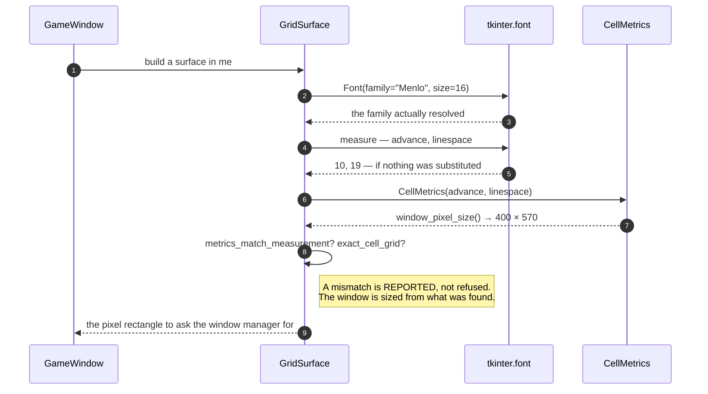

# The font is measured at start-up, and the window's size is derived from what was found

**Priority: `MEDIUM`** — it runs once per game, and a wrong answer changes how the window looks rather than whether it runs. [What the priorities mean](SCENARIO_INDEX.md#what-the-priorities-mean).

WIN-2[^codes]: *"the window is exactly 40 characters wide and 30 rows deep, in a
fixed-width typeface large enough to read comfortably, on a black background."*

**Under this architecture that size is derived, not native.** There is no
terminal to be told "40 columns". There is a pixel rectangle computed from the
font's cell metrics — and a font substitution silently changes it. The plan
calls the calculation load-bearing, and this is that calculation.

## Two numbers, and everything follows from them

**Advance** is how far the pen moves after one character; **linespace** is how
far it moves after one line.

```
Menlo 16  →  advance 10, linespace 19  →  40 × 30 cells is 400 × 570 pixels
```

[`CellMetrics`](../../terminal_game/presentation/metrics.py#L72) is deliberately
**the part with no toolkit in it**. The arithmetic can be checked exhaustively
in a suite that never opens a window, and only the two numbers it starts from
have to come from a real font.

Both must be positive, and the check is not pedantry: a zero or negative cell
would give every cell in a row the same origin, and the picture would be **one
column of overprinted characters** rather than a grid.

## The recorded measurement is not a substitute for measuring

[`MEASURED_MENLO_16`](../../terminal_game/presentation/metrics.py#L190) records
what was measured. The surface does **not** use it:
[`GridSurface`](../../terminal_game/presentation/surface.py#L115) measures the
real font at construction and derives the window from what it finds.

That is the important half. **A font substitution therefore changes the window
rather than being papered over**, and
[`metrics_match_measurement`](../../terminal_game/presentation/surface.py#L236)
is how a caller finds out that it happened. The constant exists so the pure
tests, the window's size test and anyone reading the plan have an expected
answer to compare against — not so that anything can skip the measurement.

**Nothing refuses to start.** A substituted font gives a differently sized
window and a reportable mismatch, not an error. That is a deliberate position:
the program prefers to run and say so over refusing to run at all, and the
requirement it might then be missing is visible rather than hidden.

## Why the size is 16 and not "whatever looks big enough"

[`EXACT_GRID_CEILING`](../../terminal_game/presentation/metrics.py#L69) records
a second measurement, and it is the reason the size is a constant with an
argument behind it.

**At 16 and below, a 40-character row drawn as one string lands on the same
pixels as 40 characters placed one cell at a time. Above 16 it does not** —
drifts of up to 18 px across a row were measured at 17 and above.

So below the ceiling a painter may place per cell, per row, or per changed cell
and get the same picture. **Raising the font size past it would cost the painter
that freedom** and force every cell to be placed individually. The constant is
there so that whoever raises it finds out why they should not, rather than
discovering a 40th column that is half a character out.

[`exact_cell_grid`](../../terminal_game/presentation/surface.py#L246) checks the
running font against that, so the freedom the painter relies on is verified
rather than assumed.

## Menlo, and how it was chosen

One family, measured across **180 families on this machine**: the only one that
owns every glyph the game draws with **no substitution anywhere**. That matters
because the wall glyphs are double-line box-drawing characters and the actors
are block elements, and a family that substitutes for any one of them draws a
grid with one cell subtly the wrong width.

The size, unlike the family, is a judgement — assumption P4, *"large enough to
read comfortably"*, which no test can settle. A human looks at it, and if the
answer is no, one constant changes.

| Participant | What it represents, and its part in this scenario |
| --- | --- |
| [`metrics`](../../terminal_game/presentation/metrics.py) | A module and one class. In this scenario it is **WIN-2 as arithmetic**, with no toolkit in it |
| [`CellMetrics`](../../terminal_game/presentation/metrics.py#L72) | Advance and linespace. In this scenario it is **the whole derivation** — window size, cell origins, cell bounds |
| [`GridSurface`](../../terminal_game/presentation/surface.py#L115) | The canvas. In this scenario it is **the only thing that measures a real font**, and what reports a mismatch |
| [`GameWindow`](../../terminal_game/shell/window.py#L81) | The window. In this scenario it is **what asks for the resulting rectangle** |



## Related scenarios

- **A field is painted onto the canvas, touching only the cells that changed** —
  the painter whose freedom the ceiling protects.
- **The window is opened withdrawn, dressed, placed, and only then shown** —
  what is done with the rectangle.

### Footnotes

[^codes]: Requirement codes are the specification's own, in
    [`docs/FUNCTIONAL_REQUIREMENTS.md`](../FUNCTIONAL_REQUIREMENTS.md).
