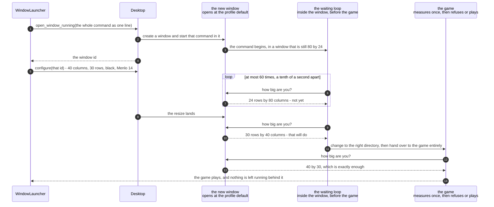

# The game waits for its window to reach 40 by 30 before it starts drawing

**Priority: `LOW`** — this guards against a race that, on the machine it was measured on, is currently won by half a second. It does nothing at all on a normal run. It exists so that the ordinary way in does not fail for a reason that has nothing to do with the player. [What the priorities mean](SCENARIO_INDEX.md#what-the-priorities-mean).

There is a gap in the launcher's work that is easy to miss, and it has real
consequences. The instruction that creates the window **also starts the game in
it**, at the moment of creation. The instruction that makes the window 40 columns
by 30 rows — which is requirement WIN-2[^codes] — runs afterwards. So for a short while there is a game running in a
window that is still whatever shape the player's profile opens at — and on an
untouched profile that is 80 by 24, which is six rows short of what the game
needs.

The game checks its size once, at the very beginning, and refuses loudly if the
terminal is too small. That is correct behaviour and this document is not about
changing it. It is about not **provoking** it by accident. A player who did
nothing wrong would otherwise see the game refuse to start, in a window the
program itself had just made the wrong size, for a fraction of a second.

The fix is a small waiting loop that runs in the window before the game does. It
asks the terminal how big it is, and if it is not yet big enough it waits a tenth
of a second and asks again. There are three properties it must have, and all
three are deliberate:

- **It is bounded.** Sixty attempts a tenth of a second apart, so six seconds at
  the very most. Nothing in this program waits for ever.
- **It always falls through.** When the six seconds run out it starts the game
  anyway. It does not give up and it does not report a failure. That matters: on
  a screen that genuinely is too small, the game must still get to run and must
  still get to refuse for itself, with its own readable message. A gate that
  refused on the game's behalf would be a second answer to a question that
  already has one.
- **It hands over completely.** Each step replaces the one before rather than
  running underneath it, right down to the game itself. If anything were left
  alive behind the game, the window would never fall quiet, and the launcher
  could never safely close it.

The race is currently won without any of this, and by a comfortable margin — the
resizing was measured finishing 0.496 seconds before the launched program could
first look at the terminal. But it is won by how long a login shell takes to
start, which is an accident of one machine's settings rather than anything the
program controls. That is a fact to be grateful for, not one to build on.

| Class | What it represents, and its part in this scenario |
|---|---|
| [`game`](../../launcher/game.py) | A module of plain functions rather than a class, and the seam between the two programs. In this scenario it is the **author of the command**. [`game_command`](../../launcher/game.py#L127) returns the whole thing as a piece of text, so that the three facts worth checking — which module is started, whether the waiting is bounded, and whether the handover survives — are all facts about a string a test can read |
| [`script`](../../launcher/script.py) | A module of plain functions, each returning the text of one instruction for the desktop. In this scenario it is the **carrier**. [`open_window_running`](../../launcher/script.py#L155) wraps the command up and puts the word that replaces the shell in front of it, and [`applescript_string`](../../launcher/script.py#L67) refuses to carry certain characters, for a reason given below |
| [`WindowLauncher`](../../launcher/lifecycle.py#L112) | The policy, and the owner of the window. In this scenario it is the **other half of the race**. [`open`](../../launcher/lifecycle.py#L154) creates the window and then resizes it, in that order, and it is the gap between those two that the waiting loop covers |
| [`TerminalSession`](../../terminalgame/screen/curses_adapter.py#L166) | Raw mode for as long as the game runs. In this scenario it is the **thing being protected from a false alarm**. It measures the terminal once and refuses if the answer will not do, and this whole document exists so that the answer it gets is the settled one |

## A window that starts at 80 by 24 and becomes 40 by 30 while the game waits

| Step | Message | What is going on |
|---:|---|---|
| 1 | [`open_window_running`](../../launcher/script.py#L155)`(the whole command as one line)` | **One line**, and that is forced rather than chosen. The command is carried inside a piece of text in the instruction sent to the desktop, and [control characters are refused outright](../../launcher/script.py#L67) rather than being escaped. The reason is that the command ends up being typed into a shell, so a line ending in the middle of it would run a second command that nobody wrote. There is no legitimate reason for one to be there, so it is refused |
| 2 | create a window and start that command in it | Both at once, in a single instruction. There is no moment between the two at which somebody else's window could arrive and be mistaken for this one |
| 3 | the command begins, in a window that is still 80 by 24 | **The gap this document is about.** The game has been started. The window has not yet been told what shape to be |
| 4 | the window id | The launcher now has the window's identity and can act on it. Everything from here names that number |
| 5 | `configure(that id)` - 40 columns, 30 rows, black, Menlo 14 | The resize, and everything else the window is supposed to look like. This is the instruction the waiting loop is waiting for, though neither knows anything about the other — they are in different programs and share nothing at all |
| 6 | how big are you? | Asked by a small shell loop, not by the game. It reads the size from the terminal itself rather than from any environment setting, so it needs nothing to have been set up beforehand |
| 7 | 24 rows by 80 columns - not yet | Too short by six rows. The loop waits a tenth of a second and asks again. If the asking should fail for any reason, [the answer is read as zero](../../launcher/game.py#L94), which simply fails the comparison and costs one more turn round a loop that is bounded anyway |
| 8 | the resize lands | From the launcher, in the other program. The two halves never speak to each other — one simply stops seeing the old answer |
| 9 | how big are you? | Asked again after another tenth of a second. Neither half of this knows about the other: the loop is simply asking the terminal, and the answer changes because something in a different program resized the window underneath it |
| 10 | 30 rows by 40 columns - that will do | The loop ends. Had it not ended, six seconds would have run out and the next step would have happened regardless |
| 11 | change to the right directory, then hand over to the game entirely | The directory change is needed because the window runs a fresh login shell starting in the player's home folder, where the game cannot be found. The handover is the important half: the shell is **replaced** by the game rather than waiting around for it |
| 12 | how big are you? | The game's own single measurement, and by now the answer has settled |
| 13 | 40 by 30, which is exactly enough | No margin. The window is 40 by 30 because the picture is |
| 14 | the game plays, and nothing is left running behind it | The handover at every step is what makes this true, and it matters far beyond this document: the launcher decides it is safe to close the window by asking what is running in it, and an answer of "nothing" is only trustworthy if nothing was left behind |

There is one design decision here worth stating on its own, because it looks like
a small thing and is not. **The launcher never loads the game's code.** The game
is named as [a piece of text](../../launcher/game.py#L62) and started as a
separate program, never called directly, and there is a test that says so. The
reason is that two programs which share no code cannot grow into each other. If
the launcher could call the game, somebody would eventually have the game move its
own window, and then two different parts of the system would be in charge of the
same window — which is the failure this whole design is arranged to avoid.

## Related scenarios

- [The launcher asks where the player was looking, and then opens the game's window](the-launcher-asks-where-the-player-was-looking-and-then-opens-the-games-window.md)
  — the other side of the race, in the other program, and where the creating and
  resizing steps above come from.
- [A terminal too small to hold the picture is refused before a game starts](a-terminal-too-small-to-hold-the-picture-is-refused-before-a-game-starts.md)
  — what the waiting loop exists to avoid provoking by accident, and what still
  happens when the screen genuinely is too small.
- [The launcher closes the window it created, once nothing is running in it](the-launcher-closes-the-window-it-created-once-nothing-is-running-in-it.md)
  — why "nothing is left running behind it" matters at the end of a game as much
  as it does at the start.

### Footnotes

[^codes]: A **requirement code** is a short name such as `WIN-2` or `GHOST-1`
    given to one sentence of
    [the specification](../FUNCTIONAL_REQUIREMENTS.md). There are 49 of them,
    in ten groups, and the group name says what the sentence is about: `GAME`,
    `WIN` for the window, `SCRN` for what is on screen, `MAZE`, `START`, `CTRL`
    for the controls, `GHOST`, `SCORE`, `END` for how a game finishes, and
    `STAT` for the bottom row. They are quoted throughout the code as well as
    in these documents, so a reader who finds `CTRL-3` in a comment can look up
    the exact sentence it is keeping.
