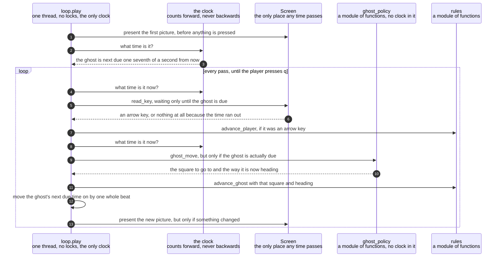

# The key read's timeout is recomputed every pass so the ghost keeps its beat

**Priority: `HIGH`** — this is the beat of the whole game. Every key and every ghost move goes through it, several times a second, for as long as anyone is playing. If it is wrong the ghost slows down, speeds up or stops, and nothing else in the program would notice. [What the priorities mean](SCENARIO_INDEX.md#what-the-priorities-mean).

Two things happen in this game without waiting for each other. The ghost moves
about seven times a second on its own. The player moves when they press an arrow
key, which might be twice in a second or not at all for a minute. Requirement
GHOST-1[^codes] says the ghost moves "whether or not the player is moving", and
that one phrase is the hardest thing in the game to get right.

The usual way to have two things happen at once is to run them on two threads.
This game does not. **It has one thread and no locks anywhere in it**, and the
two are reconciled by arithmetic instead. The trick is small and worth stating in
one sentence: the loop waits for a key, and the length of time it is willing to
wait is *exactly the time remaining until the ghost is next due to move*. If a
key arrives before then, it is dealt with straight away and the ghost's moment
still arrives on time. If no key arrives, the waiting runs out at precisely the
moment the ghost is due. Either way, the ghost keeps its beat.

The value of that is not only that it works. It is that there is nothing to go
wrong in the ways threads go wrong. There is no shared information that two
parts of the program could change at the same time, nothing to lock, and no
ordering that depends on which of two things happened to run first. The game
behaves the same way every time it is played.

Two tempting shortcuts both break it, and both break it **quietly**, which is
why this has a caution of its own — C7[^cautions]. Waiting a **fixed** length of
time for a key means every key press restarts the wait, so a player holding an
arrow down could freeze the ghost completely. Sleeping for a fixed length of time
instead means a key that arrives early is not noticed until the sleep ends, so
the game feels sluggish in exactly the moments it should not. Neither would be
caught by a test that pressed keys on a tidy schedule.

| Class | What it represents, and its part in this scenario |
|---|---|
| [`loop`](../../terminalgame/application/loop.py) | A module of plain functions rather than a class, and the whole of the Application layer. In this scenario it is the **timekeeper**. [`play`](../../terminalgame/application/loop.py#L113) is the only code in the game that knows what a clock is. It holds no rules at all: whether a move is allowed, where the ghost goes and whether the game has ended are all asked of the Domain rather than decided here. What this module owns is **when** |
| [`Screen`](../../terminalgame/screen/port.py#L314) | The port[^port], standing in for the real terminal. In this scenario it is the **stopwatch that also listens**. [`read_key`](../../terminalgame/screen/port.py#L343) is the single place in the program where any time passes at all, and it does two jobs at once: it waits, and it reports a key if one arrives while it is waiting |
| [`ghost_policy`](../../terminalgame/domain/ghost_policy.py) | A module of plain functions. In this scenario it is the **consultant**. It is asked where the ghost should go and answers immediately. It has no clock in it and could not have one, because nothing in the Domain is allowed to know about time |
| [`rules`](../../terminalgame/domain/rules.py) | A module of plain functions. In this scenario it is the **judge of what a move meant**. [`advance_player`](../../terminalgame/domain/rules.py#L87) and [`advance_ghost`](../../terminalgame/domain/rules.py#L99) each carry out one move and then read the outcome, so "check after every move" is not something the loop has to remember to do |
| [`GameState`](../../terminalgame/domain/game_state.py#L97) | Everything true of a game at one moment, and unchangeable[^immutable] once made. In this scenario it is the **marker of whether anything happened**. The loop redraws only when the state it now holds is a *different object* from the one already on the screen, and that comparison works because every step in the Domain hands back the very same object when nothing changed |

## One pass of the loop, timed from the clock rather than from the last pass

| Step | Message | What is going on |
|---:|---|---|
| 1 | present the first picture, before anything is pressed | Requirement START-5 — "the game is under way the moment the window opens". There is no title screen and nothing to press to begin. The picture is up and the clock is already counting before the loop has read a single key |
| 2 | what time is it? | The clock used counts steadily forwards and is never adjusted, which matters because a clock that can be set backwards — by the machine correcting itself against the network, say — could make the ghost's next due moment appear to be in the past or wildly in the future |
| 3 | the ghost is next due one seventh of a second from now | One seventh of a second is [`TICK_SECONDS`](../../terminalgame/application/loop.py#L65), which comes from GHOST-1's "about seven times a second". Worked out exactly it is 142.86 thousandths of a second. The word "about" in the requirement is taken seriously: this is a target rather than a promise, and a beat that arrives late is absorbed rather than made up for |
| 4 | what time is it now? | Asked again, every single pass. This is the whole of caution C7 in one line |
| 5 | `read_key`, waiting only until the ghost is due | **The one line this document exists for.** The length of the wait is worked out fresh each time as the time remaining until the ghost is due, so a key press cannot postpone the ghost and the ghost cannot swallow a key press. A wait that has already run out is [treated as no wait at all](../../terminalgame/screen/port.py#L343) rather than as "wait forever", because a loop that waits forever has stopped being a loop |
| 6 | an arrow key, or nothing at all because the time ran out | Both answers are ordinary and the loop treats neither as unusual. Nothing at all simply means the player did not press anything in the fraction of a second available, which is what happens most of the time |
| 7 | `advance_player`, if it was an arrow key | Anything that is not one of the four arrows and is not `q` is [discarded](../../terminalgame/application/loop.py#L87), which is requirement CTRL-5. "Discarded" means exactly what it sounds like: the loop does not look at it again. There is deliberately **no check here for whether the game has already ended**. The Domain refuses to move a finished game, that refusal has the Domain's own tests behind it, and a second copy of the check here would be the one that quietly rotted |
| 8 | what time is it now? | Asked a second time in the same pass, and this is not waste. Time has passed since the last reading — a key was read, and possibly a move was made — and the question being answered now is a different one: not "how long may I wait" but "is the ghost due yet" |
| 9 | `ghost_move`, but only if the ghost is actually due | The check that the ghost is due is what makes this a beat rather than a stampede. The further check that the game is not already over is an **improvement, not a rule**: without it the loop would ask for a ghost move, draw on the random source to work one out, and then throw it away. [Delete that check and the loop is still correct](../../terminalgame/application/loop.py#L113), which is exactly the test of whether something is a rule or a saving |
| 10 | the square to go to and the way it is now heading | The ghost is asked where to go, not told. What it decides is the subject of its own scenario, listed below. Notice what is **not** passed to it: the player's position |
| 11 | `advance_ghost` with that square and heading | The move is carried out and the outcome read, in one step, so that the check for the game having ended happens after *every* move by either character rather than in some places and not others |
| 12 | move the ghost's next due time on by one whole beat | The due time is moved on by [one whole beat from where it already was](../../terminalgame/application/loop.py#L99), never set to "now plus a beat". That distinction is the difference between a ghost that keeps time and one that drifts slower and slower, because the second version adds the loop's own working time onto the interval every time round |
| 13 | present the new picture, but only if something changed | The comparison is between *objects*, not contents. Every step in the Domain hands back the very same object it was given when nothing happened, so a press into a wall produces a state the loop can see is unchanged without comparing 261 dots. This is also the whole of how the last picture of a finished game stays on the screen: once a game is over nothing changes, so nothing is drawn |

A machine that stalls — a laptop closed for an hour — is handled by catching the
due time up to the present **without** playing the missed beats. A burst of ghost
moves to make up lost ground would throw the ghost right across the maze, which
is worse than having missed them. Measured from the code: with the ghost due at
ten seconds and the clock reading thirteen, twenty-one beats were missed, and the
next due time comes back as 13.14 seconds — one beat ahead of now, with all
twenty-one dropped.

There is no illustration in this document, and that is a decision rather than an
omission. What this scenario is about is durations, and a drawing of a duration
either has to be to scale, which turns it into a chart that says nothing the
numbers above do not, or it is not to scale, in which case it is a picture
asserting something it cannot show. The two numbers that matter — one seventh of
a second, and "the time remaining until that" — are already in the text.

## Related scenarios

- [An arrow key moves the player one square and eats the dot it lands on](an-arrow-key-moves-the-player-one-square-and-eats-the-dot-it-lands-on.md)
  — what happens inside the player's move above, and the only thing in the game
  a player can make happen.
- [A clock tick moves the ghost, which is never told where the player is](a-clock-tick-moves-the-ghost-which-is-never-told-where-the-player-is.md)
  — what happens inside the ghost's move above, and why the list of things
  handed to it is the whole of a requirement.
- [A game state is composed into a 40 by 30 frame with the ghost drawn last](a-game-state-is-composed-into-a-40-by-30-frame-with-the-ghost-drawn-last.md)
  — what "present the new picture" turns into, and where a state becomes
  characters.
- **A finished game keeps the ending it got and stops redrawing** — `MEDIUM`.
  The same loop after the outcome is decided, where the last two steps above
  both stop happening and neither needs a check of its own to stop.

*(The unlinked entry above is a document not written yet.)*

### Footnotes

[^codes]: A **requirement code** is a short name such as `WIN-2` or `GHOST-1`
    given to one sentence of
    [the specification](../FUNCTIONAL_REQUIREMENTS.md). There are 49 of them,
    in ten groups, and the group name says what the sentence is about: `GAME`,
    `WIN` for the window, `SCRN` for what is on screen, `MAZE`, `START`, `CTRL`
    for the controls, `GHOST`, `SCORE`, `END` for how a game finishes, and
    `STAT` for the bottom row. They are quoted throughout the code as well as
    in these documents, so a reader who finds `CTRL-3` in a comment can look up
    the exact sentence it is keeping.

[^cautions]: A **caution** is a numbered warning in
    [the architecture document](../ARCHITECTURE.md), written before any code
    existed, about something known to be easy to get wrong — `C1` is "never act
    on the front window", `C9` is "redraw the whole frame each pass, not dirty
    cells". Each names one specific way this program could break rather than
    giving general advice, and several of them are quoted in the code at the
    exact line that obeys them.

[^port]: The **screen port** is the small set of things the game is allowed to
    ask of a screen: how big are you, give me a blank picture, show this picture,
    and wait a stated length of time for a key. It is
    [`Screen`](../../terminalgame/screen/port.py#L314), and it names those three
    operations plus the size, and nothing else. A **port** in this sense is a
    boundary written as a list of operations, with the real implementation kept
    on the far side of it, so that everything on the near side can be exercised
    by standing something simpler in its place.

[^immutable]: An **unchangeable** value is one that cannot be altered after it
    is made. If something different is wanted, an entirely new one is built
    instead — here by
    [`with_changes`](../../terminalgame/domain/game_state.py#L128), which copies
    everything and replaces only what was named. Two things follow that this
    game relies on. Nobody can alter a game state that somebody else is holding,
    so the ghost's policy cannot quietly change a state it was only asked to look
    at. And "nothing at all happened" can be checked by asking whether the very
    same object came back, instead of listing everything that did not change and
    hoping the list is complete.
