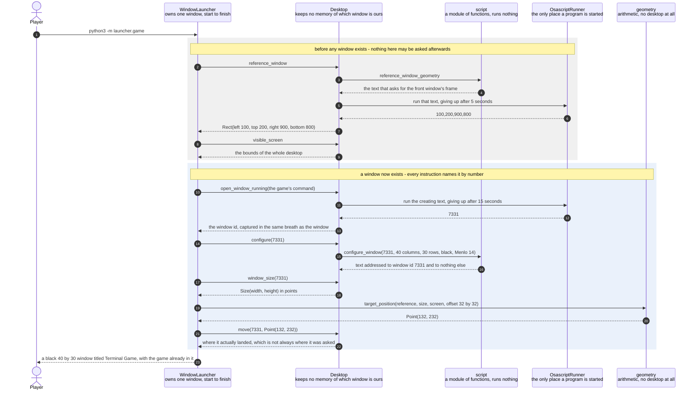

# The launcher asks where the player was looking, and then opens the game's window

**Priority: `HIGH`** — this is the only route by which the game ever appears on screen. The player runs the launcher and nothing else. If this collaboration is wrong there is no window, or there is a window in the wrong place with the wrong shape, and no game can be played in it. [What the priorities mean](SCENARIO_INDEX.md#what-the-priorities-mean).

The player types `python3 -m launcher.game`. A new terminal window opens a
little below and to the right of whatever they were last looking at. It is
titled *Terminal Game*, it is exactly 40 characters wide and 30 rows deep, it is
black, and the game is already running inside it.

The value of this scenario is that the player is never asked to prepare
anything. They do not size a window, choose a font, or pick a colour. The
requirement codes[^codes] WIN-1 to WIN-4 make the window the program's
responsibility rather than the player's, and this is where that responsibility
is discharged. It is also the part of the system with the least room for error,
because it drives an application that belongs to somebody else.

The whole collaboration turns on one rule about **order**, and a second rule
about **naming**. The order rule is that the launcher must ask the desktop where
the player was looking **before** it creates anything. The moment the game's own
window exists, that window is the one at the front — so a launcher that asked
afterwards would be measuring itself, and every game would open in the same
place as the last one. The naming rule is that once the window exists, every
later instruction must name it by the identity captured at the moment of
creation. This is caution C1[^cautions] in the architecture document, and the
reason for it is uncomfortable: the player's own shells are windows of the very
same application. An instruction that said "the front window" could size, retitle
or close a window the player was working in.

The work is split across four parts so that almost none of it needs a desktop to
be checked. [`geometry`](../../launcher/geometry.py) is arithmetic and nothing
else. [`script`](../../launcher/script.py) builds text and runs none of it.
[`OsascriptRunner`](../../launcher/runner.py#L30) is the single place in the
whole system where another program is started. Only that last one needs a real
machine, which is why the ordering rule and the placement rule can both be
tested with no window anywhere near them.

| Class | What it represents, and its part in this scenario |
|---|---|
| [`WindowLauncher`](../../launcher/lifecycle.py#L112) | The policy: the order things must happen in, and the owner of exactly one window for the whole life of a game. In this scenario it is the **director**. [`open`](../../launcher/lifecycle.py#L154) is the only code in the program that decides what happens before a window exists and what happens after, and the blank line in the middle of it is the boundary between the two |
| [`Desktop`](../../launcher/desktop.py#L16) | The adapter: it turns each thing the launcher wants into a piece of script, hands it over to be run, and turns the answer back into a number or a rectangle. In this scenario it is the **translator**. It holds no memory of which window is the game's — every method takes the window it is to act on — and that absence is what makes caution C1 checkable rather than merely promised |
| [`script`](../../launcher/script.py) | A module of plain functions rather than a class. Each one returns the text of an instruction for the desktop, and runs nothing at all. In this scenario it is the **author**. Exactly one of its functions looks at anything positional, [`reference_window_geometry`](../../launcher/script.py#L99), and that one runs before any window exists. Every other one takes a window number and [addresses it by number](../../launcher/script.py#L83). There is no way to name a window by its place on screen, because no such function was ever written |
| [`OsascriptRunner`](../../launcher/runner.py#L30) | The seam: the one place a second program is started. In this scenario it is the **messenger**. [`run`](../../launcher/runner.py#L47) feeds the script text in and hands the answer back, and it puts a time limit around every single call, because an instruction that never returns would leave the launcher stuck with a window already open on the player's desktop |
| [`geometry`](../../launcher/geometry.py) | A module of plain arithmetic, with four small value types and one calculation. In this scenario it is the **surveyor**. [`target_position`](../../launcher/geometry.py#L91) works out where the new window goes, and it does so without any idea that a desktop exists |

## Asking first, creating second, and naming the window ever after

| Step | Message | What is going on |
|---:|---|---|
| 1 | `python3 -m launcher.game` | This is the whole of what a player does. The launcher is a separate program from the game, and it never loads the game's code — [the game is named as a piece of text](../../launcher/game.py#L62) and started as a separate program in the new window. That separation is deliberate. If the launcher could load the game, somebody would eventually have the game move its own window, and then two different parts of the program would be in charge of the same thing |
| 2 | `reference_window` | "The window the player was last looking at." This must happen now and can never happen later. It is the whole reason [`open`](../../launcher/lifecycle.py#L154) has a blank line and a comment in the middle of it rather than being written in whatever order reads nicely |
| 3 | `reference_window_geometry` | Reading another application's window needs a permission the player grants once, called Accessibility. If they refuse, this step fails — and a refusal is not a reason to give up on the game. What happens instead has a scenario of its own, listed below |
| 4 | the text that asks for the front window's frame | The instruction is a **return value**, not something that happened. That is the point of splitting the writing of an instruction from the running of it. The dangerous fact about an instruction to the desktop is not whether some method got called, it is **which window the instruction names** — and when the text is a return value, a test can read it and say so |
| 5 | run that text, giving up after 5 seconds | Five seconds comes from [`QUERY_TIMEOUT`](../../launcher/script.py#L53). Every single call is bounded, which is caution C4. There are two bounds, one inside the other: the instruction carries its own limit, and the runner puts [three further seconds](../../launcher/runner.py#L41) around the program on top. The inner one should always fire first and give a message somebody can read. The outer one is there for when it does not |
| 6 | `100,200,900,800` | Everything comes back as plain text and has to be turned into numbers here. On this machine, windows can sit at negative positions: a display placed to the left of the main one has negative coordinates, and a terminal window was measured sitting at x = -879. Any arithmetic that assumed positions start at zero would throw the game window onto a different screen |
| 7 | `Rect(left 100, top 200, right 900, bottom 800)` | Four numbers become a named rectangle. Top and left, because on this desktop the y coordinate grows **downwards** from the top of the main display, which is the opposite of the direction most people expect |
| 8 | `visible_screen` | The outer bound of the whole desktop. On a machine with two displays this is the smallest rectangle covering both, so much of it may be over no display at all — it was measured as `-3509,-1440,1611,982` on the development machine. So it is not a promise that a point inside it is visible. It only stops a window being put somewhere absurd. The real promise comes from the reference window, in the step after next |
| 9 | the bounds of the whole desktop | Four more numbers, parsed the same way. This is the last question that can be asked before a window exists, and after it the launcher knows everything about the player's desktop that it is ever going to know |
| 10 | `open_window_running(the game's command)` | The window is created and the game is started inside it in one instruction. There is no moment between the two at which somebody else's window could arrive and become "the newest one" |
| 11 | run the creating text, giving up after 15 seconds | Fifteen seconds, from [`CREATE_TIMEOUT`](../../launcher/script.py#L52), and it is the longest limit in the launcher by three times. Creating a window means starting a fresh login shell, and on this machine that shell's own start-up scripts were measured taking over a second before the game's command even begins |
| 12 | `7331` | The window's identity, captured at the moment of creation. The instruction that creates a window is handed back the *tab* it started the command in, and the terminal application offers no way to ask a tab which window it is in — so the window is found by asking which window contains that exact tab. That is still identity and not a guess about position, because the tab is the one this very instruction just made, and no other window can contain it |
| 13 | the window id, captured in the same breath as the window | The number is carried back up to the policy layer and kept there. The adapter deliberately does **not** remember it: [every one of its methods takes the window it is to act on](../../launcher/desktop.py#L16), so there is no "current window" anywhere for anything to drift onto |
| 14 | `configure(7331)` | Everything WIN-2 and WIN-3 ask for, applied to that number and to nothing else |
| 15 | `configure_window(7331, 40 columns, 30 rows, black, Menlo 14)` | The font is set **before** the grid, so that the window's size in points has settled by the time anyone measures it two steps later. Every setting is applied to the window's own tab rather than to one of the player's saved profiles. A profile would outlive the game, and assumption A3 forbids changing one. Menlo is chosen because it comes with the system, so nothing has to be installed, and because it carries the double-line and block characters the picture needs |
| 16 | text addressed to `window id 7331` and to nothing else | This is caution C1 made structural rather than promised. Every instruction after creation is written by a function that takes a window number, and there is no function anywhere that can name a window any other way |
| 17 | `window_size(7331)` | Measured rather than calculated. How many points 40 characters of Menlo 14 occupy depends on the font, on the display and on the terminal's own spacing, and none of those are things the launcher should be guessing at |
| 18 | `Size(width, height)` in points | The answer is in points rather than characters, because that is what the placement arithmetic needs — it is positioning a rectangle on a desktop, not a character in a grid |
| 19 | `target_position(reference, size, screen, offset 32 by 32)` | Pure arithmetic, which is why the whole of WIN-4 can be checked with no desktop. Thirty-two points comes from [`DEFAULT_OFFSET`](../../launcher/geometry.py#L77). It is a little over the height of one title bar, so the window behind stays readable and the new one is unmistakably offset from it |
| 20 | `Point(132, 232)` | Three rules were applied in order, and each can only move the window, never resize it. Start below and to the right. Then refuse to let that carry the new window's top-left corner outside the **reference window's own frame** — and that is the one part of the placement that is a guarantee rather than a good intention. The player was just looking at that window, so every point inside it is over a real display, which means the new window's title bar and close button land somewhere reachable. Then pull the whole window back onto the screen if the screen is big enough to hold it |
| 21 | `move(7331, Point(132, 232))` | Named by number again, like every instruction since creation |
| 22 | where it actually landed, which is not always where it was asked | The launcher records **where the window went**, not where it asked it to go. The desktop keeps a window on the display it is on, and it was measured doing exactly that here: a window asked for y = -1353, on a display above the main one, arrived at y = 30 instead. Recording the arithmetic instead of the outcome would leave the launcher believing something about the player's desktop that is not true |
| 23 | a black 40 by 30 window titled Terminal Game, with the game already in it | The game has in fact been running since the window was created, several instructions ago, and at that moment the window was still whatever size the player's profile opens at. What the game does about that gap has a scenario of its own, listed below |

The two coloured bands mark the one boundary that matters here, and it is not a
boundary between two threads — this program has only one. It is a boundary in
**time**. Above it, no window of the game's exists, and questions about what is
at the front can be trusted. Below it, one does, and they cannot. Every
instruction below the line names a number instead.

This document describes the path where everything works. Two other outcomes
share this cast and are drawn separately rather than as branches here: the
desktop refusing to say where the player was looking, and setting up failing
after the window already exists.

## Related scenarios

- [The launcher closes the window it created, once nothing is running in it](the-launcher-closes-the-window-it-created-once-nothing-is-running-in-it.md)
  — the other end of the same window's life, using the same captured number, and
  the one operation in the launcher that can take a game away from a player who
  is still playing it.
- [The game waits for its window to reach 40 by 30 before it starts drawing](the-game-waits-for-its-window-to-reach-40-by-30-before-it-starts-drawing.md)
  — what happens on the far side of the creating step, in the gap between the
  game starting and the window being given its shape.
- **A desktop that will not say where the player was looking gets a default
  position** — `LOW`. The same cast with the asking step refused, which turns
  into a documented default rather than a failure to start.
- **Setting up fails after the window already exists, and the launcher takes it
  back** — `LOW`. Caution C3: the window is dealt with before the error is,
  because an abandoned window is left on the player's desktop for them to find.

*(The unlinked entries above are documents not written yet.)*

### Footnotes

[^codes]: A **requirement code** is a short name such as `WIN-2` or `GHOST-1`
    given to one sentence of
    [the specification](../FUNCTIONAL_REQUIREMENTS.md). There are 49 of them,
    in ten groups, and the group name says what the sentence is about: `GAME`,
    `WIN` for the window, `SCRN` for what is on screen, `MAZE`, `START`, `CTRL`
    for the controls, `GHOST`, `SCORE`, `END` for how a game finishes, and
    `STAT` for the bottom row. They are quoted throughout the code as well as
    in these documents, so a reader who finds `CTRL-3` in a comment can look up
    the exact sentence it is keeping.

[^cautions]: A **caution** is a numbered warning in
    [the architecture document](../ARCHITECTURE.md), written before any code
    existed, about something known to be easy to get wrong — `C1` is "never act
    on the front window", `C9` is "redraw the whole frame each pass, not dirty
    cells". Each names one specific way this program could break rather than
    giving general advice, and several of them are quoted in the code at the
    exact line that obeys them.
