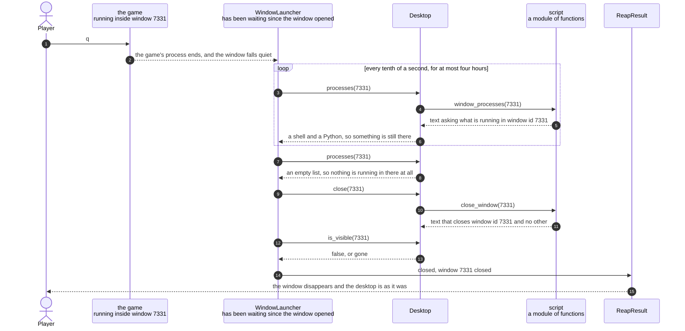

# The launcher closes the window it created, once nothing is running in it

**Priority: `HIGH`** — this is the only route by which the game's window is ever given back, and it is the one operation in the program that can take a game away from a player who is still playing it. It did exactly that once. [What the priorities mean](SCENARIO_INDEX.md#what-the-priorities-mean).

The player presses `q`. The game stops. A moment later the window it was playing
in disappears by itself, and the player is left with the desktop they started
with. Nothing has to be closed by hand.

That is requirement WIN-5[^codes], and the value of it is tidiness: the program
opened a window that the player did not ask for, so the program is the thing
that should take it away again. But the step that makes it work is not the
closing. It is the **question asked before the closing**, which is "is anything
still running in that window?"

The reason that question matters so much is unpleasant and worth stating plainly.
Closing a terminal window that still has a program running in it does not simply
close it. It puts a message on the screen asking whether the player is sure, and
that message can only be dismissed by a person sitting at the machine. Worse,
while it is up, every further instruction the launcher sends to the desktop
waits behind it. So one wrong answer does not produce one wrong result. It stops
the launcher altogether, in a way that needs a human to unstick. This is caution
C2[^cautions].

**This program got that question wrong once, and the way it got it wrong is the
most useful thing in this document.** The terminal application offers a property
on a tab called `busy`, which sounds exactly like the answer. It is not. Setting
a window's number of columns and rows — which WIN-2 requires, and which the
launcher therefore does to every window it creates — makes `busy` report *false*
for the whole life of the program running in it. The launcher believed the game
had finished the moment it started, closed the window with the player still in
it, and reported success. It was measured twice: the game alive from 0.9 seconds
to 8.4 seconds with `busy` saying false from 0.9 seconds onwards, and again
against the real game with a shell and a Python still running on to 4.2 seconds and nine
lying readings in a single run. The fix was not to stop using `busy`. It was to
**delete it**, so that one question has exactly one answer in the system.

| Class | What it represents, and its part in this scenario |
|---|---|
| [`WindowLauncher`](../../launcher/lifecycle.py#L112) | The policy, and the owner of this one window from creation to closing. In this scenario it is the **gatekeeper**. [`reap`](../../launcher/lifecycle.py#L231) is the only code that closes a window, and it will not do so until [`wait_until_idle`](../../launcher/lifecycle.py#L209) says it is safe. It is also written never to raise, because it is the same code that runs when something has already gone wrong, and an error of its own would bury the error it was called to tidy up after |
| [`Desktop`](../../launcher/desktop.py#L16) | The adapter that turns a wanted thing into an instruction and an answer back into a value. In this scenario it is the **enquirer**. [`processes`](../../launcher/desktop.py#L62) is the single way this program asks whether anything is still running, and the comment above it records that there used to be a second way and what deleting it cost to learn |
| [`script`](../../launcher/script.py) | A module of plain functions, each returning the text of one instruction. In this scenario it is the **author of a question and of an ending**. [`window_processes`](../../launcher/script.py#L281) asks what is running, and [`close_window`](../../launcher/script.py#L336) closes one window by number. Where a second way of asking used to sit there is now [only one](../../launcher/script.py#L281), and a comment in its place saying why the other went — a deleted thing that mattered leaves a note behind it |
| [`ReapResult`](../../launcher/lifecycle.py#L77) | What happened when the launcher tried to get rid of its own window. In this scenario it is the **report**. It carries whether the window went, and a sentence saying why not when it did not, including the window's number so that a person can finish the job the launcher refused to do |

## Waiting for the window to fall quiet, and only then closing it

| Step | Message | What is going on |
|---:|---|---|
| 1 | `q` | The one key that leaves a game, in upper or lower case, at any point — during play and after the game has already been won or lost alike. Nothing else ends a game. The game does not decide how long it lives and neither does the launcher: [a note in the launcher](../../launcher/game.py#L83) records that the command it started is no longer bounded by anything it controls, which is correct for a game a person may stare at for an hour, and is only safe because of the waiting described here |
| 2 | the game's process ends, and the window falls quiet | The window falls **completely** quiet, and that is arranged rather than lucky. When the window was created, the game's command was prefixed with a word that replaces the login shell instead of running underneath it. Without that, the shell would still be sitting there after the game ended, the window would never go quiet, and the launcher could never safely close it. So the list of what is running goes genuinely **empty**, and empty is an answer that needs no interpreting |
| 3 | `processes(7331)` | The question, and the only version of it that exists. It reads the list of programs running in that window's tab. What makes this the right question and `busy` the wrong one is written up in the module itself: `busy` needs both the grid **and** the real game to start lying, so a simple test command will not show the fault however the window is set up — and WIN-2 makes the grid unavoidable |
| 4 | `window_processes(7331)` | Named by number, like every instruction after creation. It is written to survive the window having already gone: a window that no longer exists answers with an empty list, because nothing is running in a window that is not there, and that is the same answer as "it has finished" for every purpose the launcher has |
| 5 | text asking what is running in `window id 7331` | Bounded at [five seconds](../../launcher/script.py#L53), like every instruction the launcher sends. Nothing in this program is allowed to wait forever, and this loop is the place where that rule is most obviously earning its keep |
| 6 | a shell and a Python, so something is still there | This is the answer for almost the whole life of a game. The launcher does not try to recognise the names — it does not ask whether `Python` is *the game*. It only asks whether the list is empty. Matching names would mean keeping a list of what the game might be called, and being wrong about that would mean closing a window with something in it |
| 7 | `processes(7331)` | The same question again, a tenth of a second later. The waiting is a plain repeated ask rather than anything cleverer, because there is nothing here to be told by: the window belongs to another application, and the game is not even a direct child of this program, so there is no process to wait on. Asking again is the only honest way to find out |
| 8 | an empty list, so nothing is running in there at all | The moment this scenario has been waiting for. Because the login shell was replaced rather than left underneath, empty means empty |
| 9 | `close(7331)` | The window goes. This is the first and only instruction in the whole collaboration that changes anything, and it runs exactly once, after the question above has been answered safely |
| 10 | `close_window(7331)` | The text names one window by number. There is no function in this module that could close a window any other way, which is caution C1 again — and it matters more here than anywhere, because the player's own shells are windows of the same application and closing one of those would take their work with it |
| 11 | text that closes `window id 7331` and no other | Bounded at [ten seconds](../../launcher/script.py#L54), like every instruction that changes something. It is worth noticing that this text is built by the same kind of function as all the others, and that it offers no way at all to name a window except by its number |
| 12 | `is_visible(7331)` | The launcher checks that the window actually went rather than assuming it did. It asks whether the window is *visible* rather than whether it *exists*, because the terminal application keeps a window object around after a close, and it was measured answering that it was no longer visible while still being addressable |
| 13 | false, or gone | Two different answers that mean the same thing here. A window that cannot be asked about at all is reported as gone, and gone is also not visible |
| 14 | closed, window 7331 closed | The report is a value rather than a printed line, so that the program that started all this can decide what to do. It comes back [zero when the window was closed and one when it was left open](../../launcher/game.py#L175), which is how an unattended run can tell the difference |
| 15 | the window disappears and the desktop is as it was | What the player sees. The whole of WIN-5 |

Two limits bound the waiting, and they are very different sizes on purpose.
After a game that ran normally the launcher will wait
[four hours](../../launcher/lifecycle.py#L33). That is not a deadline anybody
should ever reach — a game lasts as long as the player wants — but caution C4
says nothing waits forever, so it is finite and it has a way out. After setting
up has already failed, it waits [two seconds](../../launcher/lifecycle.py#L40)
instead. The failure happened milliseconds after the window was made, so either
the shell has not got going yet and will be quiet almost at once, or a game is
running and waiting for a player, in which case waiting longer changes nothing
and only delays the report.

When the wait runs out, **the launcher does not close the window.** It gives
back a report saying so, naming the window's number, and explaining in the
report itself that a window with something running in it was left open on
purpose. That is the right way round. A window left on the desktop is untidy and
a person can close it. A message on the screen that only a person can dismiss,
with every later instruction stuck behind it, is worse than untidy.

## Related scenarios

- [The launcher asks where the player was looking, and then opens the game's window](the-launcher-asks-where-the-player-was-looking-and-then-opens-the-games-window.md)
  — the other end of this window's life, and where the number used in every
  instruction above was captured.
- [The terminal is put into raw mode and given back on every way out](the-terminal-is-put-into-raw-mode-and-given-back-on-every-way-out.md)
  — what the game does on its own side in the moment between `q` and the window
  falling quiet, and why it matters that it finishes tidily even though the
  window is about to be taken away.
- [The key read's timeout is recomputed every pass so the ghost keeps its beat](the-key-reads-timeout-is-recomputed-every-pass-so-the-ghost-keeps-its-beat.md)
  — where the `q` in the first step is actually noticed, and the only place in
  the game that can end a session.

### Footnotes

[^codes]: A **requirement code** is a short name such as `WIN-2` or `GHOST-1`
    given to one sentence of
    [the specification](../FUNCTIONAL_REQUIREMENTS.md). There are 49 of them,
    in ten groups, and the group name says what the sentence is about: `GAME`,
    `WIN` for the window, `SCRN` for what is on screen, `MAZE`, `START`, `CTRL`
    for the controls, `GHOST`, `SCORE`, `END` for how a game finishes, and
    `STAT` for the bottom row. They are quoted throughout the code as well as
    in these documents, so a reader who finds `CTRL-3` in a comment can look up
    the exact sentence it is keeping.

[^cautions]: A **caution** is a numbered warning in
    [the architecture document](../ARCHITECTURE.md), written before any code
    existed, about something known to be easy to get wrong — `C1` is "never act
    on the front window", `C9` is "redraw the whole frame each pass, not dirty
    cells". Each names one specific way this program could break rather than
    giving general advice, and several of them are quoted in the code at the
    exact line that obeys them.
